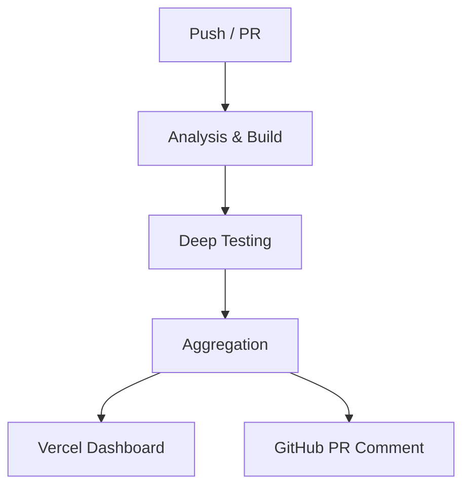

# JMRP.io (Astro v7)

<!-- Project & Status -->


[](https://github.com/jmrplens/jmrp.io/pulls)
[](https://jmrp-ci-reports.vercel.app)

<!-- Code Quality -->

[](https://github.com/jmrplens/jmrp.io/actions/workflows/ci.yml)
[](https://sonarcloud.io/summary/new_code?id=jmrplens_jmrp.io)

<!-- Performance & Security -->

[](https://developer.mozilla.org/en-US/observatory/analyze?host=jmrp.io)
[](https://pagespeed.web.dev/analysis?url=https%3A%2F%2Fjmrp.io%2F)

This is the source code for my personal website, **[jmrp.io](https://jmrp.io)**, built with **Astro 7**. It features a high-performance static architecture, robust security headers (including a strict CSP), and a focus on accessibility and modern web standards.

## 📑 Table of Contents

- [Features](#-features)
- [Tech Stack](#-tech-stack)
- [Project Structure](#-project-structure)
- [Getting Started](#-getting-started)
- [Quality Assurance](#-quality-assurance)
- [Deployment](#-deployment)
- [Security & Nginx](#-security--nginx)
- [LaTeX CV Compilation](#-latex-cv-compilation)
- [License](#-license)

---

## 🚀 Features

- **Performance**:
  - **Lighthouse Performance**: 100 on desktop; 92-99 on mobile.
  - **Core Web Vitals**: LCP < 0.8s, CLS < 0.031, FCP < 0.3s.
  - **SSG (Static Site Generation)**: All pages pre-rendered at build time.
  - **Islands Architecture**: Minimal JavaScript with Preact islands.
  - **Image Optimization**: WebP/AVIF format with responsive sizing.
  - **UnoCSS**: Atomic CSS engine with `presetWind4` for minimal and ultra-fast styles.
  - **Icon Consistency**: Custom verification engine ensuring 1:1 mapping between icons and CSS rules.
  - **CSS Inlining**: Critical CSS inlined for sub-second FCP.
- **Accessibility**:
  - **WCAG 2.2 AA Compliance**: Automated testing via Playwright + Axe-core.
  - **HTML5 Compliance**: Strict HTML validation (`html-validate`).
  - **Motion Sensitivity**: Respects `prefers-reduced-motion` settings.
- **Content**:
  - **Content Layer API**: Advanced content management (Content Layer API).
  - **Technical Blog**: Support for MDX, LaTeX (MathJax), and Mermaid diagrams (SSR rendered).
  - **Bilingual (EN/ES)**: Full i18n with Astro's built-in routing, `hreflang` alternates, and a language switcher with automatic browser language detection.
  - **Interactive Tools**: 14 privacy-first browser tools (security, network, developer utilities).
  - **Unified CV**: Dynamic CV generation with automated LaTeX-to-PDF compilation.
- **Security**:
  - **CSP (Content Security Policy)**: Nonce-only strategy with strict-dynamic.
  - **SRI (Subresource Integrity)**: Automated hash generation for all local resources.
  - **Security Headers**: HSTS, X-Frame-Options, COOP, COEP, CORP, Permissions-Policy.
- **DevOps & QA**:
  - **CI Health Dashboard**: Premium unified report interface hosted on Vercel.
  - **Living PR Comments**: Real-time CI status updates directly in GitHub Pull Requests.
  - **Deep Security**: Automated SonarCloud analysis and `pnpm audit` on every commit.

## 🛠️ Tech Stack

- **Framework**: [Astro v7](https://astro.build/) (Vite 8 / Rolldown)
- **UI Components**: [Preact](https://preactjs.com/) (islands only)
- **Styling**: [UnoCSS](https://unocss.dev/) (`presetWind4`) & CSS Custom Properties
- **Content**: [MDX](https://mdxjs.com/), [Mermaid](https://mermaid.js.org/) (SSR), [MathJax](https://www.mathjax.org/) (SSR)
- **Icons**: [Iconify](https://icon-sets.iconify.design/) (12 collections)
- **Syntax Highlighting**: [Shiki](https://shiki.style/) (with custom RouterOS grammar)
- **Testing**: [Playwright](https://playwright.dev/), [Axe-core](https://www.deque.com/axe/), [Lighthouse](https://developers.google.com/web/tools/lighthouse)
- **Linting**: [ESLint](https://eslint.org/), [Stylelint](https://stylelint.io/), [Prettier](https://prettier.io/), [CSpell](https://cspell.org/)
- **Security**: [SonarCloud](https://sonarcloud.io/), CSP Nonce-only strategy
- **CI/CD**: GitHub Actions & Vercel (Reports)

## 📂 Project Structure

<details>
<summary>Click to expand folder structure</summary>

```text
/
├── src/
│   ├── components/       # Reusable Astro & Preact components
│   │   ├── apps/         # Interactive tool components (vanilla JS)
│   │   ├── ui/           # 36 reusable UI components
│   │   ├── layout/       # BaseHead, Header, Footer, LanguageDetector
│   │   ├── homelab/      # Preact islands (real-time data)
│   │   ├── blog/         # PostCard, PostGrid, TagCloud
│   │   ├── cv/           # CV-specific components
│   │   └── pages/        # Full page components
│   ├── content/          # Content Collections (Blog, Tools, CV, Config)
│   ├── content.config.ts # Collection Definitions (Content Layer)
│   ├── i18n/             # Internationalization (EN/ES translations)
│   ├── integrations/     # Pre-build & post-build pipelines
│   ├── layouts/          # Page layouts (Base, Tool)
│   ├── pages/            # File-based routing
│   ├── styles/           # Global CSS & design tokens
│   └── utils/            # Helper functions
├── public/               # Static assets (favicons, PDFs, llms.txt)
├── scripts/              # Build, QA & maintenance scripts
│   └── ci/               # 19 CI automation scripts
├── tests/                # 12 Playwright E2E & Accessibility test suites
├── docs/                 # Extended documentation
├── cv_latex/             # LaTeX source files for CV
├── astro.config.mjs      # Astro configuration
├── uno.config.ts         # UnoCSS configuration
└── package.json          # Dependencies & Scripts
```

</details>

## 🏁 Getting Started

### Prerequisites

- **Node.js (v24.0.0+)**: Required for advanced build and CI features.
- **pnpm (v11.0.0+)**: Required package manager.

### Installation

```bash
# 1. Clone & Install
git clone https://github.com/jmrplens/jmrp.io.git
cd jmrp.io && pnpm install

# 2. Install Playwright Browsers
pnpm exec playwright install --with-deps chromium

# 3. Start development
pnpm run dev
```

### Build & Verify

The project uses a unified verification suite (`pnpm verify`) with 14 sequential steps: typecheck, ESLint, Prettier, Stylelint, build, HTML validation, RSS validation, Schema.org validation, CSpell, broken links, JSDoc coverage, SonarCloud, and Playwright E2E.

```bash
# Full Quality Suite (14 steps, fail-fast)
pnpm verify

# Production Build only
pnpm run build
```

> ⚠️ **Stop `astro dev` before running `pnpm verify`** — the dev server lacks nonces/SRI, causing security tests to fail.

## 🧪 Quality Assurance

This project employs a rigorous testing pipeline culminating in a **CI Health Dashboard**.

### Unified Reporting Architecture

The CI pipeline aggregates all analysis and testing results into a single interactive dashboard.



- **Executive Summary**: High-level overview of project health and critical highlights.
- **Bundle Analysis**: Tracks JS/CSS size with a generous **8MB threshold** for heavy technical content.
- **Accessibility Matrix**: Parallel tests for Light/Dark themes and Mobile/Desktop form factors.
- **Static Analysis**: Real-time feedback from ESLint, Stylelint, Prettier, CSpell, and JSDoc.
- **Security Audit**: Integrated SonarCloud and `pnpm audit` monitoring.

## 🔒 Security & Nginx

Advanced Nginx configuration for high-security environments.

- **CSP (Content Security Policy)**: Nonce-only strategy with `strict-dynamic` for CSP compliance.
- **SRI (Subresource Integrity)**: Automated hash generation for all local resources.
- **Astro v7 Nonce Patch**: Custom Vite plugin to ensure CSP compliance with Astro's prefetch system.
- **Automated Deployment**: Post-build script verifies Nginx config and deploys security snippets atomically.
- **Security Headers**: HSTS (2 years), X-Content-Type-Options, X-Frame-Options, COOP, COEP, CORP, Permissions-Policy.

## 📄 LaTeX CV Compilation

Automated LaTeX compilation for professional PDF resumes. See [CV LaTeX Documentation](cv_latex/README.md) for details.

## 📜 License

Two licenses, because this repository holds two different kinds of work.

| What                                                            | License                                                   |
| --------------------------------------------------------------- | --------------------------------------------------------- |
| Code — components, integrations, build pipeline, scripts, tools | [MIT](LICENSE)                                            |
| Articles, page copy, tool documentation                         | [CC BY 4.0](https://creativecommons.org/licenses/by/4.0/) |
| Blog cover images                                               | [CC BY 4.0](https://creativecommons.org/licenses/by/4.0/) |
| The portrait (`avatar.png`, `me_round.png`)                     | All rights reserved                                       |

The MIT file alone would read as covering the whole tree, including the
articles and the portrait — and being the more permissive of the two, it would
override the terms published on the site. [LICENSE-CONTENT.md](LICENSE-CONTENT.md)
draws the line; <https://jmrp.io/license/> is the authoritative statement.
