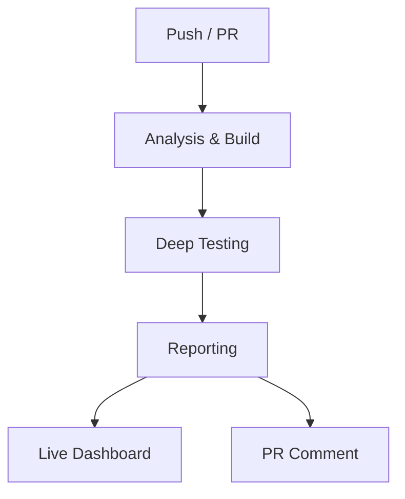
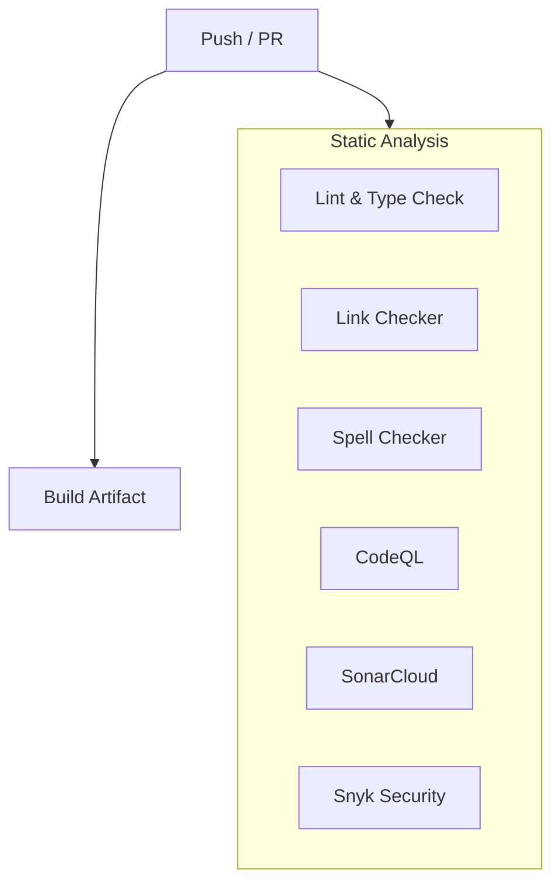
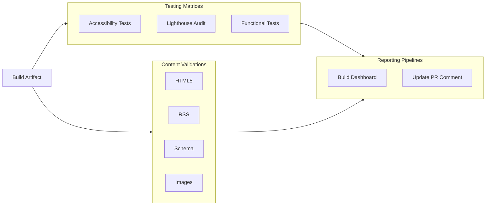

# JMRP.io (Astro v6)

<!-- Project & Status -->


[](https://github.com/jmrplens/jmrp.io/pulls)
[](https://jmrp-ci-reports.vercel.app)

<!-- Code Quality -->

[](https://github.com/jmrplens/jmrp.io/actions/workflows/ci.yml)
[](https://sonarcloud.io/summary/new_code?id=jmrplens_jmrp.io)

<!-- Performance & Security -->

[](https://observatory.mozilla.org/analyze/jmrp.io)


This is the source code for my personal website, **[jmrp.io](https://jmrp.io)**, built with **Astro 6**. It features a high-performance static architecture, robust security headers (including a strict CSP), and a focus on accessibility and modern web standards.

## 📑 Table of Contents

- [Features](#-features)
- [Tech Stack](#-tech-stack)
- [Project Structure](#-project-structure)
- [Getting Started](#-getting-started)
- [Quality Assurance](#-quality-assurance)
- [Deployment](#-deployment)
- [Security & Nginx](#-security--nginx)
- [LaTeX CV Compilation](#-latex-cv-compilation)

---

## 🚀 Features

- **Performance**:
  - **100/100 Google PageSpeed** (Desktop & Mobile).
  - **Core Web Vitals**: LCP < 0.8s, CLS < 0.031, FCP < 0.3s.
  - **SSG (Static Site Generation)**: All pages pre-rendered at build time.
  - **Islands Architecture**: Minimal JavaScript with Preact islands.
  - **Image Optimization**: WebP format with responsive sizing via `vite-plugin-image-optimizer`.
  - **Font Loading**: Optimized with fallback fonts and metric overrides.
  - **CSS Inlining**: Critical CSS inlined, async loading for non-critical.
- **Accessibility**:
  - **Axe-core Testing**: Automated WCAG 2.1 AA validation via Playwright for all pages.
  - **HTML5 Compliance**: Strict HTML validation (`html-validate`).
  - **Lighthouse CI**: Accessibility auditing on every commit.
  - **Inclusive Design**: Keyboard navigation, focus indicators, and unique `aria-labels`.
  - **Motion Sensitivity**: Respects `prefers-reduced-motion` settings.
- **Content**:
  - **Content Layer API**: Uses Content Layer API (stable since Astro v5, mandatory in v6).
  - **Blog**: Technical articles with MDX support and Mermaid diagrams.
  - **RSS Feed**: Automatic generation of `rss.xml` for blog posts.
  - **CV Generation**: Automated LaTeX compilation for PDF resumes.
- **Themeable**: Light/Dark mode with system preference detection.
- **Configurable**: Centralized configuration via YAML files in `src/content/`.
- **SEO Optimized**: Dynamic Schema.org (JSON-LD), Open Graph, and Twitter Cards.

## 🛠️ Tech Stack

- **Framework**: [Astro v6](https://astro.build/)
- **Runtime**: Node.js v22+
- **UI Components**: [Preact](https://preactjs.com/)
- **Styling**: Native CSS (Variables, Nesting) & Astro Scoped Styles
- **Icons**: [Iconify](https://icon-sets.iconify.design/)
- **Testing**: [Playwright](https://playwright.dev/) & [Lighthouse](https://developers.google.com/web/tools/lighthouse)
- **CI/CD**: GitHub Actions

## 📂 Project Structure

<details>
<summary>Click to expand folder structure</summary>

```
/
├── src/
│   ├── components/       # Reusable Astro & Preact components
│   ├── content/          # Content Collections (Blog, CV, Config)
│   ├── content.config.ts # Collection Definitions (Content Layer)
│   ├── layouts/          # Page layouts (Base, etc.)
│   ├── pages/            # File-based routing
│   ├── styles/           # Global CSS & Fonts
│   └── utils/            # Helper functions
├── public/               # Static assets (images, fonts, robots.txt)
├── scripts/              # Build & Maintenance scripts
├── tests/                # Playwright E2E & Accessibility tests
├── cv_latex/             # LaTeX source files for CV
├── astro.config.mjs      # Astro configuration
└── package.json          # Dependencies & Scripts
```

</details>

## 🏁 Getting Started

### Prerequisites

To build and run this project, you need the following tools installed on your system:

- **[Node.js](https://nodejs.org/) (v22.12.0+)**: Required for Astro v6.
- **[pnpm](https://pnpm.io/) (v10.0.0+)**: Required package manager.
- **[Astro CLI](https://docs.astro.build/en/install-and-setup/)**: Recommended for manual tasks (can be run via `pnpm astro`).

### Installation

```bash
# 1. Clone the repository
git clone https://github.com/jmrplens/jmrp.io.git
cd jmrp.io

# 2. Install project dependencies
pnpm install

# 3. Install browser binaries for tests (Playwright)
pnpm exec playwright install --with-deps chromium

# 4. Start development server
pnpm run dev
```

### Build & Verify

The project uses a unified verification suite to ensure everything is correct before deployment.

#### Full Quality Suite

To run the complete pipeline (Linting, Type Checking, Build, and Tests):

```bash
pnpm verify
```

> **Note**: This command requires additional system tools like `typos` and `lychee`. See [CONTRIBUTING.md](CONTRIBUTING.md) for installation details.

#### Production Build

To just generate the production artifacts:

```bash
pnpm run build
```

This command triggers the full build pipeline:

1. **GitHub Synchronization**: Automatically downloads the latest assets (e.g., owner avatar).
2. **Astro Build**: Compiles the site into the `dist/` directory.
3. **Post-Build Optimizations**:
   - **CSS Inlining**: Extracts inline styles to optimized classes.
   - **Asset Relocation**: Converts data URIs to physical files for better caching and CSP compliance.
   - **Security Hardening**: Generates **SHA-512 hashes** for inline CSP content and **SHA-256 hashes** for SRI resources.
   - **Integrity (SRI)**: Pins all subresources for maximum security.
4. **Nginx Integration**:
   - Generates and validates a strict `security_headers.conf`.
   - Automatically reloads the local Nginx service (if detected on a Linux environment).

### Configuration

The project uses environment variables for build-time and runtime configuration. Copy the example file and fill in the values:

```bash
cp .env.example .env
```

Key configuration areas:

- **Nginx Integration**: Automated deployment of security headers.
- **Security Reporting**: Telegram bot integration for CSP/SRI violation reports.
- **Cloudflare**: API tokens for cache purging and web analytics.
- **CI Tools**: Tokens for Snyk and SonarCloud analysis.

See [.env.example](.env.example) for the full list of available variables.

## 🧪 Quality Assurance

This project employs a rigorous testing pipeline to ensure quality and compliance.

### Pipeline Overview

The `pnpm verify` command orchestrates the entire pipeline locally and in CI.



### Phase 1: Parallel Analysis & Build

Static analysis tools run in parallel with the production build to provide fast feedback.



### Phase 2: Deep Testing & Reporting

Once the build is ready, we execute comprehensive testing matrices and generate unified reports.



### Accessibility Testing

We perform comprehensive accessibility checks:

- **Axe-core (via Playwright)**: Scans every page against **WCAG 2.1/2.2 AA** and **Best Practice** rules.
  - **Dual-Theme Matrix**: Tests run in parallel for both **Light** and **Dark** modes to ensure contrast compliance in all contexts.
  - **Unified Dashboard**: Aggregates results into an interactive HTML dashboard deployed to Vercel, providing a single point of review for both themes.
  - **Global SVG Exclusion**: Prevents false positives in diagrams (Mermaid, etc.).
  - Fails the build on any violation.
- **Lighthouse CI**: Runs Lighthouse audits on all pages, enforcing high scores for Accessibility, Performance, and SEO.
  - **Parallel Matrix Execution**: Runs 4 parallel jobs covering **Mobile** & **Desktop** form factors across both **Light** & **Dark** themes.
  - **Unified Dashboard**: Aggregates all results into a single, interactive HTML dashboard deployed to Vercel for easy review.
- **Manual Checks**: The pipeline flags "incomplete" checks (e.g., complex color contrast) for manual review.

### Content Validation

- **HTML Validation**: `html-validate` checks generated HTML for standard compliance and semantic correctness.
- **RSS Validation**: `validate-rss.mjs` ensures the generated `rss.xml` strictly follows RSS 2.0 specifications.
- **Schema.org**: `validate-schema.mjs` verifies the structure of JSON-LD data for SEO.

## 🚀 Deployment

The site is built as a static folder (`dist/`) and can be deployed to any static host. I use **Docker** with **Nginx**.
The CI reports dashboard is automatically deployed to **Vercel** with a permanent link for the `main` branch at [jmrp-ci-reports.vercel.app](https://jmrp-ci-reports.vercel.app).

### Docker

```bash
docker build -t jmrp-io .
docker run -p 8080:80 jmrp-io
```

## 🔒 Security & Nginx

The project includes advanced Nginx configuration for security headers and asset delivery.

- [Main Nginx Configuration Example](examples/nginx/nginx.conf.example)
- [Security Headers Example](examples/nginx/security_headers.conf.example)

### Security Features

- **Reverse Proxy**: Nginx handles internal routing to external services, mitigating CORS and hiding infrastructure details.
- **SRI (Subresource Integrity)**:
  - Modularized protection for all local resources.
  - Automatically calculates hashes for JS, CSS, fonts, and assets.
  - Includes a custom listener for real-time failure tracking.
- **CSP (Content Security Policy)**:
  - **Hybrid Strategy**: Uses strict SHA-512 hashes for static content and `nonce` (injected via Nginx `sub_filter`) for dynamic isolation.
  - **Astro v6 Compatibility**: Patches client-side prerendering logic to propagate nonces correctly.
- **Nginx Automation**:
  - **Auto-Deployment**: The build process verifies and deploys `security_headers.conf` to the system if `POSTBUILD_NGINX_SNIPPETS_PATH` is set.
  - **Custom Verification**: Supports optional config paths via `POSTBUILD_NGINX_CONFIG_PATH` for complex Nginx setups.
  - **Atomic Rollback**: If `nginx -t` fails after a deployment, the script automatically reverts to the previous stable configuration.
- **Incident Reporting**: Real-time Telegram notifications for CSP and SRI violations via a specialized backend.
- **Hardened Headers**: Full HSTS, XFO, and Cross-Origin isolation achieving the maximum score on Mozilla Observatory.

## 📄 LaTeX CV Compilation

The project includes LaTeX source files to generate professional PDF CVs.
For detailed instructions on compilation and prerequisites, please refer to the [CV LaTeX Documentation](cv_latex/README.md).
