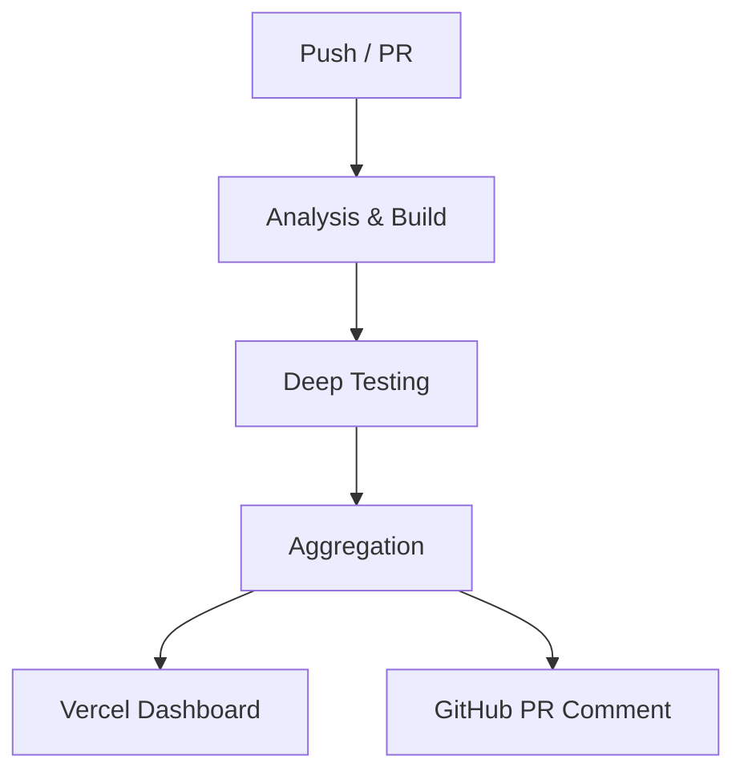

# JMRP.io (Astro v6)

<!-- Project & Status -->


[](https://github.com/jmrplens/jmrp.io/pulls)
[](https://jmrp-ci-reports.vercel.app)

<!-- Code Quality -->

[](https://github.com/jmrplens/jmrp.io/actions/workflows/ci.yml)
[](https://sonarcloud.io/summary/new_code?id=jmrplens_jmrp.io)

<!-- Performance & Security -->

[](https://observatory.mozilla.org/analyze/jmrp.io)


This is the source code for my personal website, **[jmrp.io](https://jmrp.io)**, built with **Astro 6**. It features a high-performance static architecture, robust security headers (including a strict CSP), and a focus on accessibility and modern web standards.

## 📑 Table of Contents

- [Features](#-features)
- [Tech Stack](#-tech-stack)
- [Project Structure](#-project-structure)
- [Getting Started](#-getting-started)
- [Quality Assurance](#-quality-assurance)
- [Deployment](#-deployment)
- [Security & Nginx](#-security--nginx)
- [LaTeX CV Compilation](#-latex-cv-compilation)

---

## 🚀 Features

- **Performance**:
  - **100/100 Google PageSpeed** (Desktop & Mobile).
  - **Core Web Vitals**: LCP < 0.8s, CLS < 0.031, FCP < 0.3s.
  - **SSG (Static Site Generation)**: All pages pre-rendered at build time.
  - **Islands Architecture**: Minimal JavaScript with Preact islands.
  - **Image Optimization**: WebP format with responsive sizing via `vite-plugin-image-optimizer`.
  - **UnoCSS**: Atomic CSS engine with `presetWind4` for minimal and ultra-fast styles.
  - **Icon Consistency**: Custom verification engine ensuring 1:1 mapping between icons and CSS rules.
  - **CSS Inlining**: Critical CSS inlined for sub-second FCP.
- **Accessibility**:
  - **WCAG 2.1 AA Compliance**: Automated testing via Playwright + Axe-core.
  - **HTML5 Compliance**: Strict HTML validation (`html-validate`).
  - **Motion Sensitivity**: Respects `prefers-reduced-motion` settings.
- **Content**:
  - **Content Layer API**: Advanced content management (Standard in Astro v6).
  - **Technical Blog**: Support for MDX, LaTeX (Mathjax), and Mermaid diagrams (SSR rendered).
  - **Unified CV**: Dynamic CV generation with automated LaTeX-to-PDF compilation.
- **DevOps & QA**:
  - **CI Health Dashboard**: Premium unified report interface hosted on Vercel.
  - **Living PR Comments**: Real-time CI status updates directly in GitHub Pull Requests.
  - **Deep Security**: Automated SonarCloud analysis and `npm audit` on every commit.

## 🛠️ Tech Stack

- **Framework**: [Astro v6 (Beta)](https://astro.build/)
- **UI Components**: [Preact](https://preactjs.com/)
- **Styling**: [UnoCSS](https://unocss.dev/) & Native CSS
- **Content**: [MDX](https://mdxjs.com/), [Mermaid](https://mermaid.js.org/), [MathJax](https://www.mathjax.org/)
- **Icons**: [Iconify](https://icon-sets.iconify.design/)
- **Testing**: [Playwright](https://playwright.dev/), [Axe-core](https://www.deque.com/axe/), [Lighthouse](https://developers.google.com/web/tools/lighthouse)
- **Security**: [SonarCloud](https://sonarcloud.io/)
- **CI/CD**: GitHub Actions & Vercel (Reports)

## 📂 Project Structure

<details>
<summary>Click to expand folder structure</summary>

```
/
├── src/
│   ├── components/       # Reusable Astro & Preact components
│   ├── content/          # Content Collections (Blog, CV, Config)
│   ├── content.config.ts # Collection Definitions (Content Layer)
│   ├── layouts/          # Page layouts (Base, etc.)
│   ├── pages/            # File-based routing
│   ├── styles/           # Global CSS & Fonts
│   └── utils/            # Helper functions
├── public/               # Static assets (images, fonts, robots.txt)
├── scripts/              # Build, QA & maintenance scripts
├── tests/                # Playwright E2E & Accessibility tests
├── cv_latex/             # LaTeX source files for CV
├── astro.config.mjs      # Astro configuration
├── uno.config.ts         # UnoCSS configuration
└── package.json          # Dependencies & Scripts
```

</details>

## 🏁 Getting Started

### Prerequisites

- **Node.js (v22.12.0+)**: Required for advanced build and CI features.
- **pnpm (v10.0.0+)**: Required package manager.

### Installation

```bash
# 1. Clone & Install
git clone https://github.com/jmrplens/jmrp.io.git
cd jmrp.io && pnpm install

# 2. Install Playwright Browsers
pnpm exec playwright install --with-deps chromium

# 3. Start development
pnpm run dev
```

### Build & Verify

The project uses a unified verification suite to ensure everything is correct.

```bash
# Full Quality Suite (Lint, Build, A11y, E2E)
pnpm verify

# Production Build only
pnpm run build
```

## 🧪 Quality Assurance

This project employs a rigorous testing pipeline culminating in a **CI Health Dashboard**.

### Unified Reporting Architecture

The CI pipeline aggregates all analysis and testing results into a single interactive dashboard.



- **Executive Summary**: High-level overview of project health and critical highlights.
- **Bundle Analysis**: Tracks JS/CSS size with a generous **8MB threshold** for heavy technical content.
- **Accessibility Matrix**: Parallel tests for Light/Dark themes and Mobile/Desktop form factors.
- **Static Analysis**: Real-time feedback from ESLint, Stylelint, Prettier, Typos, and JSDoc.
- **Security Audit**: Integrated SonarCloud and `npm audit` monitoring.

## 🔒 Security & Nginx

Advanced Nginx configuration for high-security environments.

- **CSP (Content Security Policy)**: Hybrid strategy with SHA-512 hashes and dynamic nonces.
- **SRI (Subresource Integrity)**: Automated hash generation for all local resources.
- **Astro v6 Nonce Patch**: custom Vite plugin to ensure CSP compliance with Astro's prefetch system.
- **Automated Deployment**: Post-build script verifies Nginx config and deploys security snippets atomically.

## 📄 LaTeX CV Compilation

Automated LaTeX compilation for professional PDF resumes. See [CV LaTeX Documentation](cv_latex/README.md) for details.
