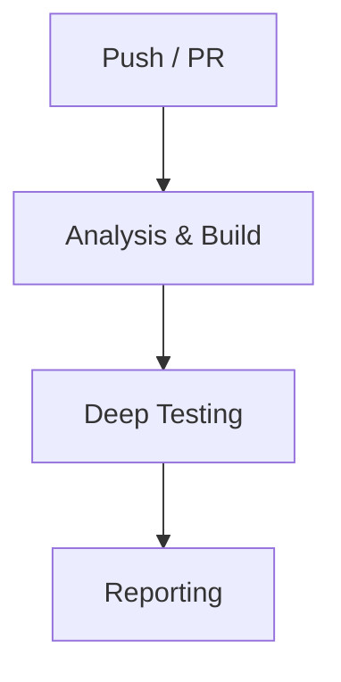
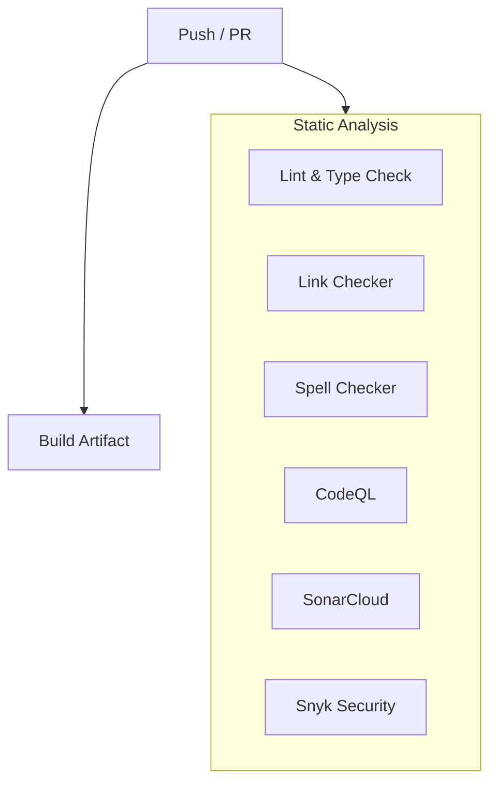
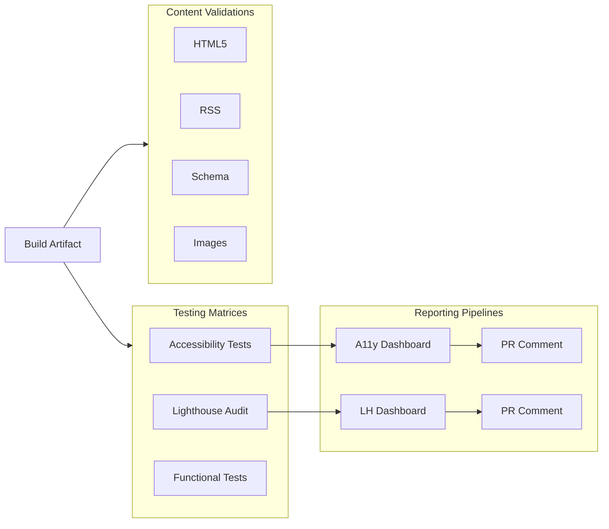

# JMRP.io (Astro v5)

<!-- Project & Status -->


[](https://github.com/jmrplens/jmrp.io/pulls)

<!-- Code Quality -->

[](https://github.com/jmrplens/jmrp.io/actions/workflows/ci.yml)
[](https://sonarcloud.io/summary/new_code?id=jmrplens_jmrp.io)

<!-- Performance & Security -->

[](https://observatory.mozilla.org/analyze/jmrp.io)


This is the source code for my personal website, **[jmrp.io](https://jmrp.io)**, built with **Astro 5**. It features a high-performance static architecture, robust security headers (including a strict CSP), and a focus on accessibility and modern web standards.

## 📑 Table of Contents

- [Features](#-features)
- [Tech Stack](#-tech-stack)
- [Project Structure](#-project-structure)
- [Getting Started](#-getting-started)
- [Quality Assurance](#-quality-assurance)
- [Deployment](#-deployment)
- [Security & Nginx](#-security--nginx)
- [LaTeX CV Compilation](#-latex-cv-compilation)

---

## 🚀 Features

- **Performance**:
  - **100/100 Google PageSpeed** (Desktop & Mobile).
  - **Core Web Vitals**: LCP < 0.8s, CLS < 0.031, FCP < 0.3s.
  - **SSG (Static Site Generation)**: All pages pre-rendered at build time.
  - **Islands Architecture**: Minimal JavaScript with Preact islands.
  - **Image Optimization**: WebP format with responsive sizing.
  - **Font Loading**: Optimized with fallback fonts and metric overrides.
  - **CSS Inlining**: Critical CSS inlined, async loading for non-critical.
- **Accessibility**:
  - **Axe-core Testing**: Automated WCAG 2.1 AA validation via Playwright for all pages.
  - **HTML5 Compliance**: Strict HTML validation (`html-validate`).
  - **Lighthouse CI**: Accessibility auditing on every commit.
  - **Inclusive Design**: Keyboard navigation, focus indicators, and unique `aria-labels`.
  - **Motion Sensitivity**: Respects `prefers-reduced-motion` settings.
- **Content**:
  - **Blog**: Technical articles with MDX support.
  - **RSS Feed**: Automatic generation of `rss.xml` for blog posts.
  - **CV Generation**: Automated LaTeX compilation for PDF resumes.
- **Themeable**: Light/Dark mode with system preference detection.
- **Configurable**: Centralized configuration via YAML files (`site.yml`, `socials.yml`, `cv.yml`).
- **SEO Optimized**: Dynamic Schema.org (JSON-LD), Open Graph, and Twitter Cards.

## 🛠️ Tech Stack

- **Framework**: [Astro](https://astro.build/)
- **UI Components**: [Preact](https://preactjs.com/)
- **Styling**: Native CSS (Variables, Nesting) & Astro Scoped Styles
- **Icons**: [Iconify](https://icon-sets.iconify.design/)
- **Testing**: [Playwright](https://playwright.dev/) & [Lighthouse](https://developers.google.com/web/tools/lighthouse)
- **CI/CD**: GitHub Actions

## 📂 Project Structure

<details>
<summary>Click to expand folder structure</summary>

```
/
├── src/
│   ├── components/   # Reusable Astro & Preact components
│   ├── content/      # Content Collections (Blog posts)
│   ├── data/         # YAML Data files (Site config, CV, Socials)
│   ├── layouts/      # Page layouts (Base, etc.)
│   ├── pages/        # File-based routing
│   ├── styles/       # Global CSS & Fonts
│   └── utils/        # Helper functions
├── public/           # Static assets (images, fonts, robots.txt)
├── scripts/          # Build & Maintenance scripts
├── tests/            # Playwright E2E & Accessibility tests
├── cv_latex/         # LaTeX source files for CV
├── astro.config.mjs  # Astro configuration
└── package.json      # Dependencies & Scripts
```

</details>

## 🏁 Getting Started

### Prerequisites

- Node.js (v22+): Required to ensure compatibility with the latest LTS features and modern build tooling.
- pnpm

### Installation

```bash
# Clone the repository
git clone https://github.com/jmrplens/jmrp.io.git

# Install dependencies
pnpm install

# Start development server
pnpm run dev
```

### Build

```bash
pnpm run build
```

This command will:

1. Fetch latest avatars from GitHub.
2. Build the Astro site.
3. Automatically execute post-build optimizations:
   - Extract inline styles to classes.
   - Convert CSS/HTML data URIs to physical assets.
   - Generate SHA-512 hashes for SRI and CSP.
4. Validate and deploy `security_headers.conf` to Nginx (if on server).
5. Reload Nginx service automatically.

## 🧪 Quality Assurance

This project employs a rigorous testing pipeline to ensure quality and compliance.

### Pipeline Overview



### Phase 1: Parallel Analysis & Build

Static analysis tools run in parallel with the production build to provide fast feedback.



### Phase 2: Deep Testing & Reporting

Once the build is ready, we execute comprehensive testing matrices and generate unified reports.



### Accessibility Testing

We perform comprehensive accessibility checks:

- **Axe-core (via Playwright)**: Scans every page against **WCAG 2.1/2.2 AA** and **Best Practice** rules.
  - **Dual-Theme Matrix**: Tests run in parallel for both **Light** and **Dark** modes to ensure contrast compliance in all contexts.
  - **Unified Dashboard**: Aggregates results into an interactive HTML dashboard deployed to Surge, providing a single point of review for both themes.
  - **Global SVG Exclusion**: Prevents false positives in diagrams (Mermaid, etc.).
  - Fails the build on any violation.
- **Lighthouse CI**: Runs Lighthouse audits on all pages, enforcing high scores for Accessibility, Performance, and SEO.
  - **Parallel Matrix Execution**: Runs 4 parallel jobs covering **Mobile** & **Desktop** form factors across both **Light** & **Dark** themes.
  - **Unified Dashboard**: Aggregates all results into a single, interactive HTML dashboard deployed to Surge for easy review.
- **Manual Checks**: The pipeline flags "incomplete" checks (e.g., complex color contrast) for manual review.

### Content Validation

- **HTML Validation**: `html-validate` checks generated HTML for standard compliance and semantic correctness.
- **RSS Validation**: `validate-rss.mjs` ensures the generated `rss.xml` strictly follows RSS 2.0 specifications.
- **Schema.org**: `validate-schema.mjs` verifies the structure of JSON-LD data for SEO.

## 🚀 Deployment

The site is built as a static folder (`dist/`) and can be deployed to any static host. I use **Docker** with **Nginx**.

### Docker

```bash
docker build -t jmrp-io .
docker run -p 8080:80 jmrp-io
```

## 🔒 Security & Nginx

The project includes advanced Nginx configuration for security headers and asset delivery.

- [Main Nginx Configuration Example](examples/nginx/nginx.conf.example)
- [Security Headers Example](examples/nginx/security_headers.conf.example)

### Security Features

- **Reverse Proxy**: Nginx reverse proxy handles requests to external services (Mastodon, Matrix, Meshtastic), hiding upstreams and preventing CORS issues.
- **SRI (Subresource Integrity)**: Comprehensive protection for all local resources. A modularized Astro Integration (`src/integrations/post-build/`) calculates hashes for:
  - All `<script>` and `<link rel="stylesheet">` tags.
  - `<link rel="preload">` and `<link rel="modulepreload">` (including fonts and Astro dynamic components).
  - PWA Metadata (Favicons, Icons, and Web Manifest).
  - Multimedia assets (``, `<source>`).
- **CSP (Content Security Policy)**: Uses a robust hybrid strategy of SHA-512 hashes for all inline content and request-specific `nonce` (injected via Nginx `sub_filter`) as a fallback.
  - **Features**:
    - **SHA-512 Hashing**: Prioritized for all static inline scripts and styles.
    - **Nonce Fallback**: Ensures dynamic or third-party generated content (like Mermaid diagrams) works reliably.
    - **Automatic Splitting**: Splits long CSP header strings into multiple Nginx variables to avoid configuration limits.
    - **Automatic Deployment**: The build process automatically validates and deploys `security_headers.conf` to the local Nginx installation and reloads the service.
- **Incident Reporting**: Real-time monitoring of security violations:
  - **CSP Violations**: Natively reported by the browser.
  - **SRI Failures**: Tracked via a custom event listener (`SRIEventListener.astro`) that captures integrity validation errors.
  - **Telegram Integration**: A dedicated backend (`csp-reporter.mjs`) receives these reports and sends instant notifications.
- **Hardened Headers**: Full suite of modern headers (HSTS, XFO, CORP, COOP, COEP) achieving the maximum score on Mozilla Observatory.

## 📄 LaTeX CV Compilation

The project includes LaTeX source files to generate professional PDF CVs.

**Prerequisites:**

- TeX Live (Full distribution)
- `latexmk`
- `lualatex`

**Compilation:**

```bash
cd cv_latex
latexmk -lualatex -interaction=nonstopmode CV_RequenaPlensJoseManuel_ENG.tex CV_RequenaPlensJoseManuel_SPA.tex
```
