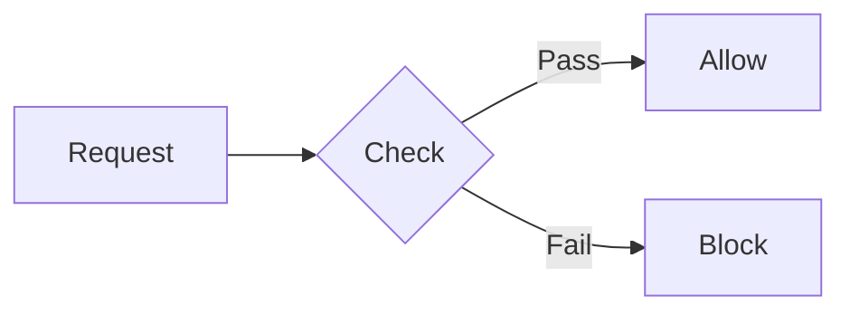

# UI Components Library

This directory contains all the reusable UI components for the jmrp.io blog/website. These components are designed to enhance technical documentation and blog posts with rich, accessible, and visually consistent elements.

## Quick Reference

| Component                           | Purpose                        | When to Use                                |
| ----------------------------------- | ------------------------------ | ------------------------------------------ |
| [TLDRSummary](#tldrsummary)         | Executive summary box          | Start of long articles/sections            |
| [Callout](#callout)                 | Highlighted information boxes  | Notes, warnings, tips, important info      |
| [CheckList](#checklist)             | Styled checklists              | Requirements, steps with states            |
| [StateNotice](#statenotice)         | Status indicators              | Deprecated, preview, experimental features |
| [VersionBadge](#versionbadge)       | Inline version/status badges   | Inline version tags, level indicators      |
| [BrowserSupport](#browsersupport)   | Browser compatibility table    | Feature support documentation              |
| [SecurityRating](#securityrating)   | A+ to F rating badges          | Security/grade indicators                  |
| [DirectiveCard](#directivecard)     | Directive/option documentation | API/config option docs                     |
| [APIEndpoint](#apiendpoint)         | REST API endpoint card         | API documentation                          |
| [Timeline](#timeline)               | Chronological events           | Version history, evolution                 |
| [DecisionTree](#decisiontree)       | Interactive decision guide     | Help readers choose options                |
| [BeforeAfter](#beforeafter)         | Side-by-side comparison        | Before/after scenarios                     |
| [Prerequisite](#prerequisite)       | Prerequisites box              | Tutorial requirements                      |
| [StepByStep](#stepbystep)           | Numbered steps                 | Step-by-step guides                        |
| [Tabs](#tabs)                       | Tabbed content                 | Multiple code examples, alternatives       |
| [Table](#table)                     | Enhanced tables                | Data tables with features                  |
| [KeyValue](#keyvalue)               | Key-value pairs                | Configuration displays                     |
| [Code](#code)                       | Syntax-highlighted code        | Code snippets                              |
| [FileContent](#filecontent)         | File content with path         | Configuration files                        |
| [CompareCode](#comparecode)         | Code comparison                | Before/after code changes                  |
| [TerminalCommand](#terminalcommand) | Terminal commands              | CLI instructions                           |
| [TerminalOutput](#terminaloutput)   | Terminal output display        | Command results                            |
| [Mermaid](#mermaid)                 | Diagrams                       | Flowcharts, sequence diagrams              |
| [BarChart](#barchart)               | Bar chart visualization        | Data comparisons                           |
| [Collapsible](#collapsible)         | Expandable section             | Optional/detailed content                  |
| [References](#references)           | Reference links section        | External resources                         |
| [YouTube](#youtube)                 | YouTube embed                  | Video content                              |

---

## Content & Summary Components

### TLDRSummary

Collapsible executive summary box for quick takeaways at the start of long sections.

```mdx
import TLDRSummary from "@/components/ui/TLDRSummary.astro";

<TLDRSummary title="Key Points">
  - CSP helps prevent XSS attacks - Start with
  `Content-Security-Policy-Report-Only` - Use nonces for inline scripts
</TLDRSummary>
```

**Props:**

- `title?: string` - Header text (default: "TL;DR")
- `collapsed?: boolean` - Start collapsed (default: false)

**When to use:** At the beginning of long articles or complex sections to give readers a quick overview of the main points.

---

### Callout

Highlighted information boxes with different semantic types.

```mdx
import Callout from "@/components/ui/Callout.astro";

<Callout
  type="warning"
  title="Security Notice"
>
  Never use `unsafe-inline` in production environments.
</Callout>

<Callout type="tip">Use browser DevTools to debug CSP violations.</Callout>
```

**Props:**

- `type: "note" | "tip" | "important" | "warning" | "caution"` - Visual style
- `title?: string` - Optional header

**When to use:**

- `note`: Background information, FYI
- `tip`: Best practices, performance tips
- `important`: Critical information that affects functionality
- `warning`: Potential issues or gotchas
- `caution`: Dangerous actions with serious consequences

---

### Collapsible

Generic expandable/collapsible section for optional or detailed content.

```mdx
import Collapsible from "@/components/ui/Collapsible.astro";

<Collapsible title="Advanced Configuration Options">
  Detailed configuration content here...
</Collapsible>
```

**Props:**

- `title: string` - Header text
- `open?: boolean` - Start expanded (default: false)

**When to use:** For supplementary information that not all readers need, such as advanced options, detailed explanations, or troubleshooting steps.

---

## Status & Version Indicators

### StateNotice

Prominent banners for feature states (deprecated, experimental, preview, etc).

```mdx
import StateNotice from "@/components/ui/StateNotice.astro";

<StateNotice
  type="deprecated"
  feature="report-uri"
  date="2024-01"
  alternative="report-to"
/>

<StateNotice
  type="experimental"
  feature="trusted-types"
/>

<StateNotice
  type="preview"
  feature="report-to"
/>

<StateNotice
  type="security"
  feature="eval"
/>
```

**Props:**

- `type: "deprecated" | "mandatory" | "experimental" | "preview" | "breaking" | "security"`
- `feature?: string` - Feature name (shown as code badge)
- `title?: string` - Custom title
- `date?: string` - Relevant date
- `alternative?: string` - Alternative feature name
- `alternativeUrl?: string` - Link to alternative

**When to use:** To clearly communicate the status of APIs, features, or configurations. Essential for technical documentation accuracy.

---

### VersionBadge

Inline badges for versions, levels, or status indicators.

```mdx
import VersionBadge from "@/components/ui/VersionBadge.astro";

CSP <VersionBadge type="level" value="3" /> introduces `strict-dynamic`.

This feature is <VersionBadge type="new" />.

<VersionBadge type="deprecated" /> `report-uri` is replaced by `report-to`.
```

**Props:**

- `type: "version" | "level" | "deprecated" | "new" | "experimental" | "stable"`
- `value?: string` - Display value (auto-generated if not provided)

**When to use:** Inline within text to indicate version requirements, feature status, or levels without breaking reading flow.

---

### SecurityRating

Visual A+ to F rating badges for security assessments.

```mdx
import SecurityRating from "@/components/ui/SecurityRating.astro";

<SecurityRating rating="A+" />
<SecurityRating rating="B" />
<SecurityRating
  rating="F"
  label="Critical Issues"
/>
```

**Props:**

- `rating: "A+" | "A" | "B" | "C" | "D" | "F"`
- `label?: string` - Optional description label

**When to use:** For security audits, grading configurations, or any A-F scale ratings.

---

## Lists & Checklists

### CheckList

Styled checklists with semantic icons (check, cross, warning, optional).

```mdx
import CheckList from "@/components/ui/CheckList.astro";

<CheckList title="Requirements">
  <li data-check="check">Nginx 1.19+</li>
  <li data-check="check">SSL/TLS configured</li>
  <li data-check="optional">Redis for caching</li>
  <li data-check="cross">PHP (not needed)</li>
  <li data-check="warning">Root access required</li>
</CheckList>
```

**Props:**

- `title?: string` - Optional header

**Item attributes:**

- `data-check="check"` - Green checkmark (default)
- `data-check="cross"` - Red X
- `data-check="warning"` - Yellow warning
- `data-check="optional"` - Gray circle

**When to use:** For requirements, prerequisites, or any list where items have different states (required, optional, not allowed, etc).

---

### StepByStep

Numbered step-by-step instructions with visual progression.

```mdx
import StepByStep from "@/components/ui/StepByStep.astro";

<StepByStep title="Installation">
  <li>Update your package manager</li>
  <li>Install the dependencies</li>
  <li>Configure the settings</li>
</StepByStep>
```

**Props:**

- `title?: string` - Optional header

**When to use:** For procedural instructions, tutorials, or any sequential process that must be followed in order.

---

### Prerequisite

Styled box for tutorial prerequisites and requirements.

```mdx
import Prerequisite from "@/components/ui/Prerequisite.astro";

<Prerequisite>
  - **Nginx** version 1.19 or higher - **SSL certificate** configured - Basic
  knowledge of HTTP headers
</Prerequisite>
```

**Props:**

- `title?: string` - Header text (default: "Prerequisites")

**When to use:** At the start of tutorials to clearly list what readers need before beginning.

---

## Documentation Components

### DirectiveCard

Card for documenting directives, options, or configuration settings.

```mdx
import DirectiveCard from "@/components/ui/DirectiveCard.astro";

<DirectiveCard
  name="default-src"
  syntax="default-src <source-list>"
  description="Serves as fallback for other fetch directives."
  defaultValue="none"
  since="CSP Level 1"
  mdnUrl="https://developer.mozilla.org/en-US/docs/Web/HTTP/Headers/Content-Security-Policy/default-src"
>
  Additional examples or notes here...
</DirectiveCard>
```

**Props:**

- `name: string` - Directive/option name
- `syntax?: string` - Syntax pattern
- `description?: string` - Brief description
- `defaultValue?: string` - Default value
- `since?: string` - Version/date introduced
- `mdnUrl?: string` - MDN documentation link

**When to use:** For comprehensive documentation of individual configuration options, API parameters, or directives.

---

### APIEndpoint

Card for REST API endpoint documentation.

```mdx
import APIEndpoint from "@/components/ui/APIEndpoint.astro";

<APIEndpoint
  method="POST"
  path="/api/csp-reports"
  description="Receives CSP violation reports"
  auth
>
  #### Request Body Accepts JSON with violation data.
</APIEndpoint>
```

**Props:**

- `method: "GET" | "POST" | "PUT" | "PATCH" | "DELETE"`
- `path: string` - Endpoint path
- `description?: string` - Brief description
- `auth?: boolean` - Shows auth required badge

**When to use:** For API documentation showing endpoints with their methods, paths, and requirements.

---

### KeyValue

Display key-value pairs in a structured format.

```mdx
import KeyValue from "@/components/ui/KeyValue.astro";

<KeyValue
  items={[
    { key: "Version", value: "3.2.1" },
    { key: "License", value: "MIT" },
    { key: "Size", value: "2.4 KB" },
  ]}
/>
```

**Props:**

- `items: { key: string; value: string }[]` - Array of key-value pairs
- `title?: string` - Optional header

**When to use:** For displaying configuration values, metadata, or any structured key-value data.

---

## Comparison & Decision Components

### BeforeAfter

Side-by-side comparison view with labeled panels.

```mdx
import BeforeAfter from "@/components/ui/BeforeAfter.astro";

<BeforeAfter
  beforeLabel="Without CSP"
  afterLabel="With CSP"
>
  <div slot="before">Vulnerable to XSS attacks...</div>
  <div slot="after">Protected from inline script injection...</div>
</BeforeAfter>
```

**Props:**

- `beforeLabel?: string` - Left panel label (default: "Before")
- `afterLabel?: string` - Right panel label (default: "After")

**When to use:** To show the impact of changes, compare approaches, or illustrate problems vs solutions.

---

### DecisionTree

Interactive expandable decision tree for guiding readers through choices.

```mdx
import DecisionTree from "@/components/ui/DecisionTree.astro";

<DecisionTree question="Which CSP directive should you use?">
  <details>
    <summary>I need to allow inline scripts</summary>
    <p>Use nonces with `script-src 'nonce-xxx'`</p>
  </details>
  <details>
    <summary>I want maximum security</summary>
    <p>Use `strict-dynamic` with nonces</p>
  </details>
</DecisionTree>
```

**Props:**

- `question: string` - The main decision question

**When to use:** To help readers navigate complex choices or troubleshoot issues through a guided flow.

---

### CompareCode

Side-by-side code comparison with optional highlighting.

```mdx
import CompareCode from "@/components/ui/CompareCode.astro";

<CompareCode
  beforeTitle="Before"
  afterTitle="After"
  beforeCode={`add_header X-Frame-Options "DENY";`}
  afterCode={`add_header Content-Security-Policy "frame-ancestors 'none';";`}
  lang="nginx"
/>
```

**Props:**

- `beforeCode: string` - Left code
- `afterCode: string` - Right code
- `beforeTitle?: string` - Left label
- `afterTitle?: string` - Right label
- `lang?: string` - Syntax highlighting language

**When to use:** To show code refactoring, migration steps, or alternative implementations.

---

## Timeline & History

### Timeline

Vertical timeline for showing chronological events.

```mdx
import Timeline from "@/components/ui/Timeline.astro";

<Timeline
  events={[
    {
      date: "2012",
      title: "CSP Level 1",
      description: "Initial specification",
    },
    {
      date: "2016",
      title: "CSP Level 2",
      description: "Added nonces and hashes",
      type: "milestone",
    },
    {
      date: "2018",
      title: "CSP Level 3",
      description: "strict-dynamic introduced",
      type: "success",
    },
  ]}
/>
```

**Props:**

- `events: TimelineEvent[]` - Array of events

**TimelineEvent:**

- `date: string` - Date/version string
- `title: string` - Event title
- `description?: string` - Event description
- `icon?: string` - Custom icon (e.g., "mdi:security")
- `type?: "default" | "success" | "warning" | "milestone"`

**When to use:** For version history, feature evolution, or any chronological progression.

---

## Code & Terminal Components

### Code

Syntax-highlighted code block with language icon and copy button.

```mdx
import Code from "@/components/ui/Code.astro";

<Code lang="javascript" title="Example">
  const secure = true;
</Code>

<Code lang="bash" aria-label="Install dependencies">
  npm install
</Code>
```

**Props:**

- `lang?: string` - Language for syntax highlighting (default: "text")
- `title?: string` - Optional title shown in header
- `aria-label?: string` - Custom accessibility label (auto-generated if not provided)
- `class?: string` - Additional CSS classes

**When to use:** For code snippets that need syntax highlighting but don't represent a complete file.

---

### FileContent

Display file content inside a file-like window frame with filename header, icon detection, and copy button.

```mdx
import FileContent from "@/components/ui/FileContent.astro";

<FileContent filename="/etc/nginx/conf.d/security.conf" language="nginx">
  add_header Content-Security-Policy "default-src 'self';";
</FileContent>

{/* Collapsible file content */}
<FileContent filename="docker-compose.yml" collapsible>
  version: "3.8"
  services:
    web:
      image: nginx
</FileContent>
```

**Props:**

- `filename: string` - File path to display (icon auto-detected from extension)
- `icon?: string` - Custom icon override (e.g., "mdi-file-document-outline")
- `language?: string` - Syntax highlighting language (inferred from extension if not specified)
- `collapsible?: boolean` - Make content collapsible (default: false)
- `ariaLabel?: string` - Custom accessibility label

**When to use:** For configuration files, complete file examples, or any code that represents a specific file on disk.

---

### TerminalCommand

Styled terminal command with copy functionality.

```mdx
import TerminalCommand from "@/components/ui/TerminalCommand.astro";

<TerminalCommand>sudo nginx -t && sudo systemctl reload nginx</TerminalCommand>
```

**Props:**

- `title?: string` - Optional header
- `prompt?: string` - Custom prompt (default: "$")

**When to use:** For CLI commands that readers should execute.

---

### TerminalOutput

Display terminal/command output.

```mdx
import TerminalOutput from "@/components/ui/TerminalOutput.astro";

<TerminalOutput>
  nginx: the configuration file /etc/nginx/nginx.conf syntax is ok nginx:
  configuration file /etc/nginx/nginx.conf test is successful
</TerminalOutput>
```

**Props:**

- `title?: string` - Optional header

**When to use:** To show expected output from commands, helping readers verify their results.

---

## Visual Components

### Mermaid

Render Mermaid diagrams with theme support, accessibility features, and size controls.

```mdx
import Mermaid from "@/components/ui/Mermaid.astro";

<Mermaid caption="CSP Decision Flow">
flowchart LR
    A[Request] --> B{Has CSP?}
    B -->|Yes| C[Parse Policy]
    B -->|No| D[Allow All]
</Mermaid>

{/* With size constraints */}
<Mermaid caption="Architecture" maxWidth="600px" maxHeight="400px">
flowchart TB
    A --> B --> C
</Mermaid>
```

**Props:**

- `caption?: string` - Displayed below diagram as figcaption
- `title?: string` - Used for aria-labelledby (not visible)
- `ariaLabel?: string` - Custom accessibility label
- `maxWidth?: string` - Maximum diagram width (e.g., "600px")
- `maxHeight?: string` - Maximum diagram height (e.g., "400px")

**Semantic node classes:** Apply CSS classes to nodes for color-coding:
- `.success` - Green (allowed/passed)
- `.warning` - Yellow (caution)
- `.danger` - Red (blocked/error)
- `.info` - Blue (informational)
- `.highlight` - Purple (emphasis)
- `.secondary` - Muted (background info)



**When to use:** For flowcharts, sequence diagrams, architecture diagrams, or any visual representation of processes.

---

### BarChart

CSS-only bar chart visualization.

```mdx
import BarChart from "@/components/ui/BarChart.astro";

<BarChart
  title="Security Score Comparison"
  items={[
    { label: "Site A", value: 95, color: "#10b981" },
    { label: "Site B", value: 72, color: "#f59e0b" },
    { label: "Site C", value: 45, color: "#ef4444" },
  ]}
/>
```

**Props:**

- `items: { label: string; value: number; color?: string }[]`
- `title?: string` - Chart title
- `max?: number` - Maximum value (auto-calculated if not provided)

**When to use:** For comparing numerical values, showing progress, or visualizing metrics.

---

### BrowserSupport

Browser compatibility table with visual indicators and support levels.

```mdx
import BrowserSupport from "@/components/ui/BrowserSupport.astro";

<BrowserSupport
  title="CSP Support"
  browsers={[
    { browser: "chrome", version: "25", support: "full" },
    { browser: "firefox", version: "23", support: "full" },
    { browser: "safari", version: "7", support: "partial", note: "No report-to" },
    { browser: "edge", version: "12", support: "full" },
    { browser: "opera", support: "none" }
  ]}
/>
```

**Props:**

- `title?: string` - Header title (default: "Browser Support")
- `browsers: BrowserInfo[]` - Array of browser support info

**BrowserInfo object:**

- `browser: "chrome" | "firefox" | "safari" | "edge" | "opera"` - Browser name
- `version?: string` - Minimum supported version
- `support: "full" | "partial" | "none" | "unknown"` - Support level
- `note?: string` - Additional notes about support limitations

**Support levels:**
- `full` - Green checkmark, fully supported
- `partial` - Yellow warning, some features missing
- `none` - Red X, not supported
- `unknown` - Gray question mark

**When to use:** To document browser support for web features, APIs, or CSS properties.

---

## Table Components

### Table

Styled table wrapper with semantic HTML slots and responsive design.

```mdx
import Table from "@/components/ui/Table.astro";

<Table title="CSP Directives">
  <thead>
    <tr>
      <th>Directive</th>
      <th>Description</th>
      <th>Level</th>
    </tr>
  </thead>
  <tbody>
    <tr>
      <td>default-src</td>
      <td>Fallback for other directives</td>
      <td>1</td>
    </tr>
    <tr>
      <td>script-src</td>
      <td>Script sources</td>
      <td>1</td>
    </tr>
  </tbody>
</Table>

{/* With status cells */}
<Table title="Support Matrix" striped highlight>
  <thead>
    <tr><th>Feature</th><th>Status</th></tr>
  </thead>
  <tbody>
    <tr><td>Nonces</td><td data-status="success">Supported</td></tr>
    <tr><td>report-uri</td><td data-status="error">Deprecated</td></tr>
    <tr><td>Trusted Types</td><td data-status="warning">Experimental</td></tr>
  </tbody>
</Table>
```

**Props:**

- `title?: string` - Table title/caption
- `striped?: boolean` - Alternating row backgrounds (default: true)
- `compact?: boolean` - Reduced padding
- `highlight?: boolean` - Highlight rows on hover (default: true)
- `bordered?: boolean` - Add cell borders
- `ariaLabel?: string` - Accessibility label
- `id?: string` - Custom element ID
- `class?: string` - Additional CSS classes

**Semantic cell attributes:**

Use `data-status` on `<td>` elements for colored status cells:
- `data-status="success"` - Green (active, supported)
- `data-status="error"` - Red (deprecated, failed)
- `data-status="warning"` - Yellow (experimental, partial)
- `data-status="info"` or `data-status="note"` - Blue (informational)

**When to use:** For structured data that benefits from table formatting. Use semantic HTML (`<thead>`, `<tbody>`, `<th>`, `<td>`) for accessibility.

---

## Tabs

### Tabs & TabPanel

Tabbed content sections for alternatives or multiple examples.

```mdx
import { Tabs, TabPanel } from "@/components/ui/tabs";

<Tabs>
  <TabPanel label="Nginx">Nginx configuration here...</TabPanel>
  <TabPanel label="Apache">Apache configuration here...</TabPanel>
  <TabPanel label="Caddy">Caddy configuration here...</TabPanel>
</Tabs>
```

**TabPanel Props:**

- `label: string` - Tab button text

**When to use:** When presenting the same concept in different contexts (different languages, platforms, versions).

---

## References

### References

Section for external links and resources.

```mdx
import References from "@/components/ui/References.astro";

<References
  links={[
    {
      title: "MDN CSP Documentation",
      url: "https://developer.mozilla.org/...",
    },
    { title: "CSP Evaluator", url: "https://csp-evaluator.withgoogle.com/" },
  ]}
/>
```

**Props:**

- `links: { title: string; url: string; description?: string }[]`
- `title?: string` - Section title (default: "References")

**When to use:** At the end of articles to provide further reading and official documentation links.

---

## Media Components

### YouTube

Responsive YouTube video embed.

```mdx
import YouTube from "@/components/ui/YouTube.astro";

<YouTube
  id="dQw4w9WgXcQ"
  title="Introduction to CSP"
/>
```

**Props:**

- `id: string` - YouTube video ID
- `title?: string` - Video title for accessibility

**When to use:** To embed video content that supplements written documentation.

---

## Internal/Utility Components

These components are primarily used internally or for specific purposes:

- **CopyButton** - Copy-to-clipboard button (used by code components)
- **IconDetector** - Icon rendering helper
- **SRIEventListener** - Subresource Integrity event handling
- **ThemeToggle** - Dark/light mode toggle
- **DeprecatedNotice** - Legacy component (use StateNotice instead)

---

## Best Practices

### Import Patterns

```mdx
// Individual imports
import Callout from "@/components/ui/Callout.astro";
import TLDRSummary from "@/components/ui/TLDRSummary.astro";

// Barrel imports (where available)
import { Tabs, TabPanel } from "@/components/ui/tabs";
```

### Component Selection Guide

1. **For status communication:** Use `StateNotice` for prominent alerts, `VersionBadge` for inline mentions
2. **For code examples:** Use `Code` for snippets, `FileContent` for complete files, `TerminalCommand` for CLI
3. **For comparisons:** Use `BeforeAfter` for visual, `CompareCode` for code-specific
4. **For lists:** Use `CheckList` for items with states, `StepByStep` for sequential instructions
5. **For structure:** Use `Tabs` for alternatives, `Collapsible` for optional content

### Accessibility

All components follow WCAG 2.1 AA guidelines:

- Sufficient color contrast ratios (4.5:1 minimum)
- Proper ARIA attributes
- Keyboard navigation support
- Screen reader friendly

### Creating New Components

When adding new components:

1. Follow the naming convention: `ComponentName.astro`
2. Add JSDoc comment at the top describing the component
3. Define a TypeScript `interface Props` for type safety
4. Use CSS custom properties for theming consistency
5. Add light mode overrides when using colors
6. Update this README with usage examples
7. Test with accessibility tools (axe-core)

---

## File Structure

```
src/components/ui/
├── README.md              # This file
├── tabs.ts                # Barrel export for Tabs
├── [ComponentName].astro  # Component files
└── ...
```

---

_Last updated: February 2026_
