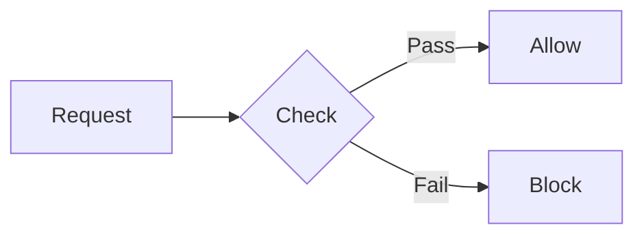

# UI Components Library

This directory contains all the reusable UI components for the jmrp.io blog/website. These components are designed to enhance technical documentation and blog posts with rich, accessible, and visually consistent elements.

## Quick Reference

| Component                           | Purpose                        | When to Use                                |
| ----------------------------------- | ------------------------------ | ------------------------------------------ |
| [TLDRSummary](#tldrsummary)         | Executive summary box          | Start of long articles/sections            |
| [FAQ](#faq)                         | Collapsible Q&A + FAQPage JSON-LD | End of posts/tools (via `faq` frontmatter) |
| [Callout](#callout)                 | Highlighted information boxes  | Notes, warnings, tips, important info      |
| [CheckList](#checklist)             | Styled checklists              | Requirements, steps with states            |
| [StateNotice](#statenotice)         | Status indicators              | Deprecated, preview, experimental features |
| [VersionBadge](#versionbadge)       | Inline version/status badges   | Inline version tags, level indicators      |
| [BrowserSupport](#browsersupport)   | Browser compatibility table    | Feature support documentation              |
| [SecurityRating](#securityrating)   | A+ to F rating badges          | Security/grade indicators                  |
| [DirectiveCard](#directivecard)     | Directive/option documentation | API/config option docs                     |
| [APIEndpoint](#apiendpoint)         | REST API endpoint card         | API documentation                          |
| [Timeline](#timeline)               | Chronological events           | Version history, evolution                 |
| [DecisionTree](#decisiontree)       | Interactive decision guide     | Help readers choose options                |
| [BeforeAfter](#beforeafter)         | Side-by-side comparison        | Before/after scenarios                     |
| [Prerequisite](#prerequisite)       | Prerequisites box              | Tutorial requirements                      |
| [StepByStep](#stepbystep)           | Numbered steps                 | Step-by-step guides                        |
| [Tabs](#tabs)                       | Tabbed content                 | Multiple code examples, alternatives       |
| [Table](#table)                     | Enhanced tables                | Data tables with features                  |
| [KeyValue](#keyvalue)               | Key-value pairs                | Configuration displays                     |
| [Code](#code)                       | Syntax-highlighted code        | Code snippets                              |
| [FileContent](#filecontent)         | File content with path         | Configuration files                        |
| [CompareCode](#comparecode)         | Code comparison                | Before/after code changes                  |
| [TerminalCommand](#terminalcommand) | Terminal commands              | CLI instructions                           |
| [TerminalOutput](#terminaloutput)   | Terminal output display        | Command results                            |
| [Mermaid](#mermaid)                 | Diagrams                       | Flowcharts, sequence diagrams              |
| [BarChart](#barchart)               | Bar chart visualization        | Data comparisons                           |
| [Collapsible](#collapsible)         | Expandable section             | Optional/detailed content                  |
| [References](#references)           | Reference links section        | External resources                         |
| [YouTube](#youtube)                 | YouTube embed                  | Video content                              |
| [MemoryMap](#memorymap)             | Memory region bars             | Flash/RAM budgets, region sizing           |
| [StructPacking](#structpacking)     | C/C++ struct layout            | Alignment, padding, `sizeof`               |
| [RegisterMap](#registermap)         | Register bit-fields            | MCU/peripheral registers                   |
| [ByteFrame](#byteframe)             | Single-row byte layout         | Wire/record formats                        |
| [PacketDiagram](#packetdiagram)     | RFC multi-row header           | IPv4/TCP/UDP/QUIC, binary formats          |
| [SubnetSplit](#subnetsplit)         | IP network/host split          | CIDR / subnetting                          |
| [BitwiseOp](#bitwiseop)             | Bitwise op, bit-by-bit         | Masks, flags, shifts                       |
| [NumberBases](#numberbases)         | hex/dec/oct/bin of a value     | Constants, addresses                       |
| [FloatLayout](#floatlayout)         | IEEE 754 bit layout            | Floating-point                             |
| [TimingDiagram](#timingdiagram)     | Digital waveforms (SVG)        | SPI/I²C/UART, bus timing                    |
| [EncodingDiagram](#encodingdiagram) | Token → bytes                  | UTF-8, base64, varint                      |
| [DeltaCompare](#deltacompare)       | Before/after metric bars       | Optimization results                       |
| [LayerStack](#layerstack)           | Stacked HW/SW layers           | OSI, firmware stack, abstraction levels    |
| [CallStack](#callstack)             | Call frames + growth           | Recursion, calling conventions             |
| [Matrix](#matrix)                   | Labelled 2-D grid              | Lookup tables, bitmaps, matrices           |
| [Pipeline](#pipeline)               | Numbered stages + data-flow    | Build/CPU pipelines, data flow             |
| [ForkJoin](#forkjoin)               | Fork → join data-flow          | Producer → parallel artifacts → consumer   |
| [ThemeImage](#themeimage)           | Light/dark responsive image    | Per-theme diagrams/screenshots             |
| [FileDownload](#filedownload)       | Download card                  | Offering a file/asset                      |

---

## Content & Summary Components

### TLDRSummary

Collapsible executive summary box for quick takeaways at the start of long sections.

```mdx
import TLDRSummary from "@/components/ui/TLDRSummary.astro";

<TLDRSummary title="Key Points">
  - CSP helps prevent XSS attacks
  - Start with `Content-Security-Policy-Report-Only`
  - Use nonces for inline scripts
</TLDRSummary>
```

**Props:**

- `title?: string` - Header text (default: "TL;DR")
- `collapsed?: boolean` - Start collapsed (default: false)

**When to use:** At the beginning of long articles or complex sections to give readers a quick overview of the main points.

---

### Callout

Highlighted information boxes with different semantic types.

```mdx
import Callout from "@/components/ui/Callout.astro";

<Callout
  type="warning"
  title="Security Notice"
>
  Never use `unsafe-inline` in production environments.
</Callout>

<Callout type="tip">Use browser DevTools to debug CSP violations.</Callout>
```

**Props:**

- `type: "note" | "tip" | "important" | "warning" | "caution"` - Visual style
- `title?: string` - Optional header

**When to use:**

- `note`: Background information, FYI
- `tip`: Best practices, performance tips
- `important`: Critical information that affects functionality
- `warning`: Potential issues or gotchas
- `caution`: Dangerous actions with serious consequences

---

### Collapsible

Generic expandable/collapsible section for optional or detailed content.

```mdx
import Collapsible from "@/components/ui/Collapsible.astro";

<Collapsible title="Advanced Configuration Options">
  Detailed configuration content here...
</Collapsible>
```

**Props:**

- `title: string` - Header text
- `open?: boolean` - Start expanded (default: false)

**When to use:** For supplementary information that not all readers need, such as advanced options, detailed explanations, or troubleshooting steps.

---

### FAQ

Accessible, fully-collapsible frequently-asked-questions section. Zero-JS and
native: an outer `<details>` (whose `<summary>` carries the `<h2>` heading) wraps
one nested `<details>`/`<summary>` per question. Answer content stays in the DOM
even when collapsed, so it remains fully crawlable and indexable.

```astro
import FAQ from "@components/ui/FAQ.astro";

<FAQ
  items={[
    { question: "Why verify the MAC before decrypting?", answer: "To avoid a padding oracle." },
    { question: "Does it run client-side?", answer: "Yes — no server calls." },
  ]}
/>
```

**Props:**

- `items: { question: string; answer: string }[]` - Q&A pairs (required)
- `open?: boolean` - Outer block starts expanded (default: false)

**When to use:** Reach for the `faq` **frontmatter** on a post or tool rather than
importing this component directly. The layout (`BlogPost.astro` / `ToolLayout.astro`)
renders `<FAQ>` from that array **and** emits the matching `FAQPage` JSON-LD from
the same data — one source of truth for the visible FAQ and the structured data.
Import `<FAQ>` manually only for an ad-hoc FAQ outside the post/tool flow.

---

## Status & Version Indicators

### StateNotice

Prominent banners for feature states (deprecated, experimental, preview, etc).

```mdx
import StateNotice from "@/components/ui/StateNotice.astro";

<StateNotice
  type="deprecated"
  feature="report-uri"
  date="2024-01"
  alternative="report-to"
/>

<StateNotice
  type="experimental"
  feature="trusted-types"
/>

<StateNotice
  type="preview"
  feature="report-to"
/>

<StateNotice
  type="security"
  feature="eval"
/>
```

**Props:**

- `type: "deprecated" | "mandatory" | "experimental" | "preview" | "breaking" | "security"`
- `feature?: string` - Feature name (shown as code badge)
- `title?: string` - Custom title
- `date?: string` - Relevant date
- `alternative?: string` - Alternative feature name
- `alternativeUrl?: string` - Link to alternative

**When to use:** To clearly communicate the status of APIs, features, or configurations. Essential for technical documentation accuracy.

---

### VersionBadge

Inline badges for versions, levels, or status indicators.

```mdx
import VersionBadge from "@/components/ui/VersionBadge.astro";

CSP <VersionBadge type="level" value="3" /> introduces `strict-dynamic`.

This feature is <VersionBadge type="new" />.

<VersionBadge type="deprecated" /> `report-uri` is replaced by `report-to`.
```

**Props:**

- `type: "version" | "level" | "deprecated" | "new" | "experimental" | "stable"`
- `value?: string` - Display value (auto-generated if not provided)

**When to use:** Inline within text to indicate version requirements, feature status, or levels without breaking reading flow.

---

### SecurityRating

Visual A+ to F rating badges for security assessments.

```mdx
import SecurityRating from "@/components/ui/SecurityRating.astro";

<SecurityRating rating="A+" />
<SecurityRating rating="B" />
<SecurityRating
  rating="F"
  label="Critical Issues"
/>
```

**Props:**

- `rating: "A+" | "A" | "B" | "C" | "D" | "F"`
- `label?: string` - Optional description label

**When to use:** For security audits, grading configurations, or any A-F scale ratings.

---

## Lists & Checklists

### CheckList

Styled checklists with semantic icons (check, cross, warning, optional).

```mdx
import CheckList from "@/components/ui/CheckList.astro";

<CheckList title="Requirements">
  <li data-check="check">Nginx 1.19+</li>
  <li data-check="check">SSL/TLS configured</li>
  <li data-check="optional">Redis for caching</li>
  <li data-check="cross">PHP (not needed)</li>
  <li data-check="warning">Root access required</li>
</CheckList>
```

**Props:**

- `title?: string` - Optional header

**Item attributes:**

- `data-check="check"` - Green checkmark (default)
- `data-check="cross"` - Red X
- `data-check="warning"` - Yellow warning
- `data-check="optional"` - Gray circle

**When to use:** For requirements, prerequisites, or any list where items have different states (required, optional, not allowed, etc).

---

### StepByStep

Numbered step-by-step instructions with visual progression.

```mdx
import StepByStep from "@/components/ui/StepByStep.astro";

<StepByStep title="Installation">
  <li>Update your package manager</li>
  <li>Install the dependencies</li>
  <li>Configure the settings</li>
</StepByStep>
```

**Props:**

- `title?: string` - Optional header

**When to use:** For procedural instructions, tutorials, or any sequential process that must be followed in order.

---

### Prerequisite

Styled box for tutorial prerequisites and requirements.

```mdx
import Prerequisite from "@/components/ui/Prerequisite.astro";

<Prerequisite>
  - **Nginx** version 1.19 or higher
  - **SSL certificate** configured
  - Basic knowledge of HTTP headers
</Prerequisite>
```

**Props:**

- `title?: string` - Header text (default: "Prerequisites")

**When to use:** At the start of tutorials to clearly list what readers need before beginning.

---

## Documentation Components

### DirectiveCard

Card for documenting directives, options, or configuration settings.

```mdx
import DirectiveCard from "@/components/ui/DirectiveCard.astro";

<DirectiveCard
  name="default-src"
  syntax="default-src <source-list>"
  description="Serves as fallback for other fetch directives."
  defaultValue="none"
  since="CSP Level 1"
  mdnUrl="https://developer.mozilla.org/en-US/docs/Web/HTTP/Headers/Content-Security-Policy/default-src"
>
  Additional examples or notes here...
</DirectiveCard>
```

**Props:**

- `name: string` - Directive/option name
- `syntax?: string` - Syntax pattern
- `description?: string` - Brief description
- `defaultValue?: string` - Default value
- `since?: string` - Version/date introduced
- `mdnUrl?: string` - MDN documentation link

**When to use:** For comprehensive documentation of individual configuration options, API parameters, or directives.

---

### APIEndpoint

Card for REST API endpoint documentation.

```mdx
import APIEndpoint from "@/components/ui/APIEndpoint.astro";

<APIEndpoint
  method="POST"
  path="/api/csp-reports"
  description="Receives CSP violation reports"
  auth
>
  #### Request Body Accepts JSON with violation data.
</APIEndpoint>
```

**Props:**

- `method: "GET" | "POST" | "PUT" | "PATCH" | "DELETE"`
- `path: string` - Endpoint path
- `description?: string` - Brief description
- `auth?: boolean` - Shows auth required badge

**When to use:** For API documentation showing endpoints with their methods, paths, and requirements.

---

### KeyValue

Display key-value pairs in a structured format.

```mdx
import KeyValue from "@/components/ui/KeyValue.astro";

<KeyValue
  items={[
    { key: "Version", value: "3.2.1" },
    { key: "License", value: "MIT" },
    { key: "Size", value: "2.4 KB" },
  ]}
/>
```

**Props:**

- `items: { key: string; value: string }[]` - Array of key-value pairs
- `title?: string` - Optional header

**When to use:** For displaying configuration values, metadata, or any structured key-value data.

---

## Comparison & Decision Components

### BeforeAfter

Side-by-side comparison view with labeled panels.

```mdx
import BeforeAfter from "@/components/ui/BeforeAfter.astro";

<BeforeAfter
  beforeLabel="Without CSP"
  afterLabel="With CSP"
>
  <div slot="before">Vulnerable to XSS attacks...</div>
  <div slot="after">Protected from inline script injection...</div>
</BeforeAfter>
```

**Props:**

- `beforeLabel?: string` - Left panel label (default: "Before")
- `afterLabel?: string` - Right panel label (default: "After")

**When to use:** To show the impact of changes, compare approaches, or illustrate problems vs solutions.

---

### DecisionTree

Interactive expandable decision tree for guiding readers through choices.

```mdx
import DecisionTree from "@/components/ui/DecisionTree.astro";

<DecisionTree question="Which CSP directive should you use?">
  <details>
    <summary>I need to allow inline scripts</summary>
    <p>Use nonces with `script-src 'nonce-xxx'`</p>
  </details>
  <details>
    <summary>I want maximum security</summary>
    <p>Use `strict-dynamic` with nonces</p>
  </details>
</DecisionTree>
```

**Props:**

- `question: string` - The main decision question

**When to use:** To help readers navigate complex choices or troubleshoot issues through a guided flow.

---

### CompareCode

Side-by-side code comparison with optional highlighting.

```mdx
import CompareCode from "@/components/ui/CompareCode.astro";

<CompareCode
  beforeTitle="Before"
  afterTitle="After"
  beforeCode={`add_header X-Frame-Options "DENY";`}
  afterCode={`add_header Content-Security-Policy "frame-ancestors 'none';";`}
  lang="nginx"
/>
```

**Props:**

- `beforeCode: string` - Left code
- `afterCode: string` - Right code
- `beforeTitle?: string` - Left label
- `afterTitle?: string` - Right label
- `lang?: string` - Syntax highlighting language

**When to use:** To show code refactoring, migration steps, or alternative implementations.

---

## Timeline & History

### Timeline

Vertical timeline for showing chronological events.

```mdx
import Timeline from "@/components/ui/Timeline.astro";

<Timeline
  events={[
    {
      date: "2012",
      title: "CSP Level 1",
      description: "Initial specification",
    },
    {
      date: "2016",
      title: "CSP Level 2",
      description: "Added nonces and hashes",
      type: "milestone",
    },
    {
      date: "2018",
      title: "CSP Level 3",
      description: "strict-dynamic introduced",
      type: "success",
    },
  ]}
/>
```

**Props:**

- `events: TimelineEvent[]` - Array of events

**TimelineEvent:**

- `date: string` - Date/version string
- `title: string` - Event title
- `description?: string` - Event description
- `icon?: string` - Custom icon (e.g., "mdi:security")
- `type?: "default" | "success" | "warning" | "milestone"`

**When to use:** For version history, feature evolution, or any chronological progression.

---

## Code & Terminal Components

### Code

Syntax-highlighted code block with language icon and copy button.

```mdx
import Code from "@/components/ui/Code.astro";

<Code lang="javascript" title="Example">
  const secure = true;
</Code>

<Code lang="bash" aria-label="Install dependencies">
  npm install
</Code>
```

**Props:**

- `lang?: string` - Language for syntax highlighting (default: "text")
- `title?: string` - Optional title shown in header
- `aria-label?: string` - Custom accessibility label (auto-generated if not provided)
- `class?: string` - Additional CSS classes

**When to use:** For code snippets that need syntax highlighting but don't represent a complete file.

---

### CodeBlock

Lightweight syntax-highlighted code block — outputs bare `<pre><code>` with no wrapper, header, copy button, or other visual chrome. Uses the same Shiki highlighting pipeline as `Code`.

```mdx
import CodeBlock from "@/components/ui/CodeBlock.astro";

<CodeBlock lang="routeros">
  /ip firewall filter add chain=forward action=drop
</CodeBlock>
```

**Props:**

- `lang?: string` - Language for syntax highlighting (default: "text")

**When to use:** Inside `<TabPanel noPadding>` or anywhere you need highlighted code without the visual chrome that `Code` adds. Solves the issue where bare code fences inside component slots lose their Shiki CSS.

---

### FileContent

Display file content inside a file-like window frame with filename header, icon detection, and copy button.

```mdx
import FileContent from "@/components/ui/FileContent.astro";

<FileContent filename="/etc/nginx/conf.d/security.conf" language="nginx">
  add_header Content-Security-Policy "default-src 'self';";
</FileContent>

{/* Collapsible file content */}
<FileContent filename="docker-compose.yml" collapsible>
  version: "3.8"
  services:
    web:
      image: nginx
</FileContent>
```

**Props:**

- `filename: string` - File path to display (icon auto-detected from extension)
- `icon?: string` - Custom icon override (e.g., "mdi-file-document-outline")
- `language?: string` - Syntax highlighting language (inferred from extension if not specified)
- `collapsible?: boolean` - Make content collapsible (default: false)
- `ariaLabel?: string` - Custom accessibility label

**When to use:** For configuration files, complete file examples, or any code that represents a specific file on disk.

---

### TerminalCommand

Styled terminal command with copy functionality.

```mdx
import TerminalCommand from "@/components/ui/TerminalCommand.astro";

<TerminalCommand>sudo nginx -t && sudo systemctl reload nginx</TerminalCommand>
```

**Props:**

- `title?: string` - Optional header
- `prompt?: string` - Custom prompt (default: "$")

**When to use:** For CLI commands that readers should execute.

---

### TerminalOutput

Display terminal/command output.

```mdx
import TerminalOutput from "@/components/ui/TerminalOutput.astro";

<TerminalOutput>
  nginx: the configuration file /etc/nginx/nginx.conf syntax is ok nginx:
  configuration file /etc/nginx/nginx.conf test is successful
</TerminalOutput>
```

**Props:**

- `title?: string` - Optional header

**When to use:** To show expected output from commands, helping readers verify their results.

---

## Visual Components

### Mermaid

Render Mermaid diagrams with theme support, accessibility features, and size controls.

```mdx
import Mermaid from "@/components/ui/Mermaid.astro";

<Mermaid caption="CSP Decision Flow">
flowchart LR
    A[Request] --> B{Has CSP?}
    B -->|Yes| C[Parse Policy]
    B -->|No| D[Allow All]
</Mermaid>

{/* With size constraints */}
<Mermaid caption="Architecture" maxWidth="600px" maxHeight="400px">
flowchart TB
    A --> B --> C
</Mermaid>
```

**Props:**

- `caption?: string` - Displayed below diagram as figcaption
- `title?: string` - Used for aria-labelledby (not visible)
- `ariaLabel?: string` - Custom accessibility label
- `maxWidth?: string` - Maximum diagram width (e.g., "600px")
- `maxHeight?: string` - Maximum diagram height (e.g., "400px")

**Semantic node classes:** Apply CSS classes to nodes for color-coding:
- `.success` - Green (allowed/passed)
- `.warning` - Yellow (caution)
- `.danger` - Red (blocked/error)
- `.info` - Blue (informational)
- `.highlight` - Purple (emphasis)
- `.secondary` - Muted (background info)



**When to use:** For flowcharts, sequence diagrams, architecture diagrams, or any visual representation of processes.

---

### BarChart

CSS-only bar chart visualization.

```mdx
import BarChart from "@/components/ui/BarChart.astro";

<BarChart
  title="Security Score Comparison"
  items={[
    { label: "Site A", value: 95, color: "#10b981" },
    { label: "Site B", value: 72, color: "#f59e0b" },
    { label: "Site C", value: 45, color: "#ef4444" },
  ]}
/>
```

**Props:**

- `items: { label: string; value: number; color?: string }[]`
- `title?: string` - Chart title
- `max?: number` - Maximum value (auto-calculated if not provided)

**When to use:** For comparing numerical values, showing progress, or visualizing metrics.

---

### BrowserSupport

Browser compatibility table with visual indicators and support levels.

```mdx
import BrowserSupport from "@/components/ui/BrowserSupport.astro";

<BrowserSupport
  title="CSP Support"
  browsers={[
    { browser: "chrome", version: "25", support: "full" },
    { browser: "firefox", version: "23", support: "full" },
    { browser: "safari", version: "7", support: "partial", note: "No report-to" },
    { browser: "edge", version: "12", support: "full" },
    { browser: "opera", support: "none" }
  ]}
/>
```

**Props:**

- `title?: string` - Header title (default: "Browser Support")
- `browsers: BrowserInfo[]` - Array of browser support info

**BrowserInfo object:**

- `browser: "chrome" | "firefox" | "safari" | "edge" | "opera"` - Browser name
- `version?: string` - Minimum supported version
- `support: "full" | "partial" | "none" | "unknown"` - Support level
- `note?: string` - Additional notes about support limitations

**Support levels:**
- `full` - Green checkmark, fully supported
- `partial` - Yellow warning, some features missing
- `none` - Red X, not supported
- `unknown` - Gray question mark

**When to use:** To document browser support for web features, APIs, or CSS properties.

---

## Table Components

### Table

Styled table wrapper with semantic HTML slots and responsive design.

```mdx
import Table from "@/components/ui/Table.astro";

<Table title="CSP Directives">
  <thead>
    <tr>
      <th>Directive</th>
      <th>Description</th>
      <th>Level</th>
    </tr>
  </thead>
  <tbody>
    <tr>
      <td>default-src</td>
      <td>Fallback for other directives</td>
      <td>1</td>
    </tr>
    <tr>
      <td>script-src</td>
      <td>Script sources</td>
      <td>1</td>
    </tr>
  </tbody>
</Table>

{/* With status cells */}
<Table title="Support Matrix" striped highlight>
  <thead>
    <tr><th>Feature</th><th>Status</th></tr>
  </thead>
  <tbody>
    <tr><td>Nonces</td><td data-status="success">Supported</td></tr>
    <tr><td>report-uri</td><td data-status="error">Deprecated</td></tr>
    <tr><td>Trusted Types</td><td data-status="warning">Experimental</td></tr>
  </tbody>
</Table>
```

**Props:**

- `title?: string` - Table title/caption
- `striped?: boolean` - Alternating row backgrounds (default: true)
- `compact?: boolean` - Reduced padding
- `highlight?: boolean` - Highlight rows on hover (default: true)
- `bordered?: boolean` - Add cell borders
- `ariaLabel?: string` - Accessibility label
- `id?: string` - Custom element ID
- `class?: string` - Additional CSS classes

**Semantic cell attributes:**

Use `data-status` on `<td>` elements for colored status cells:
- `data-status="success"` - Green (active, supported)
- `data-status="error"` - Red (deprecated, failed)
- `data-status="warning"` - Yellow (experimental, partial)
- `data-status="info"` or `data-status="note"` - Blue (informational)

**When to use:** For structured data that benefits from table formatting. Use semantic HTML (`<thead>`, `<tbody>`, `<th>`, `<td>`) for accessibility.

---

## Tabs

### Tabs & TabPanel

Tabbed content sections for alternatives or multiple examples.

```mdx
import { Tabs, TabPanel } from "@/components/ui/tabs";

<Tabs>
  <TabPanel label="Nginx">Nginx configuration here...</TabPanel>
  <TabPanel label="Apache">Apache configuration here...</TabPanel>
  <TabPanel label="Caddy">Caddy configuration here...</TabPanel>
</Tabs>
```

**TabPanel Props:**

- `label: string` - Tab button text

**When to use:** When presenting the same concept in different contexts (different languages, platforms, versions).

---

## References

### References

Section for external links and resources.

```mdx
import References from "@/components/ui/References.astro";

<References
  links={[
    {
      title: "MDN CSP Documentation",
      url: "https://developer.mozilla.org/...",
    },
    { title: "CSP Evaluator", url: "https://csp-evaluator.withgoogle.com/" },
  ]}
/>
```

**Props:**

- `links: { title: string; url: string; description?: string }[]`
- `title?: string` - Section title (default: "References")

**When to use:** At the end of articles to provide further reading and official documentation links.

---

## Media Components

### YouTube

Responsive YouTube video embed.

```mdx
import YouTube from "@/components/ui/YouTube.astro";

<YouTube
  id="dQw4w9WgXcQ"
  title="Introduction to CSP"
/>
```

**Props:**

- `id: string` - YouTube video ID
- `title?: string` - Video title for accessibility

**When to use:** To embed video content that supplements written documentation.

---

## Internal/Utility Components

These components are primarily used internally or for specific purposes:

- **CopyButton** - Copy-to-clipboard button (used by code components)
- **IconDetector** - Icon rendering helper
- **SRIEventListener** - Subresource Integrity event handling
- **ThemeToggle** - Dark/light mode toggle
- **DeprecatedNotice** - Legacy component (use StateNotice instead)

---

## Diagram & Embedded Components

Zero-JS, theme-aware, responsive SVG/CSS diagrams for systems, embedded, C/C++ and networking content. All render `role="img"` figures with an i18n `aria-label` (keys under `components.*`) and an `sr-only` fallback where relevant.

### MemoryMap

Horizontal stacked bars for memory/region distribution (like `BarChart` but for byte regions), with a shared or fill scale and a legend.

```mdx
import MemoryMap from "@components/ui/MemoryMap.astro";

<MemoryMap
  title="Where it lives"
  scale="shared"
  bars={[
    { label: "FLASH", segments: [
      { label: "kPool", bytes: 13374, sizeLabel: "13.4 KB" },
      { label: "kOffsets", bytes: 2690, sizeLabel: "2.6 KB" },
    ] },
    { label: "RAM", segments: [{ label: "runtime", bytes: 1 }] },
  ]}
/>
```

**Props:** `bars[]` (`{ label, segments[] }`), `scale?: "shared" | "fill"`, `title?`, `caption?`, `ariaLabel?`. Inline segment labels hide below 640 px.

**When to use:** Flash/RAM budgets, segment/region sizing, allocation comparisons.

### StructPacking

C/C++ `struct` layout: members, computed padding holes and `sizeof`, for 32- or 64-bit alignment.

```mdx
import StructPacking from "@components/ui/StructPacking.astro";

<StructPacking
  arch="64-bit"
  members={[
    { type: "uint8_t", name: "tag", size: 1 },
    { type: "void*", name: "next", size: 8 },
    { type: "uint16_t", name: "count", size: 2 },
  ]}
/>
```

**Props:** `members[]` (`{ type, name, size, align?, color? }`), `arch?: "32-bit" | "64-bit"`, `title?`, `caption?`, `ariaLabel?`.

**When to use:** Explaining alignment, padding and field reordering wins.

### RegisterMap

A hardware register bit-field: named fields by bit (`number` or `"hi:lo"`), reserved gaps auto-filled, with a legend (incl. a reserved swatch).

```mdx
import RegisterMap from "@components/ui/RegisterMap.astro";

<RegisterMap
  title="CTRL"
  width={32}
  fields={[
    { name: "EN", bits: 0 },
    { name: "MODE", bits: "2:1" },
    { name: "PRIO", bits: "7:4", note: "priority" },
  ]}
/>
```

**Props:** `fields[]` (`{ name, bits, color?, note? }`), `width?: number`, `title?`, `caption?`, `ariaLabel?`. Fits to width on mobile; the bit ruler hides on dense (>16-bit) registers.

**When to use:** MCU/peripheral register documentation.

### ByteFrame

A single-row byte layout: fields with byte offsets, variable-length (hatched) fields and per-field notes.

```mdx
import ByteFrame from "@components/ui/ByteFrame.astro";

<ByteFrame
  title="Inside kPool"
  fields={[
    { label: "len", bytes: 1 },
    { label: "UTF-8 bytes", bytes: 5, variable: true },
    { label: "NUL", bytes: 1 },
  ]}
/>
```

**Props:** `fields[]` (`{ label, bytes, variable?, note?, color? }`), `title?`, `caption?`, `ariaLabel?`.

**When to use:** Wire/record formats that fit one row. For multi-row protocol headers use `PacketDiagram`.

### PacketDiagram

An RFC-style protocol header: fields flow across fixed-width rows (default 32 bits) and a field that crosses a row boundary is split, with a bit ruler and legend.

```mdx
import PacketDiagram from "@components/ui/PacketDiagram.astro";

<PacketDiagram
  title="IPv4 header"
  bitsPerRow={32}
  fields={[
    { name: "Version", bits: 4 },
    { name: "IHL", bits: 4 },
    { name: "Total Length", bits: 16 },
  ]}
/>
```

**Props:** `fields[]` (`{ name, bits, color? }`), `bitsPerRow?: number`, `title?`, `caption?`, `ariaLabel?`. Fits to width on mobile (ruler hidden; legend covers truncation).

**When to use:** IPv4/TCP/UDP/QUIC headers, multi-row binary formats.

### SubnetSplit

An IPv4 address as four octets of bits, split into the network (first `/prefix` bits) and host portions, with mask/network/broadcast/usable-hosts facts.

```mdx
import SubnetSplit from "@components/ui/SubnetSplit.astro";

<SubnetSplit ip="192.168.1.10" prefix={26} />
```

**Props:** `ip: string`, `prefix: number`, `title?`, `caption?`, `ariaLabel?`. Octets wrap on mobile.

**When to use:** CIDR / subnetting explanations.

### BitwiseOp

A bitwise operation bit-by-bit (`& | ^`, shifts `<< >>`, unary `~`): operand rows above a highlighted result row, aligned so set bits line up.

```mdx
import BitwiseOp from "@components/ui/BitwiseOp.astro";

<BitwiseOp width={8} a={0xb2} op="&" b={0x0f} aLabel="flags" bLabel="mask" />
```

**Props:** `a: number`, `op`, `b?: number`, `width?: number`, `aLabel?`, `bLabel?`, `title?`, `caption?`, `ariaLabel?`.

**When to use:** Masks, flags, shift tricks.

### NumberBases

One integer in hex, decimal, octal and nibble-grouped binary, aligned in a monospace grid.

```mdx
import NumberBases from "@components/ui/NumberBases.astro";

<NumberBases value={0xb8} bits={8} />
```

**Props:** `value: number`, `bits?: number`, `title?`, `caption?`, `ariaLabel?`.

**When to use:** Magic constants, addresses, masks.

### FloatLayout

An IEEE 754 decode: a proportional sign · exponent · mantissa bar, the raw bit groups (as colored pills) and a decode summary. Single or double precision.

```mdx
import FloatLayout from "@components/ui/FloatLayout.astro";

<FloatLayout value={0.15625} precision="single" />
```

**Props:** `value: number`, `precision?: "single" | "double"`, `title?`, `caption?`, `ariaLabel?`.

**When to use:** Floating-point representation.

### TimingDiagram

A digital timing diagram (a WaveDrom-style subset) rendered as zero-JS SVG. Each signal has a `wave` string: `0`/`1` wires, `p`/`n` clocks, `.` extend, `x` don't-care, `z` hi-Z, `=`/`2`-`9` data buses (labels from `data`).

```mdx
import TimingDiagram from "@components/ui/TimingDiagram.astro";

<TimingDiagram
  signals={[
    { name: "SCLK", wave: "p......" },
    { name: "MOSI", wave: "x=.=.=x", data: ["cmd", "addr", "data"] },
    { name: "CS", wave: "10.....1" },
  ]}
/>
```

**Props:** `signals[]` (`{ name, wave, data? }`), `title?`, `caption?`, `ariaLabel?`. Scrolls horizontally when wide.

**When to use:** SPI/I²C/UART, bus transactions, interrupt timing.

### EncodingDiagram

Maps source tokens to bytes: each row is a character/codepoint/value → its encoded bytes.

```mdx
import EncodingDiagram from "@components/ui/EncodingDiagram.astro";

<EncodingDiagram
  title="UTF-8"
  rows={[
    { label: "A (U+0041)", bytes: ["41"] },
    { label: "é (U+00E9)", bytes: ["C3", "A9"] },
  ]}
/>
```

**Props:** `rows[]` (`{ label, bytes[], note? }`), `title?`, `caption?`, `ariaLabel?`.

**When to use:** UTF-8, base64, varint and other encodings.

### DeltaCompare

Before/after metric comparison: per row a "before" bar above an "after" bar on a shared scale, plus the delta (absolute + %) and an improvement arrow.

```mdx
import DeltaCompare from "@components/ui/DeltaCompare.astro";

<DeltaCompare
  unit=" B"
  rows={[
    { label: "Index table", before: 5300, after: 2650 },
    { label: "Firmware", before: 1341067, after: 1338903 },
  ]}
/>
```

**Props:** `rows[]` (`{ label, before, after, lowerIsBetter? }`), `unit?: string`, `title?`, `caption?`, `ariaLabel?`.

**When to use:** Optimization results (flash saved, `sizeof` shrunk, latency).

### LayerStack

A vertical stack of labelled bands for hardware/software layers, abstraction levels, an OSI model or a boot sequence, with optional side notes.

```mdx
import LayerStack from "@components/ui/LayerStack.astro";

<LayerStack
  layers={[
    { name: "Application", note: "your code" },
    { name: "HAL" },
    { name: "Registers / silicon" },
  ]}
/>
```

**Props:** `layers[]` (`{ name, note?, color? }`), `title?`, `caption?`, `ariaLabel?`.

**When to use:** Layered architectures (OSI, firmware stack, TLS records).

### CallStack

A vertical stack of call frames (function + optional detail) with a growth indicator. Frames are listed outermost first.

```mdx
import CallStack from "@components/ui/CallStack.astro";

<CallStack
  frames={[
    { name: "main()" },
    { name: "parse(buf, len)", detail: "locals: 24 B" },
    { name: "decode()", detail: "recursion depth 3" },
  ]}
/>
```

**Props:** `frames[]` (`{ name, detail?, color? }`), `growthLabel?: string`, `title?`, `caption?`, `ariaLabel?`.

**When to use:** Recursion, stack overflow, calling conventions.

### Matrix

A labelled 2-D grid: row + column headers around a cell matrix, with optional highlighted cells. Scrolls horizontally on overflow.

```mdx
import Matrix from "@components/ui/Matrix.astro";

<Matrix
  rowHeader="lang"
  cols={["BRAND", "OK"]}
  rows={["EN", "ES"]}
  cells={[
    ["@9379", "@1164"],
    ["@9379", "@1164"],
  ]}
  highlight={[[0, 0], [1, 0]]}
/>
```

**Props:** `rows[]`, `cols[]`, `cells[][]`, `rowHeader?`, `highlight?: [r,c][]`, `title?`, `caption?`, `ariaLabel?`.

**When to use:** Lookup tables (lang × id), bitmaps/tile maps, adjacency matrices.

### Pipeline

A linear sequence of numbered stages. Each stage is a card with a color accent and an optional tool/detail note; the arrow into a stage can carry the artifact handed over (`via`). Horizontal on desktop, vertical on mobile.

```mdx
import Pipeline from "@components/ui/Pipeline.astro";

<Pipeline
  stages={[
    { name: "strings.json", note: "EN · ES" },
    { name: "gen_i18n.py", note: "pack + tail-merge", via: "raw strings" },
    { name: "firmware.elf", note: "13.4 KB .rodata", via: ".o" },
  ]}
/>
```

**Props:** `stages[]` (`{ name, note?, via?, color? }`), `title?`, `caption?`, `ariaLabel?`.

**When to use:** Build pipelines, CPU pipelines, data-flow stages. For arbitrary graphs use `Mermaid`.

### ForkJoin

A vertical data-flow diagram for the **fork → join** shape: a linear chain that splits into parallel artifacts (the fork / "Y") and merges them back into a second linear chain (the join / inverted "Y"). Curved SVG connectors, highlighted branches, optional phase tags. Zero-JS, theme-aware.

```mdx
import ForkJoin from "@components/ui/ForkJoin.astro";

<ForkJoin
  ariaLabel="The generator forks into kPool and kOffsets, which the accessor joins to return a string."
  beforeLabel="Build time"
  afterLabel="Runtime"
  before={[
    { name: "strings.csv", note: "id, en, es" },
    { name: "generator", note: "dedup + tail-merge" },
  ]}
  branches={[
    { name: "kPool", note: "one packed blob" },
    { name: "kOffsets", note: "uint16 table" },
  ]}
  after={[
    { name: "gen::string()", note: "kPool.data() + offset" },
    { name: "UI render" },
  ]}
  caption="Build-time generation, runtime lookup"
/>
```

**Props:** `branches[]` (`{ name, note?, color? }`, required), `before?[]`, `after?[]`, `beforeLabel?`, `afterLabel?`, `title?`, `caption?`, `ariaLabel?`.

**When to use:** Producer → artifacts → consumer flows where one step forks into parallel outputs that a later step joins (e.g. a generator emitting two tables read together). Best with 2–3 branches. For a linear sequence use `Pipeline`; for arbitrary graphs use `Mermaid`.

### ThemeImage

A responsive figure that swaps between a light and dark image (or shows a single image), with an optional caption. Zero-JS theme swap.

```mdx
import ThemeImage from "@components/ui/ThemeImage.astro";

<ThemeImage
  srcLight="/img/diagram-light.webp"
  srcDark="/img/diagram-dark.webp"
  alt="Request flow diagram"
  caption="Request flow"
/>
```

**Props:** `src` OR `srcLight` + `srcDark`, `alt`, `caption?`, `loading?`.

**When to use:** Diagrams/screenshots that need per-theme variants without invading desktop layout.

### FileDownload

A download card for an attachment (filename, size, type) with a download button.

```mdx
import FileDownload from "@components/ui/FileDownload.astro";

<FileDownload
  href="/files/string-pool.zip"
  filename="string-pool.zip"
  size="4 KB"
/>
```

**Props:** `href`, `filename`, `size?`, `description?`.

**When to use:** Offering a sample file, config or asset for download.

---

## Best Practices

### Import Patterns

```mdx
// Individual imports
import Callout from "@/components/ui/Callout.astro";
import TLDRSummary from "@/components/ui/TLDRSummary.astro";

// Barrel imports (where available)
import { Tabs, TabPanel } from "@/components/ui/tabs";
```

### Component Selection Guide

1. **For status communication:** Use `StateNotice` for prominent alerts, `VersionBadge` for inline mentions
2. **For code examples:** Use `Code` for snippets, `FileContent` for complete files, `TerminalCommand` for CLI
3. **For comparisons:** Use `BeforeAfter` for visual, `CompareCode` for code-specific
4. **For lists:** Use `CheckList` for items with states, `StepByStep` for sequential instructions
5. **For structure:** Use `Tabs` for alternatives, `Collapsible` for optional content

### Accessibility

All components follow WCAG 2.1 AA guidelines:

- Sufficient color contrast ratios (4.5:1 minimum)
- Proper ARIA attributes
- Keyboard navigation support
- Screen reader friendly

### Creating New Components

When adding new components:

1. Follow the naming convention: `ComponentName.astro`
2. Add JSDoc comment at the top describing the component
3. Define a TypeScript `interface Props` for type safety
4. Use CSS custom properties for theming consistency
5. Add light mode overrides when using colors
6. Update this README with usage examples
7. Test with accessibility tools (axe-core)

---

## File Structure

```text
src/components/ui/
├── README.md              # This file
├── tabs.ts                # Barrel export for Tabs
├── [ComponentName].astro  # Component files
└── ...
```

---

_Last updated: June 2026_
