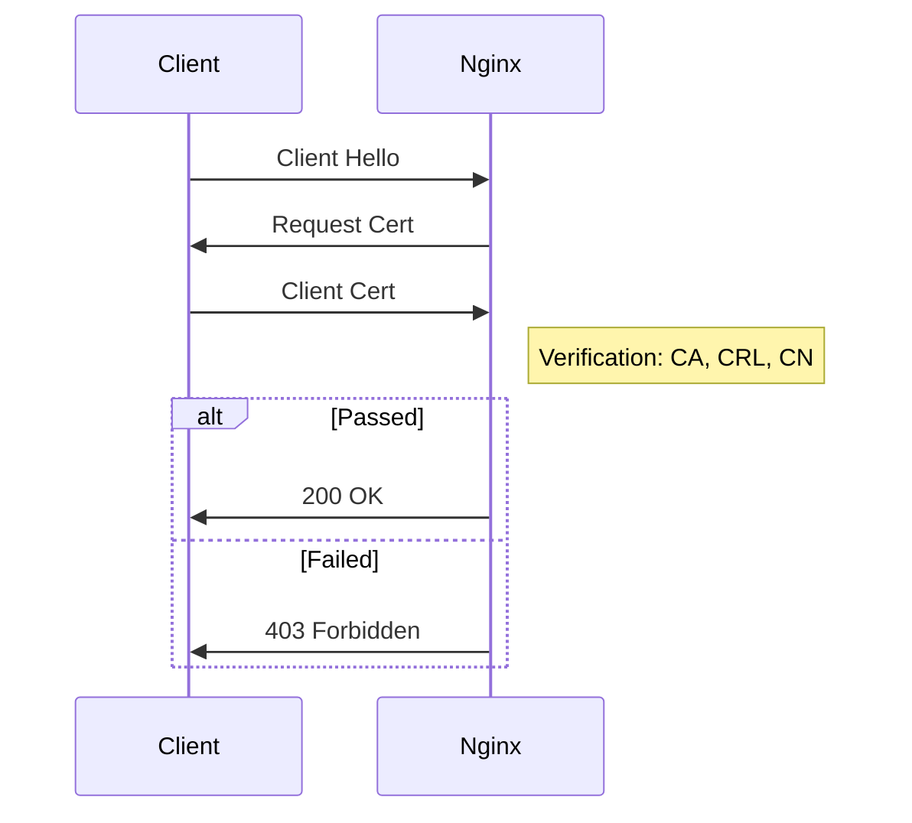

---
title: "Securing Nginx with Client Certificates (mTLS)"
slug: "secure-nginx-client-certificates"
description: "A comprehensive guide on implementing Mutual TLS (mTLS) with Nginx. Learn how to create your own Certificate Authority, generate client certificates, and configure your Linux server to restrict access to only authorized devices."
author: "José Manuel Requena Plens"
authorEmail: "mail@jmrp.io"
publishedDate: 2025-12-16
updatedDate: 2025-12-16
draft: false
# coverImage: "/path/to/cover.jpg"  # Optional: Custom cover image for this post
tags: ["nginx", "security", "linux", "certificates", "tutorial"]
references:
  - text: "Nginx Module ngx_http_ssl_module Documentation"
    url: "https://nginx.org/en/docs/http/ngx_http_ssl_module.html"
  - text: "OpenSSL Command Line Documentation"
    url: "https://www.openssl.org/docs/manmaster/man1/openssl.html"
  - text: "Cloudflare: What is Mutual TLS (mTLS)?"
    url: "https://www.cloudflare.com/learning/access-management/what-is-mutual-tls/"
  - text: "Smallstep: Hello mTLS"
    url: "https://smallstep.com/hello-mtls/"
  - text: "Okta: Authentication vs. Authorization"
    url: "https://www.okta.com/identity-101/authentication-vs-authorization/"
---
import Callout from '../../components/Callout.astro';
import References from '../../components/References.astro';

import CodeTabs from '../../components/CodeTabs.astro';
import CodeTabItem from '../../components/CodeTabItem.astro';


Implementing **Mutual TLS (mTLS)** is one of the most robust ways to secure private web services. Unlike standard password authentication, mTLS requires the client (your browser/device) to present a valid certificate signed by your own Certificate Authority (CA).

If the client doesn't have the certificate, the Nginx server rejects the connection entirely—often before even serving the login page. This is perfect for securing private administration panels, NAS interfaces, or internal tools like the one running on `secure.example.com`.

In this guide, I'll walk you through creating a bespoke Certificate Authority, generating client certificates, configuring Nginx, and handling advanced scenarios like **revoking access** for lost devices or restricting specific users.

## How it Works

Before diving into the commands, let's look at the handshake process.

### The Full Logic Flow

Here is how Nginx effectively decides who gets in:



## Strategies and Use Cases

Why go through the trouble of managing certificates?

1.  **Zero Trust Access**: Even if an attacker steals your password, they can't access the site without the physical file (the private key/certificate) installed on their device.
2.  **Reduction of Attack Surface**: "Script kiddies" and bots scanning for vulnerabilities (like open WordPress login pages) will simply receive a 400 Bad Request or connection reset. They won't even see the application.
3.  **Seamless Experience**: Once installed, the browser handles the handshake automatically. No need to type 2FA codes every time.

## Prerequisites

- A Linux server (Debian/Ubuntu/CentOS) with Nginx installed.
- Access to the terminal.
- `openssl` installed (standard on almost all Linux distros).

---

## Step 1: Create Your Certificate Authority (CA)

First, we need to become our own Authority. To ensure we can properly revoke certificates later, we need a consistent configuration and database.

Create a directory to store your keys safely and set up the CA database:

```bash
mkdir -p /etc/nginx/client-certs
cd /etc/nginx/client-certs
mkdir -p newcerts
touch index.txt
echo 1000 > serial
```

### 1. Create a Minimal `openssl.cnf`

Create a file named `openssl.cnf` in this directory. This file ensures that `openssl ca` (used for signing and revocation) knows where your files are.

```ini title="/etc/nginx/client-certs/openssl.cnf"
[ ca ]
default_ca = CA_default

[ CA_default ]
dir             = .
database        = $dir/index.txt
new_certs_dir   = $dir/newcerts
certificate     = $dir/ca.crt
serial          = $dir/serial
private_key     = $dir/ca.key
default_days    = 365
default_crl_days= 30
default_md      = sha256
policy          = policy_loose
copy_extensions = copy

[ policy_loose ]
countryName             = optional
stateOrProvinceName     = optional
localityName            = optional
organizationName        = optional
organizationalUnitName  = optional
commonName              = supplied
emailAddress            = optional

[ req ]
distinguished_name = req_distinguished_name
prompt             = no

[ req_distinguished_name ]
# You can change these to match your organization
C  = US
ST = State
L  = City
O  = MyPrivateServer
OU = IT
CN = MyRootCA
```

### 2. Generate the CA Key and Certificate

Now generate the root CA.

**Option A: Interactive (Guided)**

```bash
# Generate CA private key
openssl genrsa -des3 -out ca.key 4096

# Generate the CA Root Certificate
openssl req -new -x509 -days 3650 -key ca.key -out ca.crt -config openssl.cnf
```

**Option B: Non-Interactive (Fast)**

If you want to skip the prompts and password (useful for scripts).

<Callout type="warning">
  **Security Note:** The `-nodes` flag stands for "No DES". This means the private key will **not** be encrypted with a password. If someone gains access to the `ca.key` file, they can sign certificates without needing a password.
</Callout>

```bash
# Generate key without password (-nodes) and cert in one go
openssl req -new -x509 -nodes -days 3650 -out ca.crt -keyout ca.key -config openssl.cnf
```

You can verify your new CA certificate content:

```bash
openssl x509 -in ca.crt -text -noout | head -n 10
```

*Output example:*
```text
Certificate:
    Data:
        Version: 3 (0x2)
        Serial Number:
            5f:3b:0a...
        Signature Algorithm: sha256WithRSAEncryption
        Issuer: C=US, ST=State, L=City, O=MyPrivateServer, OU=IT, CN=MyRootCA
        Validity
            Not Before: Dec 16 18:00:00 2025 GMT
```

---

## Step 2: Generate Client Certificates

Now let's create a certificate for a specific user (e.g., "iphone-user" or "admin-laptop").

### 1. Generate User Private Key and CSR

**Option A: Interactive**

```bash
# Generate client private key
openssl genrsa -out user.key 2048

# Create the CSR (answering the prompts, Common Name is important - e.g. user ID)
openssl req -new -key user.key -out user.csr
```

**Option B: Non-Interactive (One-Liner)**

<Callout type="info">
    Just like with the CA, we use `-nodes` here to create an unencrypted private key.
</Callout>

```bash
# Generate key and CSR with a specific Common Name (CN)
openssl req -new -newkey rsa:2048 -nodes -keyout user.key -out user.csr -subj "/CN=iphone-user"
```

### 2. Sign the CSR with your CA

This is the most critical step. We use `openssl ca` to sign the request, which adds it to our database so we can revoke it later if needed.

**Option A: Interactive (Review details)**

```bash
openssl ca -config openssl.cnf -in user.csr -out user.crt
```
*You will be asked to confirm signing (Y/n).*

**Option B: Non-Interactive (Batch mode)**

Use the `-batch` flag to automatically answer "yes" to all prompts.

```bash
openssl ca -config openssl.cnf -batch -in user.csr -out user.crt
```

*Output example:*
```
Check that the request matches the signature
Signature ok
Certificate Details:
        ...
        Subject:
            commonName                = iphone-user
Certificate is to be certified until Dec 16 18:05:00 2026 GMT (365 days)
Write out database with 1 new entries
Data Base Updated
```

### 3. Convert to PKCS#12 (.p12)

Browsers and mobile devices prefer the `.p12` format.

```bash
openssl pkcs12 -export -out user.p12 -inkey user.key -in user.crt -certfile ca.crt
```

You will be asked to create an **export password**. This protects the file itself.

---

## Step 3: Configure Nginx

With the certificates generated, we need to tell Server Block to trust any client signed by our CA.

Edit your site configuration (e.g., `/etc/nginx/sites-available/secure.example.com.conf`):

```nginx title="/etc/nginx/sites-available/secure.example.com.conf"
server {
    server_name secure.example.com;
    listen 443 ssl;

    # ... other SSL settings ...

    # ---------------------------------------------
    # Client Certificate Verification
    # ---------------------------------------------
    
    # Path to the CA certificate we created in Step 1
    ssl_client_certificate /etc/nginx/client-certs/ca.crt;
    
    # Enable verification
    ssl_verify_client on;
    
    # Optional: Verify chain depth
    ssl_verify_depth 2;

    location / {
        # ... proxy settings ...
    }
}
```

### Test and Reload

Before applying, always check the configuration syntax:

```bash
sudo nginx -t
sudo systemctl reload nginx
```

Now, if you try to visit `https://secure.example.com` from a device *without* the certificate, Nginx will return a **400 Bad Request (No required SSL certificate was sent)**. The gate is closed!

---

## Step 4: Advanced Access Control

By default, **any** client with a valid certificate signed by your CA can access the site. But what if you have multiple services and want to restrict "John" to *Service A* and "Alice" to *Service B*?

You can use the **Common Name (CN)** from the certificate to authorize specific users.

Open your Nginx config again. We will use the `map` directive (place this **outside** the `server` block, usually in `nginx.conf` or at the top of your site config):

```nginx
# Map the client certificate DN (Distinguished Name) to an access variable
map $ssl_client_s_dn $ssl_access_allowed {
    default 0;
    # Format: /CN=CommonName
    "/CN=iphone-admin" 1;
    "/CN=laptop-work" 1;
    "/CN=ipad-home" 1;
}
```

Then, inside your `server` block:

```nginx
server {
    # ... ssl configuration ...

    location / {
        # First, ensure the cert is valid (already handled by ssl_verify_client)
        
        # Then check our custom map
        if ($ssl_access_allowed = 0) {
            return 403 "Forbidden: You have a valid certificate, but are not authorized for this resource.";
        }
        
        # ... proxy_pass ...
    }
}
```

Now, creating a certificate for a friend won't automatically grant them access to this specific site unless you add their CN to the whitelist.

---

## Step 5: Revoking Certificates (CRL)

What happens if you lose your phone? The certificate on it is still valid for a year. You need a way to **revoke** it effectively. This is done using a **Certificate Revocation List (CRL)**.

### 1. Revoke a Certificate
Let's say `user.crt` (from the lost phone) needs to be revoked.

```bash
# Revoke using the CA config
openssl ca -config openssl.cnf -revoke user.crt
```

*Output example:*
```
Revoking Certificate 1000.
Data Base Updated
```

### 2. Generate the CRL File
After revoking, you must generate the list itself so Nginx can read it:

```bash
openssl ca -config openssl.cnf -gencrl -out crl.pem
```

*Output: (No output usually means success)*

### 3. Configure Nginx to Check the CRL
Update your Nginx server block to check this list:

```nginx
ssl_crl /etc/nginx/client-certs/crl.pem;
```

Reload Nginx. Now, even if the "lost phone" presents its certificate, Nginx sees it in the CRL and blocks access.

<Callout type="warning">
  **Maintenance:** You must regenerate the `crl.pem` file and reload Nginx every time you revoke a certificate.
</Callout>

---

## Step 6: Installing Certificates on Clients

Now you need to install the `.p12` file (generated in Step 2.3) onto your devices.

<Callout type="info">
  **Tip:** Transfer the `.p12` file securely. Use AirDrop, a private USB, or a secure cloud folder. Avoid sending it via plain email if possible.
</Callout>

<CodeTabs>
  <CodeTabItem label="iOS (iPhone/iPad)">
    1.  Send the `.p12` file to yourself via **AirDrop** or save it to **iCloud Drive** (Files app).
    2.  Tap on the file in the **Files** app.
    3.  Go to **Settings** > **Profile Downloaded** (appears at the top).
    4.  Install the profile and enter your device passcode.
    5.  Enter the certificate password.
    6.  The certificate is now installed! Safari will automatically use it when accessing the site.
  </CodeTabItem>
  <CodeTabItem label="macOS">
    1.  Double-click the `user.p12` file.
    2.  **Keychain Access** will open. You will be prompted for the *export password* you created earlier.
    3.  Ensure the certificate is added to your "login" keychain.
    4.  Restart your browser (Chrome/Safari). When you visit the site, macOS will prompt you to "Select a Certificate" to authenticate.
  </CodeTabItem>
  <CodeTabItem label="Windows">
    1.  Double-click the `user.p12` file.
    2.  The **Certificate Import Wizard** will launch.
    3.  Select **Current User**.
    4.  Enter the password.
    5.  Allow it to automatically select the certificate store (usually "Personal").
    6.  Restart your browser.
  </CodeTabItem>
  <CodeTabItem label="Android">
    1.  Save the `.p12` file to your device storage.
    2.  Go to **Settings** > **Security** > **Encryption & credentials** > **Install a certificate**.
    3.  Select **VPN & app user certificate**.
    4.  Navigate to the `.p12` file and select it.
    5.  Enter the password and give the certificate a name.
  </CodeTabItem>
</CodeTabs>

---

## Troubleshooting

Here are the most common issues you might face.

### 400 Bad Request (No required SSL certificate...)
*   **Cause:** The browser didn't send a certificate.
*   **Fix:** Ensure the `.p12` is installed. Restart the browser completely. Try **Incognito/Private** mode, as browsers sometimes stick to a "no-cert" session state.

### 400 Bad Request (The SSL certificate error...)
*   **Cause:** The certificate exists but Nginx doesn't like it.
*   **Fix:** Nginx might not trust the CA. Check `ssl_client_certificate`. Ensure the chain is correct.

### 403 Forbidden
*   **Cause:** The certificate was accepted, but access was denied later.
*   **Fix:** 
    *   If using CRL: The cert might be revoked.
    *   If using `map` (Access Control): The CN might not match. Check Nginx error logs (`/var/log/nginx/error.log`) to see the actual `$ssl_client_s_dn` being received.
    
### "Certificate Connection" Dialog loop
*   **Cause:** On macOS/iOS, sometimes the system prompts repeatedly.
*   **Fix:** Ensure the CA certificate is also trusted in the Keychain (though technically not required for client auth, it helps the OS validate the chain).

---

## Conclusion

You have now implemented military-grade authentication for your home server services. By combining Nginx's `ssl_verify_client` with your own Certificate Authority, you've ensured that only trusted devices can even *see* your login screen.

This setup is ideal for exposing sensitive services like TrueNAS, Home Assistant, or private Wikis to the internet without relying solely on their built-in login forms.

<References references={frontmatter.references} />
