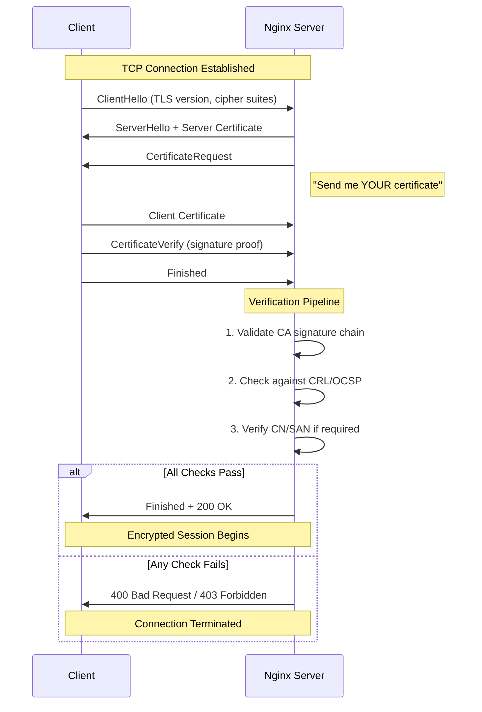
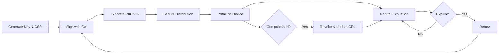

import Callout from "@components/ui/Callout.astro";
import Tabs from "@components/ui/Tabs.astro";
import TabPanel from "@components/ui/TabPanel.astro";
import CompareCode from "@components/ui/CompareCode.astro";
import TerminalCommand from "@components/ui/TerminalCommand.astro";
import FileContent from "@components/ui/FileContent.astro";
import TerminalOutput from "@components/ui/TerminalOutput.astro";
import Collapsible from "@components/ui/Collapsible.astro";
import Mermaid from "@components/ui/Mermaid.astro";
import Table from "@components/ui/Table.astro";

**[Mutual TLS (mTLS)](https://www.cloudflare.com/learning/access-management/what-is-mutual-tls/)** represents the gold standard for securing private web services. Unlike passwords, API keys, or even 2FA, mTLS requires the client (your browser/device) to present a cryptographic certificate signed by your own Certificate Authority (CA)—a secret that _cannot_ be phished, guessed, or brute-forced.

If the client doesn't have the certificate, Nginx rejects the connection **before** the application even loads. This is perfect for securing private administration panels, NAS interfaces, or internal tools.

In this comprehensive guide, I'll walk you through implementing mTLS on Nginx, covering everything from creating a certificate authority to advanced topics like **OCSP vs CRL revocation**, **Zero Trust architecture**, and **performance tuning**. This guide incorporates best practices from [Smallstep](https://smallstep.com/hello-mtls), [SSL.com](https://www.ssl.com/article/authenticating-users-and-iot-devices-with-mutual-tls/), and [official Nginx documentation](https://nginx.org/en/docs/http/ngx_http_ssl_module.html).

---

## Why mTLS? The Zero Trust Approach

In the modern security landscape, the perimeter-based model ("trust everything inside the firewall") is obsolete. **[Zero Trust](https://www.cloudflare.com/learning/security/glossary/what-is-zero-trust/)** assumes that attackers may already be inside your network and requires verification for every access request.

mTLS is a cornerstone of Zero Trust architecture because it provides **mutual authentication**: both the server and client verify each other's identity using cryptographic certificates.

<Table title="mTLS vs Other Authentication Methods">
  <thead>
    <tr>
      <th>Method</th>
      <th>Phishable?</th>
      <th>Credential Storage</th>
      <th>Automation</th>
      <th>Zero Trust</th>
    </tr>
  </thead>
  <tbody>
    <tr>
      <td><strong>Username/Password</strong></td>
      <td data-status="error">Yes</td>
      <td>Server database</td>
      <td>Easy</td>
      <td data-status="error">No</td>
    </tr>
    <tr>
      <td><strong>API Keys</strong></td>
      <td data-status="error">Yes (if exposed)</td>
      <td>Server + client</td>
      <td>Easy</td>
      <td data-status="error">No</td>
    </tr>
    <tr>
      <td><strong>Password + 2FA</strong></td>
      <td data-status="warning">Partially</td>
      <td>Server + authenticator</td>
      <td>Hard</td>
      <td data-status="warning">Partial</td>
    </tr>
    <tr>
      <td><strong>mTLS</strong></td>
      <td data-status="success">No</td>
      <td>Hardware/keychain</td>
      <td>Medium</td>
      <td data-status="success">Yes</td>
    </tr>
  </tbody>
</Table>

### Why mTLS Cannot Be Phished

Unlike passwords, client certificates:

1. **Are never transmitted** — only a signature proving possession is sent
2. **Are bound to hardware** — stored in secure keychains/TPMs
3. **Require private key access** — the private key never leaves the device
4. **Are validated cryptographically** — forging is computationally infeasible

<Callout type="keypoint" icon="mdi:shield-check">
  **Key Insight:** With mTLS, even if an attacker steals your password AND intercepts your 2FA code, they still cannot access the protected resource without the certificate file installed on an authorized device.
</Callout>

---

## One-Way TLS vs Mutual TLS

Understanding the difference is fundamental:

<Table title="One-Way TLS vs Mutual TLS">
  <thead>
    <tr>
      <th>Aspect</th>
      <th>One-Way TLS (Standard HTTPS)</th>
      <th>Mutual TLS (mTLS)</th>
    </tr>
  </thead>
  <tbody>
    <tr>
      <td><strong>Server authenticates to</strong></td>
      <td>Client (browser)</td>
      <td>Client (browser)</td>
    </tr>
    <tr>
      <td><strong>Client authenticates to</strong></td>
      <td data-status="error">Not verified</td>
      <td data-status="success">Server verifies client cert</td>
    </tr>
    <tr>
      <td><strong>Certificate requirement</strong></td>
      <td>Server only</td>
      <td>Both server and client</td>
    </tr>
    <tr>
      <td><strong>Use case</strong></td>
      <td>Public websites</td>
      <td>APIs, admin panels, IoT, B2B</td>
    </tr>
  </tbody>
</Table>

### The Standard HTTPS Model

In regular HTTPS, only the server presents a certificate. The client (browser) verifies it, but the server has no way to verify _who_ the client is—it just knows the connection is encrypted.

### The mTLS Enhancement

mTLS adds a second step: after verifying the server, the **server requests a certificate from the client**. Only clients presenting a valid certificate signed by a trusted CA are allowed to continue.

---

## The mTLS Handshake Flow

Understanding the handshake helps with debugging. Here's the complete flow:

<Mermaid caption="Nginx mTLS Handshake Flow" maxWidth="550px">

```mermaid-render
sequenceDiagram
    participant C as Client
    participant N as Nginx Server
    
    Note over C,N: TCP Connection Established
    
    C->>N: ClientHello (TLS version, cipher suites)
    N->>C: ServerHello + Server Certificate
    N->>C: CertificateRequest
    Note right of N: "Send me YOUR certificate"
    
    C->>N: Client Certificate
    C->>N: CertificateVerify (signature proof)
    C->>N: Finished
    
    Note over N: Verification Pipeline
    N->>N: 1. Validate CA signature chain
    N->>N: 2. Check against CRL/OCSP
    N->>N: 3. Verify CN/SAN if required
    
    alt All Checks Pass
        N->>C: Finished + 200 OK
        Note over C,N: Encrypted Session Begins
    else Any Check Fails
        N->>C: 400 Bad Request / 403 Forbidden
        Note over C,N: Connection Terminated
    end
```
</Mermaid>

### Key Steps Explained

1. **ClientHello**: Client initiates TLS, proposing cipher suites
2. **ServerHello**: Server responds with its certificate
3. **CertificateRequest**: Server asks client to prove identity
4. **Client Certificate**: Client sends its certificate
5. **CertificateVerify**: Client proves it owns the private key (without revealing it)
6. **Verification**: Server validates the entire chain

---

## Prerequisites & Directory Setup

Before starting, ensure you have:

- A Linux server (Debian/Ubuntu/CentOS/RHEL) with Nginx installed
- [OpenSSL](https://docs.openssl.org/) (minimum version 1.1.1, check with `openssl version`, recommended 3.5.0+)
- Root or sudo access

### Create Your PKI Directory

A well-organized directory structure is essential for managing certificates:

<TerminalCommand>
```bash
# Create the main directory structure
sudo mkdir -p /etc/nginx/pki/{ca,certs,crl,private,newcerts}
cd /etc/nginx/pki

# Secure the private directory
sudo chmod 700 private

# Initialize OpenSSL CA database files
sudo touch index.txt
echo 1000 | sudo tee serial > /dev/null
echo 1000 | sudo tee crlnumber > /dev/null
```
</TerminalCommand>

<Callout type="info" icon="mdi:folder-outline">
  **Directory Structure Explained:**
  
  - `ca/` — Certificate Authority certificates
  - `certs/` — Issued client and server certificates
  - `private/` — Private keys (chmod 700!)
  - `crl/` — Certificate Revocation Lists
  - `newcerts/` — OpenSSL's archive of issued certs
</Callout>

---

## Creating Your Certificate Authority

A CA is the root of trust in your PKI. All client certificates must be signed by this CA for Nginx to accept them.

### CA Design Decisions

Before generating, decide on these parameters:

<Table title="CA Configuration Choices">
  <thead>
    <tr>
      <th>Parameter</th>
      <th>Recommendation</th>
      <th>Rationale</th>
    </tr>
  </thead>
  <tbody>
    <tr>
      <td><strong>Key Size</strong></td>
      <td>4096-bit RSA or P-384 ECDSA</td>
      <td>Future-proof, quantum-resistant concerns</td>
    </tr>
    <tr>
      <td><strong>Validity</strong></td>
      <td>10 years for CA</td>
      <td>Longer than any client cert</td>
    </tr>
    <tr>
      <td><strong>Hash Algorithm</strong></td>
      <td>SHA-256 minimum</td>
      <td>SHA-1 is deprecated</td>
    </tr>
    <tr>
      <td><strong>Extensions</strong></td>
      <td><code>CA:TRUE</code>, <code>keyUsage:keyCertSign,cRLSign</code></td>
      <td>Required for signing certs and CRLs</td>
    </tr>
  </tbody>
</Table>

### Create the OpenSSL Configuration

Create a comprehensive OpenSSL configuration file:

<FileContent filename="/etc/nginx/pki/openssl.cnf" icon="mdi:file-cog">
```ini
# =============================================================
# OpenSSL Configuration for mTLS Certificate Authority
# =============================================================

[ ca ]
default_ca = CA_default

[ CA_default ]
# Directory structure
dir               = /etc/nginx/pki
database          = $dir/index.txt
new_certs_dir     = $dir/newcerts
certificate       = $dir/ca/ca.crt
serial            = $dir/serial
private_key       = $dir/private/ca.key
crlnumber         = $dir/crlnumber
crl               = $dir/crl/ca.crl

# Certificate defaults
default_days      = 365          # Client certs valid 1 year
default_crl_days  = 30           # CRL valid 30 days
default_md        = sha256       # Use SHA-256
preserve          = no
policy            = policy_loose
copy_extensions   = copy         # Copy SANs from CSR

[ policy_loose ]
countryName             = optional
stateOrProvinceName     = optional
localityName            = optional
organizationName        = optional
organizationalUnitName  = optional
commonName              = supplied
emailAddress            = optional

# =============================================================
# CA Certificate Request Settings
# =============================================================
[ req ]
default_bits        = 4096
distinguished_name  = req_distinguished_name
string_mask         = utf8only
default_md          = sha256
x509_extensions     = v3_ca
prompt              = no

[ req_distinguished_name ]
C                   = ES
ST                  = Valencia
L                   = Valencia
O                   = JMRP-IO-LAB
OU                  = Infrastructure Security
CN                  = JMRP-IO-LAB Root CA

# =============================================================
# Certificate Extensions
# =============================================================

# For the CA certificate itself
[ v3_ca ]
subjectKeyIdentifier    = hash
authorityKeyIdentifier  = keyid:always,issuer
basicConstraints        = critical, CA:TRUE
keyUsage                = critical, digitalSignature, cRLSign, keyCertSign

# For client certificates
[ v3_client ]
subjectKeyIdentifier    = hash
authorityKeyIdentifier  = keyid,issuer
basicConstraints        = critical, CA:FALSE
keyUsage                = critical, nonRepudiation, digitalSignature, keyEncipherment
extendedKeyUsage        = clientAuth
```
</FileContent>

### Generate the CA Key and Certificate

<TerminalCommand>
```bash
cd /etc/nginx/pki

# Generate CA private key (4096-bit RSA)
sudo openssl genrsa -out private/ca.key 4096

# Secure the private key
sudo chmod 400 private/ca.key

# Generate the self-signed CA certificate (valid 10 years)
sudo openssl req -new -x509 -days 3650 \
    -key private/ca.key \
    -out ca/ca.crt \
    -config openssl.cnf \
    -extensions v3_ca
```
</TerminalCommand>

### Verify Your CA Certificate

<TerminalCommand>
  openssl x509 -in ca/ca.crt -text -noout | head -30
</TerminalCommand>

<TerminalOutput title="CA Certificate Details">
Certificate:
    Data:
        Version: 3 (0x2)
        Serial Number:
            1a:c9:b8:c1:74:7b:93:ff:b7:be:e1:fb:b5:2e:cd:b1
        Signature Algorithm: sha256WithRSAEncryption
        Issuer: C = ES, ST = Valencia, L = Valencia, O = JMRP-IO-LAB, OU = Infrastructure Security, CN = JMRP-IO-LAB Root CA
        Validity
            Not Before: Jan 12 12:00:00 2026 GMT
            Not After : Jan 10 12:00:00 2036 GMT
        Subject: C = ES, ST = Valencia, L = Valencia, O = JMRP-IO-LAB, OU = Infrastructure Security, CN = JMRP-IO-LAB Root CA
        X509v3 extensions:
            X509v3 Subject Key Identifier: 
                C4:CD:09:55:A1:CB:27:C1:00:B6:17:E3:AE:B5:65:1B
            X509v3 Basic Constraints: critical
                CA:TRUE
            X509v3 Key Usage: critical
                Digital Signature, Certificate Sign, CRL Sign
</TerminalOutput>

---

## Generating Client Certificates

Each client (device, user, or service) needs its own certificate signed by your CA.

### SAN vs CN: Which to Use?

<Table title="Subject Alternative Name (SAN) vs Common Name (CN)">
  <thead>
    <tr>
      <th>Aspect</th>
      <th>Common Name (CN)</th>
      <th>Subject Alternative Name (SAN)</th>
    </tr>
  </thead>
  <tbody>
    <tr>
      <td><strong>Standard</strong></td>
      <td>Legacy (deprecated for server certs)</td>
      <td>Modern, RFC 6125 compliant</td>
    </tr>
    <tr>
      <td><strong>Multiple identities</strong></td>
      <td data-status="error">No</td>
      <td data-status="success">Yes (DNS, email, URI)</td>
    </tr>
    <tr>
      <td><strong>Best for</strong></td>
      <td>Simple client identification</td>
      <td>Services, multi-identity clients</td>
    </tr>
  </tbody>
</Table>

For simple user identification (like we're doing), CN is sufficient. For service-to-service authentication, use SANs.

### Generate a Client Certificate

<TerminalCommand>
```bash
cd /etc/nginx/pki

# Set device/user name
CLIENT_NAME="iphone-jmrp"

# Generate client private key
sudo openssl genrsa -out private/${CLIENT_NAME}.key 2048

# Create Certificate Signing Request (CSR)
sudo openssl req -new \
    -key private/${CLIENT_NAME}.key \
    -out certs/${CLIENT_NAME}.csr \
    -subj "/CN=${CLIENT_NAME}"

# Sign with your CA
sudo openssl ca -config openssl.cnf \
    -extensions v3_client \
    -batch \
    -in certs/${CLIENT_NAME}.csr \
    -out certs/${CLIENT_NAME}.crt
```
</TerminalCommand>

<TerminalOutput title="Certificate Signing Output">
Using configuration from openssl.cnf
Check that the request matches the signature
Signature ok
The Subject's Distinguished Name is as follows
commonName            :ASN.1 12:'iphone-jmrp'
Certificate is to be certified until Jan 12 12:00:00 2027 GMT (365 days)

Write out database with 1 new entries
Database updated
</TerminalOutput>

### PKCS12 vs PEM: Export Formats

<Table title="Certificate Format Comparison">
  <thead>
    <tr>
      <th>Format</th>
      <th>Contains</th>
      <th>Best For</th>
      <th>Password Protected</th>
    </tr>
  </thead>
  <tbody>
    <tr>
      <td><strong>PEM (.crt, .key)</strong></td>
      <td>Separate text files</td>
      <td>Linux servers, scripting</td>
      <td>Optional</td>
    </tr>
    <tr>
      <td><strong>PKCS12 (.p12, .pfx)</strong></td>
      <td>All-in-one binary bundle</td>
      <td>Browsers, mobile, Windows</td>
      <td>Required</td>
    </tr>
  </tbody>
</Table>

### Create PKCS12 Bundle for Clients

<TerminalCommand>
```bash
# Bundle certificate, key, and CA into .p12 file
sudo openssl pkcs12 -export \
    -out certs/${CLIENT_NAME}.p12 \
    -inkey private/${CLIENT_NAME}.key \
    -in certs/${CLIENT_NAME}.crt \
    -certfile ca/ca.crt \
    -name "${CLIENT_NAME}"

# You will be prompted for an export password
# This protects the .p12 file during transfer
```
</TerminalCommand>

<Callout type="warning" icon="mdi:alert">
  **Security:** Choose a strong export password. This password protects the certificate during transfer to client devices. Transmit it separately from the .p12 file (e.g., via encrypted message or in person).
</Callout>

---

## Configuring Nginx for mTLS

Now configure Nginx to require and validate client certificates.

### Understanding ssl_verify_client Options

The `ssl_verify_client` directive controls how Nginx handles client certificates:

<Table title="ssl_verify_client Options">
  <thead>
    <tr>
      <th>Value</th>
      <th>Behavior</th>
      <th>Use Case</th>
    </tr>
  </thead>
  <tbody>
    <tr>
      <td><code>on</code></td>
      <td>Require valid cert; reject without</td>
      <td>Strict access control (recommended)</td>
    </tr>
    <tr>
      <td><code>optional</code></td>
      <td>Accept if valid; proceed without</td>
      <td>Hybrid auth, optional verification</td>
    </tr>
    <tr>
      <td><code>optional_no_ca</code></td>
      <td>Accept any cert, no CA validation</td>
      <td>Development/testing only</td>
    </tr>
    <tr>
      <td><code>off</code></td>
      <td>No client certificate required</td>
      <td>Standard HTTPS</td>
    </tr>
  </tbody>
</Table>

<Callout type="warning" icon="mdi:shield-alert">
  **Never use `optional_no_ca` in production!** It accepts _any_ certificate without validating the CA chain, defeating the purpose of mTLS.
</Callout>

### Complete Nginx Configuration

<FileContent filename="/etc/nginx/sites-available/secure.example.com.conf" icon="devicon:nginx">
```nginx
server {
    listen 443 ssl http2;
    listen [::]:443 ssl http2;
    server_name secure.example.com;
    
    # =================================================
    # Server TLS Configuration
    # =================================================
    ssl_certificate     /etc/ssl/certs/secure.example.com.crt;
    ssl_certificate_key /etc/ssl/private/secure.example.com.key;
    
    # =================================================
    # Client Certificate (mTLS) Configuration
    # =================================================
    
    # Path to your Certificate Authority
    ssl_client_certificate /etc/nginx/pki/ca/ca.crt;
    
    # Require valid client certificate
    ssl_verify_client on;
    
    # Verify up to 2 levels in the certificate chain
    ssl_verify_depth 2;
    
    # Optional: Certificate Revocation List
    # ssl_crl /etc/nginx/pki/crl/ca.crl;
    
    # =================================================
    # TLS Protocol Configuration
    # =================================================
    ssl_protocols TLSv1.2 TLSv1.3;
    ssl_ciphers ECDHE-ECDSA-AES128-GCM-SHA256:ECDHE-RSA-AES128-GCM-SHA256:ECDHE-ECDSA-AES256-GCM-SHA384:ECDHE-RSA-AES256-GCM-SHA384;
    ssl_prefer_server_ciphers on;
    
    # Performance: SSL Session Caching
    ssl_session_cache shared:SSL:10m;
    ssl_session_timeout 1d;
    ssl_session_tickets off;
    
    # =================================================
    # Logging (Include Client DN for Debugging)
    # =================================================
    access_log /var/log/nginx/secure.access.log combined;
    error_log /var/log/nginx/secure.error.log warn;
    
    # =================================================
    # Application
    # =================================================
    location / {
        # Example: Pass client info to backend
        proxy_set_header X-Client-DN $ssl_client_s_dn;
        proxy_set_header X-Client-Verify $ssl_client_verify;
        proxy_set_header X-Client-Fingerprint $ssl_client_fingerprint;
        
        proxy_pass http://127.0.0.1:8080;
    }
}
```
</FileContent>

### Test and Reload

<TerminalCommand>
```bash
# Test configuration syntax
sudo nginx -t

# If successful, reload
sudo systemctl reload nginx
```
</TerminalCommand>

Now, accessing `https://secure.example.com` without a valid client certificate will return:

<TerminalOutput title="Access Denied Without Certificate">
400 Bad Request
No required SSL certificate was sent
</TerminalOutput>

---

## TLS Protocol & Cipher Configuration

Proper TLS configuration is critical for security. Here's what each setting does:

### Protocol Version Selection

<Table title="TLS Protocol Versions">
  <thead>
    <tr>
      <th>Version</th>
      <th>Status</th>
      <th>Security</th>
    </tr>
  </thead>
  <tbody>
    <tr>
      <td>TLS 1.0</td>
      <td data-status="error">Deprecated</td>
      <td>Vulnerable (BEAST, POODLE)</td>
    </tr>
    <tr>
      <td>TLS 1.1</td>
      <td data-status="error">Deprecated</td>
      <td>Weak ciphers, no AEAD</td>
    </tr>
    <tr>
      <td>TLS 1.2</td>
      <td data-status="success">Supported</td>
      <td>Secure with proper ciphers</td>
    </tr>
    <tr>
      <td>TLS 1.3</td>
      <td data-status="success">Recommended</td>
      <td>Best security, faster handshake</td>
    </tr>
  </tbody>
</Table>

### Recommended Configuration

<FileContent filename="TLS Security Settings" icon="mdi:lock">
```nginx
# Only allow TLS 1.2 and 1.3
ssl_protocols TLSv1.2 TLSv1.3;

# Strong cipher suites (ECDHE for forward secrecy, GCM for AEAD)
ssl_ciphers ECDHE-ECDSA-AES128-GCM-SHA256:ECDHE-RSA-AES128-GCM-SHA256:ECDHE-ECDSA-AES256-GCM-SHA384:ECDHE-RSA-AES256-GCM-SHA384:ECDHE-ECDSA-CHACHA20-POLY1305:ECDHE-RSA-CHACHA20-POLY1305;

# Server chooses the cipher (prevents downgrade attacks)
ssl_prefer_server_ciphers on;

# Session resumption for performance
ssl_session_cache shared:SSL:10m;
ssl_session_timeout 1d;

# Disable session tickets (more secure, less memory)
ssl_session_tickets off;

# Diffie-Hellman parameters for non-ECDHE (if needed)
# Generate with: openssl dhparam -out /etc/nginx/dhparam.pem 4096
ssl_dhparam /etc/nginx/dhparam.pem;
```
</FileContent>

<Callout type="tip" icon="mdi:speedometer">
  **Performance Tip:** SSL session caching significantly reduces handshake overhead. A 10MB cache can store ~40,000 sessions. This is especially important for mTLS where handshakes are more expensive.
</Callout>

---

## Advanced Access Control

By default, _any_ client with a valid certificate signed by your CA can access the site. You can add granular controls using Nginx variables.

### Useful mTLS Variables

Nginx exposes these variables for client certificate information:

<Table title="Nginx mTLS Variables">
  <thead>
    <tr>
      <th>Variable</th>
      <th>Content</th>
      <th>Example</th>
    </tr>
  </thead>
  <tbody>
    <tr>
      <td><code>$ssl_client_verify</code></td>
      <td>Verification result</td>
      <td><code>SUCCESS</code>, <code>FAILED:reason</code></td>
    </tr>
    <tr>
      <td><code>$ssl_client_s_dn</code></td>
      <td>Subject DN</td>
      <td><code>CN=iphone-jmrp</code></td>
    </tr>
    <tr>
      <td><code>$ssl_client_i_dn</code></td>
      <td>Issuer DN</td>
      <td><code>CN=JMRP-IO-LAB Root CA</code></td>
    </tr>
    <tr>
      <td><code>$ssl_client_fingerprint</code></td>
      <td>SHA1 fingerprint</td>
      <td><code>AB:CD:EF:12:34:...</code></td>
    </tr>
    <tr>
      <td><code>$ssl_client_serial</code></td>
      <td>Certificate serial</td>
      <td><code>1000</code></td>
    </tr>
  </tbody>
</Table>

### CN-Based Authorization with Map

Use the `map` directive to create an allowlist:

<FileContent filename="/etc/nginx/conf.d/mtls-access.conf" icon="devicon:nginx">
```nginx
# Place this OUTSIDE the server block (in nginx.conf or included file)

# Map client DN to access permission
map $ssl_client_s_dn $mtls_access_allowed {
    default 0;
    
    # Allowed certificates by CN
    "CN=iphone-jmrp"      1;
    "CN=macbook-jmrp"     1;
    "CN=ipad-home"        1;
    
    # Pattern matching with regex
    ~"CN=admin-.*"        1;    # All admin-* certificates
}
```
</FileContent>

Then in your server block:

<FileContent filename="Server Block Access Control" icon="devicon:nginx">
```nginx
server {
    # ... SSL configuration ...
    
    location / {
        # Verify certificate is valid (handled by ssl_verify_client on)
        # Then check our custom authorization
        if ($mtls_access_allowed = 0) {
            return 403 "Valid certificate, but not authorized for this resource.";
        }
        
        proxy_pass http://backend;
    }
}
```
</FileContent>

---

## Certificate Revocation: CRL vs OCSP

What happens when a device is lost or compromised? You need to **revoke** its certificate. There are two methods:

<Table title="CRL vs OCSP Comparison">
  <thead>
    <tr>
      <th>Aspect</th>
      <th>CRL (Certificate Revocation List)</th>
      <th>OCSP (Online Certificate Status)</th>
    </tr>
  </thead>
  <tbody>
    <tr>
      <td><strong>How it works</strong></td>
      <td>Server downloads full list of revoked certs</td>
      <td>Server queries responder for single cert</td>
    </tr>
    <tr>
      <td><strong>Timeliness</strong></td>
      <td>Delayed (depends on CRL refresh interval)</td>
      <td>Near real-time</td>
    </tr>
    <tr>
      <td><strong>Bandwidth</strong></td>
      <td>Higher (downloads entire list)</td>
      <td>Lower (single query)</td>
    </tr>
    <tr>
      <td><strong>Nginx directive</strong></td>
      <td><code>ssl_crl</code></td>
      <td><code>ssl_stapling</code> (for server cert)</td>
    </tr>
    <tr>
      <td><strong>Complexity</strong></td>
      <td>Simple (file on disk)</td>
      <td>Requires OCSP responder service</td>
    </tr>
  </tbody>
</Table>

### Method 1: CRL (Recommended for Small Deployments)

#### Step 1: Revoke a Certificate

<TerminalCommand>
```bash
cd /etc/nginx/pki

# Revoke the certificate
sudo openssl ca -config openssl.cnf \
    -revoke certs/lost-device.crt
```
</TerminalCommand>

<TerminalOutput title="Revocation Output">
Using configuration from openssl.cnf
Revoking Certificate 1001.
Data Base Updated
</TerminalOutput>

#### Step 2: Generate the CRL File

<TerminalCommand>
```bash
# Generate the CRL
sudo openssl ca -config openssl.cnf \
    -gencrl -out crl/ca.crl

# Verify the CRL
openssl crl -in crl/ca.crl -text -noout
```
</TerminalCommand>

#### Step 3: Configure Nginx

<FileContent filename="Add to server block" icon="devicon:nginx">
```nginx
# Enable CRL checking
ssl_crl /etc/nginx/pki/crl/ca.crl;
```
</FileContent>

<TerminalCommand>
  sudo nginx -t && sudo systemctl reload nginx
</TerminalCommand>

<Callout type="warning" icon="mdi:refresh">
  **Important:** You must regenerate the CRL and reload Nginx **every time** you revoke a certificate. Consider automating this with a cron job.
</Callout>

### Method 2: OCSP (For Larger Deployments)

For enterprises with many certificates, OCSP is more efficient. This requires running an OCSP responder (beyond the scope of this guide, but tools like [step-ca](https://smallstep.com/docs/step-ca) provide this).

---

## Certificate Lifecycle Management

A complete lifecycle includes creation, distribution, monitoring, renewal, and revocation.

### The Certificate Lifecycle

<Mermaid caption="Certificate Lifecycle Flow" maxWidth="100%">

```mermaid-render
flowchart LR
    A[Generate Key & CSR] --> B[Sign with CA]
    B --> C[Export to PKCS12]
    C --> D[Secure Distribution]
    D --> E[Install on Device]
    E --> F[Monitor Expiration]
    F --> G{Expired?}
    G -->|No| F
    G -->|Yes| H[Renew]
    H --> B
    E --> I{Compromised?}
    I -->|Yes| J[Revoke & Update CRL]
    J --> F
```
</Mermaid>

### Automated Renewal Script

Create a script to generate new certificates before expiration:

<FileContent filename="/usr/local/bin/mtls-renew.sh" icon="mdi:bash">
```bash
#!/bin/bash
# mTLS Certificate Renewal Script

PKI_DIR="/etc/nginx/pki"
DAYS_BEFORE_EXPIRY=30

# Find certificates expiring soon
find "$PKI_DIR/certs" -name "*.crt" -type f | while read cert; do
    end_date=$(openssl x509 -enddate -noout -in "$cert" | cut -d= -f2)
    end_epoch=$(date -d "$end_date" +%s)
    now_epoch=$(date +%s)
    days_left=$(( (end_epoch - now_epoch) / 86400 ))
    
    if [ "$days_left" -lt "$DAYS_BEFORE_EXPIRY" ]; then
        CN=$(openssl x509 -subject -noout -in "$cert" | sed 's/.*CN = //')
        echo "Certificate for $CN expires in $days_left days. Renewing..."
        
        # Generate new certificate (implement your renewal logic)
        # openssl ca -config $PKI_DIR/openssl.cnf ...
    fi
done
```
</FileContent>

---

## Installing Certificates on Clients

Transfer the `.p12` file securely (AirDrop, USB, encrypted cloud) and install on each device.

<Tabs>
  <TabPanel label="iOS (iPhone/iPad)">
    1. Transfer the `.p12` file via **AirDrop** or save to **Files** app
    2. Tap on the file in Files
    3. Go to **Settings** → **Profile Downloaded** (appears at top)
    4. Tap **Install** and enter your device passcode
    5. Enter the certificate export password
    6. The certificate is now installed. Safari will use it automatically when visiting the mTLS site
    
    <Callout type="tip" icon="mdi:cellphone">
      **Tip:** If Safari doesn't prompt for the certificate, try private browsing first, then regular mode.
    </Callout>
  </TabPanel>
  
  <TabPanel label="macOS">
    1. Double-click the `.p12` file
    2. **Keychain Access** opens. Enter the export password
    3. Choose the **login** keychain (not System)
    4. Click **Add**
    5. Restart your browser
    6. When visiting the site, macOS prompts "Select a Certificate"
    
    <Callout type="info" icon="mdi:apple-finder">
      **Note:** You may need to set the certificate to "Always Trust" in Keychain Access if prompted.
    </Callout>
  </TabPanel>
  
  <TabPanel label="Windows">
    1. Double-click the `.p12` file
    2. **Certificate Import Wizard** launches
    3. Select **Current User** (not Local Machine)
    4. Enter the password
    5. Select "Automatically select the certificate store"
    6. Click **Finish**
    7. Restart your browser
    
    Edge and Chrome will now present the certificate when needed.
  </TabPanel>
  
  <TabPanel label="Android">
    1. Save `.p12` to device storage
    2. Go to **Settings** → **Security** → **Encryption & credentials**
    3. Tap **Install a certificate** → **VPN & app user certificate**
    4. Browse to the `.p12` file
    5. Enter the password and provide a name
    6. The certificate is installed for Chrome and other apps
  </TabPanel>
  
  <TabPanel label="Linux (curl)">
    For command-line/scripting access using PEM files:
    
    ```bash
    # Using curl with client certificate
    curl --cert /path/to/client.crt \
         --key /path/to/client.key \
         --cacert /path/to/ca.crt \
         https://secure.example.com
    
    # Or with PKCS12
    curl --cert-type P12 \
         --cert /path/to/client.p12:password \
         https://secure.example.com
    ```
  </TabPanel>
</Tabs>

---

## Troubleshooting Guide

### Common Errors and Solutions

<Table title="mTLS Error Diagnosis">
  <thead>
    <tr>
      <th>Error</th>
      <th>Cause</th>
      <th>Solution</th>
    </tr>
  </thead>
  <tbody>
    <tr>
      <td><code>400 No required SSL certificate was sent</code></td>
      <td>Browser didn't send a certificate</td>
      <td>Check certificate is installed; restart browser; try incognito mode</td>
    </tr>
    <tr>
      <td><code>400 The SSL certificate error</code></td>
      <td>Certificate validation failed</td>
      <td>Verify <code>ssl_client_certificate</code> points to correct CA</td>
    </tr>
    <tr>
      <td><code>403 Forbidden</code></td>
      <td>Cert valid but not authorized</td>
      <td>Check CRL or <code>map</code> rules; examine <code>error_log</code></td>
    </tr>
    <tr>
      <td>Certificate selection loop</td>
      <td>OS keeps prompting</td>
      <td>Trust the CA in keychain; restart browser</td>
    </tr>
    <tr>
      <td><code>ssl_client_verify: FAILED</code></td>
      <td>Chain validation failed</td>
      <td>Ensure full chain in ssl_client_certificate</td>
    </tr>
  </tbody>
</Table>

### Debugging Commands

#### Verify Certificate Against CA

<TerminalCommand>
```bash
# Verify a client certificate is valid against your CA
openssl verify -CAfile /etc/nginx/pki/ca/ca.crt \
    /etc/nginx/pki/certs/client.crt
```
</TerminalCommand>

#### Test mTLS Connection with curl

<TerminalCommand>
```bash
# Test mTLS connection
curl -v --cert client.crt --key client.key \
    --cacert ca.crt https://secure.example.com

# If using PKCS12
curl -v --cert-type P12 --cert client.p12:password \
    https://secure.example.com
```
</TerminalCommand>

#### Check Nginx Error Logs

<TerminalCommand>
```bash
# Watch error log in real-time
tail -f /var/log/nginx/error.log | grep ssl
```
</TerminalCommand>

<TerminalOutput title="Example Error Log Entry">
2026/01/12 12:00:00 [info] 1234#5678: *1 client certificate verification failed: certificate revoked, client: 192.168.1.100, server: secure.example.com
</TerminalOutput>

---

## Security Best Practices

### Key Management

<Callout type="warning" icon="mdi:key-alert">
  **Critical:** Your CA private key (`ca.key`) is the crown jewel. If compromised, an attacker can issue valid certificates. Protect it with:
  
  - File permissions: `chmod 400 ca.key`
  - Separate from web server (air-gapped for high security)
  - HSM for enterprise deployments
</Callout>

### Checklist

1. **Use 4096-bit RSA keys** for CA (2048 minimum for clients)
2. **Enable CRL/OCSP** to revoke compromised certificates
3. **Short client cert validity** (1 year max, shorter for high security)
4. **TLS 1.2+** only, with strong ciphers
5. **Session caching** for performance
6. **Monitor expiry** and automate renewal
7. **Separate CAs** for different trust levels if needed
8. **Log client DNs** for audit trails
9. **Regular rotation** of client certificates

---

## Deep Dive

### Official Documentation
- [Nginx ngx_http_ssl_module](https://nginx.org/en/docs/http/ngx_http_ssl_module.html) — All SSL/TLS directives
- [OpenSSL CA Documentation](https://docs.openssl.org/3.5/man1/openssl-ca/) — Certificate authority commands

### Tutorials & Guides
- [Smallstep Hello mTLS](https://smallstep.com/hello-mtls) — Interactive mTLS tutorial
- [SSL.com mTLS Guide](https://www.ssl.com/article/authenticating-users-and-iot-devices-with-mutual-tls/) — IoT and user authentication
- [Cloudflare: What is mTLS?](https://www.cloudflare.com/learning/access-management/what-is-mutual-tls/) — Conceptual overview

### Tools
- [step-ca](https://smallstep.com/docs/step-ca) — Modern certificate authority
- [cfssl](https://github.com/cloudflare/cfssl) — Cloudflare's PKI toolkit
- [easy-rsa](https://github.com/OpenVPN/easy-rsa) — Simple CA management scripts
