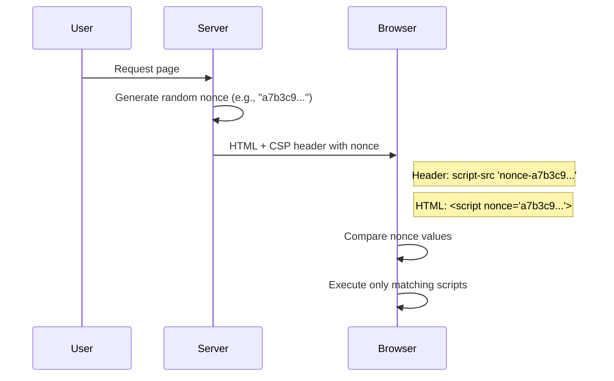

import Callout from "@components/ui/Callout.astro";
import Tabs from "@components/ui/Tabs.astro";
import TabPanel from "@components/ui/TabPanel.astro";
import CompareCode from "@components/ui/CompareCode.astro";
import FileContent from "@components/ui/FileContent.astro";
import Table from "@components/ui/Table.astro";
import TerminalOutput from "@components/ui/TerminalOutput.astro";
import Mermaid from "@components/ui/Mermaid.astro";
import Code from "@components/ui/Code.astro";

In the modern web, security cannot be an afterthought. **Cross-Site Scripting (XSS)** remains one of the most prevalent and dangerous vulnerabilities, allowing attackers to inject and execute malicious code in your users' browsers. **[Content Security Policy (CSP)](https://developer.mozilla.org/en-US/docs/Web/HTTP/Guides/CSP)** is the most effective countermeasure against these attacks, acting as a whitelist that tells the browser exactly which resources are allowed to load and execute.

However, implementing a strict CSP—especially on static sites generated by tools like **Astro**, **Next.js**, **Jekyll**, or **Hugo**—can be challenging. How do you use cryptographic nonces when your HTML is pre-built?

In this comprehensive guide, I'll explain how to implement an **A+ rated CSP** using [Nginx](https://nginx.org/en/docs/http/ngx_http_sub_module.html), drawing from the implementation on this very website (`jmrp.io`) and incorporating best practices from [Google](https://web.dev/articles/strict-csp), [OWASP](https://cheatsheetseries.owasp.org/cheatsheets/Content_Security_Policy_Cheat_Sheet.html), and [MDN](https://developer.mozilla.org/en-US/docs/Web/Security/Practical_implementation_guides/CSP).

---

## Why Do We Need CSP? The Threat Landscape

Before diving into the code, it's crucial to understand _what_ we are protecting against. CSP is not just a "nice to have"; it is a critical defense layer against several specific types of attacks.

<Table title="Threats Mitigated by CSP">
  <thead>
    <tr>
      <th>Threat</th>
      <th>Description</th>
      <th>CSP Mitigation</th>
    </tr>
  </thead>
  <tbody>
    <tr>
      <td><strong>XSS (Cross-Site Scripting)</strong></td>
      <td>Attackers inject malicious scripts that steal cookies, redirect users, or perform actions on their behalf</td>
      <td><code>script-src</code> with nonces/hashes blocks unauthorized scripts</td>
    </tr>
    <tr>
      <td><strong>Data Exfiltration</strong></td>
      <td>Attackers send sensitive data (keystrokes, form data) to malicious servers</td>
      <td><code>connect-src</code> limits where data can be sent</td>
    </tr>
    <tr>
      <td><strong>Clickjacking</strong></td>
      <td>Your site is embedded in an invisible iframe to trick users into clicking hidden buttons</td>
      <td><code>frame-ancestors 'none'</code> prevents embedding</td>
    </tr>
    <tr>
      <td><strong>Mixed Content</strong></td>
      <td>HTTP resources on HTTPS pages can be intercepted or modified</td>
      <td><code>upgrade-insecure-requests</code> forces HTTPS</td>
    </tr>
    <tr>
      <td><strong>Base Tag Injection</strong></td>
      <td>Attackers inject <code>&lt;base&gt;</code> tags to redirect relative URLs</td>
      <td><code>base-uri 'none'</code> blocks this attack</td>
    </tr>
    <tr>
      <td><strong>Plugin Exploits</strong></td>
      <td>Malicious Flash/Java plugins can execute arbitrary code</td>
      <td><code>object-src 'none'</code> disables plugins</td>
    </tr>
  </tbody>
</Table>

### Cross-Site Scripting (XSS) in Detail

<a href="https://developer.mozilla.org/en-US/docs/Glossary/Cross-site_scripting" target="_blank" rel="noopener noreferrer">XSS</a> is the primary threat CSP defends against. There are three main types:

1. **Stored XSS**: Malicious script is permanently stored on the target server (e.g., in a database)
2. **Reflected XSS**: Script is reflected off a web server in error messages or search results
3. **DOM-based XSS**: The vulnerability exists in client-side code rather than server-side

**How CSP Protects You:**

By defining a `script-src` whitelist with nonces or hashes, CSP tells the browser: "Only execute scripts from _this_ domain or scripts that have _this_ specific nonce." Even if an attacker injects `<script>alert('Hacked')</script>`, the browser will refuse to run it because it lacks the valid nonce.

---

## Understanding CSP Types: Allowlist vs. Strict

There are two fundamental approaches to implementing CSP, and **choosing the right one is critical** for your security posture.

### Allowlist-based CSP (Legacy Approach)

The traditional approach involves whitelisting specific domains:

<Code lang="nginx" aria-label="Allowlist-based CSP example to avoid">
```
# [BAD] AVOID: Allowlist-based CSP
script-src 'self' https://www.google-analytics.com https://cdn.example.com;
```
</Code>

<Callout type="warning" icon="mdi:alert">
  **Why Allowlists Are Problematic:**
  
  Research by Google found that [94.72% of real-world allowlist CSPs can be bypassed](https://research.google.com/pubs/pub45542.html). Common bypass vectors include:
  - **JSONP endpoints** on trusted domains that can execute arbitrary code
  - **CDN hosting** of attacker-controlled content
  - **AngularJS** on allowed domains enabling template injection
</Callout>

### Strict CSP (Recommended Approach)

Modern security best practices recommend a **strict CSP** based on nonces or hashes, not domain allowlists:

<Code lang="nginx" aria-label="Recommended strict nonce-based CSP">
```
# [OK] RECOMMENDED: Strict nonce-based CSP
script-src 'nonce-{RANDOM}' 'strict-dynamic';
object-src 'none';
base-uri 'none';
```
</Code>

<Callout type="keypoint" icon="mdi:check-decagram">
  **What Makes a CSP "Strict":**
  
  1. Uses **nonces** (`'nonce-abc123'`) or **hashes** (`'sha256-...'`) instead of allowlists
  2. Includes **`'strict-dynamic'`** to trust script chains
  3. Sets **`object-src 'none'`** to block plugins
  4. Sets **`base-uri 'none'`** to prevent base tag injection
</Callout>

---

## The Challenge: Static Content vs. Dynamic Security

A robust CSP relies on **nonces** (numbers used once)—random, unpredictable tokens generated for _every single request_.

### The Nonce Handshake

<Mermaid caption="CSP Nonce Handshake Flow" maxWidth="550px">

</Mermaid>

1. The server generates a token: `nonce="abc123..."`
2. The server sends this token in the `Content-Security-Policy` header
3. The server puts the _same_ token on `<script>` tags: `<script nonce="abc123...">`
4. The browser executes the script **only if** the header and tag match

### The Static Site Dilemma

**The Problem:** Static Site Generators (SSG) like Astro, Next.js, Hugo, or Jekyll build HTML files _once_ at build time. They cannot predict the random nonce that Nginx will generate weeks later when a user visits the site.

<CompareCode badTitle="Traditional SSG (Impossible)" goodTitle="Our Solution (Nginx Injection)">
  <div slot="bad">
    ```html
    <!-- Build time: 2025-12-01 -->
    <!-- Problem: Can't know future nonce! -->
    <script nonce="???">
      console.log('This will never work');
    </script>
    ```
  </div>
  <div slot="good">
    ```html
    <!-- Build time: Uses placeholder -->
    <script nonce="NGINX_NONCE_CSP">
      console.log('This works!');
    </script>
    <!-- Nginx replaces at request time -->
    ```
  </div>
</CompareCode>

---

## The Solution: Nginx Sub-Filter & Placeholders

The solution used on `jmrp.io` involves a partnership between the static build and the web server. This technique leverages Nginx's `ngx_http_sub_module` to perform real-time text substitution.

### Step 1: The Placeholder (Build Time)

In your source code (Astro, React, plain HTML), use a known, static string as a placeholder. I use `NGINX_NONCE_CSP`:

<FileContent filename="src/layouts/BaseLayout.astro" icon="simple-icons:astro">
```astro
---
// Layout component
---
<html>
  <head>
    <!-- Critical inline scripts use the placeholder -->
    <script is:inline nonce="NGINX_NONCE_CSP">
      // Theme detection to prevent flash of wrong theme
      const theme = localStorage.getItem('theme') || 
        (window.matchMedia('(prefers-color-scheme: dark)').matches ? 'dark' : 'light');
      document.documentElement.dataset.theme = theme;
    </script>
  </head>
  <body>
    <slot />
  </body>
</html>
```
</FileContent>

### Step 2: The Injection (Nginx Configuration)

Configure Nginx to:
1. Generate a unique request ID (our nonce)
2. Replace all occurrences of `NGINX_NONCE_CSP` with this ID
3. Include the same ID in the CSP header

<FileContent filename="/etc/nginx/sites-available/jmrp.io.conf" icon="devicon:nginx">
```nginx
server {
    listen 443 ssl;
    http2 on;
    server_name jmrp.io;
    
    # ========================================
    # STEP 1: Generate CSP Nonce
    # ========================================
    # Use Nginx's unique request ID as our nonce
    # $request_id is a 32-character hex string (128 bits of entropy)
    # This is cryptographically suitable for CSP nonces
    set $cspNonce $request_id;

    # ========================================
    # STEP 2: Configure Sub-Filter Module
    # ========================================
    # This module performs text substitution on responses
    # Requires: ngx_http_sub_module (included in most Nginx builds)
    
    sub_filter_once off;              # Replace ALL occurrences, not just first
    # Apply only to text-based content (exclude JSON to avoid corrupting API responses)
    sub_filter_types text/html text/css application/javascript text/xml application/xml;
    sub_filter NGINX_NONCE_CSP $cspNonce;  # The actual replacement

    # ========================================
    # STEP 3: Set the CSP Header
    # ========================================
    # Build a strict CSP using the same nonce variable
    add_header Content-Security-Policy "
        default-src 'none';
        script-src 'nonce-$cspNonce' 'strict-dynamic';
        style-src 'self' 'unsafe-inline';
        img-src 'self' data:;
        font-src 'self';
        connect-src 'self';
        object-src 'none';
        base-uri 'none';
        frame-ancestors 'none';
        form-action 'self';
        upgrade-insecure-requests;
    " always;
    
    # ... rest of server configuration
}
```
</FileContent>

<Callout type="info" icon="mdi:information">
  **Why `$request_id` is Safe for CSP Nonces:**
  
  Nginx's `$request_id` is:
  - **128 bits** of entropy (32 hex characters) — exceeds CSP's recommended minimum
  - **Unique per request** — freshly generated each time
  - **Unpredictable** — derived from system randomness
  
  This meets all [CSP nonce requirements](https://www.w3.org/TR/CSP3/#security-nonces).
</Callout>

### The Transformation (What Actually Happens)

Here's what happens "on the wire" when Nginx processes a request:

<Tabs>
  <TabPanel label="1. File on Disk">
    ```html
    <!-- Stored in /var/www/jmrp.io/index.html -->
    <script nonce="NGINX_NONCE_CSP">
      console.log('Theme detection script');
    </script>
    ```
  </TabPanel>
  <TabPanel label="2. HTTP Response Header">
    ```http
    HTTP/2 200 OK
    Content-Security-Policy: script-src 'nonce-a1b2c3d4e5f6g7h8i9j0k1l2m3n4o5p6' 'strict-dynamic'; ...
    Content-Type: text/html; charset=utf-8
    ```
  </TabPanel>
  <TabPanel label="3. HTML Sent to Browser">
    ```html
    <!-- What the user actually receives -->
    <script nonce="a1b2c3d4e5f6g7h8i9j0k1l2m3n4o5p6">
      console.log('Theme detection script');
    </script>
    ```
  </TabPanel>
</Tabs>

<Callout type="success">
  **Result:** The browser receives a valid HTML file with a matching nonce in both the header and the body, completely unaware that Nginx modified the HTML on the fly. This gives you the **performance of a static site** with the **security of a dynamic one**.
</Callout>

---

## Anatomy of a Strict CSP

Let's break down each component of a production-ready strict CSP policy.

### The `'strict-dynamic'` Directive

This is one of the most powerful and misunderstood CSP features:

<Code lang="nginx" aria-label="strict-dynamic CSP directive example">
```
script-src 'nonce-$cspNonce' 'strict-dynamic';
```
</Code>

<Callout type="keypoint" icon="mdi:lightbulb">
  **How `'strict-dynamic'` Works:**
  
  When you trust a script with a nonce, and that script dynamically loads another script (e.g., via `document.createElement('script')`), the dynamically created script **inherits the trust** without needing its own nonce.
  
  This is essential for:
  - Third-party analytics that load additional scripts
  - Module bundlers that dynamically load chunks
  - Any script that loads dependencies at runtime
</Callout>

**Example:**

<Code lang="html" aria-label="Example of script trust propagation with strict-dynamic">
```
<!-- This script has a valid nonce, so it runs -->
<script nonce="abc123">
  // This dynamically created script ALSO runs
  // because 'strict-dynamic' propagates trust
  const s = document.createElement('script');
  s.src = 'https://cdn.example.com/analytics.js';
  document.head.appendChild(s);
</script>
```
</Code>

<Callout type="warning">
  **Important:** When `'strict-dynamic'` is present, allowlist sources like `'self'` or `https://example.com` are **ignored** for script loading. Only nonces/hashes grant trust.
</Callout>

### Nonces vs. Hashes: When to Use Each

<Table title="Nonce vs. Hash Comparison">
  <thead>
    <tr>
      <th>Aspect</th>
      <th>Nonces</th>
      <th>Hashes</th>
    </tr>
  </thead>
  <tbody>
    <tr>
      <td><strong>Best For</strong></td>
      <td>Server-rendered pages, dynamic content</td>
      <td>Fully static sites, cached content</td>
    </tr>
    <tr>
      <td><strong>Generation</strong></td>
      <td>Random value per request</td>
      <td>Fixed SHA-256/384/512 of script content</td>
    </tr>
    <tr>
      <td><strong>Caching</strong></td>
      <td>Harder (each response is unique)</td>
      <td>Easy (hash is deterministic)</td>
    </tr>
    <tr>
      <td><strong>Script Changes</strong></td>
      <td>No CSP update needed</td>
      <td>Must recalculate and update hash</td>
    </tr>
    <tr>
      <td><strong>Example</strong></td>
      <td><code>'nonce-abc123...'</code></td>
      <td><code>'sha256-Xyz789...'</code></td>
    </tr>
  </tbody>
</Table>

**When to use hashes:**

Use hashes when you have **completely static** inline scripts that never change:

<Code lang="nginx" aria-label="Hash-based strict CSP for static sites">
```
# Hash-based strict CSP for static sites
Content-Security-Policy: 
    script-src 'sha256-abc123...' 'sha256-def456...' 'strict-dynamic';
    object-src 'none';
    base-uri 'none';
```
</Code>

<Callout type="tip">
  **Getting Hash Values:**
  
  When CSP blocks a script, the browser console shows the required hash:
  
  > Refused to execute inline script because it violates CSP... The hash of the script is `'sha256-AbCdEf...'`
  
  Or use the [CSP Hash Generator tool](https://report-uri.com/home/hash).
</Callout>

---

## Essential CSP Directives

Understanding each directive is crucial for building a secure policy. Here's a comprehensive reference:

### Fetch Directives

These control where resources can be loaded from:

<Table title="Fetch Directives Reference">
  <thead>
    <tr>
      <th>Directive</th>
      <th>Controls</th>
      <th>Recommended Value</th>
    </tr>
  </thead>
  <tbody>
    <tr>
      <td><a href="https://developer.mozilla.org/en-US/docs/Web/HTTP/Headers/Content-Security-Policy/default-src" target="_blank" rel="noopener noreferrer"><code>default-src</code></a></td>
      <td>Fallback for all unspecified fetch directives</td>
      <td><code>'none'</code> (be explicit)</td>
    </tr>
    <tr>
      <td><a href="https://developer.mozilla.org/en-US/docs/Web/HTTP/Headers/Content-Security-Policy/script-src" target="_blank" rel="noopener noreferrer"><code>script-src</code></a></td>
      <td>JavaScript sources and inline scripts</td>
      <td><code>'nonce-...' 'strict-dynamic' 'wasm-unsafe-eval'</code></td>
    </tr>
    <tr>
      <td><a href="https://developer.mozilla.org/en-US/docs/Web/HTTP/Headers/Content-Security-Policy/style-src" target="_blank" rel="noopener noreferrer"><code>style-src</code></a></td>
      <td>CSS stylesheets and inline styles</td>
      <td><code>'self'</code> + hashes if needed</td>
    </tr>
    <tr>
      <td><a href="https://developer.mozilla.org/en-US/docs/Web/HTTP/Headers/Content-Security-Policy/img-src" target="_blank" rel="noopener noreferrer"><code>img-src</code></a></td>
      <td>Image sources</td>
      <td><code>'self' data:</code></td>
    </tr>
    <tr>
      <td><a href="https://developer.mozilla.org/en-US/docs/Web/HTTP/Headers/Content-Security-Policy/font-src" target="_blank" rel="noopener noreferrer"><code>font-src</code></a></td>
      <td>Web font sources</td>
      <td><code>'self'</code> or CDN domain</td>
    </tr>
    <tr>
      <td><a href="https://developer.mozilla.org/en-US/docs/Web/HTTP/Headers/Content-Security-Policy/connect-src" target="_blank" rel="noopener noreferrer"><code>connect-src</code></a></td>
      <td>XHR, Fetch, WebSocket, EventSource</td>
      <td><code>'self'</code> + API domains</td>
    </tr>
    <tr>
      <td><a href="https://developer.mozilla.org/en-US/docs/Web/HTTP/Headers/Content-Security-Policy/media-src" target="_blank" rel="noopener noreferrer"><code>media-src</code></a></td>
      <td>Audio/video sources</td>
      <td><code>'self'</code> or <code>'none'</code></td>
    </tr>
    <tr>
      <td><a href="https://developer.mozilla.org/en-US/docs/Web/HTTP/Headers/Content-Security-Policy/object-src" target="_blank" rel="noopener noreferrer"><code>object-src</code></a></td>
      <td>Plugins (Flash, Java, etc.)</td>
      <td><code>'none'</code> (critical!)</td>
    </tr>
    <tr>
      <td><a href="https://developer.mozilla.org/en-US/docs/Web/HTTP/Headers/Content-Security-Policy/child-src" target="_blank" rel="noopener noreferrer"><code>child-src</code></a></td>
      <td>Web workers and nested contexts</td>
      <td><code>'self'</code> or <code>'none'</code></td>
    </tr>
    <tr>
      <td><a href="https://developer.mozilla.org/en-US/docs/Web/HTTP/Headers/Content-Security-Policy/frame-src" target="_blank" rel="noopener noreferrer"><code>frame-src</code></a></td>
      <td>Nested browsing contexts (iframes)</td>
      <td><code>'none'</code> or trusted sources</td>
    </tr>
    <tr>
      <td><a href="https://developer.mozilla.org/en-US/docs/Web/HTTP/Headers/Content-Security-Policy/worker-src" target="_blank" rel="noopener noreferrer"><code>worker-src</code></a></td>
      <td>Worker, SharedWorker, ServiceWorker</td>
      <td><code>'self'</code></td>
    </tr>
    <tr>
      <td><a href="https://developer.mozilla.org/en-US/docs/Web/HTTP/Headers/Content-Security-Policy/manifest-src" target="_blank" rel="noopener noreferrer"><code>manifest-src</code></a></td>
      <td>Web App Manifests</td>
      <td><code>'self'</code></td>
    </tr>
    <tr>
      <td><a href="https://developer.mozilla.org/en-US/docs/Web/HTTP/Headers/Content-Security-Policy/prefetch-src" target="_blank" rel="noopener noreferrer"><code>prefetch-src</code></a></td>
      <td><em>⚠️ Removed from CSP Level 3 — not supported by browsers. Use <code>default-src</code> or <code>script-src</code> instead.</em></td>
      <td><code>N/A</code></td>
    </tr>
  </tbody>
</Table>

### Document Directives

These control document-level behavior:

<Table title="Document Directives Reference">
  <thead>
    <tr>
      <th>Directive</th>
      <th>Purpose</th>
      <th>Recommended Value</th>
    </tr>
  </thead>
  <tbody>
    <tr>
      <td><a href="https://developer.mozilla.org/en-US/docs/Web/HTTP/Headers/Content-Security-Policy/base-uri" target="_blank" rel="noopener noreferrer"><code>base-uri</code></a></td>
      <td>Restricts URLs in <code>&lt;base&gt;</code> element</td>
      <td><code>'none'</code> (prevents injection attacks)</td>
    </tr>
    <tr>
      <td><a href="https://developer.mozilla.org/en-US/docs/Web/HTTP/Headers/Content-Security-Policy/sandbox" target="_blank" rel="noopener noreferrer"><code>sandbox</code></a></td>
      <td>Applies sandbox restrictions (like iframe)</td>
      <td>Rarely needed for main document</td>
    </tr>
    <tr>
      <td><a href="https://developer.mozilla.org/en-US/docs/Web/HTTP/Headers/Content-Security-Policy/require-trusted-types-for" target="_blank" rel="noopener noreferrer"><code>require-trusted-types-for</code></a></td>
      <td>Enforces Trusted Types for DOM sinks</td>
      <td><code>'script'</code></td>
    </tr>
    <tr>
      <td><a href="https://developer.mozilla.org/en-US/docs/Web/HTTP/Headers/Content-Security-Policy/trusted-types" target="_blank" rel="noopener noreferrer"><code>trusted-types</code></a></td>
      <td>Allowlist of Trusted Type policies</td>
      <td><code>default</code></td>
    </tr>
  </tbody>
</Table>

### Navigation Directives

These control where the document can navigate:

<Table title="Navigation Directives Reference">
  <thead>
    <tr>
      <th>Directive</th>
      <th>Purpose</th>
      <th>Recommended Value</th>
    </tr>
  </thead>
  <tbody>
    <tr>
      <td><a href="https://developer.mozilla.org/en-US/docs/Web/HTTP/Headers/Content-Security-Policy/form-action" target="_blank" rel="noopener noreferrer"><code>form-action</code></a></td>
      <td>URLs that can be used as form submission targets</td>
      <td><code>'self'</code> (anti-phishing)</td>
    </tr>
    <tr>
      <td><a href="https://developer.mozilla.org/en-US/docs/Web/HTTP/Headers/Content-Security-Policy/frame-ancestors" target="_blank" rel="noopener noreferrer"><code>frame-ancestors</code></a></td>
      <td>Valid parents that may embed the page</td>
      <td><code>'none'</code> (anti-clickjacking)</td>
    </tr>
    <tr>
      <td><a href="https://developer.mozilla.org/en-US/docs/Web/HTTP/Headers/Content-Security-Policy/navigate-to" target="_blank" rel="noopener noreferrer"><code>navigate-to</code></a></td>
      <td>URLs the document may navigate to (experimental)</td>
      <td>Not widely supported yet</td>
    </tr>
  </tbody>
</Table>

### Other Directives

These directives don't fit into the other categories but are important for security:

<Table title="Other Directives Reference">
  <thead>
    <tr>
      <th scope="col">Directive</th>
      <th scope="col">Purpose</th>
      <th scope="col">Recommended Value</th>
    </tr>
  </thead>
  <tbody>
    <tr>
      <td><a href="https://developer.mozilla.org/en-US/docs/Web/HTTP/Headers/Content-Security-Policy/upgrade-insecure-requests" target="_blank" rel="noopener noreferrer"><code>upgrade-insecure-requests</code></a></td>
      <td>Instructs the browser to upgrade insecure HTTP requests to HTTPS</td>
      <td>(Present)</td>
    </tr>
    <tr>
      <td><a href="https://developer.mozilla.org/en-US/docs/Web/HTTP/Headers/Content-Security-Policy/block-all-mixed-content" target="_blank" rel="noopener noreferrer"><code>block-all-mixed-content</code></a></td>
      <td>Prevents loading of any mixed content (Deprecated, use upgrade-insecure-requests)</td>
      <td>(Avoid)</td>
    </tr>
  </tbody>
</Table>

---

## Refactoring Your Code for CSP

Implementing a strict CSP often requires refactoring existing code patterns that are incompatible with CSP.

### Pattern 1: Inline Event Handlers → addEventListener

Inline event handlers (`onclick`, `onmouseover`, etc.) are blocked by strict CSP:

<CompareCode badTitle="Blocked by CSP" goodTitle="CSP-Compatible">
  <div slot="bad">
    ```html
    <!-- [BAD] This will be blocked -->
    <button onclick="submitForm()">
      Submit
    </button>
    
    
    
    <a href="javascript:doSomething()">
      Click me
    </a>
    ```
  </div>
  <div slot="good">
    ```html
    <!-- [OK] Move to script block with nonce -->
    <button id="submitBtn">Submit</button>
    
    <a href="#" id="actionLink">Click me</a>

    <script nonce="NGINX_NONCE_CSP">
      document.getElementById('submitBtn')
        .addEventListener('click', submitForm);
      
      document.getElementById('photo')
        .addEventListener('error', handleError);
      
      document.getElementById('actionLink')
        .addEventListener('click', (e) => {
          e.preventDefault();
          doSomething();
        });
    </script>
    ```
  </div>
</CompareCode>

### Pattern 2: eval() → JSON.parse()

The `eval()` function is blocked by strict CSP:

<CompareCode badTitle="Uses eval() - Blocked" goodTitle="Uses JSON.parse() - Allowed">
  <div slot="bad">
    ```javascript
    // [BAD] Blocked by CSP
    const data = eval('(' + jsonString + ')');
    
    // [BAD] Also blocked
    const fn = new Function('return ' + code);
    
    // [BAD] setTimeout/setInterval with strings
    setTimeout('doSomething()', 1000);
    ```
  </div>
  <div slot="good">
    ```javascript
    // [OK] Safe and faster
    const data = JSON.parse(jsonString);
    
    // [OK] Use function references
    const fn = () => { /* ... */ };
    
    // [OK] Pass function references
    setTimeout(doSomething, 1000);
    setTimeout(() => doSomething(), 1000);
    ```
  </div>
</CompareCode>

<Callout type="info">
  **If You Must Use eval():**
  
  Add `'unsafe-eval'` to your `script-src`, but understand this significantly weakens your CSP protection. Only use as a last resort for legacy code that cannot be refactored.
</Callout>

### Pattern 3: Dynamic Script Loading

When using `'strict-dynamic'`, dynamically loaded scripts are automatically trusted:

<FileContent filename="example.js" icon="mdi:language-javascript">
```javascript
// Parent script has nonce, so this works with 'strict-dynamic'
function loadAnalytics() {
  const script = document.createElement('script');
  script.src = 'https://cdn.example.com/analytics.js';
  script.async = true;
  document.head.appendChild(script);
}

// For better control, you can also preload
function loadWithPreload(src) {
  return new Promise((resolve, reject) => {
    const script = document.createElement('script');
    script.src = src;
    script.async = false; // Preserves execution order
    script.onload = resolve;
    script.onerror = reject;
    document.head.appendChild(script);
  });
}
```
</FileContent>

---

## The Future: Trusted Types (DOM XSS Protection)

While standard CSP controls *where* scripts can load from, **Trusted Types** controls *what* scripts can do to the DOM. It locks down dangerous sinks like `innerHTML` and `document.write`.

<Callout type="info" icon="mdi:shield-lock">
  **Why do we need this?**
  Even with a strict CSP, if you allow a trusted script (via nonce), and that script contains a vulnerability (like passing URL parameters to `innerHTML`), you are still vulnerable to DOM XSS. Trusted Types prevents this.
</Callout>

### Enabling Trusted Types

<Code lang="nginx" aria-label="Enabling Trusted Types in Nginx">
```
# Add to your CSP header
require-trusted-types-for 'script';
```
</Code>

This forces all DOM updates to use "Typed" values (created via a policy) instead of raw strings.

### Example Policy (JavaScript)

<FileContent filename="trusted-types.js" icon="mdi:language-javascript">
```javascript
// Create a policy named 'default'
if (window.trustedTypes && window.trustedTypes.createPolicy) {
  window.trustedTypes.createPolicy('default', {
    createHTML: (string) => DOMPurify.sanitize(string),
    // Fail-closed: reject script creation to prevent unsafe use
    createScript: () => { 
      throw new Error('createScript is disallowed by Trusted Types policy'); 
    },
    createScriptURL: (url) => { 
      // Production: validate against allowlist of trusted origins
      // Example: const allowed = ['https://cdn.example.com'];
      // if (allowed.some(origin => url.startsWith(origin))) return url;
      throw new Error('createScriptURL blocked: ' + url); 
    }
  });
}

// Now this works (uses policy):
document.body.innerHTML = ''; // Sanitized by DOMPurify!

// Script injection attempts throw errors:
// eval('...') → blocked by createScript
// new Worker('unsafe.js') → blocked by createScriptURL
```
</FileContent>

<Callout type="warning" icon="mdi:shield-alert">
  **Security Note:** The `createScript` and `createScriptURL` handlers above intentionally throw errors to demonstrate fail-closed behavior. In production, you may need to implement validation (e.g., allowlist of trusted CDN origins for `createScriptURL`). Never use no-op handlers (`(s) => s`) as they defeat the purpose of Trusted Types.
</Callout>

## CSP Reporting: Monitoring Violations

CSP reporting is essential for:
- **Detecting attacks** in real-time
- **Finding bugs** in your policy
- **Monitoring** third-party scripts behaving unexpectedly

### The report-uri Directive (Deprecated)

<Code lang="nginx" aria-label="CSP report-uri directive example">
```
Content-Security-Policy: 
    script-src 'nonce-$cspNonce' 'strict-dynamic';
    ...
    report-uri /csp-reports;
```
</Code>

### The report-to Directive (The Future)

<Code lang="nginx" aria-label="CSP report-to directive with Reporting API configuration">
```
# CSP header with report-to
Content-Security-Policy: 
    script-src 'nonce-$cspNonce' 'strict-dynamic';
    ...
    report-to csp-endpoint;

# Reporting API configuration
Report-To: {"group":"csp-endpoint","max_age":10886400,"endpoints":[{"url":"https://jmrp.io/csp-reports"}]}
```
</Code>

<Callout type="tip">
  **Best Practice:** Use both directives for maximum compatibility. Browsers that support `report-to` will ignore `report-uri`, while older browsers will fall back to it.
  
  <Code lang="nginx" aria-label="Dual CSP reporting best practice">
```
report-uri /csp-reports;
report-to csp-endpoint;
```
</Code>
</Callout>

### Violation Report Format

When a violation occurs, browsers send a JSON report:

<FileContent filename="csp-violation-report.json" icon="mdi:code-json">
```json
{
  "csp-report": {
    "document-uri": "https://jmrp.io/blog/csp-guide",
    "referrer": "",
    "violated-directive": "script-src-elem",
    "effective-directive": "script-src-elem",
    "original-policy": "script-src 'nonce-abc123' 'strict-dynamic'; ...",
    "disposition": "enforce",
    "blocked-uri": "inline",
    "line-number": 42,
    "column-number": 15,
    "source-file": "https://jmrp.io/blog/csp-guide",
    "status-code": 200,
    "script-sample": "alert('blocked!')"
  }
}
```
</FileContent>

### Setting Up a Reporting Endpoint

<Tabs>
  <TabPanel label="Nginx (Proxy to Logger)">
    ```nginx
    location /csp-reports {
        # Proxy to your logging service
        proxy_pass http://localhost:3001/log;
        
        # Or log directly to file
        access_log /var/log/nginx/csp-reports.log;
        return 204;
    }
    ```
  </TabPanel>
  <TabPanel label="Node.js Express">
    ```javascript
    const express = require('express');
    const app = express();
    
    app.use(express.json({ type: 'application/csp-report' }));
    
    app.post('/csp-reports', (req, res) => {
      const report = req.body['csp-report'];
      
      // Log to your monitoring system
      console.log('CSP Violation:', {
        blockedUri: report['blocked-uri'],
        violatedDirective: report['violated-directive'],
        documentUri: report['document-uri'],
        timestamp: new Date().toISOString()
      });
      
      res.status(204).end();
    });
    ```
  </TabPanel>
  <TabPanel label="Third-party Services">
    ```nginx
    # Using Report-URI service (free tier available)
    report-uri https://your-subdomain.report-uri.com/r/d/csp/enforce;
    
    # Using Sentry
    report-uri https://o123.ingest.sentry.io/api/456/security/?sentry_key=abc;
    ```
  </TabPanel>
</Tabs>

---

## Migration Strategy: Report-Only to Enforcing

Never deploy a strict CSP directly to production. Follow this migration strategy:

### Phase 1: Report-Only Mode (1-2 Weeks)

Use `Content-Security-Policy-Report-Only` to collect violations without blocking anything:

<Code lang="nginx" aria-label="Phase 1: CSP Report-Only mode configuration">
```
# Start with report-only mode
add_header Content-Security-Policy-Report-Only "
    default-src 'none';
    script-src 'nonce-$cspNonce' 'strict-dynamic';
    style-src 'self';
    img-src 'self' data:;
    font-src 'self';
    connect-src 'self';
    object-src 'none';
    base-uri 'none';
    frame-ancestors 'none';
    form-action 'self';
    report-uri /csp-reports;
" always;
```
</Code>

<Callout type="info">
  The `Content-Security-Policy-Report-Only` header works exactly like the enforcement header, but only logs violations—nothing is blocked. Your site works normally while you collect data.
</Callout>

### Phase 2: Analyze and Fix (1-2 Weeks)

Review your violation reports and fix issues:

1. **Inline event handlers** → Convert to `addEventListener`
2. **eval() usage** → Replace with `JSON.parse()` or refactor
3. **Missing nonces** → Add `nonce="NGINX_NONCE_CSP"` to inline scripts
4. **Third-party scripts** → Verify `'strict-dynamic'` covers them

### Phase 3: Gradual Enforcement

Deploy enforcing CSP to a subset of traffic first:

<Code lang="nginx" aria-label="Phase 3: Gradual CSP enforcement with Nginx map">
```
# IMPORTANT: This map block MUST be placed in http { } context, NOT inside server { }
# map $request_id $csp_mode {
#     ~^[01] "enforce";   # 2/16 hex digits = ~12.5% of requests
#     default "report-only";
# }

# In http { } context - define two variables for the header values
map $request_id $csp_enforce_value {
    ~^[01] "default-src 'none'; script-src 'nonce-$request_id' 'strict-dynamic'; ...";
    default "";  # Empty = don't add this header
}

map $request_id $csp_report_only_value {
    ~^[01] "";   # Empty when enforcing
    default "default-src 'none'; script-src 'nonce-$request_id' 'strict-dynamic'; ...";
}

# In server { } context - use explicit header names (add_header cannot use variable header name)
# Only add headers when values are non-empty
set $csp_nonce $request_id;

# Workaround: Use if to conditionally add the appropriate header
if ($csp_enforce_value != "") {
    add_header Content-Security-Policy $csp_enforce_value always;
}
if ($csp_report_only_value != "") {
    add_header Content-Security-Policy-Report-Only $csp_report_only_value always;
}
```
</Code>

### Phase 4: Full Enforcement

Once violation reports are minimal and expected, enable full enforcement:

<Code lang="nginx" aria-label="Phase 4: Full CSP enforcement">
```
# Full enforcement
add_header Content-Security-Policy "..." always;

# Keep report-only for stricter future policy testing
add_header Content-Security-Policy-Report-Only "...stricter-policy..." always;
```
</Code>

---

## Complete Production Configuration

Here's the complete Nginx configuration used on `jmrp.io`:

<FileContent filename="/etc/nginx/sites-available/jmrp.io.conf" icon="devicon:nginx">
```nginx
server {
    listen 443 ssl;
    listen [::]:443 ssl;
    http2 on;
    server_name jmrp.io www.jmrp.io;
    
    # SSL Configuration (abbreviated)
    ssl_certificate /etc/ssl/certs/jmrp.io.crt;
    ssl_certificate_key /etc/ssl/private/jmrp.io.key;
    
    # Root and index
    root /var/www/jmrp.io;
    index index.html;
    
    # ============================================
    # CSP NONCE CONFIGURATION
    # ============================================
    
    # Use request ID as CSP nonce (128-bit entropy)
    set $cspNonce $request_id;
    
    # Replace placeholders with actual nonce
    # IMPORTANT: Use explicit MIME types, NOT wildcard (*), to avoid corrupting binary files
    sub_filter_once off;
    sub_filter_types text/html text/css application/javascript application/xml text/plain;
    sub_filter NGINX_NONCE_CSP $cspNonce;

    # ============================================
    # SECURITY HEADERS
    # ============================================
    
    # Content Security Policy
    set $csp "";
    set $csp "${csp}default-src 'none'; ";
    set $csp "${csp}script-src 'nonce-${cspNonce}' 'strict-dynamic'; ";
    set $csp "${csp}style-src 'self' 'unsafe-inline'; ";
    set $csp "${csp}img-src 'self' data: https:; ";
    set $csp "${csp}font-src 'self'; ";
    set $csp "${csp}connect-src 'self' https://api.github.com; ";
    set $csp "${csp}media-src 'self'; ";
    set $csp "${csp}object-src 'none'; ";
    set $csp "${csp}base-uri 'none'; ";
    set $csp "${csp}frame-ancestors 'none'; ";
    set $csp "${csp}form-action 'self'; ";
    set $csp "${csp}upgrade-insecure-requests; ";
    set $csp "${csp}report-uri /csp-reports";
    
    add_header Content-Security-Policy $csp always;
    
    # Other security headers
    add_header X-Content-Type-Options "nosniff" always;
    add_header X-Frame-Options "DENY" always;
    add_header Referrer-Policy "strict-origin-when-cross-origin" always;
    add_header Permissions-Policy "camera=(), microphone=(), geolocation=()" always;
    
    # HSTS (enable after confirming HTTPS works)
    add_header Strict-Transport-Security "max-age=31536000; includeSubDomains; preload" always;
    
    # ============================================
    # CSP REPORTING ENDPOINT
    # ============================================
    
    location /csp-reports {
        access_log /var/log/nginx/csp-reports.log;
        return 204;
    }
    
    # ============================================
    # STATIC FILE SERVING
    # ============================================
    
    location / {
        try_files $uri $uri/ =404;
    }
    
    # Cache static assets
    # Note: Re-apply security headers since Nginx drops parent headers when add_header is used
    location ~* \.(js|css|png|jpg|jpeg|gif|ico|svg|woff|woff2)$ {
        expires 1y;
        add_header Cache-Control "public, immutable" always;
        
        # Re-apply security headers (Nginx drops parent headers when add_header is used)
        add_header Content-Security-Policy $csp always;
        add_header X-Content-Type-Options "nosniff" always;
        add_header X-Frame-Options "DENY" always;
        add_header Referrer-Policy "strict-origin-when-cross-origin" always;
    }
}

# Redirect HTTP to HTTPS
server {
    listen 80;
    listen [::]:80;
    server_name jmrp.io www.jmrp.io;
    return 301 https://$server_name$request_uri;
}
```
</FileContent>

<Callout type="warning" icon="mdi:alert">
  **Important:** When you use `add_header` in a nested `location` block (like the static assets block above), **Nginx replaces all parent-level `add_header` directives**—including your security headers! To fix this, either:
  1. Repeat all security headers in the nested location, or
  2. Use `include /etc/nginx/snippets/security-headers.conf;` to share headers across locations
</Callout>

---

## Testing & Validation Tools

A broken CSP can break your site. Test thoroughly before deploying.

<Table title="CSP Testing Tools">
  <thead>
    <tr>
      <th>Tool</th>
      <th>Purpose</th>
      <th>URL</th>
    </tr>
  </thead>
  <tbody>
    <tr>
      <td><strong>Mozilla Observatory</strong></td>
      <td>Comprehensive security header grading (A+ possible)</td>
      <td><a href="https://observatory.mozilla.org/" target="_blank" rel="noopener noreferrer">observatory.mozilla.org</a></td>
    </tr>
    <tr>
      <td><strong>Google CSP Evaluator</strong></td>
      <td>Finds logical bypasses in your policy</td>
      <td><a href="https://csp-evaluator.withgoogle.com/" target="_blank" rel="noopener noreferrer">csp-evaluator.withgoogle.com</a></td>
    </tr>
    <tr>
      <td><strong>Report URI</strong></td>
      <td>Free CSP reporting service + analysis</td>
      <td><a href="https://report-uri.com/" target="_blank" rel="noopener noreferrer">report-uri.com</a></td>
    </tr>
    <tr>
      <td><strong>CSP Hash Generator</strong></td>
      <td>Generate hashes for inline scripts/styles</td>
      <td><a href="https://report-uri.com/home/hash" target="_blank" rel="noopener noreferrer">report-uri.com/home/hash</a></td>
    </tr>
    <tr>
      <td><strong>Browser DevTools</strong></td>
      <td>Real-time violation logging in Console</td>
      <td>F12 → Console tab</td>
    </tr>
    <tr>
      <td><strong>SecurityHeaders.com</strong></td>
      <td>Quick header analysis and scoring</td>
      <td><a href="https://securityheaders.com/" target="_blank" rel="noopener noreferrer">securityheaders.com</a></td>
    </tr>
  </tbody>
</Table>

### Browser DevTools: Your Best Friend

Open the browser console (F12) to see CSP violations in real-time:

<TerminalOutput title="CSP Violation in Browser Console">
Refused to execute inline script because it violates the following Content 
Security Policy directive: "script-src 'nonce-abc123' 'strict-dynamic'". 
Either the 'unsafe-inline' keyword, a hash ('sha256-xyz...'), or a nonce 
('nonce-...') is required to enable inline execution.
</TerminalOutput>

### My Results

After implementing this strict CSP on `jmrp.io`:

<Callout type="success" icon="mdi:trophy">
  **Score: 145/100 (A+)** on [Mozilla Observatory](https://observatory.mozilla.org/analyze/jmrp.io)
  
  This setup proves that you don't need to sacrifice security for the convenience of a static site generator. With a few lines of Nginx configuration, you can achieve top-tier protection.
</Callout>

---

## Common Pitfalls & Solutions

### Pitfall 1: Using `'unsafe-inline'` for Scripts

<CompareCode badTitle="Defeats CSP Protection" goodTitle="Use Nonces Instead">
  <div slot="bad">
    ```nginx
    # [BAD] Allows ALL inline scripts (including attacker's)
    script-src 'self' 'unsafe-inline';
    ```
  </div>
  <div slot="good">
    ```nginx
    # [OK] Only allows specific scripts with nonce
    script-src 'nonce-$cspNonce' 'strict-dynamic';
    ```
  </div>
</CompareCode>

### Pitfall 2: Allowing `https:` in script-src

<Code lang="nginx" aria-label="Dangerous CSP allowing all HTTPS sources">
```
# [BAD] DANGEROUS: Trusts the entire internet!
script-src 'self' https:;
```
</Code>

This allows scripts from ANY HTTPS URL, including `https://malicious-site.com/evil.js`.

### Pitfall 3: Forgetting `object-src` and `base-uri`

<Code lang="nginx" aria-label="Comparing incomplete vs complete strict CSP">
```
# [BAD] Missing critical directives
script-src 'nonce-$cspNonce' 'strict-dynamic';

# [OK] Complete strict CSP
script-src 'nonce-$cspNonce' 'strict-dynamic';
object-src 'none';
base-uri 'none';
```
</Code>

### Pitfall 4: Not Using `'strict-dynamic'`

Without `'strict-dynamic'`, dynamically loaded scripts are blocked:

<Code lang="javascript" aria-label="Dynamic script loading blocked without strict-dynamic">
```
// Without 'strict-dynamic', this fails even though parent has nonce
const script = document.createElement('script');
script.src = 'https://cdn.example.com/lib.js';
document.head.appendChild(script); // BLOCKED!
```
</Code>

### Pitfall 5: Forgetting `always` in Nginx

<Code lang="nginx" aria-label="Importance of 'always' parameter in Nginx add_header">
```
# [BAD] Only applies to 2xx responses
add_header Content-Security-Policy "...";

# [OK] Applies to ALL responses (including errors)
add_header Content-Security-Policy "..." always;
```
</Code>

---

## Deep Dive

### Official Documentation

- [MDN: Content Security Policy](https://developer.mozilla.org/en-US/docs/Web/HTTP/CSP) — Comprehensive reference
- [W3C CSP Level 3 Specification](https://www.w3.org/TR/CSP3/) — The official standard
- [Google web.dev: Strict CSP](https://web.dev/articles/strict-csp) — Google's implementation guide

### Security Research & Best Practices

- [OWASP CSP Cheat Sheet](https://cheatsheetseries.owasp.org/cheatsheets/Content_Security_Policy_Cheat_Sheet.html) — Security-focused guidance
- [CSP Is Dead, Long Live Strict CSP](https://research.google.com/pubs/pub45542.html) — Google's research on CSP bypasses
- [Google CSP FAQ](https://csp.withgoogle.com/docs/faq.html) — Common questions answered

### Tools

- [content-security-policy.com](https://content-security-policy.com/) — Reference for all directives
- [CSP Evaluator](https://csp-evaluator.withgoogle.com/) — Policy analysis tool
- [Report URI](https://report-uri.com/) — CSP reporting service
