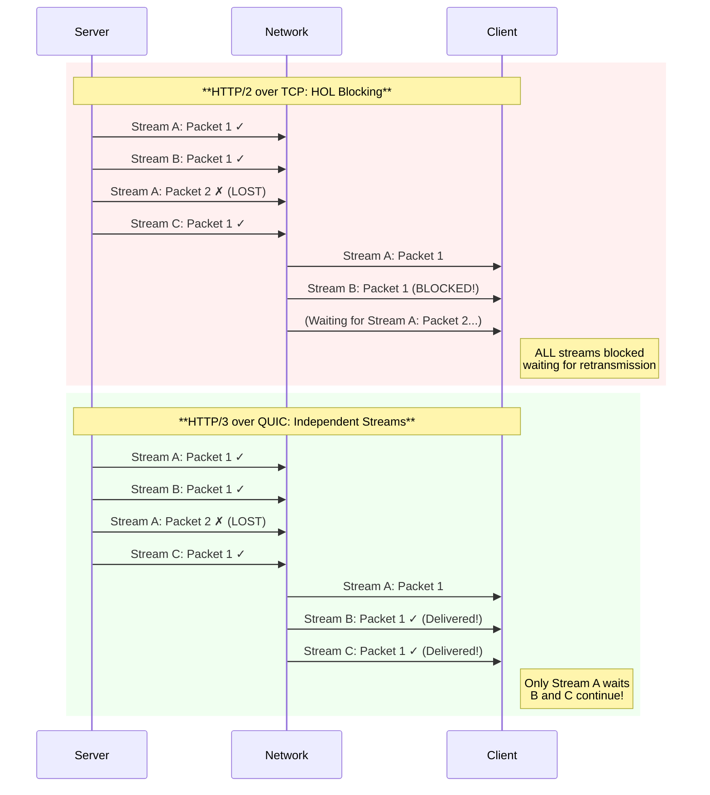
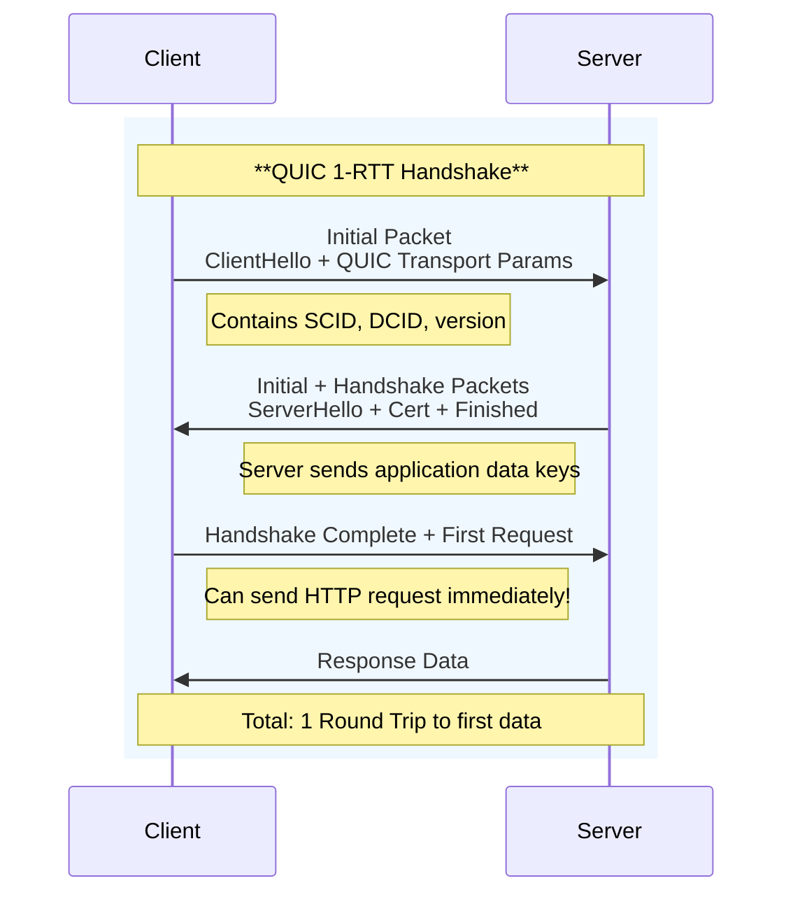
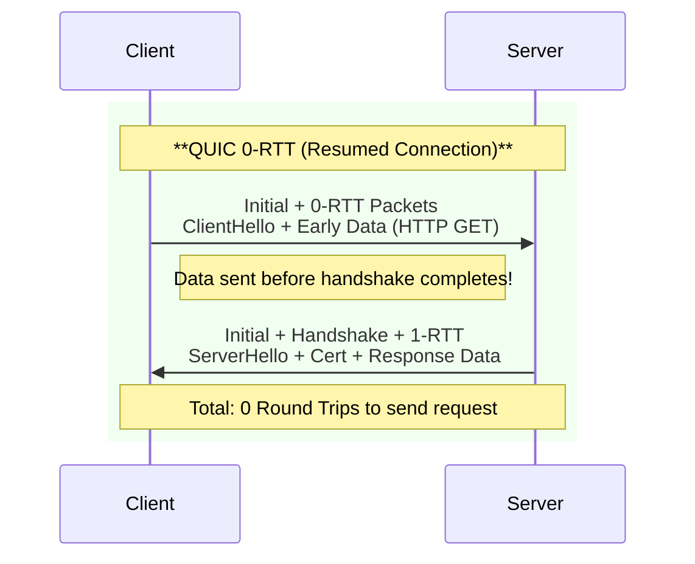

import Callout from "@components/ui/Callout.astro";
import Tabs from "@components/ui/Tabs.astro";
import TabPanel from "@components/ui/TabPanel.astro";
import TerminalCommand from "@components/ui/TerminalCommand.astro";
import FileContent from "@components/ui/FileContent.astro";
import TerminalOutput from "@components/ui/TerminalOutput.astro";
import Collapsible from "@components/ui/Collapsible.astro";
import Mermaid from "@components/ui/Mermaid.astro";
import Table from "@components/ui/Table.astro";
import CompareCode from "@components/ui/CompareCode.astro";
import Code from "@components/ui/Code.astro";


The web has relied on **TCP** for over four decades. But modern applications—with their demands for real-time interactivity, mobile connectivity, and instant page loads—have exposed TCP's fundamental limitations. Enter **QUIC** and **HTTP/3**: a complete reimagining of web transport that abandons TCP in favor of UDP to deliver a faster, more secure, and resilient internet.

In this comprehensive guide, we'll explore the history and architecture of QUIC, understand why it solves problems that TCP cannot, and walk through a complete production-ready Nginx configuration.

---

## A Brief History: From Google to IETF Standard

The QUIC protocol has an interesting evolution from a proprietary Google experiment to a full IETF standard.

<Table title="QUIC Timeline">
  <thead>
    <tr>
      <th scope="col">Year</th>
      <th scope="col">Milestone</th>
      <th scope="col">Significance</th>
    </tr>
  </thead>
  <tbody>
    <tr>
      <td><strong>2012</strong></td>
      <td>Google begins QUIC development</td>
      <td>Internal project to reduce web latency</td>
    </tr>
    <tr>
      <td><strong>2013</strong></td>
      <td>First QUIC traffic in Chrome</td>
      <td>Early experiments with Google services</td>
    </tr>
    <tr>
      <td><strong>2014</strong></td>
      <td>Wide-scale gQUIC deployment</td>
      <td>Chrome desktop uses QUIC for Google properties</td>
    </tr>
    <tr>
      <td><strong>2016</strong></td>
      <td>IETF QUIC Working Group formed</td>
      <td>Formal standardization process begins</td>
    </tr>
    <tr>
      <td><strong>2017</strong></td>
      <td>IETF QUIC diverges from gQUIC</td>
      <td>TLS 1.3 integration, general-purpose transport</td>
    </tr>
    <tr>
      <td><strong>2021</strong></td>
      <td>RFC 9000 published</td>
      <td>QUIC Transport Protocol standardized</td>
    </tr>
    <tr>
      <td><strong>2022</strong></td>
      <td>RFC 9114 published</td>
      <td>HTTP/3 standardized</td>
    </tr>
  </tbody>
</Table>

<Callout type="info" icon="mdi:information">
  **Google QUIC vs IETF QUIC**
  
  The original "gQUIC" (Google QUIC) used custom cryptography. The IETF version mandates **TLS 1.3** integration, making it a general-purpose transport protocol suitable for any application—not just HTTP.
</Callout>

### The QUIC RFC Family

The complete QUIC specification spans multiple RFCs:

<Table title="QUIC Standards Documents">
  <thead>
    <tr>
      <th scope="col">RFC</th>
      <th scope="col">Title</th>
      <th scope="col">Description</th>
    </tr>
  </thead>
  <tbody>
    <tr>
      <td><strong><a href="https://datatracker.ietf.org/doc/html/rfc9000" target="_blank" rel="noopener noreferrer">RFC 9000</a></strong></td>
      <td>QUIC Transport</td>
      <td>Core protocol: packets, frames, streams, connection management</td>
    </tr>
    <tr>
      <td><strong><a href="https://datatracker.ietf.org/doc/html/rfc9001" target="_blank" rel="noopener noreferrer">RFC 9001</a></strong></td>
      <td>Using TLS to Secure QUIC</td>
      <td>TLS 1.3 integration, key derivation, encryption levels</td>
    </tr>
    <tr>
      <td><strong><a href="https://datatracker.ietf.org/doc/html/rfc9002" target="_blank" rel="noopener noreferrer">RFC 9002</a></strong></td>
      <td>Loss Detection and Congestion Control</td>
      <td>Packet loss recovery, RTT estimation, congestion algorithms</td>
    </tr>
    <tr>
      <td><strong><a href="https://datatracker.ietf.org/doc/html/rfc8999" target="_blank" rel="noopener noreferrer">RFC 8999</a></strong></td>
      <td>Version-Independent Properties</td>
      <td>Behaviors common across all QUIC versions</td>
    </tr>
    <tr>
      <td><strong><a href="https://datatracker.ietf.org/doc/html/rfc9114" target="_blank" rel="noopener noreferrer">RFC 9114</a></strong></td>
      <td>HTTP/3</td>
      <td>HTTP semantics over QUIC</td>
    </tr>
  </tbody>
</Table>

---

## Why QUIC? Understanding TCP's Limitations

To appreciate QUIC, we must understand why TCP—the backbone of the internet since 1974—struggles with modern web demands.

### The Head-of-Line (HOL) Blocking Problem

This is the fundamental issue that QUIC solves. Imagine a highway with a single lane (TCP connection). If one car breaks down (packet loss), **everyone behind must stop and wait**, even if they're going to different destinations.

<Mermaid caption="Head-of-Line Blocking: TCP vs QUIC" maxWidth="750px">

</Mermaid>

<Callout type="keypoint" icon="mdi:lightbulb">
  **The Key Insight**
  
  HTTP/2 multiplexes multiple streams over a **single TCP connection**. But TCP sees everything as one ordered byte stream—it doesn't know about HTTP streams. When packet 2 of Stream A is lost, TCP blocks **all** data until that packet is retransmitted.
  
  QUIC implements streams **at the transport layer**, so each stream has independent delivery. Lost packets only affect their own stream.
</Callout>

### The Handshake Latency Problem

Establishing a secure TCP connection requires **multiple round trips**:

<Table title="Connection Establishment Comparison">
  <thead>
    <tr>
      <th scope="col">Protocol</th>
      <th scope="col">New Connection</th>
      <th scope="col">Resumed Connection</th>
      <th scope="col">Total RTTs</th>
    </tr>
  </thead>
  <tbody>
    <tr>
      <td><strong>TCP + TLS 1.2</strong></td>
      <td>TCP handshake + TLS handshake</td>
      <td>TCP + abbreviated TLS</td>
      <td>3 RTT → 2 RTT</td>
    </tr>
    <tr>
      <td><strong>TCP + TLS 1.3</strong></td>
      <td>TCP handshake + TLS 1.3</td>
      <td>TCP + TLS 0-RTT</td>
      <td>2 RTT → 1 RTT</td>
    </tr>
    <tr>
      <td><strong>QUIC</strong></td>
      <td>Combined handshake</td>
      <td>0-RTT early data</td>
      <td>1 RTT → 0 RTT</td>
    </tr>
  </tbody>
</Table>

### The Connection Migration Problem

TCP connections are identified by a 4-tuple: `(source IP, source port, destination IP, destination port)`. When you switch from Wi-Fi to mobile data, your IP changes—and your TCP connection breaks.

<Callout type="success" icon="mdi:cellphone-wireless">
  **QUIC's Solution: Connection IDs**
  
  QUIC uses cryptographically secure **Connection IDs** instead of IP addresses. When your phone switches networks, the Connection ID remains the same. Your downloads, video calls, and game sessions continue without interruption.
</Callout>

---

## QUIC Architecture Deep Dive

### Transport Over UDP

QUIC is built on **UDP** rather than creating a new IP protocol. This was a pragmatic choice:

- **No kernel changes required**: UDP is universally supported
- **Userspace implementation**: Faster iteration and deployment
- **Middlebox traversal**: UDP passes through most NATs and firewalls

<Callout type="warning" icon="mdi:alert">
  **QUIC is NOT "UDP with extra features"**
  
  QUIC implements its own reliability, ordering, and flow control. UDP is merely the delivery mechanism. Think of UDP as the "envelope" and QUIC as the complete postal system inside.
</Callout>

### Packet Structure

QUIC uses two packet types:

<Table title="QUIC Packet Types">
  <thead>
    <tr>
      <th scope="col">Type</th>
      <th scope="col">Header</th>
      <th scope="col">Used For</th>
      <th scope="col">Encryption</th>
    </tr>
  </thead>
  <tbody>
    <tr>
      <td><strong>Long Header</strong></td>
      <td>Full connection info</td>
      <td>Initial, Handshake, 0-RTT, Retry</td>
      <td>Level-specific keys</td>
    </tr>
    <tr>
      <td><strong>Short Header</strong></td>
      <td>Minimal (post-handshake)</td>
      <td>Application data (1-RTT)</td>
      <td>Application keys</td>
    </tr>
  </tbody>
</Table>

### Streams and Flow Control

QUIC streams are lightweight, multiplexed channels within a connection:

<FileContent filename="QUIC Stream Types" icon="mdi:chart-timeline-variant">
```text
┌─────────────────────────────────────────────────────────────┐
│                     QUIC Connection                         │
├─────────────────────────────────────────────────────────────┤
│                                                             │
│  ┌─────────────┐  ┌─────────────┐  ┌─────────────┐         │
│  │  Stream 0   │  │  Stream 4   │  │  Stream 8   │  ...    │
│  │ (Bidi, C→S) │  │ (Bidi, C→S) │  │ (Bidi, C→S) │         │
│  └─────────────┘  └─────────────┘  └─────────────┘         │
│                                                             │
│  ┌─────────────┐  ┌─────────────┐                          │
│  │  Stream 2   │  │  Stream 6   │  Unidirectional (C→S)    │
│  └─────────────┘  └─────────────┘                          │
│                                                             │
│  ┌─────────────┐  ┌─────────────┐                          │
│  │  Stream 1   │  │  Stream 3   │  Server-initiated        │
│  └─────────────┘  └─────────────┘                          │
│                                                             │
│  Flow Control: Per-stream + Connection-level               │
│  MAX_STREAM_DATA / MAX_DATA frames                         │
└─────────────────────────────────────────────────────────────┘

Stream ID Encoding:
- Bits 0-1: Type (00=Bidi/Client, 01=Bidi/Server, 10=Uni/Client, 11=Uni/Server)
- Remaining bits: Sequence number
```
</FileContent>

---

## The QUIC Handshake: Speed Meets Security

QUIC combines transport and cryptographic handshakes into a single exchange, dramatically reducing latency.

### 1-RTT Handshake (First Connection)

<Mermaid caption="QUIC 1-RTT Handshake" maxWidth="700px">

</Mermaid>

### 0-RTT Handshake (Resumed Connection)

For clients that have connected before, QUIC allows sending encrypted data **in the very first packet**:

<Mermaid caption="QUIC 0-RTT Resumption" maxWidth="700px">

</Mermaid>

<Callout type="warning" icon="mdi:shield-alert">
  **0-RTT Security Considerations**
  
  Early data (0-RTT) is vulnerable to **replay attacks**. An attacker could capture and resend the initial packet. Mitigations:
  
  - Only use 0-RTT for **idempotent requests** (GET, HEAD)
  - Servers should reject non-idempotent 0-RTT data
  - Use `ssl_early_data on;` in Nginx with understanding of risks
  - The `Early-Data` header warns backends about replayed requests
</Callout>

---

## Security Architecture

QUIC's security is not optional—it's built into the protocol from the ground up.

### Four Encryption Levels

<Table title="QUIC Encryption Levels">
  <thead>
    <tr>
      <th scope="col">Level</th>
      <th scope="col">Keys Derived From</th>
      <th scope="col">Used For</th>
      <th scope="col">Forward Secrecy</th>
    </tr>
  </thead>
  <tbody>
    <tr>
      <td><strong>Initial</strong></td>
      <td>Destination Connection ID</td>
      <td>First packets, version negotiation</td>
      <td>❌ No</td>
    </tr>
    <tr>
      <td><strong>0-RTT</strong></td>
      <td>Pre-shared key (PSK)</td>
      <td>Early application data</td>
      <td>❌ No</td>
    </tr>
    <tr>
      <td><strong>Handshake</strong></td>
      <td>TLS handshake secrets</td>
      <td>Handshake completion</td>
      <td>✅ Partial</td>
    </tr>
    <tr>
      <td><strong>Application (1-RTT)</strong></td>
      <td>TLS traffic secrets</td>
      <td>All post-handshake data</td>
      <td>✅ Full (ECDHE)</td>
    </tr>
  </tbody>
</Table>

### Packet Protection

Every QUIC packet (except Initial) is protected with **AEAD encryption**:

<Code lang="text" aria-label="QUIC Packet Protection Structure">
```
┌────────────────────────────────────────────────────────────┐
│                    QUIC Packet                             │
├────────────────────────────────────────────────────────────┤
│  Header (partially encrypted)                              │
│  ├── Flags (protected)                                     │
│  ├── Connection ID (cleartext for routing)                 │
│  └── Packet Number (encrypted)                             │
├────────────────────────────────────────────────────────────┤
│  Payload (fully encrypted)                                 │
│  └── AEAD ciphertext (AES-128-GCM, ChaCha20-Poly1305)     │
├────────────────────────────────────────────────────────────┤
│  Authentication Tag (16 bytes)                             │
└────────────────────────────────────────────────────────────┘

Key derivation: HKDF from TLS 1.3 traffic secrets
Nonce: IV XOR packet number (prevents nonce reuse)
```
</Code>

### Connection ID and Privacy

<Callout type="keypoint" icon="mdi:incognito">
  **Anti-Tracking Design**
  
  QUIC Connection IDs can be **rotated** during a connection. The server provides new Connection IDs via `NEW_CONNECTION_ID` frames. This prevents network observers from tracking connections across path changes.
  
  Combined with encrypted packet numbers and headers, QUIC significantly improves privacy compared to TCP.
</Callout>

### DoS Protection Mechanisms

QUIC includes several anti-amplification and anti-spoofing measures:

1. **Address Validation**: Servers send `RETRY` packets to validate client addresses
2. **Anti-Amplification**: Servers limit data sent before address validation (3x client data)
3. **Stateless Reset**: Clean connection termination without state

---

## HTTP/3: HTTP Over QUIC

HTTP/3 is the mapping of HTTP semantics onto QUIC transport. It replaces HTTP/2's binary framing with QUIC streams.

<Table title="HTTP/2 vs HTTP/3">
  <thead>
    <tr>
      <th scope="col">Feature</th>
      <th scope="col">HTTP/2</th>
      <th scope="col">HTTP/3</th>
    </tr>
  </thead>
  <tbody>
    <tr>
      <td><strong>Transport</strong></td>
      <td>TCP + TLS</td>
      <td>QUIC (UDP + TLS 1.3)</td>
    </tr>
    <tr>
      <td><strong>Multiplexing</strong></td>
      <td>Stream frames in single connection</td>
      <td>Native QUIC streams</td>
    </tr>
    <tr>
      <td><strong>HOL Blocking</strong></td>
      <td>Yes (at TCP layer)</td>
      <td>No (independent streams)</td>
    </tr>
    <tr>
      <td><strong>Header Compression</strong></td>
      <td>HPACK</td>
      <td>QPACK (handles out-of-order)</td>
    </tr>
    <tr>
      <td><strong>Server Push</strong></td>
      <td>Supported</td>
      <td>Deprecated (rarely used)</td>
    </tr>
    <tr>
      <td><strong>Connection Migration</strong></td>
      <td>❌ No</td>
      <td>✅ Yes</td>
    </tr>
  </tbody>
</Table>

### Current Adoption

As of 2026, HTTP/3 adoption is significant and growing:

<Table title="HTTP/3 Adoption Statistics">
  <thead>
    <tr>
      <th scope="col">Metric</th>
      <th scope="col">Value</th>
      <th scope="col">Source</th>
    </tr>
  </thead>
  <tbody>
    <tr>
      <td><strong>Websites using HTTP/3</strong></td>
      <td>36.6%</td>
      <td>W3Techs (2026)</td>
    </tr>
    <tr>
      <td><strong>Chrome QUIC usage (subsequent)</strong></td>
      <td>87.9%</td>
      <td>APNIC Research</td>
    </tr>
    <tr>
      <td><strong>Page load improvement (global)</strong></td>
      <td>8%</td>
      <td>Industry benchmarks</td>
    </tr>
    <tr>
      <td><strong>High-latency region improvement</strong></td>
      <td>13%</td>
      <td>Industry benchmarks</td>
    </tr>
  </tbody>
</Table>

---

## Nginx Configuration: Complete Guide

Now let's implement HTTP/3 on Nginx. This section covers everything from prerequisites to production deployment.

### Prerequisites

<Callout type="warning" icon="mdi:alert-circle">
  **Version Requirements**
  
  - **Nginx**: Version 1.25.0+ (HTTP/3 support added mid-2023)
  - **SSL Library**: One of the following with QUIC support:
    - OpenSSL 3.5.1+ (recommended for 0-RTT)
    - BoringSSL
    - QuicTLS (OpenSSL fork)
    - LibreSSL 3.6+
</Callout>

Verify your Nginx installation:

<TerminalCommand>
```bash
nginx -V 2>&1 | grep -E 'version|http_v3_module|OpenSSL|BoringSSL'
```
</TerminalCommand>

<TerminalOutput>
nginx version: nginx/1.25.3
built with OpenSSL 3.5.1 10 Jan 2026
configure arguments: ... --with-http_v3_module ...
</TerminalOutput>

<Collapsible summary="How to install Nginx with HTTP/3 support">

<Tabs>
  <TabPanel label="Ubuntu/Debian (Official Repo)">
    ```bash
    # Add official Nginx mainline repository
    sudo apt install curl gnupg2 ca-certificates lsb-release
    
    echo "deb http://nginx.org/packages/mainline/ubuntu $(lsb_release -cs) nginx" \
        | sudo tee /etc/apt/sources.list.d/nginx.list
    
    curl -fsSL https://nginx.org/keys/nginx_signing.key | sudo apt-key add -
    
    sudo apt update
    sudo apt install nginx
    ```
  </TabPanel>
  <TabPanel label="Compile from Source">
    ```bash
    # Download Nginx and QuicTLS
    wget https://nginx.org/download/nginx-1.25.3.tar.gz
    git clone --depth 1 https://github.com/quictls/openssl quictls
    
    # Build QuicTLS
    cd quictls
    ./Configure --prefix=$PWD/build linux-x86_64
    make -j$(nproc)
    make install_sw
    cd ..
    
    # Configure and build Nginx
    tar xzf nginx-1.25.3.tar.gz
    cd nginx-1.25.3
    ./configure \
        --with-http_v3_module \
        --with-http_ssl_module \
        --with-http_v2_module \
        --with-cc-opt="-I../quictls/build/include" \
        --with-ld-opt="-L../quictls/build/lib"
    
    make -j$(nproc)
    sudo make install
    ```
  </TabPanel>
</Tabs>

</Collapsible>

### Basic Configuration

Here's the minimal configuration to enable HTTP/3:

<FileContent filename="/etc/nginx/sites-available/example.com.conf" icon="devicon:nginx">
```nginx
server {
    server_name example.com;
    root /var/www/example.com;

    # ==========================================
    # LISTENERS: TCP (HTTP/1.1, HTTP/2) + UDP (HTTP/3)
    # ==========================================
    
    # Standard HTTPS over TCP
    listen 443 ssl;
    listen [::]:443 ssl;
    http2 on;
    
    # QUIC/HTTP/3 over UDP
    # 'reuseport' is critical for multi-worker performance
    listen 443 quic reuseport;
    listen [::]:443 quic reuseport;

    # ==========================================
    # SSL/TLS CONFIGURATION
    # ==========================================
    
    # TLS 1.3 is REQUIRED for QUIC
    ssl_protocols TLSv1.3 TLSv1.2;
    ssl_prefer_server_ciphers off;
    
    ssl_certificate /etc/letsencrypt/live/example.com/fullchain.pem;
    ssl_certificate_key /etc/letsencrypt/live/example.com/privkey.pem;

    # ==========================================
    # HTTP/3 CONFIGURATION
    # ==========================================
    
    http3 on;
    
    # Advertise HTTP/3 support to browsers
    # ma=86400 means "cache this info for 24 hours"
    add_header Alt-Svc 'h3=":443"; ma=86400' always;

    location / {
        try_files $uri $uri/ =404;
    }
}
```
</FileContent>

<Callout type="info" icon="mdi:information">
  **Why `reuseport`?**
  
  UDP is connectionless—without `reuseport`, all QUIC packets would be handled by a single Nginx worker, creating a bottleneck. The `reuseport` kernel feature distributes incoming packets across all workers.
</Callout>

### Complete Production Configuration

Here's a comprehensive configuration with all optimizations. The configuration is split into two files: the main `nginx.conf` for global settings and a site-specific configuration file.

<FileContent filename="/etc/nginx/nginx.conf" icon="devicon:nginx" collapsible>
```nginx
# Main context
worker_processes auto;
error_log /var/log/nginx/error.log warn;

events {
    worker_connections 4096;
    use epoll;
    multi_accept on;
}

http {
    # ==========================================
    # HTTP/3 GLOBAL SETTINGS
    # ==========================================
    http3 on;
    
    # Custom log format to track HTTP/3 connections
    log_format quic '$remote_addr - $remote_user [$time_local] '
                    '"$request" $status $body_bytes_sent '
                    '"$http_referer" "$http_user_agent" '
                    'proto="$server_protocol" quic="$http3"';

    # MIME types
    include /etc/nginx/mime.types;
    default_type application/octet-stream;

    # Performance optimizations
    sendfile on;
    tcp_nopush on;
    tcp_nodelay on;
    
    # Gzip compression
    gzip on;
    gzip_vary on;
    gzip_min_length 1024;
    gzip_types text/plain text/css application/json application/javascript 
               text/xml application/xml application/xml+rss text/javascript;

    # Include site configurations
    include /etc/nginx/sites-enabled/*;
}
```
</FileContent>

The site-specific configuration includes all the directives for QUIC, TLS, headers, and logging:

<FileContent filename="/etc/nginx/sites-available/example.com.conf" icon="devicon:nginx" collapsible>
```nginx
server {
    server_name example.com www.example.com;
    root /var/www/example.com;

    # ==========================================
    # DUAL-STACK LISTENERS
    # ==========================================
    
    # TCP: HTTP/1.1 and HTTP/2 fallback
    listen 443 ssl;
    listen [::]:443 ssl;
    http2 on;
    
    # UDP: QUIC/HTTP/3
    listen 443 quic reuseport;
    listen [::]:443 quic reuseport;

    # ==========================================
    # TLS CONFIGURATION (Required for QUIC)
    # ==========================================
    
    ssl_protocols TLSv1.3 TLSv1.2;
    ssl_ciphers TLS_AES_128_GCM_SHA256:TLS_AES_256_GCM_SHA384:TLS_CHACHA20_POLY1305_SHA256:ECDHE-ECDSA-AES128-GCM-SHA256:ECDHE-RSA-AES128-GCM-SHA256;
    ssl_prefer_server_ciphers off;
    ssl_ecdh_curve X25519:P-256:P-384;
    
    ssl_certificate /etc/letsencrypt/live/example.com/fullchain.pem;
    ssl_certificate_key /etc/letsencrypt/live/example.com/privkey.pem;
    
    # Session resumption for performance
    ssl_session_cache shared:SSL:10m;
    ssl_session_timeout 1d;
    ssl_session_tickets off;  # Better security
    
    # OCSP Stapling
    ssl_stapling on;
    ssl_stapling_verify on;

    # ==========================================
    # QUIC-SPECIFIC SETTINGS
    # ==========================================
    
    # Enable 0-RTT early data (with security considerations)
    ssl_early_data on;
    
    # DoS protection: require address validation
    quic_retry on;
    
    # Performance: Generic Segmentation Offload (Linux 4.18+)
    quic_gso on;

    # ==========================================
    # HEADERS
    # ==========================================
    
    # Advertise HTTP/3 availability
    add_header Alt-Svc 'h3=":443"; ma=86400' always;
    
    # Warn backends about 0-RTT replay risk
    add_header Early-Data $ssl_early_data always;
    
    # Security headers
    add_header Strict-Transport-Security "max-age=63072000; includeSubDomains; preload" always;
    add_header X-Content-Type-Options "nosniff" always;
    add_header X-Frame-Options "DENY" always;

    # ==========================================
    # LOGGING
    # ==========================================
    
    access_log /var/log/nginx/example.com.access.log quic;
    error_log /var/log/nginx/example.com.error.log;

    # ==========================================
    # LOCATIONS
    # ==========================================
    
    location / {
        try_files $uri $uri/ =404;
    }
    
    # Static assets with long cache
    location ~* \.(js|css|png|jpg|jpeg|gif|ico|svg|woff|woff2)$ {
        expires 1y;
        add_header Cache-Control "public, immutable" always;
        add_header Alt-Svc 'h3=":443"; ma=86400' always;
    }
}

# HTTP to HTTPS redirect
server {
    listen 80;
    listen [::]:80;
    server_name example.com www.example.com;
    return 301 https://$host$request_uri;
}
```
</FileContent>

### All QUIC Directives Reference

<Table title="Nginx QUIC Directives">
  <thead>
    <tr>
      <th scope="col">Directive</th>
      <th scope="col">Default</th>
      <th scope="col">Context</th>
      <th scope="col">Description</th>
    </tr>
  </thead>
  <tbody>
    <tr>
      <td><code>http3</code></td>
      <td><code>on</code></td>
      <td>http, server</td>
      <td>Enables HTTP/3 protocol negotiation</td>
    </tr>
    <tr>
      <td><code>http3_hq</code></td>
      <td><code>off</code></td>
      <td>http, server</td>
      <td>Enables HTTP/0.9 over QUIC (testing only)</td>
    </tr>
    <tr>
      <td><code>http3_max_concurrent_streams</code></td>
      <td><code>128</code></td>
      <td>http, server</td>
      <td>Maximum concurrent streams per connection</td>
    </tr>
    <tr>
      <td><code>http3_stream_buffer_size</code></td>
      <td><code>64k</code></td>
      <td>http, server</td>
      <td>Buffer size for reading/writing streams</td>
    </tr>
    <tr>
      <td><code>quic_active_connection_id_limit</code></td>
      <td><code>2</code></td>
      <td>http, server</td>
      <td>Max connection IDs stored per connection</td>
    </tr>
    <tr>
      <td><code>quic_bpf</code></td>
      <td><code>off</code></td>
      <td>main</td>
      <td>eBPF routing for connection migration (Linux 5.7+)</td>
    </tr>
    <tr>
      <td><code>quic_gso</code></td>
      <td><code>off</code></td>
      <td>http, server</td>
      <td>Generic Segmentation Offload (Linux 4.18+)</td>
    </tr>
    <tr>
      <td><code>quic_host_key</code></td>
      <td>-</td>
      <td>http, server</td>
      <td>File with secret key for address validation tokens</td>
    </tr>
    <tr>
      <td><code>quic_retry</code></td>
      <td><code>off</code></td>
      <td>http, server</td>
      <td>Enables address validation via Retry packets</td>
    </tr>
  </tbody>
</Table>

---

## Firewall Configuration

**Critical**: HTTP/3 uses **UDP** on port 443, not TCP. If your firewall only allows TCP/443, QUIC will fail silently and clients will fall back to HTTP/2.

<Tabs>
  <TabPanel label="UFW (Ubuntu/Debian)">
    ```bash
    # Check current rules
    sudo ufw status
    
    # Allow UDP on port 443
    sudo ufw allow 443/udp comment 'QUIC/HTTP3'
    
    # Verify
    sudo ufw status verbose
    ```
  </TabPanel>
  <TabPanel label="iptables">
    ```bash
    # Allow incoming UDP 443
    sudo iptables -A INPUT -p udp --dport 443 -j ACCEPT
    
    # Save rules (Debian/Ubuntu)
    sudo iptables-save | sudo tee /etc/iptables/rules.v4
    
    # For IPv6
    sudo ip6tables -A INPUT -p udp --dport 443 -j ACCEPT
    sudo ip6tables-save | sudo tee /etc/iptables/rules.v6
    ```
  </TabPanel>
  <TabPanel label="firewalld (RHEL/CentOS)">
    ```bash
    # Add UDP 443 to default zone
    sudo firewall-cmd --permanent --add-port=443/udp
    
    # Reload
    sudo firewall-cmd --reload
    
    # Verify
    sudo firewall-cmd --list-ports
    ```
  </TabPanel>
  <TabPanel label="AWS Security Groups">
    Add an inbound rule:
    - **Type**: Custom UDP
    - **Port Range**: 443
    - **Source**: 0.0.0.0/0 (or your CIDR)
    - **Description**: QUIC/HTTP3
  </TabPanel>
</Tabs>

### Kernel Tuning for High Traffic

For high-traffic servers, increase UDP buffer sizes:

<FileContent filename="/etc/sysctl.d/99-quic.conf" icon="mdi:cog">
```bash
# Increase UDP buffer sizes for QUIC
net.core.rmem_max = 16777216
net.core.wmem_max = 16777216
net.core.rmem_default = 1048576
net.core.wmem_default = 1048576

# UDP memory limits
net.ipv4.udp_mem = 65536 131072 262144
net.ipv4.udp_rmem_min = 8192
net.ipv4.udp_wmem_min = 8192

# Allow more local ports for connections
net.ipv4.ip_local_port_range = 1024 65535
```
</FileContent>

Apply the settings:

<TerminalCommand>
```bash
sudo sysctl --system
```
</TerminalCommand>

---

## Verification and Testing

After configuration, verify HTTP/3 is working correctly.

### Method 1: curl

Modern curl (7.66+ with HTTP/3 support) can test directly:

<TerminalCommand>
```bash
# Test HTTP/3 specifically
curl -I --http3-only https://example.com

# Or allow fallback
curl -I --http3 https://example.com
```
</TerminalCommand>

<TerminalOutput>
HTTP/3 200 
server: nginx/1.25.3
date: Tue, 14 Jan 2026 12:00:00 GMT
content-type: text/html; charset=utf-8
alt-svc: h3=":443"; ma=86400
strict-transport-security: max-age=63072000; includeSubDomains; preload
</TerminalOutput>

<Callout type="tip" icon="mdi:lightbulb">
  **Installing curl with HTTP/3**
  
  On macOS: `brew install curl`
  On Ubuntu: Build from source with `--with-ngtcp2` or use the snap package
</Callout>

### Method 2: Browser DevTools

1. Open Chrome or Firefox
2. Navigate to your site
3. Open DevTools (F12) → **Network** tab
4. Right-click column headers → Enable **Protocol** column
5. Reload the page
6. Look for `h3` in the Protocol column

<Callout type="info" icon="mdi:information">
  **First Visit Behavior**
  
  On the first visit, browsers use HTTP/2 to discover the `Alt-Svc` header. On subsequent requests (or after reload), they switch to HTTP/3. This is normal behavior.
</Callout>

### Method 3: Online Tools

<Table title="HTTP/3 Testing Tools">
  <thead>
    <tr>
      <th scope="col">Tool</th>
      <th scope="col">URL</th>
      <th scope="col">Features</th>
    </tr>
  </thead>
  <tbody>
    <tr>
      <td><strong>HTTP/3 Check</strong></td>
      <td><a href="https://http3check.net/" target="_blank" rel="noopener noreferrer">http3check.net</a></td>
      <td>Quick pass/fail test with details</td>
    </tr>
    <tr>
      <td><strong>Cloudflare HTTP/3 Test</strong></td>
      <td><a href="https://cloudflare-quic.com/" target="_blank" rel="noopener noreferrer">cloudflare-quic.com</a></td>
      <td>Live connection test</td>
    </tr>
    <tr>
      <td><strong>Qualys SSL Labs</strong></td>
      <td><a href="https://www.ssllabs.com/ssltest/" target="_blank" rel="noopener noreferrer">ssllabs.com</a></td>
      <td>Comprehensive TLS analysis</td>
    </tr>
  </tbody>
</Table>

### Method 4: Check Nginx Logs

Use the custom log format to verify HTTP/3 traffic:

<TerminalCommand>
```bash
# Check for HTTP/3 connections
grep 'quic="h3"' /var/log/nginx/example.com.access.log | tail -5
```
</TerminalCommand>

<TerminalOutput>
192.168.1.100 - - [14/Jan/2026:12:00:00 +0000] "GET / HTTP/3" 200 15234 "-" "Mozilla/5.0..." proto="HTTP/3" quic="h3"
</TerminalOutput>

---

## Troubleshooting Guide

<Table title="Common HTTP/3 Issues and Solutions">
  <thead>
    <tr>
      <th scope="col">Symptom</th>
      <th scope="col">Likely Cause</th>
      <th scope="col">Solution</th>
    </tr>
  </thead>
  <tbody>
    <tr>
      <td><strong>Protocol stays HTTP/2</strong></td>
      <td>Firewall blocking UDP/443</td>
      <td>Open UDP port 443 on server and cloud provider</td>
    </tr>
    <tr>
      <td><strong>Protocol stays HTTP/2</strong></td>
      <td>Missing Alt-Svc header</td>
      <td>Add <code>add_header Alt-Svc 'h3=":443"; ma=86400' always;</code></td>
    </tr>
    <tr>
      <td><strong>Connection errors</strong></td>
      <td>TLS 1.3 not enabled</td>
      <td>Set <code>ssl_protocols TLSv1.3;</code></td>
    </tr>
    <tr>
      <td><strong>Browsers refuse to use QUIC</strong></td>
      <td>Self-signed certificate</td>
      <td>Use a valid certificate (Let's Encrypt)</td>
    </tr>
    <tr>
      <td><strong>Nginx fails to start</strong></td>
      <td>Missing <code>--with-http_v3_module</code></td>
      <td>Rebuild Nginx with HTTP/3 module</td>
    </tr>
    <tr>
      <td><strong>High CPU usage</strong></td>
      <td>GSO not supported by kernel</td>
      <td>Disable <code>quic_gso</code> or upgrade kernel</td>
    </tr>
    <tr>
      <td><strong>0-RTT not working</strong></td>
      <td>OpenSSL version too old</td>
      <td>Use OpenSSL 3.5.1+, QuicTLS, or BoringSSL</td>
    </tr>
  </tbody>
</Table>

### Debug Mode

Enable debug logging temporarily:

<Code lang="nginx" aria-label="Enable Nginx debug logging">
```
error_log /var/log/nginx/error.log debug;
```
</Code>

Check for QUIC-specific messages:

<TerminalCommand>
```bash
grep -i quic /var/log/nginx/error.log | tail -20
```
</TerminalCommand>

---

## Production Deployment Checklist

Before deploying HTTP/3 to production, verify:

<Table title="HTTP/3 Production Checklist">
  <thead>
    <tr>
      <th scope="col">Category</th>
      <th scope="col">Item</th>
      <th scope="col">Verification</th>
    </tr>
  </thead>
  <tbody>
    <tr>
      <td><strong>Build</strong></td>
      <td>Nginx compiled with <code>--with-http_v3_module</code></td>
      <td><code>nginx -V 2>&1 | grep http_v3</code></td>
    </tr>
    <tr>
      <td><strong>Build</strong></td>
      <td>Compatible SSL library (QuicTLS/BoringSSL/OpenSSL 3.5.1+)</td>
      <td><code>nginx -V 2>&1 | grep -i ssl</code></td>
    </tr>
    <tr>
      <td><strong>Network</strong></td>
      <td>UDP/443 open on server firewall</td>
      <td><code>sudo ss -ulnp | grep 443</code></td>
    </tr>
    <tr>
      <td><strong>Network</strong></td>
      <td>UDP/443 open on cloud provider (AWS/GCP/Azure)</td>
      <td>Check security group/firewall rules</td>
    </tr>
    <tr>
      <td><strong>Config</strong></td>
      <td><code>listen 443 quic reuseport;</code> present</td>
      <td><code>nginx -T | grep quic</code></td>
    </tr>
    <tr>
      <td><strong>Config</strong></td>
      <td>TLS 1.3 enabled</td>
      <td><code>nginx -T | grep ssl_protocols</code></td>
    </tr>
    <tr>
      <td><strong>Config</strong></td>
      <td>Alt-Svc header configured</td>
      <td><code>curl -I https://site | grep alt-svc</code></td>
    </tr>
    <tr>
      <td><strong>Certificate</strong></td>
      <td>Valid (not self-signed) certificate</td>
      <td><code>openssl s_client -connect site:443</code></td>
    </tr>
    <tr>
      <td><strong>Test</strong></td>
      <td>HTTP/3 confirmed working</td>
      <td><code>curl --http3 https://site</code></td>
    </tr>
    <tr>
      <td><strong>Monitoring</strong></td>
      <td>Log format includes <code>$http3</code></td>
      <td>Check log format configuration</td>
    </tr>
  </tbody>
</Table>

---

## When NOT to Use QUIC

While QUIC offers significant benefits, there are scenarios where TCP may be preferable:

<Callout type="warning" icon="mdi:alert">
  **Consider Sticking with TCP/HTTP/2 When:**
  
  - **Corporate firewalls block UDP**: Many enterprise networks block or throttle UDP traffic
  - **Server CPU is constrained**: QUIC has higher CPU overhead from encryption
  - **Your users are on stable networks**: Low packet loss environments see less benefit
  - **Legacy proxy infrastructure**: Load balancers may not support QUIC passthrough
  - **Debugging is critical**: TCP has more mature monitoring tools
</Callout>

