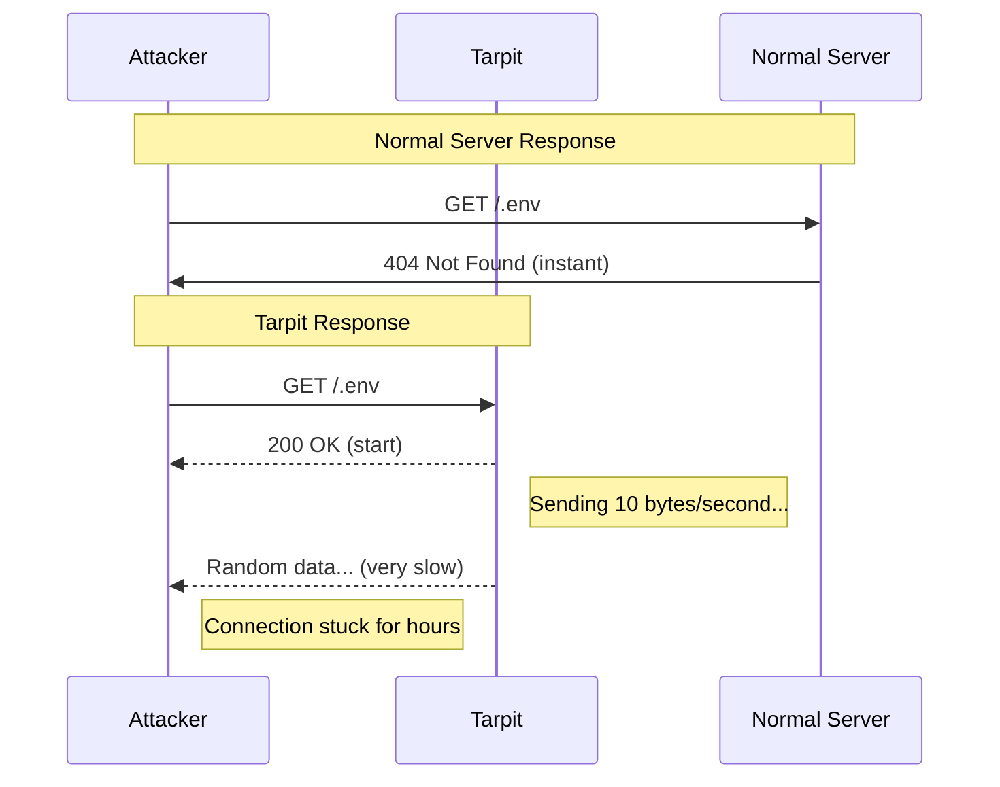

import Callout from "@components/ui/Callout.astro";
import FileContent from "@components/ui/FileContent.astro";
import Mermaid from "@components/ui/Mermaid.astro";
import TerminalCommand from "@components/ui/TerminalCommand.astro";
import TerminalOutput from "@components/ui/TerminalOutput.astro";
import Table from "@components/ui/Table.astro";
import Code from "@components/ui/Code.astro";
import Collapsible from "@components/ui/Collapsible.astro";

If you've ever looked at your server logs, you've likely seen countless attempts to access files like `/.env`, `/wp-login.php`, `/.git/config`, or `/admin`. These are automated scanners probing your server for vulnerabilities. While simply blocking them with a 403 or 404 response works, there's a more *satisfying* approach: **trapping them in a tarpit**.

## What is a Tarpit?

A **[tarpit](https://en.wikipedia.org/wiki/Tarpit_(networking))** (also known as a "tar pit" or "sticky honeypot") is a network security mechanism designed to **slow down attackers** by deliberately responding to their requests at an extremely slow rate. The name comes from the natural phenomenon of tar pits—geological formations where animals become trapped in viscous tar and cannot escape.

In cybersecurity, a tarpit does the same thing digitally: it accepts incoming connections from malicious actors but **drip-feeds data so slowly** that the attacker's tools become stuck, wasting their time and resources while they wait for a response that never fully arrives. For more background, see [Hedgehog Security's excellent overview](https://www.hedgehogsecurity.co.uk/blog/what-are-tarpits).

<Callout type="info" title="The Philosophy">
Unlike traditional blocking (which immediately rejects requests), a tarpit *pretends* to be cooperative. This wastes the attacker's resources, prevents them from quickly moving to the next target, and can even crash poorly-written scanning tools.
</Callout>

---

## History and Origins

The concept of tarpits in cybersecurity emerged in the late 1990s and early 2000s during a period when network worms and automated scanning tools began proliferating. The most famous early tarpit was **[LaBrea](https://labrea.sourceforge.net/)**, created by [Tom Liston](https://www.giac.org/paper/gsec/1895/labrea-approach-securing-networks/103112) around 2001.

LaBrea worked at the network layer, responding to TCP SYN packets for unused IP addresses and creating "virtual sticky machines" that would trap worm scanners. When the [Code Red](https://en.wikipedia.org/wiki/Code_Red_(computer_worm)) and [Nimda](https://en.wikipedia.org/wiki/Nimda) worms were spreading rapidly, LaBrea proved remarkably effective at slowing their propagation.

### Evolution of Tarpits

The tarpit concept has evolved beyond network-layer implementations:

<Collapsible summary="Notable Tarpit Implementations">

**[OpenBSD spamd](https://man.openbsd.org/spamd)** (2003) - The email tarpit that introduced greylisting. When a blacklisted sender connects, spamd deliberately slows down the SMTP conversation, sending one byte at a time. Legitimate mail servers retry; spammers give up. This approach inspired many modern tarpit implementations.

**[Endlessh](https://github.com/skeeto/endlessh)** (2019) - Created by [Chris Wellons](https://nullprogram.com/blog/2019/03/22/), this SSH tarpit exploits RFC 4253: before the SSH version exchange, servers can send "other lines of data." Endlessh continuously sends random data at ~10-second intervals, trapping SSH scanners indefinitely. Some connections have lasted **weeks**!

**HTTP Tarpits (this guide)** - Application-layer tarpits that use web server features like `limit_rate` to slowly drip-feed data to malicious HTTP requests. Perfect for trapping vulnerability scanners probing for sensitive files.

</Collapsible>

<Mermaid caption="Normal Server vs Tarpit Response" maxWidth="700px">

</Mermaid>

---

## Why Use a Tarpit Instead of Blocking?

<Table title="Tarpit vs Other Defense Strategies">
  <thead>
    <tr>
      <th scope="col">Approach</th>
      <th scope="col">Pros</th>
      <th scope="col">Cons</th>
    </tr>
  </thead>
  <tbody>
    <tr>
      <td><strong>Block (403/404)</strong></td>
      <td>Immediate, low resources</td>
      <td>Attacker can instantly retry</td>
    </tr>
    <tr>
      <td><strong>Rate Limit</strong></td>
      <td>Controls volume</td>
      <td>Legitimate users may be affected</td>
    </tr>
    <tr>
      <td><strong>Tarpit</strong></td>
      <td data-status="success">Wastes attacker resources, provides intel</td>
      <td data-status="warning">Holds server connections open</td>
    </tr>
  </tbody>
</Table>

Tarpits offer several advantages over simple blocking:

1. **Resource Exhaustion**: Automated scanners have limited connections. Keeping them stuck reduces their scanning capacity.
2. **Intelligence Gathering**: Logged tarpit connections reveal attacker IP patterns and targeted paths.
3. **Psychological Impact**: Attackers who realize they've been tarpitted may avoid your server in the future.
4. **Crash Poorly-Written Tools**: Some scanning tools don't handle slow responses well and may crash.

<Callout type="warning" title="Trade-offs">
Tarpits do consume server resources (connections, memory). On a high-traffic server, you should be selective about which paths trigger the tarpit. Don't tarpit legitimate error pages.
</Callout>

---

## Implementation in Nginx

Let's implement a complete tarpit solution in [Nginx](https://nginx.org/). The strategy involves three components:

1. **Generate slow content**: Create a large random payload
2. **Throttle delivery**: Use [`limit_rate`](https://nginx.org/en/docs/http/ngx_http_core_module.html#limit_rate) to control bandwidth (see also [Nginx's rate limiting guide](https://blog.nginx.org/blog/rate-limiting-nginx))
3. **Log for analysis**: Send logs to a dedicated file for [CrowdSec](https://docs.crowdsec.net/)/[Fail2Ban](https://www.fail2ban.org/)

### Step 1: Generate Slow Content

First, we need content to send slowly. We use Nginx's [Perl module](https://nginx.org/en/docs/http/ngx_http_perl_module.html) to generate a large random string:

<FileContent filename="/etc/nginx/nginx.conf" icon="devicon:nginx" ariaLabel="Nginx configuration for slow content generation">
```nginx
http {
    # Load the Perl module
    # (requires nginx-mod-http-perl)
    
    # Generate 100KB of random characters
    perl_set $slow_content 'sub {
        my $chars = "abcdefghijklmnopqrstuvwxyzABCDEFGHIJKLMNOPQRSTUVWXYZ0123456789";
        my $result = "";
        for (1..100000) {
            $result .= substr($chars, int(rand(length($chars))), 1);
        }
        return $result;
    }';
    
    # ... rest of http block
}
```
</FileContent>

<Callout type="tip" title="Alternative: Static File">
If you don't want to use Perl, you can generate a large random file and serve that instead:

```bash
dd if=/dev/urandom bs=1K count=100 | base64 > /var/www/tarpit.txt
```

Then use `return 200` with the file content or an alias directive.
</Callout>

### Step 2: Create the Tarpit Snippet

Create a reusable snippet that handles the tarpit logic:

<FileContent filename="/etc/nginx/snippets/tarpit.conf" icon="devicon:nginx" ariaLabel="Nginx tarpit snippet configuration">
```nginx
# Extreme bandwidth throttling
limit_rate 10;  # 10 bytes per second

# Start throttling immediately
limit_rate_after 1;  # Begin limiting after 1 byte

# Send the slow response with plain text content type
add_header Content-Type text/plain;
return 200 $slow_content;

# Log to dedicated tarpit log for CrowdSec/Fail2Ban
access_log /var/log/nginx/access.tarpit combined;
```
</FileContent>

With 100KB of content at 10 bytes/second, a full response would take approximately **2.7 hours** to complete!

### Step 3: Define Sensitive Paths

Create a snippet that defines which paths should trigger the tarpit:

<FileContent filename="/etc/nginx/snippets/sensitive_files_tarpit.conf" icon="devicon:nginx" collapsible ariaLabel="Sensitive files tarpit configuration">
```nginx
# =============================================================================
# Sensitive Files Tarpit Protection
# =============================================================================
# Sends malicious scanners to a tarpit when they attempt to access
# sensitive files like .env, .git, .htaccess, etc.
#
# Requires tarpit handler in the server block:
#   error_page 418 = @tarpit;
#   location @tarpit { include /etc/nginx/snippets/tarpit.conf; }
# =============================================================================

# Environment and configuration files
location ~ /\.env {
    access_log /var/log/nginx/access.tarpit combined;
    return 418;
}

# Version control directories
location ~ /\.git {
    access_log /var/log/nginx/access.tarpit combined;
    return 418;
}

location ~ /\.svn {
    access_log /var/log/nginx/access.tarpit combined;
    return 418;
}

location ~ /\.hg {
    access_log /var/log/nginx/access.tarpit combined;
    return 418;
}

# Server configuration files
location ~ /\.(htaccess|htpasswd) {
    access_log /var/log/nginx/access.tarpit combined;
    return 418;
}

# Backup and sensitive file extensions
location ~* \.(bak|backup|old|orig|save|swp|tmp|sql|db|sqlite|sqlite3)$ {
    access_log /var/log/nginx/access.tarpit combined;
    return 418;
}

# PHP/CMS exploit paths
location ~* (phpinfo|adminer|phpmyadmin|wp-login|xmlrpc|wp-admin|wp-config)\.php$ {
    access_log /var/log/nginx/access.tarpit combined;
    return 418;
}

# Common scanner/exploit paths
location ~* ^/(config|admin|administrator|login|cgi-bin|scripts|shell|cmd|console) {
    access_log /var/log/nginx/access.tarpit combined;
    return 418;
}

# Catch-all for remaining dotfiles
location ~ /\. {
    deny all;
    access_log /var/log/nginx/access.tarpit combined;
    log_not_found off;
}
```
</FileContent>

<Callout type="info" title="Why HTTP 418?">
We use HTTP status code **[418 (I'm a teapot)](https://developer.mozilla.org/en-US/docs/Web/HTTP/Reference/Status/418)** as an internal trigger. This obscure status code (from the April Fools' [RFC 2324](https://datatracker.ietf.org/doc/html/rfc2324)) is repurposed here as an internal signal to redirect to the tarpit location. Attackers never see this code—they receive a 200 response with the slow content.
</Callout>

### Step 4: Configure the Server Block

Now integrate everything into your server block:

<FileContent filename="/etc/nginx/sites-available/example.com.conf" icon="devicon:nginx" ariaLabel="Complete server block with tarpit configuration">
```nginx
server {
    listen 443 ssl;
    listen 443 quic;
    server_name example.com;

    # ... SSL and other configuration ...

    # =========================================================
    # TARPIT CONFIGURATION
    # =========================================================
    
    # Redirect 418 errors to the tarpit handler
    error_page 418 = @tarpit;
    
    # The tarpit location - extremely slow response
    location @tarpit {
        # Prevent caching of tarpit responses
        add_header Cache-Control "no-store, no-cache, must-revalidate, max-age=0";
        add_header Pragma "no-cache";
        
        # Include the tarpit configuration
        include /etc/nginx/snippets/tarpit.conf;
    }

    # Include sensitive files protection
    include /etc/nginx/snippets/sensitive_files_tarpit.conf;

    # =========================================================
    # NORMAL SITE CONFIGURATION
    # =========================================================
    
    location / {
        try_files $uri $uri/ =404;
        # ... your normal configuration
    }
}
```
</FileContent>

### Step 5: Test the Configuration

Validate and reload Nginx:

<TerminalCommand>
```bash
nginx -t && systemctl reload nginx
```
</TerminalCommand>

<TerminalOutput title="Expected output">
nginx: the configuration file /etc/nginx/nginx.conf syntax is ok
nginx: configuration file /etc/nginx/nginx.conf test is successful
</TerminalOutput>

Test the tarpit with a timeout to avoid waiting forever:

<TerminalCommand>
```bash
curl -v --max-time 5 'https://example.com/.env'
```
</TerminalCommand>

<TerminalOutput title="Tarpit response (truncated)">
*   Trying [::1]:443...
* Connected to example.com (::1) port 443
* TLS 1.3 connection using TLS_AES_256_GCM_SHA384
> GET /.env HTTP/2
< HTTP/2 200
< content-type: text/plain
< cache-control: no-store, no-cache, must-revalidate, max-age=0
* Operation timed out after 5000 milliseconds with 50 bytes received
curl: (28) Operation timed out
</TerminalOutput>

The connection was established, received 50 bytes (5 seconds × 10 bytes/second), and then our timeout kicked in. In reality, an attacker's scanner would wait much longer!

---

## Integration with CrowdSec

While the tarpit wastes attacker time, we can go further by **automatically banning** repeat offenders. [CrowdSec](https://www.crowdsec.net/) can parse the tarpit log and create firewall rules.

### Create a CrowdSec Parser

CrowdSec can read the `/var/log/nginx/access.tarpit` file to identify malicious IPs:

<FileContent filename="/etc/crowdsec/parsers/s02-enrich/nginx_tarpit.yaml" icon="mdi:file-cog" ariaLabel="CrowdSec parser for tarpit logs">
```yaml
name: crowdsec/nginx-tarpit
description: "Parse Nginx tarpit access logs"
filter: "evt.Parsed.program == 'nginx-tarpit'"
onsuccess: next_stage
statics:
  - meta: service
    value: http
  - meta: source_ip
    expression: "evt.Parsed.remote_addr"
  - meta: http_path
    expression: "evt.Parsed.request"
nodes:
  - grok:
      pattern: '%{IPORHOST:remote_addr} - %{DATA:user} \[%{HTTPDATE:time}\] "%{WORD:method} %{DATA:request} HTTP/%{NUMBER:http_version}" %{NUMBER:status} %{NUMBER:bytes}'
      apply_on: message
```
</FileContent>

### Create a Scenario

Define when to ban an IP (e.g., after 3 tarpit hits in 5 minutes):

<FileContent filename="/etc/crowdsec/scenarios/nginx_tarpit_scan.yaml" icon="mdi:file-cog" ariaLabel="CrowdSec scenario for tarpit detection">
```yaml
type: leaky
name: crowdsec/nginx-tarpit-scan
description: "Detect and ban IPs triggering the Nginx tarpit"
filter: "evt.Meta.service == 'http' && evt.Meta.log_type == 'tarpit'"
leakspeed: 5m
capacity: 3
groupby: "evt.Meta.source_ip"
blackhole: 1h
labels:
  service: http
  type: scan
  remediation: true
```
</FileContent>

<Callout type="tip" title="Simpler Alternative">
If you don't want to create custom parsers, you can use [Fail2Ban](https://www.fail2ban.org/) instead. Create a filter that matches lines in `/var/log/nginx/access.tarpit` and configure a jail to ban after N matches.
</Callout>

---

## Reporting Malicious IPs: Contributing to Collective Defense

One of the most powerful aspects of running a tarpit is the **intelligence you gather**. Every trapped connection reveals an attacker's IP, their target paths, and timing patterns. But this data becomes exponentially more valuable when **shared with the security community**.

### Why Report Malicious IPs?

<Callout type="info" title="The Power of Collective Defense">
When you report a malicious IP, you're not just protecting yourself—you're protecting **everyone**. Threat intelligence platforms aggregate reports from thousands of contributors, creating real-time blocklists that can preemptively block attackers before they reach your server.
</Callout>

Benefits of reporting include:

1. **Early Detection**: Other organizations can block threats you've identified before being targeted
2. **Pattern Recognition**: Aggregated data reveals coordinated attacks, botnets, and malware campaigns
3. **Reduced Attack Surface**: Reported IPs are often blocked by ISPs and security tools globally
4. **Community Reciprocity**: Contributors receive access to larger, more comprehensive blocklists

### AbuseIPDB Integration

[AbuseIPDB](https://www.abuseipdb.com/) is a community-driven threat intelligence platform with over 100,000 contributors. You can both check IP reputation and report malicious IPs via their API.

#### Check IP Reputation

Before blocking, verify the threat level:

<TerminalCommand>
```bash
curl -G "https://api.abuseipdb.com/api/v2/check" \
  --data-urlencode "ipAddress=185.234.xx.xx" \
  -d maxAgeInDays=90 \
  -H "Key: YOUR_API_KEY" \
  -H "Accept: application/json"
```
</TerminalCommand>

#### Report Malicious IPs from Tarpit Logs

Create a script to automatically report tarpit captures:

<FileContent filename="/usr/local/bin/report_tarpit_ips.sh" icon="mdi:file-code" ariaLabel="Script to report tarpit IPs to AbuseIPDB">
```bash
#!/bin/bash
# Report IPs from tarpit log to AbuseIPDB
# Usage: Run via cron every hour

ABUSEIPDB_KEY="your-api-key-here"
LOGFILE="/var/log/nginx/access.tarpit"
REPORTED="/var/log/nginx/reported-ips.txt"

# Get unique IPs from last hour
awk -v d1="$(date --date='-1 hour' '+%d/%b/%Y:%H')" \
  '$4 ~ d1 {print $1}' "$LOGFILE" | sort -u | while read ip; do
  
  # Skip if already reported today
  grep -q "$ip" "$REPORTED" 2>/dev/null && continue
  
  # Report to AbuseIPDB
  curl -s "https://api.abuseipdb.com/api/v2/report" \
    -H "Key: $ABUSEIPDB_KEY" \
    -H "Accept: application/json" \
    --data-urlencode "ip=$ip" \
    --data-urlencode "categories=21,15" \
    --data-urlencode "comment=Vulnerability scanner trapped in HTTP tarpit. Probing for sensitive files." \
    > /dev/null
  
  echo "$ip $(date +%Y-%m-%d)" >> "$REPORTED"
done
```
</FileContent>

<Callout type="warning" title="API Rate Limits">
Free AbuseIPDB accounts have daily rate limits. For high-volume servers, consider their paid plans or batch your reports. Always strip personally identifiable information (PII) from report comments.
</Callout>

### CrowdSec Community Blocklists

Unlike AbuseIPDB (which is passive lookup), [CrowdSec](https://www.crowdsec.net/) operates as a **"massively multiplayer firewall"**. When your Security Engine detects a threat, it shares the signal with the network, and you receive blocklist updates containing threats detected by other users.

<Table title="CrowdSec Blocklist Tiers">
  <thead>
    <tr>
      <th scope="col">Tier</th>
      <th scope="col">Size</th>
      <th scope="col">Requirement</th>
    </tr>
  </thead>
  <tbody>
    <tr>
      <td><strong>Lite</strong></td>
      <td>3,000 IPs</td>
      <td>Free account, no contribution</td>
    </tr>
    <tr>
      <td><strong>Community</strong></td>
      <td data-status="success">~15,000 IPs</td>
      <td>Regular signal contribution</td>
    </tr>
    <tr>
      <td><strong>Premium</strong></td>
      <td data-status="success">Unlimited</td>
      <td>Paid subscription</td>
    </tr>
  </tbody>
</Table>

The Community Blocklist updates in real-time and is tailored to your stack—if you run WordPress, you'll receive WordPress-specific threat IPs automatically.

---

## Advanced Techniques

### Dynamic Tarpit Intensity

You can vary the throttle speed based on how suspicious the request is:

<FileContent filename="/etc/nginx/snippets/advanced_tarpit.conf" icon="devicon:nginx" ariaLabel="Advanced tarpit with variable throttling">
```nginx
# Map suspicious paths to throttle speeds
map $request_uri $tarpit_speed {
    default                     50;   # 50 bytes/sec for generic matches
    "~*\.env"                   5;    # 5 bytes/sec for .env (very slow)
    "~*wp-login|wp-admin"       10;   # 10 bytes/sec for WordPress probes
    "~*phpmyadmin|adminer"      1;    # 1 byte/sec for DB admin probes
}

# Use in tarpit location
location @tarpit {
    limit_rate $tarpit_speed;
    limit_rate_after 1;
    add_header Content-Type text/plain;
    return 200 $slow_content;
    access_log /var/log/nginx/access.tarpit combined;
}
```
</FileContent>

### Combining with Rate Limiting

For extra protection, combine tarpit with rate limiting to prevent overwhelming your server:

<Code lang="nginx" aria-label="Combining tarpit with rate limiting">
```
# Define rate limit zone
limit_req_zone $binary_remote_addr zone=tarpit_zone:10m rate=1r/s;

location @tarpit {
    limit_req zone=tarpit_zone burst=5 nodelay;
    limit_rate 10;
    # ... rest of tarpit config
}
```
</Code>

### Tarpit for Specific User-Agents

Target known malicious scanners by user-agent. Common scanners include [sqlmap](https://sqlmap.org/) (SQL injection), [Nikto](https://cirt.net/Nikto2) (web vulnerability scanner), [Nmap](https://nmap.org/) (network scanner), [masscan](https://github.com/robertdavidgraham/masscan) (port scanner), and [ZGrab](https://github.com/zmap/zgrab2) (banner grabber):

<Code lang="nginx" aria-label="Tarpit scanning bots based on User-Agent">
```
map $http_user_agent $is_scanner {
    default                     0;
    "~*sqlmap"                  1;
    "~*nikto"                   1;
    "~*nmap"                    1;
    "~*masscan"                 1;
    "~*zgrab"                   1;
}

server {
    if ($is_scanner) {
        return 418;
    }
    # ... rest of server
}
```
</Code>

---

## Monitoring Your Tarpit

### View Trapped Connections

Check how many connections are currently stuck in the tarpit:

<TerminalCommand>
```bash
netstat -an | grep ESTABLISHED | grep :443 | wc -l
```
</TerminalCommand>

### Analyze Tarpit Logs

See which paths are being scanned most frequently:

<TerminalCommand>
```bash
awk '{print $7}' /var/log/nginx/access.tarpit | sort | uniq -c | sort -rn | head -10
```
</TerminalCommand>

<TerminalOutput title="Top scanned paths">
```
  847 /.env
  312 /wp-login.php
  201 /.git/config
  156 /admin/
   98 /phpmyadmin/
   87 /.htaccess
   65 /config.php
   43 /backup.sql
   38 /shell.php
   29 /xmlrpc.php
```
</TerminalOutput>

### Top Offending IPs

Identify the most persistent scanners:

<TerminalCommand>
```bash
awk '{print $1}' /var/log/nginx/access.tarpit | sort | uniq -c | sort -rn | head -5
```
</TerminalCommand>

<TerminalOutput title="Top offending IPs">
```
  423 185.234.xx.xx
  287 45.148.xx.xx
  156 194.169.xx.xx
   98 23.94.xx.xx
   67 89.248.xx.xx
```
</TerminalOutput>

---

## Real-World Results

After implementing this tarpit on my servers, I observed:

- **~800 tarpit captures per day** across all virtual hosts
- **Average connection duration**: 4.2 minutes (attackers giving up)
- **Some connections lasted over 2 hours** before timing out
- **Repeat scans from same IPs dropped 73%** after CrowdSec bans were implemented

<Callout type="success" title="The Satisfaction Factor">
There's a certain satisfaction in knowing that while you're sleeping, attackers are stuck downloading random characters at 10 bytes per second. Sweet dreams! 🎣
</Callout>

---

## Conclusion

A tarpit is a creative and effective addition to your security toolkit. While it shouldn't replace proper hardening and access controls, it provides:

1. **Resource waste** for automated scanners
2. **Intelligence gathering** on attack patterns  
3. **Automatic banning** when combined with CrowdSec or Fail2Ban
4. **A psychological deterrent** for attackers

The implementation is straightforward in Nginx using just a few directives (`limit_rate`, `error_page`, and location blocks). Combined with logging and a security tool like CrowdSec, you create a layered defense that not only blocks attackers but makes them *pay* for their intrusion attempts.
