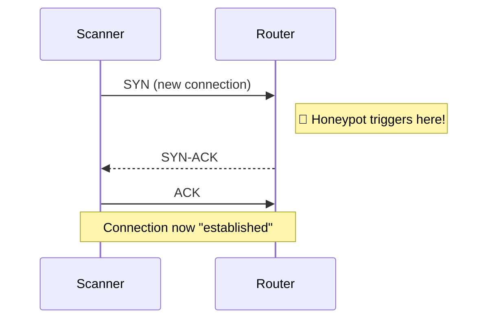
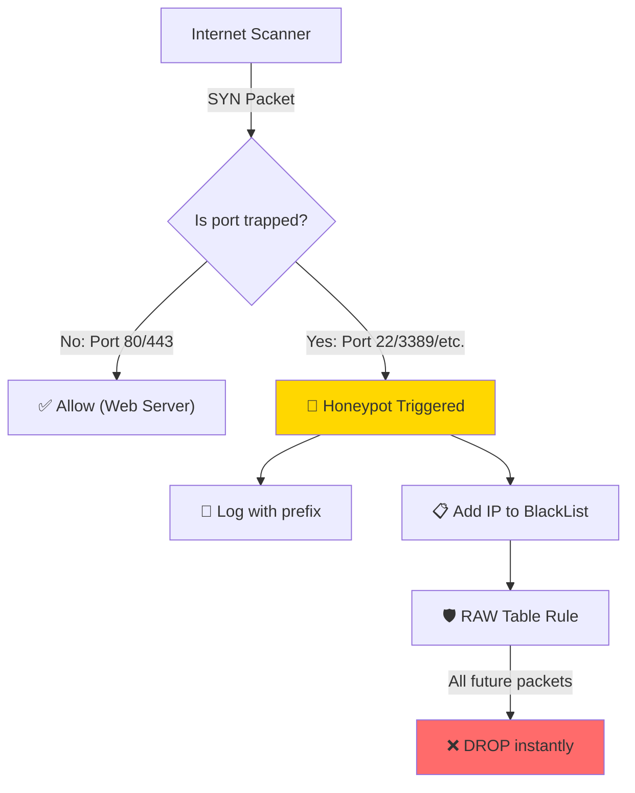

import Callout from "@components/ui/Callout.astro";
import FileContent from "@components/ui/FileContent.astro";
import Mermaid from "@components/ui/Mermaid.astro";
import TerminalCommand from "@components/ui/TerminalCommand.astro";
import Table from "@components/ui/Table.astro";
import Code from "@components/ui/Code.astro";

Every router connected to the internet faces a relentless barrage of automated scans. Bots systematically probe the entire IPv4 address space—and increasingly IPv6—searching for vulnerable services: SSH servers with weak passwords, exposed databases, outdated RDP endpoints, or misconfigured IoT devices.

Most administrators respond by silently dropping these packets. But what if you could turn these attacks into actionable intelligence? By configuring your **MikroTik** router as a lightweight **honeypot**, you can:

1. **Detect** unauthorized reconnaissance before it becomes a breach.
2. **Log** attacker IPs for analysis and threat intelligence sharing.
3. **Block** malicious actors from accessing *any* service on your network.

This guide walks you through implementing a production-ready honeypot on RouterOS, complete with both IPv4 and IPv6 support.

---

## What is a Honeypot?

A **honeypot** is a security mechanism that creates a decoy system designed to attract and detect attackers. According to [Fortinet](https://www.fortinet.com/resources/cyberglossary/what-is-honeypot), honeypots are intentionally vulnerable systems that lure adversaries away from legitimate targets while gathering intelligence about their methods.

There are two main types of honeypots:

<Table title="Types of Honeypots">
  <thead>
    <tr>
      <th scope="col">Type</th>
      <th scope="col">Complexity</th>
      <th scope="col">Use Case</th>
    </tr>
  </thead>
  <tbody>
    <tr>
      <td>**Low-Interaction**</td>
      <td>Simple, minimal resources</td>
      <td>Detects automated scans and basic probes. Simulates limited services.</td>
    </tr>
    <tr>
      <td>**High-Interaction**</td>
      <td>Complex, full OS/applications</td>
      <td>Engages sophisticated attackers to study advanced TTPs (Tactics, Techniques, Procedures).</td>
    </tr>
  </tbody>
</Table>

<Callout type="info" title="What We're Building">
In this guide, we implement a **low-interaction honeypot** directly in the MikroTik firewall. We don't run fake services—instead, we monitor connection attempts to ports that *should never receive legitimate traffic* from the internet. Any connection to these "trap ports" immediately identifies the source as a scanner.
</Callout>

This approach is lightweight, requires no additional hardware, and provides immediate protection while generating valuable logs.

---

## Understanding TCP Connection States

Before configuring our honeypot, it's essential to understand how stateful firewalls like MikroTik classify network traffic. Every packet is assigned a **connection state**:

<Table title="Connection States in RouterOS">
  <thead>
    <tr>
      <th scope="col">State</th>
      <th scope="col">Meaning</th>
      <th scope="col">Example</th>
    </tr>
  </thead>
  <tbody>
    <tr>
      <td>`new`</td>
      <td>First packet of a connection attempt (TCP SYN or first UDP packet)</td>
      <td>Scanner probing port 22</td>
    </tr>
    <tr>
      <td>`established`</td>
      <td>Part of an already-accepted connection (bidirectional traffic seen)</td>
      <td>Ongoing SSH session</td>
    </tr>
    <tr>
      <td>`related`</td>
      <td>New connection related to an existing one</td>
      <td>FTP data channel, ICMP error messages</td>
    </tr>
    <tr>
      <td>`invalid`</td>
      <td>Packet doesn't belong to any known connection</td>
      <td>Malformed packets, port scans with unusual flags</td>
    </tr>
  </tbody>
</Table>

### Why We Only Monitor "New" Connections

Our honeypot rules specifically target `connection-state=new`. Here's why this is critical:

<Mermaid caption="TCP Three-Way Handshake" maxWidth="500px">

</Mermaid>

1. **Reconnaissance happens on `new`**: Attackers send SYN packets to probe which ports are open. This is the first packet—the `new` state.

2. **Established traffic is legitimate**: Once a connection completes the handshake and becomes `established`, it was already approved by your firewall rules. Trapping established packets would create false positives.

3. **Efficiency**: By only examining the first packet of each connection, we minimize CPU overhead. The router doesn't need to inspect every packet—just the initial probe.

<Callout type="warning" title="Never Trap Established Traffic">
If your honeypot rules matched `established` connections, you would block legitimate return traffic from services you actually use. Always use `connection-state=new`.
</Callout>

---

## The Strategy: Detect, Log, and Block

Our honeypot strategy has three phases:

<Mermaid caption="Honeypot Detection Flow" maxWidth="700px">

</Mermaid>

### Why Use the RAW Table for Blocking?

We perform **detection** in the **Filter table** (Input chain), but we enforce **blocking** in the **Raw table** (Prerouting chain).

<Callout type="tip" title="Performance Advantage">
The **Raw table** processes packets *before* Connection Tracking (conntrack). By blocking attackers here, the router doesn't allocate memory or CPU cycles to track their connections. On routers handling thousands of attacks daily, this can significantly reduce resource usage.
</Callout>

---

## Trap Port Reference

The following tables list ports commonly targeted by attackers. These are ideal candidates for honeypot traps because legitimate internet users should *never* need to access them on your router.

<Callout type="important" title="Customize for Your Environment">
Before implementing, review which services you actually expose. If you run a public SSH server on port 22, don't trap that port! The examples below assume you run web servers on ports 80/443 only.
</Callout>

### TCP Trap Ports

<Table title="TCP Ports for Honeypot Detection">
  <thead>
    <tr>
      <th scope="col">Port(s)</th>
      <th scope="col">Service</th>
      <th scope="col">Category</th>
      <th scope="col">Why Attackers Target It</th>
    </tr>
  </thead>
  <tbody>
    <tr><td>22</td><td>SSH</td><td>Remote Access</td><td>Brute-force credentials, leaked SSH keys</td></tr>
    <tr><td>23</td><td>Telnet</td><td>Remote Access</td><td>Unencrypted, often default credentials</td></tr>
    <tr><td>20, 21</td><td>FTP</td><td>Legacy</td><td>Unencrypted transfer, anonymous login abuse</td></tr>
    <tr><td>25</td><td>SMTP</td><td>Mail</td><td>Open relay for spam, phishing campaigns</td></tr>
    <tr><td>79</td><td>Finger</td><td>Legacy</td><td>User enumeration on Unix systems</td></tr>
    <tr><td>110</td><td>POP3</td><td>Mail</td><td>Credential theft, unencrypted mail access</td></tr>
    <tr><td>135</td><td>MS-RPC</td><td>Windows</td><td>Remote code execution exploits</td></tr>
    <tr><td>137-139</td><td>NetBIOS</td><td>Windows</td><td>SMB relay attacks, network enumeration</td></tr>
    <tr><td>143</td><td>IMAP</td><td>Mail</td><td>Credential theft, unencrypted mail access</td></tr>
    <tr><td>389</td><td>LDAP</td><td>Windows</td><td>Active Directory enumeration</td></tr>
    <tr><td>445</td><td>SMB</td><td>Windows</td><td>EternalBlue, WannaCry ransomware</td></tr>
    <tr><td>502</td><td>Modbus</td><td>Industrial</td><td>ICS/SCADA system attacks</td></tr>
    <tr><td>512-514</td><td>R-services</td><td>Legacy</td><td>Remote execution without authentication</td></tr>
    <tr><td>593</td><td>RPC/HTTP</td><td>Windows</td><td>Exchange server exploits</td></tr>
    <tr><td>636</td><td>LDAPS</td><td>Windows</td><td>Active Directory enumeration</td></tr>
    <tr><td>1433</td><td>MSSQL</td><td>Database</td><td>SQL injection, malware distribution</td></tr>
    <tr><td>1521</td><td>Oracle DB</td><td>Database</td><td>Database privilege escalation</td></tr>
    <tr><td>1883, 8883</td><td>MQTT</td><td>IoT</td><td>Unauthorized message interception</td></tr>
    <tr><td>3128</td><td>Squid Proxy</td><td>Proxy</td><td>Open proxy abuse for anonymization</td></tr>
    <tr><td>3306</td><td>MySQL</td><td>Database</td><td>SQL injection, weak authentication</td></tr>
    <tr><td>3389</td><td>RDP</td><td>Remote Access</td><td>BlueKeep, ransomware delivery</td></tr>
    <tr><td>5432</td><td>PostgreSQL</td><td>Database</td><td>Database exploits, data theft</td></tr>
    <tr><td>5900-5903</td><td>VNC</td><td>Remote Access</td><td>Screen control, often weak/no password</td></tr>
    <tr><td>6000-6009</td><td>X11</td><td>Remote Access</td><td>Display hijacking on Unix</td></tr>
    <tr><td>6379</td><td>Redis</td><td>Database</td><td>Unauthenticated access, RCE via EVAL</td></tr>
    <tr><td>8080, 8443, 8888</td><td>HTTP Alt</td><td>Web/Admin</td><td>Admin panels, development servers</td></tr>
    <tr><td>8291</td><td>Winbox</td><td>MikroTik</td><td>Router takeover via known CVEs</td></tr>
    <tr><td>10000</td><td>Webmin</td><td>Admin</td><td>Web management interface RCE</td></tr>
    <tr><td>27017-27018</td><td>MongoDB</td><td>Database</td><td>Unauthenticated access, ransomware</td></tr>
    <tr><td>47808</td><td>BACnet</td><td>Industrial</td><td>Building automation system attacks</td></tr>
  </tbody>
</Table>

### UDP Trap Ports

UDP ports are particularly valuable for honeypots because many are exploited in **amplification attacks**—where attackers use your server to multiply attack traffic against third parties.

<Table title="UDP Ports for Honeypot Detection">
  <thead>
    <tr>
      <th scope="col">Port</th>
      <th scope="col">Service</th>
      <th scope="col">Category</th>
      <th scope="col">Why Attackers Target It</th>
    </tr>
  </thead>
  <tbody>
    <tr><td>53</td><td>DNS</td><td>Amplification</td><td>100x+ amplification for DDoS attacks</td></tr>
    <tr><td>69</td><td>TFTP</td><td>Legacy</td><td>Configuration file theft (no auth)</td></tr>
    <tr><td>123</td><td>NTP</td><td>Amplification</td><td>500x+ amplification via monlist command</td></tr>
    <tr><td>137-139</td><td>NetBIOS</td><td>Windows</td><td>Network share enumeration</td></tr>
    <tr><td>161</td><td>SNMP</td><td>Amplification</td><td>650x amplification, device info leakage</td></tr>
    <tr><td>520</td><td>RIP</td><td>Routing</td><td>Route injection attacks</td></tr>
    <tr><td>1900</td><td>SSDP</td><td>Amplification</td><td>30x amplification via UPnP discovery</td></tr>
    <tr><td>5060</td><td>SIP</td><td>VoIP</td><td>Toll fraud, call interception</td></tr>
    <tr><td>5683</td><td>CoAP</td><td>IoT</td><td>IoT device exploitation</td></tr>
    <tr><td>11211</td><td>Memcached</td><td>Amplification</td><td>**52,000x amplification!** Record-breaking DDoS vector</td></tr>
    <tr><td>47808</td><td>BACnet</td><td>Industrial</td><td>Building automation systems</td></tr>
  </tbody>
</Table>

---

## Step 1: Create the Whitelist

Before deploying any blocking rules, you **must** create a whitelist. This prevents accidentally blocking yourself, your VPN, monitoring systems, or legitimate services that need to access specific ports.

### When to Use a Whitelist

Consider adding IPs to your whitelist for:

- **Your own public IPs** — Home, office, or mobile hotspots you use for management
- **VPN endpoints** — If you connect via a VPN with a static IP
- **Monitoring services** — Uptime monitors, vulnerability scanners you control
- **Trusted partners** — Security auditors, managed service providers
- **Known scanners you've approved** — Security researchers you've whitelisted

<Callout type="warning" title="Test Before Blocking">
Add your current IP to the whitelist *before* enabling any honeypot rules. If you lock yourself out, you'll need physical access to the router to recover.
</Callout>

### IPv4 Whitelist

<Code lang="routeros" title="Creating the IPv4 Whitelist">
```routeros
# Create the whitelist for IPv4
/ip firewall address-list

# Your local networks (never block these)
add list=WhiteList address=192.168.0.0/24 comment="LAN - Main Network"
add list=WhiteList address=192.168.99.0/24 comment="LAN - IoT Network"
add list=WhiteList address=192.168.100.0/24 comment="VPN - WireGuard Devices"

# Your static public IPs (management access)
add list=WhiteList address=203.0.113.50 comment="Office Static IP"
add list=WhiteList address=198.51.100.25 comment="Home Static IP"

# Monitoring and security services
add list=WhiteList address=192.0.2.10 comment="Uptime Monitor - Pingdom"
add list=WhiteList address=192.0.2.20 comment="Vulnerability Scanner"
```
</Code>

### IPv6 Whitelist

<Code lang="routeros" title="Creating the IPv6 Whitelist">
```routeros
# Create the whitelist for IPv6
/ipv6 firewall address-list

# Your local IPv6 networks
add list=WhiteList address=fd00::/8 comment="ULA - Private IPv6 Range"
add list=WhiteList address=2001:db8:1::/48 comment="Your Assigned IPv6 Prefix"

# Link-local addresses (never block)
add list=WhiteList address=fe80::/10 comment="Link-Local Addresses"

# Trusted external IPv6 addresses
add list=WhiteList address=2001:db8:2::100 comment="Office IPv6 Address"
```
</Code>

---

## Step 2: IPv4 Honeypot Configuration

This configuration includes all honeypot detection rules for IPv4, organized by service category. At the end of the Filter section, we add a **DROP rule** to immediately block any source that has been added to the blacklist before they can attempt other attacks in the same session.

<FileContent 
  filename="honeypot-ipv4.rsc" 
  language="routeros" 
  collapsible={true}
  title="Complete IPv4 Honeypot Configuration"
>
```routeros
# ═══════════════════════════════════════════════════════════════════════════════
# IPv4 HONEYPOT CONFIGURATION
# ═══════════════════════════════════════════════════════════════════════════════
# This configuration detects port scanners and blocks them automatically.
# Customize the ports based on your environment - don't trap ports you use!
# ═══════════════════════════════════════════════════════════════════════════════

# ───────────────────────────────────────────────────────────────────────────────
# FILTER TABLE - Detection Rules (Input Chain)
# ───────────────────────────────────────────────────────────────────────────────

# --- TCP: Remote Access Services ---
/ip firewall filter add chain=input action=add-src-to-address-list \
    address-list=BlackList_PortScanners address-list-timeout=4h \
    connection-state=new protocol=tcp \
    dst-port=22,23,3389,5900-5903,8291,6000-6009 \
    in-interface-list=WAN src-address-list=!WhiteList \
    log=yes log-prefix="[HONEYPOT TCP] " \
    comment="HONEYPOT: Remote Access (SSH, Telnet, RDP, VNC, Winbox, X11)"

# --- TCP: Database Services ---
/ip firewall filter add chain=input action=add-src-to-address-list \
    address-list=BlackList_PortScanners address-list-timeout=4h \
    connection-state=new protocol=tcp \
    dst-port=1433,1521,3306,5432,6379,27017,27018 \
    in-interface-list=WAN src-address-list=!WhiteList \
    log=yes log-prefix="[HONEYPOT TCP] " \
    comment="HONEYPOT: Databases (MSSQL, Oracle, MySQL, PostgreSQL, Redis, MongoDB)"

# --- TCP: Windows/Enterprise Services ---
/ip firewall filter add chain=input action=add-src-to-address-list \
    address-list=BlackList_PortScanners address-list-timeout=4h \
    connection-state=new protocol=tcp \
    dst-port=135,137-139,445,389,636,593 \
    in-interface-list=WAN src-address-list=!WhiteList \
    log=yes log-prefix="[HONEYPOT TCP] " \
    comment="HONEYPOT: Windows Services (SMB, NetBIOS, LDAP, RPC)"

# --- TCP: Legacy Protocols ---
/ip firewall filter add chain=input action=add-src-to-address-list \
    address-list=BlackList_PortScanners address-list-timeout=4h \
    connection-state=new protocol=tcp \
    dst-port=20,21,69,512-514,79 \
    in-interface-list=WAN src-address-list=!WhiteList \
    log=yes log-prefix="[HONEYPOT TCP] " \
    comment="HONEYPOT: Legacy Services (FTP, TFTP, R-services, Finger)"

# --- TCP: Insecure Mail Protocols ---
/ip firewall filter add chain=input action=add-src-to-address-list \
    address-list=BlackList_PortScanners address-list-timeout=4h \
    connection-state=new protocol=tcp \
    dst-port=25,110,143 \
    in-interface-list=WAN src-address-list=!WhiteList \
    log=yes log-prefix="[HONEYPOT TCP] " \
    comment="HONEYPOT: Insecure Mail (SMTP, POP3, IMAP)"

# --- TCP: Web Admin Panels & Proxies ---
/ip firewall filter add chain=input action=add-src-to-address-list \
    address-list=BlackList_PortScanners address-list-timeout=4h \
    connection-state=new protocol=tcp \
    dst-port=8080,8443,8888,3128,10000 \
    in-interface-list=WAN src-address-list=!WhiteList \
    log=yes log-prefix="[HONEYPOT TCP] " \
    comment="HONEYPOT: Web Admin/Proxy (Alt-HTTP, Squid, Webmin)"

# --- TCP: IoT & Industrial Protocols ---
/ip firewall filter add chain=input action=add-src-to-address-list \
    address-list=BlackList_PortScanners address-list-timeout=4h \
    connection-state=new protocol=tcp \
    dst-port=1883,8883,502,47808 \
    in-interface-list=WAN src-address-list=!WhiteList \
    log=yes log-prefix="[HONEYPOT TCP] " \
    comment="HONEYPOT: IoT/Industrial (MQTT, Modbus, BACnet)"

# --- UDP: Amplification Attack Vectors ---
/ip firewall filter add chain=input action=add-src-to-address-list \
    address-list=BlackList_PortScanners address-list-timeout=4h \
    connection-state=new protocol=udp \
    dst-port=53,123,161,1900,11211 \
    in-interface-list=WAN src-address-list=!WhiteList \
    log=yes log-prefix="[HONEYPOT UDP] " \
    comment="HONEYPOT: UDP Amplification (DNS, NTP, SNMP, SSDP, Memcached)"

# --- UDP: Legacy Protocols ---
/ip firewall filter add chain=input action=add-src-to-address-list \
    address-list=BlackList_PortScanners address-list-timeout=4h \
    connection-state=new protocol=udp \
    dst-port=69,137-139,520 \
    in-interface-list=WAN src-address-list=!WhiteList \
    log=yes log-prefix="[HONEYPOT UDP] " \
    comment="HONEYPOT: UDP Legacy (TFTP, NetBIOS, RIP)"

# --- UDP: IoT & VoIP ---
/ip firewall filter add chain=input action=add-src-to-address-list \
    address-list=BlackList_PortScanners address-list-timeout=4h \
    connection-state=new protocol=udp \
    dst-port=5683,47808,5060 \
    in-interface-list=WAN src-address-list=!WhiteList \
    log=yes log-prefix="[HONEYPOT UDP] " \
    comment="HONEYPOT: UDP IoT/VoIP (CoAP, BACnet, SIP)"

# --- DROP already-blacklisted scanners (prevents further probing) ---
/ip firewall filter add chain=input action=drop \
    in-interface-list=WAN src-address-list=BlackList_PortScanners \
    comment="DROP: Blacklisted Port Scanners"


# ───────────────────────────────────────────────────────────────────────────────
# RAW TABLE - High-Performance Blocking (Prerouting Chain)
# ───────────────────────────────────────────────────────────────────────────────
# The RAW table processes packets BEFORE connection tracking.
# Blocking here is more efficient and reduces CPU/memory usage.

/ip firewall raw add chain=prerouting action=drop \
    in-interface-list=WAN src-address-list=BlackList_PortScanners \
    comment="DROP: Blacklisted Port Scanners (RAW - High Performance)"
```
</FileContent>

---

## Step 3: IPv6 Honeypot Configuration

IPv6 scanning is rapidly increasing as more networks adopt dual-stack configurations. The structure mirrors IPv4, using a separate address list for IPv6 scanners.

<FileContent 
  filename="honeypot-ipv6.rsc" 
  language="routeros" 
  collapsible={true}
  title="Complete IPv6 Honeypot Configuration"
>
```routeros
# ═══════════════════════════════════════════════════════════════════════════════
# IPv6 HONEYPOT CONFIGURATION
# ═══════════════════════════════════════════════════════════════════════════════
# Mirrors the IPv4 configuration for comprehensive dual-stack protection.
# Uses a separate address list: BlackList_PortScanners_v6
# ═══════════════════════════════════════════════════════════════════════════════

# ───────────────────────────────────────────────────────────────────────────────
# FILTER TABLE - Detection Rules (Input Chain)
# ───────────────────────────────────────────────────────────────────────────────

# --- TCP: Remote Access Services ---
/ipv6 firewall filter add chain=input action=add-src-to-address-list \
    address-list=BlackList_PortScanners_v6 address-list-timeout=4h \
    connection-state=new protocol=tcp \
    dst-port=22,23,3389,5900-5903,8291,6000-6009 \
    in-interface-list=WAN src-address-list=!WhiteList \
    log=yes log-prefix="[HONEYPOT TCP] " \
    comment="HONEYPOT IPv6: Remote Access (SSH, Telnet, RDP, VNC, Winbox, X11)"

# --- TCP: Database Services ---
/ipv6 firewall filter add chain=input action=add-src-to-address-list \
    address-list=BlackList_PortScanners_v6 address-list-timeout=4h \
    connection-state=new protocol=tcp \
    dst-port=1433,1521,3306,5432,6379,27017,27018 \
    in-interface-list=WAN src-address-list=!WhiteList \
    log=yes log-prefix="[HONEYPOT TCP] " \
    comment="HONEYPOT IPv6: Databases (MSSQL, Oracle, MySQL, PostgreSQL, Redis, MongoDB)"

# --- TCP: Windows/Enterprise Services ---
/ipv6 firewall filter add chain=input action=add-src-to-address-list \
    address-list=BlackList_PortScanners_v6 address-list-timeout=4h \
    connection-state=new protocol=tcp \
    dst-port=135,137-139,445,389,636,593 \
    in-interface-list=WAN src-address-list=!WhiteList \
    log=yes log-prefix="[HONEYPOT TCP] " \
    comment="HONEYPOT IPv6: Windows Services (SMB, NetBIOS, LDAP, RPC)"

# --- TCP: Legacy Protocols ---
/ipv6 firewall filter add chain=input action=add-src-to-address-list \
    address-list=BlackList_PortScanners_v6 address-list-timeout=4h \
    connection-state=new protocol=tcp \
    dst-port=20,21,69,512-514,79 \
    in-interface-list=WAN src-address-list=!WhiteList \
    log=yes log-prefix="[HONEYPOT TCP] " \
    comment="HONEYPOT IPv6: Legacy Services (FTP, TFTP, R-services, Finger)"

# --- TCP: Insecure Mail Protocols ---
/ipv6 firewall filter add chain=input action=add-src-to-address-list \
    address-list=BlackList_PortScanners_v6 address-list-timeout=4h \
    connection-state=new protocol=tcp \
    dst-port=25,110,143 \
    in-interface-list=WAN src-address-list=!WhiteList \
    log=yes log-prefix="[HONEYPOT TCP] " \
    comment="HONEYPOT IPv6: Insecure Mail (SMTP, POP3, IMAP)"

# --- TCP: Web Admin Panels & Proxies ---
/ipv6 firewall filter add chain=input action=add-src-to-address-list \
    address-list=BlackList_PortScanners_v6 address-list-timeout=4h \
    connection-state=new protocol=tcp \
    dst-port=8080,8443,8888,3128,10000 \
    in-interface-list=WAN src-address-list=!WhiteList \
    log=yes log-prefix="[HONEYPOT TCP] " \
    comment="HONEYPOT IPv6: Web Admin/Proxy (Alt-HTTP, Squid, Webmin)"

# --- TCP: IoT & Industrial Protocols ---
/ipv6 firewall filter add chain=input action=add-src-to-address-list \
    address-list=BlackList_PortScanners_v6 address-list-timeout=4h \
    connection-state=new protocol=tcp \
    dst-port=1883,8883,502,47808 \
    in-interface-list=WAN src-address-list=!WhiteList \
    log=yes log-prefix="[HONEYPOT TCP] " \
    comment="HONEYPOT IPv6: IoT/Industrial (MQTT, Modbus, BACnet)"

# --- UDP: Amplification Attack Vectors ---
/ipv6 firewall filter add chain=input action=add-src-to-address-list \
    address-list=BlackList_PortScanners_v6 address-list-timeout=4h \
    connection-state=new protocol=udp \
    dst-port=53,123,161,1900,11211 \
    in-interface-list=WAN src-address-list=!WhiteList \
    log=yes log-prefix="[HONEYPOT UDP] " \
    comment="HONEYPOT IPv6: UDP Amplification (DNS, NTP, SNMP, SSDP, Memcached)"

# --- UDP: Legacy Protocols ---
/ipv6 firewall filter add chain=input action=add-src-to-address-list \
    address-list=BlackList_PortScanners_v6 address-list-timeout=4h \
    connection-state=new protocol=udp \
    dst-port=69,137-139,520 \
    in-interface-list=WAN src-address-list=!WhiteList \
    log=yes log-prefix="[HONEYPOT UDP] " \
    comment="HONEYPOT IPv6: UDP Legacy (TFTP, NetBIOS, RIP)"

# --- UDP: IoT & VoIP ---
/ipv6 firewall filter add chain=input action=add-src-to-address-list \
    address-list=BlackList_PortScanners_v6 address-list-timeout=4h \
    connection-state=new protocol=udp \
    dst-port=5683,47808,5060 \
    in-interface-list=WAN src-address-list=!WhiteList \
    log=yes log-prefix="[HONEYPOT UDP] " \
    comment="HONEYPOT IPv6: UDP IoT/VoIP (CoAP, BACnet, SIP)"

# --- DROP already-blacklisted scanners ---
/ipv6 firewall filter add chain=input action=drop \
    in-interface-list=WAN src-address-list=BlackList_PortScanners_v6 \
    comment="DROP: Blacklisted IPv6 Port Scanners"


# ───────────────────────────────────────────────────────────────────────────────
# RAW TABLE - High-Performance Blocking (Prerouting Chain)
# ───────────────────────────────────────────────────────────────────────────────

/ipv6 firewall raw add chain=prerouting action=drop \
    in-interface-list=WAN src-address-list=BlackList_PortScanners_v6 \
    comment="DROP: Blacklisted IPv6 Port Scanners (RAW - High Performance)"
```
</FileContent>

---

## Understanding the Configuration

Let's examine the key parameters that make this honeypot effective:

<Table title="Rule Parameter Reference">
  <thead>
    <tr>
      <th scope="col">Parameter</th>
      <th scope="col">Value</th>
      <th scope="col">Purpose</th>
    </tr>
  </thead>
  <tbody>
    <tr>
      <td>`chain=input`</td>
      <td>input</td>
      <td>Targets traffic destined for the router itself, not forwarded traffic.</td>
    </tr>
    <tr>
      <td>`connection-state=new`</td>
      <td>new</td>
      <td>Only triggers on the **first packet** of a connection (SYN). Prevents false positives from established sessions.</td>
    </tr>
    <tr>
      <td>`address-list-timeout=4h`</td>
      <td>4 hours</td>
      <td>Temporary ban. Dynamic IPs change, so permanent bans risk blocking legitimate users later.</td>
    </tr>
    <tr>
      <td>`src-address-list=!WhiteList`</td>
      <td>NOT WhiteList</td>
      <td>The `!` operator excludes whitelisted IPs. Critical for avoiding self-lockout.</td>
    </tr>
    <tr>
      <td>`log=yes`</td>
      <td>Enabled</td>
      <td>Records each detection to the system log. Essential for analysis and threat intelligence.</td>
    </tr>
    <tr>
      <td>`log-prefix="[HONEYPOT TCP] "`</td>
      <td>Custom prefix</td>
      <td>Tags log entries for easy filtering. Useful for forwarding to external systems.</td>
    </tr>
    <tr>
      <td>`in-interface-list=WAN`</td>
      <td>WAN interfaces</td>
      <td>Only monitors traffic from external networks, not LAN devices.</td>
    </tr>
  </tbody>
</Table>

---

## Leveraging Logs for Threat Intelligence

The `log=yes` parameter generates entries that can be forwarded to external security systems. By configuring MikroTik to send logs to a remote syslog server, you can:

1. **Feed CrowdSec** — Contribute detected attackers to the community blocklist and receive protection from attacks seen globally.
2. **Report to AbuseIPDB** — Share threat intelligence and help others block known malicious IPs.
3. **Build dashboards** — Visualize attack patterns, source countries, and targeted ports.

<Code lang="routeros" title="Remote Syslog Configuration">
```routeros
# Configure remote syslog destination
/system logging action set [find name=remote] remote=192.168.0.100 src-address=192.168.0.1

# Send firewall logs (including honeypot) to remote server
/system logging add action=remote topics=firewall prefix="[FIREWALL]"

# Optionally send warning-level logs (includes honeypot detections)
/system logging add action=remote topics=firewall,warning
```
</Code>

<Callout type="tip" title="Coming Soon">
In a future post, we'll cover how to integrate these logs with **CrowdSec** to automatically contribute to community blocklists and receive real-time threat intelligence—turning your local honeypot into part of a global defense network.
</Callout>

---

## Testing Your Honeypot

Before considering your honeypot production-ready, verify it works correctly:

### Test Procedure

1. **Add your test IP to watch** (optional):
   ```
   /log print follow where message~"HONEYPOT"
   ```

2. **From an IP NOT on your whitelist** (e.g., mobile data):
   - Try connecting to a trapped port: `telnet YOUR_WAN_IP 23`
   - Or attempt SSH: `ssh root@YOUR_WAN_IP`

3. **Check the address list**:
   ```
   /ip firewall address-list print where list~"BlackList"
   ```
   Your test IP should appear with the timeout countdown.

4. **Verify blocking works**:
   - Try to ping the router from the same IP
   - It should timeout (the RAW rule drops all traffic)

5. **Clean up** (remove test IP):
   ```
   /ip firewall address-list remove [find address=YOUR_TEST_IP]
   ```

---

## What's Next?

You now have a self-defending router that:
- ✅ Detects reconnaissance attempts in real-time
- ✅ Logs attacker IPs with structured prefixes
- ✅ Blocks attackers at the earliest possible point (RAW table)
- ✅ Protects both IPv4 and IPv6

But this is just the beginning. Those logs contain valuable threat intelligence. In our upcoming guide, we'll explore how to **integrate with CrowdSec** to:

1. Automatically contribute detections to the global community blocklist
2. Receive proactive protection from attacks seen on other networks
3. Visualize attacks on a real-time dashboard

Stay tuned!
