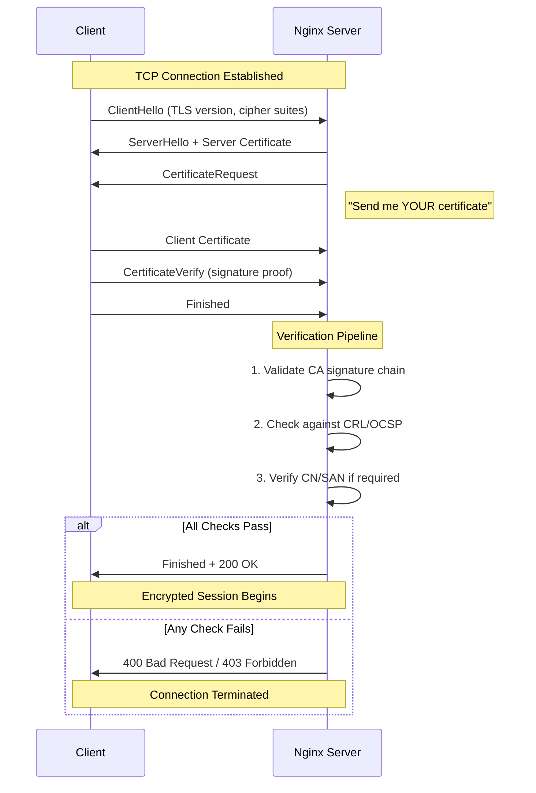
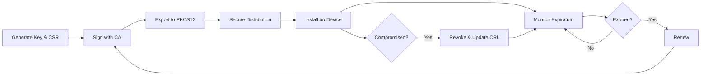

import Callout from "@components/ui/Callout.astro";
import { Tabs, TabPanel } from "@components/ui/tabs";
import TerminalCommand from "@components/ui/TerminalCommand.astro";
import FileContent from "@components/ui/FileContent.astro";
import TerminalOutput from "@components/ui/TerminalOutput.astro";
import Collapsible from "@components/ui/Collapsible.astro";
import Mermaid from "@components/ui/Mermaid.astro";
import Table from "@components/ui/Table.astro";
import TLDRSummary from "@components/ui/TLDRSummary.astro";

**[Mutual TLS (mTLS)](https://www.cloudflare.com/learning/access-management/what-is-mutual-tls/)** represents the gold standard for securing private web services. Unlike passwords, API keys, or even 2FA, mTLS requires the client (your browser/device) to present a cryptographic certificate signed by your own Certificate Authority (CA)—a secret that _cannot_ be phished, guessed, or brute-forced.

If the client doesn't have the certificate, Nginx rejects the connection **before** the application even loads. This is perfect for securing private administration panels, NAS interfaces, or internal tools.

In this comprehensive guide, I'll walk you through implementing mTLS on Nginx, covering everything from creating a certificate authority to advanced topics like **OCSP vs CRL revocation**, **Zero Trust architecture**, and **performance tuning**. This guide incorporates best practices from [Smallstep](https://smallstep.com/hello-mtls), [SSL.com](https://www.ssl.com/article/authenticating-users-and-iot-devices-with-mutual-tls/), and [official Nginx documentation](https://nginx.org/en/docs/http/ngx_http_ssl_module.html).

<TLDRSummary title="TL;DR — mTLS on Nginx in a nutshell">
- **mTLS is unphishable** because the client must present a certificate signed by your own CA; the private key never leaves the device and is never transmitted, so Nginx rejects connections without a valid cert **before** the app loads.
- **Build your own PKI**: create a **4096-bit RSA** CA valid for 10 years, then sign per-device client certs (2048-bit minimum, 1-year validity) and distribute them as password-protected **PKCS12 (.p12)** bundles.
- **Enable it in Nginx** with `ssl_client_certificate` (your CA), `ssl_verify_client on`, and `ssl_verify_depth` — or `optional` plus a `map` to enforce it only on critical routes (see my deployment below); never use `optional_no_ca` in production. Restrict to **TLS 1.2/1.3** with strong ECDHE ciphers.
- **Add fine-grained control** with a `map` on `$ssl_client_s_dn` for CN allowlists, and use `$ssl_client_verify` to let authenticated clients **bypass rate limiting**.
- **Revoke compromised certs** via **CRL** (`openssl ca -revoke` + `-gencrl`, then `ssl_crl`) for small setups or **OCSP** for larger ones — regenerate the CRL and reload Nginx every time. Automate creation and renewal with scripts.
</TLDRSummary>

---

## Why mTLS? The Zero Trust Approach

In the modern security landscape, the perimeter-based model ("trust everything inside the firewall") is obsolete. **[Zero Trust](https://www.cloudflare.com/learning/security/glossary/what-is-zero-trust/)** assumes that attackers may already be inside your network and requires verification for every access request.

mTLS is a cornerstone of Zero Trust architecture because it provides **mutual authentication**: both the server and client verify each other's identity using cryptographic certificates.

<Table title="mTLS vs Other Authentication Methods">
  <thead>
    <tr>
      <th scope="col">Method</th>
      <th scope="col">Phishable?</th>
      <th scope="col">Credential Storage</th>
      <th scope="col">Automation</th>
      <th scope="col">Zero Trust</th>
    </tr>
  </thead>
  <tbody>
    <tr>
      <td><strong>Username/Password</strong></td>
      <td data-status="error">Yes</td>
      <td>Server database</td>
      <td>Easy</td>
      <td data-status="error">No</td>
    </tr>
    <tr>
      <td><strong>API Keys</strong></td>
      <td data-status="error">Yes (if exposed)</td>
      <td>Server + client</td>
      <td>Easy</td>
      <td data-status="error">No</td>
    </tr>
    <tr>
      <td><strong>Password + 2FA</strong></td>
      <td data-status="warning">Partially</td>
      <td>Server + authenticator</td>
      <td>Hard</td>
      <td data-status="warning">Partial</td>
    </tr>
    <tr>
      <td><strong>mTLS</strong></td>
      <td data-status="success">No</td>
      <td>Hardware/keychain</td>
      <td>Medium</td>
      <td data-status="success">Yes</td>
    </tr>
  </tbody>
</Table>

### Why mTLS cannot be phished

Unlike passwords, client certificates:

1. **Are never transmitted** — only a signature proving possession is sent
2. **Are bound to hardware** — stored in secure keychains/TPMs
3. **Require private key access** — the private key never leaves the device
4. **Are validated cryptographically** — forging is computationally infeasible

<Callout type="keypoint" icon="mdi:shield-check">
  **Key Insight:** With mTLS, even if an attacker steals your password AND intercepts your 2FA code, they still cannot access the protected resource without the certificate file installed on an authorized device.
</Callout>

---

## How I run this on my own infrastructure

None of what follows is theory: this blog is served from the same box where mTLS has been protecting my sensitive services since January 2025. My private CA ("JMRP DNS CA", issued with a 10-year lifetime) signs the client certificates that grant access to four services: the Grafana panel, my photo library (Immich), the NAS, and Nginx's own admin interface.

One detail no tutorial told me, and that I only learned by deploying it: in production I do **not** use a bare `ssl_verify_client on`. I run `optional` combined with a `map` and per-location enforcement:

```nginx
map $ssl_client_verify $client_verified {
    "SUCCESS" 1;
    default   0;
}

# On critical routes (e.g. Immich's upload API):
location = /api/assets {
    if ($client_verified = 0) {
        return 403 "Invalid certificate";
    }
    # ...
}
```

Why? With `on` at the server level, any client without a certificate gets a cryptic TLS error before ever reaching Nginx — impossible for a non-technical user to debug, and with no way to fall back to another authentication layer. With `optional` + `map`, the handshake always completes and I decide, route by route, what requires a certificate (write APIs return an explicit 403) and what can fall through to a second authentication layer. That second layer exists: requests from my LAN pass an independent network allowlist, so the certificate is never the only control — defense in depth, not a single master key.

As for issuance: I keep a per-device OpenSSL workflow (a CSR, a config, and a metadata sheet per client), with `ssl_verify_depth 2` on the server. Three certificates are active today, each tied to one specific device and person — when a device is retired, its certificate is retired with it.

An honest confession: **I publish no CRL and no OCSP**. With three certificates on devices I physically control, revocation at this scale means reissuing from the CA — a reasonable trade-off here that would be unacceptable with dozens of clients. If your fleet grows, `ssl_crl` stops being optional.

## One-Way TLS vs Mutual TLS

Understanding the difference is fundamental:

<Table title="One-Way TLS vs Mutual TLS">
  <thead>
    <tr>
      <th scope="col">Aspect</th>
      <th scope="col">One-Way TLS (Standard HTTPS)</th>
      <th scope="col">Mutual TLS (mTLS)</th>
    </tr>
  </thead>
  <tbody>
    <tr>
      <td><strong>Server authenticates to</strong></td>
      <td>Client (browser)</td>
      <td>Client (browser)</td>
    </tr>
    <tr>
      <td><strong>Client authenticates to</strong></td>
      <td data-status="error">Not verified</td>
      <td data-status="success">Server verifies client cert</td>
    </tr>
    <tr>
      <td><strong>Certificate requirement</strong></td>
      <td>Server only</td>
      <td>Both server and client</td>
    </tr>
    <tr>
      <td><strong>Use case</strong></td>
      <td>Public websites</td>
      <td>APIs, admin panels, IoT, B2B</td>
    </tr>
  </tbody>
</Table>

### The standard HTTPS model


In regular HTTPS, only the server presents a certificate.

 The client (browser) verifies it, but the server has no way to verify _who_ the client is—it just knows the connection is encrypted.

### The mTLS enhancement


mTLS adds a second step: after verifying the server, the **server requests a certificate from the client**.

 Only clients presenting a valid certificate signed by a trusted CA are allowed to continue.

---

## The mTLS handshake flow


Understanding the handshake helps with debugging.

 Here's the complete flow:

<Mermaid caption="Nginx mTLS Handshake Flow" maxWidth="550px">

</Mermaid>

### Key steps explained

1. **ClientHello**: Client initiates TLS, proposing cipher suites
2. **ServerHello**: Server responds with its certificate
3. **CertificateRequest**: Server asks client to prove identity
4. **Client Certificate**: Client sends its certificate
5. **CertificateVerify**: Client proves it owns the private key (without revealing it)
6. **Verification**: Server validates the entire chain

---

## Prerequisites and directory setup

Before starting, ensure you have:

- A Linux server (Debian/Ubuntu/CentOS/RHEL) with Nginx installed
- [OpenSSL](https://docs.openssl.org/) (minimum version 1.1.1, check with `openssl version`, recommended 3.5.0+)
- Root or sudo access

### Create your PKI directory

A well-organized directory structure is essential for managing certificates:

<TerminalCommand>
```bash
# Create the main directory structure
sudo mkdir -p /etc/nginx/pki/{ca,certs,crl,private,newcerts}
cd /etc/nginx/pki

# Secure the private directory
sudo chmod 700 private

# Initialize OpenSSL CA database files
sudo touch index.txt
echo 1000 | sudo tee serial > /dev/null
echo 1000 | sudo tee crlnumber > /dev/null
```
</TerminalCommand>

<Callout type="info" icon="mdi:folder-outline">
  **Directory Structure Explained:**
  
  - `ca/` — Certificate Authority certificates
  - `certs/` — Issued client and server certificates
  - `private/` — Private keys (chmod 700!)
  - `crl/` — Certificate Revocation Lists
  - `newcerts/` — OpenSSL's archive of issued certs
</Callout>

---

## Creating your certificate authority


A CA is the root of trust in your PKI. The certificates it issues follow the [X.509 v3](https://datatracker.ietf.org/doc/html/rfc5280) (RFC 5280) profile that underpins the public web PKI.

 All client certificates must be signed by this CA for Nginx to accept them.

### CA design decisions

Before generating, decide on these parameters:

<Table title="CA Configuration Choices">
  <thead>
    <tr>
      <th scope="col">Parameter</th>
      <th scope="col">Recommendation</th>
      <th scope="col">Rationale</th>
    </tr>
  </thead>
  <tbody>
    <tr>
      <td><strong>Key Size</strong></td>
      <td>4096-bit RSA or P-384 ECDSA</td>
      <td>Stronger security margin against classical attacks</td>
    </tr>
    <tr>
      <td><strong>Validity</strong></td>
      <td>10 years for CA</td>
      <td>Longer than any client cert</td>
    </tr>
    <tr>
      <td><strong>Hash Algorithm</strong></td>
      <td>SHA-256 minimum</td>
      <td>SHA-1 is deprecated</td>
    </tr>
    <tr>
      <td><strong>Extensions</strong></td>
      <td><code>CA:TRUE</code>, <code>keyUsage:keyCertSign,cRLSign</code></td>
      <td>Required for signing certs and CRLs</td>
    </tr>
  </tbody>
</Table>

### Create the OpenSSL configuration

Create a comprehensive OpenSSL configuration file:

<FileContent filename="/etc/nginx/pki/openssl.cnf">
```ini
# =============================================================
# OpenSSL Configuration for mTLS Certificate Authority
# =============================================================

[ ca ]
default_ca = CA_default

[ CA_default ]
# Directory structure
dir               = /etc/nginx/pki
database          = $dir/index.txt
new_certs_dir     = $dir/newcerts
certificate       = $dir/ca/ca.crt
serial            = $dir/serial
private_key       = $dir/private/ca.key
crlnumber         = $dir/crlnumber
crl               = $dir/crl/ca.crl

# Certificate defaults
default_days      = 365          # Client certs valid 1 year
default_crl_days  = 30           # CRL valid 30 days
default_md        = sha256       # Use SHA-256
preserve          = no
policy            = policy_loose
copy_extensions   = copy         # Copy SANs from CSR
# SECURITY WARNING: copy_extensions=copy copies ALL extensions from the CSR.
# This is safe only when you trust the CSR generator. A malicious CSR could
# include basicConstraints: CA:TRUE to create a subordinate CA.
# Use copy_extensions=none or explicitly filter extensions for untrusted CSRs.

[ policy_loose ]
countryName             = optional
stateOrProvinceName     = optional
localityName            = optional
organizationName        = optional
organizationalUnitName  = optional
commonName              = supplied
emailAddress            = optional

# =============================================================
# CA Certificate Request Settings
# =============================================================
[ req ]
default_bits        = 4096
distinguished_name  = req_distinguished_name
string_mask         = utf8only
default_md          = sha256
x509_extensions     = v3_ca
prompt              = no

[ req_distinguished_name ]
C                   = ES
ST                  = Valencia
L                   = Valencia
O                   = JMRP-IO-LAB
OU                  = Infrastructure Security
CN                  = JMRP-IO-LAB Root CA

# =============================================================
# Certificate Extensions
# =============================================================

# For the CA certificate itself
[ v3_ca ]
subjectKeyIdentifier    = hash
authorityKeyIdentifier  = keyid:always,issuer
basicConstraints        = critical, CA:TRUE
keyUsage                = critical, digitalSignature, cRLSign, keyCertSign

# For client certificates
[ v3_client ]
subjectKeyIdentifier    = hash
authorityKeyIdentifier  = keyid,issuer
basicConstraints        = critical, CA:FALSE
keyUsage                = critical, nonRepudiation, digitalSignature, keyEncipherment
extendedKeyUsage        = clientAuth
```
</FileContent>

### Configuration breakdown

Let's dissect the `openssl.cnf` file to understand what each section controls.

#### 1. CA Global Settings (`[ ca ]` & `[ CA_default ]`)

This section tells OpenSSL where to find your files and how to sign certificates.

<Table title="CA Default Settings">
  <thead>
    <tr>
      <th scope="col">Directive</th>
      <th scope="col">Value/Type</th>
      <th scope="col">Description</th>
    </tr>
  </thead>
  <tbody>
    <tr>
      <td><code>dir</code></td>
      <td>Path (String)</td>
      <td>Base directory for your PKI (e.g., <code>/etc/nginx/pki</code>).</td>
    </tr>
    <tr>
      <td><code>database</code></td>
      <td>File Path</td>
      <td>Text file (<code>index.txt</code>) tracking all issued and revoked certificates.</td>
    </tr>
    <tr>
      <td><code>new_certs_dir</code></td>
      <td>Directory Path</td>
      <td>Where copies of every issued certificate are archived by serial number.</td>
    </tr>
    <tr>
      <td><code>certificate</code></td>
      <td>File Path</td>
      <td>The CA's own public certificate used to sign others.</td>
    </tr>
    <tr>
      <td><code>private_key</code></td>
      <td>File Path</td>
      <td>The CA's private key. <strong>Must be protected.</strong></td>
    </tr>
    <tr>
      <td><code>default_days</code></td>
      <td>Integer (Days)</td>
      <td>Default validity period for issued certificates (e.g., 365).</td>
    </tr>
    <tr>
      <td><code>policy</code></td>
      <td>Section Name</td>
      <td>Which policy section to enforce for matching DN fields (e.g., <code>policy_loose</code>).</td>
    </tr>
    <tr>
      <td><code>copy_extensions</code></td>
      <td><code>copy</code> | <code>none</code></td>
      <td><strong>Crucial:</strong> Copies SANs (Subject Alternative Names) from the CSR to the final certificate.</td>
    </tr>
  </tbody>
</Table>

#### 2. Validation Policies (`[ policy_loose ]`)

Controls which fields in the Certificate Signing Request (CSR) must match the CA's own fields.

<Table title="Policy Rules">
  <thead>
    <tr>
      <th scope="col">Field</th>
      <th scope="col">Rule</th>
      <th scope="col">Meaning</th>
    </tr>
  </thead>
  <tbody>
    <tr>
      <td><code>countryName</code></td>
      <td><code>optional</code></td>
      <td>The client doesn't need to specify a country.</td>
    </tr>
    <tr>
      <td><code>commonName</code></td>
      <td><code>supplied</code></td>
      <td><strong>Required.</strong> The client must provide a Common Name (used for identification).</td>
    </tr>
    <tr>
      <td><code>organizationName</code></td>
      <td><code>optional</code></td>
      <td>Can be left empty.</td>
    </tr>
  </tbody>
</Table>

#### 3. Request Settings (`[ req ]`)

Defaults used when you run `openssl req` to generate keys or CSRs.

<Table title="Request Defaults">
  <thead>
    <tr>
      <th scope="col">Directive</th>
      <th scope="col">Value</th>
      <th scope="col">Description</th>
    </tr>
  </thead>
  <tbody>
    <tr>
      <td><code>default_bits</code></td>
      <td>Integer (e.g., 4096)</td>
      <td>Default key size if not specified.</td>
    </tr>
    <tr>
      <td><code>distinguished_name</code></td>
      <td>Section Name</td>
      <td>Points to the section defining default DN values (<code>[ req_distinguished_name ]</code>).</td>
    </tr>
    <tr>
      <td><code>x509_extensions</code></td>
      <td>Section Name</td>
      <td>Extensions to add when creating a <strong>self-signed</strong> root certificate (e.g., <code>v3_ca</code>).</td>
    </tr>
  </tbody>
</Table>

#### 4. Certificate Extensions (`[ v3_* ]`)

These sections define the "capabilities" of the certificates you issue. This is the security core.

<Table title="Extension Profiles">
  <thead>
    <tr>
      <th scope="col">Profile/Directive</th>
      <th scope="col">Value</th>
      <th scope="col">Effect</th>
    </tr>
  </thead>
  <tbody>
    <tr>
      <td colspan="3"><strong>[ v3_ca ] - For the Root CA</strong></td>
    </tr>
    <tr>
      <td><code>basicConstraints</code></td>
      <td><code>critical, CA:TRUE</code></td>
      <td><strong>Identity:</strong> Marks this cert as a Certificate Authority that can sign others.</td>
    </tr>
    <tr>
      <td><code>keyUsage</code></td>
      <td><code>keyCertSign, cRLSign</code></td>
      <td><strong>Permissions:</strong> Allowed to sign certificates and CRLs.</td>
    </tr>
    <tr>
      <td colspan="3"><strong>[ v3_client ] - For User Devices</strong></td>
    </tr>
    <tr>
      <td><code>basicConstraints</code></td>
      <td><code>critical, CA:FALSE</code></td>
      <td><strong>Restriction:</strong> This certificate <strong>cannot</strong> be used to sign other certificates.</td>
    </tr>
    <tr>
      <td><code>extendedKeyUsage</code></td>
      <td><code>clientAuth</code></td>
      <td><strong>Purpose:</strong> Valid <strong>only</strong> for authenticating a client to a server (mTLS).</td>
    </tr>
  </tbody>
</Table>

### Generate the CA key and certificate

<TerminalCommand>
```bash
cd /etc/nginx/pki

# Generate CA private key (4096-bit RSA)
sudo openssl genrsa -out private/ca.key 4096

# Secure the private key
sudo chmod 400 private/ca.key

# Generate the self-signed CA certificate (valid 10 years)
sudo openssl req -new -x509 -days 3650 \
    -key private/ca.key \
    -out ca/ca.crt \
    -config openssl.cnf \
    -extensions v3_ca
```
</TerminalCommand>

### Verify your CA certificate

<TerminalCommand>
```bash
openssl x509 -in ca/ca.crt -text -noout | head -30
```
</TerminalCommand>

<TerminalOutput title="CA Certificate Details">
```text
Certificate:
    Data:
        Version: 3 (0x2)
        Serial Number:
            1f:23:94:bf:00:2d:11:f7:c5:14:ac:c6:24:a9:d1:ff:b3:4e:cc:3a
        Signature Algorithm: sha256WithRSAEncryption
        Issuer: C=ES, ST=Valencia, L=Valencia, O=JMRP-IO-LAB, OU=Infrastructure Security, CN=JMRP-IO-LAB Root CA
        Validity
            Not Before: Jan 13 18:21:21 2026 GMT
            Not After : Jan 11 18:21:21 2036 GMT
        Subject: C=ES, ST=Valencia, L=Valencia, O=JMRP-IO-LAB, OU=Infrastructure Security, CN=JMRP-IO-LAB Root CA
        Subject Public Key Info:
            Public Key Algorithm: rsaEncryption
                Public-Key: (4096 bit)
            X509v3 extensions:
                X509v3 Subject Key Identifier: 
                    ...
                X509v3 Basic Constraints: critical
                    CA:TRUE
                X509v3 Key Usage: critical
                    Digital Signature, Certificate Sign, CRL Sign
```
</TerminalOutput>

---

## Generating client certificates

Each client (device, user, or service) needs its own certificate signed by your CA.

### SAN vs CN: which to use?

<Table title="Subject Alternative Name (SAN) vs Common Name (CN)">
  <thead>
    <tr>
      <th scope="col">Aspect</th>
      <th scope="col">Common Name (CN)</th>
      <th scope="col">Subject Alternative Name (SAN)</th>
    </tr>
  </thead>
  <tbody>
    <tr>
      <td><strong>Standard</strong></td>
      <td>Legacy (deprecated for server certs)</td>
      <td>Modern, RFC 6125 compliant</td>
    </tr>
    <tr>
      <td><strong>Multiple identities</strong></td>
      <td data-status="error">No</td>
      <td data-status="success">Yes (DNS, email, URI)</td>
    </tr>
    <tr>
      <td><strong>Best for</strong></td>
      <td>Simple client identification</td>
      <td>Services, multi-identity clients</td>
    </tr>
  </tbody>
</Table>

For simple user identification (like we're doing), CN is sufficient. For service-to-service authentication, use SANs.

### Generate a client certificate

<TerminalCommand>
```bash
cd /etc/nginx/pki

# Set device/user name
CLIENT_NAME="iphone-jmrp"

# Generate client private key
sudo openssl genrsa -out private/${CLIENT_NAME}.key 2048

# Create Certificate Signing Request (CSR)
sudo openssl req -new \
    -key private/${CLIENT_NAME}.key \
    -out certs/${CLIENT_NAME}.csr \
    -subj "/CN=${CLIENT_NAME}"

# Sign with your CA
sudo openssl ca -config openssl.cnf \
    -extensions v3_client \
    -batch \
    -in certs/${CLIENT_NAME}.csr \
    -out certs/${CLIENT_NAME}.crt
```
</TerminalCommand>

<TerminalOutput title="Certificate Signing Output">
Using configuration from openssl.cnf
Check that the request matches the signature
Signature ok
The Subject's Distinguished Name is as follows
commonName            :ASN.1 12:'iphone-jmrp'
Certificate is to be certified until Jan 13 18:21:36 2027 GMT (365 days)

Write out database with 1 new entries
Database updated
</TerminalOutput>

### PKCS12 or PEM: which export format do you need?

<Table title="Certificate Format Comparison">
  <thead>
    <tr>
      <th scope="col">Format</th>
      <th scope="col">Contains</th>
      <th scope="col">Best For</th>
      <th scope="col">Password Protected</th>
    </tr>
  </thead>
  <tbody>
    <tr>
      <td><strong>PEM (.crt, .key)</strong></td>
      <td>Separate text files</td>
      <td>Linux servers, scripting</td>
      <td>Optional</td>
    </tr>
    <tr>
      <td><strong>PKCS12 (.p12, .pfx)</strong></td>
      <td>All-in-one binary bundle</td>
      <td>Browsers, mobile, Windows</td>
      <td>Required</td>
    </tr>
  </tbody>
</Table>

### Create PKCS12 bundle for clients

<TerminalCommand>
```bash
# Bundle certificate, key, and CA into .p12 file
sudo openssl pkcs12 -export \
    -out certs/${CLIENT_NAME}.p12 \
    -inkey private/${CLIENT_NAME}.key \
    -in certs/${CLIENT_NAME}.crt \
    -certfile ca/ca.crt \
    -name "${CLIENT_NAME}"

# You will be prompted for an export password
# This protects the .p12 file during transfer
```
</TerminalCommand>

<Callout type="warning" icon="mdi:alert">
  **Security:** Choose a strong export password. This password protects the certificate during transfer to client devices. Transmit it separately from the .p12 file (e.g., via encrypted message or in person).
</Callout>

---

## Configuring Nginx for mTLS

Now configure Nginx to require and validate client certificates.

### Which ssl_verify_client option should you use?

The `ssl_verify_client` directive controls how Nginx handles client certificates:

<Table title="ssl_verify_client Options">
  <thead>
    <tr>
      <th scope="col">Value</th>
      <th scope="col">Behavior</th>
      <th scope="col">Use Case</th>
    </tr>
  </thead>
  <tbody>
    <tr>
      <td><code>on</code></td>
      <td>Require valid cert; reject without</td>
      <td>Strict access control (recommended)</td>
    </tr>
    <tr>
      <td><code>optional</code></td>
      <td>Accept if valid; proceed without</td>
      <td>Hybrid auth, optional verification</td>
    </tr>
    <tr>
      <td><code>optional_no_ca</code></td>
      <td>Accept any cert, no CA validation</td>
      <td>Development/testing only</td>
    </tr>
    <tr>
      <td><code>off</code></td>
      <td>No client certificate required</td>
      <td>Standard HTTPS</td>
    </tr>
  </tbody>
</Table>

<Callout type="warning" icon="mdi:shield-alert">
  **Never use `optional_no_ca` in production!** It accepts _any_ certificate without validating the CA chain, defeating the purpose of mTLS.
</Callout>

### Complete Nginx configuration

<FileContent filename="/etc/nginx/sites-available/secure.example.com.conf">
```nginx
server {
    listen 443 ssl;
    listen [::]:443 ssl;
    http2 on;
    server_name secure.example.com;
    
    # =================================================
    # Server TLS Configuration
    # =================================================
    ssl_certificate     /etc/ssl/certs/secure.example.com.crt;
    ssl_certificate_key /etc/ssl/private/secure.example.com.key;
    
    # =================================================
    # Client Certificate (mTLS) Configuration
    # =================================================
    
    # Path to your Certificate Authority
    ssl_client_certificate /etc/nginx/pki/ca/ca.crt;
    
    # Require valid client certificate
    ssl_verify_client on;
    
    # Verify up to 2 levels in the certificate chain
    ssl_verify_depth 2;
    
    # Optional: Certificate Revocation List
    # ssl_crl /etc/nginx/pki/crl/ca.crl;
    
    # =================================================
    # TLS Protocol Configuration
    # =================================================
    ssl_protocols TLSv1.2 TLSv1.3;
    ssl_ciphers ECDHE-ECDSA-AES128-GCM-SHA256:ECDHE-RSA-AES128-GCM-SHA256:ECDHE-ECDSA-AES256-GCM-SHA384:ECDHE-RSA-AES256-GCM-SHA384:ECDHE-ECDSA-CHACHA20-POLY1305:ECDHE-RSA-CHACHA20-POLY1305;
    ssl_prefer_server_ciphers on;
    
    # Performance: SSL Session Caching
    ssl_session_cache shared:SSL:10m;
    ssl_session_timeout 1d;
    ssl_session_tickets off;
    
    # =================================================
    # Logging (Include Client DN for Debugging)
    # =================================================
    access_log /var/log/nginx/secure.access.log combined;
    error_log /var/log/nginx/secure.error.log warn;
    
    # =================================================
    # Application
    # =================================================
    location / {
        # First, clear any client-provided values to prevent spoofing
        proxy_set_header X-Client-DN "";
        proxy_set_header X-Client-Verify "";
        proxy_set_header X-Client-Fingerprint "";
        
        # Then set authenticated values from Nginx's SSL module
        # Backend should only trust these when requests come directly from Nginx
        proxy_set_header X-Client-DN $ssl_client_s_dn;
        proxy_set_header X-Client-Verify $ssl_client_verify;
        proxy_set_header X-Client-Fingerprint $ssl_client_fingerprint;
        
        proxy_pass http://127.0.0.1:8080;
    }
}
```
</FileContent>

<Callout type="warning" icon="mdi:shield-alert">
  **Trust Boundary Warning:** The `X-Client-DN`, `X-Client-Verify`, and `X-Client-Fingerprint` headers can be spoofed by malicious clients if upstream proxies don't clear them. Ensure:
  - Any load balancer or reverse proxy in front of Nginx strips these headers before forwarding
  - Backend applications only trust these headers when requests come directly from Nginx (validate source IP or use mTLS between Nginx and backend)
  - Consider using an internal-only network interface for the Nginx-to-backend connection
</Callout>

### Test and reload

<TerminalCommand>
```bash
# Test configuration syntax
sudo nginx -t

# If successful, reload
sudo systemctl reload nginx
```
</TerminalCommand>

Now, let's verify the connections using `curl`.

**1. Access Denied (No Certificate):**

<Collapsible summary="Show curl output (400 Bad Request)">
<TerminalOutput title="curl -v https://secure.example.com">
```text
> GET / HTTP/1.1
> Host: secure.example.com
> User-Agent: curl/8.14.1
> Accept: */*
> 
< HTTP/1.1 400 Bad Request
< Server: nginx
< Content-Type: text/html
< Content-Length: 230
< Connection: close
< 
<html>
<head><title>400 No required SSL certificate was sent</title></head>
<body>
<center><h1>400 Bad Request</h1></center>
<center>No required SSL certificate was sent</center>
<hr><center>nginx</center>
</body>
</html>
```
</TerminalOutput>
</Collapsible>

**2. Access Granted (With Valid Certificate):**

<Collapsible summary="Show curl output (200 OK)">
<TerminalOutput title="curl -v --cert client.crt --key client.key https://secure.example.com">
```text
* TLSv1.3 (IN), TLS handshake, Request CERT (13):
{ [210 bytes data]
* TLSv1.3 (OUT), TLS handshake, Certificate (11):
} [812 bytes data]
* TLSv1.3 (OUT), TLS handshake, CERT verify (15):
} [264 bytes data]
* TLSv1.3 (IN), TLS handshake, Finished (20):
{ [52 bytes data]
* SSL connection using TLSv1.3 / TLS_AES_256_GCM_SHA384
* Server certificate:
*  subject: CN=secure.example.com
*  issuer: CN=secure.example.com
> GET / HTTP/1.1
> Host: secure.example.com
> User-Agent: curl/8.14.1
> 
< HTTP/1.1 200 OK
< Server: nginx
< Content-Type: text/plain
mTLS Authentication Successful! Client DN: CN=iphone-jmrp
```
</TerminalOutput>
</Collapsible>

---

## TLS protocol and cipher configuration


Proper TLS configuration is critical for security.

 Here's what each setting does:

### Protocol version selection

Only TLS 1.2 and TLS 1.3 belong in a modern configuration. [TLS 1.3](https://datatracker.ietf.org/doc/html/rfc8446) (RFC 8446) is the current standard, with a faster handshake and AEAD-only cipher suites:

<Table title="TLS Protocol Versions">
  <thead>
    <tr>
      <th scope="col">Version</th>
      <th scope="col">Status</th>
      <th scope="col">Security</th>
    </tr>
  </thead>
  <tbody>
    <tr>
      <td>TLS 1.0</td>
      <td data-status="error">Deprecated</td>
      <td>Vulnerable (BEAST, POODLE)</td>
    </tr>
    <tr>
      <td>TLS 1.1</td>
      <td data-status="error">Deprecated</td>
      <td>Weak ciphers, no AEAD</td>
    </tr>
    <tr>
      <td>TLS 1.2</td>
      <td data-status="success">Supported</td>
      <td>Secure with proper ciphers</td>
    </tr>
    <tr>
      <td>TLS 1.3</td>
      <td data-status="success">Recommended</td>
      <td>Best security, faster handshake</td>
    </tr>
  </tbody>
</Table>

### Recommended configuration

<FileContent filename="TLS Security Settings">
```nginx
# Only allow TLS 1.2 and 1.3
ssl_protocols TLSv1.2 TLSv1.3;

# Strong cipher suites (ECDHE for forward secrecy, GCM for AEAD)
ssl_ciphers ECDHE-ECDSA-AES128-GCM-SHA256:ECDHE-RSA-AES128-GCM-SHA256:ECDHE-ECDSA-AES256-GCM-SHA384:ECDHE-RSA-AES256-GCM-SHA384:ECDHE-ECDSA-CHACHA20-POLY1305:ECDHE-RSA-CHACHA20-POLY1305;

# Server chooses the cipher (prevents downgrade attacks)
ssl_prefer_server_ciphers on;

# Session resumption for performance
ssl_session_cache shared:SSL:10m;
ssl_session_timeout 1d;

# Disable session tickets (more secure, less memory)
ssl_session_tickets off;

# Diffie-Hellman parameters for non-ECDHE (if needed)
# Generate with: openssl dhparam -out /etc/nginx/dhparam.pem 4096
ssl_dhparam /etc/nginx/dhparam.pem;
```
</FileContent>

<Callout type="tip" icon="mdi:speedometer">
  **Performance Tip:** SSL session caching significantly reduces handshake overhead. A 10MB cache can store ~40,000 sessions. This is especially important for mTLS where handshakes are more expensive.
</Callout>

---

## Advanced access control


By default, _any_ client with a valid certificate signed by your CA can access the site.

 You can add granular controls using Nginx variables.

### Useful mTLS variables

Nginx exposes these variables for client certificate information:

<Table title="Nginx mTLS Variables">
  <thead>
    <tr>
      <th scope="col">Variable</th>
      <th scope="col">Content</th>
      <th scope="col">Example</th>
    </tr>
  </thead>
  <tbody>
    <tr>
      <td><code>$ssl_client_verify</code></td>
      <td>Verification result</td>
      <td><code>SUCCESS</code>, <code>FAILED:reason</code></td>
    </tr>
    <tr>
      <td><code>$ssl_client_s_dn</code></td>
      <td>Subject DN</td>
      <td><code>CN=iphone-jmrp</code></td>
    </tr>
    <tr>
      <td><code>$ssl_client_i_dn</code></td>
      <td>Issuer DN</td>
      <td><code>CN=JMRP-IO-LAB Root CA</code></td>
    </tr>
    <tr>
      <td><code>$ssl_client_fingerprint</code></td>
      <td>SHA1 fingerprint</td>
      <td><code>AB:CD:EF:12:34:...</code></td>
    </tr>
    <tr>
      <td><code>$ssl_client_serial</code></td>
      <td>Certificate serial</td>
      <td><code>1000</code></td>
    </tr>
  </tbody>
</Table>

### CN-based authorization with map

Use the `map` directive to create an allowlist:

<FileContent filename="/etc/nginx/conf.d/mtls-access.conf">
```nginx
# Place this OUTSIDE the server block (in nginx.conf or included file)

# Map client DN to access permission
map $ssl_client_s_dn $mtls_access_allowed {
    default 0;
    
    # Allowed certificates by CN
    "CN=iphone-jmrp"      1;
    "CN=macbook-jmrp"     1;
    "CN=ipad-home"        1;
    
    # Pattern matching with regex
    ~"CN=admin-.*"        1;    # All admin-* certificates
}
```
</FileContent>

Then in your server block:

<FileContent filename="Server Block Access Control">
```nginx
server {
    # ... SSL configuration ...
    
    location / {
        # Verify certificate is valid (handled by ssl_verify_client on)
        # Then check our custom authorization
        if ($mtls_access_allowed = 0) {
            return 403 "Valid certificate, but not authorized for this resource.";
        }
        
        proxy_pass http://backend;
    }
}
```
</FileContent>

---

## Advanced use case: rate limit bypass


One often overlooked benefit of mTLS is the ability to trust authenticated clients at the network level.

 For example, you might want to apply strict **DDoS protection** and **Rate Limiting** to the public internet, but allow your own devices (authenticated via mTLS) to have unlimited access.

You can achieve this in Nginx using a `map` directive to whitelist verified clients.

### Configuration example

<FileContent filename="/etc/nginx/nginx.conf">
```nginx
http {
    # ...
    
    # 1. Map the verification status to a rate-limit key
    map $ssl_client_verify $limit_req_whitelist {
        "SUCCESS" "";                  # If verified, key is empty (no limit)
        default   $binary_remote_addr; # Otherwise, limit by IP
    }

    # 2. Define the zone using the map variable
    # If $limit_req_whitelist is empty, the request is not counted!
    limit_req_zone $limit_req_whitelist zone=req_limit_per_ip:10m rate=5r/s;

    server {
        # IMPORTANT: To allow unauthenticated clients to reach this logic,
        # you must set 'ssl_verify_client optional' instead of 'on'.
        # If set to 'on', Nginx rejects the handshake before the rate limiter runs.
        ssl_verify_client optional;

        # 3. Apply the limit
        limit_req zone=req_limit_per_ip burst=10 nodelay;
        
        # ...
    }
}
```
</FileContent>

<Callout type="keypoint" icon="mdi:speedometer">
  **How it works:** Nginx `limit_req_zone` ignores any request where the key variable is empty. By mapping `SUCCESS` to an empty string, mTLS-authenticated clients completely bypass the rate limiter, while everyone else is tracked by their IP address.
</Callout>

---

## Certificate revocation: CRL vs OCSP


What happens when a device is lost or compromised?

 You need to **revoke** its certificate. There are two methods:

<Table title="CRL vs OCSP Comparison">
  <thead>
    <tr>
      <th scope="col">Aspect</th>
      <th scope="col">CRL (Certificate Revocation List)</th>
      <th scope="col">OCSP (Online Certificate Status)</th>
    </tr>
  </thead>
  <tbody>
    <tr>
      <td><strong>How it works</strong></td>
      <td>Server downloads full list of revoked certs</td>
      <td>Server queries responder for single cert</td>
    </tr>
    <tr>
      <td><strong>Timeliness</strong></td>
      <td>Delayed (depends on CRL refresh interval)</td>
      <td>Near real-time</td>
    </tr>
    <tr>
      <td><strong>Bandwidth</strong></td>
      <td>Higher (downloads entire list)</td>
      <td>Lower (single query)</td>
    </tr>
    <tr>
      <td><strong>Nginx directive</strong></td>
      <td><code>ssl_crl</code></td>
      <td><code>ssl_stapling</code> (for server cert)</td>
    </tr>
    <tr>
      <td><strong>Complexity</strong></td>
      <td>Simple (file on disk)</td>
      <td>Requires OCSP responder service</td>
    </tr>
  </tbody>
</Table>

### Method 1: CRL (recommended for small deployments)

#### Step 1: revoke a certificate

<TerminalCommand>
```bash
cd /etc/nginx/pki

# Revoke the certificate
sudo openssl ca -config openssl.cnf \
    -revoke certs/lost-device.crt
```
</TerminalCommand>

<TerminalOutput title="Revocation Output">
Using configuration from openssl.cnf
Revoking Certificate 1000.
Database updated
</TerminalOutput>

#### Step 2: generate the CRL file

<TerminalCommand>
```bash
# Generate the CRL
sudo openssl ca -config openssl.cnf \
    -gencrl -out crl/ca.crl

# Verify the CRL
openssl crl -in crl/ca.crl -text -noout
```
</TerminalCommand>

#### Step 3: configure Nginx

<FileContent filename="Add to server block">
```nginx
# Enable CRL checking
ssl_crl /etc/nginx/pki/crl/ca.crl;
```
</FileContent>

<TerminalCommand>
```bash
sudo nginx -t && sudo systemctl reload nginx
```
</TerminalCommand>

<Callout type="warning" icon="mdi:refresh">
  **Important:** You must regenerate the CRL and reload Nginx **every time** you revoke a certificate. Consider automating this with a cron job.
</Callout>

### Verify revocation

Accessing the site with the revoked certificate should now fail:

<Collapsible summary="Show curl output (Revoked - 400 Bad Request)">
<TerminalOutput title="curl -v --cert revoked.crt ...">
```text
< HTTP/1.1 400 Bad Request
< Server: nginx
< Content-Type: text/html
< Content-Length: 208
< Connection: close
< 
<html>
<head><title>400 The SSL certificate error</title></head>
<body>
<center><h1>400 Bad Request</h1></center>
<center>The SSL certificate error</center>
<hr><center>nginx</center>
</body>
</html>
```
</TerminalOutput>
</Collapsible>

### Method 2: OCSP (for larger deployments)


For enterprises with many certificates, OCSP is more efficient.

 This requires running an OCSP responder (beyond the scope of this guide, but tools like [step-ca](https://smallstep.com/docs/step-ca/) provide this).

---

## Certificate lifecycle management

A complete lifecycle includes creation, distribution, monitoring, renewal, and revocation.

### The certificate lifecycle

<Mermaid caption="Certificate Lifecycle Flow" maxWidth="100%">

</Mermaid>

## Automation scripts


Managing certificates manually is error-prone.

 Here are two essential scripts to automate the lifecycle.

### 1. Client certificate generator


This script automates the entire creation process

: generating the key, CSR, signing it, and exporting the PKCS#12 bundle.

<FileContent filename="/usr/local/bin/mtls-add-client.sh" collapsible={true}>
```bash
#!/bin/bash
set -e

# Configuration
PKI_DIR="/etc/nginx/pki"
DAYS_VALID=365
CLIENT_NAME=$1
EXPORT_PASS=$2

if [ -z "$CLIENT_NAME" ]; then
    echo "Usage: $0 <client-name> [export-password]"
    exit 1
fi

# Validate CLIENT_NAME: only allow alphanumerics, dots, underscores, hyphens
# Reject path traversal sequences, leading dots, slashes, and other unsafe chars
if ! echo "$CLIENT_NAME" | grep -qE '^[A-Za-z0-9._-]+$'; then
    echo "❌ Error: CLIENT_NAME contains invalid characters."
    echo "   Only alphanumerics, dots, underscores, and hyphens are allowed."
    exit 1
fi

# Additional check to prevent path traversal patterns
if echo "$CLIENT_NAME" | grep -qE '(\.\.|^\.)|/'; then
    echo "❌ Error: CLIENT_NAME contains path traversal sequences or slashes."
    exit 1
fi

if [ -z "$EXPORT_PASS" ]; then
    echo "No password provided. Generating a random one..."
    EXPORT_PASS=$(openssl rand -base64 12)
    echo "Generated Password: $EXPORT_PASS"
fi

cd $PKI_DIR

echo "1. Generating private key for $CLIENT_NAME..."
openssl genrsa -out private/${CLIENT_NAME}.key 2048

echo "2. Creating CSR..."
openssl req -new -key private/${CLIENT_NAME}.key \
    -out certs/${CLIENT_NAME}.csr \
    -subj "/CN=${CLIENT_NAME}"

echo "3. Signing certificate..."
openssl ca -config openssl.cnf \
    -extensions v3_client \
    -days $DAYS_VALID \
    -batch \
    -in certs/${CLIENT_NAME}.csr \
    -out certs/${CLIENT_NAME}.crt

echo "4. Exporting to PKCS12 (.p12)..."
# Use stdin for password to avoid exposure in process list
echo "$EXPORT_PASS" | openssl pkcs12 -export \
    -out certs/${CLIENT_NAME}.p12 \
    -inkey private/${CLIENT_NAME}.key \
    -in certs/${CLIENT_NAME}.crt \
    -certfile ca/ca.crt \
    -name "${CLIENT_NAME}" \
    -passout stdin

echo "----------------------------------------"
echo "✅ Certificate created successfully!"
echo "Files:"
echo " - Key: $PKI_DIR/private/${CLIENT_NAME}.key"
echo " - Cert: $PKI_DIR/certs/${CLIENT_NAME}.crt"
echo " - Bundle: $PKI_DIR/certs/${CLIENT_NAME}.p12"
echo "----------------------------------------"
echo "⚠️  Export Password: $EXPORT_PASS"
echo "Transfer the .p12 file securely to the client device."
```
</FileContent>

<TerminalCommand>
```bash
# Usage example: Generate certificate for a new device
sudo /usr/local/bin/mtls-add-client.sh my-iphone securepassword
```
</TerminalCommand>

### 2. Auto-renewal script


This script checks for expiring certificates

, revokes them, re-signs the original CSR, and generates a new `.p12` bundle.

<FileContent filename="/usr/local/bin/mtls-renew.sh" collapsible={true}>
```bash
#!/bin/bash
# mTLS Certificate Renewal Script
set -e

PKI_DIR="/etc/nginx/pki"
DAYS_BEFORE_EXPIRY=30
RENEW_DAYS=365
RENEWED=false

echo "Checking for expiring certificates in $PKI_DIR/certs..."

while read -r cert; do
    # Extract expiration date
    end_date=$(openssl x509 -enddate -noout -in "$cert" | cut -d= -f2)
    end_epoch=$(date -d "$end_date" +%s)
    now_epoch=$(date +%s)
    days_left=$(( (end_epoch - now_epoch) / 86400 ))
    
    # Extract Common Name robustly (handles "CN=Name", "CN = Name", and trailing DN fields)
    CN=$(openssl x509 -subject -noout -nameopt RFC2253 -in "$cert" | \
         sed -n 's/.*CN=\([^,/]*\).*/\1/p' | sed 's/^[[:space:]]*//;s/[[:space:]]*$//')
    
    if [ "$days_left" -lt "$DAYS_BEFORE_EXPIRY" ]; then
        echo "--------------------------------------------------"
        echo "⚠️  Certificate for \"$CN\" expires in $days_left days."
        echo "   (File: $cert)"
        echo "   Renewing now..."
        
        # 1. Archive old cert
        cp "$cert" "$cert.old.$(date +%F)"
        
        # 2. Re-sign the existing CSR
        # We assume CSR exists in certs/ directory as $CN.csr
        CSR="$PKI_DIR/certs/$CN.csr"
        if [ ! -f "$CSR" ]; then
            echo "   ❌ CSR not found at $CSR. Cannot renew automatically."
            continue
        fi
        
        # Revoke old cert (to clear DB index and maintain CRL)
        openssl ca -config $PKI_DIR/openssl.cnf \
            -revoke "$cert"
        
        # Regenerate CRL immediately after revocation
        openssl ca -config $PKI_DIR/openssl.cnf \
            -gencrl -out $PKI_DIR/crl/ca.crl
        
        # Re-sign
        openssl ca -config $PKI_DIR/openssl.cnf \
            -extensions v3_client \
            -days $RENEW_DAYS \
            -batch \
            -in "$CSR" \
            -out "$cert"
            
        echo "   ✅ Certificate re-signed. New validity: $RENEW_DAYS days."
        echo "   ✅ CRL regenerated."
        
        # 3. Generate new P12
        NEW_PASS=$(openssl rand -base64 12)
        P12="$PKI_DIR/certs/$CN.p12"
        KEY="$PKI_DIR/private/$CN.key"
        
        if [ -f "$KEY" ]; then
            # Use stdin for password to avoid exposure in process list
            echo "$NEW_PASS" | openssl pkcs12 -export \
                -out "$P12" \
                -inkey "$KEY" \
                -in "$cert" \
                -certfile $PKI_DIR/ca/ca.crt \
                -name "$CN" \
                -passout stdin
                
            echo "   📦 New PKCS#12 bundle created: $P12"
            echo "   🔑 New Export Password: $NEW_PASS"
        else
            echo "   ⚠️ Private key not found. Skipped P12 generation."
        fi
        
        # Mark that we renewed at least one certificate
        RENEWED=true
        echo "--------------------------------------------------"
    else
        echo "✅ $CN: $days_left days remaining."
    fi
done < <(find "$PKI_DIR/certs" -name "*.crt" -type f)

# Reload Nginx if any certificates were renewed
if [ "$RENEWED" = "true" ]; then
    echo ""
    echo "========================================"
    echo "🔄 Reloading Nginx to apply updated CRL..."
    echo "========================================"
    
    # Test configuration first
    if nginx -t 2>&1; then
        systemctl reload nginx
        echo "✅ Nginx reloaded successfully."
    else
        echo "❌ Nginx configuration test failed. Skipping reload."
        exit 1
    fi
fi
```
</FileContent>

<Callout type="warning" icon="mdi:linux">
  **Platform Note:** This script uses GNU `date -d` which is Linux-specific. On macOS/BSD, you'll need to modify the `end_epoch` calculation using `date -j -f` or use a cross-platform tool like Python's `datetime` module.
</Callout>

Schedule this in crontab to run daily:

<FileContent filename="crontab -e">
```text
0 3 * * * /usr/local/bin/mtls-renew.sh >> /var/log/mtls-renew.log 2>&1
```
</FileContent>

---

## Installing certificates on clients


Transfer the `.p12` file securely

 (AirDrop, USB, encrypted cloud) and install on each device.

<Tabs>
  <TabPanel label="iOS (iPhone/iPad)">
    1. Transfer the `.p12` file via **AirDrop** or save to **Files** app
    2. Tap on the file in Files
    3. Go to **Settings** → **Profile Downloaded** (appears at top)
    4. Tap **Install** and enter your device passcode
    5. Enter the certificate export password
    6. The certificate is now installed. Safari will use it automatically when visiting the mTLS site
    
    <Callout type="tip" icon="mdi:cellphone">
      **Tip:** If Safari doesn't prompt for the certificate, try private browsing first, then regular mode.
    </Callout>
  </TabPanel>
  
  <TabPanel label="macOS">
    1. Double-click the `.p12` file
    2. **Keychain Access** opens. Enter the export password
    3. Choose the **login** keychain (not System)
    4. Click **Add**
    5. Restart your browser
    6. When visiting the site, macOS prompts "Select a Certificate"
    
    <Callout type="info" icon="mdi:apple-finder">
      **Note:** You may need to set the certificate to "Always Trust" in Keychain Access if prompted.
    </Callout>
  </TabPanel>
  
  <TabPanel label="Windows">
    1. Double-click the `.p12` file
    2. **Certificate Import Wizard** launches
    3. Select **Current User** (not Local Machine)
    4. Enter the password
    5. Select "Automatically select the certificate store"
    6. Click **Finish**
    7. Restart your browser
    
    Edge and Chrome will now present the certificate when needed.
  </TabPanel>
  
  <TabPanel label="Android">
    1. Save `.p12` to device storage
    2. Go to **Settings** → **Security** → **Encryption & credentials**
    3. Tap **Install a certificate** → **VPN & app user certificate**
    4. Browse to the `.p12` file
    5. Enter the password and provide a name
    6. The certificate is installed for Chrome and other apps
  </TabPanel>
  
  <TabPanel label="Linux (curl)">
    For command-line/scripting access using PEM files:
    
    ```bash
    # Using curl with client certificate
    curl --cert /path/to/client.crt \
         --key /path/to/client.key \
         --cacert /path/to/ca.crt \
         https://secure.example.com
    
    # Or with PKCS12
    curl --cert-type P12 \
         --cert /path/to/client.p12:password \
         https://secure.example.com
    ```
  </TabPanel>
</Tabs>

---

## Troubleshooting guide

### Common errors and solutions

<Table title="mTLS Error Diagnosis">
  <thead>
    <tr>
      <th scope="col">Error</th>
      <th scope="col">Cause</th>
      <th scope="col">Solution</th>
    </tr>
  </thead>
  <tbody>
    <tr>
      <td><code>400 No required SSL certificate was sent</code></td>
      <td>Browser didn't send a certificate</td>
      <td>Check certificate is installed; restart browser; try incognito mode</td>
    </tr>
    <tr>
      <td><code>400 The SSL certificate error</code></td>
      <td>Certificate validation failed</td>
      <td>Verify <code>ssl_client_certificate</code> points to correct CA</td>
    </tr>
    <tr>
      <td><code>403 Forbidden</code></td>
      <td>Cert valid but not authorized</td>
      <td>Check CRL or <code>map</code> rules; examine <code>error_log</code></td>
    </tr>
    <tr>
      <td>Certificate selection loop</td>
      <td>OS keeps prompting</td>
      <td>Trust the CA in keychain; restart browser</td>
    </tr>
    <tr>
      <td><code>ssl_client_verify: FAILED</code></td>
      <td>Chain validation failed</td>
      <td>Ensure full chain in ssl_client_certificate</td>
    </tr>
  </tbody>
</Table>

### Debugging commands

#### Verify certificate against CA

<TerminalCommand>
```bash
# Verify a client certificate is valid against your CA
openssl verify -CAfile /etc/nginx/pki/ca/ca.crt \
    /etc/nginx/pki/certs/client.crt
```
</TerminalCommand>

#### Test mTLS connection with curl

<TerminalCommand>
```bash
# Test mTLS connection
curl -v --cert client.crt --key client.key \
    --cacert ca.crt https://secure.example.com

# If using PKCS12
curl -v --cert-type P12 --cert client.p12:password \
    https://secure.example.com
```
</TerminalCommand>

#### Check Nginx error logs

<TerminalCommand>
```bash
# Watch error log in real-time
tail -f /var/log/nginx/error.log | grep ssl
```
</TerminalCommand>

<TerminalOutput title="Example Error Log Entry">
2026/01/12 12:00:00 [info] 1234#5678: *1 client certificate verification failed: certificate revoked, client: 192.168.1.100, server: secure.example.com
</TerminalOutput>

---

## Security best practices

### Key management

<Callout type="warning" icon="mdi:key-alert">
  **Critical:** Your CA private key (`ca.key`) is the crown jewel. If compromised, an attacker can issue valid certificates. Protect it with:
  
  - File permissions: `chmod 400 ca.key`
  - Separate from web server (air-gapped for high security)
  - HSM for enterprise deployments
</Callout>

### Checklist

1. **Use 4096-bit RSA keys** for CA (2048 minimum for clients)
2. **Enable CRL/OCSP** to revoke compromised certificates
3. **Short client cert validity** (1 year max, shorter for high security)
4. **TLS 1.2+** only, with strong ciphers
5. **Session caching** for performance
6. **Monitor expiry** and automate renewal
7. **Separate CAs** for different trust levels if needed
8. **Log client DNs** for audit trails
9. **Regular rotation** of client certificates

---

## Deep Dive

### Official Documentation
- [Nginx ngx_http_ssl_module](https://nginx.org/en/docs/http/ngx_http_ssl_module.html) — All SSL/TLS directives
- [OpenSSL CA Documentation](https://docs.openssl.org/3.5/man1/openssl-ca/) — Certificate authority commands

### Tutorials & Guides
- [Smallstep Hello mTLS](https://smallstep.com/hello-mtls) — Interactive mTLS tutorial
- [SSL.com mTLS Guide](https://www.ssl.com/article/authenticating-users-and-iot-devices-with-mutual-tls/) — IoT and user authentication
- [Cloudflare: What is mTLS?](https://www.cloudflare.com/learning/access-management/what-is-mutual-tls/) — Conceptual overview

### Tools
- [step-ca](https://smallstep.com/docs/step-ca/) — Modern certificate authority
- [cfssl](https://github.com/cloudflare/cfssl) — Cloudflare's PKI toolkit
- [easy-rsa](https://github.com/OpenVPN/easy-rsa) — Simple CA management scripts
