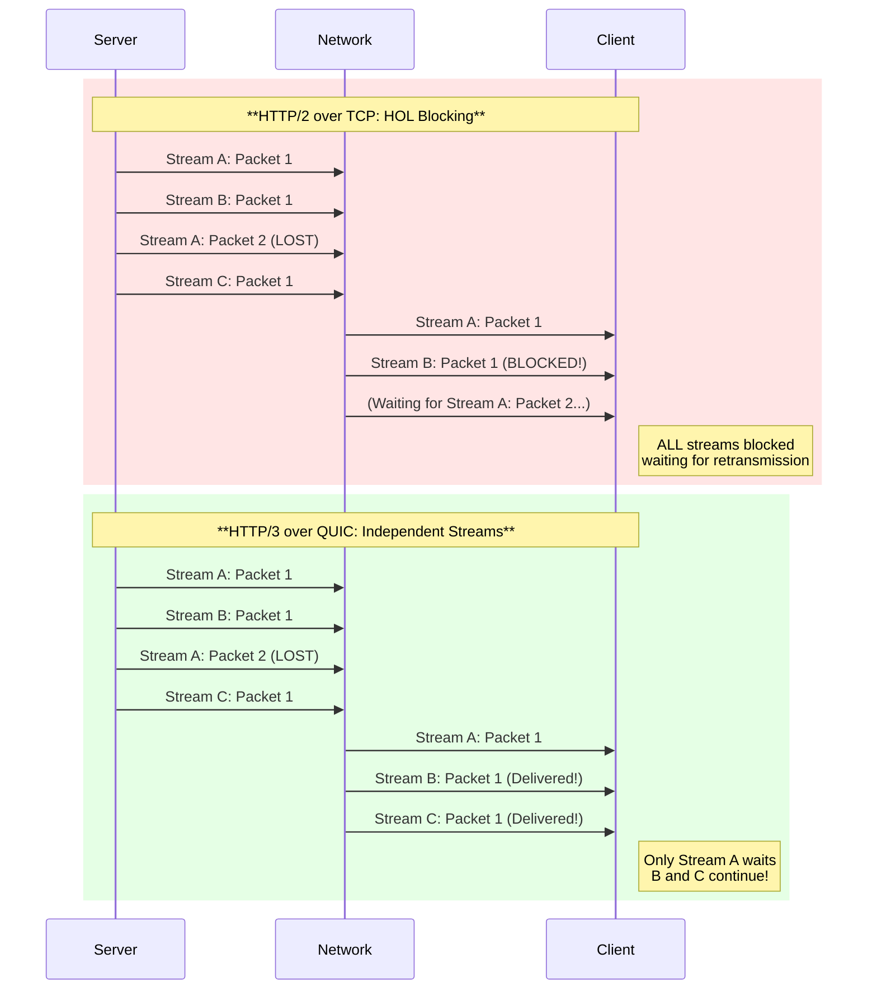
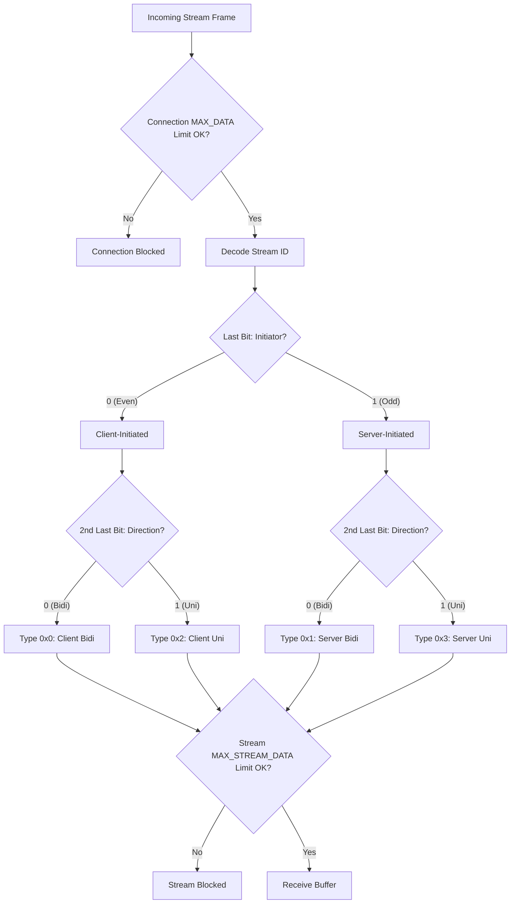
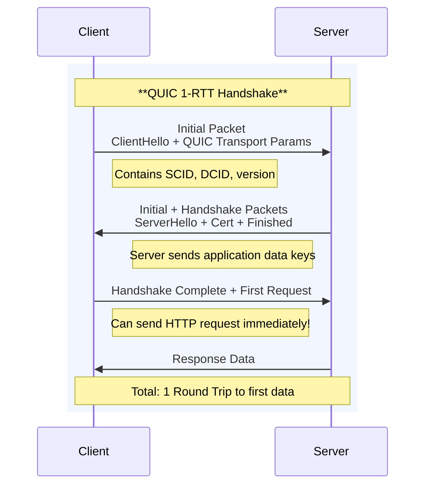
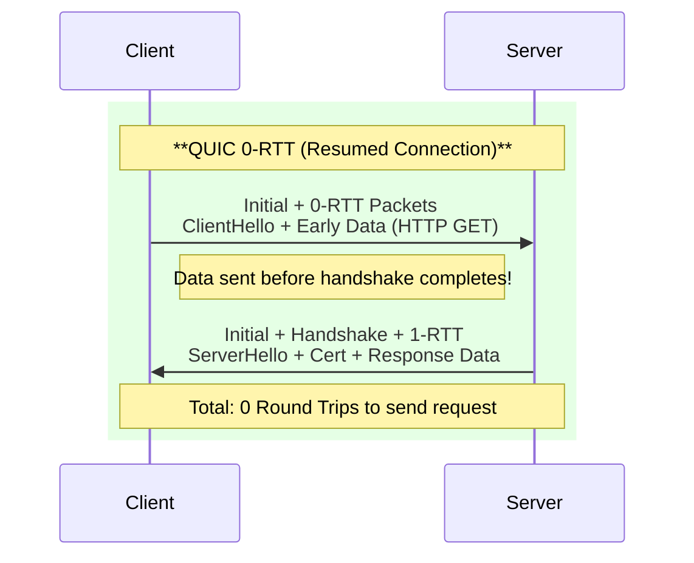

import Callout from "@components/ui/Callout.astro";
import { Tabs, TabPanel } from "@components/ui/tabs";
import TerminalCommand from "@components/ui/TerminalCommand.astro";
import FileContent from "@components/ui/FileContent.astro";
import TerminalOutput from "@components/ui/TerminalOutput.astro";
import Collapsible from "@components/ui/Collapsible.astro";
import Mermaid from "@components/ui/Mermaid.astro";
import Table from "@components/ui/Table.astro";
import Code from "@components/ui/Code.astro";
import TLDRSummary from "@components/ui/TLDRSummary.astro";


The web has relied on **TCP** for over four decades. But modern applications—with their demands for real-time interactivity, mobile connectivity, and instant page loads—have exposed TCP's fundamental limitations. Enter **QUIC** and **HTTP/3**: a complete reimagining of web transport that abandons TCP in favor of UDP to deliver a faster, more secure, and resilient internet.

In this comprehensive guide, we'll explore the history and architecture of QUIC, understand why it solves problems that TCP cannot, and walk through a complete production-ready Nginx configuration.

<TLDRSummary title="TL;DR — QUIC and HTTP/3 on Nginx">
  - **QUIC runs over UDP, not TCP**: HTTP/3 maps HTTP semantics onto QUIC, which is built on UDP and mandates TLS 1.3.
  - **Solves HOL blocking**: QUIC streams are independent at the transport layer, so a lost packet only stalls its own stream — not all multiplexed streams as in HTTP/2 over TCP.
  - **Faster handshakes and connection migration**: combined transport+crypto handshake (1-RTT, or 0-RTT on resume) plus Connection IDs that survive network changes (Wi-Fi → mobile).
  - **Nginx needs 1.25.0+ with `--with-http_v3_module`** and a QUIC-capable SSL library (OpenSSL 3.5.1+, BoringSSL, QuicTLS, or LibreSSL 3.6+).
  - **Core config**: add `listen 443 quic reuseport;`, enable `http3 on`, TLS 1.3, and the `Alt-Svc` header; `reuseport` must appear on exactly one listener per address:port.
  - **Open UDP/443 on the firewall** (server and cloud provider) or QUIC fails silently and clients fall back to HTTP/2; verify with `curl --http3`, DevTools, or `quic="h3"` in the access log.
</TLDRSummary>

---

## How I run this on my own infrastructure

jmrp.io serves HTTP/3 itself: both server blocks in production carry `listen 443 quic;` alongside the standard TCP listeners, so the site accepts QUIC and TLS-over-TCP connections side by side depending on what the client — and whatever sits between the client and the server — actually supports.

I didn't take the `Alt-Svc` header's word for it. Running `curl --http3` straight against the live site returns `HTTP/3 200`: a completed QUIC handshake, not an inference drawn from a response header that a misconfigured server could still send while quietly falling back to HTTP/2 underneath. That distinction matters — plenty of "HTTP/3 enabled" checklists stop at the header and never confirm the protocol actually negotiated. It's a small thing to verify, and it's also the only way to know a QUIC deployment is real instead of aspirational: the header costs nothing to add, but only a client-side handshake proves UDP/443 is actually open and negotiating end to end.

Serving HTTP/3 and having it used are different questions, and only the second one needs data. jmrp.io sits behind Cloudflare, which terminates the client connection, so the protocol a visitor actually negotiates shows up in Cloudflare's zone analytics rather than in my own access log. Over eight days — 19 to 27 August 2026, filtered to the `jmrp.io` host so the rest of the zone doesn't drown it out — **HTTP/3 carried 33.5% of the requests that negotiated either HTTP/2 or HTTP/3**: 11,208 out of 33,411.

That denominator needs two sentences of defense, because the honest version of this measurement is mostly about what has to be thrown away. I excluded HTTP/1.1 entirely, and the exclusion is not cosmetic: current browsers settle on h2 through ALPN against Cloudflare, so a request that claims a browser user-agent and still arrives over HTTP/1.1 is almost always a scraper with a forged one. There were plenty of those; one "desktop Chrome" bucket came in at 45.8% HTTP/1.1, which is not something desktop Chrome does. Dropping HTTP/1.1 removes the obvious forgeries, but it cannot promise the rest are clean: the Free plan exposes no bot score, and the browser dimension is itself derived from the user-agent string, so no independent field is left to filter on. That is also why there is no adoption-by-browser table here — I'm not publishing per-browser percentages built on a denominator I can't audit. The window is eight chained 24-hour queries, the longest range that plan will return, so it has eight two-minute seams in it: roughly 16 minutes missing in total.

One measured detail I did not expect. My origin does send the header this guide tells you to add — `add_header Alt-Svc 'h3=":443"; ma=86400' always;` sits in both TLS server blocks, and a request straight to the origin comes back carrying it. Through Cloudflare, that header is simply not there:

<TerminalOutput title="Alt-Svc at the origin vs. at the edge">
# On the origin host itself, bypassing the CDN entirely:
$ curl -sS -kD- -o /dev/null -H 'Host: jmrp.io' https://127.0.0.1/
alt-svc: h3=":443"; ma=86400
$ curl -sS -D- -o /dev/null --resolve jmrp.io:443:104.21.40.251 https://jmrp.io/
server: cloudflare
(no alt-svc header in the response)
$ dig +short HTTPS jmrp.io @1.1.1.1
1 . alpn="h3,h2" ipv4hint=104.21.40.251,172.67.158.146 ech=...
</TerminalOutput>

QUIC works anyway, as the handshake above already showed, because the advertisement lives somewhere else: the DNS HTTPS record for the domain carries `alpn="h3,h2"`, and browsers that resolve that record learn about HTTP/3 before they open a single connection. This is Cloudflare's behavior across its platform, not a peculiarity of my configuration — the edge terminates the connection and decides for itself what to advertise, and nothing in my Nginx config can change that. The practical lesson is narrow but worth having: if a CDN sits in front of the origin you configured for HTTP/3, the header you are testing for may not be the one your visitors ever see. Check the DNS record too.

---

## Why did QUIC replace TCP for HTTP/3?

The QUIC protocol has an interesting evolution from a proprietary Google experiment to a full IETF standard.

<Table title="QUIC Timeline">
  <thead>
    <tr>
      <th scope="col">Year</th>
      <th scope="col">Milestone</th>
      <th scope="col">Significance</th>
    </tr>
  </thead>
  <tbody>
    <tr>
      <td><strong>2012</strong></td>
      <td>Google begins QUIC development</td>
      <td>Internal project to reduce web latency</td>
    </tr>
    <tr>
      <td><strong>2013</strong></td>
      <td>First QUIC traffic in Chrome</td>
      <td>Early experiments with Google services</td>
    </tr>
    <tr>
      <td><strong>2014</strong></td>
      <td>Wide-scale gQUIC deployment</td>
      <td>Chrome desktop uses QUIC for Google properties</td>
    </tr>
    <tr>
      <td><strong>2016</strong></td>
      <td>IETF QUIC Working Group formed</td>
      <td>Formal standardization process begins</td>
    </tr>
    <tr>
      <td><strong>2017</strong></td>
      <td>IETF QUIC diverges from gQUIC</td>
      <td>TLS 1.3 integration, general-purpose transport</td>
    </tr>
    <tr>
      <td><strong>2021</strong></td>
      <td>RFC 9000 published</td>
      <td>QUIC Transport Protocol standardized</td>
    </tr>
    <tr>
      <td><strong>2022</strong></td>
      <td>RFC 9114 published</td>
      <td>HTTP/3 standardized</td>
    </tr>
  </tbody>
</Table>

<Callout type="info" title="Google QUIC vs IETF QUIC" icon="mdi:information">
  The original "gQUIC" (Google QUIC) used custom cryptography. The IETF version mandates **TLS 1.3** integration, making it a general-purpose transport protocol suitable for any application—not just HTTP.
</Callout>

### The QUIC RFC family

The complete QUIC specification spans multiple RFCs:

<Table title="QUIC Standards Documents">
  <thead>
    <tr>
      <th scope="col">RFC</th>
      <th scope="col">Title</th>
      <th scope="col">Description</th>
    </tr>
  </thead>
  <tbody>
    <tr>
      <td><strong><a href="https://datatracker.ietf.org/doc/html/rfc9000" target="_blank" rel="external noopener noreferrer" class="external-link" aria-label="RFC 9000 (opens in new tab)">RFC 9000</a></strong></td>
      <td>QUIC Transport</td>
      <td>Core protocol: packets, frames, streams, connection management</td>
    </tr>
    <tr>
      <td><strong><a href="https://datatracker.ietf.org/doc/html/rfc9001" target="_blank" rel="external noopener noreferrer" class="external-link" aria-label="RFC 9001 (opens in new tab)">RFC 9001</a></strong></td>
      <td>Using TLS to Secure QUIC</td>
      <td>TLS 1.3 integration, key derivation, encryption levels</td>
    </tr>
    <tr>
      <td><strong><a href="https://datatracker.ietf.org/doc/html/rfc9002" target="_blank" rel="external noopener noreferrer" class="external-link" aria-label="RFC 9002 (opens in new tab)">RFC 9002</a></strong></td>
      <td>Loss Detection and Congestion Control</td>
      <td>Packet loss recovery, RTT estimation, congestion algorithms</td>
    </tr>
    <tr>
      <td><strong><a href="https://datatracker.ietf.org/doc/html/rfc8999" target="_blank" rel="external noopener noreferrer" class="external-link" aria-label="RFC 8999 (opens in new tab)">RFC 8999</a></strong></td>
      <td>Version-Independent Properties</td>
      <td>Behaviors common across all QUIC versions</td>
    </tr>
    <tr>
      <td><strong><a href="https://datatracker.ietf.org/doc/html/rfc9114" target="_blank" rel="external noopener noreferrer" class="external-link" aria-label="RFC 9114 (opens in new tab)">RFC 9114</a></strong></td>
      <td>HTTP/3</td>
      <td>HTTP semantics over QUIC</td>
    </tr>
  </tbody>
</Table>

---

## Why QUIC? Understanding TCP's limitations

To appreciate QUIC, we must understand why TCP—the backbone of the internet since 1974—struggles with modern web demands.

### What is head-of-line (HOL) blocking?

This is the fundamental issue that QUIC solves. Imagine a highway with a single lane (TCP connection). If one car breaks down (packet loss), **everyone behind must stop and wait**, even if they're going to different destinations.

<Mermaid caption="Head-of-Line Blocking: TCP vs QUIC" maxWidth="750px">

</Mermaid>

<Callout type="keypoint" title="TCP HOL Blocking" icon="mdi:lightbulb">
  **The Key Insight**
  
  HTTP/2 multiplexes multiple streams over a **single TCP connection**. But TCP sees everything as one ordered byte stream—it doesn't know about HTTP streams. When packet 2 of Stream A is lost, TCP blocks **all** data until that packet is retransmitted.
  
  QUIC implements streams **at the transport layer**, so each stream has independent delivery. Lost packets only affect their own stream.
</Callout>

### The handshake latency problem

Establishing a secure TCP connection requires **multiple round trips**:

<Table title="Connection Establishment Comparison">
  <thead>
    <tr>
      <th scope="col">Protocol</th>
      <th scope="col">New Connection</th>
      <th scope="col">Resumed Connection</th>
      <th scope="col">Total RTTs</th>
    </tr>
  </thead>
  <tbody>
    <tr>
      <td><strong>TCP + TLS 1.2</strong></td>
      <td>TCP handshake + TLS handshake</td>
      <td>TCP + abbreviated TLS</td>
      <td>3 RTT → 2 RTT</td>
    </tr>
    <tr>
      <td><strong>TCP + TLS 1.3</strong></td>
      <td>TCP handshake + TLS 1.3</td>
      <td>TCP + TLS 0-RTT</td>
      <td>2 RTT → 1 RTT</td>
    </tr>
    <tr>
      <td><strong>QUIC</strong></td>
      <td>Combined handshake</td>
      <td>0-RTT early data</td>
      <td>1 RTT → 0 RTT</td>
    </tr>
  </tbody>
</Table>

### The connection migration problem

TCP connections are identified by a 4-tuple: `(source IP, source port, destination IP, destination port)`. When you switch from Wi-Fi to mobile data, your IP changes—and your TCP connection breaks.

<Callout type="success" title="QUIC Connection IDs" icon="mdi:cellphone-wireless">
  **QUIC's Solution: Connection IDs**
  
  QUIC uses cryptographically secure **Connection IDs** instead of IP addresses. When your phone switches networks, the Connection ID remains the same. Your downloads, video calls, and game sessions continue without interruption.
</Callout>

---

## QUIC architecture deep dive

### Transport over UDP

QUIC is built on **UDP** rather than creating a new IP protocol. This was a pragmatic choice:

- **No kernel changes required**: UDP is universally supported
- **Userspace implementation**: Faster iteration and deployment
- **Middlebox traversal**: UDP passes through most NATs and firewalls

<Callout type="warning" title="UDP vs TCP for QUIC" icon="mdi:alert">
  **QUIC is NOT "UDP with extra features"**
  
  QUIC implements its own reliability, ordering, and flow control. UDP is merely the delivery mechanism. Think of UDP as the "envelope" and QUIC as the complete postal system inside.
</Callout>

### Packet structure

QUIC uses two packet types:

<Table title="QUIC Packet Types">
  <thead>
    <tr>
      <th scope="col">Type</th>
      <th scope="col">Header</th>
      <th scope="col">Used For</th>
      <th scope="col">Encryption</th>
    </tr>
  </thead>
  <tbody>
    <tr>
      <td><strong>Long Header</strong></td>
      <td>Full connection info</td>
      <td>Initial, Handshake, 0-RTT, Retry</td>
      <td>Level-specific keys</td>
    </tr>
    <tr>
      <td><strong>Short Header</strong></td>
      <td>Minimal (post-handshake)</td>
      <td>Application data (1-RTT)</td>
      <td>Application keys</td>
    </tr>
  </tbody>
</Table>

### Streams and flow control

QUIC streams are lightweight, multiplexed channels within a connection:

<Mermaid caption="QUIC Stream Processing Logic" maxWidth="700px">

</Mermaid>

**Stream ID Decoding:**
The Stream ID is a 62-bit integer where the **least significant 2 bits** function as a type header:

- **Bit 0 (Initiator)**: `0` = Client, `1` = Server
- **Bit 1 (Direction)**: `0` = Bidirectional, `1` = Unidirectional

This creates 4 distinct address spaces:
- **...00**: Client Request/Response
- **...01**: Server Push (Deprecated)
- **...10**: Client Control Stream
- **...11**: Server Control Stream (QPACK)

**Dual-Layer Flow Control:**
For a packet to be processed, it must pass **two** independent checks:
1. **Connection-Level**: Is there `MAX_DATA` credit for the entire connection?
2. **Stream-Level**: Is there `MAX_STREAM_DATA` credit for this specific stream?
If *either* is exhausted, transmission blocks until a `WINDOW_UPDATE` frame arrives.

---

## The QUIC handshake: speed meets security

QUIC combines transport and cryptographic handshakes into a single exchange, dramatically reducing latency.

### 1-RTT handshake (first connection)

<Mermaid caption="QUIC 1-RTT Handshake" maxWidth="700px">

</Mermaid>

### 0-RTT handshake (resumed connection)

For clients that have connected before, QUIC allows sending encrypted data **in the very first packet**:

<Mermaid caption="QUIC 0-RTT Resumption" maxWidth="700px">

</Mermaid>

<Callout type="warning" title="Early Data Risks" icon="mdi:shield-alert">
  **0-RTT Security Considerations**
  
  Early data (0-RTT) is vulnerable to **replay attacks**. An attacker could capture and resend the initial packet. Mitigations:
  
  - Only use 0-RTT for **idempotent requests** (GET, HEAD)
  - Servers should reject non-idempotent 0-RTT data
  - Use `ssl_early_data on;` in Nginx with understanding of risks
  - The `Early-Data` header warns backends about replayed requests
</Callout>

---

## Security architecture

QUIC's security is not optional—it's built into the protocol from the ground up.

### Four encryption levels

<Table title="QUIC Encryption Levels">
  <thead>
    <tr>
      <th scope="col">Level</th>
      <th scope="col">Keys Derived From</th>
      <th scope="col">Used For</th>
      <th scope="col">Forward Secrecy</th>
    </tr>
  </thead>
  <tbody>
    <tr>
      <td><strong>Initial</strong></td>
      <td>Destination Connection ID</td>
      <td>First packets, version negotiation</td>
      <td data-status="error">No</td>
    </tr>
    <tr>
      <td><strong>0-RTT</strong></td>
      <td>Pre-shared key (PSK)</td>
      <td>Early application data</td>
      <td data-status="error">No</td>
    </tr>
    <tr>
      <td><strong>Handshake</strong></td>
      <td>TLS handshake secrets</td>
      <td>Handshake completion</td>
      <td data-status="warning">Partial</td>
    </tr>
    <tr>
      <td><strong>Application (1-RTT)</strong></td>
      <td>TLS traffic secrets</td>
      <td>All post-handshake data</td>
      <td data-status="success">Full (ECDHE)</td>
    </tr>
  </tbody>
</Table>

### Packet protection

Every QUIC packet (except Initial) is protected with **AEAD encryption**:

<Table title="QUIC Packet Layout & Protection">
  <thead>
    <tr>
      <th scope="col">Packet Section</th>
      <th scope="col">Component</th>
      <th scope="col">Protection Level</th>
    </tr>
  </thead>
  <tbody>
    <tr>
      <td rowspan="3"><strong>Header</strong></td>
      <td>Flags</td>
      <td data-status="warning">Protected (Header Protection)</td>
    </tr>
    <tr>
      <td>Connection ID</td>
      <td data-status="error">Cleartext (for routing)</td>
    </tr>
    <tr>
      <td>Packet Number</td>
      <td data-status="success">Encrypted (Header Protection)</td>
    </tr>
    <tr>
      <td><strong>Payload</strong></td>
      <td>Application Data</td>
      <td data-status="success">Fully Encrypted (AEAD)</td>
    </tr>
    <tr>
      <td><strong>Footer</strong></td>
      <td>Authentication Tag</td>
      <td data-status="success">16-byte Integrity MAC</td>
    </tr>
  </tbody>
</Table>

<Callout type="info" title="Encryption Mechanisms" icon="mdi:shield-lock">
  **Protection Details:**
  - **Key Derivation**: HKDF from TLS 1.3 traffic secrets.
  - **Nonce**: IV XORed with the packet number to prevent nonce reuse across the connection.
  - **Header Protection**: Separate encryption for flags and packet numbers to mask network traffic patterns.
</Callout>

### Connection ID and privacy

<Callout type="keypoint" icon="mdi:incognito">
  **Anti-Tracking Design**
  
  QUIC Connection IDs can be **rotated** during a connection. The server provides new Connection IDs via `NEW_CONNECTION_ID` frames. This prevents network observers from tracking connections across path changes.
  
  Combined with encrypted packet numbers and headers, QUIC significantly improves privacy compared to TCP.
</Callout>

### DoS protection mechanisms

QUIC includes several anti-amplification and anti-spoofing measures:

1. **Address Validation**: Servers send `RETRY` packets to validate client addresses
2. **Anti-Amplification**: Servers limit data sent before address validation (3x client data)
3. **Stateless Reset**: Clean connection termination without state

---

## HTTP/3: HTTP over QUIC

HTTP/3 is the mapping of HTTP semantics onto QUIC transport. It replaces HTTP/2's binary framing with QUIC streams.

<Table title="HTTP/2 vs HTTP/3">
  <thead>
    <tr>
      <th scope="col">Feature</th>
      <th scope="col">HTTP/2</th>
      <th scope="col">HTTP/3</th>
    </tr>
  </thead>
  <tbody>
    <tr>
      <td><strong>Transport</strong></td>
      <td>TCP + TLS</td>
      <td>QUIC (UDP + TLS 1.3)</td>
    </tr>
    <tr>
      <td><strong>Multiplexing</strong></td>
      <td>Stream frames in single connection</td>
      <td>Native QUIC streams</td>
    </tr>
    <tr>
      <td><strong>HOL Blocking</strong></td>
      <td>Yes (at TCP layer)</td>
      <td>No (independent streams)</td>
    </tr>
    <tr>
      <td><strong>Header Compression</strong></td>
      <td>HPACK</td>
      <td>QPACK (handles out-of-order)</td>
    </tr>
    <tr>
      <td><strong>Server Push</strong></td>
      <td>Supported</td>
      <td>Deprecated (rarely used)</td>
    </tr>
    <tr>
      <td><strong>Connection Migration</strong></td>
      <td data-status="error">No</td>
      <td data-status="success">Yes</td>
    </tr>
  </tbody>
</Table>

### Who uses HTTP/3 today?

As of 2026, HTTP/3 adoption is significant and growing:

<Table title="HTTP/3 Adoption Statistics">
  <thead>
    <tr>
      <th scope="col">Metric</th>
      <th scope="col">Value</th>
      <th scope="col">Source</th>
    </tr>
  </thead>
  <tbody>
    <tr>
      <td><strong>Websites using HTTP/3</strong></td>
      <td>36.6%</td>
      <td><a href="https://w3techs.com/technologies/details/ce-http3" target="_blank" rel="external noopener noreferrer" class="external-link" aria-label="W3Techs (2026) (opens in new tab)">W3Techs (2026)</a></td>
    </tr>
    <tr>
      <td><strong>Chrome QUIC usage (subsequent)</strong></td>
      <td>40%</td>
      <td><a href="https://blog.apnic.net/2023/10/09/measuring-http-3-real-world-performance/" target="_blank" rel="external noopener noreferrer" class="external-link" aria-label="APNIC Labs (opens in new tab)">APNIC Labs</a></td>
    </tr>
    <tr>
      <td><strong>Page load improvement (global)</strong></td>
      <td>12.4%</td>
      <td><a href="https://blog.cloudflare.com/http-3-vs-http-2/" target="_blank" rel="external noopener noreferrer" class="external-link" aria-label="Cloudflare Benchmarks (opens in new tab)">Cloudflare Benchmarks</a></td>
    </tr>
    <tr>
      <td><strong>High-latency region improvement</strong></td>
      <td>13.8%</td>
      <td><a href="https://www.debugbear.com/blog/http3-vs-http2-performance" target="_blank" rel="external noopener noreferrer" class="external-link" aria-label="DebugBear (opens in new tab)">DebugBear</a></td>
    </tr>
  </tbody>
</Table>

---

## Nginx configuration: complete guide

Now let's implement HTTP/3 on Nginx. This section covers everything from prerequisites to production deployment.

### Prerequisites

<Callout type="warning" title="HTTP/3 Requirements" icon="mdi:alert-circle">
  **Version Requirements**
  
  - **Nginx**: Version 1.25.0+ (HTTP/3 support added mid-2023)
  - **SSL Library**: One of the following with QUIC support:
    - OpenSSL 3.5.1+ (recommended for 0-RTT)
    - BoringSSL
    - QuicTLS (OpenSSL fork, archived in 2025)
    - LibreSSL 3.6+
</Callout>

Verify your Nginx installation:

<TerminalCommand ariaLabel="Command to verify Nginx version and modules">
```bash
nginx -V 2>&1 | grep -E 'version|http_v3_module|OpenSSL|BoringSSL'
```
</TerminalCommand>

<TerminalOutput title="Nginx version output">
nginx version: nginx/1.28.0
built with OpenSSL 3.5.0 8 Apr 2025 (running with OpenSSL 3.5.4 30 Sep 2025)
configure arguments: ... --with-http_v3_module ...
</TerminalOutput>

<Collapsible summary="How to install Nginx with HTTP/3 support">

<Callout type="warning" title="The Ondřej Surý Nginx repository is gone" icon="mdi:alert-circle">
  Guides written before 2026 — including earlier revisions of this one — send you
  to `https://packages.sury.org/nginx/README.txt` on Debian and to
  `ppa:ondrej/nginx-mainline` on Ubuntu. Both channels have been retired: as of
  27 August 2026 the `/nginx/` path on that host returns **404** while its PHP and
  Apache repositories still answer, and both Launchpad PPAs are gone. Use the
  official Nginx repository instead.
</Callout>

<Tabs>
  <TabPanel label="Official Nginx repository (Recommended)">
    The packages nginx.org publishes for Debian and Ubuntu are built
    `--with-http_v3_module` against OpenSSL 3.5, so HTTP/3 needs no custom build.
    The same commands work on both distributions — `/etc/os-release` supplies the
    vendor and the codename.

    ```bash
    sudo apt install curl gnupg2 ca-certificates
    DISTRO=$(. /etc/os-release && echo "$ID")
    CODENAME=$(. /etc/os-release && echo "$VERSION_CODENAME")

    # Nginx signing key in its own keyring
    sudo mkdir -p /etc/apt/keyrings
    curl -fsSL https://nginx.org/keys/nginx_signing.key -o /tmp/nginx.key

    # Check the fingerprints against the list nginx publishes at
    # https://nginx.org/en/pgp_keys.html BEFORE trusting the key. The bundle
    # carries several keys and they rotate, so compare the output rather than
    # a number copied from a blog post.
    gpg --show-keys --with-fingerprint /tmp/nginx.key

    sudo gpg --dearmor -o /etc/apt/keyrings/nginx.gpg /tmp/nginx.key

    # Mainline repository, restricted to that keyring
    echo "deb [signed-by=/etc/apt/keyrings/nginx.gpg] https://nginx.org/packages/mainline/$DISTRO $CODENAME nginx" \
        | sudo tee /etc/apt/sources.list.d/nginx.list

    sudo apt update && sudo apt install nginx

    # Confirm the build you just installed
    nginx -V 2>&1 | tr ' ' '\n' | grep -E 'http_v3|OpenSSL'
    ```
  </TabPanel>
  <TabPanel label="Compile from source">
    Only needed if you want a module the packages don't carry. Nginx builds HTTP/3
    against any SSL library exposing a QUIC API: OpenSSL 3.5+, BoringSSL or
    LibreSSL 3.6+. On a current distribution the system OpenSSL is enough — the
    official Debian 13 package is itself built against OpenSSL 3.5.6.

    ```bash
    openssl version   # 3.5.0 or newer

    wget https://nginx.org/download/nginx-1.31.4.tar.gz
    tar xzf nginx-1.31.4.tar.gz
    cd nginx-1.31.4

    ./configure \
        --with-http_v3_module \
        --with-http_ssl_module \
        --with-http_v2_module

    make -j"$(nproc)"
    sudo make install
    ```
  </TabPanel>
</Tabs>

</Collapsible>

### Basic configuration

Here's the minimal configuration to enable HTTP/3:

<FileContent filename="/etc/nginx/sites-available/example.com.conf">
```nginx
server {
    server_name example.com;
    root /var/www/example.com;

    # ==========================================
    # LISTENERS: TCP (HTTP/1.1, HTTP/2) + UDP (HTTP/3)
    # ==========================================
    
    # Standard HTTPS over TCP
    listen 443 ssl;
    listen [::]:443 ssl;
    http2 on;
    
    # QUIC/HTTP/3 over UDP
    # 'reuseport' is critical for multi-worker performance
    listen 443 quic reuseport;
    listen [::]:443 quic reuseport;

    # ==========================================
    # SSL/TLS CONFIGURATION
    # ==========================================
    
    # TLS 1.3 is REQUIRED for QUIC
    ssl_protocols TLSv1.3 TLSv1.2;
    ssl_prefer_server_ciphers off;
    
    ssl_certificate /etc/letsencrypt/live/example.com/fullchain.pem;
    ssl_certificate_key /etc/letsencrypt/live/example.com/privkey.pem;

    # ==========================================
    # HTTP/3 CONFIGURATION
    # ==========================================
    
    http3 on;
    
    # Advertise HTTP/3 support to browsers
    # ma=86400 means "cache this info for 24 hours"
    add_header Alt-Svc 'h3=":443"; ma=86400' always;

    location / {
        try_files $uri $uri/ =404;
    }
}
```
</FileContent>

<Callout type="info" title="Why reuseport is critical" icon="mdi:information">
  **Why `reuseport`?**
  
  UDP is connectionless—without `reuseport`, all QUIC packets would be handled by a single Nginx worker, creating a bottleneck. The `reuseport` kernel feature distributes incoming packets across all workers.
  
  **⚠️ Important:** The `reuseport` flag must appear on **exactly one** `listen` directive per address:port globally. If you have multiple server blocks listening on port 443 QUIC, only the first one should have `reuseport`. Using it multiple times will cause Nginx to fail to start with "address already in use" errors.
</Callout>

### Complete production configuration

Here's a comprehensive configuration with all optimizations. The configuration is split into two files: the main `nginx.conf` for global settings and a site-specific configuration file.

<FileContent filename="/etc/nginx/nginx.conf" collapsible ariaLabel="Nginx main configuration">
```nginx
# Main context
worker_processes auto;
error_log /var/log/nginx/error.log warn;

events {
    worker_connections 4096;
    use epoll;
    multi_accept on;
}

http {
    # ==========================================
    # HTTP/3 GLOBAL SETTINGS
    # ==========================================
    # Explicit for clarity (http3 defaults to 'on' in nginx 1.25.0+)
    http3 on;
    
    # Custom log format to track HTTP/3 connections
    log_format quic '$remote_addr - $remote_user [$time_local] '
                    '"$request" $status $body_bytes_sent '
                    '"$http_referer" "$http_user_agent" '
                    'proto="$server_protocol" quic="$http3"';

    # MIME types
    include /etc/nginx/mime.types;
    default_type application/octet-stream;

    # Performance optimizations
    sendfile on;
    tcp_nopush on;
    tcp_nodelay on;
    
    # Gzip compression
    gzip on;
    gzip_vary on;
    gzip_min_length 1024;
    gzip_types text/plain text/css application/json application/javascript 
               text/xml application/xml application/xml+rss text/javascript;

    # Include site configurations
    include /etc/nginx/sites-enabled/*;
}
```
</FileContent>

The site-specific configuration includes all the directives for QUIC, TLS, headers, and logging:

<FileContent filename="/etc/nginx/sites-available/example.com.conf" collapsible ariaLabel="Nginx site-specific configuration">
```nginx
server {
    server_name example.com www.example.com;
    root /var/www/example.com;

    # ==========================================
    # DUAL-STACK LISTENERS
    # ==========================================
    
    # TCP: HTTP/1.1 and HTTP/2 fallback
    listen 443 ssl;
    listen [::]:443 ssl;
    http2 on;
    
    # UDP: QUIC/HTTP/3
    listen 443 quic reuseport;
    listen [::]:443 quic reuseport;

    # ==========================================
    # TLS CONFIGURATION (Required for QUIC)
    # ==========================================
    
    ssl_protocols TLSv1.3 TLSv1.2;
    # TLS 1.3 ciphersuites (handled separately for better OpenSSL compatibility)
    ssl_conf_command Ciphersuites TLS_AES_128_GCM_SHA256:TLS_AES_256_GCM_SHA384:TLS_CHACHA20_POLY1305_SHA256;
    # TLS 1.2 ciphers only (ECDHE for forward secrecy)
    ssl_ciphers ECDHE-ECDSA-AES128-GCM-SHA256:ECDHE-RSA-AES128-GCM-SHA256:ECDHE-ECDSA-AES256-GCM-SHA384:ECDHE-RSA-AES256-GCM-SHA384:ECDHE-ECDSA-CHACHA20-POLY1305:ECDHE-RSA-CHACHA20-POLY1305;
    ssl_prefer_server_ciphers off;
    ssl_ecdh_curve X25519:P-256:P-384;
    
    ssl_certificate /etc/letsencrypt/live/example.com/fullchain.pem;
    ssl_certificate_key /etc/letsencrypt/live/example.com/privkey.pem;
    
    # Session resumption for performance
    ssl_session_cache shared:SSL:10m;
    ssl_session_timeout 1d;
    ssl_session_tickets off;  # Better security
    
    # OCSP Stapling
    ssl_stapling on;
    ssl_stapling_verify on;

    # ==========================================
    # QUIC-SPECIFIC SETTINGS
    # ==========================================
    
    # Enable 0-RTT early data (with security considerations)
    ssl_early_data on;
    
    # DoS protection: require address validation
    quic_retry on;
    
    # Performance: Generic Segmentation Offload (Linux 4.18+)
    quic_gso on;

    # ==========================================
    # HEADERS
    # ==========================================
    
    # Advertise HTTP/3 availability
    add_header Alt-Svc 'h3=":443"; ma=86400' always;
    
    # Warn backends about 0-RTT replay risk
    add_header Early-Data $ssl_early_data always;
    
    # Security headers
    add_header Strict-Transport-Security "max-age=63072000; includeSubDomains; preload" always;
    add_header X-Content-Type-Options "nosniff" always;
    add_header X-Frame-Options "DENY" always;

    # ==========================================
    # LOGGING
    # ==========================================
    
    access_log /var/log/nginx/example.com.access.log quic;
    error_log /var/log/nginx/example.com.error.log;

    # ==========================================
    # LOCATIONS
    # ==========================================
    
    location / {
        try_files $uri $uri/ =404;
    }
    
    # Static assets with long cache
    location ~* \.(js|css|png|jpg|jpeg|gif|ico|svg|woff|woff2)$ {
        expires 1y;
        add_header Cache-Control "public, immutable" always;
        add_header Alt-Svc 'h3=":443"; ma=86400' always;
        
        # Security headers (inherited from server block may not apply with add_header in location)
        add_header Strict-Transport-Security "max-age=63072000; includeSubDomains; preload" always;
        add_header X-Content-Type-Options "nosniff" always;
        add_header X-Frame-Options "DENY" always;
    }
}

# HTTP to HTTPS redirect
server {
    listen 80;
    listen [::]:80;
    server_name example.com www.example.com;
    return 301 https://$host$request_uri;
}
```
</FileContent>

### All QUIC directives reference

<Table title="Nginx QUIC Directives">
  <thead>
    <tr>
      <th scope="col">Directive</th>
      <th scope="col">Default</th>
      <th scope="col">Context</th>
      <th scope="col">Description</th>
    </tr>
  </thead>
  <tbody>
    <tr>
      <td><a href="https://nginx.org/en/docs/http/ngx_http_v3_module.html#http3" target="_blank" rel="external noopener noreferrer" aria-label="http3 (opens in new tab)"><code>http3</code></a></td>
      <td><code>on</code></td>
      <td>http, server</td>
      <td>Enables HTTP/3 protocol negotiation</td>
    </tr>
    <tr>
      <td><a href="https://nginx.org/en/docs/http/ngx_http_v3_module.html#http3_hq" target="_blank" rel="external noopener noreferrer" aria-label="http3_hq (opens in new tab)"><code>http3_hq</code></a></td>
      <td><code>off</code></td>
      <td>http, server</td>
      <td>Enables HTTP/0.9 over QUIC (testing only)</td>
    </tr>
    <tr>
      <td><a href="https://nginx.org/en/docs/http/ngx_http_v3_module.html#http3_max_concurrent_streams" target="_blank" rel="external noopener noreferrer" aria-label="http3_max_concurrent_streams (opens in new tab)"><code>http3_max_concurrent_streams</code></a></td>
      <td><code>128</code></td>
      <td>http, server</td>
      <td>Maximum concurrent streams per connection</td>
    </tr>
    <tr>
      <td><a href="https://nginx.org/en/docs/http/ngx_http_v3_module.html#http3_stream_buffer_size" target="_blank" rel="external noopener noreferrer" aria-label="http3_stream_buffer_size (opens in new tab)"><code>http3_stream_buffer_size</code></a></td>
      <td><code>64k</code></td>
      <td>http, server</td>
      <td>Buffer size for reading/writing streams</td>
    </tr>
    <tr>
      <td><a href="https://nginx.org/en/docs/http/ngx_http_v3_module.html#quic_active_connection_id_limit" target="_blank" rel="external noopener noreferrer" aria-label="quic_active_connection_id_limit (opens in new tab)"><code>quic_active_connection_id_limit</code></a></td>
      <td><code>2</code></td>
      <td>http, server</td>
      <td>Max connection IDs stored per connection</td>
    </tr>
    <tr>
      <td><a href="https://nginx.org/en/docs/http/ngx_http_v3_module.html#quic_bpf" target="_blank" rel="external noopener noreferrer" aria-label="quic_bpf (opens in new tab)"><code>quic_bpf</code></a></td>
      <td><code>off</code></td>
      <td>main</td>
      <td>eBPF routing for connection migration (Linux 5.7+)</td>
    </tr>
    <tr>
      <td><a href="https://nginx.org/en/docs/http/ngx_http_v3_module.html#quic_gso" target="_blank" rel="external noopener noreferrer" aria-label="quic_gso (opens in new tab)"><code>quic_gso</code></a></td>
      <td><code>off</code></td>
      <td>http, server</td>
      <td>Generic Segmentation Offload (Linux 4.18+)</td>
    </tr>
    <tr>
      <td><a href="https://nginx.org/en/docs/http/ngx_http_v3_module.html#quic_host_key" target="_blank" rel="external noopener noreferrer" aria-label="quic_host_key (opens in new tab)"><code>quic_host_key</code></a></td>
      <td>-</td>
      <td>http, server</td>
      <td>File with secret key for address validation tokens</td>
    </tr>
    <tr>
      <td><a href="https://nginx.org/en/docs/http/ngx_http_v3_module.html#quic_retry" target="_blank" rel="external noopener noreferrer" aria-label="quic_retry (opens in new tab)"><code>quic_retry</code></a></td>
      <td><code>off</code></td>
      <td>http, server</td>
      <td>Enables address validation via Retry packets</td>
    </tr>
  </tbody>
</Table>

---

## Firewall configuration

**Critical**: HTTP/3 uses **UDP** on port 443, not TCP. If your firewall only allows TCP/443, QUIC will fail silently and clients will fall back to HTTP/2.

<Tabs>
  <TabPanel label="UFW (Ubuntu/Debian)">
    ```bash
    # Check current rules
    sudo ufw status
    
    # Allow UDP on port 443
    sudo ufw allow 443/udp comment 'QUIC/HTTP3'
    
    # Verify
    sudo ufw status verbose
    ```
  </TabPanel>
  <TabPanel label="iptables">
    ```bash
    # Allow incoming UDP 443
    sudo iptables -A INPUT -p udp --dport 443 -j ACCEPT
    
    # Save rules (Debian/Ubuntu)
    sudo iptables-save | sudo tee /etc/iptables/rules.v4
    
    # For IPv6
    sudo ip6tables -A INPUT -p udp --dport 443 -j ACCEPT
    sudo ip6tables-save | sudo tee /etc/iptables/rules.v6
    ```
  </TabPanel>
  <TabPanel label="firewalld (RHEL/CentOS)">
    ```bash
    # Add UDP 443 to default zone
    sudo firewall-cmd --permanent --add-port=443/udp
    
    # Reload
    sudo firewall-cmd --reload
    
    # Verify
    sudo firewall-cmd --list-ports
    ```
  </TabPanel>
  <TabPanel label="AWS Security Groups">
    Add an inbound rule:
    - **Type**: Custom UDP
    - **Port Range**: 443
    - **Source**: 0.0.0.0/0 (or your CIDR)
    - **Description**: QUIC/HTTP3
  </TabPanel>
</Tabs>

### Kernel tuning for high traffic

For high-traffic servers, increase UDP buffer sizes:

<FileContent filename="/etc/sysctl.d/99-quic.conf">
```bash
# Increase UDP buffer sizes for QUIC
net.core.rmem_max = 16777216
net.core.wmem_max = 16777216
net.core.rmem_default = 1048576
net.core.wmem_default = 1048576

# UDP memory limits
net.ipv4.udp_mem = 65536 131072 262144
net.ipv4.udp_rmem_min = 8192
net.ipv4.udp_wmem_min = 8192

# Allow more local ports for connections
net.ipv4.ip_local_port_range = 1024 65535
```
</FileContent>

Apply the settings:

<TerminalCommand ariaLabel="Command to apply kernel UDP settings">
```bash
sudo sysctl --system
```
</TerminalCommand>

---

## Verification and testing

After configuration, verify HTTP/3 is working correctly.

### Method 1: curl

Modern curl (7.66+ with HTTP/3 support) can test directly:

<TerminalCommand ariaLabel="Curl commands to test HTTP/3 connection">
```bash
# Test HTTP/3 specifically
curl -I --http3-only https://jmrp.io

# Or allow fallback
curl -I --http3 https://jmrp.io
```
</TerminalCommand>

<TerminalOutput title="Curl HTTP/3 response output">
HTTP/3 200 
server: jmrp.io
date: Wed, 14 Jan 2026 20:02:32 GMT
content-type: text/html; charset=utf-8
alt-svc: h3=":443"; ma=86400
strict-transport-security: max-age=63072000; includeSubDomains; preload
</TerminalOutput>

<Callout type="tip" title="Installing curl with HTTP/3" icon="mdi:lightbulb">
  **Installing curl with HTTP/3**
  
  On macOS: `brew install curl`
  On Ubuntu: Build from source with `--with-ngtcp2` or use the snap package
</Callout>

### Method 2: browser DevTools

1. Open Chrome or Firefox
2. Navigate to your site
3. Open DevTools (F12) → **Network** tab
4. Right-click column headers → Enable **Protocol** column
5. Reload the page
6. Look for `h3` in the Protocol column

<Callout type="info" title="First Visit Behavior" icon="mdi:information">
  **First Visit Behavior**
  
  On the first visit, browsers use HTTP/2 to discover the `Alt-Svc` header. On subsequent requests (or after reload), they switch to HTTP/3. This is normal behavior.
</Callout>

### Method 3: online tools

<Table title="HTTP/3 Testing Tools">
  <thead>
    <tr>
      <th scope="col">Tool</th>
      <th scope="col">URL</th>
      <th scope="col">Features</th>
    </tr>
  </thead>
  <tbody>
    <tr>
      <td><strong>HTTP/3 Check</strong></td>
      <td><a href="https://http3check.net/" target="_blank" rel="external noopener noreferrer" class="external-link" aria-label="http3check.net (opens in new tab)">http3check.net</a></td>
      <td>Quick pass/fail test with details</td>
    </tr>
    <tr>
      <td><strong>Cloudflare HTTP/3 Test</strong></td>
      <td><a href="https://cloudflare-quic.com/" target="_blank" rel="external noopener noreferrer" class="external-link" aria-label="cloudflare-quic.com (opens in new tab)">cloudflare-quic.com</a></td>
      <td>Live connection test</td>
    </tr>
    <tr>
      <td><strong>Qualys SSL Labs</strong></td>
      <td><a href="https://www.ssllabs.com/ssltest/" target="_blank" rel="external noopener noreferrer" class="external-link" aria-label="ssllabs.com (opens in new tab)">ssllabs.com</a></td>
      <td>Comprehensive TLS analysis</td>
    </tr>
  </tbody>
</Table>

### Method 4: check Nginx logs

Use the custom log format to verify HTTP/3 traffic:

<TerminalCommand ariaLabel="Grep command to check Nginx access logs">
```bash
# Check for HTTP/3 connections
grep 'quic="h3"' /var/log/nginx/access.log | tail -5
```
</TerminalCommand>

<TerminalOutput title="Log output showing HTTP/3 traffic">
192.168.1.100 - - [14/Jan/2026:20:02:32 +0000] "GET / HTTP/3" 200 15234 "-" "Mozilla/5.0..." proto="HTTP/3" quic="h3"
</TerminalOutput>

---

## Troubleshooting guide

<Table title="Common HTTP/3 Issues and Solutions">
  <thead>
    <tr>
      <th scope="col">Symptom</th>
      <th scope="col">Likely Cause</th>
      <th scope="col">Solution</th>
    </tr>
  </thead>
  <tbody>
    <tr>
      <td><strong>Protocol stays HTTP/2</strong></td>
      <td>Firewall blocking UDP/443</td>
      <td>Open UDP port 443 on server and cloud provider</td>
    </tr>
    <tr>
      <td><strong>Protocol stays HTTP/2</strong></td>
      <td>Missing Alt-Svc header</td>
      <td>Add <code>add_header Alt-Svc 'h3=":443"; ma=86400' always;</code></td>
    </tr>
    <tr>
      <td><strong>Connection errors</strong></td>
      <td>TLS 1.3 not enabled</td>
      <td>Enable TLSv1.3 for QUIC (required); TLSv1.2 may remain enabled for HTTP/2 fallback</td>
    </tr>
    <tr>
      <td><strong>Browsers refuse to use QUIC</strong></td>
      <td>Self-signed certificate</td>
      <td>Use a valid certificate (Let's Encrypt)</td>
    </tr>
    <tr>
      <td><strong>Nginx fails to start</strong></td>
      <td>Missing <code>--with-http_v3_module</code></td>
      <td>Rebuild Nginx with HTTP/3 module</td>
    </tr>
    <tr>
      <td><strong>High CPU usage</strong></td>
      <td>GSO not supported by kernel</td>
      <td>Disable <code>quic_gso</code> or upgrade kernel</td>
    </tr>
    <tr>
      <td><strong>0-RTT not working</strong></td>
      <td>OpenSSL version too old</td>
      <td>Use OpenSSL 3.5.1+, QuicTLS, or BoringSSL</td>
    </tr>
  </tbody>
</Table>

### Debug mode

Enable debug logging temporarily:

<Code lang="nginx" aria-label="Enable Nginx debug logging">
```
error_log /var/log/nginx/error.log debug;
```
</Code>

Check for QUIC-specific messages:

<TerminalCommand>
```bash
grep -i quic /var/log/nginx/error.log | tail -20
```
</TerminalCommand>

<TerminalOutput title="Nginx debug log (simulated failure)">
2026/01/14 10:42:15 [debug] 12345#0: *1 quic handle packet: fd:16, addr:192.0.2.1:54321
2026/01/14 10:42:15 [debug] 12345#0: *1 quic packet rx dcid len:8 87654321
2026/01/14 10:42:15 [debug] 12345#0: *1 quic packet rx scid len:8 12345678
2026/01/14 10:42:15 [info] 12345#0: *1 quic SSL_do_handshake() failed: SSL_ERROR_SSL: error:14094416:SSL routines:ssl3_read_bytes:sslv3 alert certificate unknown
2026/01/14 10:42:15 [debug] 12345#0: *1 quic close connection: 0:
</TerminalOutput>

---

## Production deployment checklist

Before deploying HTTP/3 to production, verify:

<Table title="HTTP/3 Production Checklist">
  <thead>
    <tr>
      <th scope="col">Category</th>
      <th scope="col">Item</th>
      <th scope="col">Verification</th>
    </tr>
  </thead>
  <tbody>
    <tr>
      <td><strong>Build</strong></td>
      <td>Nginx compiled with <code>--with-http_v3_module</code></td>
      <td><code>nginx -V 2>&1 | grep http_v3</code></td>
    </tr>
    <tr>
      <td><strong>Build</strong></td>
      <td>Compatible SSL library (QuicTLS/BoringSSL/OpenSSL 3.5.1+)</td>
      <td><code>nginx -V 2>&1 | grep -i ssl</code></td>
    </tr>
    <tr>
      <td><strong>Network</strong></td>
      <td>UDP/443 open on server firewall</td>
      <td><code>sudo ss -ulnp | grep 443</code></td>
    </tr>
    <tr>
      <td><strong>Network</strong></td>
      <td>UDP/443 open on cloud provider (AWS/GCP/Azure)</td>
      <td>Check security group/firewall rules</td>
    </tr>
    <tr>
      <td><strong>Config</strong></td>
      <td><code>listen 443 quic reuseport;</code> present</td>
      <td><code>nginx -T | grep quic</code></td>
    </tr>
    <tr>
      <td><strong>Config</strong></td>
      <td>TLS 1.3 enabled</td>
      <td><code>nginx -T | grep ssl_protocols</code></td>
    </tr>
    <tr>
      <td><strong>Config</strong></td>
      <td>Alt-Svc header configured</td>
      <td><code>curl -I https://example.com | grep alt-svc</code></td>
    </tr>
    <tr>
      <td><strong>Certificate</strong></td>
      <td>Valid (not self-signed) certificate</td>
      <td><code>openssl s_client -connect site:443</code></td>
    </tr>
    <tr>
      <td><strong>Test</strong></td>
      <td>HTTP/3 confirmed working</td>
      <td><code>curl --http3 https://example.com</code></td>
    </tr>
    <tr>
      <td><strong>Monitoring</strong></td>
      <td>Log format includes <code>$http3</code></td>
      <td>Check log format configuration</td>
    </tr>
  </tbody>
</Table>

---

## When should you not use QUIC?

While QUIC offers significant benefits, there are scenarios where TCP may be preferable:

<Callout type="warning" title="Protocol Fallback Considerations" icon="mdi:alert">
  **Consider Sticking with TCP/HTTP/2 When:**
  
  - **Corporate firewalls block UDP**: Many enterprise networks block or throttle UDP traffic
  - **Server CPU is constrained**: QUIC has higher CPU overhead from encryption
  - **Your users are on stable networks**: Low packet loss environments see less benefit
  - **Legacy proxy infrastructure**: Load balancers may not support QUIC passthrough
  - **Debugging is critical**: TCP has more mature monitoring tools
</Callout>
