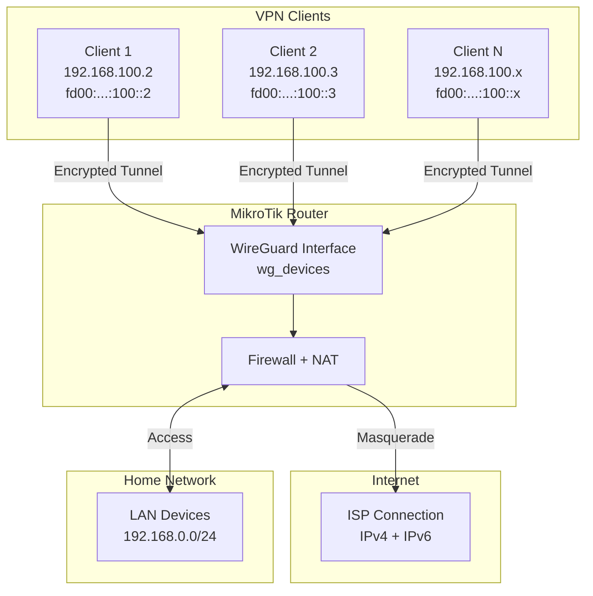
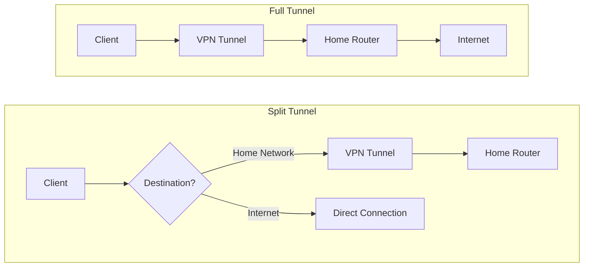

import Callout from "@components/ui/Callout.astro";
import FileContent from "@components/ui/FileContent.astro";
import Mermaid from "@components/ui/Mermaid.astro";
import TerminalCommand from "@components/ui/TerminalCommand.astro";
import {
  TerminalSession,
  TerminalSessionCommand,
  TerminalSessionOutput,
} from "@components/ui/terminal-session";
import Table from "@components/ui/Table.astro";
import Code from "@components/ui/Code.astro";
import CheckList from "@components/ui/CheckList.astro";
import TLDRSummary from "@components/ui/TLDRSummary.astro";
import Prerequisite from "@components/ui/Prerequisite.astro";
import { Tabs, TabPanel } from "@components/ui/tabs";
import Collapsible from "@components/ui/Collapsible.astro";

[WireGuard](https://www.wireguard.com/) has revolutionized VPN technology with its simplicity, speed, and modern cryptography. Unlike traditional VPN protocols like [OpenVPN](https://openvpn.net/) or [IPSec](https://datatracker.ietf.org/doc/html/rfc7296), WireGuard uses a minimal codebase (~4,000 lines vs 100,000+) and state-of-the-art cryptographic primitives as described in the [WireGuard whitepaper](https://www.wireguard.com/papers/wireguard.pdf), resulting in faster connections and lower latency.

This guide demonstrates how to configure a **production-ready WireGuard VPN** on MikroTik RouterOS with **dual-stack IPv4/IPv6 support**. The result? You can connect from any network—even those without IPv6—and enjoy full IPv6 connectivity through your home router.

<TLDRSummary title="TL;DR — dual-stack WireGuard on RouterOS">
  - **WireGuard is built into RouterOS 7**, so a dual-stack VPN server needs no container and no extra package — the interface listens on a high non-standard UDP port (**53537** here, not the default 51820, to sidestep automated scans) and each peer gets one IPv4 and one IPv6 address.
  - **IPv6 goes through ULA plus NAT66, not a delegated prefix.** Clients receive `fd00::/8` addresses that the router translates to your ISP's global prefix, so the tunnel survives the prefix changing underneath it.
  - **Clamp TCP MSS or large downloads stall.** With the interface at MTU 1500 the computed ceilings are 1460 for IPv4 (1500 − 20 IP − 20 TCP) and 1440 for IPv6 (1500 − 40 − 20); `new-mss=1420` sits below both, which is why one value works on either stack.
  - **Each device gets its own key pair and address pair.** Revoking one client is deleting one peer; nothing else has to be reissued.
  - **Split tunnel is an `AllowedIPs` decision on the client**, not a server setting: list only the home prefixes to route home traffic, or `0.0.0.0/0, ::/0` to route everything.
  - **Tested on RouterOS 7.x on an RB5009**, and applicable to any MikroTik router whose RouterOS build includes WireGuard.
</TLDRSummary>

<Callout type="important" title="Values You Must Customize">
Throughout this guide, values that **you must replace** with your own are clearly marked. Look for:

- **`wg_devices`** — WireGuard interface name (customize if you prefer a different name)
- **`53537`** — WireGuard listen port (choose any unused UDP port)
- **`192.168.100.0/24`** — VPN IPv4 subnet (change if it conflicts with your network)
- **`fd00:1111:2222:100::/64`** — VPN IPv6 ULA prefix (generate your own at [unique-local-ipv6.com](https://www.unique-local-ipv6.com/))
- **`192.168.0.0/24`** — Your home LAN subnet (adjust to match your network)
- **Client keys** — Always generate unique keypairs per device
- **`your-domain.com`** — Your public IP or DDNS hostname
</Callout>

---

## Does RouterOS WireGuard support IPv6?

Yes. WireGuard ships in RouterOS 7 as a built-in interface type and carries IPv6
natively: you assign an IPv6 address to the WireGuard interface and give each peer
its own IPv6 `allowed-address`. The catch is addressing — this guide uses a ULA
prefix plus NAT66 instead of a delegated prefix, so the tunnel survives your ISP
renumbering underneath it.

---

## How I run this on my own infrastructure

The configuration above isn't a lab exercise — it's the WireGuard setup I run on my own RB5009UG+S+, using the same interface layout as this guide, at the standard 1500 MTU. The RouterOS version each guide was last checked against is stamped at the top of its own page, which is why the same router shows a different version here and in [the honeypot guide](/blog/006-implementing-mikrotik-honeypot/).

Honestly, there isn't an incident to report. I'd like to hand you a war story about MSS clamping gone wrong or a handshake that silently failed, but that's not what happened here: this tunnel has been running for a while without a single usage problem, with good throughput and full dual-stack connectivity — IPv4 and IPv6 both work end to end, every time. If your deployment follows the steps above, that's the boring, reliable outcome you should expect too.

---

## Why WireGuard on MikroTik?

<Table title="VPN Protocol Comparison">
  <thead>
    <tr>
      <th scope="col">Feature</th>
      <th scope="col">WireGuard</th>
      <th scope="col">OpenVPN</th>
      <th scope="col">IPSec/IKEv2</th>
    </tr>
  </thead>
  <tbody>
    <tr>
      <td>Code complexity</td>
      <td>~4,000 lines</td>
      <td>~100,000 lines</td>
      <td>~400,000 lines</td>
    </tr>
    <tr>
      <td>Connection time</td>
      <td>100ms</td>
      <td>3-10 seconds</td>
      <td>1-3 seconds</td>
    </tr>
    <tr>
      <td>CPU overhead</td>
      <td>Very low</td>
      <td>High (userspace)</td>
      <td>Medium</td>
    </tr>
    <tr>
      <td>Cryptography</td>
      <td>ChaCha20, Curve25519</td>
      <td>Configurable (varies)</td>
      <td>AES, RSA/ECDH</td>
    </tr>
    <tr>
      <td>Roaming support</td>
      <td>Seamless</td>
      <td>Reconnection needed</td>
      <td>Limited (MOBIKE)</td>
    </tr>
  </tbody>
</Table>

<Callout type="tip" title="Mobile-Friendly Design">
WireGuard excels on mobile devices. When you switch from Wi-Fi to cellular or change networks, WireGuard reconnects instantly without dropping your session. This "roaming" capability makes it ideal for smartphones and laptops.
</Callout>

---

## How do the IPv4 and IPv6 halves fit together?

Our configuration creates a dual-stack VPN where connected clients receive both IPv4 and IPv6 addresses. Traffic from clients is NAT'd (masqueraded) to access the internet through your home connection. For detailed [MikroTik WireGuard documentation](https://help.mikrotik.com/docs/spaces/ROS/pages/69664792/WireGuard), refer to the official wiki.

<Mermaid caption="WireGuard Dual-Stack Architecture" ariaLabel="Diagram showing WireGuard VPN topology with IPv4 and IPv6 networks flowing through MikroTik router to the internet" maxWidth="600px">

</Mermaid>

### Network addressing scheme

<Table title="IP Address Assignment">
  <thead>
    <tr>
      <th scope="col">Component</th>
      <th scope="col">IPv4 Address</th>
      <th scope="col">IPv6 Address</th>
    </tr>
  </thead>
  <tbody>
    <tr>
      <td>WireGuard Interface (Router)</td>
      <td>`192.168.100.1/24`</td>
      <td>`fd00:1111:2222:100::1/64`</td>
    </tr>
    <tr>
      <td>VPN Client Range</td>
      <td>`192.168.100.2-254`</td>
      <td>`fd00:1111:2222:100::2-ffff`</td>
    </tr>
    <tr>
      <td>Home LAN</td>
      <td>`192.168.0.0/24`</td>
      <td>ISP-assigned prefix</td>
    </tr>
  </tbody>
</Table>

<Callout type="info" title="Why ULA for IPv6?">
We use [Unique Local Addresses (ULA)](https://datatracker.ietf.org/doc/html/rfc4193) in the `fd00::/8` range for the VPN. These addresses are private (like RFC1918 for IPv4) and guaranteed not to conflict with public IPv6 addresses. The router then NAT66 translates them to your ISP-assigned global IPv6 prefix.
</Callout>

---

## Prerequisites

<Prerequisite title="Before You Start">
  - **MikroTik RouterOS 7.x** or later (WireGuard is built-in since RouterOS 7)
  - **Public IP address** (static) or **Dynamic DNS** (DDNS) configured on your router
  - **IPv6 connectivity** from your ISP (optional but recommended for dual-stack)
  - **UDP port forwarding** capability if your MikroTik is behind another router/NAT
  - **Administrative access** to your MikroTik router (via WinBox, WebFig, or SSH)
  - **Interface lists** already created: `WAN` (for internet-facing interfaces) and `LAN` (for local network interfaces). These are part of the default MikroTik configuration
</Prerequisite>

---

## Step 1: create the WireGuard interface

First, we create the WireGuard interface on the MikroTik router. The router will generate a keypair automatically.

<Code lang="routeros" title="Create WireGuard Interface">
```routeros
/interface wireguard add \
    name=wg_devices \
    mtu=1500 \
    listen-port=53537 \
    comment="VPN for Mobile Devices"
```
</Code>

<Callout type="tip" title="Port Selection">
Using a non-standard port like `53537` instead of the default `51820` helps avoid automated scans targeting common VPN ports. Some networks also block standard VPN ports, so a high random port may have better connectivity.
</Callout>

### Retrieve the server's public key

After creating the interface, retrieve the public key to configure clients:

<TerminalSession title="Retrieve Server Public Key">
  <TerminalSessionCommand>
    /interface wireguard print
  </TerminalSessionCommand>
  <TerminalSessionOutput title="Output">

```
Flags: X - disabled; R - running
 0  R name="wg_devices" mtu=1500 listen-port=53537
      private-key="[REDACTED]"
      public-key="YourServerPublicKeyHere123456789ABCDEFGHIJ="
```

  </TerminalSessionOutput>
</TerminalSession>

Save the `public-key` value—you'll need it when configuring client devices.

---

## Step 2: assign IP addresses to the interface

The WireGuard interface needs both IPv4 and IPv6 addresses to serve as the gateway for VPN clients.

<Code lang="routeros" title="Assign IP Addresses">
```routeros
# IPv4 address for WireGuard interface
/ip address add \
    address=192.168.100.1/24 \
    interface=wg_devices \
    network=192.168.100.0 \
    comment="VPN Devices Network"

# IPv6 ULA address for WireGuard interface
/ipv6 address add \
    address=fd00:1111:2222:100::1/64 \
    interface=wg_devices \
    advertise=no \
    comment="VPN Devices IPv6 ULA"
```
</Code>

<Callout type="warning" title="IPv6 Advertise Setting">
Set `advertise=no` for the WireGuard IPv6 address. We don't want Router Advertisements on the VPN tunnel—clients receive their static addresses through the WireGuard configuration, not SLAAC.
</Callout>

---

## Step 3: create IPv6 pool (optional)

If you want to manage IPv6 address allocation centrally, create a pool:

<Code lang="routeros" title="Create IPv6 Pool">
```routeros
/ipv6 pool add \
    name=wg_devices_pool_global \
    prefix=fd00:1111:2222:100::/64 \
    prefix-length=64 \
    comment="WireGuard Devices Global IPv6 Pool"
```
</Code>

---

## Step 4: add the interface to interface lists

MikroTik uses interface lists for firewall rules. Adding WireGuard to the appropriate lists ensures proper traffic handling.

<Code lang="routeros" title="Add to Interface Lists">
```routeros
# Add to VPN list for VPN-specific rules
/interface list member add \
    interface=wg_devices \
    list=VPN \
    comment="VPN Devices"

# Add to LAN list to allow access to local resources
/interface list member add \
    interface=wg_devices \
    list=LAN \
    comment="VPN Devices - LAN Access"
```
</Code>

---

## Step 5: configure firewall rules

The firewall configuration is critical for security and connectivity. We need rules for:

1. **Accepting WireGuard traffic** on the listening port
2. **Allowing VPN clients** to access the internet
3. **Allowing VPN clients** to access local networks
4. **NAT/Masquerade** for outbound traffic

<Callout type="warning" title="Firewall Rule Placement">
MikroTik processes firewall rules **top to bottom**. The rules below must be placed **before** any `drop` rules in their respective chains. Use the `place-before` parameter or reorder rules in WinBox after adding them.

If you use the default MikroTik firewall, add these rules near the top of each chain, after the `established,related` accept rules.
</Callout>

### Input chain: accept WireGuard connections

<Code lang="routeros" title="Firewall Input Rules">
```routeros
# Allow WireGuard UDP port (IPv4)
/ip firewall filter add \
    chain=input \
    action=accept \
    protocol=udp \
    dst-port=53537 \
    comment="WireGuard - Accept incoming connections"

# Allow WireGuard UDP port (IPv6)
/ipv6 firewall filter add \
    chain=input \
    action=accept \
    protocol=udp \
    port=53537 \
    comment="Allow WireGuard"
```
</Code>

### Forward chain: allow VPN traffic

<Code lang="routeros" title="Firewall Forward Rules - IPv4">
```routeros
# FastTrack for established WireGuard connections (performance)
/ip firewall filter add \
    chain=forward \
    action=fasttrack-connection \
    connection-state=established,related \
    src-address-list=WireGuard \
    comment="FastTrack for WireGuard Networks"

# Allow VPN clients to internet
/ip firewall filter add \
    chain=forward \
    action=accept \
    src-address=192.168.100.0/24 \
    out-interface-list=WAN \
    comment="Allow WireGuard Devices to Internet"

# Allow return traffic from internet to VPN
/ip firewall filter add \
    chain=forward \
    action=accept \
    connection-state=established,related \
    dst-address=192.168.100.0/24 \
    in-interface-list=WAN \
    comment="Allow Internet to WireGuard Devices (replies)"

# Allow VPN clients to Home LAN
/ip firewall filter add \
    chain=forward \
    action=accept \
    src-address=192.168.100.0/24 \
    dst-address=192.168.0.0/24 \
    comment="Allow WireGuard Devices to Home LAN"
```
</Code>

<Code lang="routeros" title="Firewall Forward Rules - IPv6">
```routeros
# Allow VPN clients all outbound IPv6 traffic
/ipv6 firewall filter add \
    chain=forward \
    action=accept \
    in-interface=wg_devices \
    comment="WireGuard Devices: Allow all outbound"

# Allow return IPv6 traffic to VPN clients
/ipv6 firewall filter add \
    chain=forward \
    action=accept \
    connection-state=established,related \
    out-interface=wg_devices \
    comment="WireGuard Devices: Allow replies"
```
</Code>

### Create address list for WireGuard networks

<Code lang="routeros" title="Address Lists">
```routeros
/ip firewall address-list add \
    list=WireGuard \
    address=192.168.100.0/24 \
    comment="WireGuard Devices Network"
```
</Code>

---

## Step 6: configure NAT/Masquerade

For VPN clients to access the internet, their private addresses must be translated (NAT) to your public IP.

<Code lang="routeros" title="NAT Configuration">
```routeros
# IPv4 Masquerade for WireGuard
/ip firewall nat add \
    chain=srcnat \
    action=masquerade \
    src-address=192.168.100.0/24 \
    out-interface-list=WAN \
    comment="WireGuard Devices - Internet Access"

# IPv6 NAT66 for WireGuard (ULA to Global)
/ipv6 firewall nat add \
    chain=srcnat \
    action=masquerade \
    src-address=fd00:1111:2222:100::/64 \
    out-interface-list=WAN \
    comment="WireGuard Devices - IPv6 Internet Access"
```
</Code>

<Callout type="info" title="NAT66 Explained">
Traditional IPv6 philosophy discourages NAT, preferring end-to-end connectivity. However, NAT66 (masquerade for IPv6) is practical for VPNs using ULA addresses. Your VPN clients use private ULA addresses, which are translated to your [ISP-assigned global IPv6 prefix](/blog/008-mikrotik-pppoe-dualstack-digi/) when accessing the internet.
</Callout>

---

## Step 7: configure MSS clamping

TCP Maximum Segment Size (MSS) clamping prevents fragmentation issues with VPN tunnels. The WireGuard overhead reduces the effective MTU, so we must adjust TCP MSS accordingly.

<Code lang="routeros" title="MSS Clamping">
```routeros
/ip firewall mangle add \
    chain=forward \
    action=change-mss \
    protocol=tcp \
    tcp-flags=syn \
    tcp-mss=1349-65535 \
    new-mss=1420 \
    in-interface=wg_devices \
    comment="WireGuard MSS clamping - Devices"
```
</Code>

<Callout type="tip" title="MTU and MSS Calculation">
WireGuard adds overhead to each packet (40 bytes IPv6/20 bytes IPv4 + 8 bytes UDP + 32 bytes WG header). We set `mtu=1500` on the WireGuard interface to allow full-sized inner packets:

- **WireGuard interface MTU**: 1500 (inner packets; outer packets with WG overhead are fragmented transparently by the transport layer)
- **TCP MSS for IPv4**: 1500 - 20 (IP) - 20 (TCP) = **1460**
- **TCP MSS for IPv6**: 1500 - 40 (IPv6) - 20 (TCP) = **1440**

We use `new-mss=1420` as a conservative value below both limits. If you experience connection issues (pages loading partially, stalled downloads), try reducing to `1380` or setting the WireGuard MTU to `1420` (the RouterOS default, which avoids outer fragmentation by accounting for the WireGuard overhead).
</Callout>

---

## Step 8: configure RAW table for performance

Skip flood protection for WireGuard traffic to ensure smooth connectivity:

<Code lang="routeros" title="RAW Table Rules">
```routeros
# IPv4: Skip flood protection for WireGuard
/ip firewall raw add \
    chain=prerouting \
    action=accept \
    protocol=udp \
    dst-port=53537 \
    comment="WireGuard - Skip flood protection"

# IPv6: Skip flood protection for WireGuard
/ipv6 firewall raw add \
    chain=prerouting \
    action=accept \
    protocol=udp \
    dst-port=53537 \
    comment="WireGuard - Skip flood protection"
```
</Code>

---

## Step 9: add WireGuard peers (clients)

Now we add client devices. Each client needs:

- **Unique IP addresses**: A dedicated IPv4 and IPv6 address within the WireGuard subnet
- **Keypair**: Private and public keys for authentication
- **Preshared key**: Optional but recommended additional encryption layer

### Create a peer

Choose how to generate the cryptographic keys. The **recommended** approach lets RouterOS generate everything automatically, but you can also pre-generate keys on the client device.

<Tabs>
  <TabPanel label="RouterOS (recommended)">

Since RouterOS 7.x, the router can generate all cryptographic keys automatically. This is the **simplest approach** — the router creates the private key, computes the public key, and generates the preshared key in a single command.

#### Create the peer with auto-generated keys

<Code lang="routeros" title="Add Peer with Auto-Generated Keys">
```routeros
/interface wireguard peers add \
    interface=wg_devices \
    name=wg_client1 \
    private-key=auto \
    preshared-key=auto \
    allowed-address=192.168.100.2/32,fd00:1111:2222:100::2/128 \
    persistent-keepalive=25s \
    comment="Client 1 - Mobile"
```
</Code>

<Callout type="tip" title="What auto Does">
`private-key=auto` generates a private key and automatically computes the corresponding public key. `preshared-key=auto` generates a random preshared key. Both values are stored on the peer and can be retrieved later.
</Callout>

#### Set client configuration properties (optional)

These properties define the client-side configuration and enable the **QR code** feature in WinBox/WebFig:

<Code lang="routeros" title="Set Client Configuration Properties">
```routeros
/interface wireguard peers set wg_client1 \
    client-address=192.168.100.2/32,fd00:1111:2222:100::2/128 \
    client-dns=192.168.0.1,fd00:1111:2222:100::1 \
    client-endpoint=your-domain.com:53537 \
    client-allowed-address=0.0.0.0/0,::/0 \
    client-keepalive=25
```
</Code>

<Callout type="tip" title="QR Code in WinBox / WebFig">
With these client properties set, open the peer in **WinBox** or **WebFig** and use `show-client-config` to display the complete client configuration and a QR code. This is the **easiest way** to configure iOS/Android clients — just scan the code from the WireGuard app.
</Callout>

#### Retrieve keys for manual client configuration

If you need to configure the client manually instead of scanning the QR code, retrieve the generated keys from the router:

<Code lang="routeros" title="Retrieve Generated Keys">
```routeros
# Client's private key → goes into client's [Interface] section
:put [/interface wireguard peers get [find name=wg_client1] private-key]

# Preshared key → goes into client's [Peer] section
:put [/interface wireguard peers get [find name=wg_client1] preshared-key]

# Server's public key → goes into client's [Peer] section
:put [/interface wireguard get [find name=wg_devices] public-key]
```
</Code>

Use these values to fill in the client configuration file in [Step 10](#step-10-client-configuration).

  </TabPanel>
  <TabPanel label="Linux / macOS">

Generate keys on the client device first, then add the peer on the router using the client's **public** key.

#### Generate keys on the client

<TerminalCommand title="Generate Client Keys">
```bash
# Generate private key
wg genkey > privatekey

# Generate public key from private key
cat privatekey | wg pubkey > publickey

# Generate preshared key (optional but recommended)
wg genpsk > presharedkey

# Display keys
cat privatekey publickey presharedkey
```
</TerminalCommand>

#### Add peer on MikroTik (Linux / macOS)

Use the client's **public** key (not the private key) and the preshared key:

<Code lang="routeros" title="Add WireGuard Peer (Linux/macOS)">
```routeros
/interface wireguard peers add \
    interface=wg_devices \
    name=wg_client1 \
    public-key="<CLIENT_PUBLIC_KEY>" \
    preshared-key="<PRESHARED_KEY>" \
    allowed-address=192.168.100.2/32,fd00:1111:2222:100::2/128 \
    persistent-keepalive=25s \
    comment="Client 1 - Mobile"
```
</Code>

<Callout type="important" title="Keep the Private Key Secure">
The private key stays on the client device and goes into the client's `[Interface]` section. Only the **public** key is shared with the router. **Never** transfer the private key over an insecure channel.
</Callout>

  </TabPanel>
  <TabPanel label="Windows">

The WireGuard Windows app generates keys automatically when creating a new tunnel.

1. Download and install [WireGuard for Windows](https://www.wireguard.com/install/)
2. Open the app and click **Add Tunnel** → **Add empty tunnel**
3. The app generates a keypair — copy the **Public Key** shown at the top
4. Generate a preshared key from the command line:

<TerminalCommand title="Generate Preshared Key">
```powershell
# If WireGuard is installed, wg.exe is available in PATH
wg genpsk
```
</TerminalCommand>

#### Add peer on MikroTik (Windows)

<Code lang="routeros" title="Add WireGuard Peer (Windows)">
```routeros
/interface wireguard peers add \
    interface=wg_devices \
    name=wg_client1 \
    public-key="<CLIENT_PUBLIC_KEY>" \
    preshared-key="<PRESHARED_KEY>" \
    allowed-address=192.168.100.2/32,fd00:1111:2222:100::2/128 \
    persistent-keepalive=25s \
    comment="Client 1 - Mobile"
```
</Code>

  </TabPanel>
</Tabs>

<Table title="Peer Configuration Parameters">
  <thead>
    <tr>
      <th scope="col">Parameter</th>
      <th scope="col">Value</th>
      <th scope="col">Purpose</th>
    </tr>
  </thead>
  <tbody>
    <tr>
      <td>`private-key`</td>
      <td>`auto` / none</td>
      <td>Auto-generates keypair on the router (recommended method)</td>
    </tr>
    <tr>
      <td>`public-key`</td>
      <td>Client's public key</td>
      <td>Identifies and authenticates the client</td>
    </tr>
    <tr>
      <td>`preshared-key`</td>
      <td>`auto` / shared secret</td>
      <td>Additional symmetric encryption layer (post-quantum security)</td>
    </tr>
    <tr>
      <td>`allowed-address`</td>
      <td>Client IP(s)</td>
      <td>IPs the client can use; also acts as routing table</td>
    </tr>
    <tr>
      <td>`persistent-keepalive`</td>
      <td>25 seconds</td>
      <td>Maintains NAT mappings, enables incoming connections</td>
    </tr>
  </tbody>
</Table>

<Callout type="warning" title="Persistent Keepalive">
The `persistent-keepalive=25s` setting is crucial for mobile devices behind NAT. It sends a keepalive packet every 25 seconds, maintaining the NAT translation and allowing the server to send data to the client even if the client hasn't sent anything recently.
</Callout>

### Example: multiple peers

Each peer must have a **unique keypair** and **unique IP addresses**. Never reuse keys between devices.

<Code lang="routeros" title="Multiple Peer Configuration (RouterOS auto-keys)">
```routeros
# Client 1 - Mobile Device (e.g., iPhone)
/interface wireguard peers add \
    interface=wg_devices \
    name=wg_phone \
    private-key=auto \
    preshared-key=auto \
    allowed-address=192.168.100.2/32,fd00:1111:2222:100::2/128 \
    persistent-keepalive=25s \
    comment="Phone - Mobile VPN"

# Client 2 - Laptop (e.g., MacBook)
/interface wireguard peers add \
    interface=wg_devices \
    name=wg_laptop \
    private-key=auto \
    preshared-key=auto \
    allowed-address=192.168.100.3/32,fd00:1111:2222:100::3/128 \
    persistent-keepalive=25s \
    comment="Laptop - Mobile VPN"

# Client 3 - Remote Site (Site-to-Site VPN)
/interface wireguard peers add \
    interface=wg_devices \
    name=wg_remote_site \
    private-key=auto \
    preshared-key=auto \
    allowed-address=192.168.100.10/32,fd00:1111:2222:100::a/128 \
    persistent-keepalive=25s \
    comment="Remote Site - Site-to-Site"
```
</Code>

<Callout type="warning" title="Security: Never Share Private Keys">
Whether keys are auto-generated on the router or pre-generated on the client, the private key must **only** exist on the client device. When using RouterOS auto-generation, retrieve the private key once for client configuration and avoid logging or storing it elsewhere. **Never** commit real keys to documentation or version control.
</Callout>

---

## Step 10: client configuration

Now configure the client device. If you used the **RouterOS auto-keys** method and set the client properties in Step 9, you can simply scan the **QR code** from WinBox/WebFig — no manual configuration needed.

For manual setup, the configuration file format is the same across all platforms, but the setup method varies.

<Callout type="important" title="Replace These Values">
In every client configuration below, you **must** replace:
- **`<CLIENT_PRIVATE_KEY>`** — the client's private key (auto-generated on router or generated locally in Step 9)
- **`<SERVER_PUBLIC_KEY>`** — the server's public key (from Step 1, or retrieved with `:put` in Step 9)
- **`<PRESHARED_KEY>`** — the preshared key (must match server peer config)
- **`your-domain.com:53537`** — your router's public IP/domain and WireGuard port
- **IP addresses** — must match the `allowed-address` configured on the server peer
</Callout>

<Tabs>
  <TabPanel label="iOS / Android">

Download the **WireGuard** app from the [App Store](https://apps.apple.com/app/wireguard/id1441195209) or [Google Play](https://play.google.com/store/apps/details?id=com.wireguard.android). You can either:
- **Import a .conf file** or scan a **QR code**
- **Create manually** in the app

<FileContent
  filename="wg_home.conf (iOS/Android)"
  language="ini"
  collapsible={false}
  title="Mobile Client Configuration"
>
```ini
[Interface]
PrivateKey = <CLIENT_PRIVATE_KEY>
Address = 192.168.100.2/32, fd00:1111:2222:100::2/128
DNS = 192.168.0.1, fd00:1111:2222:100::1

[Peer]
PublicKey = <SERVER_PUBLIC_KEY>
PresharedKey = <PRESHARED_KEY>
Endpoint = your-domain.com:53537
AllowedIPs = 0.0.0.0/0, ::/0
PersistentKeepalive = 25
```
</FileContent>

<Callout type="tip" title="QR Code from RouterOS">
If you set the client properties in Step 9 (`client-address`, `client-dns`, `client-endpoint`, etc.), open the peer in **WinBox** or **WebFig** and use `show-client-config` to display a QR code. Scan it with the WireGuard app — no manual configuration needed.
</Callout>

  </TabPanel>
  <TabPanel label="macOS / Linux">

Install WireGuard:

<TerminalCommand title="Install WireGuard">
```bash
# macOS (Homebrew)
brew install wireguard-tools

# Ubuntu/Debian
sudo apt install wireguard

# Fedora
sudo dnf install wireguard-tools
```
</TerminalCommand>

Create the configuration file:

<FileContent
  filename="/etc/wireguard/wg_home.conf"
  language="ini"
  collapsible={false}
  title="Linux/macOS Client Configuration"
>
```ini
[Interface]
PrivateKey = <CLIENT_PRIVATE_KEY>
Address = 192.168.100.2/32, fd00:1111:2222:100::2/128
DNS = 192.168.0.1, fd00:1111:2222:100::1

[Peer]
PublicKey = <SERVER_PUBLIC_KEY>
PresharedKey = <PRESHARED_KEY>
Endpoint = your-domain.com:53537
AllowedIPs = 0.0.0.0/0, ::/0
PersistentKeepalive = 25
```
</FileContent>

Activate the tunnel:

<TerminalCommand title="Activate WireGuard">
```bash
# Start the tunnel
sudo wg-quick up wg_home

# Check status
sudo wg show

# Stop the tunnel
sudo wg-quick down wg_home

# Enable on boot (Linux only)
sudo systemctl enable wg-quick@wg_home
```
</TerminalCommand>

  </TabPanel>
  <TabPanel label="Windows">

1. Download and install [WireGuard for Windows](https://www.wireguard.com/install/)
2. Open the app and click **Add Tunnel** → **Import tunnel(s) from file** (if you have a `.conf` file) or **Add empty tunnel** to paste the configuration
3. If creating from scratch, replace the configuration with:

<FileContent
  filename="wg_home.conf (Windows)"
  language="ini"
  collapsible={false}
  title="Windows Client Configuration"
>
```ini
[Interface]
PrivateKey = <CLIENT_PRIVATE_KEY>
Address = 192.168.100.2/32, fd00:1111:2222:100::2/128
DNS = 192.168.0.1, fd00:1111:2222:100::1

[Peer]
PublicKey = <SERVER_PUBLIC_KEY>
PresharedKey = <PRESHARED_KEY>
Endpoint = your-domain.com:53537
AllowedIPs = 0.0.0.0/0, ::/0
PersistentKeepalive = 25
```
</FileContent>

5. Click **Save** then **Activate**

  </TabPanel>
</Tabs>

### Configuration options explained

<Table title="Client Configuration Parameters">
  <thead>
    <tr>
      <th scope="col">Parameter</th>
      <th scope="col">Description</th>
    </tr>
  </thead>
  <tbody>
    <tr>
      <td>`Address`</td>
      <td>The IP addresses assigned to this client (both IPv4 and IPv6)</td>
    </tr>
    <tr>
      <td>`DNS`</td>
      <td>DNS servers to use. Can be your router or any DNS server accessible via VPN</td>
    </tr>
    <tr>
      <td>`Endpoint`</td>
      <td>Your router's public IP or domain name with the WireGuard port</td>
    </tr>
    <tr>
      <td>`AllowedIPs`</td>
      <td>`0.0.0.0/0, ::/0` routes ALL traffic through VPN. Use specific subnets for split-tunnel</td>
    </tr>
  </tbody>
</Table>

### Split tunnel vs full tunnel

<Mermaid caption="Traffic Routing Modes" ariaLabel="Comparison diagram showing split tunnel versus full tunnel VPN routing" maxWidth="900px">

</Mermaid>

**Full tunnel** — all traffic goes through VPN:
- Hides your location from all websites
- Higher latency for general browsing
- Full IPv6 access through home connection

<Code lang="ini" title="Full Tunnel Example">
```ini
# Route ALL traffic through VPN
AllowedIPs = 0.0.0.0/0, ::/0
```
</Code>

**Split tunnel** — only traffic to specified networks uses VPN:
- Better performance for general internet use
- Home network access without routing everything

<Code lang="ini" title="Split Tunnel Example">
```ini
# Only route home network traffic through VPN
AllowedIPs = 192.168.0.0/24, 192.168.100.0/24, fd00:1111:2222::/48
```
</Code>

---

## Step 11: verify the connection

After configuring both sides, test the connection.

### On the client

<TerminalSession title="Check WireGuard Status (Client)">
  <TerminalSessionCommand>

```bash
# macOS/Linux
sudo wg show

# Or use the WireGuard app on iOS/Android
```

  </TerminalSessionCommand>
  <TerminalSessionOutput title="Successful Connection">

```
interface: wg_home
  public key: ClientPublicKeyHere123456789ABCDEFGHIJKLMNO=
  private key: (hidden)
  listening port: 51820

peer: YourServerPublicKeyHere123456789ABCDEFGHIJ=
  preshared key: (hidden)
  endpoint: 203.0.113.50:53537
  allowed ips: 0.0.0.0/0, ::/0
  latest handshake: 5 seconds ago
  transfer: 1.24 MiB received, 456.78 KiB sent
```

  </TerminalSessionOutput>
</TerminalSession>

### On the MikroTik router

<TerminalSession title="Check Peer Status (Router)">
  <TerminalSessionCommand>
    /interface wireguard peers print
  </TerminalSessionCommand>
  <TerminalSessionOutput title="Connected Peer">

```
Flags: X - disabled
 0   name="wg_client1" interface=wg_devices
     public-key="<CLIENT_PUBLIC_KEY>"
     preshared-key="(present)" allowed-address=192.168.100.2/32,fd00:1111:2222:100::2/128
     current-endpoint-address=198.51.100.75 current-endpoint-port=51820
     last-handshake=5s rx=1302528 tx=467352
```

  </TerminalSessionOutput>
</TerminalSession>

<Callout type="tip" title="Responder Mode (RouterOS 7.15+)">
If your MikroTik acts as a VPN server (clients connect to it, not the other way around), consider setting `responder=yes` on each peer. This prevents the router from repeatedly trying to initiate connections to clients that don't have a fixed endpoint:

```routeros
/interface wireguard peers set [find name=wg_client1] responder=yes
```
</Callout>

### Test IPv6 connectivity

<TerminalCommand title="Test IPv6 Through VPN">
```bash
# Check your IPv6 address
curl -6 ifconfig.co

# Test IPv6 connectivity
ping6 google.com

# Verify route
traceroute6 google.com
```
</TerminalCommand>

---

## Complete configuration summary

Here's the complete RouterOS configuration for reference. Values marked with `# ← CUSTOMIZE` must be replaced with your own.

<FileContent 
  filename="wireguard-complete.rsc" 
  language="routeros" 
  collapsible={true}
  title="Complete WireGuard Configuration"
>
```routeros
# ═══════════════════════════════════════════════════════════════════════════════
# WIREGUARD VPN - COMPLETE DUAL-STACK CONFIGURATION
# ═══════════════════════════════════════════════════════════════════════════════
# MikroTik RouterOS 7.x
# IPv4 + IPv6 dual-stack with full internet access
# ═══════════════════════════════════════════════════════════════════════════════

# ───────────────────────────────────────────────────────────────────────────────
# INTERFACE CONFIGURATION
# ───────────────────────────────────────────────────────────────────────────────

/interface wireguard add \
    name=wg_devices \
    mtu=1500 \
    listen-port=53537 \
    comment="VPN for Mobile Devices"                              # ← CUSTOMIZE port

# ───────────────────────────────────────────────────────────────────────────────
# IP ADDRESS ASSIGNMENT
# ───────────────────────────────────────────────────────────────────────────────

/ip address add \
    address=192.168.100.1/24 \
    interface=wg_devices \
    network=192.168.100.0 \
    comment="VPN Devices Network"                                 # ← CUSTOMIZE subnet

/ipv6 address add \
    address=fd00:1111:2222:100::1/64 \
    interface=wg_devices \
    advertise=no \
    comment="VPN Devices IPv6 ULA"                                # ← CUSTOMIZE ULA prefix

# ───────────────────────────────────────────────────────────────────────────────
# IPv6 POOL (Optional)
# ───────────────────────────────────────────────────────────────────────────────

/ipv6 pool add \
    name=wg_devices_pool_global \
    prefix=fd00:1111:2222:100::/64 \
    prefix-length=64 \
    comment="WireGuard Devices Global IPv6 Pool"

# ───────────────────────────────────────────────────────────────────────────────
# INTERFACE LISTS (create 'VPN' list if it doesn't exist)
# ───────────────────────────────────────────────────────────────────────────────

/interface list add name=VPN comment="VPN Interfaces" # only if list doesn't exist yet
/interface list member add interface=wg_devices list=VPN comment="VPN Devices"
/interface list member add interface=wg_devices list=LAN comment="VPN Devices - LAN Access"

# ───────────────────────────────────────────────────────────────────────────────
# ADDRESS LISTS
# ───────────────────────────────────────────────────────────────────────────────

/ip firewall address-list add \
    list=WireGuard \
    address=192.168.100.0/24 \
    comment="WireGuard Devices Network"

# ───────────────────────────────────────────────────────────────────────────────
# FIREWALL - INPUT CHAIN
# ───────────────────────────────────────────────────────────────────────────────

/ip firewall filter add \
    chain=input \
    action=accept \
    protocol=udp \
    dst-port=53537 \
    comment="WireGuard - Accept incoming connections"              # ← CUSTOMIZE port

/ipv6 firewall filter add \
    chain=input \
    action=accept \
    protocol=udp \
    port=53537 \
    comment="Allow WireGuard"                                     # ← CUSTOMIZE port

# ───────────────────────────────────────────────────────────────────────────────
# FIREWALL - FORWARD CHAIN (IPv4)
# ───────────────────────────────────────────────────────────────────────────────

/ip firewall filter add \
    chain=forward \
    action=fasttrack-connection \
    connection-state=established,related \
    src-address-list=WireGuard \
    comment="FastTrack for WireGuard Networks"

/ip firewall filter add \
    chain=forward \
    action=accept \
    src-address=192.168.100.0/24 \
    out-interface-list=WAN \
    comment="Allow WireGuard Devices to Internet"                  # ← CUSTOMIZE subnet

/ip firewall filter add \
    chain=forward \
    action=accept \
    connection-state=established,related \
    dst-address=192.168.100.0/24 \
    in-interface-list=WAN \
    comment="Allow Internet to WireGuard Devices (replies)"        # ← CUSTOMIZE subnet

/ip firewall filter add \
    chain=forward \
    action=accept \
    src-address=192.168.100.0/24 \
    dst-address=192.168.0.0/24 \
    comment="Allow WireGuard Devices to Home LAN"                  # ← CUSTOMIZE subnets

# ───────────────────────────────────────────────────────────────────────────────
# FIREWALL - FORWARD CHAIN (IPv6)
# ───────────────────────────────────────────────────────────────────────────────

/ipv6 firewall filter add \
    chain=forward \
    action=accept \
    in-interface=wg_devices \
    comment="WireGuard Devices: Allow all outbound"

/ipv6 firewall filter add \
    chain=forward \
    action=accept \
    connection-state=established,related \
    out-interface=wg_devices \
    comment="WireGuard Devices: Allow replies"

# ───────────────────────────────────────────────────────────────────────────────
# NAT / MASQUERADE
# ───────────────────────────────────────────────────────────────────────────────

/ip firewall nat add \
    chain=srcnat \
    action=masquerade \
    src-address=192.168.100.0/24 \
    out-interface-list=WAN \
    comment="WireGuard Devices - Internet Access"                  # ← CUSTOMIZE subnet

/ipv6 firewall nat add \
    chain=srcnat \
    action=masquerade \
    src-address=fd00:1111:2222:100::/64 \
    out-interface-list=WAN \
    comment="WireGuard Devices - IPv6 Internet Access"             # ← CUSTOMIZE ULA prefix

# ───────────────────────────────────────────────────────────────────────────────
# MANGLE - MSS CLAMPING
# ───────────────────────────────────────────────────────────────────────────────

/ip firewall mangle add \
    chain=forward \
    action=change-mss \
    protocol=tcp \
    tcp-flags=syn \
    tcp-mss=1349-65535 \
    new-mss=1420 \
    in-interface=wg_devices \
    comment="WireGuard MSS clamping - Devices"

# ───────────────────────────────────────────────────────────────────────────────
# RAW TABLE - SKIP FLOOD PROTECTION
# ───────────────────────────────────────────────────────────────────────────────

/ip firewall raw add \
    chain=prerouting \
    action=accept \
    protocol=udp \
    dst-port=53537 \
    comment="WireGuard - Skip flood protection"

/ipv6 firewall raw add \
    chain=prerouting \
    action=accept \
    protocol=udp \
    dst-port=53537 \
    comment="WireGuard - Skip flood protection"

# ───────────────────────────────────────────────────────────────────────────────
# PEERS — Using auto-generated keys (recommended)
# Retrieve keys with: :put [/interface wireguard peers get [find name=X] private-key]
# ───────────────────────────────────────────────────────────────────────────────

/interface wireguard peers add \
    interface=wg_devices \
    name=wg_phone \
    private-key=auto \
    preshared-key=auto \
    allowed-address=192.168.100.2/32,fd00:1111:2222:100::2/128 \  # ← CUSTOMIZE IPs
    persistent-keepalive=25s \
    comment="Phone - Mobile VPN"                                   # ← CUSTOMIZE

/interface wireguard peers add \
    interface=wg_devices \
    name=wg_laptop \
    private-key=auto \
    preshared-key=auto \
    allowed-address=192.168.100.3/32,fd00:1111:2222:100::3/128 \  # ← CUSTOMIZE IPs
    persistent-keepalive=25s \
    comment="Laptop - Mobile VPN"                                  # ← CUSTOMIZE
```
</FileContent>

---

## Troubleshooting

### Connection won't establish

The most common issue. If `last-handshake` never appears on either side, the initial handshake isn't completing.

**Check the WireGuard interface is running** — a disabled or stopped interface won't accept connections:

<Code lang="routeros" title="Verify Interface Status">
```routeros
/interface wireguard print
# Look for the "R" (running) flag. If you see "X" (disabled), enable it:
/interface wireguard enable wg_devices
```
</Code>

**Verify the UDP port is reachable** — the firewall must accept incoming WireGuard packets. Check the input chain has an accept rule for your port:

<Code lang="routeros" title="Check Firewall Input Rules">
```routeros
# List input rules that match your WireGuard port
/ip firewall filter print where chain=input and dst-port~"53537"
# If empty, add the rule:
/ip firewall filter add chain=input action=accept protocol=udp dst-port=53537 \
    comment="WireGuard - Accept incoming connections" place-before=0
```
</Code>

**Verify the peer's public key matches** — the most subtle error. The server must have the client's public key, and the client must have the server's public key. Any mismatch silently drops all packets:

<Code lang="routeros" title="Verify Keys">
```routeros
# Show the server's public key (this goes into the client's [Peer] section)
:put [/interface wireguard get wg_devices public-key]

# Show the client's public key stored on this peer
:put [/interface wireguard peers get [find name=wg_client1] public-key]
```
</Code>

**Check if the peer shows a handshake** — if `last-handshake` shows a time, the tunnel is established even if traffic isn't flowing:

<Code lang="routeros" title="Check Peer Handshake">
```routeros
/interface wireguard peers print detail where interface=wg_devices
# Look for: last-handshake=Xs (seconds since last handshake)
# If empty or very old, the tunnel is not established
```
</Code>

<Callout type="tip" title="Port Forwarding">
If your MikroTik is behind another router or NAT gateway, you must forward the WireGuard UDP port (e.g., `53537`) to your MikroTik's internal IP. WireGuard uses **only UDP** — TCP forwarding will not work.
</Callout>

### Can connect but no internet access

The tunnel is up (handshake succeeds) but the client can't browse the web or reach external hosts.

**Check NAT/masquerade rules** — without masquerade, the VPN client's private IP reaches the internet but return packets have nowhere to go:

<Code lang="routeros" title="Verify NAT Rules">
```routeros
# Check IPv4 masquerade
/ip firewall nat print where chain=srcnat and src-address~"192.168.100"
# Should show: action=masquerade out-interface-list=WAN

# Check IPv6 masquerade
/ipv6 firewall nat print where chain=srcnat and src-address~"fd00"
```
</Code>

**Check forward chain rules** — even with NAT, the firewall's forward chain must allow VPN traffic toward the WAN:

<Code lang="routeros" title="Verify Forward Rules">
```routeros
/ip firewall filter print where chain=forward and src-address~"192.168.100"
# You need at least:
#   accept src=192.168.100.0/24 out-interface-list=WAN
#   accept connection-state=established,related dst=192.168.100.0/24 in-interface-list=WAN
```
</Code>

**Test DNS resolution** — a common cause of "no internet" is that DNS queries fail. From the client, try reaching an IP directly to isolate the issue:

<TerminalCommand title="Isolate DNS vs Routing Issue">
```bash
# Test direct IP connectivity (bypasses DNS)
ping 1.1.1.1

# If ping works but browsing doesn't, DNS is the problem.
# Try a different DNS in the client config:
# DNS = 1.1.1.1, 2606:4700:4700::1111
```
</TerminalCommand>

<Callout type="tip" title="Router as DNS Server">
If you use your MikroTik as the DNS server for VPN clients (`DNS = 192.168.0.1`), ensure `allow-remote-requests=yes` is set under `/ip dns`. Also verify the WireGuard interface or its address is in the `LAN` interface list, so input rules allow DNS queries from VPN clients.
</Callout>

### IPv6 not working

IPv4 works through the tunnel but IPv6 traffic doesn't flow.

**Verify the IPv6 address is assigned** to the WireGuard interface:

<Code lang="routeros" title="Check IPv6 Address">
```routeros
/ipv6 address print where interface=wg_devices
# Should show your ULA address, e.g., fd00:1111:2222:100::1/64
```
</Code>

**Check IPv6 NAT66 rule** — unlike IPv4, the IPv6 masquerade is often forgotten:

<Code lang="routeros" title="Verify IPv6 NAT66">
```routeros
/ipv6 firewall nat print where chain=srcnat
# Must include: action=masquerade src-address=fd00:1111:2222:100::/64 out-interface-list=WAN
```
</Code>

**Check IPv6 forward rules** — the IPv6 firewall is independent from IPv4. You need explicit forward rules:

<Code lang="routeros" title="Verify IPv6 Forward Rules">
```routeros
/ipv6 firewall filter print where chain=forward and interface~"wg_devices"
# Need at minimum:
#   accept in-interface=wg_devices (outbound)
#   accept connection-state=established,related out-interface=wg_devices (return)
```
</Code>

**Test from the client** — run these commands while connected to the VPN:

<TerminalCommand title="Diagnose IPv6">
```bash
# Verify your IPv6 address is from the ULA range
ip -6 addr show wg_home

# Test connectivity to a known IPv6 address (Google DNS)
ping6 2001:4860:4860::8888

# If the ping works, test DNS resolution over IPv6
curl -6 ifconfig.co
```
</TerminalCommand>

<Callout type="warning" title="ISP IPv6 Required">
NAT66 translates your VPN client's ULA address to your ISP's global IPv6 prefix. If your ISP doesn't provide IPv6, there's no global prefix to translate to, and IPv6 internet access won't work — the tunnel itself will still carry IPv6 between client and router, but no further.
</Callout>

### Slow performance

WireGuard is extremely efficient, but several factors can limit throughput on MikroTik devices.

**Enable FastTrack** — this is the single largest performance improvement. FastTrack bypasses most firewall processing for established connections:

<Code lang="routeros" title="Check FastTrack">
```routeros
# Verify FastTrack rule exists and has packet counters increasing
/ip firewall filter print stats where action=fasttrack-connection and comment~"WireGuard"
# If missing:
/ip firewall filter add chain=forward action=fasttrack-connection \
    connection-state=established,related src-address-list=WireGuard \
    comment="FastTrack for WireGuard Networks"
```
</Code>

**Check MSS clamping** — symptoms of missing MSS clamping include: pages partially loading, HTTPS sites timing out, large file downloads failing while small requests work fine:

<Code lang="routeros" title="Verify MSS Clamping">
```routeros
/ip firewall mangle print where action=change-mss and in-interface=wg_devices
# Should show: new-mss=1420 tcp-flags=syn tcp-mss=1349-65535
```
</Code>

**Check MTU** — if you experience packet loss or stalls, try reducing the WireGuard interface MTU:

<Code lang="routeros" title="Adjust MTU">
```routeros
# Check current MTU
/interface wireguard print proplist=name,mtu

# If set to 1500 and experiencing issues, try the default 1420:
/interface wireguard set wg_devices mtu=1420
# Then update MSS clamping to match:
# new-mss = MTU - 40 (IPv6 header) - 20 (TCP header) = 1360
```
</Code>

**Monitor CPU load** — WireGuard encryption is not hardware-offloaded on MikroTik. High CPU usage limits throughput:

<Code lang="routeros" title="Monitor CPU">
```routeros
/system resource print
# Look for the cpu-load percentage.
```
</Code>

An idle tunnel tells you nothing, so I measured this one under load: `iperf3` between a
phone on the VPN and a host on the LAN side, with the router doing the crypto in between.
Downstream — the direction where the router encrypts — the tunnel sustained roughly 70 Mbps
for 30 seconds, and `cpu-load` went from a median of 3% at rest to a median of 15% while it
ran. Memory barely moved: about 22 MiB of the router's 1 GiB, and it came straight back. So
the cost of WireGuard on an RB5009 at that rate is around twelve points of aggregate CPU —
RouterOS reports `cpu-load` averaged across the board's four cores, not per core — and
nothing else.

Two caveats, because both of them would have made this number a lie. The first is that my
router runs some periodic task every two minutes that takes CPU to 30% on its own; it is
visible in the samples at 0, 120, 240 and 360 seconds, has nothing to do with the tunnel,
and averaging it in would have produced a "peak 31% under VPN load" that is simply false.
Sample long enough to see your own background, and exclude it. The second is that 70 Mbps
was my client's ceiling, not the router's — this says what WireGuard costs at that rate, not
where it stops.

One result did surprise me. Five parallel streams moved **less** than a single stream —
about 58 Mbps against roughly 70 — and did it with thirty times the retransmissions. On a
mobile link the parallel flows compete for the same buffer and manufacture the loss that TCP
then reads as congestion. If you benchmark your own tunnel, start with one stream; reach for
`-P` only after you have confirmed a single flow cannot fill the pipe.

### Useful diagnostic commands

A quick-reference for common RouterOS diagnostic commands related to WireGuard:

<Code lang="routeros" title="WireGuard Diagnostic Commands">
```routeros
# Show all peers with connection status and traffic stats
/interface wireguard peers print detail

# Show only connected peers (those with a recent handshake)
/interface wireguard peers print where last-handshake<1m

# Monitor WireGuard traffic in real-time
/interface monitor-traffic wg_devices once

# Check interface packet counters
/interface print stats where name=wg_devices

# View firewall rule hit counters (useful to find rules that never match)
/ip firewall filter print stats where comment~"WireGuard"

# Check if the port is listening
/tool netwatch print where host=127.0.0.1 and port=53537
```
</Code>

---

## Security best practices

<CheckList>
<li data-check="check">Always use preshared keys for post-quantum security</li>
<li data-check="check">Use unique keypairs for each device (never share private keys)</li>
<li data-check="check">Keep RouterOS updated for security patches</li>
<li data-check="check">Use a non-standard port to reduce scan exposure</li>
<li data-check="check">Consider automatic IP whitelisting for connected peers</li>
<li data-check="check">Monitor connection logs for unauthorized access attempts</li>
</CheckList>

---

## Conclusion

You now have a fully functional [WireGuard](https://www.wireguard.com/) VPN with dual-stack IPv4/IPv6 support on your [MikroTik](https://mikrotik.com/) router. This configuration provides:

- **Secure remote access** to your home network from anywhere
- **Full IPv6 connectivity** even from IPv4-only networks
- **Fast, modern encryption** with minimal overhead
- **Seamless roaming** between Wi-Fi and cellular networks

WireGuard's simplicity makes it easy to maintain, and MikroTik's implementation is robust enough for production use. Whether you're accessing your NAS, home automation, or simply want to browse securely on public Wi-Fi, this setup has you covered.


