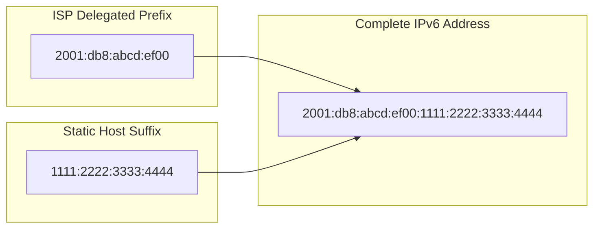

import Callout from "@components/ui/Callout.astro";
import FileContent from "@components/ui/FileContent.astro";
import Mermaid from "@components/ui/Mermaid.astro";
import TerminalCommand from "@components/ui/TerminalCommand.astro";
import {
  TerminalSession,
  TerminalSessionCommand,
  TerminalSessionOutput,
} from "@components/ui/terminal-session";
import Table from "@components/ui/Table.astro";
import Code from "@components/ui/Code.astro";
import CheckList from "@components/ui/CheckList.astro";
import TLDRSummary from "@components/ui/TLDRSummary.astro";
import Prerequisite from "@components/ui/Prerequisite.astro";
import { Tabs, TabPanel } from "@components/ui/tabs";
import Collapsible from "@components/ui/Collapsible.astro";

[DIGI Spain](https://www.digimobil.es/) is one of the few ISPs in Spain that provides native IPv6 connectivity to residential customers. Their fiber network uses [PPPoE](https://datatracker.ietf.org/doc/html/rfc2516) authentication with VLAN tagging and delivers both a dynamic IPv4 address and a dynamic /56 IPv6 prefix via [DHCPv6 Prefix Delegation (DHCPv6-PD)](https://datatracker.ietf.org/doc/html/rfc3633).

This guide covers the complete configuration of a [MikroTik](https://mikrotik.com/) router for DIGI's network, including automatic handling of prefix changes—a challenge when your ISP assigns dynamic prefixes that can change on each reconnection.

<TLDRSummary title="What You'll Configure">
  - **PPPoE over VLAN 20** with the `identifier@digi` username format for DIGI Spain fiber authentication
  - **Dynamic IPv4** with automatic default route and peer DNS
  - **DHCPv6 Prefix Delegation** (/56 prefix) for native IPv6 connectivity
  - **SLAAC** for automatic IPv6 address assignment on LAN devices
  - **Automatic prefix change handling** with DHCPv6 script that updates addresses on reconnection
  - **MTU negotiated down to 1480** via LCP regardless of `max-mtu=1500` — that setting is only the client's upper limit, not the real link MTU
  - **Production-ready firewall** with input, forward chains for both IPv4 and IPv6
  - **Tested on RouterOS 7.x** with RB5009, but applicable to any MikroTik router
</TLDRSummary>

<Callout type="important" title="DIGI-Specific vs Generic Values">
This guide is written for **DIGI Spain**, but the PPPoE + DHCPv6-PD setup applies to many ISPs. Values specific to DIGI are clearly marked:

- **VLAN 20** — DIGI-specific. Other ISPs may use different VLAN IDs or no VLAN at all
- **`your_number@digi`** — DIGI username format (a numeric identifier assigned by DIGI). Replace with your ISP's credentials
- **`max-mtu=1500`** — Upper limit the client will accept. DIGI negotiates the actual MTU to **1480** via LCP
- **`ether1`** — Physical port connected to ONT. Use whichever port you prefer

- **`pool6`** — DHCPv6 pool name. Can be any name you choose

If your ISP doesn't use VLAN tagging, skip Step 2 and set the PPPoE client interface directly to the physical port.
</Callout>

---

## How does PPPoE carry both IPv4 and IPv6?

DIGI's network requires a specific setup: ONT in bridge mode → VLAN 20 → PPPoE authentication → dual-stack IPv4 + IPv6 (DHCPv6-PD) → firewall/NAT → LAN with SLAAC.

### What you receive from DIGI

<Table title="DIGI Connection Parameters">
  <thead>
    <tr>
      <th scope="col">Parameter</th>
      <th scope="col">Value</th>
      <th scope="col">Notes</th>
    </tr>
  </thead>
  <tbody>
    <tr>
      <td>Connection Type</td>
      <td>PPPoE over VLAN 20</td>
      <td>VLAN tagging required</td>
    </tr>
    <tr>
      <td>IPv4 Address</td>
      <td>Dynamic (CGNAT or Public)</td>
      <td>Assigned via PPPoE</td>
    </tr>
    <tr>
      <td>IPv6 Prefix</td>
      <td>Dynamic /56</td>
      <td>Via DHCPv6-PD, can change on reconnect</td>
    </tr>
    <tr>
      <td>MTU</td>
      <td>1480 (negotiated)</td>
      <td>Standard PPPoE, negotiated via LCP</td>
    </tr>
    <tr>
      <td>MRU</td>
      <td>1492 (negotiated)</td>
      <td>Maximum Receive Unit, negotiated via LCP</td>
    </tr>
    <tr>
      <td>Service Name</td>
      <td>ftth</td>
      <td>PPPoE service identifier reported by DIGI</td>
    </tr>
    <tr>
      <td>DNS</td>
      <td>ISP-provided or custom</td>
      <td>Can use peer DNS or configure your own</td>
    </tr>
  </tbody>
</Table>

<Callout type="info" title="About the /56 Prefix">
DIGI delegates a /56 prefix, which gives you 256 /64 subnets to work with. This is generous compared to some ISPs that only provide a single /64. You can use different /64 subnets for your main LAN, IoT network, guest network, etc.
</Callout>

---

## Prerequisites

<Prerequisite title="Before You Start">
  - **MikroTik router** with RouterOS 7.x or later
  - **DIGI fiber connection** with ONT in bridge mode (or your ISP's equivalent)
  - **PPPoE credentials** from your ISP (DIGI format: `identifier@digi`)
  - **Physical ethernet cable** between ONT and router
  - **Administrative access** to your MikroTik router (WinBox, WebFig, or SSH)
  - **Interface lists** `WAN` and `LAN` with your bridge already in the `LAN` list (default in most MikroTik configurations)
</Prerequisite>

<Callout type="tip" title="Other ISPs Using PPPoE">
This configuration works with any PPPoE-based ISP that provides IPv6 via DHCPv6-PD. The key differences per ISP are usually: VLAN ID (or no VLAN), negotiated MTU (typically 1480–1492, determined by the server via LCP), username format, and the delegated prefix size (/48, /56, or /64). Adjust the DIGI-specific values for your ISP.
</Callout>

---

## Step 1: configure the physical interface

First, configure the ethernet port connected to the DIGI ONT:

<Code lang="routeros" title="Physical Interface Configuration">
```routeros
/interface ethernet set [ find default-name=ether1 ] \
    comment="DIGI ONT" \
    rx-flow-control=auto \
    tx-flow-control=auto
```
</Code>

<Callout type="tip" title="Which Port to Use">
Choose any available ethernet port. In this example, we use `ether1`, but you can use any port not assigned to your LAN bridge. Using a dedicated port for WAN improves security and simplifies firewall rules.
</Callout>

---

## Step 2: create the VLAN interface

DIGI requires VLAN 20 tagging for PPPoE traffic. Create the VLAN interface:

<Code lang="routeros" title="VLAN Configuration">
```routeros
/interface vlan add \
    name=VLAN_DIGI \
    vlan-id=20 \
    interface=ether1 \
    comment="VLAN for ISP connection"
```
</Code>

### Why VLAN 20?

DIGI uses [802.1Q VLAN tagging](https://datatracker.ietf.org/doc/html/rfc3069) to separate different services on their network. VLAN 20 is specifically for internet service. If you connect directly without VLAN tagging, PPPoE authentication will fail.

<Collapsible summary="What If My ISP Doesn't Use VLANs?">

If your ISP doesn't require VLAN tagging, skip this step entirely. In Step 3, set the PPPoE client interface directly to the physical port:

```routeros
/interface pppoe-client add \
    interface=ether1 \
    ...
```

Common ISP VLAN configurations:
- **DIGI Spain**: VLAN 20
- **Movistar Spain**: VLAN 6 (internet) + VLAN 2 (VoIP) + VLAN 3 (IPTV)
- **Orange Spain**: VLAN 832
- **No VLAN**: Many ISPs (especially cable/DOCSIS providers)

</Collapsible>

---

## Step 3: configure the PPPoE client

Now create the PPPoE client that will authenticate with DIGI:

<Code lang="routeros" title="PPPoE Client Configuration">
```routeros
/interface pppoe-client add \
    name=PPPoE_DIGI \
    interface=VLAN_DIGI \
    user="your_number@digi" \
    password="your_password" \
    add-default-route=yes \
    use-peer-dns=yes \
    max-mtu=1500 \
    profile=default-encryption \
    disabled=no \
    comment="PPPoE client for ISP DIGI"
```
</Code>

<Callout type="warning" title="Replace Credentials">
You **must** replace `your_number@digi` and `your_password` with the credentials provided by your ISP. For DIGI Spain, the username is a numeric identifier assigned by DIGI followed by `@digi`.
</Callout>

<Table title="PPPoE Configuration Parameters">
  <thead>
    <tr>
      <th scope="col">Parameter</th>
      <th scope="col">Value</th>
      <th scope="col">Purpose</th>
    </tr>
  </thead>
  <tbody>
    <tr>
      <td>`interface`</td>
      <td>VLAN_DIGI</td>
      <td>PPPoE runs over the VLAN interface, not the physical port</td>
    </tr>
    <tr>
      <td>`add-default-route`</td>
      <td>yes</td>
      <td>Automatically adds default route when connected</td>
    </tr>
    <tr>
      <td>`use-peer-dns`</td>
      <td>yes</td>
      <td>Uses DIGI's DNS servers (can disable for custom DNS)</td>
    </tr>
    <tr>
      <td>`max-mtu`</td>
      <td>1500</td>
      <td>Maximum MTU the client accepts. DIGI negotiates down to 1480 via LCP</td>
    </tr>
    <tr>
      <td>`profile`</td>
      <td>default-encryption</td>
      <td>Standard PPP profile with MPPE encryption support</td>
    </tr>
  </tbody>
</Table>

<Collapsible summary="About the PPP Profile">
The `default-encryption` profile enables **MPPE (Microsoft Point-to-Point Encryption)** negotiation during PPP authentication. This is the standard choice for most ISPs.

MikroTik includes two built-in profiles:
- **`default`** — No encryption requirement
- **`default-encryption`** — Requires encryption (recommended)

Most ISPs, including DIGI, work fine with either profile. Use `default-encryption` unless your ISP specifically requires otherwise. You can check available profiles with `/ppp profile print`.
</Collapsible>

<Callout type="info" title="MTU Considerations">
The `max-mtu` parameter is the **upper limit** the client is willing to accept—it is not the actual MTU used on the link. The real MTU is determined by the PPPoE server during [LCP negotiation](https://datatracker.ietf.org/doc/html/rfc1661#section-6.1). DIGI's server negotiates MTU to **1480** regardless of the `max-mtu` value you set. Using `max-mtu=1500` is safe and gives the server room to negotiate higher if it ever supports it.

**Important**: Changing `max-mtu` on a live PPPoE client causes RouterOS to **restart the session**, resulting in a brief disconnection (~3–5 seconds) while it renegotiates with the server.
</Callout>

---

## Step 4: add interfaces to WAN list

For firewall rules to work correctly, add all WAN-related interfaces to an interface list. This is essential—without it, firewall rules referencing the `WAN` list won't match traffic correctly.

<Code lang="routeros" title="Interface Lists">
```routeros
# Create WAN interface list (skip if it already exists in your config)
/interface list add name=WAN comment="ISP Interfaces Group"

# Add WAN interfaces — all three layers of the ISP connection
/interface list member add \
    interface=ether1 \
    list=WAN \
    comment="ISP Physical port"                                    # ← CUSTOMIZE port

/interface list member add \
    interface=VLAN_DIGI \
    list=WAN \
    comment="ISP VLAN"                                             # Skip if no VLAN

/interface list member add \
    interface=PPPoE_DIGI \
    list=WAN \
    comment="ISP PPPoE Client"
```
</Code>

<Callout type="info" title="Why Three WAN Interfaces?">
The WAN list includes all three layers because firewall rules may need to match traffic at different stages:
- **Physical port** (`ether1`): Raw ethernet frames
- **VLAN** (`VLAN_DIGI`): Tagged traffic before PPPoE
- **PPPoE** (`PPPoE_DIGI`): Authenticated tunnel (most firewall rules match here)

Adding all three ensures your firewall rules work regardless of which interface the traffic arrives on.
</Callout>

---

## Step 5: configure DHCPv6 client for prefix delegation

This is where IPv6 gets interesting. DIGI provides a /56 prefix via [DHCPv6-PD (Prefix Delegation)](https://datatracker.ietf.org/doc/html/rfc3633). We need to:

1. Request the prefix from DIGI
2. Store it in a local pool
3. Assign addresses to our LAN from that pool
4. Configure Router Advertisements for [SLAAC](https://datatracker.ietf.org/doc/html/rfc4862)

<Code lang="routeros" title="DHCPv6 Client with Script">
```routeros
/ipv6 dhcp-client add \
    interface=PPPoE_DIGI \
    pool-name=pool6 \
    request=prefix \
    add-default-route=yes \
    use-peer-dns=yes \
    allow-reconfigure=yes \
    rapid-commit=no \
    comment="DHCPv6 client for ISP DIGI" \
    script=":delay 5s;
/ipv6 address remove [find advertise=yes];
/ipv6 address add interface=bridge address=::1/64 from-pool=pool6 advertise=yes;"
```
</Code>

The script waits 5 seconds for the pool to be populated, removes any old advertised IPv6 address on the bridge, and adds a new one from the updated pool. Because the address uses `advertise=yes`, RouterOS **automatically creates a dynamic ND prefix** for SLAAC—no manual ND prefix management is needed.

<Callout type="info" title="Why Remove and Re-add?">
When the ISP prefix changes (PPPoE reconnection, lease renewal), the old address becomes invalid. The script ensures the bridge always has a valid address from the current pool. The `advertise=yes` flag triggers RouterOS to automatically announce the correct `/64` prefix to LAN devices via Router Advertisements (SLAAC).
</Callout>

---

## Step 6: assign IPv6 address to LAN

The router's LAN interface needs an IPv6 address from the delegated pool:

<Code lang="routeros" title="LAN IPv6 Address">
```routeros
/ipv6 address add \
    interface=bridge \
    address=::1/64 \
    from-pool=pool6 \
    advertise=yes
```
</Code>

This creates an address like `2a0c:5a84:xxxx:xx00::1/64` where the prefix comes from DIGI's delegation.

---

## Step 7: configure Neighbor Discovery (SLAAC)

For LAN devices to automatically configure their IPv6 addresses via [SLAAC (Stateless Address Autoconfiguration)](https://datatracker.ietf.org/doc/html/rfc4862), configure Neighbor Discovery:

<Code lang="routeros" title="IPv6 Neighbor Discovery">
```routeros
# Configure ND defaults
/ipv6 nd set [ find default=yes ] \
    hop-limit=64 \
    mtu=1500 \
    other-configuration=yes \
    reachable-time=30s \
    retransmit-interval=1s

# Configure ND for LAN bridge
/ipv6 nd add \
    interface=bridge \
    ra-preference=high \
    hop-limit=64 \
    mtu=1500 \
    dns=fe80::1 \
    reachable-time=30s \
    retransmit-interval=1s
```
</Code>

<Table title="Neighbor Discovery Parameters">
  <thead>
    <tr>
      <th scope="col">Parameter</th>
      <th scope="col">Value</th>
      <th scope="col">Purpose</th>
    </tr>
  </thead>
  <tbody>
    <tr>
      <td>`ra-preference`</td>
      <td>high</td>
      <td>Clients prefer this router over others</td>
    </tr>
    <tr>
      <td>`hop-limit`</td>
      <td>64</td>
      <td>TTL for outgoing packets (standard value)</td>
    </tr>
    <tr>
      <td>`dns`</td>
      <td>fe80::1</td>
      <td>Router's link-local address as DNS (RDNSS)</td>
    </tr>
    <tr>
      <td>`other-configuration`</td>
      <td>yes</td>
      <td>Tells clients to use DHCPv6 for other options</td>
    </tr>
  </tbody>
</Table>

---

## Step 8: configure IPv4 NAT (Masquerade)

For outbound IPv4 connectivity:

<Code lang="routeros" title="IPv4 Masquerade">
```routeros
/ip firewall nat add \
    chain=srcnat \
    action=masquerade \
    out-interface-list=WAN \
    ipsec-policy=out,none \
    comment="Masquerade for internet access"
```
</Code>

---

## Step 9: verify the connection

### Check PPPoE status

<TerminalSession title="PPPoE Client Status">
  <TerminalSessionCommand>
    /interface pppoe-client print detail
  </TerminalSessionCommand>
  <TerminalSessionOutput title="Connected PPPoE">

```
Flags: X - disabled; R - running
 0  R name="PPPoE_DIGI" max-mtu=1500 max-mru=auto mrru=disabled
      interface=VLAN_DIGI user="your_number@digi" password="****"
      profile=default-encryption keepalive-timeout=10
      service-name="" ac-name="" add-default-route=yes
      default-route-distance=1 dial-on-demand=no use-peer-dns=yes
      allow=pap,chap,mschap1,mschap2 status=connected
      uptime=3d14h22m45s encoding=""
      local-address=79.117.xxx.xxx remote-address=10.0.0.1
```

  </TerminalSessionOutput>
</TerminalSession>

<Callout type="tip" title="What to Look For">
- **status=connected** — The PPPoE session is active
- **local-address** — Your public IPv4 address assigned by the ISP
- **max-mtu** — Upper limit the client accepts (1500). The actual MTU is negotiated by the server via LCP (DIGI: 1480)
- If `status=connecting` or `status=disconnected`, check your credentials and VLAN configuration
</Callout>

### Check negotiated PPPoE values

<TerminalSession title="PPPoE Monitor Output">
  <TerminalSessionCommand>
    /interface pppoe-client monitor PPPoE_DIGI once
  </TerminalSessionCommand>
  <TerminalSessionOutput title="Negotiated Values">

```
               status: connected
         service-name: ftth
              ac-name: ftth
                  mtu: 1480
                  mru: 1492
        local-address: 79.117.xxx.xxx
       remote-address: 10.0.x.x
   local-ipv6-address: fe80::xxxx:xxxx:x:xx
  remote-ipv6-address: fe80::1
```

  </TerminalSessionOutput>
</TerminalSession>

<Callout type="tip" title="Monitor vs Print">
The `monitor` command shows **live negotiated values**—the actual MTU (1480), MRU (1492), service name (`ftth`), and access concentrator name. Use this to verify what the server actually provides, as opposed to `print detail` which shows your configured parameters.
</Callout>

### Check IPv6 prefix delegation

<TerminalSession title="IPv6 Prefix Delegation">
  <TerminalSessionCommand>
    /ipv6 pool print
  </TerminalSessionCommand>
  <TerminalSessionOutput title="Delegated Prefix">

```
Flags: D - dynamic
 0 D name="pool6" prefix=2001:db8:abcd:ef00::/56 prefix-length=64
```

  </TerminalSessionOutput>
</TerminalSession>

<Callout type="info" title="Example Prefix">
The prefix shown above (`2001:db8:...`) is a documentation example. Your ISP will assign a real prefix from their allocation.
DIGI Spain typically delegates a `/56` prefix, giving you 256 possible `/64` subnets.
</Callout>

### Check IPv6 addresses

<TerminalSession>
  <TerminalSessionCommand>
    /ipv6 address print where interface=bridge
  </TerminalSessionCommand>
  <TerminalSessionOutput title="LAN IPv6 Address">

```
Flags: X - disabled, I - invalid, D - dynamic, G - global, L - link-local
 0  DG  address=2001:db8:abcd:ef00::1/64 from-pool=pool6
        interface=bridge advertise=yes
```

  </TerminalSessionOutput>
</TerminalSession>

### Test IPv6 connectivity

<TerminalCommand title="Test IPv6">
```bash
/ping 2001:4860:4860::8888 count=4
```
</TerminalCommand>

---

## Complete configuration summary

<FileContent 
  filename="pppoe-digi-complete.rsc" 
  language="routeros" 
  collapsible={true}
  title="Complete DIGI PPPoE Configuration"
>
```routeros
# ═══════════════════════════════════════════════════════════════════════════════
# MIKROTIK PPPoE CONFIGURATION FOR DIGI SPAIN
# ═══════════════════════════════════════════════════════════════════════════════
# Dual-Stack IPv4 + IPv6 with DHCPv6 Prefix Delegation
# ═══════════════════════════════════════════════════════════════════════════════

# ───────────────────────────────────────────────────────────────────────────────
# PHYSICAL INTERFACE
# ───────────────────────────────────────────────────────────────────────────────

/interface ethernet set [ find default-name=ether1 ] \          # ← CUSTOMIZE port
    comment="DIGI ONT" \
    rx-flow-control=auto \
    tx-flow-control=auto

# ───────────────────────────────────────────────────────────────────────────────
# VLAN CONFIGURATION (skip if your ISP doesn't use VLANs)
# ───────────────────────────────────────────────────────────────────────────────

/interface vlan add \
    name=VLAN_DIGI \
    vlan-id=20 \                                                   # ← CUSTOMIZE VLAN ID
    interface=ether1 \                                              # ← CUSTOMIZE port
    comment="VLAN for ISP connection"

# ───────────────────────────────────────────────────────────────────────────────
# PPPoE CLIENT
# ───────────────────────────────────────────────────────────────────────────────

/interface pppoe-client add \
    name=PPPoE_DIGI \
    interface=VLAN_DIGI \                                           # ← Use ether port if no VLAN
    user="your_number@digi" \                                       # ← CUSTOMIZE credentials
    password="your_password" \                                      # ← CUSTOMIZE credentials
    add-default-route=yes \
    use-peer-dns=yes \
    max-mtu=1500 \                                                  # Upper limit; server negotiates actual MTU via LCP
    profile=default-encryption \
    disabled=no \
    comment="PPPoE client for ISP DIGI"

# ───────────────────────────────────────────────────────────────────────────────
# INTERFACE LISTS
# ───────────────────────────────────────────────────────────────────────────────

/interface list add name=WAN comment="ISP Interfaces Group"    # Skip if it already exists

/interface list member add interface=ether1 list=WAN comment="ISP Physical port"         # ← CUSTOMIZE port
/interface list member add interface=VLAN_DIGI list=WAN comment="ISP VLAN"                # Skip if no VLAN
/interface list member add interface=PPPoE_DIGI list=WAN comment="ISP PPPoE Client"

# ───────────────────────────────────────────────────────────────────────────────
# DHCPv6 CLIENT (PREFIX DELEGATION)
# ───────────────────────────────────────────────────────────────────────────────

/ipv6 dhcp-client add \
    interface=PPPoE_DIGI \
    pool-name=pool6 \
    request=prefix \
    add-default-route=yes \
    use-peer-dns=yes \
    allow-reconfigure=yes \
    rapid-commit=no \
    comment="DHCPv6 client for ISP DIGI" \
    script=":delay 5s;
/ipv6 address remove [find advertise=yes];
/ipv6 address add interface=bridge address=::1/64 from-pool=pool6 advertise=yes;"

# ───────────────────────────────────────────────────────────────────────────────
# IPv6 ADDRESS FOR LAN
# ───────────────────────────────────────────────────────────────────────────────

/ipv6 address add \
    interface=bridge \
    address=::1/64 \
    from-pool=pool6 \
    advertise=yes

# ───────────────────────────────────────────────────────────────────────────────
# NEIGHBOR DISCOVERY (SLAAC)
# ───────────────────────────────────────────────────────────────────────────────

/ipv6 nd set [ find default=yes ] \
    hop-limit=64 \
    mtu=1500 \
    other-configuration=yes \
    reachable-time=30s \
    retransmit-interval=1s

/ipv6 nd add \
    interface=bridge \
    ra-preference=high \
    hop-limit=64 \
    mtu=1500 \
    dns=fe80::1 \
    reachable-time=30s \
    retransmit-interval=1s

# ───────────────────────────────────────────────────────────────────────────────
# IPv4 NAT (MASQUERADE)
# ───────────────────────────────────────────────────────────────────────────────

/ip firewall nat add \
    chain=srcnat \
    action=masquerade \
    out-interface-list=WAN \
    ipsec-policy=out,none \
    comment="Masquerade for internet access"
```
</FileContent>

---

## Optional enhancements

The core PPPoE + DHCPv6-PD configuration is complete. The following sections cover additional features you can add depending on your needs.

### IPv6 port forwarding with automatic NAT update

<Callout type="info" title="When Do You Need This?">
Only required if you expose services to the internet over IPv6 (e.g., a web server). If you only need outbound IPv6 connectivity for LAN devices, skip this section.

If you use this script, add `/system script run update-ipv6-nat;` as the last line of the DHCPv6 client script from Step 5 so it runs automatically on each prefix change.
</Callout>

#### Create a port forwarding rule

You need at least one IPv6 dstnat rule. This example forwards HTTP and HTTPS traffic from the WAN to an internal web server:

<Code lang="routeros" title="IPv6 Port Forwarding — Web Server">
```routeros
/ipv6 firewall nat add \
    chain=dstnat \
    action=dst-nat \
    protocol=tcp \
    dst-port=80,443 \
    in-interface=PPPoE_DIGI \
    to-address=2001:db8:abcd:ef00:1111:2222:3333:4444 \
    comment="Web Server"
```
</Code>

<Callout type="tip" title="Rule Identification by Comment">
The `comment` field is how the update script identifies which rules to modify. Use a **descriptive and unique** comment for each service you expose. If you have additional services, add more rules with different comments (e.g., `"Mail Server"`, `"Game Server"`).
</Callout>

#### Create the update script

Since the delegated prefix changes on each PPPoE reconnection, the `to-address` in your dstnat rules becomes stale. This script automatically reconstructs the full IPv6 address from the new prefix and updates all matching rules:

<Code lang="routeros" title="IPv6 NAT Update Script">
```routeros
/system script add \
    name=update-ipv6-nat \
    comment="Auto-update IPv6 NAT when pool6 changes" \
    policy=read,write,policy,test \
    source={
:local serverHost "1111:2222:3333:4444";  # ← CUSTOMIZE: your server's host portion
:local poolprefix [/ipv6/pool get [find name=pool6] prefix];
:local slashPos [:find $poolprefix "/"];
:local prefix [:pick $poolprefix 0 $slashPos];
:local prefixLen [:len $prefix];
:if ([:pick $prefix ($prefixLen - 2) $prefixLen] = "::") do={
    :set prefix [:pick $prefix 0 ($prefixLen - 1)];
}
:local serverIPv6 ($prefix . $serverHost);
/ipv6/firewall/nat set [find comment="Web Server"] to-address=$serverIPv6;
:log info ("IPv6 NAT updated: " . $serverIPv6);
}
```
</Code>

<Callout type="important" title="Customize Before Use">
Replace `1111:2222:3333:4444` with your server's static IPv6 host portion (see tip below). Replace `"Web Server"` with the exact comment on your NAT rule. If you have multiple rules, add a `set [find comment="..."]` line for each one.
</Callout>

#### How the script works

<Mermaid caption="IPv6 Address Construction" ariaLabel="Diagram showing how the full IPv6 address is constructed by combining the ISP delegated prefix with the static host suffix" maxWidth="650px">

</Mermaid>

The script:
1. Gets the current prefix from `pool6` (e.g., `2001:db8:abcd:ef00::/56`)
2. Strips the length notation (`/56`) and trailing `::` to isolate the network prefix
3. Appends the static host portion to form the complete IPv6 address
4. Updates all matching dstnat rules identified by their `comment` field

<Callout type="tip" title="Static Host Portion">
Use your server's [EUI-64 address](https://datatracker.ietf.org/doc/html/rfc4291#section-2.5.1) (derived from its MAC address) or assign a [static suffix](https://datatracker.ietf.org/doc/html/rfc8064). The host portion remains constant across prefix changes, making automatic updates reliable.
</Callout>

<Callout type="note" title="Alternative: Address List">
If you manage multiple services pointing to the same server, consider maintaining a **firewall address list** with the server's current IPv6. The script updates a single entry in `/ipv6 firewall address-list`, and firewall **filter** rules can reference it via `dst-address-list` — simplifying rule management. Note that dstnat rules require an explicit `to-address`, so those still need individual updates in the script.
</Callout>

### Basic firewall rules

Secure your connection with essential firewall rules for both IPv4 and IPv6:

<FileContent 
  filename="firewall-basic.rsc" 
  language="routeros" 
  collapsible={true}
  title="Basic Firewall Configuration"
>
```routeros
# ═══════════════════════════════════════════════════════════════════════════════
# IPv4 FIREWALL - INPUT CHAIN
# ═══════════════════════════════════════════════════════════════════════════════

/ip firewall filter

# Accept established and related connections
add chain=input action=accept \
    connection-state=established,related \
    comment="Accept established/related"

# Drop invalid connections
add chain=input action=drop \
    connection-state=invalid \
    comment="Drop invalid"

# Accept ICMP (ping)
add chain=input action=accept \
    protocol=icmp \
    comment="Accept ICMP"

# Accept from LAN
add chain=input action=accept \
    in-interface-list=LAN \
    comment="Accept from LAN"

# Drop everything else from WAN
add chain=input action=drop \
    in-interface-list=WAN \
    comment="Drop all from WAN"

# ═══════════════════════════════════════════════════════════════════════════════
# IPv4 FIREWALL - FORWARD CHAIN
# ═══════════════════════════════════════════════════════════════════════════════

# FastTrack established connections
add chain=forward action=fasttrack-connection \
    connection-state=established,related \
    hw-offload=yes \
    comment="FastTrack"

add chain=forward action=accept \
    connection-state=established,related \
    comment="Accept established/related"

# Drop invalid
add chain=forward action=drop \
    connection-state=invalid \
    comment="Drop invalid"

# Accept from LAN to WAN
add chain=forward action=accept \
    in-interface-list=LAN \
    out-interface-list=WAN \
    comment="LAN to WAN"

# Drop everything else
add chain=forward action=drop \
    comment="Drop all other forward"


# ═══════════════════════════════════════════════════════════════════════════════
# IPv6 FIREWALL - INPUT CHAIN
# ═══════════════════════════════════════════════════════════════════════════════

/ipv6 firewall filter

# Accept established and related
add chain=input action=accept \
    connection-state=established,related \
    comment="Accept established/related"

# Drop invalid
add chain=input action=drop \
    connection-state=invalid \
    comment="Drop invalid"

# Accept ICMPv6
add chain=input action=accept \
    protocol=icmpv6 \
    comment="Accept ICMPv6"

# Accept DHCPv6 client replies
add chain=input action=accept \
    protocol=udp \
    dst-port=546 \
    src-address=fe80::/10 \
    comment="Accept DHCPv6-Client prefix delegation"

# Accept from LAN
add chain=input action=accept \
    in-interface-list=LAN \
    comment="Accept from LAN"

# Drop from WAN
add chain=input action=drop \
    in-interface-list=WAN \
    comment="Drop all from WAN"


# ═══════════════════════════════════════════════════════════════════════════════
# IPv6 FIREWALL - FORWARD CHAIN
# ═══════════════════════════════════════════════════════════════════════════════

# Accept established and related
add chain=forward action=accept \
    connection-state=established,related \
    comment="Accept established/related"

# Drop invalid
add chain=forward action=drop \
    connection-state=invalid \
    comment="Drop invalid"

# Accept ICMPv6 for path MTU discovery
add chain=forward action=accept \
    protocol=icmpv6 \
    comment="Accept ICMPv6"

# Accept outbound from LAN
add chain=forward action=accept \
    in-interface-list=LAN \
    out-interface-list=WAN \
    comment="LAN to WAN"

# Drop all other forward
add chain=forward action=drop \
    comment="Drop all other forward"
```
</FileContent>

### PPPoE logging

Optionally enable PPPoE event logging for troubleshooting:

<Code lang="routeros" title="PPPoE Logging">
```routeros
/system logging add \
    topics=pppoe \
    prefix="[PPPoE]" \
    action=memory
```
</Code>

---

## Troubleshooting

### PPPoE won't connect

<CheckList>
<li data-check="check">Verify VLAN ID is 20</li>
<li data-check="check">Check username format: <code>identifier@digi</code></li>
<li data-check="check">Ensure ONT is in bridge mode</li>
<li data-check="check">Check physical cable connection</li>
</CheckList>

### No IPv6 prefix received

<CheckList>
<li data-check="check">DHCPv6 client must be on PPPoE interface, not VLAN</li>
<li data-check="check">Request type should be <code>prefix</code> not <code>address</code></li>
<li data-check="check">Check firewall allows DHCPv6 (UDP 546)</li>
</CheckList>

### LAN devices don't get IPv6

<CheckList>
<li data-check="check">Verify ND is configured for bridge interface</li>
<li data-check="check">Check <code>advertise=yes</code> on bridge IPv6 address</li>
<li data-check="check">Ensure pool6 has a valid prefix</li>
</CheckList>

---

## Conclusion

You now have a complete dual-stack configuration for [DIGI Spain](https://www.digimobil.es/) with:

- **PPPoE authentication** over VLAN 20
- **Dynamic IPv4** with automatic default route
- **DHCPv6 Prefix Delegation** for native IPv6
- **Automatic handling** of prefix changes
- **SLAAC** for effortless LAN device configuration

This setup ensures your network maintains full IPv4 and IPv6 connectivity even when the ISP changes your assigned prefixes. The DHCPv6 script handles the complexity of prefix changes, making the configuration truly "set and forget."


