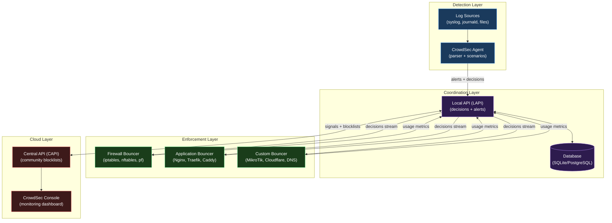
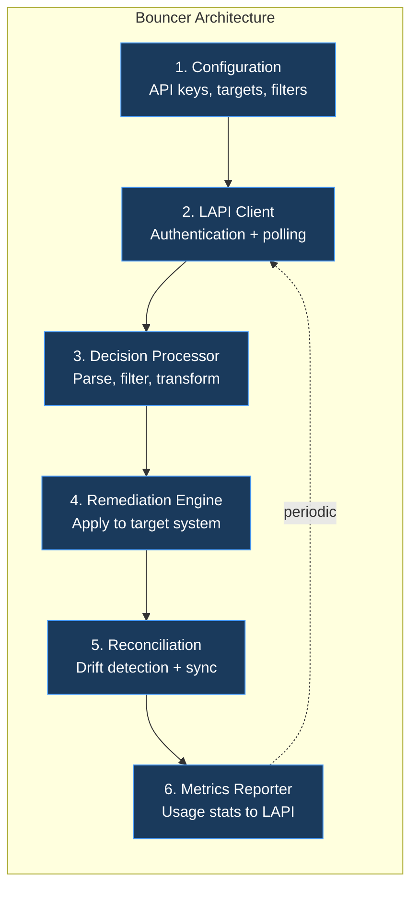
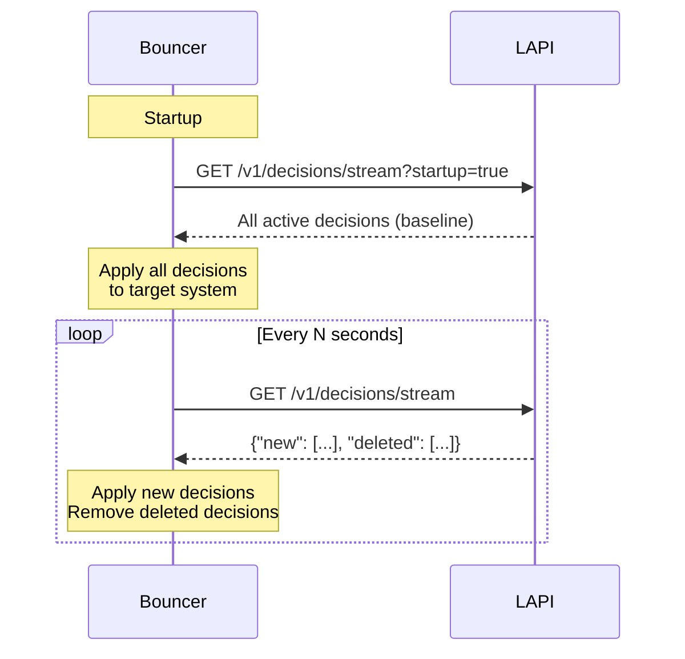
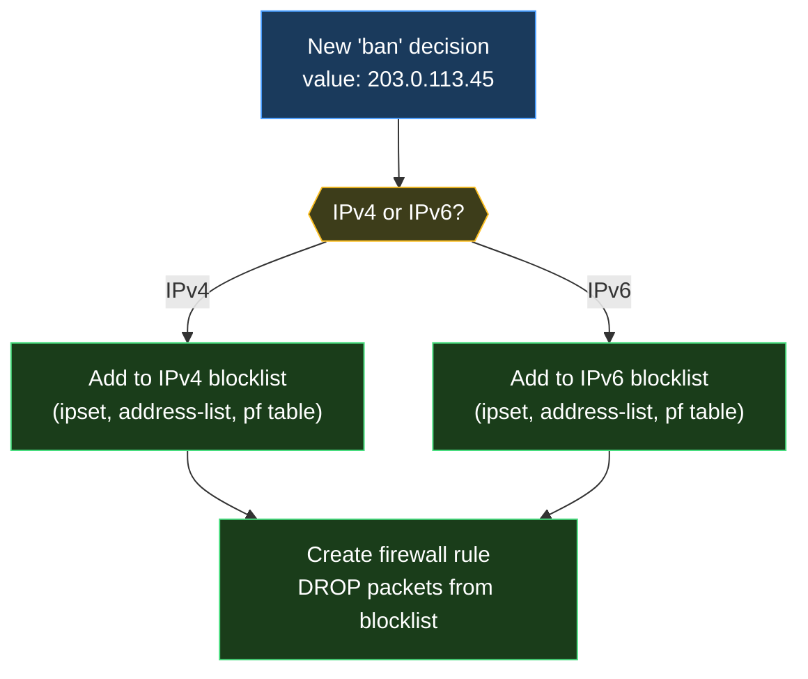
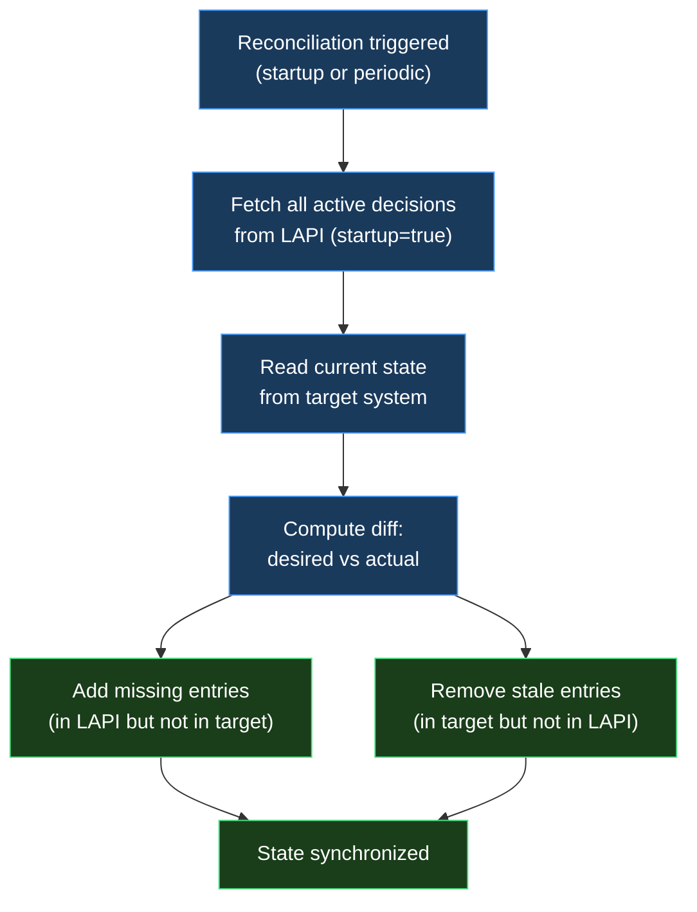
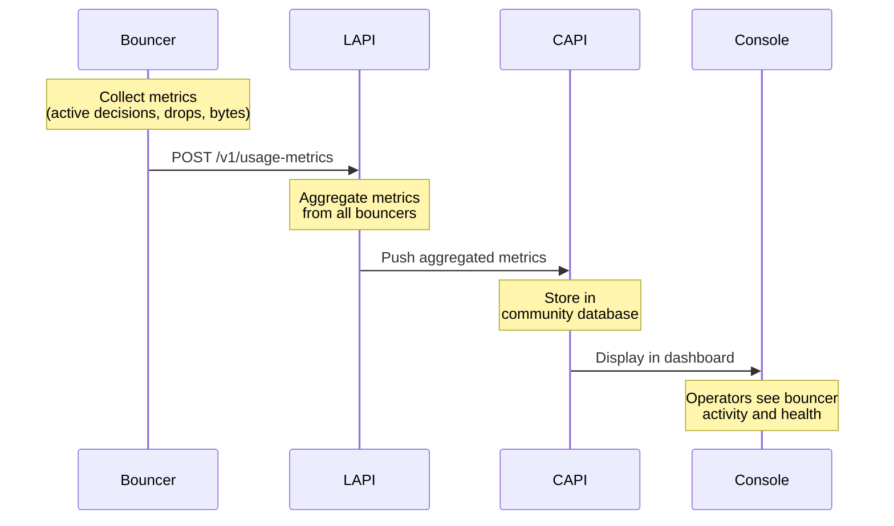
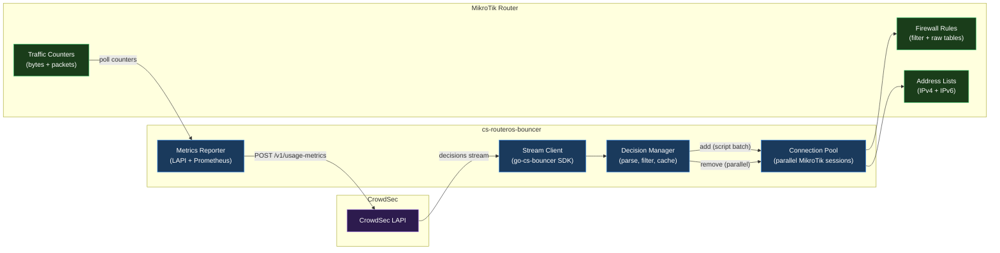

import TLDRSummary from "@components/ui/TLDRSummary.astro";
import Callout from "@components/ui/Callout.astro";
import Mermaid from "@components/ui/Mermaid.astro";
import { Tabs, TabPanel } from "@components/ui/tabs";
import CheckList from "@components/ui/CheckList.astro";
import StepByStep from "@components/ui/StepByStep.astro";
import Collapsible from "@components/ui/Collapsible.astro";
import Table from "@components/ui/Table.astro";
import KeyValue from "@components/ui/KeyValue.astro";
import Code from "@components/ui/Code.astro";
import CodeBlock from "@components/ui/CodeBlock.astro";
import APIEndpoint from "@components/ui/APIEndpoint.astro";
import BeforeAfter from "@components/ui/BeforeAfter.astro";

<TLDRSummary title="What You'll Learn">
  - How the **CrowdSec ecosystem** works: agents, LAPI, bouncers, CAPI, and Console
  - The **architecture of a bouncer**: authentication, decision fetching, remediation, and metrics
  - How to connect to the **Local API (LAPI)** and consume the decisions stream
  - Techniques for **processing and filtering** decisions (IPs, ranges, durations)
  - Patterns for **translating decisions** into firewall rules or application-level actions
  - How to implement **reconciliation** and crash recovery for state consistency
  - How to **report metrics** so your bouncer appears in the CrowdSec Console
  - A real-world **case study** using [cs-routeros-bouncer](https://github.com/jmrplens/cs-routeros-bouncer)
</TLDRSummary>

## Introduction

[CrowdSec](https://www.crowdsec.net/) is an open-source, collaborative security engine that detects and remediates threats using behavior analysis and community-driven intelligence. At its core, CrowdSec follows a simple but powerful pattern: **detect** suspicious behavior, **decide** on remediation, and **enforce** that decision.

The enforcement layer is where **bouncers** live. A bouncer is any software component that reads decisions from CrowdSec and translates them into concrete actions — blocking an IP at the firewall, returning an HTTP 403, presenting a CAPTCHA, or redirecting DNS queries. While CrowdSec provides [official bouncers](https://docs.crowdsec.net/u/bouncers/intro/) for common platforms (iptables, nftables, Nginx, Cloudflare), the real power lies in the ability to build your own bouncer for **any** system.

This guide walks through the complete architecture of a CrowdSec bouncer — from the first API handshake to reporting metrics back to the [CrowdSec Console](https://app.crowdsec.net/). Rather than focusing on a specific programming language, we concentrate on the **design decisions**, **data flows**, and **patterns** that every bouncer must implement. Along the way, we use the [cs-routeros-bouncer](https://github.com/jmrplens/cs-routeros-bouncer) (a bouncer for MikroTik RouterOS) as a case study to illustrate real-world solutions to these challenges.

<Callout type="info" title="Who is this for?">
  This post is for developers and security engineers who want to understand how CrowdSec bouncers work under the hood — whether you plan to build your own bouncer, contribute to an existing one, or simply understand the enforcement layer better.
</Callout>

## The CrowdSec Ecosystem

Before diving into bouncer design, it helps to understand where bouncers fit in the broader CrowdSec architecture. The system has five main components that interact in a clearly defined flow:

<Mermaid caption="CrowdSec Ecosystem: from log analysis to enforcement" ariaLabel="Diagram showing the CrowdSec ecosystem with agents analyzing logs, LAPI coordinating decisions, bouncers enforcing them, CAPI sharing community intelligence, and Console providing monitoring">

</Mermaid>

The key interactions from a bouncer's perspective are:

1. **LAPI → Bouncer**: The bouncer polls the [Local API](https://docs.crowdsec.net/docs/local_api/intro/) for new and expired decisions
2. **Bouncer → Target System**: The bouncer translates decisions into actions on whatever system it protects
3. **Bouncer → LAPI**: The bouncer reports usage metrics (blocks, processed traffic) back to the LAPI
4. **LAPI → CAPI → Console**: The LAPI forwards aggregated metrics to the [Central API](https://crowdsecurity.github.io/api_doc/capi/), which feeds the Console dashboard

<Callout type="tip" title="Bouncers never talk to the Console directly">
  A common misconception is that bouncers report directly to the CrowdSec Console. They don't — bouncers only communicate with the LAPI. The LAPI then aggregates metrics and pushes them upstream to CAPI, which feeds the Console. This design keeps bouncers simple and avoids requiring internet access from every enforcement point.
</Callout>

## Types of Bouncers

CrowdSec bouncers fall into four broad categories based on where and how they enforce decisions:

<Table title="Bouncer types and their characteristics" ariaLabel="Comparison table of four bouncer types: firewall, application, DNS, and WAF">
  <table>
    <thead>
      <tr>
        <th>Type</th>
        <th>Layer</th>
        <th>Actions</th>
        <th>Pros</th>
        <th>Cons</th>
      </tr>
    </thead>
    <tbody>
      <tr>
        <td>**Firewall**</td>
        <td>Network (L3/L4)</td>
        <td>Block/allow IPs via firewall rules</td>
        <td>Fast, universal, low overhead</td>
        <td>No application context</td>
      </tr>
      <tr>
        <td>**Application**</td>
        <td>HTTP/S (L7)</td>
        <td>HTTP 403, CAPTCHA, redirect</td>
        <td>Granular, user interaction</td>
        <td>Higher latency, app-specific</td>
      </tr>
      <tr>
        <td>**DNS**</td>
        <td>DNS resolution</td>
        <td>Block/redirect domain queries</td>
        <td>Preemptive, lightweight</td>
        <td>Bypassable, limited scope</td>
      </tr>
      <tr>
        <td>**WAF**</td>
        <td>HTTP/S (L7)</td>
        <td>Payload inspection, virtual patches</td>
        <td>Deep inspection, app-aware</td>
        <td>Requires tuning per stack</td>
      </tr>
    </tbody>
  </table>
</Table>

Regardless of type, every bouncer shares the same core responsibilities: **authenticate** with the LAPI, **fetch** decisions, **apply** remediation, and **report** metrics. The differences lie in *what* they do with the decisions.

## Anatomy of a Bouncer

Every bouncer, regardless of its target system, must implement these six core components:

<Mermaid caption="Core components of a CrowdSec bouncer" ariaLabel="Diagram showing the six core components of a bouncer: configuration, LAPI client, decision processor, remediation engine, reconciliation loop, and metrics reporter">

</Mermaid>

Let's walk through each one in detail.

## Connecting to the LAPI

The first thing any bouncer must do is establish a connection to the CrowdSec [Local API (LAPI)](https://docs.crowdsec.net/docs/local_api/intro/). This is the single point of contact between your bouncer and the CrowdSec ecosystem.

### Authentication

Bouncers authenticate using an **API key** generated through the CrowdSec CLI:

```bash
sudo cscli bouncers add my-bouncer-name
```

This produces an API key that the bouncer sends in every request via the `X-Api-Key` HTTP header. The key is tied to a named bouncer identity that appears in the CrowdSec Console.

<Callout type="warning" title="Secure your API key">
  The bouncer API key grants read access to all decisions and the ability to report metrics. Store it securely — in environment variables, a secrets manager, or an encrypted configuration file. Never commit it to version control.
</Callout>

For production deployments, the LAPI also supports **mutual TLS (mTLS)** authentication. This requires:

<CheckList title="mTLS requirements">
  <li data-check="check">A client certificate and private key for the bouncer</li>
  <li data-check="check">The CA certificate that signed the LAPI's server certificate</li>
  <li data-check="check">TLS configuration in the bouncer (cert path, key path, CA path)</li>
  <li data-check="optional">InsecureSkipVerify option for self-signed certificates in development</li>
</CheckList>

### The Decisions Stream

The primary API endpoint for bouncers is the **decisions stream**. This is how your bouncer learns about new threats and expired remediations:

<APIEndpoint
  method="GET"
  path="/v1/decisions/stream"
  description="Returns new and expired decisions since the last poll. On first call with startup=true, returns all active decisions."
/>

The endpoint accepts these key query parameters:

<Table title="Decisions stream parameters" ariaLabel="Table of query parameters for the decisions stream API endpoint">
  <table>
    <thead>
      <tr>
        <th>Parameter</th>
        <th>Type</th>
        <th>Description</th>
      </tr>
    </thead>
    <tbody>
      <tr>
        <td>`startup`</td>
        <td>boolean</td>
        <td>When `true`, returns **all** active decisions (initial baseline). Use only on first poll.</td>
      </tr>
      <tr>
        <td>`scopes`</td>
        <td>string</td>
        <td>Comma-separated list of scopes to filter (e.g., `ip,range`)</td>
      </tr>
      <tr>
        <td>`origins`</td>
        <td>string</td>
        <td>Filter by decision origin (e.g., `crowdsec,cscli,CAPI`)</td>
      </tr>
      <tr>
        <td>`scenarios_containing`</td>
        <td>string</td>
        <td>Only include decisions from scenarios matching this substring</td>
      </tr>
      <tr>
        <td>`scenarios_not_containing`</td>
        <td>string</td>
        <td>Exclude decisions from scenarios matching this substring</td>
      </tr>
    </tbody>
  </table>
</Table>

The response is a JSON object with two arrays:

<Code lang="json" title="Decisions stream response structure">
{`{
  "new": [
    {
      "id": 42,
      "origin": "crowdsec",
      "type": "ban",
      "scope": "ip",
      "value": "203.0.113.45",
      "duration": "4h0m0s",
      "scenario": "crowdsecurity/ssh-bf",
      "simulated": false
    }
  ],
  "deleted": [
    {
      "id": 37,
      "origin": "crowdsec",
      "type": "ban",
      "scope": "ip",
      "value": "198.51.100.12",
      "duration": "0s",
      "scenario": "crowdsecurity/http-probing"
    }
  ]
}`}
</Code>

### Stream vs Live Mode

CrowdSec's [Go SDK](https://github.com/crowdsecurity/go-cs-bouncer) offers two operational modes for consuming decisions:

<Tabs>
  <TabPanel label="Stream Mode (Recommended)" noPadding>
    <CodeBlock lang="text" code={`Stream Mode:
- Polls /v1/decisions/stream periodically (e.g., every 10-30 seconds)
- First poll uses startup=true to get ALL active decisions
- Subsequent polls return only changes (new + deleted) since last poll
- Bouncer maintains a local cache of active decisions
- Best for: firewall bouncers, any system that manages a blocklist

Advantages:
✓ Efficient — only transfers deltas after startup
✓ Resilient — local cache survives brief LAPI outages
✓ Batch-friendly — apply multiple changes at once

Trade-offs:
✗ Slight delay between decision and enforcement (polling interval)
✗ Must manage local state (cache invalidation, persistence)`} />
  </TabPanel>
  <TabPanel label="Live Mode" noPadding>
    <CodeBlock lang="text" code={`Live Mode:
- Queries LAPI on-demand for a specific IP/range
- No local cache — every check hits the LAPI
- Best for: application bouncers, per-request checks

Advantages:
✓ Always up-to-date — real-time decisions
✓ No state to manage — stateless design
✓ Simple implementation

Trade-offs:
✗ Higher latency — network round-trip per check
✗ LAPI dependency — if LAPI is down, no decisions
✗ Not suitable for high-throughput scenarios`} />
  </TabPanel>
</Tabs>

<Callout type="keypoint" title="When to use which mode">
  Use **Stream mode** when your bouncer manages a blocklist (firewall rules, address lists, ACLs). Use **Live mode** when your bouncer checks individual requests (web application middleware, reverse proxy plugins). Most production bouncers use Stream mode because it's more resilient and efficient at scale.
</Callout>

### Polling Pattern

The typical polling loop for a stream-mode bouncer follows this pattern:

<Mermaid caption="Stream polling lifecycle" ariaLabel="Sequence diagram showing the bouncer's polling lifecycle: initial startup poll, then periodic delta polls with new and deleted decisions">

</Mermaid>

The `startup=true` parameter on the first poll is critical — it tells the LAPI to return the complete set of active decisions, not just changes since a (nonexistent) last poll. After that initial sync, every subsequent poll returns only the delta.

## Processing Decisions

Once your bouncer receives decisions from the LAPI, it must process them before taking action. This is where most of the bouncer's logic lives.

### The Decision Object

Each decision in the stream contains these key fields:

<Table title="Decision object fields" ariaLabel="Table describing the fields in a CrowdSec decision object">
  <table>
    <thead>
      <tr>
        <th>Field</th>
        <th>Type</th>
        <th>Description</th>
      </tr>
    </thead>
    <tbody>
      <tr>
        <td>`id`</td>
        <td>integer</td>
        <td>Unique decision identifier</td>
      </tr>
      <tr>
        <td>`origin`</td>
        <td>string</td>
        <td>Source: `crowdsec` (local detection), `cscli` (manual), `CAPI` (community), `lists` (blocklists)</td>
      </tr>
      <tr>
        <td>`type`</td>
        <td>string</td>
        <td>Remediation type: `ban`, `captcha`, `throttle`, or custom</td>
      </tr>
      <tr>
        <td>`scope`</td>
        <td>string</td>
        <td>Target scope: `ip`, `range`, `as`, `country`</td>
      </tr>
      <tr>
        <td>`value`</td>
        <td>string</td>
        <td>The target value (e.g., `203.0.113.45`, `198.51.100.0/24`)</td>
      </tr>
      <tr>
        <td>`duration`</td>
        <td>string</td>
        <td>How long the decision is valid (e.g., `4h0m0s`, `24h0m0s`)</td>
      </tr>
      <tr>
        <td>`scenario`</td>
        <td>string</td>
        <td>The detection scenario that triggered this decision (e.g., `crowdsecurity/ssh-bf`)</td>
      </tr>
      <tr>
        <td>`simulated`</td>
        <td>boolean</td>
        <td>If `true`, the decision is for logging only — do not enforce</td>
      </tr>
    </tbody>
  </table>
</Table>

### Parsing Pipeline

Your bouncer should implement a clear parsing pipeline that validates, filters, and transforms each decision:

<StepByStep title="Decision processing pipeline">
  1. **Validate required fields** — Ensure `value`, `type`, `duration`, and `scope` are present and non-null. Drop malformed decisions with a warning log.
  2. **Check decision type** — Most bouncers only handle `ban` decisions. If your bouncer supports `captcha` or custom types, route them accordingly.
  3. **Check simulation flag** — If `simulated` is `true`, log the decision but do not enforce it. This is useful for testing scenarios.
  4. **Parse the duration** — Convert the CrowdSec duration string (e.g., `4h0m0s`) to your target system's format. Have a fallback default (e.g., 4 hours) for unparseable durations.
  5. **Detect IP version** — Determine if the value is IPv4 or IPv6. Check if your target system supports both protocols. Skip unsupported protocols gracefully.
  6. **Detect address type** — Distinguish single IPs from CIDR ranges (look for `/` in the value). Some systems handle ranges differently from individual addresses.
  7. **Apply filters** — Check against your configured origin, scope, and scenario filters. Drop decisions that don't match.
  8. **Transform for target** — Convert the decision into whatever format your target system needs (firewall rule, ACL entry, DNS record).
</StepByStep>

<Callout type="tip" title="IPv6 normalization">
  When processing IPv6 addresses, normalize single addresses to /128 CIDR notation for consistency. This simplifies your internal data structures — everything becomes a prefix, whether it's a single IP or a range. For example, `2001:db8::1` becomes `2001:db8::1/128`.
</Callout>

### Duration Handling

CrowdSec expresses durations in Go's time format: `4h0m0s`, `24h30m0s`, `168h0m0s`. Your bouncer needs to parse this and convert it to whatever format the target system expects:

<Tabs>
  <TabPanel label="Common Formats">

Different systems expect different duration formats:

<Table title="Duration format examples" ariaLabel="Table showing how CrowdSec durations map to different system formats">
  <table>
    <thead>
      <tr>
        <th>CrowdSec</th>
        <th>Seconds</th>
        <th>iptables</th>
        <th>MikroTik</th>
        <th>Human</th>
      </tr>
    </thead>
    <tbody>
      <tr>
        <td>`4h0m0s`</td>
        <td>14400</td>
        <td>14400 (timeout)</td>
        <td>`4h`</td>
        <td>4 hours</td>
      </tr>
      <tr>
        <td>`24h0m0s`</td>
        <td>86400</td>
        <td>86400</td>
        <td>`1d`</td>
        <td>1 day</td>
      </tr>
      <tr>
        <td>`168h0m0s`</td>
        <td>604800</td>
        <td>604800</td>
        <td>`1w`</td>
        <td>1 week</td>
      </tr>
    </tbody>
  </table>
</Table>

  </TabPanel>
  <TabPanel label="Fallback Strategy">

Always implement a fallback for unparseable durations:

<CheckList title="Duration parsing best practices">
  <li data-check="check">Parse the standard Go duration format (`Xh Ym Zs`)</li>
  <li data-check="check">Handle edge cases: `0s` (already expired), negative durations</li>
  <li data-check="check">Implement a configurable default duration (e.g., 4 hours)</li>
  <li data-check="warning">Log a warning when falling back to the default — this may indicate a bug</li>
  <li data-check="cross">Never silently drop a decision because of an unparseable duration</li>
</CheckList>

  </TabPanel>
</Tabs>

### Caching Strategies

For stream-mode bouncers, maintaining a local cache of active decisions dramatically improves performance. The two main patterns are:

<Tabs>
  <TabPanel label="Address Cache">

An in-memory map keyed by IP/range that stores the current state:

<Code lang="json" title="Address cache structure example">
{`{
  "203.0.113.45": {
    "decision_id": 42,
    "type": "ban",
    "origin": "crowdsec",
    "scenario": "crowdsecurity/ssh-bf",
    "duration": "4h0m0s",
    "added_at": "2026-03-01T10:00:00Z",
    "protocol": "ipv4"
  },
  "2001:db8::1/128": {
    "decision_id": 43,
    "type": "ban",
    "origin": "CAPI",
    "scenario": "crowdsecurity/http-probing",
    "duration": "24h0m0s",
    "added_at": "2026-03-01T09:30:00Z",
    "protocol": "ipv6"
  }
}`}
</Code>

This cache enables O(1) lookups when deleting decisions — instead of searching the target system for a matching rule, you can directly reference the cached entry.

  </TabPanel>
  <TabPanel label="No Cache (Stateless)">

Some bouncers skip local caching entirely and rely on the target system as the source of truth:

<CheckList title="Stateless approach">
  <li data-check="check">Simpler implementation — no cache invalidation logic</li>
  <li data-check="check">Target system is always authoritative</li>
  <li data-check="warning">Slower deletions — must search the target system for matching entries</li>
  <li data-check="warning">Requires the target system to support efficient lookups</li>
  <li data-check="cross">Not recommended for systems with slow query APIs</li>
</CheckList>

  </TabPanel>
</Tabs>

## Translating Decisions to Actions

This is the heart of your bouncer — the **remediation engine** that bridges CrowdSec's abstract decisions into concrete actions on your target system. The implementation varies widely depending on the bouncer type, but the patterns are consistent.

### Firewall Bouncers

Firewall bouncers translate `ban` decisions into network-level blocks. The general pattern is:

<Mermaid caption="Firewall bouncer decision flow" ariaLabel="Flowchart showing how a ban decision is translated into firewall rules for both IPv4 and IPv6">

</Mermaid>

The key design decisions for firewall bouncers are:

<CheckList title="Firewall bouncer design decisions">
  <li data-check="check">**Separate IPv4 and IPv6 blocklists** — Most firewall systems require separate rules/sets for each protocol</li>
  <li data-check="check">**Use timeout-based entries** — Let entries expire automatically based on decision duration rather than managing deletion timers yourself</li>
  <li data-check="check">**Rule placement** — Place block rules early in the chain (before ESTABLISHED/RELATED accept rules) for maximum efficiency</li>
  <li data-check="check">**Idempotent operations** — Adding an already-blocked IP should update its timeout, not fail</li>
  <li data-check="optional">**Whitelist support** — Allow specific IPs or interfaces to bypass the bouncer's blocks</li>
  <li data-check="optional">**Counting rules** — Add passthrough rules to measure total processed traffic for metrics</li>
</CheckList>

### Application Bouncers

Application-level bouncers integrate as middleware in web servers or reverse proxies. Instead of firewall rules, they make per-request decisions:

<Code lang="text" title="Application bouncer decision logic (pseudocode)">
{`function handleRequest(request):
    clientIP = extractClientIP(request)
    
    // Check local cache first (stream mode)
    decision = cache.lookup(clientIP)
    
    // Or query LAPI directly (live mode)
    if decision is null:
        decision = lapi.getDecision(clientIP)
    
    if decision is null:
        return passthrough(request)  // No decision — allow
    
    switch decision.type:
        case "ban":
            return HTTP 403 Forbidden
        case "captcha":
            return redirectToCaptchaPage()
        case "throttle":
            return HTTP 429 Too Many Requests
        default:
            log.warn("Unknown decision type", decision.type)
            return passthrough(request)`}
</Code>

### Bulk Operations and Performance

When your bouncer starts up and receives the initial baseline (all active decisions via `startup=true`), it may need to process thousands of entries at once. Naive one-by-one insertion can be extremely slow on some systems.

<Callout type="keypoint" title="Batch your operations">
  If your target system supports it, **always batch** initial operations. For example, the [cs-routeros-bouncer](https://github.com/jmrplens/cs-routeros-bouncer) uses RouterOS scripting to batch 100 address-list entries per API call, reducing startup time from minutes to seconds. The [firewall bouncer](https://github.com/crowdsecurity/cs-firewall-bouncer) uses ipset for O(1) additions regardless of set size.
</Callout>

Performance patterns commonly used by bouncers:

<Table title="Bulk operation strategies" ariaLabel="Table comparing different strategies for bulk operations in bouncers">
  <table>
    <thead>
      <tr>
        <th>Strategy</th>
        <th>Description</th>
        <th>Example</th>
      </tr>
    </thead>
    <tbody>
      <tr>
        <td>**API batching**</td>
        <td>Group multiple operations into a single API call</td>
        <td>Cloudflare API supports bulk rule creation</td>
      </tr>
      <tr>
        <td>**Script injection**</td>
        <td>Generate a script with all operations and execute it at once</td>
        <td>MikroTik RouterOS scripting (100 entries/script)</td>
      </tr>
      <tr>
        <td>**Set-based operations**</td>
        <td>Use data structures optimized for bulk membership operations</td>
        <td>Linux ipset (O(1) per operation)</td>
      </tr>
      <tr>
        <td>**Connection pooling**</td>
        <td>Use parallel connections for concurrent operations</td>
        <td>Multiple SSH/API sessions for parallel deletions</td>
      </tr>
      <tr>
        <td>**Optimistic add**</td>
        <td>Try to add; if already exists, update timeout instead of failing</td>
        <td>Avoids expensive "check-then-add" two-step pattern</td>
      </tr>
    </tbody>
  </table>
</Table>

## Reconciliation and Drift Detection

One of the most critical — and often overlooked — aspects of bouncer design is **reconciliation**: ensuring that the bouncer's intended state matches the actual state of the target system.

### Why Reconciliation Matters

State drift can occur for several reasons:

<CheckList title="Sources of state drift">
  <li data-check="warning">**Bouncer crash** — The bouncer applied some decisions, then crashed before applying the rest</li>
  <li data-check="warning">**Target system restart** — Firewall rules may be lost on reboot if not persistent</li>
  <li data-check="warning">**Manual modifications** — An administrator manually removes or adds rules</li>
  <li data-check="warning">**Timeout mismatch** — The target system expired an entry before CrowdSec sent the deletion</li>
  <li data-check="warning">**Network issues** — A poll was missed, leaving the bouncer with stale data</li>
</CheckList>

### The Reconciliation Pattern

A well-designed bouncer performs reconciliation on startup and optionally at periodic intervals:

<Mermaid caption="Reconciliation process" ariaLabel="Flowchart showing the reconciliation process: fetch desired state from LAPI, read current state from target, compute diff, apply additions and removals">

</Mermaid>

### Crash Recovery with Signatures

A robust technique for crash recovery is **embedding a signature** in every rule or entry your bouncer creates. This allows the bouncer to identify its own rules after a restart, even without any local state.

For example, the [cs-routeros-bouncer](https://github.com/jmrplens/cs-routeros-bouncer) embeds `@cs-routeros-bouncer` in the comment field of every address-list entry. On startup, it queries all entries with this signature, compares them against the LAPI's active decisions, and reconciles the difference.

<Code lang="text" title="Signature-based identification pattern">
{`# Rule comment format with embedded signature:
# {prefix}:{type}:{chain}:{proto}:{origin} {scenario} @bouncer-name
#
# Example:
# crowdsec:ban:input:ipv4:crowdsec crowdsecurity/ssh-bf @cs-routeros-bouncer

On startup:
1. Query all entries with "@bouncer-name" signature
2. Fetch all active decisions from LAPI
3. Entries in target but NOT in LAPI → remove (stale)
4. Entries in LAPI but NOT in target → add (missing)
5. Entries in both → update timeout if needed`}
</Code>

<Callout type="important" title="Initial sync optimization">
  During the initial startup poll, the LAPI sends all active decisions at once. Some of these may have been immediately followed by deletions (e.g., a decision was created then revoked within the same polling interval). Filter these out **before** applying to the target system — there's no point in adding an entry only to delete it immediately after.
</Callout>

## Reporting Metrics to CrowdSec

Metrics reporting is what makes your bouncer **visible** in the [CrowdSec Console](https://app.crowdsec.net/). Without it, your bouncer silently enforces decisions but operators have no visibility into its activity.

### The Usage Metrics Endpoint

Bouncers report their activity via a single LAPI endpoint:

<APIEndpoint
  method="POST"
  path="/v1/usage-metrics"
  description="Reports bouncer activity metrics to the LAPI. The LAPI aggregates these and pushes them to CAPI, which feeds the Console dashboard."
/>

The payload includes remediation statistics and active decision counts:

<Code lang="json" title="Usage metrics payload example">
{`{
  "remediation_components": [
    {
      "version": "1.2.0",
      "name": "cs-routeros-bouncer",
      "type": "crowdsec-routeros-bouncer",
      "utc_startup_timestamp": "2026-03-01T10:00:00Z"
    }
  ],
  "metrics": [
    {
      "meta": {
        "utc_now_timestamp": "2026-03-01T10:15:00Z",
        "window_size_seconds": 900
      },
      "items": [
        {
          "name": "active_decisions",
          "value": 1250,
          "labels": {
            "origin": "CAPI",
            "ip_type": "ipv4"
          }
        },
        {
          "name": "dropped",
          "value": 3847,
          "unit": "packet",
          "labels": {
            "ip_type": "ipv4"
          }
        },
        {
          "name": "dropped",
          "value": 184320,
          "unit": "byte",
          "labels": {
            "ip_type": "ipv4"
          }
        }
      ]
    }
  ]
}`}
</Code>

### Metrics Flow

Understanding how metrics travel through the CrowdSec ecosystem helps you design the right reporting strategy:

<Mermaid caption="Metrics flow from bouncer to Console" ariaLabel="Sequence diagram showing metrics flowing from bouncer to LAPI to CAPI to Console dashboard">

</Mermaid>

### What to Report

The minimum set of metrics to report are:

<CheckList title="Essential metrics">
  <li data-check="check">**Active decisions** — How many decisions are currently being enforced, broken down by origin (`crowdsec`, `CAPI`, `cscli`, `lists`) and IP type (`ipv4`, `ipv6`)</li>
  <li data-check="check">**Dropped traffic** — Packets and bytes dropped by bouncer-managed rules, broken down by IP type</li>
  <li data-check="optional">**Processed traffic** — Total packets and bytes that passed through bouncer-managed rules (both allowed and blocked)</li>
  <li data-check="optional">**Bouncer version and name** — Helps operators identify which bouncer version is running</li>
</CheckList>

### Reporting Interval

<Callout type="tip" title="Recommended reporting interval">
  A reporting interval of **10-15 minutes** is typical for most bouncers. Too frequent (seconds) wastes resources; too infrequent (hours) makes the Console data stale. The [cs-routeros-bouncer](https://github.com/jmrplens/cs-routeros-bouncer) defaults to 15 minutes. CrowdSec's official firewall bouncer uses a similar interval. Make the interval configurable.
</Callout>

### Prometheus Integration

Beyond LAPI reporting, exposing [Prometheus](https://prometheus.io/) metrics allows operators to monitor your bouncer with their existing observability stack:

<Table title="Useful Prometheus metrics for bouncers" ariaLabel="Table of recommended Prometheus metrics to expose from a bouncer">
  <table>
    <thead>
      <tr>
        <th>Metric</th>
        <th>Type</th>
        <th>Labels</th>
        <th>Description</th>
      </tr>
    </thead>
    <tbody>
      <tr>
        <td>`decisions_total`</td>
        <td>Counter</td>
        <td>action, proto, origin</td>
        <td>Total decisions processed (ban/unban)</td>
      </tr>
      <tr>
        <td>`active_decisions`</td>
        <td>Gauge</td>
        <td>proto</td>
        <td>Currently enforced decisions</td>
      </tr>
      <tr>
        <td>`dropped_packets_total`</td>
        <td>Counter</td>
        <td>proto</td>
        <td>Packets dropped by bouncer rules</td>
      </tr>
      <tr>
        <td>`operation_duration_seconds`</td>
        <td>Histogram</td>
        <td>operation</td>
        <td>Time to add/remove/reconcile entries</td>
      </tr>
    </tbody>
  </table>
</Table>

## Testing and Observability

A bouncer runs in the critical path of your security infrastructure — if it breaks, threats go unblocked. Proper testing and observability are essential.

### Integration Testing

The most effective way to test a bouncer is against a real CrowdSec instance:

<StepByStep title="Integration testing approach">
  1. **Set up a local CrowdSec instance** — Use Docker or install directly. Configure a test bouncer API key.
  2. **Create test decisions** — Use `cscli decisions add -i 203.0.113.1 -d 1h -t ban` to manually create decisions.
  3. **Verify enforcement** — Confirm that the bouncer created the expected rule/entry on the target system.
  4. **Test deletion** — Use `cscli decisions delete --id X` and verify the bouncer removes the corresponding entry.
  5. **Test reconciliation** — Manually remove a rule, restart the bouncer, and verify it re-adds the missing entry.
  6. **Test bulk operations** — Add hundreds of decisions at once and measure startup time.
  7. **Test failure modes** — Stop the LAPI, restart it, and verify the bouncer recovers gracefully.
</StepByStep>

### Logging Best Practices

<CheckList title="Logging recommendations">
  <li data-check="check">**Structured logging** — Use JSON or key-value format for easy parsing by log aggregators</li>
  <li data-check="check">**Log every decision action** — Record when decisions are added, updated, or removed with the IP, scenario, and origin</li>
  <li data-check="check">**Log reconciliation results** — Report how many entries were added, removed, and unchanged during reconciliation</li>
  <li data-check="check">**Include operation timings** — Log how long bulk operations and API calls take</li>
  <li data-check="warning">**Rate-limit error logs** — Avoid flooding logs during extended LAPI outages</li>
  <li data-check="cross">**Never log the API key** — Even in debug mode, mask credentials in log output</li>
</CheckList>

### Health Checks

Expose a health endpoint or status mechanism so monitoring systems can detect when the bouncer is degraded:

<Code lang="json" title="Health check response example">
{`{
  "status": "healthy",
  "lapi_connected": true,
  "last_poll": "2026-03-01T10:14:30Z",
  "active_decisions": {
    "ipv4": 1247,
    "ipv6": 3
  },
  "target_system": {
    "connected": true,
    "rules_synced": true
  },
  "uptime": "72h15m30s"
}`}
</Code>

## Case Study: cs-routeros-bouncer

To illustrate these patterns in practice, let's look at [cs-routeros-bouncer](https://github.com/jmrplens/cs-routeros-bouncer) — a CrowdSec bouncer designed for [MikroTik](https://mikrotik.com/) RouterOS devices. This project solves a particularly interesting challenge: MikroTik routers have a limited API that doesn't support batch operations natively, and their connection capacity is constrained.

### Architecture Overview

<Mermaid caption="cs-routeros-bouncer architecture" ariaLabel="Architecture diagram of cs-routeros-bouncer showing LAPI client, decision processor, MikroTik connection pool, address list manager, and metrics reporter">

</Mermaid>

### Key Design Decisions

The bouncer implements several of the patterns discussed in this post, plus some unique solutions for MikroTik's constraints:

<Table title="Key design decisions in cs-routeros-bouncer" ariaLabel="Table of notable design decisions and their rationale in the cs-routeros-bouncer project">
  <table>
    <thead>
      <tr>
        <th>Challenge</th>
        <th>Solution</th>
        <th>Pattern</th>
      </tr>
    </thead>
    <tbody>
      <tr>
        <td>MikroTik has no batch add API</td>
        <td>Generate RouterOS scripts with up to 100 entries each, execute via scripting API</td>
        <td>Script injection</td>
      </tr>
      <tr>
        <td>Limited concurrent connections (max ~20 sessions)</td>
        <td>Auto-detect max sessions, create pool sized to `max - 2` (leave room for admin)</td>
        <td>Connection pooling</td>
      </tr>
      <tr>
        <td>Adding an existing entry returns an error</td>
        <td>Catch "already have" error, update timeout instead of failing</td>
        <td>Optimistic add</td>
      </tr>
      <tr>
        <td>Crash recovery without persistent state</td>
        <td>Embed `@cs-routeros-bouncer` signature in address-list comments</td>
        <td>Rule signature</td>
      </tr>
      <tr>
        <td>Efficient deletion of expired entries</td>
        <td>In-memory address cache for O(1) lookup; parallel deletion via pool</td>
        <td>Address cache + parallel ops</td>
      </tr>
      <tr>
        <td>Metrics collection from firewall counters</td>
        <td>Passthrough rules count traffic; periodic sampling for Prometheus + LAPI</td>
        <td>Counting rules</td>
      </tr>
    </tbody>
  </table>
</Table>

### Performance Results

The combination of script batching and connection pooling yields substantial performance gains:

<Table title="cs-routeros-bouncer startup performance" ariaLabel="Table showing startup performance benchmarks for different numbers of IP addresses">
  <table>
    <thead>
      <tr>
        <th>Addresses</th>
        <th>Time (with pool + scripts)</th>
        <th>Approx. per-entry rate</th>
      </tr>
    </thead>
    <tbody>
      <tr>
        <td>1,500 IPs</td>
        <td>~9 seconds</td>
        <td>~167 entries/sec</td>
      </tr>
      <tr>
        <td>10,000 IPs</td>
        <td>~65 seconds</td>
        <td>~154 entries/sec</td>
      </tr>
      <tr>
        <td>25,000 IPs</td>
        <td>~2 min 50 sec</td>
        <td>~147 entries/sec</td>
      </tr>
    </tbody>
  </table>
</Table>

For more details, including installation and configuration instructions, see the [cs-routeros-bouncer documentation](https://jmrplens.github.io/cs-routeros-bouncer/).

## Conclusion

Designing a CrowdSec bouncer is fundamentally about bridging two worlds: the **CrowdSec decision ecosystem** and your **target enforcement system**. Whether you're building for a firewall, a web server, a DNS resolver, or a router, the core architecture remains the same:

<CheckList title="Bouncer design principles">
  <li data-check="check">**Authenticate securely** — Use API keys and support mTLS for production</li>
  <li data-check="check">**Stream, don't poll individually** — Use the decisions stream with a local cache for efficiency and resilience</li>
  <li data-check="check">**Validate and filter** — Never blindly apply every decision; filter by scope, origin, type, and protocol</li>
  <li data-check="check">**Batch operations** — Target systems often have performance constraints; batch wherever possible</li>
  <li data-check="check">**Reconcile on startup** — Compare LAPI state against target system state; fix drift automatically</li>
  <li data-check="check">**Plan for crashes** — Embed signatures in your rules so you can recover without persistent state</li>
  <li data-check="check">**Report metrics** — Make your bouncer visible in the Console by reporting to `/v1/usage-metrics`</li>
  <li data-check="check">**Expose observability** — Prometheus metrics, structured logs, and health endpoints are not optional</li>
</CheckList>

The CrowdSec ecosystem is designed with extensibility in mind — the [LAPI](https://crowdsecurity.github.io/api_doc/index.html?urls.primaryName=LAPI) is well-documented, the [Go SDK](https://github.com/crowdsecurity/go-cs-bouncer) handles the boilerplate, and the [community](https://discourse.crowdsec.net/) is active and welcoming. If your system can block an IP or deny a request, you can build a bouncer for it.
