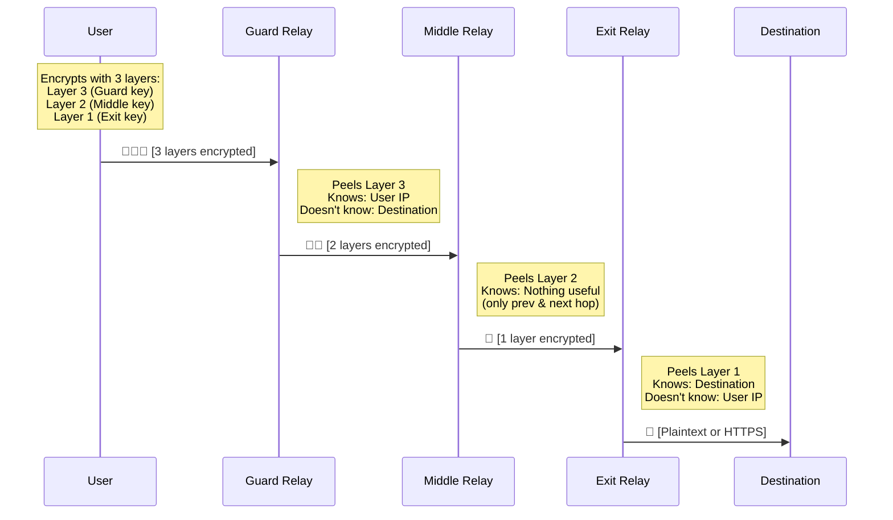
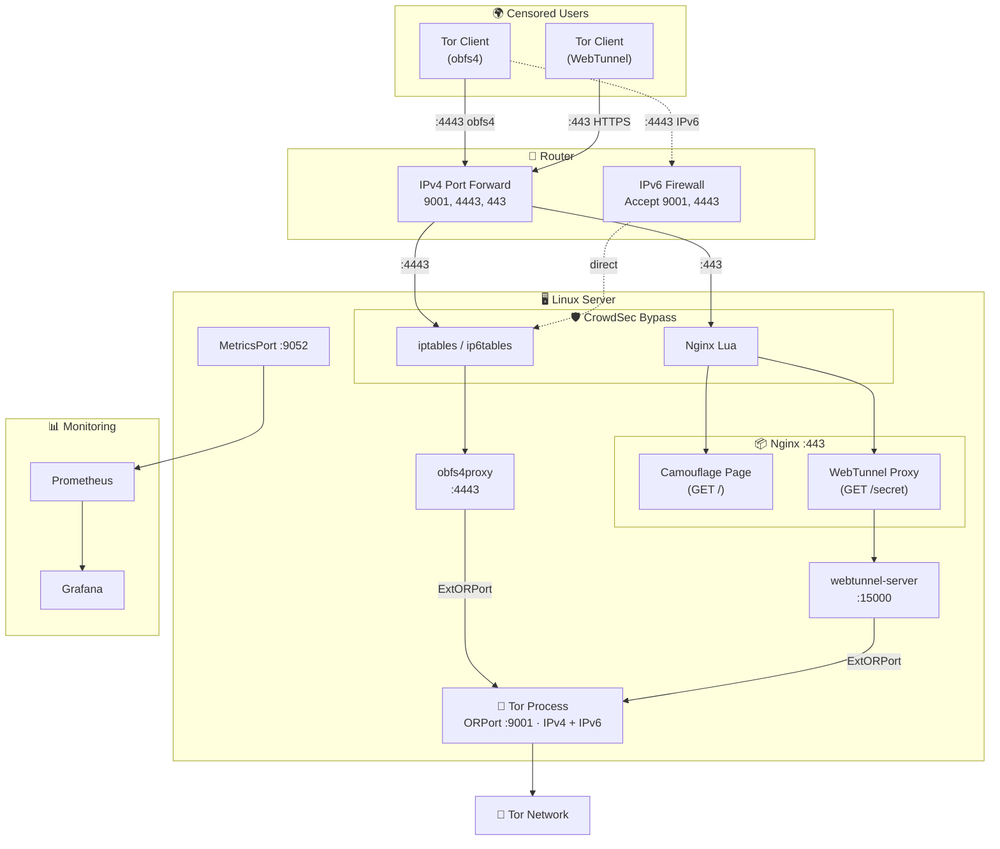

import Callout from "@components/ui/Callout.astro";
import TLDRSummary from "@components/ui/TLDRSummary.astro";
import CheckList from "@components/ui/CheckList.astro";
import StepByStep from "@components/ui/StepByStep.astro";
import KeyValue from "@components/ui/KeyValue.astro";
import Prerequisite from "@components/ui/Prerequisite.astro";
import FileContent from "@components/ui/FileContent.astro";
import Mermaid from "@components/ui/Mermaid.astro";
import TerminalCommand from "@components/ui/TerminalCommand.astro";
import TerminalOutput from "@components/ui/TerminalOutput.astro";
import Table from "@components/ui/Table.astro";
import Code from "@components/ui/Code.astro";
import Collapsible from "@components/ui/Collapsible.astro";
import Timeline from "@components/ui/Timeline.astro";
import DecisionTree from "@components/ui/DecisionTree.astro";
import BeforeAfter from "@components/ui/BeforeAfter.astro";
import SecurityRating from "@components/ui/SecurityRating.astro";


In 2026, over **2.5 million people** use the [Tor network](https://www.torproject.org/) every single day to access the free and open internet. Journalists in authoritarian regimes, activists organizing protests, whistleblowers exposing corruption, and ordinary citizens protecting their privacy — all of them depend on a network that is entirely **volunteer-operated**.

The problem? There are only about **2,000 bridges** serving those millions of users. Bridges are the most critical and scarce resource in the Tor ecosystem — they're the first point of contact for users in censored countries, and every new bridge directly helps someone access information freely.

This guide will teach you everything you need to know about the Tor network, onion routing, and how to set up a **production-ready obfs4 + WebTunnel bridge** on Linux — complete with Nginx camouflage, firewall hardening, Prometheus monitoring, and CrowdSec integration.

<TLDRSummary title="TL;DR — one bridge, two pluggable transports">
- **One bridge can run obfs4 and WebTunnel at the same time**, which is worth doing because they fail in different places: obfs4 randomizes the traffic so it matches no protocol, while WebTunnel hides inside ordinary HTTPS on port 443 and survives censors that block "unclassifiable" traffic outright.
- **Nginx is what makes WebTunnel credible.** It fronts the bridge on 443 and serves a real website on every path except the secret one, so a censor probing the host sees a normal site rather than an endpoint that answers oddly.
- **The consensus flags take days, not minutes.** Running and Valid arrive in about an hour, but Stable needs roughly 7 days of continuous uptime and Guard about 8 — a bridge restarted every other day never earns them.
- **Behind NAT, forward TCP 9001, 4443 and 443** — ORPort, obfs4 and WebTunnel respectively — and open them on the host firewall; the ORPort self-test fails silently if the router does not.
- **Tell your IDS to leave Tor clients alone.** CrowdSec sees many connections from many addresses and bans legitimate users unless the bridge ports are excluded.
- **Everything runs under systemd**, so the stack comes back after a reboot without intervention — which is exactly what the uptime-based flags require.
</TLDRSummary>

---

## The Tor Network: A Primer

### What is Tor?

**[Tor](https://en.wikipedia.org/wiki/Tor_%28network%29)** (The Onion Router) is a decentralized, volunteer-operated network designed to protect users' privacy and resist censorship. When you use Tor, your internet traffic is routed through a series of encrypted relays, making it extremely difficult for anyone — your ISP, government, or a malicious actor — to trace your activity back to you.

But Tor isn't just a privacy tool. It's an essential piece of **human rights infrastructure**. In countries like China, Iran, Russia, and Myanmar, where governments actively block access to information, Tor is often the only way for citizens to reach the uncensored internet.

<Callout type="info" title="A Common Misconception">
Only about **1.5%** of Tor traffic goes to `.onion` sites (the so-called "dark web"). The vast majority — over **98%** — is ordinary people browsing the regular internet privately. Tor is primarily a privacy and anti-censorship tool, not a gateway to illegal content.
</Callout>

### A Brief History

The [origins of Tor](https://www.onion-router.net/History.html) trace back to the 1990s at the **U.S. Naval Research Laboratory** (NRL), where researchers [Paul Syverson](https://en.wikipedia.org/wiki/Paul_Syverson), David Goldschlag, and Michael Reed developed the concept of [onion routing](https://en.wikipedia.org/wiki/Onion_routing) — a technique for anonymous communication over a computer network. You can read more about [Tor's full history](https://www.torproject.org/about/history/) on the official site.

<Timeline events={[
  { date: "1995", title: "Onion Routing Invented", description: "Syverson, Goldschlag, and Reed at the U.S. Naval Research Laboratory develop the concept of layered encryption for anonymous communication.", type: "milestone" },
  { date: "2002", title: "Tor Project Launched", description: "Roger Dingledine and Nick Mathewson (MIT graduates) join Syverson to build 'The Onion Router' — Tor. The code is released as open-source with about a dozen volunteer nodes.", type: "success" },
  { date: "2004", title: "EFF Begins Funding", description: "The Electronic Frontier Foundation recognizes Tor's importance for digital rights and provides critical early funding. NRL releases the code to the public domain.", type: "success" },
  { date: "2006", title: "Tor Project, Inc. Founded", description: "The Tor Project becomes a 501(c)(3) nonprofit organization based in Massachusetts, ensuring long-term development and governance.", type: "milestone" },
  { date: "2007", title: "Bridges Introduced", description: "Secret relay addresses (bridges) are developed to help users bypass firewalls in censored countries where the Tor directory is blocked.", type: "success" },
  { date: "2008", title: "Tor Browser Development Begins", description: "A dedicated browser that packages Tor into an easy-to-use application, dramatically lowering the barrier to entry for non-technical users.", type: "success" },
  { date: "2011", title: "Arab Spring", description: "Tor plays a critical role as activists in Tunisia, Egypt, Libya, and Syria use it to organize protests and communicate securely despite government censorship.", type: "milestone" },
  { date: "2013", title: "Snowden Revelations", description: "Edward Snowden's disclosures about global mass surveillance programs drive a massive surge in Tor adoption worldwide.", type: "warning" },
  { date: "2023", title: "WebTunnel Released", description: "A new pluggable transport that disguises Tor traffic as ordinary HTTPS, making it nearly impossible to block without collateral damage.", type: "success" },
  { date: "2026", title: "Today", description: "~8,000 relays, ~2,000 bridges, and 2.5+ million daily users across 200+ countries. The network is entirely volunteer-operated.", type: "default" },
]} />

### How Onion Routing Works

[Onion routing](https://en.wikipedia.org/wiki/Onion_routing) derives its name from the layers of an onion — your data is wrapped in **multiple layers of encryption**, and each relay in the circuit "peels off" one layer to reveal the next destination. No single relay ever knows both the origin and the destination of the traffic.

<Mermaid caption="Onion routing: three layers of encryption through three relays" maxWidth="800px" ariaLabel="Diagram showing how data travels through a Tor circuit: the user's client encrypts data with three layers (one for each relay), then sends it through the guard, middle, and exit relays. Each relay removes one layer of encryption. The guard knows the user but not the destination. The exit knows the destination but not the user.">

</Mermaid>

Here's what makes this secure:

<Table title="What Each Relay Knows">
  <thead>
    <tr>
      <th scope="col">Relay</th>
      <th scope="col">Knows</th>
      <th scope="col">Doesn't Know</th>
    </tr>
  </thead>
  <tbody>
    <tr>
      <td>**Guard** (Entry)</td>
      <td>Your real IP address</td>
      <td>What websites you're visiting</td>
    </tr>
    <tr>
      <td>**Middle**</td>
      <td>Previous and next relay only</td>
      <td>Neither your IP nor your destination</td>
    </tr>
    <tr>
      <td>**Exit**</td>
      <td>The destination website</td>
      <td>Your real IP address</td>
    </tr>
  </tbody>
</Table>

Key technical details of Tor's [circuit construction](https://spec.torproject.org/tor-spec/creating-circuits.html) (see also the [system overview](https://tpo.pages.torproject.net/core/torspec/tor-spec/system-overview.html) in the Tor specification):

- **Circuit path selection**: The client randomly selects relays, avoiding two relays in the same `/16` subnet or country for diversity.
- **Key exchange**: Each hop uses an **ntor handshake** (based on Curve25519) to establish a shared secret, providing perfect forward secrecy.
- **Fixed-size cells**: All data inside Tor is transmitted in **512-byte cells**, preventing traffic analysis based on packet size.
- **Circuit rotation**: Circuits are rotated approximately every **10 minutes** to limit the window for traffic correlation attacks.
- **Directory authorities**: Nine trusted servers maintain consensus about the network state, relay keys, and flags.

---

## The Tor Ecosystem: Types of Volunteers

The Tor network is made up of different types of volunteer-operated nodes, each serving a distinct purpose:

<Table title="Tor Volunteer Roles">
  <thead>
    <tr>
      <th scope="col">Role</th>
      <th scope="col">What It Does</th>
      <th scope="col">Risk Level</th>
      <th scope="col">Impact</th>
    </tr>
  </thead>
  <tbody>
    <tr>
      <td>**Guard Relay**</td>
      <td>First hop in the circuit. Sees user IP but not destination.</td>
      <td>Low</td>
      <td>High — provides bandwidth</td>
    </tr>
    <tr>
      <td>**Middle Relay**</td>
      <td>Intermediate hop. Sees nothing useful.</td>
      <td>Very Low</td>
      <td>Medium — adds bandwidth and path diversity</td>
    </tr>
    <tr>
      <td>**Exit Relay**</td>
      <td>Final hop. Connects to the destination on behalf of the user.</td>
      <td>High</td>
      <td>Very High — the most needed and scarce resource</td>
    </tr>
    <tr>
      <td>**Bridge**</td>
      <td>Hidden entry point for users in censored countries. Not listed in the public Tor directory.</td>
      <td>Low</td>
      <td>**Critical** — directly enables censorship circumvention</td>
    </tr>
    <tr>
      <td>**Snowflake Proxy**</td>
      <td>Ephemeral WebRTC proxy that helps censored users reach the Tor network.</td>
      <td>Very Low</td>
      <td>Medium — easy to run, even in a browser tab</td>
    </tr>
    <tr>
      <td>**Directory Authority**</td>
      <td>Trusted server that maintains network consensus.</td>
      <td>N/A</td>
      <td>Critical — only 9 exist, run by the Tor Project</td>
    </tr>
  </tbody>
</Table>

<Callout type="tip" title="Why Bridges Matter Most Right Now">
As of 2026, the [Tor network has roughly **8,000 relays** but only about **2,000 bridges**](https://metrics.torproject.org/). Bridges are particularly valuable because they serve users who are **actively blocked** from accessing Tor — people in countries like China, Iran, and Russia where the government blocks connections to known Tor relays. Every new bridge is a **lifeline** for someone under censorship.
</Callout>

### Understanding Pluggable Transports

Censors don't just block Tor by IP — they use **Deep Packet Inspection (DPI)** to identify and block the Tor protocol itself. [Pluggable transports](https://arxiv.org/pdf/2309.14856) solve this by disguising Tor traffic as something else entirely.

<Table title="Pluggable Transport Comparison">
  <thead>
    <tr>
      <th scope="col">Transport</th>
      <th scope="col">Disguise Method</th>
      <th scope="col">Censorship Resistance</th>
      <th scope="col">Speed</th>
      <th scope="col">Deployment</th>
    </tr>
  </thead>
  <tbody>
    <tr>
      <td>**[obfs4](https://gitlab.torproject.org/tpo/anti-censorship/pluggable-transports/lyrebird)**</td>
      <td>Makes traffic look like random bytes</td>
      <td>High — resists DPI fingerprinting</td>
      <td>Fast</td>
      <td>Widely deployed, easy to set up</td>
    </tr>
    <tr>
      <td>**[WebTunnel](https://gitlab.torproject.org/tpo/anti-censorship/pluggable-transports/webtunnel)**</td>
      <td>Mimics HTTPS/WebSocket traffic</td>
      <td>Very High — looks like normal web browsing</td>
      <td>Fast</td>
      <td>Newer, requires web server + domain</td>
    </tr>
    <tr>
      <td>**Snowflake**</td>
      <td>Uses WebRTC through ephemeral proxies</td>
      <td>Very High — proxies rotate constantly</td>
      <td>Variable</td>
      <td>Client-side only (volunteers run browser proxies)</td>
    </tr>
    <tr>
      <td>**meek**</td>
      <td>Disguises traffic as requests to cloud services (Azure, CDN)</td>
      <td>Extreme — blocking it means blocking cloud services</td>
      <td>Slow</td>
      <td>Expensive to maintain, last resort</td>
    </tr>
  </tbody>
</Table>

<DecisionTree question="Which should you run? Here's how to decide:">
<details>
<summary>I want maximum impact with minimal complexity</summary>

Run an **obfs4 bridge**. It's the most widely deployed pluggable transport, easy to configure, and serves the largest number of users. This is where the Tor Project needs the most help.
</details>
<details>
<summary>I already have a web server and domain name</summary>

Run **both obfs4 and WebTunnel**. WebTunnel disguises Tor traffic as normal HTTPS browsing, making it nearly impossible to block. When combined with obfs4, you provide two different circumvention methods from a single server.
</details>
<details>
<summary>I don't have a server, but I want to help right now</summary>

Install the [Snowflake browser extension](https://snowflake.torproject.org/) — it takes 30 seconds and turns your browser into a temporary proxy for censored users. Zero maintenance required.
</details>
<details>
<summary>I want to contribute maximum bandwidth to the network</summary>

Run a **middle relay** or (if you're comfortable with the legal implications) an **exit relay**. These provide raw bandwidth capacity for the entire network. Consider running them on a VPS with an ISP that explicitly allows Tor traffic.
</details>
</DecisionTree>

In this guide, we'll set up **both obfs4 and WebTunnel** on the same server — maximizing your impact with a single machine.

---

## Prerequisites

<Prerequisite>
### Hardware Requirements
- **CPU**: Any modern x86_64 processor (ARM also works)
- **RAM**: 512 MB minimum, 1 GB+ recommended
- **Storage**: 5 GB minimum (for Tor data, logs, and keys)
- **Network**: At least **10 Mbps** upload bandwidth (more is better)
- **Uptime**: The server should run 24/7 — Tor penalizes unstable relays

### Software Requirements
- **Linux** distribution (this guide uses Debian 12/13 or Ubuntu 22.04+)
- **Root access** (or sudo privileges)
- **Nginx** (for WebTunnel camouflage — not needed for obfs4 only)
- **A domain name** with DNS pointing to your server (for WebTunnel only)
- **TLS certificate** (Let's Encrypt is free and perfect for this)

### Network Requirements
- Ability to **forward ports** from your router (or use a VPS with direct public IP)
- Ports **9001** (ORPort) and **4443** (obfs4) accessible from the internet
- Port **443** (HTTPS) if running WebTunnel
</Prerequisite>

---

## Step 1: Install Tor from the Official Repository

<Callout type="warning" title="Always Use the Official Tor Repository">
Distribution packages (e.g., `apt install tor`) are often outdated by months or even years. The Tor Project maintains its own [Debian/Ubuntu repository](https://community.torproject.org/relay/setup/bridge/) with the latest stable releases, security patches, and signing keys. Always use it.
</Callout>

<StepByStep title="Install Tor and Dependencies">
<li>

**Install prerequisites**

<TerminalCommand ariaLabel="Install prerequisprerequisite packages">
```bash
sudo apt update
sudo apt install -y apt-transport-https gpg curl
```
</TerminalCommand>

</li>
<li>

**Add the Tor Project GPG key**

<TerminalCommand ariaLabel="Download and install Tor Project GPG key">
```bash
curl -fsSL https://deb.torproject.org/torproject.org/A3C4F0F979CAA22CDBA8F512EE8CBC9E886DDD89.asc \
  | sudo gpg --dearmor -o /usr/share/keyrings/tor-archive-keyring.gpg
```
</TerminalCommand>

</li>
<li>

**Add the Tor repository**

Replace `CODENAME` with your distribution's codename (e.g., `bookworm`, `trixie`, `jammy`):

<TerminalCommand ariaLabel="Add Tor APT repository">
```bash
CODENAME=$(lsb_release -cs)
echo "deb [signed-by=/usr/share/keyrings/tor-archive-keyring.gpg] \
  https://deb.torproject.org/torproject.org $CODENAME main" \
  | sudo tee /etc/apt/sources.list.d/tor.list
```
</TerminalCommand>

</li>
<li>

**Install Tor and obfs4proxy**

<TerminalCommand ariaLabel="Install Tor and obfs4proxy">
```bash
sudo apt update
sudo apt install -y tor deb.torproject.org-keyring obfs4proxy
```
</TerminalCommand>

Verify the installation:

<TerminalCommand ariaLabel="Verify Tor and obfs4proxy versions">
```bash
tor --version
obfs4proxy -version
```
</TerminalCommand>

<TerminalOutput title="Expected output">
```
Tor version 0.4.9.6.
obfs4proxy-0.0.14
```
</TerminalOutput>

</li>
</StepByStep>

---

## Step 2: Install WebTunnel (Optional but Recommended)

WebTunnel is a newer pluggable transport that disguises Tor connections as regular HTTPS traffic. Unlike obfs4 (which looks like random data), WebTunnel actually uses WebSocket upgrades over HTTPS, making it **nearly indistinguishable from legitimate web browsing**. The Tor Project provides [official setup instructions](https://community.torproject.org/relay/setup/webtunnel/) and a guide for [building from source](https://community.torproject.org/relay/setup/webtunnel/source/).

<Callout type="info" title="Why Compile from Source?">
At the time of writing, the `webtunnel-server` binary is not yet available as a Debian package. The Tor Project distributes it as a Go source that needs to be compiled, or as a Docker image. We'll compile from source for a native installation.
</Callout>

<StepByStep title="Compile WebTunnel Server">
<li>

**Install Go** (if not already installed)

<TerminalCommand ariaLabel="Install Go programming language">
```bash
sudo apt install -y golang-go
```
</TerminalCommand>

Verify that Go 1.21+ is installed:

<TerminalCommand ariaLabel="Check Go version">
```bash
go version
```
</TerminalCommand>

</li>
<li>

**Clone and build WebTunnel**

<TerminalCommand ariaLabel="Clone and build WebTunnel from source">
```bash
cd /tmp
git clone https://gitlab.torproject.org/tpo/anti-censorship/pluggable-transports/webtunnel.git
cd webtunnel/main/server
go build -o webtunnel-server .
sudo cp webtunnel-server /usr/local/bin/
sudo chmod +x /usr/local/bin/webtunnel-server
```
</TerminalCommand>

</li>
<li>

**Verify the binary**

<TerminalCommand ariaLabel="Verify WebTunnel server binary">
```bash
/usr/local/bin/webtunnel-server --help 2>&1 | head -5
```
</TerminalCommand>

</li>
</StepByStep>

---

## Step 3: Configure the Tor Bridge

Now for the main configuration. The `torrc` file controls all of Tor's behavior.

<Callout type="warning" title="Before Editing">
Back up the original configuration before making changes:

<TerminalCommand ariaLabel="Backup original torrc">
```bash
sudo cp /etc/tor/torrc /etc/tor/torrc.backup
```
</TerminalCommand>
</Callout>

Replace the contents of `/etc/tor/torrc` with:

<FileContent filename="/etc/tor/torrc" language="ini" collapsible={false}>
```ini
# =============================================================
# Tor Bridge Configuration — obfs4 + WebTunnel
# =============================================================

# --- General Settings ---
SocksPort 0                        # Not a client — disable SOCKS
RunAsDaemon 0                      # Managed by systemd
DataDirectory /var/lib/tor
Log notice file /var/log/tor/notices.log
Log notice syslog

# --- Security Hardening ---
DisableDebuggerAttachment 1        # Prevent ptrace/debugger attachment

# --- Bridge Mode ---
BridgeRelay 1                      # This is a bridge, not a relay
PublishServerDescriptor bridge     # Publish to BridgeDB (not public directory)

# --- ORPort — IPv4 (NAT from router) + IPv6 (direct, global) ---
# IMPORTANT: Use 0.0.0.0 for NAT environments, not 127.0.0.1
ORPort 0.0.0.0:9001
ORPort [YOUR_IPV6_ADDRESS]:9001
ExtORPort auto

# --- Contact & Identity ---
ContactInfo your-email<at>example<dot>com
Nickname YourBridgeName

# --- obfs4 Transport ---
# Port 4443 must be forwarded from your router
ServerTransportPlugin obfs4 exec /usr/bin/obfs4proxy
ServerTransportListenAddr obfs4 0.0.0.0:4443

# --- WebTunnel Transport ---
# Listens locally; Nginx reverse-proxies HTTPS to it
ServerTransportPlugin webtunnel exec /usr/local/bin/webtunnel-server
ServerTransportListenAddr webtunnel 127.0.0.1:15000
ServerTransportOptions webtunnel url=https://YOUR-DOMAIN/YOUR-SECRET-PATH

# --- Bandwidth Limits ---
# Adjust to what your connection can sustain (example: 250 Mbps)
RelayBandwidthRate 31 MBytes       # Sustained rate
RelayBandwidthBurst 35 MBytes     # Burst allowance

# --- Memory — cap internal queue memory (OOM protection) ---
MaxMemInQueues 4096 MB

# --- Statistics ---
ConnDirectionStatistics 1          # Enable connection direction stats

# --- DoS Protection ---
DoSRefuseSingleHopClientRendezvous 1

# --- Monitoring: Prometheus Metrics ---
MetricsPort 0.0.0.0:9052
MetricsPortPolicy accept 192.168.0.0/16
MetricsPortPolicy accept 127.0.0.0/8

# --- Control Port (for Nyx monitoring tool) ---
ControlPort 9051
CookieAuthentication 1
```
</FileContent>

Let's break down the critical sections:

<KeyValue
  title="Key Configuration Options Explained"
  items={[
    { key: "BridgeRelay 1", value: "Bridge mode", description: "Tells Tor this is a bridge, not a public relay. Bridges are not listed in the public Tor directory." },
    { key: "ORPort 0.0.0.0:9001", value: "Onion Router Port (IPv4)", description: "The port Tor uses for relay-to-relay communication. Use 0.0.0.0 (not 127.0.0.1) if behind NAT — Tor needs to bind on all interfaces for the self-test to pass." },
    { key: "ORPort [IPV6]:9001", value: "Onion Router Port (IPv6)", description: "If your server has a global IPv6 address, add a second ORPort line with it. IPv6 is globally routable — no NAT or port forwarding needed, only firewall rules." },
    { key: "ExtORPort auto", value: "Extended OR Port", description: "Internal communication channel between Tor and pluggable transports. 'auto' lets Tor choose a random local port." },
    { key: "DisableDebuggerAttachment 1", value: "Anti-ptrace protection", description: "Prevents debuggers from attaching to the Tor process. A simple but effective defense against local privilege escalation." },
    { key: "MaxMemInQueues 4096 MB", value: "Memory cap for queues", description: "Limits the memory Tor uses for internal queues. Prevents out-of-memory (OOM) kills on servers with limited RAM. Adjust based on your available memory." },
    { key: "ConnDirectionStatistics 1", value: "Connection direction stats", description: "Enables collection of statistics about connection directionality, useful for monitoring and debugging via MetricsPort." },
    { key: "DoSRefuseSingleHopClientRendezvous 1", value: "DoS protection", description: "Refuses rendezvous circuits from single-hop clients. These are commonly used in abuse and denial-of-service attacks against hidden services." },
    { key: "ServerTransportListenAddr obfs4", value: "obfs4 listening address", description: "The port where obfs4proxy listens for incoming obfuscated connections. Must be reachable from the internet." },
    { key: "ServerTransportListenAddr webtunnel", value: "WebTunnel listening address", description: "Binds to 127.0.0.1 only because Nginx handles the public-facing HTTPS and reverse-proxies to this port." },
    { key: "MetricsPort", value: "Prometheus endpoint", description: "Exposes Tor internal metrics in Prometheus format. Restrict access with MetricsPortPolicy." },
  ]}
/>

<Callout type="error" title="Critical: ORPort Behind NAT">
If your server is behind a router (NAT), using `ORPort 127.0.0.1:auto` will **fail** the self-reachability test. Tor needs to verify that its ORPort is accessible from the internet, and binding to localhost prevents this. Always use `ORPort 0.0.0.0:9001` (or your specific LAN IP) and forward port 9001 from your router.
</Callout>

<Callout type="tip" title="Dual-Stack: IPv4 + IPv6">
If your ISP provides an IPv6 prefix, **strongly consider adding an IPv6 ORPort**. Dual-stack bridges can serve more users because some networks only have IPv6 connectivity. To find your server's global IPv6 address:

<TerminalCommand ariaLabel="Find your server global IPv6 address">
```bash
ip -6 addr show scope global | grep inet6
```
</TerminalCommand>

Use the address (without the `/64` prefix) in your `torrc`:

```ini
ORPort [2001:db8::1]:9001
```

Unlike IPv4, IPv6 addresses are **globally routable** — no NAT or port forwarding is required. You only need to ensure your firewall allows incoming TCP on port 9001 to that address.
</Callout>

### Generate a WebTunnel Secret Path

The WebTunnel transport uses a secret URL path that acts as an authentication token. Generate a random 24-character string:

<TerminalCommand ariaLabel="Generate a random WebTunnel secret path">
```bash
echo $(cat /dev/urandom | tr -cd 'a-zA-Z0-9' | head -c 24)
```
</TerminalCommand>

<TerminalOutput title="Example output">
```
7Zkw18j2NWGK9X7PiiPUQRJB
```
</TerminalOutput>

Use this value in two places:
1. The `torrc`: `ServerTransportOptions webtunnel url=https://your-domain.com/YOUR_SECRET`
2. The Nginx config: `location = /YOUR_SECRET`

---

## Step 4: Configure Nginx for WebTunnel Camouflage

The beauty of WebTunnel is that your server looks like a **completely normal website**. Visitors see a regular HTML page; only those who know the secret path can connect to the Tor bridge. This is called **camouflage** or **domain fronting**.

<StepByStep title="Set Up Nginx Camouflage">
<li>

**Create a camouflage website**

This is what visitors (and censors) see when they visit your domain:

<TerminalCommand ariaLabel="Create camouflage website directory and page">
```bash
sudo mkdir -p /var/www/tor-camouflage
cat << 'EOF' | sudo tee /var/www/tor-camouflage/index.html
<!DOCTYPE html>
<html lang="en">
<head>
    <meta charset="UTF-8">
    <meta name="viewport" content="width=device-width, initial-scale=1.0">
    <title>Welcome</title>
    <style>
        body { font-family: system-ui, sans-serif; max-width: 800px;
               margin: 50px auto; padding: 20px; color: #333; }
        h1 { color: #2c3e50; }
    </style>
</head>
<body>
    <h1>Welcome</h1>
    <p>This is a personal project page. Nothing to see here.</p>
</body>
</html>
EOF
```
</TerminalCommand>

</li>
<li>

**Obtain a TLS certificate** (if you don't already have one)

<TerminalCommand ariaLabel="Obtain Let's Encrypt certificate">
```bash
sudo apt install -y certbot python3-certbot-nginx
sudo certbot --nginx -d your-domain.com
```
</TerminalCommand>

</li>
<li>

**Create the Nginx server block**

<FileContent filename="/etc/nginx/sites-available/tor-bridge.conf" language="nginx">
```nginx
# Tor WebTunnel Bridge — Camouflage configuration
# This looks like a normal HTTPS website but proxies
# a secret path to the WebTunnel pluggable transport

server {
    listen 443 ssl;
    listen [::]:443 ssl;
    http2 on;

    server_name your-domain.com;

    # TLS certificates
    ssl_certificate     /etc/letsencrypt/live/your-domain.com/fullchain.pem;
    ssl_certificate_key /etc/letsencrypt/live/your-domain.com/privkey.pem;
    ssl_protocols       TLSv1.2 TLSv1.3;
    ssl_ciphers         HIGH:!aNULL:!MD5;

    # === Normal website (camouflage) ===
    root /var/www/tor-camouflage;
    index index.html;

    location / {
        try_files $uri $uri/ =404;
    }

    # === WebTunnel reverse proxy (secret path) ===
    # Replace YOUR_SECRET_PATH with your generated secret
    location = /YOUR_SECRET_PATH {
        proxy_pass http://127.0.0.1:15000;
        proxy_http_version 1.1;

        # WebSocket upgrade headers (required for WebTunnel)
        proxy_set_header Upgrade $http_upgrade;
        proxy_set_header Connection "upgrade";

        # Standard proxy headers
        proxy_set_header Host $host;
        proxy_set_header X-Real-IP $remote_addr;
        proxy_set_header X-Forwarded-For $proxy_add_x_forwarded_for;
        proxy_set_header X-Forwarded-Proto $scheme;
        proxy_set_header Accept-Encoding "";
        add_header Front-End-Https on;

        proxy_redirect off;
        proxy_buffering off;
        proxy_request_buffering off;

        # Long timeout for persistent Tor connections
        proxy_read_timeout 36000s;
        proxy_send_timeout 36000s;

        # Disable logging for the secret path (privacy)
        access_log off;
        error_log off;
    }
}

# HTTP to HTTPS redirect
server {
    listen 80;
    listen [::]:80;
    server_name your-domain.com;
    return 301 https://$host$request_uri;
}
```
</FileContent>

</li>
<li>

**Enable the site and test**

<TerminalCommand ariaLabel="Enable Nginx site and test configuration">
```bash
sudo ln -sf /etc/nginx/sites-available/tor-bridge.conf \
    /etc/nginx/sites-enabled/
sudo nginx -t && sudo systemctl reload nginx
```
</TerminalCommand>

</li>
</StepByStep>

<BeforeAfter beforeLabel="What censors see" afterLabel="What actually happens">
<div slot="before">

**Normal HTTPS website**

A `GET /` request to your domain returns a plain HTML page. DPI sees standard TLS 1.3 traffic to a registered domain. Nothing suspicious.

```
HTTP/1.1 200 OK
Content-Type: text/html
<html>Welcome...</html>
```
</div>
<div slot="after">

**WebTunnel bridge connection**

A `GET /SECRET_PATH` with a `Connection: Upgrade` header reaches the WebTunnel server, which establishes a persistent tunnel for Tor traffic — all inside the same TLS session.

```
HTTP/1.1 101 Switching Protocols
Upgrade: websocket
Connection: Upgrade
[Tor traffic flows through the tunnel]
```
</div>
</BeforeAfter>

---

## Step 5: Configure Port Forwarding

If your server is behind a router (common in home setups), you need to forward the following ports from your router's public IP to your server's local IP:

<Table title="Required Port Forwards">
  <thead>
    <tr>
      <th scope="col">Port</th>
      <th scope="col">Protocol</th>
      <th scope="col">Purpose</th>
      <th scope="col">Required?</th>
    </tr>
  </thead>
  <tbody>
    <tr>
      <td>**9001**</td>
      <td>TCP</td>
      <td>ORPort — relay-to-relay communication</td>
      <td>Yes (always)</td>
    </tr>
    <tr>
      <td>**4443**</td>
      <td>TCP</td>
      <td>obfs4 — obfuscated transport</td>
      <td>Yes (if running obfs4)</td>
    </tr>
    <tr>
      <td>**443**</td>
      <td>TCP</td>
      <td>HTTPS — WebTunnel via Nginx</td>
      <td>Yes (if running WebTunnel)</td>
    </tr>
  </tbody>
</Table>

The exact steps depend on your router. Here's the general process:

<StepByStep title="Generic Router Port Forwarding">
<li>

**Access your router's admin panel** (usually at `192.168.0.1` or `192.168.1.1`)

</li>
<li>

**Find the port forwarding section** (often under "NAT", "Firewall", or "Port Forwarding")

</li>
<li>

**Create rules for each port:**
- **External port**: 9001 → **Internal IP**: your server's LAN IP → **Internal port**: 9001
- **External port**: 4443 → **Internal IP**: your server's LAN IP → **Internal port**: 4443
- **External port**: 443 → **Internal IP**: your server's LAN IP → **Internal port**: 443 (if not already forwarded)

</li>
<li>

**Save and apply** the changes

</li>
</StepByStep>

### Server Firewall (UFW)

If you're using UFW (Uncomplicated Firewall) on your server:

<TerminalCommand ariaLabel="Configure UFW for Tor bridge ports">
```bash
sudo ufw allow 9001/tcp comment "Tor ORPort"
sudo ufw allow 4443/tcp comment "Tor obfs4 Bridge"
# Port 443 is likely already open if you run Nginx
sudo ufw allow 443/tcp comment "HTTPS"
sudo ufw reload
```
</TerminalCommand>

If using `iptables` directly:

<TerminalCommand ariaLabel="Configure iptables for Tor bridge ports">
```bash
sudo iptables -A INPUT -p tcp --dport 9001 -j ACCEPT
sudo iptables -A INPUT -p tcp --dport 4443 -j ACCEPT
sudo iptables -A INPUT -p tcp --dport 443 -j ACCEPT
```
</TerminalCommand>

### IPv6: No NAT Needed

Unlike IPv4, IPv6 addresses are **globally routable** — there is no NAT. This means your server's IPv6 address is directly reachable from the internet without port forwarding. However, you still need to:

1. **Allow the ports in your server's firewall** (UFW handles both IPv4 and IPv6 automatically)
2. **Allow the ports in your router's IPv6 firewall** — most routers have a separate IPv6 firewall that blocks all incoming traffic by default

<Callout type="warning" title="Router IPv6 Firewall">
Most routers **block all inbound IPv6** by default (unlike IPv4 where only NAT provides the "firewall"). You need to create explicit **allow rules** in your router's IPv6 firewall for TCP ports 9001 and 4443 to reach your server's IPv6 address. No destination NAT is needed — just firewall accept rules.
</Callout>

<TerminalCommand ariaLabel="Verify IPv6 firewall rules">
```bash
# Verify your server's IPv6 address
ip -6 addr show scope global | grep inet6

# Verify IPv6 firewall rules on the server
sudo ip6tables -L INPUT -n | grep -E "9001|4443"

# Test IPv6 reachability from another machine
nc -6zv YOUR_IPV6_ADDRESS 9001
```
</TerminalCommand>

---

## Step 6: AppArmor Configuration

On Debian/Ubuntu systems, AppArmor may restrict what Tor and obfs4proxy can do. You need to ensure the obfs4proxy profile allows execution:

<TerminalCommand ariaLabel="Configure AppArmor for obfs4proxy">
```bash
# Check if the profile exists
sudo aa-status 2>/dev/null | grep obfs4proxy

# If restricted, set to complain mode
sudo aa-complain /usr/bin/obfs4proxy 2>/dev/null

# Or create an explicit allow rule
echo "/usr/bin/obfs4proxy mr," | sudo tee -a /etc/apparmor.d/local/system_tor
sudo apparmor_parser -r /etc/apparmor.d/system_tor
```
</TerminalCommand>

---

## Step 7: Start and Verify

<StepByStep title="Launch the Bridge">
<li>

**Start Tor**

<TerminalCommand ariaLabel="Restart Tor service">
```bash
sudo systemctl restart tor
```
</TerminalCommand>

</li>
<li>

**Check the logs for successful bootstrap**

<TerminalCommand ariaLabel="Watch Tor bootstrap process">
```bash
sudo journalctl -u tor -f --no-pager | head -30
```
</TerminalCommand>

Look for these key messages:

<TerminalOutput title="Successful bootstrap output">
```
Bootstrapped 0% (starting): Starting
Bootstrapped 5% (conn): Connecting to a relay
Bootstrapped 10% (conn_done): Connected to a relay
Bootstrapped 14% (handshake): Handshaking with a relay
Bootstrapped 15% (handshake_done): Handshake with a relay done
Bootstrapped 75% (enough_dirinfo): Loaded enough directory info to build circuits
Bootstrapped 90% (ap_handshake_done): Handshake finished with a relay to build circuits
Bootstrapped 95% (circuit_create): Establishing a Tor circuit
Bootstrapped 100% (done): Done
Self-testing indicates your ORPort 86.x.x.x:9001 is reachable from the outside. Excellent.
Registered server transport 'obfs4' at '0.0.0.0:4443'
Registered server transport 'webtunnel' at '127.0.0.1:15000'
```
</TerminalOutput>

</li>
<li>

**Verify all three processes are running**

<TerminalCommand ariaLabel="Check that Tor, obfs4proxy, and webtunnel-server are running">
```bash
ps aux | grep -E "(tor|obfs4|webtunnel)" | grep -v grep
```
</TerminalCommand>

You should see three processes: `tor`, `obfs4proxy`, and `webtunnel-server`.

</li>
<li>

**Verify all ports are listening**

<TerminalCommand ariaLabel="Check listening ports for Tor bridge">
```bash
ss -tlnp | grep -E "(9001|4443|15000|9051|9052)"
```
</TerminalCommand>

<TerminalOutput title="Expected listening ports">
```
LISTEN  0  4096   0.0.0.0:9001   0.0.0.0:*  users:(("tor",pid=...,fd=...))
LISTEN  0  4096   0.0.0.0:4443   0.0.0.0:*  users:(("obfs4proxy",pid=...,fd=...))
LISTEN  0  4096 127.0.0.1:15000  0.0.0.0:*  users:(("webtunnel-ser",pid=...,fd=...))
LISTEN  0  4096 127.0.0.1:9051   0.0.0.0:*  users:(("tor",pid=...,fd=...))
LISTEN  0  4096   0.0.0.0:9052   0.0.0.0:*  users:(("tor",pid=...,fd=...))
```
</TerminalOutput>

</li>
<li>

**Retrieve your bridge fingerprint**

<TerminalCommand ariaLabel="Get bridge fingerprint">
```bash
cat /var/lib/tor/fingerprint
```
</TerminalCommand>

</li>
</StepByStep>

### Verify External Reachability

From a different machine (or using an online port checker), verify that your ports are accessible:

<TerminalCommand ariaLabel="Test ORPort reachability from another machine">
```bash
# From another machine:
nc -zv YOUR_PUBLIC_IP 9001
nc -zv YOUR_PUBLIC_IP 4443
curl -I https://your-domain.com/
```
</TerminalCommand>

<Callout type="tip" title="The ORPort Self-Test">
Tor performs its own reachability test during bootstrap. If you see `Self-testing indicates your ORPort is reachable from the outside`, you're good. If the self-test fails, double-check your port forwarding rules and firewall configuration.
</Callout>

---

## Step 8: Monitoring with Prometheus and Grafana

Tor exposes a rich set of metrics via its `MetricsPort` in Prometheus format. These metrics let you monitor bandwidth usage, connections, circuit building, and relay health in real time.

### Configure Prometheus Scraping

Add a scrape target for your Tor bridge in your Prometheus configuration:

<FileContent filename="prometheus.yml (snippet)" language="yaml">
```yaml
scrape_configs:
  - job_name: 'tor-bridge'
    scrape_interval: 30s
    scrape_timeout: 10s
    metrics_path: '/metrics'
    static_configs:
      - targets: ['YOUR_SERVER_IP:9052']
        labels:
          instance: 'tor-bridge'
          nickname: 'YourBridgeName'
```
</FileContent>

<Callout type="info" title="Firewall for Metrics Port">
The MetricsPort (9052) should **only** be accessible from your monitoring server, not the public internet. Use `MetricsPortPolicy accept YOUR_MONITORING_IP/32` in `torrc` and restrict access via firewall:

<TerminalCommand ariaLabel="Restrict MetricsPort to monitoring server">
```bash
sudo ufw allow from YOUR_MONITORING_IP to any port 9052 proto tcp \
  comment "Prometheus: Tor Bridge Metrics"
```
</TerminalCommand>
</Callout>

### Key Metrics to Monitor

Tor exposes dozens of Prometheus metrics. Here are the most important ones for a bridge operator:

<Table title="Essential Tor Prometheus Metrics">
  <thead>
    <tr>
      <th scope="col">Metric</th>
      <th scope="col">Type</th>
      <th scope="col">What It Tells You</th>
    </tr>
  </thead>
  <tbody>
    <tr>
      <td>`tor_relay_connections_total`</td>
      <td>Counter</td>
      <td>Total connections by type and direction (inbound/outbound, OR/directory)</td>
    </tr>
    <tr>
      <td>`tor_relay_traffic_bytes`</td>
      <td>Counter</td>
      <td>Total bytes read/written — your bandwidth contribution to the network</td>
    </tr>
    <tr>
      <td>`tor_relay_flag`</td>
      <td>Gauge</td>
      <td>Directory flags assigned to your relay (Stable, Running, Valid, etc.)</td>
    </tr>
    <tr>
      <td>`tor_relay_circuits_total`</td>
      <td>Gauge</td>
      <td>Number of active circuits by state (opened, closed, etc.)</td>
    </tr>
    <tr>
      <td>`tor_relay_streams_total`</td>
      <td>Counter</td>
      <td>Streams processed — a proxy for actual user connections</td>
    </tr>
    <tr>
      <td>`tor_relay_load_oom_bytes_total`</td>
      <td>Counter</td>
      <td>Out-of-memory events — if this increases, add more RAM</td>
    </tr>
    <tr>
      <td>`tor_relay_load_tcp_exhaustion_total`</td>
      <td>Counter</td>
      <td>TCP port exhaustion — if this increases, tune kernel network settings</td>
    </tr>
    <tr>
      <td>`process_resident_memory_bytes`</td>
      <td>Gauge</td>
      <td>Current RAM usage of the Tor process</td>
    </tr>
    <tr>
      <td>`process_cpu_seconds_total`</td>
      <td>Counter</td>
      <td>CPU time consumed by Tor</td>
    </tr>
  </tbody>
</Table>

### Grafana Dashboard

You can build a comprehensive Grafana dashboard with panels for:

1. **Bandwidth** — `rate(tor_relay_traffic_bytes[5m])` — real-time throughput in/out
2. **Connections** — `tor_relay_connections_total` by type — who's connecting
3. **Relay Flags** — `tor_relay_flag` — has the network recognized your bridge?
4. **Circuits** — `tor_relay_circuits_total` — how many circuits are active
5. **System Resources** — `process_resident_memory_bytes`, `process_cpu_seconds_total`
6. **Health** — `tor_relay_load_oom_bytes_total`, `tor_relay_load_tcp_exhaustion_total`

<Callout type="tip" title="Relay Flags Timeline">
After starting your bridge, relay flags will appear gradually:

- **Running**: ~1 hour after starting
- **Valid**: ~1 hour
- **Stable**: ~7 days of continuous uptime
- **Guard**: ~8 days (if applicable)

Be patient — the Tor directory authorities take time to trust new relays. Keep your bridge running consistently and the flags will come.
</Callout>

### Nyx: Terminal-Based Monitoring

[Nyx](https://nyx.torproject.org/) is a terminal UI for monitoring Tor in real time. It connects to the ControlPort and shows bandwidth graphs, connections, circuits, and configuration.

<TerminalCommand ariaLabel="Install and run Nyx">
```bash
sudo apt install -y nyx
sudo -u debian-tor nyx
```
</TerminalCommand>

---

## Step 9: CrowdSec Integration (If Applicable)

If you run [CrowdSec](https://www.crowdsec.net/) on the same server (common when running Nginx), you'll face a challenge: CrowdSec is designed to block malicious IPs, but **Tor bridge clients may trigger false positives**. Legitimate Tor users connecting to your bridge could get blocked by your own IDS.

<Callout type="warning" title="The Problem">
CrowdSec's firewall bouncer adds a `CROWDSEC_CHAIN` at the top of your iptables INPUT chain, and the Nginx bouncer checks every request against a blocklist. Both can inadvertently block legitimate Tor bridge clients.
</Callout>

The solution is a **three-layer bypass** that ensures Tor traffic is never blocked:

### Layer 1: iptables — Bypass the Firewall Bouncer

Insert ACCEPT rules for Tor-specific ports **before** the CROWDSEC_CHAIN:

<TerminalCommand ariaLabel="Add iptables bypass rules for Tor ports">
```bash
# IPv4
sudo iptables -I INPUT 1 -p tcp --dport 4443 -j ACCEPT  # obfs4
sudo iptables -I INPUT 1 -p tcp --dport 9001 -j ACCEPT  # ORPort

# IPv6
sudo ip6tables -I INPUT 1 -p tcp --dport 4443 -j ACCEPT
sudo ip6tables -I INPUT 1 -p tcp --dport 9001 -j ACCEPT
```
</TerminalCommand>

<Callout type="info" title="Why Not Port 443?">
Port 443 is shared with all your HTTPS services, not just Tor. Bypassing CrowdSec for **all** HTTPS traffic would create a security hole. Instead, the WebTunnel bypass for port 443 is handled at the Nginx level (Layer 2), where we can filter by domain name.
</Callout>

### Layer 2: Nginx — Bypass the Lua Bouncer

If your CrowdSec Nginx bouncer uses a `rewrite_by_lua_block` at the `http {}` level, add an exception for your Tor domain:

<FileContent filename="/etc/nginx/conf.d/crowdsec_nginx.conf (modified section)" language="lua">
```lua
rewrite_by_lua_block {
    local cs = require "plugins.crowdsec.lib.crowdsec"

    -- Bypass CrowdSec for Tor bridge domain
    if ngx.var.host == "your-tor-domain.com" then
        -- Skip CrowdSec check entirely for Tor bridge traffic
    else
        local ok, err = cs.Allow(ngx.var.remote_addr)
        if not ok then
            ngx.exit(ngx.HTTP_CLOSE)
        end
    end
}
```
</FileContent>

### Layer 3: CrowdSec Parser Whitelist

Even with the above, CrowdSec will still **parse** your Tor logs and may create local decisions. Create a parser whitelist so it ignores all traffic to your Tor domain:

<FileContent filename="/etc/crowdsec/parsers/s02-enrich/tor-bridge-whitelist.yaml" language="yaml">
```yaml
name: custom/tor-bridge-whitelist
description: "Ignore all traffic to the Tor bridge domain"
whitelist:
  reason: "Tor bridge traffic — legitimate by definition"
  expression:
    - evt.Parsed.target_fqdn == 'your-tor-domain.com'
```
</FileContent>

For CrowdSec to detect the `target_fqdn`, your Nginx logs must include the `$host` variable. Create a custom log format:

<FileContent filename="/etc/nginx/conf.d/tor_log_format.conf" language="nginx">
```nginx
# Log format with vhost prefix for CrowdSec target_fqdn detection
log_format combined_vhost
    '$host $remote_addr - $remote_user [$time_local] '
    '"$request" $status $body_bytes_sent '
    '"$http_referer" "$http_user_agent"';
```
</FileContent>

Then use it in your Tor server block:

```nginx
access_log /var/log/nginx/tor.access.log combined_vhost;
```

After making changes, reload both services:

<TerminalCommand ariaLabel="Reload CrowdSec and Nginx">
```bash
sudo systemctl reload crowdsec
sudo systemctl reload nginx
```
</TerminalCommand>

### Persist iptables Rules Across Reboots

The iptables bypass rules would be lost on reboot. Create a systemd service to re-apply them:

<FileContent filename="/etc/systemd/system/tor-bypass-crowdsec.service" language="ini">
```ini
[Unit]
Description=Tor Bridge — iptables bypass for CrowdSec
After=crowdsec-firewall-bouncer.service
Wants=crowdsec-firewall-bouncer.service

[Service]
Type=oneshot
RemainAfterExit=yes

# IPv4: Accept Tor traffic before CROWDSEC_CHAIN
ExecStart=/bin/sh -c '\
  iptables  -C INPUT -p tcp --dport 4443 -j ACCEPT 2>/dev/null || \
  iptables  -I INPUT 1 -p tcp --dport 4443 -j ACCEPT; \
  iptables  -C INPUT -p tcp --dport 9001 -j ACCEPT 2>/dev/null || \
  iptables  -I INPUT 1 -p tcp --dport 9001 -j ACCEPT'

# IPv6: Same rules
ExecStart=/bin/sh -c '\
  ip6tables -C INPUT -p tcp --dport 4443 -j ACCEPT 2>/dev/null || \
  ip6tables -I INPUT 1 -p tcp --dport 4443 -j ACCEPT; \
  ip6tables -C INPUT -p tcp --dport 9001 -j ACCEPT 2>/dev/null || \
  ip6tables -I INPUT 1 -p tcp --dport 9001 -j ACCEPT'

[Install]
WantedBy=multi-user.target
```
</FileContent>

<TerminalCommand ariaLabel="Enable the iptables persistence service">
```bash
sudo systemctl daemon-reload
sudo systemctl enable --now tor-bypass-crowdsec.service
```
</TerminalCommand>

---

## Architecture Overview

Here's the complete architecture of what you've built:

<Mermaid caption="Complete Tor Bridge Architecture (Dual-Stack IPv4 + IPv6)" maxWidth="900px" ariaLabel="Architecture diagram showing the dual-stack Tor bridge setup. Censored users connect via obfs4 or WebTunnel through the router. IPv4 uses NAT port forwarding, IPv6 uses direct firewall rules. CrowdSec bypass rules protect Tor ports. obfs4proxy and webtunnel-server feed into the Tor process via ExtORPort. Tor connects outbound to the Tor network. Prometheus scrapes MetricsPort for Grafana dashboards.">

</Mermaid>

---

## Verification Checklist

After everything is set up, run through this checklist to confirm your bridge is fully operational:

<CheckList title="Post-Installation Verification">
<li data-check="check">Tor service is active: `systemctl is-active tor`</li>
<li data-check="check">Bootstrap at 100%: `journalctl -u tor | grep "Bootstrapped 100%"`</li>
<li data-check="check">IPv4 ORPort self-test passed: `grep "is reachable from the outside" /var/log/tor/notices.log`</li>
<li data-check="check">IPv6 ORPort self-test passed (if configured): look for your IPv6 address in the reachability message</li>
<li data-check="check">Three processes running: `tor`, `obfs4proxy`, `webtunnel-server`</li>
<li data-check="check">Five ports listening: 9001, 4443, 15000, 9051, 9052</li>
<li data-check="check">IPv6 port listening (if configured): `ss -tlnp6 | grep 9001`</li>
<li data-check="check">Nginx config valid: `nginx -t`</li>
<li data-check="check">Camouflage page returns HTTP 200: `curl -I https://your-domain.com/`</li>
<li data-check="check">WebTunnel path returns 502: `curl -I https://your-domain.com/SECRET` (expected — requires proper protocol)</li>
<li data-check="check">Prometheus scraping: `curl http://localhost:9052/metrics | head`</li>
<li data-check="check">Firewall rules allow Tor ports: `ufw status | grep -E "9001|4443"`</li>
<li data-check="check">Bridge fingerprint exists: `cat /var/lib/tor/fingerprint`</li>
<li data-check="warning">Relay flags appear (patience!): takes 1–72 hours depending on the flag</li>
<li data-check="optional">IPv6 reachability from external: `nc -6zv YOUR_IPV6 9001`</li>
<li data-check="optional">CrowdSec bypass working (if applicable): `cscli explain` with a test log line</li>
</CheckList>

---

## Operational Notes

### What Happens After You Start

<Timeline events={[
  { date: "0–1 hour", title: "Bootstrap & Self-Test", description: "Tor connects to the network, downloads the consensus, and tests if your ORPort is reachable. If the self-test passes, your bridge is operational.", type: "success" },
  { date: "1–24 hours", title: "Descriptor Publication", description: "Tor publishes your bridge descriptor to the Bridge Authority. Your bridge becomes known to BridgeDB but is not yet distributed to users.", type: "default" },
  { date: "24–48 hours", title: "BridgeDB Distribution", description: "BridgeDB starts distributing your bridge line to users who request bridges. You may start seeing your first client connections.", type: "success" },
  { date: "1–7 days", title: "Flag Accumulation", description: "Directory authorities assign flags based on your bridge's behavior. 'Running' and 'Valid' come first; 'Stable' requires ~7 days of continuous uptime.", type: "default" },
  { date: "Ongoing", title: "Steady State", description: "Your bridge is fully integrated into the Tor network. Monitor metrics, keep software updated, and maintain uptime for maximum impact.", type: "milestone" },
]} />

### Maintenance Best Practices

<CheckList title="Ongoing Maintenance">
<li data-check="check">**Keep Tor updated**: Check for updates weekly — `sudo apt update && sudo apt upgrade tor`</li>
<li data-check="check">**Monitor logs**: Check `/var/log/tor/notices.log` for warnings and errors</li>
<li data-check="check">**Watch metrics**: Set up Grafana alerts for unusual bandwidth drops or connection failures</li>
<li data-check="check">**Maintain uptime**: The Tor network penalizes relays that go offline frequently</li>
<li data-check="warning">**Never delete** `/var/lib/tor/pt_state/` — this contains your obfs4 keys. Losing them means getting a new bridge identity</li>
<li data-check="warning">**Dynamic IP?** If your public IP changes, the obfs4 bridge line becomes invalid. WebTunnel is unaffected (uses domain name). Consider a DDNS service for obfs4.</li>
<li data-check="optional">**Renew TLS certificates**: If using Let's Encrypt with auto-renewal, this is handled automatically</li>
</CheckList>

### Backup Critical Files

These files contain your bridge's identity. Losing them means starting over with a new fingerprint:

<TerminalCommand ariaLabel="Backup critical Tor bridge files">
```bash
sudo tar czf /root/tor-bridge-backup-$(date +%Y%m%d).tar.gz \
  /var/lib/tor/fingerprint \
  /var/lib/tor/keys/ \
  /var/lib/tor/pt_state/ \
  /etc/tor/torrc \
  /etc/nginx/sites-available/tor-bridge.conf
```
</TerminalCommand>

---

## Troubleshooting

<DecisionTree question="Something not working? Let's diagnose:">
<details>
<summary>Tor fails to bootstrap (stuck below 100%)</summary>

Check if your server can reach the Tor network:

<TerminalCommand ariaLabel="Test Tor network connectivity">
```bash
curl -s https://check.torproject.org/ | grep -i congratulations
```
</TerminalCommand>

If this fails, your ISP may be blocking Tor. Check DNS resolution and try using public DNS servers (8.8.8.8, 1.1.1.1).
</details>
<details>
<summary>ORPort self-test fails</summary>

This means Tor can't reach your server from the outside on port 9001. Verify:

1. Port forwarding is correctly configured on your router
2. `ORPort` is set to `0.0.0.0:9001` (not `127.0.0.1`)
3. Your server's firewall allows port 9001
4. Test from an external machine: `nc -zv YOUR_PUBLIC_IP 9001`
</details>
<details>
<summary>obfs4proxy crashes or doesn't start</summary>

Check AppArmor:
```bash
sudo aa-status | grep obfs4
```
If restricted, set to complain mode: `sudo aa-complain /usr/bin/obfs4proxy`

Also check permissions on the Tor data directory:
```bash
ls -la /var/lib/tor/pt_state/
```
</details>
<details>
<summary>WebTunnel returns 502 on curl (this is actually normal!)</summary>

A `502 Bad Gateway` when curling the secret path is **expected behavior**. WebTunnel requires a proper WebSocket/WebTunnel protocol handshake — a simple HTTP GET won't work. If Tor clients can connect, everything is fine.
</details>
<details>
<summary>No relay flags appear after 24+ hours</summary>

Check that:
1. Your bridge is publishing descriptors: `grep "publishing" /var/log/tor/notices.log`
2. The ORPort self-test passed
3. Your bridge has been running without interruption
4. Check [Tor Metrics Relay Search](https://metrics.torproject.org/rs.html) with your fingerprint (bridges may take 24–48h to appear)
</details>
<details>
<summary>No client connections after several days</summary>

This is normal for new bridges. BridgeDB distributes bridges gradually:
1. Confirm your bridge appears in Relay Search
2. Bridges are distributed based on demand — some transports get more users than others
3. WebTunnel bridges tend to get users faster in heavily censored regions
4. Give it up to a week before worrying
</details>
</DecisionTree>

---

## How I run this

Three Tor nodes, which is the whole reason this guide exists rather than being
a summary of the manual.

The bridge runs on a mini PC at home in Campello, on the same domestic fibre
line as everything else on the [homelab page](/homelab/) — behind the MikroTik
router, which is why the NAT and port-forwarding section above is written the
way it is. The two relays are IONOS VPS instances, one in London and one in
Spain, because a relay wants stable bandwidth and a residential line does not
reliably provide it.

Honestly, there is no incident to report. Nothing dramatic has happened: no
takedown notice, no abuse complaint, no visit from anyone. The bridge and the
relays have simply run. That is worth stating plainly, because the question
people actually ask before running one is "what happens to me if I do this",
and the answer here, from a domestic line in Spain, has been: nothing.

Two things did surprise me, and both are in this guide because of it.

The first is how long the consensus flags take. I expected the bridge to be
"working" within the hour, and in the narrow sense it was — Running and Valid
arrive quickly. But Stable needs about a week of *continuous* uptime, so an
early reboot to change a config line resets the clock. If you are going to
tinker, tinker in the first hour and then leave it alone.

The second is that CrowdSec banned my own Tor clients before I thought to
exclude the bridge ports. From the IDS's point of view a bridge is exactly what
an attack looks like: many connections, many addresses, no pattern. It was
doing its job correctly and the result was still wrong, which is the failure
mode worth remembering — the rule that fires here is the same one described in
the [MikroTik honeypot](/blog/006-implementing-mikrotik-honeypot/) and
[nginx tarpit](/blog/005-implementing-tarpit-nginx/) write-ups, pointed at
traffic I actually wanted.

---

## The Network Needs You

Running a Tor bridge is one of the most impactful things you can do for internet freedom. Every bridge you operate is a **direct lifeline** for people under censorship — journalists in Iran, activists in China, students in Russia, citizens in Myanmar. The technical barrier is modest; the human impact is immeasurable.

<SecurityRating
  rating="A+"
  title="Your Contribution to Internet Freedom"
  description="By running an obfs4 + WebTunnel bridge with proper monitoring, firewall hardening, and camouflage, you're providing one of the most valuable resources in the Tor ecosystem. The network has ~8,000 relays but only ~2,000 bridges — your bridge directly serves the most vulnerable users."
/>

If you found this guide helpful, consider sharing it with others who might want to contribute. The more bridges we have, the harder it is for censors to block access to the free internet.

And if you want to go further: set up a dedicated server for **exit relays** — they're the most scarce and impactful resource in the entire Tor network. That's a guide for another day.

---


