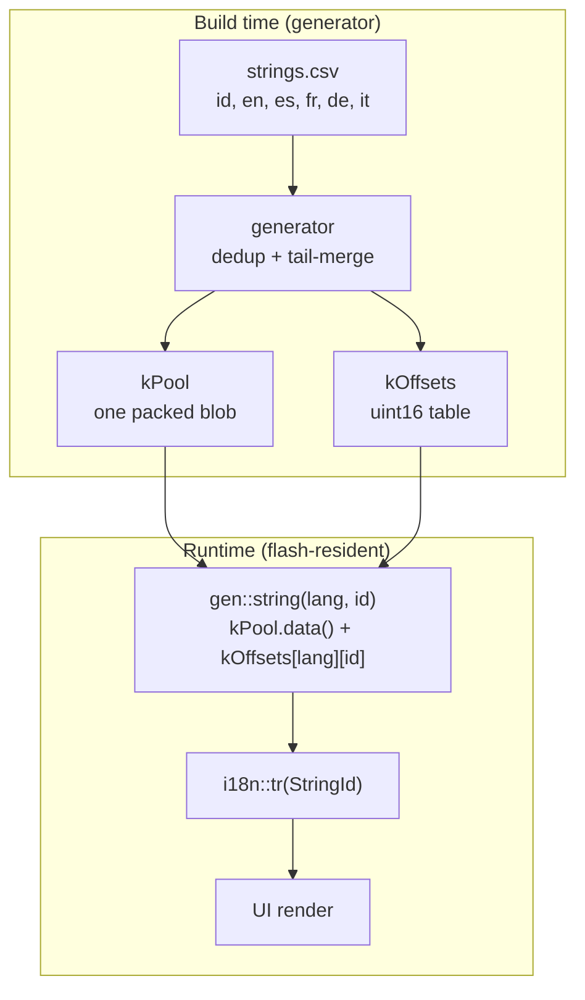
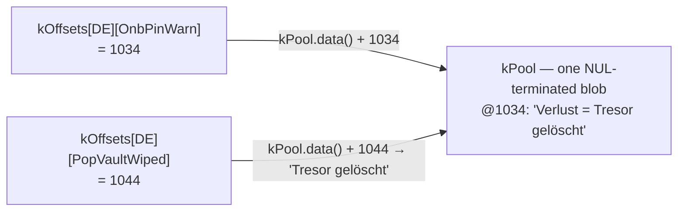

import TLDRSummary from "@components/ui/TLDRSummary.astro";
import Callout from "@components/ui/Callout.astro";
import KeyValue from "@components/ui/KeyValue.astro";
import FileContent from "@components/ui/FileContent.astro";
import Mermaid from "@components/ui/Mermaid.astro";
import Table from "@components/ui/Table.astro";
import BarChart from "@components/ui/BarChart.astro";
import CheckList from "@components/ui/CheckList.astro";
import StepByStep from "@components/ui/StepByStep.astro";
import Collapsible from "@components/ui/Collapsible.astro";
import FileDownload from "@components/ui/FileDownload.astro";
import MemoryMap from "@components/ui/MemoryMap.astro";
import ByteFrame from "@components/ui/ByteFrame.astro";

I ship UI text in five languages on a microcontroller with two buttons and a tiny screen. Five languages, 265 string IDs, and a 32-bit chip where every byte of flash is accounted for. The textbook way to store that is a two-dimensional table of `const char*` pointers — and the first time I looked at the map file, it bothered me that a big chunk of those bytes were spent on **addressing**, not on a single character of actual text.

So I wrote a generator to out-pack the linker. Then I learned the linker was already doing most of what I'd reinvented — and discovered the one thing it genuinely _can't_ do, which turned out to be the win worth keeping. This is that story: a packed, tail-merged string pool with `uint16_t` offsets, what it actually saved, and an honest accounting of where the savings really come from.

<TLDRSummary title="TL;DR">
- The naïve i18n store is a `const char* table[langs][ids]` — on a 32-bit MCU that's **5,300 bytes of pointer index** for 5×265 strings, independent of the text.
- A build-time generator emits one **packed, deduplicated, tail-merged string pool** plus a **`uint16_t` offset table** — the index drops to **2,650 bytes (−50%)**.
- Net firmware shrank **~2.1 KB** with no API or call-site changes.
- **Plot twist:** modern linkers _already_ tail-merge string literals (GNU `ld` by default, `ld.lld` at `-O2`). The unbeatable win is the index halving — turning 4-byte pointers into 2-byte offsets — which no linker can do.
- Honest cost: pooling forfeits cross-module linker dedup, so it's the _table_ halving that nets the gain, not the blob.
</TLDRSummary>

---

## The textbook table — and what the index costs

The obvious generated form is a grid: one row per language, one column per string ID, each cell a pointer to a literal.

<FileContent filename="strings_gen.cpp (the naïve version)" language="cpp">
```cpp
// 5 languages × 265 ids
const char* const kStrings[kLangCount][kStringCount] = {
    /* EN */ { "Kleidos", "OK", "Cancel", /* ... */ },
    /* ES */ { "Kleidos", "OK", "Cancelar", /* ... */ },
    /* ... */
};

const char* tr(uint8_t lang, uint16_t id) { return kStrings[lang][id]; }
```
</FileContent>

It's correct, it's readable, and it's exactly what most projects ship. But notice what the table _is_: a big array of addresses. On a 32-bit target, a `const char*` is four bytes, and there's one per cell whether the string behind it is `"OK"` or a full sentence.

<KeyValue
  title="The cost of the index alone"
  items={[
    { key: "Languages × IDs", value: "5 × 265 = 1,325 cells", description: "One pointer per language, per string ID." },
    { key: "Pointer size", value: "4 bytes (32-bit)", description: "Each cell is a const char* — a relocatable address, not text." },
    { key: "Index table total", value: "5,300 bytes", description: "5 × 265 × 4. Pure addressing overhead, before a single character of text." },
  ]}
/>

That 5.3 KB buys zero text — it's the cost of _finding_ the text. String literals themselves live in flash (`.rodata`) and are a separate, unavoidable cost; on memory-constrained MCUs, keeping literals out of RAM is a long-standing concern, from Arduino's `PROGMEM`/`F()` idiom ([Arduino's PROGMEM reference](https://docs.arduino.cc/language-reference/en/variables/utilities/PROGMEM)) to how [embedded C++ stores strings](https://blog.feabhas.com/2022/02/working-with-strings-in-embedded-c/) in read-only memory. The text I had to pay for. The index was the part that felt wasteful.

---

## But doesn't the linker already do this?

Before optimizing, it's worth asking what the toolchain does for free — and this is where my first assumption fell apart.

The compiler does a little. GCC's `-fmerge-constants` (on by default at `-O1` and above) will, per [GCC's optimize-options reference](https://gcc.gnu.org/onlinedocs/gcc/Optimize-Options.html), "attempt to merge identical constants" — but only _identical, whole_ ones. The deeper work happens in the linker. String literals land in sections flagged `SHF_MERGE | SHF_STRINGS`, and the link editor both deduplicates identical strings **and eliminates tail strings**: given `"bigdog"` and `"dog"`, the shorter string is dropped and represented by the tail of the longer one (see [Oracle's linker and libraries guide](https://docs.oracle.com/cd/E23824_01/html/819-0690/ggdlu.html)). That's tail-merging — exactly the trick I thought I was inventing.

How aggressively depends on the linker and the optimization level:

<Table title="What merges what, and when">
  <thead>
    <tr>
      <th scope="col">Stage</th>
      <th scope="col">Merges identical strings?</th>
      <th scope="col">Tail-merges suffixes?</th>
    </tr>
  </thead>
  <tbody>
    <tr>
      <td>**GCC `-fmerge-constants`** (compiler)</td>
      <td data-status="success">Yes (per TU)</td>
      <td data-status="error">No</td>
    </tr>
    <tr>
      <td>**GNU `ld`** (linker)</td>
      <td data-status="success">Yes</td>
      <td data-status="success">Yes — by default</td>
    </tr>
    <tr>
      <td>**`ld.lld`** (linker)</td>
      <td data-status="success">Yes (`-O1`, default)</td>
      <td data-status="warning">Only at `-O2`</td>
    </tr>
  </tbody>
</Table>

So GNU `ld` tail-merges `SHF_MERGE | SHF_STRINGS` sections by default, while `ld.lld` does it only with `-O2` (`-O1`, the default, merges identical strings only; `-O0` disables merging entirely) — see [MaskRay's ld vs lld notes](https://maskray.me/blog/2020-12-19-lld-and-gnu-linker-incompatibilities) and [the ld.lld manual](https://man.archlinux.org/man/extra/lld/ld.lld.1.en). It's also "permitted, not required" — the generic section-merge algorithm operates on whole elements ([O'Dwyer on ELF string merging](https://quuxplusone.github.io/blog/2026/05/05/potentially-nonunique-strategies/)), with string tail-merging being a separate, string-specific path that not every link is guaranteed to run.

That reframes the whole exercise. I'm _not_ doing something the linker can't. So why generate it at all?

<Callout type="keypoint" title="Two reasons the generator still earns its place">
1. **You may not want to depend on `-O2`.** Maybe you keep a lower optimization level for debuggability or reproducible builds, or you'd simply rather not have your flash budget riding on a linker flag. Doing the dedup and tail-merge in the generator gives you the result **regardless of optimization level**, deterministically, _before_ compilation even starts.
2. **The index halving is the win no linker can ever do.** No linker rewrites a table of 4-byte `const char*` pointers into a table of 2-byte `uint16_t` offsets. That transformation is structural — it's about the _shape of your index_, which is yours to choose, not the toolchain's.
</Callout>

The first reason is nice-to-have. The second is the headline.

---

## The packed pool and the offset table

The design is two pieces of generated data. First, every translation is concatenated into a single flash blob, each string NUL-terminated — so an "offset" is just the start of an ordinary C string. Second, a per-language table of `uint16_t` offsets into that blob, replacing the pointer grid.

<ByteFrame
  title="Inside kPool — strings stored end to end"
  ariaLabel="Byte layout of the pool: a string, a NUL terminator, the next string, another NUL terminator, and so on. Each string's offset is the byte position where it begins."
  fields={[
    { label: "string A", bytes: 6, color: "var(--bf-1)" },
    { label: "\\0", bytes: 1, color: "var(--bf-2)", note: "NUL terminator" },
    { label: "string B", bytes: 9, color: "var(--bf-1)" },
    { label: "\\0", bytes: 1, color: "var(--bf-2)", note: "NUL terminator" },
    { label: "more entries", bytes: 7, variable: true, color: "var(--bf-3)" },
  ]}
  caption="kPool is one blob: entries sit back-to-back, each NUL-terminated. An offset is just the byte where a C string begins — which is why tr() can hand back a plain const char*."
/>

The pool above holds the text — and it stays roughly the same size whether you pack it or not. The change that actually pays off is one level up, in the **index**: every entry that used to be a 4-byte pointer becomes a 2-byte offset.

<MemoryMap
  title="One index entry — the part that halves"
  scale="shared"
  ariaLabel="One index entry compared. A const char pointer is 4 bytes; a uint16 offset is 2 bytes, half the width."
  bars={[
    {
      label: "pointer",
      segments: [
        { label: "const char* (an address)", bytes: 4, sizeLabel: "4 B" },
      ],
    },
    {
      label: "offset",
      segments: [{ label: "uint16_t", bytes: 2, sizeLabel: "2 B" }],
    },
  ]}
  caption="Same text in the pool either way — what changes is the index: every entry drops from a 4-byte pointer to a 2-byte offset, halving the whole table."
/>

<Mermaid caption="Build-time generation, runtime lookup" maxWidth="820px" ariaLabel="Data flow diagram. At build time, strings.csv with columns id, en, es, fr, de, it is read by the generator, a PlatformIO pre-build hook, which emits two structures: kPool, a packed and tail-merged blob of all strings, and kOffsets, a uint16 table of byte offsets. At runtime, the accessor gen string takes a language and id, indexes kOffsets to get an offset, adds it to kPool's base pointer, and returns a normal C string to i18n tr, which the UI renders.">

</Mermaid>

The generated output is two `constexpr std::array`s: the blob, and a nested array of `uint16_t` offsets into it. Here is a real excerpt — note how, in the offset table, **`BRAND` (`"Kleidos"`) and `CommonOk` (`"OK"`) hold the same offset in every language** (they deduplicate to one stored copy), while `CommonCancel` diverges per language:

<FileContent filename="strings_gen.cpp (packed)" language="cpp">
```cpp
// All translations concatenated into one flash blob — deduplicated and
// tail-merged, emitted longest-first.
constexpr std::array<char, 13374> kPool = {
    "A:avanti  B:modifica  tieni B:indietro\0"  // @0
    "A:weiter  B:öffnen  halten B:zurück\0"      // @39
    "A:weiter  B:bearb.  halten B:zurück\0"      // @77
    "j/k:nav  Espace:ouvrir  S:réglages\0"       // @114
    // ... ~1,000 more entries (longest-first) ...
    // "OK" lands at @1164 (shared by all five languages); "Kleidos" at @9379.
};

// 2-byte offsets into kPool instead of 4-byte pointers. Identical strings
// collapse to one offset; a suffix points partway into a longer entry.
constexpr std::array<std::array<uint16_t, kStringCount>, kLangCount> kOffsets = {{
    //          BRAND  CommonOk  CommonCancel       (… 266 more)
    /* EN */ {{  9379,    1164,        12542, /* … */ }},  // Kleidos · OK · "Cancel"
    /* ES */ {{  9379,    1164,        11279, /* … */ }},  // Kleidos · OK · "Cancelar"
    /* FR */ {{  9379,    1164,        11901, /* … */ }},  //          OK · "Annuler"
    /* DE */ {{  9379,    1164,        10295, /* … */ }},  //          OK · "Abbrechen"
    /* IT */ {{  9379,    1164,        11909, /* … */ }},  //          OK · "Annulla"
}};

static_assert(kPool.size() <= UINT16_MAX, "pool exceeds uint16_t offset range");
```
</FileContent>

A few things make this safe and cheap to adopt:

- An offset points at the start of a NUL-terminated string, so the public `tr()` still returns a plain `const char*`. Every call site is **unchanged** — the swap is invisible to the rest of the firmware.
- **Lookup is barely more expensive than the pointer table:** one `uint16_t` load plus one add (`kPool.data() + offset`), versus one pointer load. That's a single extra integer add, with **no second indirection** — you don't trade flash for cycles.
- **Zero RAM cost.** Both the pool and the offset table are `constexpr` `.rodata` — they live entirely in flash. The only runtime state is a one-byte "current language" index. (This is also why the returned `const char*` is safe forever: it points into immortal flash, never freed.)
- A `static_assert` ([cppreference's static_assert](https://en.cppreference.com/w/cpp/language/static_assert)) enforces, at compile time, that the pool stays under 64 KiB so the `uint16_t` offsets can address all of it. Grow the table past that and the build fails loudly instead of silently truncating.
- `std::array` ([cppreference's std::array](https://en.cppreference.com/w/cpp/container/array)) is an aggregate with the same layout as a raw `T[N]` — zero overhead versus the C array it replaces, and `data()` returns a pointer to contiguous storage, so `kPool.data() + offset` is well-defined.
- Because the offsets are emitted as C++ integer literals and compiled for the target, there's **no endianness or serialization concern** — unlike a binary blob format such as gettext's `.mo`.

<MemoryMap
  title="Where it lives"
  scale="shared"
  ariaLabel="Memory footprint. In flash, the kPool packed string blob (about 13.4 KB) sits next to the much smaller kOffsets table (about 2.6 KB). In RAM there is only a single byte, holding the active language index."
  bars={[
    {
      label: "FLASH",
      segments: [
        {
          label: "kPool — packed string blob",
          bytes: 13374,
          sizeLabel: "≈ 13.4 KB",
        },
        { label: "kOffsets (uint16 table)", bytes: 2690, sizeLabel: "≈ 2.6 KB" },
      ],
    },
    {
      label: "RAM",
      segments: [
        { label: "active language index", bytes: 1, sizeLabel: "1 byte" },
      ],
    },
  ]}
  caption="Everything is constexpr .rodata, so it lives in flash — the only RAM cost is one byte for the current language."
/>

### Reading a string back

Two small functions sit behind every lookup. The low-level `gen::string()` does the actual work — one `uint16_t` load plus one add — and trusts its caller. The public `tr()` adds the range check and an empty-to-English fallback, so callers can render the result unconditionally:

<FileContent filename="strings_gen.cpp + i18n.cpp" language="cpp">
```cpp
namespace i18n::gen {
// Low-level accessor: one uint16 load + one add. No bounds check — caller-guaranteed.
const char* string(uint8_t lang, uint16_t index) {
    return kPool.data() + kOffsets[lang][index];
}
}  // namespace i18n::gen

namespace i18n {
// Public API: range-check, then fall back to English for an empty translation.
const char* tr(StringId id) {
    const uint16_t index = static_cast<uint16_t>(id);
    if (index >= kStringCount) return "";          // out of range → empty
    const char* text = gen::string(currentLang(), index);
    return text[0] != '\0' ? text : gen::string(/*EN*/ 0, index);
}
}  // namespace i18n
```
</FileContent>

Call sites pull the names into scope once, so they read cleanly — no `i18n::`, `StringId::`, or `Lang::` noise. Resolve a `StringId` into a variable and use it, exactly as before:

<FileContent filename="src/ui/… (real call sites)" language="cpp">
```cpp
using i18n::tr;
using enum i18n::StringId;   // PinEnter, PopBattLow, CommonCancel, …

const char* prompt = tr(PinEnter);            // resolve once…
display::drawString(prompt, cx, titleY);      // …then draw the label

popup::toast(tr(PopBattLow), nullptr, CAUTION, 3000);   // or inline, for a toast

// What tr() does under the hood — Spanish "Cancel" (lang ES = 1, CommonCancel = 2):
const char* cancel = i18n::gen::string(1, 2);  // kPool.data() + 11279 → "Cancelar"
```
</FileContent>

### Dedup and tail-merge: the generator's core

The packing itself is a dozen lines of Python. The trick is to place strings **longest-first**, then, for each one, check whether its bytes (plus the NUL) already appear anywhere in the blob so far. If they do, it's a duplicate or a suffix of something already placed — reuse that position. If not, append it.

<FileContent filename="scripts/gen_i18n.py (the packer)" language="python">
```python
# Unique strings, sorted longest-first so suffixes collapse onto longer strings.
uniq = sorted(
    {entry[lang] for _, entry in rows for lang in LANGS},
    key=lambda s: (-len(s.encode("utf-8")), s),
)

blob = bytearray()
offsets = {}
for s in uniq:
    needle = s.encode("utf-8") + b"\0"
    pos = bytes(blob).find(needle)   # already present (identical OR a tail)?
    if pos >= 0:
        offsets[s] = pos             # reuse — dedup or tail-merge
    else:
        offsets[s] = len(blob)       # new string — append
        blob += needle
```
</FileContent>

Sorting longest-first is what makes tail-merging fall out for free: by the time a short string is considered, any longer string that _ends_ with it has already been placed, so `find()` locates the shared tail. This is the same shape as a decades-old format — GNU gettext's compiled `.mo` files store translations as exactly this kind of offset table into a contiguous string block ([the gettext .mo format](https://www.gnu.org/software/gettext/manual/html_node/MO-Files.html)).

On the current table — which has grown to 269 strings and counting — the effect is concrete:

<Table title="Today's table: 5 × 269 = 1,345 cells">
  <thead>
    <tr>
      <th scope="col">Stage</th>
      <th scope="col">Distinct strings stored</th>
      <th scope="col">Example</th>
    </tr>
  </thead>
  <tbody>
    <tr>
      <td>All cells</td>
      <td>1,345</td>
      <td>Every (language, ID) pair</td>
    </tr>
    <tr>
      <td>After dedup</td>
      <td>1,058</td>
      <td>`"Kleidos"` ×15, `"OK"` ×14 → stored once each</td>
    </tr>
    <tr>
      <td>After tail-merge</td>
      <td>**1,027**</td>
      <td>`"Tresor gelöscht"` reuses the tail of `"Verlust = Tresor gelöscht"`</td>
    </tr>
  </tbody>
</Table>

Notice the proportions: dedup removes **287** strings, tail-merge only **31** more. On real UI text, fully identical strings (brand names, `"OK"`, shared labels) are far more common than shared suffixes — so **dedup does the heavy lifting and tail-merge is a small bonus on top**. That matches the honesty thesis: the headline win is the index halving, not the blob.

That bonus does raise a fair question, though: if `"Tresor gelöscht"` is never stored on its own, how do you read it back? Its offset simply points **partway into** the longer entry it shares bytes with. Because the blob is NUL-terminated, reading from that offset yields exactly the shorter string — no special case, the same `kPool.data() + offset` as everything else:

<Mermaid caption="A tail-merged string is just an offset pointing into a longer one" maxWidth="760px" ariaLabel="Two offset-table entries index into the same stored string. OnbPinWarn (German) has offset 1034, the start of the blob entry 'Verlust = Tresor gelöscht'. PopVaultWiped (German) has offset 1044, which points ten bytes further into the very same entry, landing at 'Tresor gelöscht'. The shorter translation is never stored separately; it reuses the tail bytes of the longer one, and because the blob is NUL-terminated, reading from offset 1044 returns exactly 'Tresor gelöscht'.">

</Mermaid>

Want to try it on your own data? The [string-pool packer](/tools/string-pool-packer/) takes a list of strings (or a CSV of IDs × languages), shows the pointer-table vs packed-pool cost, and reveals each string's offset — including how a tail-merged one resolves inside its longer neighbor.

---

## What it actually saved

Here are the numbers from when I made the change, on the `sticks3` build (5 languages, 265 IDs at the time):

<Table title="Before and after">
  <thead>
    <tr>
      <th scope="col">Metric</th>
      <th scope="col">Pointer table</th>
      <th scope="col">Packed pool</th>
      <th scope="col">Change</th>
    </tr>
  </thead>
  <tbody>
    <tr>
      <td>Index table</td>
      <td>5,300 B</td>
      <td>2,650 B</td>
      <td data-status="success">**−50%**</td>
    </tr>
    <tr>
      <td>Index entry width</td>
      <td>4 B (pointer)</td>
      <td>2 B (`uint16_t`)</td>
      <td data-status="success">Half</td>
    </tr>
    <tr>
      <td>Firmware image</td>
      <td>1,341,067 B</td>
      <td>1,338,903 B</td>
      <td data-status="success">**−2,164 B**</td>
    </tr>
  </tbody>
</Table>

<BarChart
  title="Index table: bytes spent on addressing"
  data={[
    { label: "Pointer table (4 B)", value: 5300 },
    { label: "Offset table (2 B)", value: 2650 },
  ]}
  valueUnit=" B"
  ariaLabel="Bar chart comparing index-table size: the 4-byte pointer table is 5,300 bytes; the 2-byte offset table is 2,650 bytes, a 50% reduction."
/>

The index halving is the clean, structural win. There's a more honest detail behind the firmware number, though:

<Callout type="warning" title="The blob isn't where the win comes from">
Putting every string into one private pool **forfeits the linker's cross-module deduplication**. A literal like `"OK"` that also appears elsewhere in the firmware no longer merges with the pool's copy. On this dataset that costs roughly 0.5 KB back. So the net firmware saving is driven by the **table halving**, not by the packed text being dramatically smaller than what `-fmerge-constants` plus the linker would have produced on their own. Re-measure if your string set grows a lot — the balance can shift.
</Callout>

And the offsets are cheaper in a second, subtler way. A pointer table is _address-constant_ data — each entry is an address the toolchain has to fix up; a `uint16_t` offset table is plain integer `.rodata`, half the width and with no addresses at all. (The win is the width, not avoided relocations: a statically-linked, non-PIE MCU image has none anyway.) And because the ESP32's flash `.rodata` is memory-mapped (execute-in-place), the firmware reads the pool with ordinary loads — `kPool.data() + offset` is a plain pointer dereference, with none of the `pgm_read_*` dance that classic AVR `PROGMEM` needs.

<Callout type="info" title="Is 2 KB even worth it?">
In absolute terms, no — a typical ESP32-S3 module ships with 8 or 16 MB of flash ([Espressif's part numbers](https://developer.espressif.com/blog/2025/03/espressif-part-numbers-explained/)), and the app partition the firmware lives in is measured in megabytes ([ESP-IDF partition tables](https://docs.espressif.com/projects/esp-idf/en/release-v5.5/esp32s3/api-guides/partition-tables.html)). Saving 2 KB doesn't rescue a starved device. The point is what those 2 KB _are_: pure index overhead that buys no text, and that **compounds** as the table grows — every new string adds five more pointer-vs-offset deltas. Halving it once keeps that line from drifting upward forever.
</Callout>

---

## Why generate it at build time

None of this would be worth hand-maintaining — and hand-maintaining it would be the bug. The translations live in a plain `strings.csv` (one row per ID, one column per language: diff-friendly, editable by a non-programmer, and adding a language is adding a column). A generator turns that into C++, wired as a [PlatformIO pre-build hook](https://docs.platformio.org/en/latest/scripting/launch_types.html):

<FileContent filename="platformio.ini" language="ini">
```ini
[env]
extra_scripts = pre:scripts/gen_i18n.py
```
</FileContent>

The `pre:` prefix ([PlatformIO's extra_scripts option](https://docs.platformio.org/en/latest/projectconf/sections/env/options/advanced/extra_scripts.html)) runs the script before the platform build, so the generated `.cpp`/`.h` are always in sync with the CSV before compilation. The script writes its output only when the content actually changes, so it doesn't trigger needless recompiles, and it's a documented part of [PlatformIO's advanced scripting](https://docs.platformio.org/en/latest/scripting/index.html), not a bolt-on. The CSV is the single source of truth; the generated files are never hand-edited.

This is also where the "before compile, regardless of `-O2`" property pays off: the packing is deterministic and lives in the source you commit. (The sort key is `(-byte_length, string)` — that second term breaks ties lexicographically, giving a _total_ order, so the same CSV always produces byte-identical output regardless of hash-set iteration order.) The savings don't depend on which optimization level the final link happens to run.

### Adding a language or a string

The whole workflow stays a CSV edit — no C++ touched by hand:

<StepByStep title="Add a translation">
  <li>Add a **column** for a new language (or a **row** for a new string ID) to `strings.csv`.</li>
  <li>Build. The `pre:` hook regenerates `strings_gen.{h,cpp}`, so the new `StringId` enum value and its per-language offsets appear automatically.</li>
  <li>Use it: `tr(StringId::MyNewLabel)`. A missing translation isn't a crash or a blank — `tr()` falls back to the English column, so a half-translated language still renders.</li>
</StepByStep>

---

## The complete generator

The packing loop above is the heart of it, but the full generator is worth reading end to end: CSV parsing with English fallback, the `StringId` enum and header emission, the `clang-format`-stable output, and the `write_if_changed` guard that avoids needless recompiles. Grab it, or unfold it below.

<FileDownload
  href="/downloads/gen_i18n.py"
  filename="gen_i18n.py"
  description="PlatformIO pre-build i18n codegen"
/>

<Collapsible title="The complete gen_i18n.py">

<FileContent filename="scripts/gen_i18n.py" language="python">
```python
#!/usr/bin/env python3
# Kleidos — i18n codegen.
#
# Reads i18n/strings.csv and emits:
#   src/i18n/Strings_gen.h   (StringId enum + gen::string accessor decl)
#   src/i18n/Strings_gen.cpp (packed, tail-merged string pool + offset table)
#
# Hooked from platformio.ini as `extra_scripts = pre:scripts/gen_i18n.py`.
# Stays a no-op when the generated files are already up-to-date.

import csv
import os
import sys
from pathlib import Path

# `__file__` may not be defined under SCons exec(); fall back to PROJECT_DIR.
try:
    SCRIPT_DIR = Path(__file__).resolve().parent
except NameError:
    SCRIPT_DIR = Path(os.environ.get("PROJECT_DIR", os.getcwd())) / "scripts"
ROOT = SCRIPT_DIR.parent
CSV_PATH = ROOT / "i18n" / "strings.csv"
HDR_PATH = ROOT / "src" / "i18n" / "Strings_gen.h"
CPP_PATH = ROOT / "src" / "i18n" / "Strings_gen.cpp"

LANGS = ["en", "es", "fr", "de", "it"]


def cpp_escape(s: str) -> str:
    out = []
    for ch in s:
        if ch == "\\":
            out.append("\\\\")
        elif ch == '"':
            out.append('\\"')
        elif ch == "\n":
            out.append("\\n")
        elif ch == "\r":
            out.append("\\r")
        elif ch == "\t":
            out.append("\\t")
        else:
            out.append(ch)
    return "".join(out)


def parse_csv(path: Path):
    """Return list of (id, {lang: text}). Skips comment rows starting with '#'."""
    rows = []
    with path.open("r", encoding="utf-8", newline="") as f:
        reader = csv.reader(f)
        header = next(reader)
        if header[0].lower() != "id":
            raise SystemExit(f"i18n: unexpected header {header}")
        col = {h.lower(): i for i, h in enumerate(header)}
        for r in reader:
            if not r or not r[0].strip() or r[0].strip().startswith("#"):
                continue
            sid = r[0].strip()
            entry = {}
            for lang in LANGS:
                idx = col.get(lang)
                val = r[idx] if (idx is not None and idx < len(r)) else ""
                # Fall back to English when a translation is missing.
                entry[lang] = val if val.strip() else (entry.get("en") or r[col["en"]])
            rows.append((sid, entry))
    return rows


def render_header(rows):
    lines = []
    lines.append("// AUTO-GENERATED by scripts/gen_i18n.py — DO NOT EDIT MANUALLY.")
    lines.append("// Regenerated from i18n/strings.csv on every build.")
    lines.append("#pragma once")
    lines.append("#include <cstdint>")
    lines.append("")
    lines.append("namespace i18n {")
    lines.append("")
    lines.append("enum class StringId : uint16_t {")
    for sid, _ in rows:
        lines.append(f"    {sid},")
    lines.append("    COUNT")
    lines.append("};")
    lines.append("")
    lines.append("constexpr uint16_t kStringCount = static_cast<uint16_t>( StringId::COUNT );")
    lines.append("constexpr uint8_t  kLangCount   = 5;  // EN, ES, FR, DE, IT")
    lines.append("")
    lines.append("namespace gen {")
    lines.append("")
    lines.append("/**")
    lines.append(" * @brief Return translation (@p lang, @p index) as a NUL-terminated string.")
    lines.append(" *")
    lines.append(" * Points into the packed flash pool; the returned pointer stays valid for")
    lines.append(" * the program lifetime. No bounds checking — callers must ensure")
    lines.append(" * @p lang < @c kLangCount and @p index < @c kStringCount.")
    lines.append(" */")
    lines.append("const char* string( uint8_t lang, uint16_t index );")
    lines.append("")
    lines.append("}  // namespace gen")
    lines.append("")
    lines.append("}  // namespace i18n")
    lines.append("")
    return "\n".join(lines)


def build_pool(rows):
    """Build a tail-merged string pool.

    Returns (emit, offsets) where `emit` is the list of strings appended to the
    pool in order (each contributes its UTF-8 bytes + a NUL) and `offsets` maps
    every unique string to its byte offset into the concatenated blob.

    Strings are placed longest-first so that any string which is the suffix of
    another collapses onto the longer one's bytes (e.g. "ancel" reuses the tail
    of "Cancel"); identical strings are deduplicated outright.
    """
    uniq = sorted(
        {entry[lang] for _, entry in rows for lang in LANGS},
        key=lambda s: (-len(s.encode("utf-8")), s),
    )
    blob = bytearray()
    offsets = {}
    emit = []
    for s in uniq:
        needle = s.encode("utf-8") + b"\0"
        pos = bytes(blob).find(needle)
        if pos >= 0:
            offsets[s] = pos
        else:
            offsets[s] = len(blob)
            blob += needle
            emit.append(s)
    return emit, offsets, len(blob)


def render_cpp(rows):
    emit, offsets, blob_len = build_pool(rows)
    # +1 keeps the string literal's implicit terminator so the array size is not
    # one short of the initializer (which -Werror rejects).
    pool_size = blob_len + 1

    lines = []
    lines.append("// AUTO-GENERATED by scripts/gen_i18n.py — DO NOT EDIT MANUALLY.")
    lines.append('#include "strings_gen.h"')
    lines.append("")
    lines.append("#include <array>")
    lines.append("#include <cstdint>")
    lines.append("")
    lines.append("namespace i18n {")
    lines.append("namespace gen {")
    lines.append("")
    lines.append("// Packed translation pool: all strings concatenated into one flash blob,")
    lines.append("// deduplicated and tail-merged (a string that is the suffix of another")
    lines.append("// shares its bytes). Adjacent string literals concatenate; the offsets")
    lines.append("// below index into the resulting bytes.")
    lines.append("// clang-format off")
    lines.append(f"constexpr std::array<char, {pool_size}> kPool = {{")
    running = 0
    for s in emit:
        lines.append(f'    "{cpp_escape(s)}\\0"  // @{running}')
        running += len(s.encode("utf-8")) + 1
    lines.append("};")
    lines.append("// clang-format on")
    lines.append("")
    lines.append("// Per-language byte offsets into kPool. uint16_t keeps this table half the")
    lines.append("// size of a 32-bit pointer table and free of load-time relocations.")
    lines.append("// clang-format off")
    lines.append(
        "constexpr std::array<std::array<uint16_t, kStringCount>, kLangCount> kOffsets = { {"
    )
    for lang in LANGS:
        offs = [offsets[entry[lang]] for _, entry in rows]
        lines.append(f"    /* {lang.upper()} */ {{ {{")
        for i in range(0, len(offs), 12):
            chunk = ", ".join(str(o) for o in offs[i : i + 12])
            lines.append(f"        {chunk},")
        lines.append("    } },")
    lines.append("} };")
    lines.append("// clang-format on")
    lines.append("")
    lines.append(
        'static_assert( kPool.size() <= UINT16_MAX, "pool exceeds uint16_t offset range" );'
    )
    lines.append("")
    lines.append("const char* string( uint8_t lang, uint16_t index ) {")
    lines.append("    return kPool.data() + kOffsets[lang][index];")
    lines.append("}")
    lines.append("")
    lines.append("}  // namespace gen")
    lines.append("}  // namespace i18n")
    lines.append("")
    return "\n".join(lines)


def write_if_changed(path: Path, content: str) -> bool:
    """Write only if content differs (avoids triggering recompilation)."""
    path.parent.mkdir(parents=True, exist_ok=True)
    if path.exists():
        old = path.read_text(encoding="utf-8")
        if old == content:
            return False
    path.write_text(content, encoding="utf-8")
    return True


def generate():
    if not CSV_PATH.exists():
        print(f"i18n: missing {CSV_PATH}", file=sys.stderr)
        return False
    rows = parse_csv(CSV_PATH)
    if not rows:
        print("i18n: CSV produced no rows", file=sys.stderr)
        return False
    h_changed = write_if_changed(HDR_PATH, render_header(rows))
    c_changed = write_if_changed(CPP_PATH, render_cpp(rows))
    if h_changed or c_changed:
        print(f"i18n: regenerated {len(rows)} ids x {len(LANGS)} langs")
    return True


# PlatformIO entry point.
try:
    Import("env")  # type: ignore[name-defined]  # noqa: F821
    generate()
except NameError:
    # Standalone CLI invocation.
    if __name__ == "__main__":
        generate()
```
</FileContent>

</Collapsible>

---

## The roads not taken

A few alternatives looked tempting and were rejected for concrete reasons:

<Table title="Alternatives considered">
  <thead>
    <tr>
      <th scope="col">Approach</th>
      <th scope="col">Why not</th>
    </tr>
  </thead>
  <tbody>
    <tr>
      <td>**Keep the pointer table**</td>
      <td>Simplest, but spends the 2.6 KB of index overhead the offset table reclaims.</td>
    </tr>
    <tr>
      <td>**`std::string_view` table**</td>
      <td>"More modern", but each view is `{ptr, size}` = 8 bytes on a 32-bit target — it would _double_ the index to ~10.6 KB for a length `tr()` never needs.</td>
    </tr>
    <tr>
      <td>**X-macros**</td>
      <td>Elegant all-in-C codegen, but it leans entirely on function-like macros, which violates [AUTOSAR C++14 Rule A16-0-1](https://www.mathworks.com/help/bugfinder/ref/autosarc14rulea1601.html) (now part of MISRA C++:2023): the preprocessor is for includes and conditional compilation only.</td>
    </tr>
    <tr>
      <td>**Runtime compression**</td>
      <td>Per-string Huffman saves more flash but needs a RAM decode buffer and breaks the "`tr()` returns a stable pointer" contract the call sites rely on. Not worth it for ~13 KB of text.</td>
    </tr>
  </tbody>
</Table>

The packed layout is also cleaner against the project's static-analysis goals than the C array it replaced: `std::array` throughout (rather than C-style arrays, per [AUTOSAR A18-1-1](https://www.mathworks.com/help/bugfinder/ref/autosarc14rulea1811.html)), a compile-time bound check via `static_assert`, and no preprocessor tricks.

---

## Try it, and the lesson

<Callout type="tip" title="Play with the numbers">
The [string-pool packer](/tools/string-pool-packer/) runs entirely in your browser: paste a handful of strings (or a few language columns) and watch the pointer-table cost, the packed-pool cost, the dedup hits, and the tail-merges, side by side.
</Callout>

<CheckList title="What I'd take from this">
  <li data-check="check">**Measure before you optimize.** The linker was already doing most of what I set out to "invent."</li>
  <li data-check="check">**The shape of your index is yours.** Pointers versus offsets is a structural choice no toolchain will make for you.</li>
  <li data-check="check">**Own the optimization up front** when you don't want it riding on a linker flag — codegen makes it deterministic and `-O`-independent.</li>
  <li data-check="check">**Keep the source human-friendly.** A CSV plus a generator beats a hand-written table you'll eventually desync.</li>
  <li data-check="warning">**Account honestly.** The headline (−50% index) is real; the firmware delta is smaller than it looks once you subtract the cross-module dedup you gave up.</li>
</CheckList>

This came out of Kleidos, a hardware password manager I'm building — not yet released. The i18n layer is a small corner of it, but it's a good reminder that on a constrained target the interesting savings often aren't in the data you store, but in how you _index_ it.
