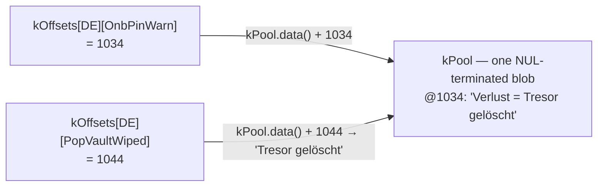

import TLDRSummary from "@components/ui/TLDRSummary.astro";
import Callout from "@components/ui/Callout.astro";
import KeyValue from "@components/ui/KeyValue.astro";
import FileContent from "@components/ui/FileContent.astro";
import Mermaid from "@components/ui/Mermaid.astro";
import Table from "@components/ui/Table.astro";
import CheckList from "@components/ui/CheckList.astro";
import StepByStep from "@components/ui/StepByStep.astro";
import Collapsible from "@components/ui/Collapsible.astro";
import FileDownload from "@components/ui/FileDownload.astro";
import MemoryMap from "@components/ui/MemoryMap.astro";
import ByteFrame from "@components/ui/ByteFrame.astro";
import DeltaCompare from "@components/ui/DeltaCompare.astro";
import StructPacking from "@components/ui/StructPacking.astro";
import LayerStack from "@components/ui/LayerStack.astro";
import ForkJoin from "@components/ui/ForkJoin.astro";

I ship UI text in five languages on a microcontroller with two buttons and a tiny screen. Five languages, 273 string IDs, and a 32-bit chip where every byte of flash is accounted for. The textbook way to store that is a two-dimensional table of `const char*` pointers — and the first time I looked at the map file, it bothered me that a big chunk of those bytes were spent on **addressing**, not on a single character of actual text.

So I wrote a generator to out-pack the linker. Then I learned the linker was already doing most of what I'd reinvented — and discovered the one thing it genuinely _can't_ do, which turned out to be the win worth keeping. This is that story: a packed, tail-merged string pool with `uint16_t` offsets, what it actually saved, and an honest accounting of where the savings really come from.

<TLDRSummary title="TL;DR">
- The naïve i18n store is a `const char* table[langs][ids]` — on a 32-bit MCU that's **5,460 bytes of pointer index** for 5×273 strings, independent of the text.
- A build-time generator emits one **packed, deduplicated, tail-merged string pool** plus a **`uint16_t` offset table** — the index drops to **2,730 bytes (−50%)**, and the naïve table's **1,365 relocations** (one address to fix up per cell) become **zero**.
- Net firmware shrank **2,224 B** at the shipped `-Os`, with no API or call-site changes — and packed stays smaller at **every** optimization level from `-O0` to `-O3`.
- **Plot twist:** modern linkers _already_ tail-merge string literals (GNU `ld` by default, `ld.lld` at `-O2`), so the packed _blob_ is only **282 B** smaller than what the linker produces. The real, optimizer-proof win is **structural** — halving the table and erasing the relocations — which no linker, and not even LTO, can do.
- Honest cost: pooling forfeits **500 B** of cross-module linker dedup; the table-plus-relocation win nets the gain, not the blob.
</TLDRSummary>

---

## The textbook table — and what the index costs

The obvious generated form is a grid: one row per language, one column per string ID, each cell a pointer to a literal.

<FileContent filename="strings_gen.cpp (the naïve version)" icon="devicon:cplusplus" language="cpp">
```cpp
// 5 languages × 273 ids
const char* const kStrings[kLangCount][kStringCount] = {
    /* EN */ { "Kleidos", "OK", "Cancel", /* ... */ },
    /* ES */ { "Kleidos", "OK", "Cancelar", /* ... */ },
    /* ... */
};

const char* tr(uint8_t lang, uint16_t id) { return kStrings[lang][id]; }
```
</FileContent>

It's correct, it's readable, and it's exactly what most projects ship. But notice what the table _is_: a big array of addresses. On a 32-bit target, a `const char*` is four bytes, and there's one per cell whether the string behind it is `"OK"` or a full sentence.

<KeyValue
  title="The cost of the index alone"
  items={[
    { key: "Languages × IDs", value: "5 × 273 = 1,365 cells", description: "One pointer per language, per string ID." },
    { key: "Pointer size", value: "4 bytes (32-bit)", description: "Each cell is a const char* — a relocatable address, not text." },
    { key: "Index table total", value: "5,460 bytes", description: "5 × 273 × 4. Pure addressing overhead, before a single character of text — and one relocation per cell." },
  ]}
/>

That 5.5 KB buys zero text — it's the cost of _finding_ the text. String literals themselves live in flash (`.rodata`) and are a separate, unavoidable cost; on memory-constrained MCUs, keeping literals out of RAM is a long-standing concern, from Arduino's `PROGMEM`/`F()` idiom ([Arduino's PROGMEM reference](https://docs.arduino.cc/language-reference/en/variables/utilities/PROGMEM)) to how [embedded C++ stores strings](https://blog.feabhas.com/2022/02/working-with-strings-in-embedded-c/) in read-only memory. The text I had to pay for. The index was the part that felt wasteful.

---

## But doesn't the linker already do this?

Before optimizing, it's worth asking what the toolchain does for free — and this is where my first assumption fell apart.

The compiler does a little. GCC's `-fmerge-constants` (on by default at `-O1` and above) will, per [GCC's optimize-options reference](https://gcc.gnu.org/onlinedocs/gcc/Optimize-Options.html), "attempt to merge identical constants" — but only _identical, whole_ ones. The deeper work happens in the linker. String literals land in sections flagged `SHF_MERGE | SHF_STRINGS`, and the link editor both deduplicates identical strings **and eliminates tail strings**: given `"bigdog"` and `"dog"`, the shorter string is dropped and represented by the tail of the longer one (see [Oracle's linker and libraries guide](https://docs.oracle.com/cd/E23824_01/html/819-0690/ggdlu.html)). That's tail-merging — exactly the trick I thought I was inventing.

How aggressively depends on the linker and the optimization level:

<Table title="What merges what, and when">
  <thead>
    <tr>
      <th scope="col">Stage</th>
      <th scope="col">Merges identical strings?</th>
      <th scope="col">Tail-merges suffixes?</th>
    </tr>
  </thead>
  <tbody>
    <tr>
      <td>**GCC `-fmerge-constants`** (compiler)</td>
      <td data-status="success">Yes (per TU)</td>
      <td data-status="error">No</td>
    </tr>
    <tr>
      <td>**GNU `ld`** (linker)</td>
      <td data-status="success">Yes</td>
      <td data-status="success">Yes — by default</td>
    </tr>
    <tr>
      <td>**`ld.lld`** (linker)</td>
      <td data-status="success">Yes (`-O1`, default)</td>
      <td data-status="warning">Only at `-O2`</td>
    </tr>
  </tbody>
</Table>

So GNU `ld` tail-merges `SHF_MERGE | SHF_STRINGS` sections by default, while `ld.lld` does it only with `-O2` (`-O1`, the default, merges identical strings only; `-O0` disables merging entirely) — see [MaskRay's ld vs lld notes](https://maskray.me/blog/2020-12-19-lld-and-gnu-linker-incompatibilities) and [the ld.lld manual](https://man.archlinux.org/man/extra/lld/ld.lld.1.en). It's also "permitted, not required" — the generic section-merge algorithm operates on whole elements ([O'Dwyer on ELF string merging](https://quuxplusone.github.io/blog/2026/05/05/potentially-nonunique-strategies/)), with string tail-merging being a separate, string-specific path that not every link is guaranteed to run.

That reframes the whole exercise. I'm _not_ doing something the linker can't. So why generate it at all?

<Callout type="keypoint" title="Two reasons the generator still earns its place">
1. **You may not want to depend on `-O2`.** Maybe you keep a lower optimization level for debuggability or reproducible builds, or you'd simply rather not have your flash budget riding on a linker flag. Doing the dedup and tail-merge in the generator gives you the result **regardless of optimization level**, deterministically, _before_ compilation even starts.
2. **The index halving is the win no linker can ever do.** No linker rewrites a table of 4-byte `const char*` pointers into a table of 2-byte `uint16_t` offsets. That transformation is structural — it's about the _shape of your index_, which is yours to choose, not the toolchain's.
</Callout>

The first reason is nice-to-have. The second is the headline.

---

## The packed pool and the offset table

The design is two pieces of generated data. First, every translation is concatenated into a single flash blob, each string NUL-terminated — so an "offset" is just the start of an ordinary C string. Second, a per-language table of `uint16_t` offsets into that blob, replacing the pointer grid.

<ByteFrame
  title="Inside kPool — strings stored end to end"
  ariaLabel="Byte layout of the pool: a string, a NUL terminator, the next string, another NUL terminator, and so on. Each string's offset is the byte position where it begins."
  fields={[
    { label: "string A", bytes: 6, color: "var(--bf-1)" },
    { label: "\\0", bytes: 1, color: "var(--bf-2)", note: "NUL terminator" },
    { label: "string B", bytes: 9, color: "var(--bf-1)" },
    { label: "\\0", bytes: 1, color: "var(--bf-2)", note: "NUL terminator" },
    { label: "more entries", bytes: 7, variable: true, color: "var(--bf-3)" },
  ]}
  caption="kPool is one blob: entries sit back-to-back, each NUL-terminated. An offset is just the byte where a C string begins — which is why tr() can hand back a plain const char*."
/>

The pool above holds the text — and it stays roughly the same size whether you pack it or not. The change that actually pays off is one level up, in the **index**: every entry that used to be a 4-byte pointer becomes a 2-byte offset.

<MemoryMap
  title="One index entry — the part that halves"
  scale="shared"
  ariaLabel="One index entry compared. A const char pointer is 4 bytes; a uint16 offset is 2 bytes, half the width."
  bars={[
    {
      label: "pointer",
      segments: [
        { label: "const char* (an address)", bytes: 4, sizeLabel: "4 B" },
      ],
    },
    {
      label: "offset",
      segments: [{ label: "uint16_t", bytes: 2, sizeLabel: "2 B" }],
    },
  ]}
  caption="Same text in the pool either way — what changes is the index: every entry drops from a 4-byte pointer to a 2-byte offset, halving the whole table."
/>

<ForkJoin
  ariaLabel="Data flow diagram. At build time, strings.csv with columns id, en, es, fr, de, it is read by the generator, a PlatformIO pre-build hook, which emits two structures: kPool, a packed and tail-merged blob of all strings, and kOffsets, a uint16 table of byte offsets. At runtime, the accessor gen string takes a language and id, indexes kOffsets to get an offset, adds it to kPool's base pointer, and returns a normal C string to i18n tr, which the UI renders."
  beforeLabel="Build time"
  afterLabel="Runtime"
  before={[
    { name: "strings.csv", note: "id, en, es, fr, de, it" },
    { name: "generator", note: "dedup + tail-merge" },
  ]}
  branches={[
    { name: "kPool", note: "one packed blob" },
    { name: "kOffsets", note: "uint16 table" },
  ]}
  after={[
    { name: "gen::string(lang, id)", note: "kPool.data() + kOffsets[lang][id]" },
    { name: "i18n::tr(StringId)" },
    { name: "UI render" },
  ]}
  caption="Build-time generation, runtime lookup"
/>

The generated output is two `constexpr std::array`s: the blob, and a nested array of `uint16_t` offsets into it. Here is a real excerpt — note how, in the offset table, **`BRAND` (`"Kleidos"`) and `CommonOk` (`"OK"`) hold the same offset in every language** (they deduplicate to one stored copy), while `CommonCancel` diverges per language:

<FileContent filename="strings_gen.cpp (packed)" icon="devicon:cplusplus" language="cpp">
```cpp
// All translations concatenated into one flash blob — deduplicated and
// tail-merged, emitted longest-first.
constexpr std::array<char, 13531> kPool = {
    "A:avanti  B:modifica  tieni B:indietro\0"  // @0
    "A:weiter  B:öffnen  halten B:zurück\0"      // @39
    "A:weiter  B:bearb.  halten B:zurück\0"      // @77
    "j/k:nav  Espace:ouvrir  S:réglages\0"       // @114
    // ... ~1,000 more entries (longest-first) ...
    // "OK" lands at @1164 (shared by all five languages); "Kleidos" at @9379.
};

// 2-byte offsets into kPool instead of 4-byte pointers. Identical strings
// collapse to one offset; a suffix points partway into a longer entry.
constexpr std::array<std::array<uint16_t, kStringCount>, kLangCount> kOffsets = {{
    //          BRAND  CommonOk  CommonCancel       (… 266 more)
    /* EN */ {{  9379,    1164,        12542, /* … */ }},  // Kleidos · OK · "Cancel"
    /* ES */ {{  9379,    1164,        11279, /* … */ }},  // Kleidos · OK · "Cancelar"
    /* FR */ {{  9379,    1164,        11901, /* … */ }},  // Kleidos · OK · "Annuler"
    /* DE */ {{  9379,    1164,        10295, /* … */ }},  // Kleidos · OK · "Abbrechen"
    /* IT */ {{  9379,    1164,        11909, /* … */ }},  // Kleidos · OK · "Annulla"
}};

static_assert(kPool.size() <= UINT16_MAX, "pool exceeds uint16_t offset range");
```
</FileContent>

A few things make this safe and cheap to adopt:

- An offset points at the start of a NUL-terminated string, so the public `tr()` still returns a plain `const char*`. Every call site is **unchanged** — the swap is invisible to the rest of the firmware.
- **Lookup is barely more expensive than the pointer table:** one `uint16_t` load plus one add (`kPool.data() + offset`), versus one pointer load. That's a single extra integer add, with **no second indirection** — you don't trade flash for cycles.
- **Zero RAM cost.** Both the pool and the offset table are `constexpr` `.rodata` — they live entirely in flash. The only runtime state is a one-byte "current language" index. (This is also why the returned `const char*` is safe forever: it points into immortal flash, never freed.)
- A `static_assert` ([cppreference's static_assert](https://en.cppreference.com/w/cpp/language/static_assert)) enforces, at compile time, that the pool stays under 64 KiB so the `uint16_t` offsets can address all of it. Grow the table past that and the build fails loudly instead of silently truncating.
- `std::array` ([cppreference's std::array](https://en.cppreference.com/w/cpp/container/array)) is an aggregate with the same layout as a raw `T[N]` — zero overhead versus the C array it replaces, and `data()` returns a pointer to contiguous storage, so `kPool.data() + offset` is well-defined.
- Because the offsets are emitted as C++ integer literals and compiled for the target, there's **no endianness or serialization concern** — unlike a binary blob format such as gettext's `.mo`.

<MemoryMap
  title="Where it lives — naïve vs packed (flash)"
  scale="shared"
  ariaLabel="Flash footprint, both designs on the same scale. The naïve store is a literal blob of about 13.8 KB plus a 5.5 KB pointer table, 19,273 bytes in total. The packed store is a 13.5 KB pool plus a 2.7 KB offset table, 16,261 bytes in total. The two blobs are almost the same length; the visible difference is the index table, which halves from the pointer version to the offset version."
  bars={[
    {
      label: "Naïve (pointer table)",
      segments: [
        { label: "literal blob", bytes: 13813, sizeLabel: "≈ 13.8 KB", color: "var(--mm-6)" },
        { label: "pointer table (4 B)", bytes: 5460, sizeLabel: "≈ 5.5 KB", color: "var(--mm-5)" },
      ],
    },
    {
      label: "Packed (offset table)",
      segments: [
        { label: "kPool", bytes: 13531, sizeLabel: "≈ 13.5 KB", color: "var(--mm-6)" },
        { label: "kOffsets (2 B)", bytes: 2730, sizeLabel: "≈ 2.7 KB", color: "var(--mm-5)" },
      ],
    },
  ]}
  caption="Same text either way — the two blobs land within 282 B of each other. The visible gap is the index: a 5,460 B pointer table against a 2,730 B offset table. Both sit entirely in flash (.rodata) and spend 0 extra RAM beyond a 1-byte language index."
/>

### Reading a string back

Two small functions sit behind every lookup. The low-level `gen::string()` does the actual work — one `uint16_t` load plus one add — and trusts its caller. The public `tr()` adds the range check and an empty-to-English fallback, so callers can render the result unconditionally:

<FileContent filename="strings_gen.cpp + i18n.cpp" language="cpp">
```cpp
namespace i18n::gen {
// Low-level accessor: one uint16 load + one add. No bounds check — caller-guaranteed.
const char* string(uint8_t lang, uint16_t index) {
    return kPool.data() + kOffsets[lang][index];
}
}  // namespace i18n::gen

namespace i18n {
// Public API: range-check, then fall back to English for an empty translation.
const char* tr(StringId id) {
    const uint16_t index = static_cast<uint16_t>(id);
    if (index >= kStringCount) return "";          // out of range → empty
    const char* text = gen::string(currentLang(), index);
    return text[0] != '\0' ? text : gen::string(/*EN*/ 0, index);
}
}  // namespace i18n
```
</FileContent>

Every `tr()` call walks the same short path — from a UI call site down to a single memory-mapped flash read, with no heap and no RAM copy:

<LayerStack
  title="Where a tr() call lands"
  ariaLabel="The layers a tr() call traverses, top to bottom: the UI call site calling tr of a StringId; i18n tr, which does the range check and English fallback; i18n gen string, which computes kPool data plus kOffsets indexed by language and id; the kOffsets and kPool constexpr rodata; and finally flash, execute-in-place and memory-mapped, costing zero RAM."
  layers={[
    { name: "UI call site", note: "tr(StringId)" },
    { name: "i18n::tr()", note: "range check + EN fallback" },
    { name: "i18n::gen::string()", note: "kPool.data() + kOffsets[lang][idx]" },
    { name: "kOffsets · kPool", note: "constexpr .rodata" },
    { name: "Flash (XIP)", note: "memory-mapped · 0 RAM" },
  ]}
  caption="One uint16 load and one add against the pool base — then the caller renders the returned const char*. No second indirection, no decode buffer."
/>

Call sites pull the names into scope once, so they read cleanly — no `i18n::`, `StringId::`, or `Lang::` noise. Resolve a `StringId` into a variable and use it, exactly as before:

<FileContent filename="src/ui/… (real call sites)" icon="devicon:cplusplus" language="cpp">
```cpp
using i18n::tr;
using enum i18n::StringId;   // PinEnter, PopBattLow, CommonCancel, …

const char* prompt = tr(PinEnter);            // resolve once…
display::drawString(prompt, cx, titleY);      // …then draw the label

popup::toast(tr(PopBattLow), nullptr, CAUTION, 3000);   // or inline, for a toast

// What tr() does under the hood — Spanish "Cancel" (lang ES = 1, CommonCancel = 2):
const char* cancel = i18n::gen::string(1, 2);  // kPool.data() + 11279 → "Cancelar"
```
</FileContent>

That `gen::string(1, 2)` is exactly what the disassembly does: the naïve table would `l32i` a 32-bit pointer; the packed accessor `l16ui`s a 16-bit offset and adds it to the pool base. **Both are a single table load** — there is no extra indirection — and the offset table being half the size touches fewer D-cache lines on a hot menu redraw. The contract (`tr()` hands back a borrowed, program-lifetime `const char*`) is what lets the format swap stay invisible to all **210 `tr()` call sites** across the UI, popups, onboarding and admin portal: not one of them changed.

### Dedup and tail-merge: the generator's core

The packing itself is a dozen lines of Python. The trick is to place strings **longest-first**, then, for each one, check whether its bytes (plus the NUL) already appear anywhere in the blob so far. If they do, it's a duplicate or a suffix of something already placed — reuse that position. If not, append it.

<FileContent filename="scripts/gen_i18n.py (the packer)" icon="devicon:python" language="python">
```python
# Unique strings, sorted longest-first so suffixes collapse onto longer strings.
uniq = sorted(
    {entry[lang] for _, entry in rows for lang in LANGS},
    key=lambda s: (-len(s.encode("utf-8")), s),
)

blob = bytearray()
offsets = {}
for s in uniq:
    needle = s.encode("utf-8") + b"\0"
    pos = bytes(blob).find(needle)   # already present (identical OR a tail)?
    if pos >= 0:
        offsets[s] = pos             # reuse — dedup or tail-merge
    else:
        offsets[s] = len(blob)       # new string — append
        blob += needle
```
</FileContent>

Sorting longest-first is what makes tail-merging fall out for free: by the time a short string is considered, any longer string that _ends_ with it has already been placed, so `find()` locates the shared tail. This is the same shape as a decades-old format — GNU gettext's compiled `.mo` files store translations as exactly this kind of offset table into a contiguous string block ([the gettext .mo format](https://www.gnu.org/software/gettext/manual/html_node/MO-Files.html)).

On the current table — which has grown to 273 string IDs and counting — the effect is concrete:

<Table title="Today's table: 5 × 273 = 1,365 cells">
  <thead>
    <tr>
      <th scope="col">Stage</th>
      <th scope="col">Distinct strings</th>
      <th scope="col">Pool size</th>
    </tr>
  </thead>
  <tbody>
    <tr>
      <td>All cells</td>
      <td>1,365</td>
      <td>Every (language, ID) pair</td>
    </tr>
    <tr>
      <td>After dedup</td>
      <td>1,071</td>
      <td>13,813 B — `"Kleidos"` ×15, `"OK"` ×14 → stored once each</td>
    </tr>
    <tr>
      <td>After tail-merge</td>
      <td>1,071*</td>
      <td>**13,531 B** — `"Tresor gelöscht"` reuses the tail of `"Verlust = Tresor gelöscht"`</td>
    </tr>
  </tbody>
</Table>

<small>\*Tail-merge doesn't drop strings — they're all still distinct — it overlaps their _storage_, so the count stays 1,071 while the byte count falls.</small>

Notice the proportions: dedup collapses 1,365 cells to **1,071** distinct strings (**−294**); tail-merge then overlaps suffixes for a further **−282 bytes** (13,813 → 13,531 B). On real UI text, fully identical strings (brand names, `"OK"`, shared labels) are far more common than shared suffixes — so **dedup does the heavy lifting and tail-merge is a small bonus on top**. That matches the honesty thesis: the headline win is the index halving, not the blob — which, as we'll measure, the linker gets to within 282 bytes of on its own.

That bonus does raise a fair question, though: if `"Tresor gelöscht"` is never stored on its own, how do you read it back? Its offset simply points **partway into** the longer entry it shares bytes with. Because the blob is NUL-terminated, reading from that offset yields exactly the shorter string — no special case, the same `kPool.data() + offset` as everything else:

<Mermaid caption="A tail-merged string is just an offset pointing into a longer one" maxWidth="760px" ariaLabel="Two offset-table entries index into the same stored string. OnbPinWarn (German) has offset 1034, the start of the blob entry 'Verlust = Tresor gelöscht'. PopVaultWiped (German) has offset 1044, which points ten bytes further into the very same entry, landing at 'Tresor gelöscht'. The shorter translation is never stored separately; it reuses the tail bytes of the longer one, and because the blob is NUL-terminated, reading from offset 1044 returns exactly 'Tresor gelöscht'.">

</Mermaid>

Want to try it on your own data? The [string-pool packer](/tools/string-pool-packer/) takes a list of strings (or a CSV of IDs × languages), shows the pointer-table vs packed-pool cost, and reveals each string's offset — including how a tail-merged one resolves inside its longer neighbor.

---

## What it actually saved

Here are the numbers from the live `sticks3` build (5 languages, 273 IDs), packed against the naïve pointer table, both at the shipped `-Os`:

<DeltaCompare
  title="Packed vs the naïve pointer table (-Os)"
  unit=" B"
  ariaLabel="Before/after byte comparison, naïve pointer table versus packed pool. Index table 5,460 to 2,730 bytes, down 50 percent. i18n data total 19,273 to 16,261 bytes. Firmware image 1,564,784 to 1,562,560 bytes, down 2,224 bytes."
  rows={[
    { label: "Index table", before: 5460, after: 2730 },
    { label: "i18n data (pool + table)", before: 19273, after: 16261 },
    { label: "Firmware image", before: 1564784, after: 1562560 },
  ]}
  caption="Naïve (before) vs packed (after) at -Os. The index halves by a flat −2,730 B (−50%); the i18n data drops −3,012 B; the whole firmware shrinks −2,224 B — every metric in the packed design's favor."
/>

The index halving is the clean, structural win — a flat **−2,730 B (−50%)** that, as we'll see, doesn't move with the optimization level. But notice the firmware delta (−2,224 B) is _smaller_ than the data delta (−3,012 B), and there's an honest reason:

<Callout type="warning" title="The blob isn't where the win comes from">
Putting every string into one private pool **forfeits the linker's cross-module deduplication**: 70 of the pool's strings (`"OK"`, `"FAIL"`, `"Done"`…) also live standalone elsewhere in the firmware — LVGL labels, log tokens — and no longer merge with the pool's copy. That costs **500 B** back. And at `-Os` the linker's own literal dedup squeezes the _naïve_ blob to within **282 B** of our pool — so the blob is **not** where the win is. The net firmware saving rides on the **table halving plus the erased relocations**, not on the packed text being dramatically smaller than what `-fmerge-constants` plus the linker produce on their own.
</Callout>

Because the ESP32's flash `.rodata` is memory-mapped (execute-in-place), the firmware reads the pool with ordinary loads — `kPool.data() + offset` is a plain pointer dereference, with none of the `pgm_read_*` dance that classic AVR `PROGMEM` needs.

### One address per cell — or none

There's a second, structural difference the byte counts don't show. A pointer table is **address-constant data**: every cell holds the absolute address of a string, and each address is a **relocation** the linker must resolve. The offset table holds plain `uint16_t` integers — position-independent, nothing to fix up.

<DeltaCompare
  title="Relocations in the i18n index (per object)"
  ariaLabel="Before/after relocation count in the i18n index object. The naïve pointer table emits 1,365 relocations, one per cell; the packed offset table emits zero."
  rows={[{ label: "relocations", before: 1365, after: 0 }]}
  caption="Naïve (before): one R_XTENSA_32 record per cell — 1,365 of them, 16,380 B of .rela in the object. Packed (after): the offset table is integers, so its data section carries zero relocations (the only two on the packed side are the accessor's base-address loads — a constant that doesn't scale)."
/>

In this firmware it's a clean structural signal, not a runtime cost. The image is **statically linked and execute-in-place**, so the linker resolves all 1,365 naïve records into absolute addresses _at link time_ — neither format carries surviving relocations into the final `.bin`, and what survives is exactly the **+2,730 B** of pointer table. But the count is the honest proxy for "how many addresses must be materialized": packed is **O(1)** (two base loads in the accessor), naïve is **O(cells)** — one per string, growing with every ID and every language you add. It also makes the table _position-independent_, which is the one place it earns its keep on a field-updated device: under **delta OTA** (shipping a binary diff) an absolute-pointer table churns whenever anything upstream in flash shifts its addresses, bloating the patch, while the integer offsets stay put — a structural advantage, though I haven't benchmarked the patch sizes.

<Callout type="info" title="Is 2 KB even worth it?">
In absolute terms, no — a typical ESP32-S3 module ships with 8 or 16 MB of flash ([Espressif's part numbers](https://developer.espressif.com/blog/2025/03/espressif-part-numbers-explained/)), and the app partition the firmware lives in is measured in megabytes ([ESP-IDF partition tables](https://docs.espressif.com/projects/esp-idf/en/release-v5.5/esp32s3/api-guides/partition-tables.html)). Saving 2 KB doesn't rescue a starved device. The point is what those 2 KB _are_: pure index overhead that buys no text, and that **compounds** as the table grows. The rule of thumb: packing saves **2 × (ids × languages)** bytes of table plus one relocation per cell — today 2,730 B; a sixth language adds +546 B. Halving it once keeps that line from drifting upward forever.
</Callout>

### Does it scale?

It does — and the part that matters is **exact arithmetic**, not a guess. Every saving is a closed form in the cell count `N`, which is just your CSV's shape:

```text
N (cells)     = ids × langs        ← CSV rows × language columns
pointer table = 4 × N bytes        ← one 32-bit pointer per cell
offset table  = w × N bytes        ← w = 2  (uint16, pool ≤ 64 KiB)
                                         4  (uint32, larger pools)
table saved   = (4 − w) × N bytes  ← (a hand-packed uint24 would make w = 3)
relocations   = N eliminated       ← one per pointer cell
```

The table-saved and relocation numbers are therefore **computed, not assumed** — you can read them straight off `ids × langs`. The _only_ estimated input is which offset width `w` applies, because that depends on the pool size; past today's measured point (273 IDs → 13,531 B, ≈ 50 B/ID) the pool size is extrapolated linearly. Projecting out (`w` shown per row):

<Table title="Projected savings as the table grows (× 5 languages)">
  <thead>
    <tr>
      <th scope="col">String IDs</th>
      <th scope="col">Cells</th>
      <th scope="col">Pointer table</th>
      <th scope="col">Offset table</th>
      <th scope="col">Table saved</th>
      <th scope="col">Relocations erased</th>
    </tr>
  </thead>
  <tbody>
    <tr><td>273 (today)</td><td>1,365</td><td>5,460 B</td><td>2,730 B (`uint16`)</td><td data-status="success">2,730 B</td><td>1,365</td></tr>
    <tr><td>500</td><td>2,500</td><td>10,000 B</td><td>5,000 B (`uint16`)</td><td data-status="success">5,000 B</td><td>2,500</td></tr>
    <tr><td>1,000</td><td>5,000</td><td>20,000 B</td><td>10,000 B (`uint16`)</td><td data-status="success">10,000 B</td><td>5,000</td></tr>
    <tr><td>2,000</td><td>10,000</td><td>40,000 B</td><td>40,000 B (`uint32`)†</td><td>0 B</td><td>10,000</td></tr>
    <tr><td>10,000</td><td>50,000</td><td>200,000 B</td><td>200,000 B (`uint32`)†</td><td>0 B</td><td>50,000</td></tr>
  </tbody>
</Table>

<small>† Past roughly **1,300 IDs** the pool outgrows 64 KiB, so a `uint16` offset can no longer reach the far end and the `static_assert(kPool.size() <= UINT16_MAX)` fires. The generator's minimal fix is a `uint32` offset — which **ties the 32-bit pointer on width, so the table edge vanishes** and only the eliminated relocations and the tail-merged blob keep paying. (Packing 3-byte `uint24` offsets would recover a 1-byte-per-cell edge — they address 16 MB — but the generator doesn't emit them today.)</small>

So the honest scaling answer has two halves. **The relocation elimination scales without limit** — one per cell, always — 50,000 of them gone at 10,000 IDs. The **table −50% has a ceiling**: it holds only while the pool fits a 16-bit offset (≲ 1,300 IDs at this text profile), and past that a plain `uint32` offset matches the pointer width, so the index saving flattens to zero and the value shifts entirely to position-independence (relocations, delta-OTA friendliness) and the tail-merged blob. That 64 KiB pool is exactly the boundary the `static_assert` exists to force you to reconsider — not a place the technique stops helping, but the place its _shape_ has to change.

### Other MCUs: often a bigger win than here

Nothing in this is ESP32-specific — the index is a table of pointers versus a table of integers, so the win tracks two things: how wide a pointer is on your target, and how tight your flash budget is. A `uint16` offset is the same 2 bytes everywhere, so it saves more the larger the pointer it replaces:

<Table title="The offset win by target pointer width">
  <thead>
    <tr>
      <th scope="col">Target</th>
      <th scope="col">Flash pointer</th>
      <th scope="col">`uint16` offset saves / cell</th>
    </tr>
  </thead>
  <tbody>
    <tr><td>8-bit AVR ≤ 64 KB (ATmega328)</td><td>2 B</td><td>0 B — already 2 B; only dedup + tail-merge help</td></tr>
    <tr><td>8-bit AVR, far pointers (ATmega2560)</td><td>3 B</td><td>−1 B (or a `uint24` offset)</td></tr>
    <tr><td>32-bit Cortex-M — STM32, RP2040, nRF</td><td>4 B</td><td data-status="success">**−2 B (−50%)** — identical to here</td></tr>
    <tr><td>32-bit RISC-V (ESP32-C3, GD32V)</td><td>4 B</td><td data-status="success">−2 B (−50%)</td></tr>
    <tr><td>64-bit (Cortex-A app processor / SBC)</td><td>8 B</td><td data-status="success">**−6 B (−75%)**</td></tr>
  </tbody>
</Table>

So on any 32-bit Cortex-M — a small STM32, a Raspberry Pi Pico's RP2040, a Nordic nRF — you get exactly the −50% measured here with no porting; on a 64-bit target the offset table is a _quarter_ the size of the pointer table.

The bigger lever, though, is **what fraction of flash you reclaim.** The same 2.7 KB is rounding error on an 8–16 MB ESP32-S3, but it's ~1% of a 256 KB STM32G0 and **~4%** of a 64 KB STM32L0 — there, the table is the difference between fitting your translations and not. So the honest answer to "is 2 KB worth it?" depends entirely on the chip: barely, here; decisively on a flash-starved part shipping several languages. If you're putting five-language UI text on a microcontroller with tens of KB of flash, this is exactly where it earns its place — and the relocation-freedom matters more there too, on any target that ships relocatable images or delta-OTA updates.

---

## What no optimizer will do for you

The title isn't rhetorical. Before trusting the win, I checked whether a smarter toolchain could close the gap — at every optimization level, and with the two passes that theoretically might: link-time optimization and aggressive constant merging.

### The packed data is byte-identical at every -O level

Extract `kPool` and `kOffsets` from the object at `-O0`, `-O1`, `-Os`, `-O2` and `-O3` and hash them: **one distinct hash each**. The compiler emits the arrays verbatim — it never re-packs, re-aligns or merges them — so the packed i18n data is **byte-for-byte identical** at every level: 13,531 B pool + 2,730 B table = **16,261 B, always**. Choosing `-O` is a no-op for the i18n data; it only moves _code_ and the _naïve_ side's literal alignment. (Bumping the whole image to `-O2` for its own sake would add roughly 160 KB of flash for **zero** i18n benefit — `-Os` is the right default.)

### Packed wins at every level — and -Os is the _smallest_ margin

I linked the whole firmware both ways at all five levels. Packed is smaller every time:

<Table title="Full firmware: packed vs naïve at each -O level">
  <thead>
    <tr>
      <th scope="col">`-O`</th>
      <th scope="col">packed `firmware.bin`</th>
      <th scope="col">naïve `firmware.bin`</th>
      <th scope="col">packed saves</th>
    </tr>
  </thead>
  <tbody>
    <tr><td>`-O0`</td><td>1,812,736 B</td><td>1,817,312 B</td><td data-status="success">+4,576 B</td></tr>
    <tr><td>`-O1`</td><td>1,622,688 B</td><td>1,626,656 B</td><td data-status="success">+3,968 B</td></tr>
    <tr><td>**`-Os`** (shipped)</td><td>1,562,560 B</td><td>1,564,784 B</td><td data-status="success">**+2,224 B**</td></tr>
    <tr><td>`-O2`</td><td>1,723,040 B</td><td>1,726,864 B</td><td data-status="success">+3,824 B</td></tr>
    <tr><td>`-O3`</td><td>1,716,576 B</td><td>1,720,544 B</td><td data-status="success">+3,968 B</td></tr>
  </tbody>
</Table>

No level ties, none favors naïve. The **smallest** margin is at the shipped `-Os` (+2,224 B) — the one level where the linker's `.str1.1` literal dedup gets the naïve blob nearly as tight as our pool, so the gap narrows to roughly the table difference alone. Every other level _widens_ it: the naïve literals inflate (alignment-4 padding at `-O1`/`-O2`/`-O3`, no merging at `-O0`) while our tables never move.

<Callout type="note" title="Honest caveat on the sweep">
GCC has every `-O` level, but ESP-IDF only wires `-O0`/`-Og`/`-Os`/`-O2` to its Kconfig presets — `-O1` and `-O3` aren't presets at all. So only `-Os` and `-O2` here are true whole-firmware levels; to measure `-O0`, `-O1` and `-O3` I **forced** them onto Kleidos's own sources (the i18n TU included) with a CMake `target_compile_options` hook, leaving the framework libraries at `-Os`. Those three rows are therefore "project at `-Ox`, framework at `-Os`". It doesn't bias the packed-vs-naïve comparison — both builds got identical treatment at each level, and the i18n data is `-O`-immune anyway — but it's also why a whole-image `-O0` isn't even on the table: a pure `-O0` link fails here, because a Bluetooth-stack function only gets inlined at `-Os` and up.
</Callout>

### Not even LTO closes the gap

Link-time optimization is the one pass that could, in principle, do the cross-module merging the plain linker can't. I applied `-flto` to the project component — where the i18n table and all its callers live — and, for good measure, the non-standard `-fmerge-all-constants`:

<Table title="Can a smarter optimizer rescue the naïve table? (-Os)">
  <thead>
    <tr>
      <th scope="col">Build</th>
      <th scope="col">`firmware.bin`</th>
      <th scope="col">i18n table</th>
      <th scope="col">Δ vs its baseline</th>
    </tr>
  </thead>
  <tbody>
    <tr><td>packed (baseline)</td><td>1,562,560 B</td><td>2,730 B</td><td>—</td></tr>
    <tr><td>packed + `-flto`</td><td>1,562,560 B</td><td>2,730 B</td><td data-status="success">0 B</td></tr>
    <tr><td>naïve (baseline)</td><td>1,564,784 B</td><td>5,460 B</td><td>—</td></tr>
    <tr><td>naïve + `-flto`</td><td>1,564,720 B</td><td>5,460 B</td><td data-status="warning">−64 B</td></tr>
    <tr><td>naïve + `-fmerge-all-constants`</td><td>1,564,160 B</td><td>5,460 B</td><td data-status="warning">−624 B</td></tr>
  </tbody>
</Table>

LTO shaves a negligible **64 B** off the naïve image, **0 B** off packed, and — the point — leaves the **5,460 B pointer table untouched**. It can merge code and fold constants, but it cannot turn a 32-bit pointer table into a 16-bit offset table, and it cannot tail-merge string suffixes. Even `-fmerge-all-constants` — which is _non-conforming_, since it can merge distinct objects that happen to share a value and break pointer identity — only trims the blob by 624 B and still loses by **+1,600 B**. The structural win survives every optimizer I threw at it, which is the whole point: **the shape of your index is the one thing the toolchain won't choose for you.**

---

## Why generate it at build time

None of this would be worth hand-maintaining — and hand-maintaining it would be the bug. The translations live in a plain `strings.csv` (one row per ID, one column per language: diff-friendly, editable by a non-programmer, and adding a language is adding a column). A generator turns that into C++, wired as a [PlatformIO pre-build hook](https://docs.platformio.org/en/latest/scripting/launch_types.html):

<FileContent filename="platformio.ini" language="ini">
```ini
[env]
extra_scripts = pre:scripts/gen_i18n.py
```
</FileContent>

The `pre:` prefix ([PlatformIO's extra_scripts option](https://docs.platformio.org/en/latest/projectconf/sections/env/options/advanced/extra_scripts.html)) runs the script before the platform build, so the generated `.cpp`/`.h` are always in sync with the CSV before compilation. The script writes its output only when the content actually changes, so it doesn't trigger needless recompiles, and it's a documented part of [PlatformIO's advanced scripting](https://docs.platformio.org/en/latest/scripting/index.html), not a bolt-on. The CSV is the single source of truth; the generated files are never hand-edited.

This is also where the "before compile, regardless of `-O2`" property pays off: the packing is deterministic and lives in the source you commit. (The sort key is `(-byte_length, string)` — that second term breaks ties lexicographically, giving a _total_ order, so the same CSV always produces byte-identical output regardless of hash-set iteration order.) The savings don't depend on which optimization level the final link happens to run.

### Adding a language or a string

The whole workflow stays a CSV edit — no C++ touched by hand:

<StepByStep title="Add a translation">
  <li>Add a **column** for a new language (or a **row** for a new string ID) to `strings.csv`.</li>
  <li>Build. The `pre:` hook regenerates `strings_gen.{h,cpp}`, so the new `StringId` enum value and its per-language offsets appear automatically.</li>
  <li>Use it: `tr(StringId::MyNewLabel)`. A missing translation isn't a crash or a blank — `tr()` falls back to the English column, so a half-translated language still renders.</li>
</StepByStep>

---

## The complete generator

The packing loop above is the heart of it, but the full generator is worth reading end to end: CSV parsing with English fallback, the `StringId` enum and header emission, the `clang-format`-stable output, and the `write_if_changed` guard that avoids needless recompiles. Grab it, or unfold it below.

<FileDownload
  href="/downloads/gen_i18n.py"
  filename="gen_i18n.py"
  description="PlatformIO pre-build i18n codegen"
/>

<Collapsible title="The complete gen_i18n.py">

<FileContent filename="scripts/gen_i18n.py" language="python">
```python
#!/usr/bin/env python3
# Kleidos — i18n codegen.
#
# Reads i18n/strings.csv and emits:
#   src/i18n/Strings_gen.h   (StringId enum + gen::string accessor decl)
#   src/i18n/Strings_gen.cpp (packed, tail-merged string pool + offset table)
#
# Hooked from platformio.ini as `extra_scripts = pre:scripts/gen_i18n.py`.
# Stays a no-op when the generated files are already up-to-date.

import csv
import os
import sys
from pathlib import Path

# `__file__` may not be defined under SCons exec(); fall back to PROJECT_DIR.
try:
    SCRIPT_DIR = Path(__file__).resolve().parent
except NameError:
    SCRIPT_DIR = Path(os.environ.get("PROJECT_DIR", os.getcwd())) / "scripts"
ROOT = SCRIPT_DIR.parent
CSV_PATH = ROOT / "i18n" / "strings.csv"
HDR_PATH = ROOT / "src" / "i18n" / "Strings_gen.h"
CPP_PATH = ROOT / "src" / "i18n" / "Strings_gen.cpp"

LANGS = ["en", "es", "fr", "de", "it"]


def cpp_escape(s: str) -> str:
    out = []
    for ch in s:
        if ch == "\\":
            out.append("\\\\")
        elif ch == '"':
            out.append('\\"')
        elif ch == "\n":
            out.append("\\n")
        elif ch == "\r":
            out.append("\\r")
        elif ch == "\t":
            out.append("\\t")
        else:
            out.append(ch)
    return "".join(out)


def parse_csv(path: Path):
    """Return list of (id, {lang: text}). Skips comment rows starting with '#'."""
    rows = []
    with path.open("r", encoding="utf-8", newline="") as f:
        reader = csv.reader(f)
        header = next(reader, None)
        if not header or header[0].lower() != "id":
            raise SystemExit(f"i18n: missing or unexpected header {header}")
        col = {h.lower(): i for i, h in enumerate(header)}
        # English is the fallback column, so it must exist before parsing rows.
        if "en" not in col:
            raise SystemExit("i18n: CSV must contain an 'en' column")
        for r in reader:
            if not r or not r[0].strip() or r[0].strip().startswith("#"):
                continue
            sid = r[0].strip()
            entry = {}
            for lang in LANGS:
                idx = col.get(lang)
                val = r[idx] if (idx is not None and idx < len(r)) else ""
                # Fall back to English when a translation is missing.
                entry[lang] = val if val.strip() else (entry.get("en") or r[col["en"]])
            rows.append((sid, entry))
    return rows


def render_header(rows):
    lines = []
    lines.append("// AUTO-GENERATED by scripts/gen_i18n.py — DO NOT EDIT MANUALLY.")
    lines.append("// Regenerated from i18n/strings.csv on every build.")
    lines.append("#pragma once")
    lines.append("#include <cstdint>")
    lines.append("")
    lines.append("namespace i18n {")
    lines.append("")
    lines.append("enum class StringId : uint16_t {")
    for sid, _ in rows:
        lines.append(f"    {sid},")
    lines.append("    COUNT")
    lines.append("};")
    lines.append("")
    lines.append("constexpr uint16_t kStringCount = static_cast<uint16_t>( StringId::COUNT );")
    lines.append("constexpr uint8_t  kLangCount   = 5;  // EN, ES, FR, DE, IT")
    lines.append("")
    lines.append("namespace gen {")
    lines.append("")
    lines.append("/**")
    lines.append(" * @brief Return translation (@p lang, @p index) as a NUL-terminated string.")
    lines.append(" *")
    lines.append(" * Points into the packed flash pool; the returned pointer stays valid for")
    lines.append(" * the program lifetime. No bounds checking — callers must ensure")
    lines.append(" * @p lang < @c kLangCount and @p index < @c kStringCount.")
    lines.append(" */")
    lines.append("const char* string( uint8_t lang, uint16_t index );")
    lines.append("")
    lines.append("}  // namespace gen")
    lines.append("")
    lines.append("}  // namespace i18n")
    lines.append("")
    return "\n".join(lines)


def build_pool(rows):
    """Build a tail-merged string pool.

    Returns (emit, offsets) where `emit` is the list of strings appended to the
    pool in order (each contributes its UTF-8 bytes + a NUL) and `offsets` maps
    every unique string to its byte offset into the concatenated blob.

    Strings are placed longest-first so that any string which is the suffix of
    another collapses onto the longer one's bytes (e.g. "ancel" reuses the tail
    of "Cancel"); identical strings are deduplicated outright.
    """
    uniq = sorted(
        {entry[lang] for _, entry in rows for lang in LANGS},
        key=lambda s: (-len(s.encode("utf-8")), s),
    )
    blob = bytearray()
    offsets = {}
    emit = []
    for s in uniq:
        needle = s.encode("utf-8") + b"\0"
        pos = bytes(blob).find(needle)
        if pos >= 0:
            offsets[s] = pos
        else:
            offsets[s] = len(blob)
            blob += needle
            emit.append(s)
    return emit, offsets, len(blob)


def render_cpp(rows):
    emit, offsets, blob_len = build_pool(rows)
    # +1 keeps the string literal's implicit terminator so the array size is not
    # one short of the initializer (which -Werror rejects).
    pool_size = blob_len + 1

    lines = []
    lines.append("// AUTO-GENERATED by scripts/gen_i18n.py — DO NOT EDIT MANUALLY.")
    lines.append('#include "Strings_gen.h"')
    lines.append("")
    lines.append("#include <array>")
    lines.append("#include <cstdint>")
    lines.append("")
    lines.append("namespace i18n {")
    lines.append("namespace gen {")
    lines.append("")
    lines.append("// Packed translation pool: all strings concatenated into one flash blob,")
    lines.append("// deduplicated and tail-merged (a string that is the suffix of another")
    lines.append("// shares its bytes). Adjacent string literals concatenate; the offsets")
    lines.append("// below index into the resulting bytes.")
    lines.append("// clang-format off")
    lines.append(f"constexpr std::array<char, {pool_size}> kPool = {{")
    running = 0
    for s in emit:
        lines.append(f'    "{cpp_escape(s)}\\0"  // @{running}')
        running += len(s.encode("utf-8")) + 1
    lines.append("};")
    lines.append("// clang-format on")
    lines.append("")
    lines.append("// Per-language byte offsets into kPool. uint16_t keeps this table half the")
    lines.append("// size of a 32-bit pointer table and free of load-time relocations.")
    lines.append("// clang-format off")
    lines.append(
        "constexpr std::array<std::array<uint16_t, kStringCount>, kLangCount> kOffsets = { {"
    )
    for lang in LANGS:
        offs = [offsets[entry[lang]] for _, entry in rows]
        lines.append(f"    /* {lang.upper()} */ {{ {{")
        for i in range(0, len(offs), 12):
            chunk = ", ".join(str(o) for o in offs[i : i + 12])
            lines.append(f"        {chunk},")
        lines.append("    } },")
    lines.append("} };")
    lines.append("// clang-format on")
    lines.append("")
    lines.append(
        'static_assert( kPool.size() <= UINT16_MAX, "pool exceeds uint16_t offset range" );'
    )
    lines.append("")
    lines.append("const char* string( uint8_t lang, uint16_t index ) {")
    lines.append("    return kPool.data() + kOffsets[lang][index];")
    lines.append("}")
    lines.append("")
    lines.append("}  // namespace gen")
    lines.append("}  // namespace i18n")
    lines.append("")
    return "\n".join(lines)


def write_if_changed(path: Path, content: str) -> bool:
    """Write only if content differs (avoids triggering recompilation)."""
    path.parent.mkdir(parents=True, exist_ok=True)
    if path.exists():
        old = path.read_text(encoding="utf-8")
        if old == content:
            return False
    path.write_text(content, encoding="utf-8")
    return True


def generate():
    if not CSV_PATH.exists():
        print(f"i18n: missing {CSV_PATH}", file=sys.stderr)
        return False
    rows = parse_csv(CSV_PATH)
    if not rows:
        print("i18n: CSV produced no rows", file=sys.stderr)
        return False
    h_changed = write_if_changed(HDR_PATH, render_header(rows))
    c_changed = write_if_changed(CPP_PATH, render_cpp(rows))
    if h_changed or c_changed:
        print(f"i18n: regenerated {len(rows)} ids x {len(LANGS)} langs")
    return True


# PlatformIO entry point.
try:
    Import("env")  # type: ignore[name-defined]  # noqa: F821
    generate()
except NameError:
    # Standalone CLI invocation.
    if __name__ == "__main__":
        generate()
```
</FileContent>

</Collapsible>

---

## The roads not taken

A few alternatives looked tempting and were rejected for concrete reasons:

<Table title="Alternatives considered">
  <thead>
    <tr>
      <th scope="col">Approach</th>
      <th scope="col">Why not</th>
    </tr>
  </thead>
  <tbody>
    <tr>
      <td>**Keep the pointer table**</td>
      <td>Simplest, but spends the 2.7 KB of index overhead the offset table reclaims — and keeps 1,365 relocations the offsets erase.</td>
    </tr>
    <tr>
      <td>**`std::string_view` table**</td>
      <td>"More modern", but each view is `{ptr, size}` = 8 bytes on a 32-bit target — it would _double_ the pointer table to ~10.9 KB (4× the offset table) for a length `tr()` never needs.</td>
    </tr>
    <tr>
      <td>**X-macros**</td>
      <td>Elegant all-in-C codegen, but it leans entirely on function-like macros, which violates [AUTOSAR C++14 Rule A16-0-1](https://www.mathworks.com/help/bugfinder/ref/autosarc14rulea1601.html) (now part of MISRA C++:2023): the preprocessor is for includes and conditional compilation only.</td>
    </tr>
    <tr>
      <td>**Runtime compression**</td>
      <td>Per-string Huffman saves more flash but needs a RAM decode buffer and breaks the "`tr()` returns a stable pointer" contract the call sites rely on. Not worth it for ~13 KB of text.</td>
    </tr>
  </tbody>
</Table>

The `std::string_view` option is the tempting one — it's the modern vocabulary type — so it's worth seeing exactly what it costs per entry:

<StructPacking
  title="One std::string_view entry (32-bit)"
  arch="32-bit"
  ariaLabel="Struct layout of a std::string_view on a 32-bit target: a const char pointer of 4 bytes followed by a size_t of 4 bytes, total 8 bytes, no padding."
  members={[
    { type: "const char*", name: "ptr", size: 4 },
    { type: "size_t", name: "size", size: 4 },
  ]}
  caption="A std::string_view is {pointer, length} = 8 bytes per cell — four times the 2-byte offset — to carry a length tr() never reads."
/>

The packed layout is also cleaner against the project's static-analysis goals than the C array it replaced: `std::array` throughout (rather than C-style arrays, per [AUTOSAR A18-1-1](https://www.mathworks.com/help/bugfinder/ref/autosarc14rulea1811.html)), a compile-time bound check via `static_assert`, and no preprocessor tricks.

---

## I didn't invent this

In the spirit of honest accounting: the shape I "discovered" — a contiguous string blob plus a table of offsets into it — is one of the most reused layouts in software. It's how localized and metadata strings have shipped for decades:

<Table title="Where this shape already ships">
  <thead>
    <tr>
      <th scope="col">System</th>
      <th scope="col">Stored as a blob + offset/index table</th>
    </tr>
  </thead>
  <tbody>
    <tr>
      <td>[GNU gettext `.mo`](https://www.gnu.org/software/gettext/manual/html_node/MO-Files.html)</td>
      <td>Each translation is a length + a 32-bit **offset** into a string block — the canonical i18n precedent.</td>
    </tr>
    <tr>
      <td>Android `resources.arsc` ([`ResStringPool`](https://cs.android.com/android/platform/superproject/main/+/main:frameworks/base/libs/androidfw/include/androidfw/ResourceTypes.h))</td>
      <td>Your app's UI strings as one block plus a table of 32-bit offsets.</td>
    </tr>
    <tr>
      <td>.NET assemblies ([ECMA-335 `#Strings` heap](https://learn.microsoft.com/en-us/dotnet/api/system.reflection.metadata.ecma335.metadatabuilder.getoraddstring))</td>
      <td>A deduplicated UTF-8 string blob, addressed by offset.</td>
    </tr>
    <tr>
      <td>Java `.class` files ([constant pool](https://docs.oracle.com/javase/specs/jvms/se7/html/jvms-4.html))</td>
      <td>Each `Utf8` stored once, referenced by a 2-byte **index**.</td>
    </tr>
    <tr>
      <td>[ICU resource bundles](https://icu.unicode.org/design/data/res2)</td>
      <td>Offset-indexed strings, with a shared `pool.res` deduplicating across bundles.</td>
    </tr>
    <tr>
      <td>Rust's compiler ([`rustc` `Symbol`](https://doc.rust-lang.org/stable/nightly-rustc/rustc_span/symbol/struct.Symbol.html))</td>
      <td>An interned string is a 32-bit **index** into an arena — not a pointer.</td>
    </tr>
  </tbody>
</Table>

What's left to claim is the _composition_ and one firmware-specific squeeze. Most of those formats use **32-bit** offsets or indices, sized for desktop-scale data; on a sub-64 KiB MCU pool the offset fits a **`uint16`**, which is the entire −50% table win. The relocation-freedom isn't mine either — it falls out of indexing with an integer instead of a pointer, the general [string-interning](https://en.wikipedia.org/wiki/String_interning) pattern, and the same reason [RELR](https://maskray.me/blog/2021-10-31-relative-relocations-and-relr) exists to compress the pointer relocations everyone else still pays. The tail-merge, as the opening admitted, the linker already does. The only real contribution is noticing all three apply to a two-button MCU at once — and wiring them so the CSV stays the single source of truth.

---

## Try it, and the lesson

<Callout type="tip" title="Play with the numbers">
The [string-pool packer](/tools/string-pool-packer/) runs entirely in your browser: paste a handful of strings (or a few language columns) and watch the pointer-table cost, the packed-pool cost, the dedup hits, and the tail-merges, side by side.
</Callout>

<CheckList title="What I'd take from this">
  <li data-check="check">**Measure before you optimize.** The linker was already doing most of what I set out to "invent."</li>
  <li data-check="check">**The shape of your index is yours.** Pointers versus offsets is a structural choice no toolchain — not even LTO — will make for you, and it carries the relocations along with it (1,365 → 0).</li>
  <li data-check="check">**Own the optimization up front** when you don't want it riding on a linker flag — codegen makes it deterministic, and the packed data is byte-identical from `-O0` to `-O3`.</li>
  <li data-check="check">**Keep the source human-friendly.** A CSV plus a generator beats a hand-written table you'll eventually desync.</li>
  <li data-check="warning">**Account honestly.** The headline (−50% index) is real; the firmware delta (−2,224 B at `-Os`) is smaller because you hand back 500 B of cross-module dedup — and at `-Os` the linker already gets the blob within 282 B, so the table-plus-relocations is the load-bearing win, not the text.</li>
</CheckList>

This came out of Kleidos, a [hardware password manager](/blog/011-encrypt-then-mac-vault/) I'm building — not yet released. The i18n layer is a small corner of it, but it's a good reminder that on a constrained target the interesting savings often aren't in the data you store, but in how you _index_ it.
