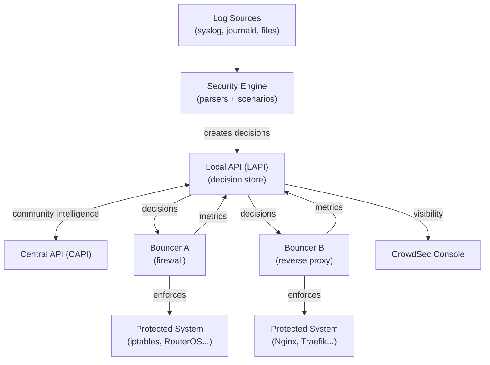
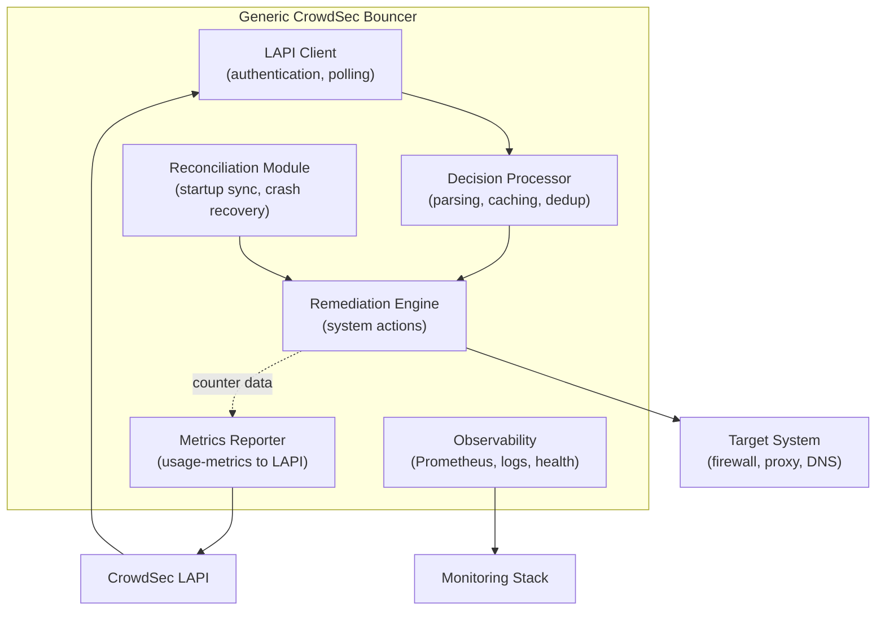
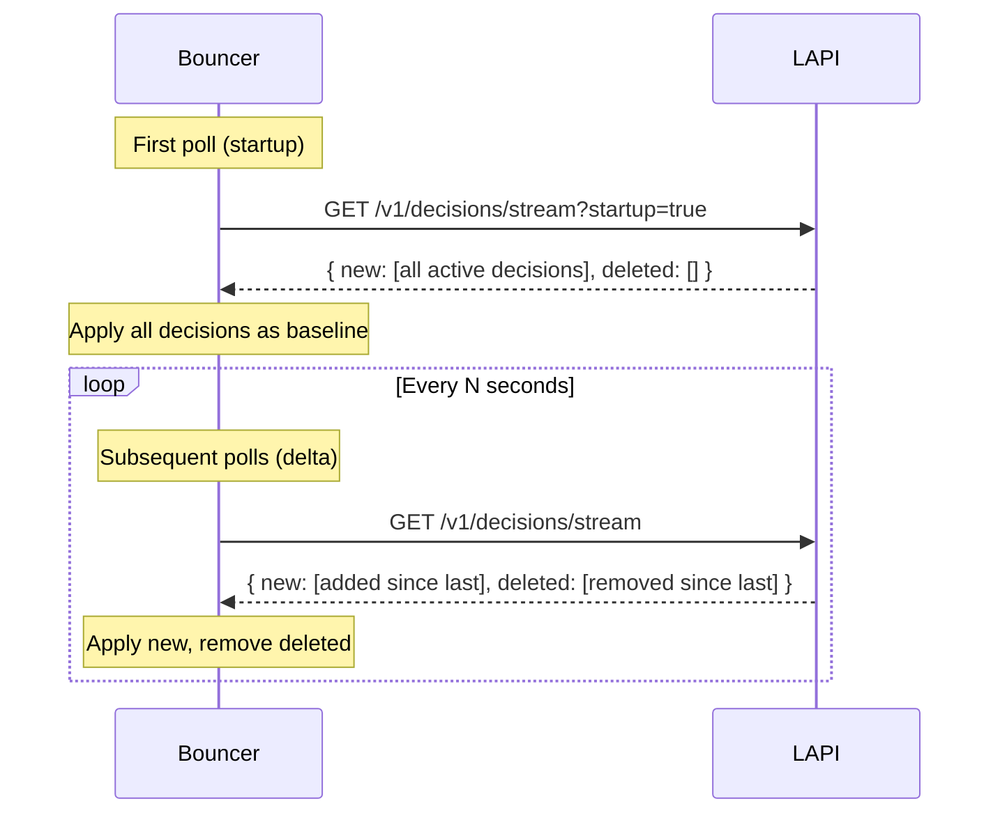
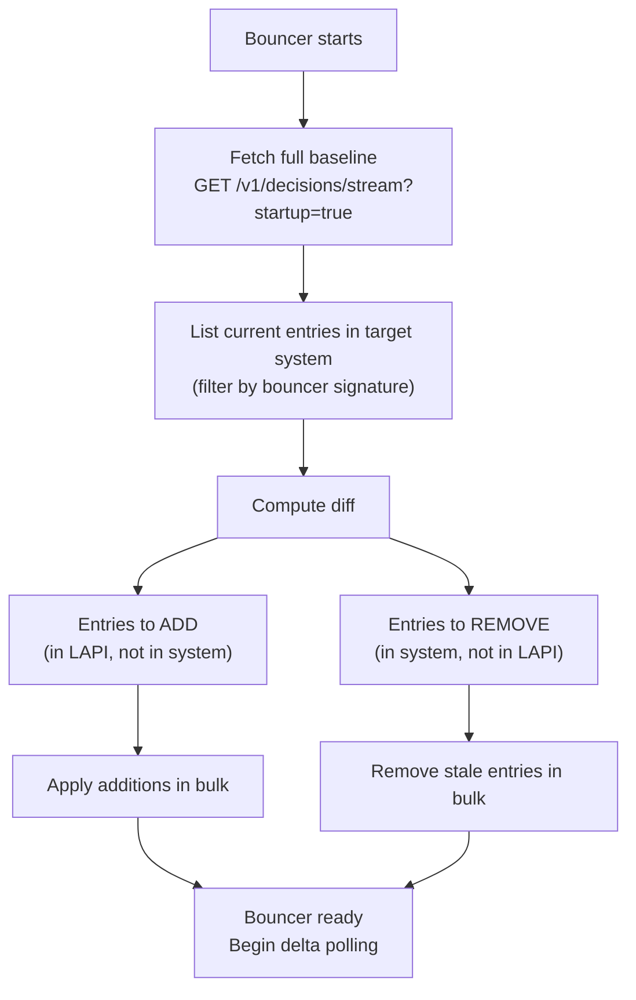
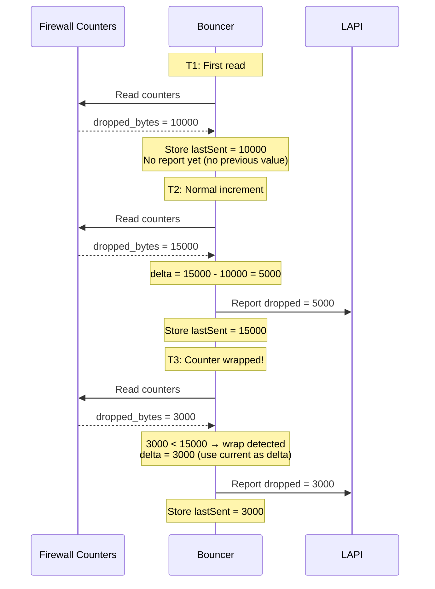
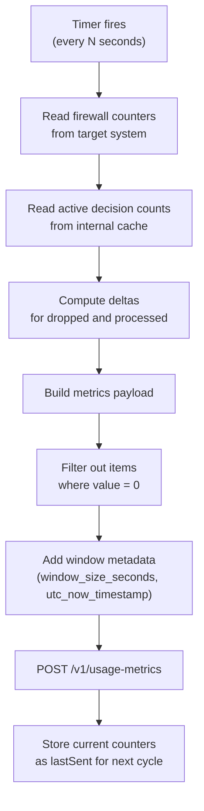

import TLDRSummary from "@components/ui/TLDRSummary.astro";
import Callout from "@components/ui/Callout.astro";
import Mermaid from "@components/ui/Mermaid.astro";
import CheckList from "@components/ui/CheckList.astro";
import StepByStep from "@components/ui/StepByStep.astro";
import Collapsible from "@components/ui/Collapsible.astro";
import Table from "@components/ui/Table.astro";
import Code from "@components/ui/Code.astro";
import APIEndpoint from "@components/ui/APIEndpoint.astro";
import BeforeAfter from "@components/ui/BeforeAfter.astro";
import Timeline from "@components/ui/Timeline.astro";
import BarChart from "@components/ui/BarChart.astro";
import DecisionTree from "@components/ui/DecisionTree.astro";
import { TerminalSession, TerminalSessionCommand, TerminalSessionOutput } from "@components/ui/terminal-session";

## Introduction

<TLDRSummary>
- **Receiving decisions**: How bouncers authenticate with the LAPI and consume decision streams (startup baseline + delta polling).
- **Enforcing remediation**: Translating abstract decisions (ban, captcha, throttle) into concrete system actions (firewall rules, HTTP responses).
- **Reporting metrics**: The three metric categories (`active_decisions`, `dropped`, `processed`), delta computation from cumulative counters, and window metadata.
- **Reconciliation**: Recovering from crashes, handling stale state, and signature-based cleanup.
- **Testing and observability**: Prometheus metrics, structured logging, and health endpoints for production monitoring.
- **Common pitfalls**: Mistakes to avoid when building your first bouncer.
</TLDRSummary>

Bouncers are the enforcement arm of CrowdSec. They sit between the Local API (LAPI) and the system they protect — a firewall, a reverse proxy, a DNS resolver, or anything that can take action on malicious traffic. While the Security Engine handles detection, bouncers handle the response.

This post covers the **full bidirectional protocol** that every bouncer must implement:

1. **LAPI → Bouncer**: Receiving and processing decisions (who to block, for how long, and why).
2. **Bouncer → System**: Translating decisions into concrete remediation actions.
4. **Reconciliation**: Detecting and recovering from state drift between the bouncer and the target system.
5. **Observability**: Health endpoints, structured logs, and Prometheus metrics for production monitoring.

Each of these layers introduces design decisions that affect reliability, performance, and operational experience.
3. **Bouncer → LAPI**: Reporting usage metrics back so operators can monitor enforcement.

The concepts here are **language-agnostic**. Whether you build your bouncer in Go, Python, Rust, or shell scripts, the protocol and design patterns are identical. We use [cs-routeros-bouncer](https://github.com/jmrplens/cs-routeros-bouncer) as a real-world case study, but every pattern applies universally.

For official documentation on what bouncers are and how they fit into the CrowdSec ecosystem, see the [bouncer introduction](https://docs.crowdsec.net/u/bouncers/intro/).

<Callout type="info" title="Who is this post for?">
This post targets developers building **new CrowdSec bouncers** or operators who want to understand how their existing bouncers work under the hood. You don't need CrowdSec experience to follow along — we build up every concept from scratch. If you're already running CrowdSec, skip ahead to the section that interests you most.
</Callout>

## The CrowdSec ecosystem

Before diving into bouncer internals, let's establish where bouncers fit in the broader architecture.

CrowdSec is a **detect → decide → enforce** pipeline. The Security Engine parses logs and detects threats using behavioral scenarios. The LAPI (Local API) centralizes these detections into decisions — time-limited directives that specify which IPs, ranges, or identifiers should be restricted, and how. Bouncers sit at the enforcement layer: they query the LAPI for decisions and translate them into concrete actions on the systems they protect. The Console provides a centralized dashboard. And CAPI (Central API) enables community-wide intelligence sharing, distributing curated blocklists across the entire fleet.

<Mermaid caption="CrowdSec ecosystem: detection, decisions, enforcement, and feedback" ariaLabel="Flowchart showing log sources feeding the Security Engine, which creates decisions in the LAPI. The LAPI exchanges community intelligence with CAPI, distributes decisions to bouncers, and feeds visibility data to the Console. Bouncers enforce decisions on protected systems and report metrics back to the LAPI.">

</Mermaid>

The key insight is that **bouncers are bidirectional**. They don't just consume decisions — they report back what they did with them. This feedback loop is what enables operators to verify that enforcement is working and to measure its impact.

CrowdSec provides SDKs in several languages to simplify bouncer development. The [Go SDK (go-cs-bouncer)](https://github.com/crowdsecurity/go-cs-bouncer) and [Python SDK (pycrowdsec)](https://github.com/crowdsecurity/pycrowdsec) handle LAPI communication, but understanding the underlying protocol is essential for debugging and custom implementations.

## Types of bouncers

Not all bouncers work the same way. The type of bouncer you build depends on **where** it runs and **what actions** it can take.

<Table title="Bouncer types by deployment model" ariaLabel="Table comparing four bouncer types: firewall, application, DNS, and custom, showing where each runs, how it blocks traffic, and examples">

| Type | Where it runs | How it blocks | Examples |
|---|---|---|---|
| **Firewall** | Network edge (iptables, nftables, pf, RouterOS) | IP-level drop or reject | cs-firewall-bouncer, cs-routeros-bouncer |
| **Application** | Inside the app or reverse proxy | HTTP 403, captcha challenge, throttle | Traefik plugin, WordPress plugin |
| **DNS** | DNS resolver | NXDOMAIN or sinkhole response | Custom implementations |
| **Custom** | Anywhere | Any action your system supports | Your own bouncer using the LAPI |

</Table>

**Firewall bouncers** operate at the network layer. They maintain address lists (or ipsets, or pf tables) and drop packets before they reach the application. This is the most efficient approach — blocked traffic never consumes application resources.

**Application bouncers** operate at the HTTP layer. They can do things firewall bouncers cannot: show captcha challenges, return custom error pages, or throttle requests with `429 Too Many Requests`. The trade-off is that the connection is already established before the bouncer acts.

**DNS bouncers** intercept at the resolution layer, returning `NXDOMAIN` or redirecting to a sinkhole. This is useful for blocking entire domains but less common for IP-based decisions.

**Custom bouncers** are anything else. You might build a bouncer that updates a CDN's WAF rules, modifies a load balancer's backend pool, sends alerts to a SIEM, or even controls physical access systems. The LAPI protocol is the same regardless of what the bouncer does with the decisions.

<DecisionTree question="What type of bouncer do you need?">
  <details>
    <summary>I need to block at the network level (drop packets before they reach the application)</summary>

    **Build a firewall bouncer.** This is the best choice for infrastructure-level protection. Your bouncer will manage address lists in a firewall (iptables, nftables, pf, RouterOS) and drop or reject packets from banned IPs. This is the most resource-efficient approach since blocked traffic never reaches your application stack.
  </details>
  <details>
    <summary>I need to show captchas, return HTTP errors, or throttle requests</summary>

    **Build an application bouncer.** This runs inside your reverse proxy or web application. It can inspect HTTP requests and respond with 403 Forbidden, a captcha challenge page, or rate-limited 429 responses. Choose this when you need granular, protocol-aware responses.
  </details>
  <details>
    <summary>I need to block at the DNS resolution level</summary>

    **Build a DNS bouncer.** This intercepts DNS queries and returns NXDOMAIN or redirects to a sinkhole for blocked domains or IPs. Useful for network-wide blocking at the resolver level, but less common for IP-based CrowdSec decisions.
  </details>
</DecisionTree>

## Anatomy of a bouncer

Regardless of type, every bouncer shares a common internal architecture. Here are the six subsystems that any production-ready bouncer must implement.

<Mermaid caption="Internal architecture of a generic CrowdSec bouncer" ariaLabel="Block diagram showing six internal components of a bouncer: LAPI Client for authentication and polling, Decision Processor for parsing and caching, Remediation Engine for translating decisions to system actions, Reconciliation Module for startup sync and crash recovery, Metrics Reporter for usage-metrics to LAPI, and Observability for Prometheus metrics and structured logs.">

</Mermaid>

<StepByStep title="What every bouncer must implement">
<li>**Authenticate with the LAPI** using a registered API key. This is the bouncer's identity — without it, the LAPI rejects all requests.</li>
<li>**Poll for decisions** using the stream endpoint (for firewall bouncers) or the live endpoint (for application bouncers). Handle both the startup baseline and subsequent deltas.</li>
<li>**Process decisions** by parsing the decision model, deduplicating against a local cache, and handling unknown decision types gracefully.</li>
<li>**Enforce remediation** by translating abstract decisions (ban, captcha, throttle) into concrete system actions (firewall rules, HTTP responses, DNS overrides).</li>
<li>**Reconcile state on startup** by comparing the LAPI's current decisions against whatever is already in the target system. Apply the diff.</li>
<li>**Report usage metrics** back to the LAPI at regular intervals, including active decision counts, dropped traffic, and processed traffic.</li>
<li>**Expose observability** through Prometheus metrics, structured logs, and a health endpoint for monitoring.</li>
</StepByStep>

The rest of this post unpacks each of these steps in detail.

## Receiving decisions

The first job of any bouncer is to learn **what to block**. CrowdSec provides two modes for this: **stream mode** (polling) and **live mode** (per-request lookup). Both use the same LAPI, the same authentication, and the same decision model.

### Authentication

Every bouncer must register with the LAPI before it can receive decisions. Registration creates a unique API key that the bouncer sends on every request via the `X-Api-Key` header.

<TerminalSession title="Registering a bouncer with the LAPI">
  <TerminalSessionCommand prompt="$" ariaLabel="Register a new bouncer named my-firewall-bouncer with cscli">
    cscli bouncers add my-firewall-bouncer
  </TerminalSessionCommand>
  <TerminalSessionOutput>
{`API key for 'my-firewall-bouncer':

   a1b2c3d4e5f6a1b2c3d4e5f6a1b2c3d4

Please keep this key since you will not be able to retrieve it!`}
  </TerminalSessionOutput>
</TerminalSession>

Store this key securely. The bouncer includes it in every LAPI request:

<Code lang="http" title="Authentication header on every LAPI request">
{`GET /v1/decisions/stream?startup=true HTTP/1.1
Host: localhost:8080
X-Api-Key: a1b2c3d4e5f6a1b2c3d4e5f6a1b2c3d4`}
</Code>

If the key is invalid or revoked, the LAPI returns `403 Forbidden` and the bouncer must stop operating — it has no authority to make enforcement decisions without a valid identity.

### Stream mode: `/v1/decisions/stream`

Stream mode is the primary consumption pattern for **firewall bouncers** and any bouncer that maintains a local state of active decisions. The bouncer polls the LAPI at regular intervals (typically every 10–60 seconds) and receives **delta updates**.

<APIEndpoint>

**`GET /v1/decisions/stream`**

Returns decisions as a stream of changes (new additions and deletions) since the last poll.

**Key parameter**: `startup=true` on the first request to receive the complete baseline of all active decisions. Subsequent requests use `startup=false` (default) to receive only changes.

For busy LAPI instances connected to the community blocklist (CAPI), the startup response can contain thousands of decisions. Your bouncer must be prepared to handle a large initial payload efficiently — this is where bulk operations (Section 7) become essential.

**Response shape**:
```json
{
  "new": [/* Decision objects to enforce */],
  "deleted": [/* Decision objects to remove */]
}
```

</APIEndpoint>

The two-phase pattern is critical to understand:

<Mermaid caption="Stream mode: startup baseline followed by delta polling" ariaLabel="Sequence diagram showing a bouncer making its first request to the LAPI with startup=true and receiving all active decisions, then making subsequent requests with startup=false and receiving only new and deleted decisions since the last poll.">

</Mermaid>

**Why two phases?** On startup, the bouncer has no local state. It needs the complete picture. After that, it only needs changes — this keeps the payload small and the processing fast, even when the LAPI manages thousands of decisions.

The polling interval is configurable — typically between 10 and 60 seconds. A shorter interval means faster enforcement (less time between a decision being created and the bouncer applying it) but more load on the LAPI. A longer interval reduces load but increases the window during which a newly banned IP can still reach the protected system. For most deployments, **30 seconds** is a good default.

<Callout type="note" title="Empty responses are normal">
If no decisions have changed since the last poll, the LAPI returns `{ "new": null, "deleted": null }`. Your bouncer should handle `null` arrays gracefully — they mean "no changes," not "an error occurred." This is the common case during quiet periods.
</Callout>

### Live mode: `/v1/decisions`

Live mode is designed for **application bouncers** that check individual IPs at request time rather than maintaining a local cache.

<Code lang="http" title="Live mode: checking a specific IP">
{`GET /v1/decisions?ip=203.0.113.42 HTTP/1.1
Host: localhost:8080
X-Api-Key: a1b2c3d4e5f6a1b2c3d4e5f6a1b2c3d4`}
</Code>

The LAPI returns any active decisions matching that IP, or an empty response if the IP is clean. This is simpler to implement — no local cache, no reconciliation — but it adds latency to every request since the bouncer must query the LAPI synchronously.

In practice, many application bouncers use a **hybrid approach**: they poll the LAPI in stream mode to maintain a local in-memory cache, and then check that cache on each request instead of making a live LAPI call. This gives the speed benefits of a local cache with the simplicity of not managing persistent state in a firewall.

<Callout type="tip" title="Choosing between stream and live mode">
**Use stream mode** when your bouncer maintains persistent state (firewall address lists, ipsets, pf tables). The local cache means enforcement is instant — no LAPI roundtrip per packet.

**Use live mode** when your bouncer is stateless or runs inside a request pipeline (reverse proxy plugin, application middleware). It trades latency for simplicity.
</Callout>

### The Decision model

Every decision the LAPI sends — whether via stream or live mode — follows the same structure. Understanding each field is essential for correct enforcement. The LAPI may evolve this model over time, so a well-designed bouncer should tolerate unknown fields gracefully.

<Table title="Decision model fields" ariaLabel="Table listing all fields in a CrowdSec decision object with their types and descriptions">

| Field | Type | Description |
|---|---|---|
| `id` | integer | Internal LAPI identifier (read-only, used for deduplication) |
| `uuid` | string | Globally unique decision identifier (read-only) |
| `origin` | string | Source of the decision: `"crowdsec"`, `"CAPI"`, `"cscli"`, `"lists"` |
| `type` | string | Remediation action: `"ban"`, `"captcha"`, `"throttle"`, or custom |
| `scope` | string | Target scope: `"ip"`, `"range"`, `"country"`, etc. |
| `value` | string | The actual target: an IP address, CIDR block, or country code |
| `duration` | string | Remaining time-to-live (e.g., `"3h59m42s"`) |
| `until` | string | Absolute expiration timestamp (ISO 8601) |
| `scenario` | string | The scenario that triggered this decision (e.g., `"crowdsecurity/http-probing"`) |
| `simulated` | boolean | If `true`, the decision is for testing only — **do NOT enforce** |

</Table>

<Callout type="keypoint" title="The simulated flag is not optional">
Bouncers **must** check the `simulated` field and skip enforcement when it is `true`. This flag allows operators to deploy new detection scenarios in production and observe what *would* be blocked, without actually impacting traffic. If your bouncer ignores this field, operators lose the ability to safely test new rules — and that leads to either over-blocking in production or never deploying new scenarios at all.
</Callout>

### Stream filters

The stream endpoint accepts query parameters that let bouncers request only the decisions they care about. This reduces network traffic and processing overhead.

<Table title="Stream filter parameters" ariaLabel="Table showing available filter parameters for the decisions stream endpoint, with their purpose and example values">

| Parameter | Purpose | Example |
|---|---|---|
| `scopes` | Limit to specific target scopes | `scopes=ip,range` |
| `origins` | Only from specific decision origins | `origins=crowdsec,cscli` |
| `scenarios_containing` | Only decisions matching these scenarios | `scenarios_containing=http-` |
| `scenarios_not_containing` | Exclude decisions matching these scenarios | `scenarios_not_containing=ssh-` |

</Table>

<Callout type="tip" title="Filter aggressively">
A firewall bouncer doesn't need `captcha` decisions (it can't show a challenge page). An SSH-focused bouncer doesn't need HTTP scenarios. Filtering at the LAPI level means your bouncer processes less data, makes fewer system calls, and starts up faster after a restart.
</Callout>

## Processing decisions

Once decisions arrive from the LAPI, the bouncer must process them correctly before taking any action. This section covers the parsing, caching, and edge cases that trip up naive implementations.

### Parsing new vs deleted

Every stream response contains two arrays: `new` (decisions to enforce) and `deleted` (decisions to remove). The processing loop must handle both on every poll:

<Code lang="text" title="Decision processing pseudocode">
{`function processStreamResponse(response):
    for decision in response.new:
        if decision.simulated:
            log("Skipping simulated decision", decision)
            continue
        enforcementType = resolveType(decision.type)
        timeout = parseDuration(decision.duration)
        enforceDecision(decision.scope, decision.value, enforcementType, timeout)
        cache.add(decision.value, decision)

    for decision in response.deleted:
        if cache.contains(decision.value):
            removeDecision(decision.scope, decision.value)
            cache.remove(decision.value)
        else:
            log("Ignoring deletion for unknown decision", decision.value)`}
</Code>

The `deleted` array contains decisions that have either **expired** (their duration elapsed) or been **manually removed** by an operator via `cscli decisions delete`. Either way, the bouncer must remove the corresponding system-level rule.

### Duration handling

CrowdSec sends the `duration` field as a Go-style duration string: `"4h"`, `"24h0m0s"`, `"3h59m42.123s"`. Your bouncer must parse this into whatever format the target system expects.

<Code lang="text" title="Duration parsing with fallback">
{`function parseDuration(durationString):
    // Parse Go-style duration: "4h", "30m", "24h0m0s", "3h59m42.123s"
    hours = extractHours(durationString)
    minutes = extractMinutes(durationString)
    seconds = extractSeconds(durationString)

    totalSeconds = hours * 3600 + minutes * 60 + seconds

    if totalSeconds <= 0:
        log("Failed to parse duration, using fallback", durationString)
        totalSeconds = 4 * 3600  // Safe default: 4 hours

    return totalSeconds`}
</Code>

<Callout type="warning" title="Always have a fallback duration">
If duration parsing fails — due to an unexpected format, a new LAPI version, or a custom scenario with unusual durations — your bouncer should use a safe default rather than crashing or applying an infinite ban. Four hours is a reasonable choice: long enough to be useful, short enough to self-heal if something goes wrong.
</Callout>

### Caching and deduplication

Maintaining a local cache of active decisions is critical for performance. Without it, every poll cycle results in redundant system calls:

- **On ban**: Check if the IP is already in cache. If yes, just update the timeout — don't re-add the firewall rule.
- **On unban**: Check if the IP is in cache. If no, skip the removal — the entry already expired or was never applied.

This matters because system calls (adding a firewall rule, modifying an ipset) are **expensive** compared to an in-memory lookup. A bouncer receiving 12,000+ decisions from CAPI on startup should not make 12,000 API calls to a router if most of those IPs are already in its address list from a previous run.

The cache also enables **efficient metrics collection**. When the bouncer needs to count active decisions by origin and IP type, it iterates the cache — not the firewall. Cache lookups are O(1), while querying a remote device could take seconds.

<Code lang="text" title="Cache operations pseudocode">
{`// Cache interface — use whatever data structure fits your language
cache = new Map<string, Decision>()

function onNewDecision(decision):
    existing = cache.get(decision.value)
    if existing != null:
        // Already cached — update timeout, skip system call
        existing.duration = decision.duration
        updateTimeout(decision.value, parseDuration(decision.duration))
        return
    // New entry — add to cache and to the target system
    cache.set(decision.value, decision)
    addToSystem(decision)

function onDeletedDecision(decision):
    if cache.has(decision.value):
        cache.delete(decision.value)
        removeFromSystem(decision.value)

function countActiveByOrigin():
    counts = new Map<string, int>()
    for decision in cache.values():
        key = decision.origin + ":" + decision.ip_type
        counts[key] = counts.getOrDefault(key, 0) + 1
    return counts`}
</Code>

### Unknown decision types

CrowdSec allows custom decision types through scenario profiles. Your bouncer might receive a decision with `type: "throttle"` or `type: "mfa-required"` that it doesn't know how to handle.

<DecisionTree question="What to do with an unknown decision type?">
  <details>
    <summary>Fallback to ban</summary>

    The safest approach: treat any unknown type as a ban. This ensures no malicious traffic slips through, but it may over-block — a `captcha` decision that gets enforced as a `ban` blocks legitimate users who could have solved the challenge.
  </details>
  <details>
    <summary>Ignore and log</summary>

    The most conservative approach: skip unknown types and log a warning. This avoids false positives but means some decisions go unenforced. Suitable for bouncers where over-blocking is worse than under-blocking.
  </details>
  <details>
    <summary>Configuration-driven fallback</summary>

    The most flexible approach: let the operator configure the fallback behavior. For example, a config option like `unknown_decision_action: ban | ignore | log` gives operators control over the trade-off. This is what mature bouncers implement.
  </details>
</DecisionTree>

## Remediation actions

Receiving decisions is only half the job. The bouncer must translate each decision into a concrete action on the target system. This is where bouncer types diverge.

### Decision type catalog

<Table title="Remediation actions by bouncer type" ariaLabel="Table mapping each CrowdSec decision type to the corresponding action for firewall and application bouncers">

| Type | Firewall bouncer action | Application bouncer action | Notes |
|---|---|---|---|
| `ban` | Drop or reject packets from the IP | Return HTTP 403 Forbidden | Most common type, supported by all bouncers |
| `captcha` | N/A (cannot show challenges) | Show hCaptcha, reCAPTCHA, or Turnstile | Application bouncers only |
| `throttle` | Rate limit if supported | HTTP 429 + `Retry-After` header | Requires rate-limiting capability |
| Custom | Depends on implementation | Depends on implementation | Defined via CrowdSec scenario profiles |

</Table>

### Firewall enforcement: drop vs reject

When a firewall bouncer blocks an IP, it must choose between two strategies: **drop** (silently discard) or **reject** (send an error response back).

<BeforeAfter beforeLabel="Drop (silent discard)" afterLabel="Reject (explicit denial)">
  <Fragment slot="before">
    **Drop** silently discards the packet. The sender receives no response and eventually times out. This reveals nothing about the firewall's existence, uses minimal resources (no response packet generated), and is the standard production default. However, it can frustrate legitimate users behind a shared IP — they see a mysterious timeout instead of a clear error.
  </Fragment>
  <Fragment slot="after">
    **Reject** sends an ICMP Destination Unreachable or a TCP RST back to the sender. The client immediately knows it's blocked. This uses slightly more resources (one response packet per blocked attempt) and reveals that a firewall is present, but provides cleaner feedback. Better for development, testing, and networks where shared IPs are common.
  </Fragment>
</BeforeAfter>

<Table title="Drop vs Reject comparison" ariaLabel="Table comparing drop and reject firewall strategies across response behavior, resource usage, information leakage, and recommended use">

| Aspect | Drop | Reject |
|---|---|---|
| Response to client | None (timeout) | ICMP unreachable or TCP RST |
| Resource usage | Minimal | Slightly higher |
| Information leakage | None | Reveals firewall presence |
| User experience | Mysterious timeout | Immediate clear error |
| Recommended for | Production (default) | Testing, development |

</Table>

### Decision lifecycle

A single ban decision goes through multiple states over its lifetime. Understanding this lifecycle helps when debugging timing issues.

<Timeline events={[
  { date: "T+0", title: "Decision created", description: "CrowdSec Security Engine detects malicious behavior and creates a ban decision via the LAPI.", type: "milestone" },
  { date: "T+0 to T+60s", title: "Decision propagated", description: "Bouncer polls the LAPI on its next cycle and receives the new decision in the `new` array.", type: "default" },
  { date: "T+60s", title: "Remediation enforced", description: "Bouncer adds the IP to the firewall address list with a timeout matching the decision duration.", type: "success" },
  { date: "T+60s to T+4h", title: "Decision active", description: "Traffic from the banned IP is dropped or rejected. The bouncer tracks dropped bytes and packets for metrics reporting.", type: "default" },
  { date: "T+4h", title: "Decision expires", description: "The duration elapses. The LAPI includes this decision in the `deleted` array on the next poll. The system-level timeout also expires.", type: "warning" },
  { date: "T+4h+60s", title: "Cleanup", description: "Bouncer removes the IP from its local cache. If the target system already expired the entry via its own timeout, this is a no-op.", type: "default" }
]} />

Notice the **dual expiration** pattern: the target system has its own timeout (set when the rule was created), and the LAPI eventually sends a deletion. A well-designed bouncer handles both gracefully — the system-side timeout acts as a safety net if the bouncer misses a deletion, and the LAPI deletion acts as a safety net if the system-side timeout drifts.

### Bulk operations

On startup, a bouncer may receive **thousands** of decisions in the baseline response (`startup=true`). Applying them one by one is prohibitively slow — each system call (adding a firewall rule, making an API request to a router) takes time.

Production bouncers should use **bulk operations** wherever the target system supports them:

- **iptables/nftables**: `ipset restore` can load thousands of entries in a single call.
- **pf**: `pfctl -t crowdsec -T add` accepts multiple addresses.
- **RouterOS**: Scripting mode can batch multiple `/ip/firewall/address-list/add` commands.
- **Application bouncers**: Load all decisions into an in-memory map in a single pass.

The startup path should always be optimized for bulk. The steady-state polling path (small deltas) can afford individual operations.

<Callout type="tip" title="Benchmark your bulk path">
During development, create a test set of 10,000 decisions and measure how long your bouncer takes to import them at startup. If it exceeds a few seconds, increase parallelism, use a bulk API, or batch operations more aggressively.
</Callout>

For systems without native bulk APIs, group operations into batches of 100–500 items and apply them sequentially. This provides a good balance between speed and resource pressure on the target system.

Consider implementing a progress indicator for large imports. When processing 10,000+ decisions at startup, operators appreciate knowing whether the bouncer is making progress or stuck. A simple log message every 1,000 entries ("Applied 3000/12500 decisions...") transforms a silent wait into a transparent operation.

## Reconciliation

Reconciliation is the process of **synchronizing** the bouncer's local state, the LAPI's decisions, and the target system's actual configuration. It's most critical at startup but also relevant during normal operation.

### Why reconciliation is necessary

Over time, the bouncer's local state inevitably drifts from reality. There are several root causes, and all of them occur regularly in production environments.

Three scenarios create state divergence:

1. **Bouncer crashes and restarts**: The bouncer's in-memory state is lost, but the target system (firewall) still has the rules from the previous run. Without reconciliation, the bouncer would re-add all decisions, creating duplicates.

2. **Decisions expire while bouncer is offline**: If the bouncer is down for several hours, some decisions will have expired in the LAPI. The target system may still have those entries if its local timeout hasn't elapsed. The bouncer must remove them.

3. **Configuration changes**: If the operator changes the address list name or the comment prefix between runs, the bouncer's new configuration won't match the entries from the previous run. Stale entries accumulate.

### The reconciliation algorithm

<Mermaid caption="Reconciliation: computing and applying the diff between LAPI and system state" ariaLabel="Flowchart showing the reconciliation algorithm. On startup, the bouncer fetches the full baseline from the LAPI, lists all entries currently in the target system that match its signature, computes entries to add (in LAPI but not in system) and entries to remove (in system but not in LAPI), then applies both sets in bulk.">

</Mermaid>

The key optimization is computing the diff **before** making any system calls. A naive implementation that blindly adds all LAPI decisions and then removes stale entries does twice the work — and on a router with limited CPU, that matters.

<Code lang="text" title="Reconciliation diff pseudocode">
{`function reconcile():
    // Phase 1: Gather state
    lapiDecisions = fetchBaseline()    // GET /v1/decisions/stream?startup=true
    systemEntries = listSystemEntries() // Only entries with our signature

    lapiSet = Set(d.value for d in lapiDecisions)
    systemSet = Set(e.address for e in systemEntries)

    // Phase 2: Compute diff
    toAdd = lapiSet - systemSet     // In LAPI but not in system
    toRemove = systemSet - lapiSet  // In system but not in LAPI
    toUpdate = lapiSet & systemSet  // In both — check timeout freshness

    // Phase 3: Apply (bulk where possible)
    bulkAdd(toAdd, lapiDecisions)
    bulkRemove(toRemove, systemEntries)
    for entry in toUpdate:
        if needsTimeoutRefresh(entry):
            updateTimeout(entry)

    log("Reconciliation complete",
        "added", len(toAdd),
        "removed", len(toRemove),
        "updated", len(toUpdate))`}
</Code>

This algorithm is idempotent — running it twice produces the same result. This is important because the bouncer may crash during reconciliation and need to restart the process.

### Signature-based cleanup

After a crash, entries from the previous run remain in the target system. How does the bouncer find them?

The answer is **signatures**. Every entry the bouncer creates should include a fixed, recognizable marker in its comment or tag field. On startup, the bouncer searches for this marker to discover all entries it previously created — regardless of whether the configuration has changed.

<Code lang="text" title="Comment format with embedded signature">
{`// Format: "<scenario> | <origin> @<bouncer-signature>"
// Examples:
"crowdsecurity/http-probing | crowdsec @cs-routeros-bouncer"
"crowdsecurity/ssh-bf | CAPI @cs-routeros-bouncer"
"manual ban | cscli @cs-routeros-bouncer"

// On startup, search for all entries containing "@cs-routeros-bouncer"
// This works even if the comment prefix or address list name changed`}
</Code>

<Callout type="keypoint" title="Why signatures matter">
Without a signature, the bouncer has no reliable way to distinguish its own entries from manually created firewall rules. It would need to rely on exact comment matching or address list names — both of which break when operators change configuration. A fixed signature embedded in every comment provides a stable anchor across restarts and configuration changes.
</Callout>

## Metrics reporting

This section is the heart of the bouncer-to-LAPI communication. Metrics reporting is what makes CrowdSec's Console dashboard work — without it, operators can see decisions but cannot verify that enforcement is actually happening.

### The usage-metrics endpoint

Bouncers report metrics by POSTing to the [LAPI's usage-metrics endpoint](https://crowdsecurity.github.io/api_doc/lapi/#/bouncers/post_v1_usage_metrics):

<APIEndpoint>

**`POST /v1/usage-metrics`**

Reports bouncer telemetry to the LAPI. Authenticated with the same `X-Api-Key` header used for decision polling.

**Content-Type**: `application/json`

The payload identifies the bouncer and includes one or more metric snapshots.

</APIEndpoint>

### Bouncer metadata

Every metrics payload starts with metadata identifying the bouncer instance:

<Code lang="json" title="Top-level structure of a usage-metrics payload">
{`{
  "remediation_components": [
    {
      "version": "1.2.0",
      "name": "cscli-generated-bouncer-name",
      "type": "cs-routeros-bouncer",
      "utc_startup_timestamp": 1719849600,
      "os": {
        "name": "linux",
        "family": "debian",
        "version": "12"
      },
      "feature_flags": [],
      "metrics": [ ... ]
    }
  ]
}`}
</Code>

The `name` field must match the bouncer name registered with `cscli bouncers add`. The `type` identifies the bouncer software (e.g., `cs-firewall-bouncer`, `cs-routeros-bouncer`). The `utc_startup_timestamp` tells the LAPI when this bouncer instance started — useful for detecting restarts.

### The three metric categories

CrowdSec metrics fall into three categories, each serving a different purpose in the Console dashboard.

<BarChart
  data={[
    { label: "active_decisions (CAPI)", value: 12500 },
    { label: "active_decisions (crowdsec)", value: 45 },
    { label: "active_decisions (cscli)", value: 3 },
    { label: "dropped (ipv4, bytes)", value: 847000 },
    { label: "dropped (ipv6, bytes)", value: 12300 },
    { label: "processed (ipv4, bytes)", value: 5200000 }
  ]}
  title="Example metric values for a single reporting window"
  valueUnit=""
  showValue={true}
  ariaLabel="Bar chart showing example metric values: 12500 active CAPI decisions, 45 active crowdsec decisions, 3 active cscli decisions, 847000 dropped IPv4 bytes, 12300 dropped IPv6 bytes, and 5200000 processed IPv4 bytes"
  caption="Relative scale of typical metric values in a single 600-second window"
/>

#### `active_decisions` — what's currently enforced

This metric reports **how many decisions are currently active** in the bouncer, broken down by origin and IP type. It's a **snapshot** (gauge) — not a delta.

<Code lang="json" title="active_decisions metric item">
{`{
  "name": "active_decisions",
  "value": 12500,
  "unit": "ip",
  "labels": {
    "origin": "CAPI",
    "ip_type": "ipv4"
  }
}`}
</Code>

Labels:
- **`origin`**: Where the decision came from — `"crowdsec"` (local Security Engine), `"CAPI"` (community blocklist), `"cscli"` (manual), or `"lists"` (static lists).
- **`ip_type`**: `"ipv4"` or `"ipv6"`.

This tells operators: "Right now, I have 12,500 CAPI-sourced IPv4 bans active." It's the single most important metric for verifying that the bouncer is actually receiving and enforcing decisions.

#### `dropped` — what got blocked

This metric reports **traffic that was blocked** by the bouncer's rules. It uses two units (`"byte"` and `"packet"`) and is labeled by IP type.

<Code lang="json" title="dropped metric items (bytes and packets)">
{`{
  "name": "dropped",
  "value": 847293,
  "unit": "byte",
  "labels": { "ip_type": "ipv4" }
}
{
  "name": "dropped",
  "value": 1523,
  "unit": "packet",
  "labels": { "ip_type": "ipv4" }
}`}
</Code>

**These are deltas** — the increment since the last metrics report, not cumulative totals. If the bouncer dropped 847,293 bytes in the last 600 seconds, that's the value it reports. The next report covers the next 600-second window.

#### `processed` — total traffic through the rules

This metric reports **all traffic** that traversed the bouncer's rules — both allowed and dropped. It has the same structure as `dropped`: two units, same labels, also deltas.

<Code lang="json" title="processed metric items">
{`{
  "name": "processed",
  "value": 52340000,
  "unit": "byte",
  "labels": { "ip_type": "ipv4" }
}
{
  "name": "processed",
  "value": 89200,
  "unit": "packet",
  "labels": { "ip_type": "ipv4" }
}`}
</Code>

Combined with `dropped`, this allows the CrowdSec Console to compute a **block rate**: `dropped / processed`. A block rate of 1.6% means that 1.6% of all traffic traversing the firewall rules matched a CrowdSec decision and was blocked.

<Callout type="keypoint" title="Gauges vs deltas — don't mix them up">
The distinction between snapshots and deltas is the single most common source of metrics bugs in bouncer implementations.

- **`active_decisions`** is a **gauge** (point-in-time snapshot). Report the current count every time.
- **`dropped`** and **`processed`** are **deltas** (increments over a time window). Report only the change since the last report.

If you accidentally report cumulative dropped bytes instead of the delta, the Console will show exponentially growing traffic graphs — a telltale sign that delta computation is broken.
</Callout>

### Window metadata

Every metrics push includes metadata describing the time window it covers:

<Code lang="json" title="Metrics window metadata">
{`{
  "meta": {
    "window_size_seconds": 600,
    "utc_now_timestamp": 1719850200
  },
  "items": [ ... ]
}`}
</Code>

- **`window_size_seconds`**: How much time these deltas cover (e.g., 600 seconds = 10 minutes). This is the bouncer's reporting interval.
- **`utc_now_timestamp`**: When this snapshot was taken (Unix epoch).

The Console uses these to calculate rates. If the bouncer reports 847,293 dropped bytes with a window of 600 seconds, the Console can display ~1,412 bytes/sec blocked.

### Delta tracking from cumulative counters

This is the trickiest part of metrics implementation. Most target systems (iptables, nftables, RouterOS, pf) expose **cumulative** counters — they count total bytes/packets since the rule was created or the counter was last reset. CrowdSec expects **deltas**.

The bouncer must compute deltas itself by tracking the previous counter value:

<Mermaid caption="Delta computation from cumulative firewall counters" ariaLabel="Sequence diagram showing a bouncer reading cumulative firewall counters at three consecutive intervals. At T1 it reads 10000 bytes and stores that as lastSent. At T2 it reads 15000 bytes, computes delta as 5000, reports that to the LAPI, and stores 15000 as lastSent. At T3 it reads 3000 bytes (counter wrapped), detects the wrap, uses 3000 as the delta, and stores 3000 as lastSent.">

</Mermaid>

The pseudocode is simple but important to get right:

<Code lang="text" title="Delta computation with wrap-around handling">
{`function computeDelta(current, lastSent):
    if current >= lastSent:
        return current - lastSent   // Normal increment
    else:
        return current              // Counter wrapped, use current as delta`}
</Code>

<Callout type="warning" title="Counter wrap-around is real">
Counter wrap-around happens when the system's counter exceeds its maximum value (e.g., `uint32` max ≈ 4.3 billion) and resets to zero. It also happens after a system restart or a manual counter reset. A bouncer **must** handle this gracefully — using the current value as the delta is a safe approximation. The small inaccuracy (losing the bytes between the last read and the wrap point) is acceptable and self-corrects on the next interval.
</Callout>

### The complete collection cycle

Putting it all together, here is the full metrics collection and reporting cycle:

<Mermaid caption="Complete metrics collection and reporting cycle" ariaLabel="Flowchart showing the complete metrics push cycle. A timer fires every N seconds. The bouncer reads firewall counters from the target system, reads active decision counts from its internal cache, computes deltas for dropped and processed metrics, builds the AllMetrics payload with window metadata, filters out items with value zero, posts to the LAPI usage-metrics endpoint, and stores the current counter values for the next cycle.">

</Mermaid>

<Callout type="tip" title="Only report non-zero items">
Skip metric items where the value is zero. If no IPv6 traffic was dropped in this window, don't include a `dropped` item with `ip_type: ipv6` and `value: 0`. This keeps the payload small and avoids cluttering the Console with noise.
</Callout>

### Full example payload

Here is a complete, realistic metrics payload that a firewall bouncer might send:

<Collapsible title="Complete usage-metrics JSON payload">

<Code lang="json" title="Realistic usage-metrics POST body">
{`{
  "remediation_components": [
    {
      "version": "1.5.0",
      "name": "my-firewall-bouncer",
      "type": "cs-firewall-bouncer",
      "utc_startup_timestamp": 1719849600,
      "os": {
        "name": "linux",
        "family": "debian",
        "version": "12"
      },
      "feature_flags": [],
      "metrics": [
        {
          "meta": {
            "window_size_seconds": 600,
            "utc_now_timestamp": 1719850200
          },
          "items": [
            {
              "name": "active_decisions",
              "value": 12500,
              "unit": "ip",
              "labels": { "origin": "CAPI", "ip_type": "ipv4" }
            },
            {
              "name": "active_decisions",
              "value": 45,
              "unit": "ip",
              "labels": { "origin": "crowdsec", "ip_type": "ipv4" }
            },
            {
              "name": "active_decisions",
              "value": 3,
              "unit": "ip",
              "labels": { "origin": "cscli", "ip_type": "ipv4" }
            },
            {
              "name": "active_decisions",
              "value": 8,
              "unit": "ip",
              "labels": { "origin": "CAPI", "ip_type": "ipv6" }
            },
            {
              "name": "dropped",
              "value": 847293,
              "unit": "byte",
              "labels": { "ip_type": "ipv4" }
            },
            {
              "name": "dropped",
              "value": 1523,
              "unit": "packet",
              "labels": { "ip_type": "ipv4" }
            },
            {
              "name": "dropped",
              "value": 12340,
              "unit": "byte",
              "labels": { "ip_type": "ipv6" }
            },
            {
              "name": "dropped",
              "value": 42,
              "unit": "packet",
              "labels": { "ip_type": "ipv6" }
            },
            {
              "name": "processed",
              "value": 52340000,
              "unit": "byte",
              "labels": { "ip_type": "ipv4" }
            },
            {
              "name": "processed",
              "value": 89200,
              "unit": "packet",
              "labels": { "ip_type": "ipv4" }
            }
          ]
        }
      ]
    }
  ]
}`}
</Code>

</Collapsible>

### What the operator sees

These metrics flow from the bouncer to the LAPI and ultimately to two places:

**`cscli metrics`** — The command-line tool shows a summary of bouncer activity, including active decision counts, decisions processed, and the last time the bouncer reported in. This is the operator's first-line diagnostic tool.

**CrowdSec Console** — The web dashboard aggregates metrics across all bouncers and displays active decisions, block rates (dropped/processed), traffic volumes, and historical trends. It's where operators verify that enforcement is working at scale.

Why does accuracy matter? If the bouncer reports incorrect metrics — cumulative instead of deltas, missing origins, wrong IP types — the Console shows misleading data. Operators might think enforcement is broken when it's working fine, or worse, think it's working when it isn't. Accurate metrics are the foundation of operational trust.

## Testing and observability

A bouncer that works but cannot be tested or observed is a liability. This section covers the tools and patterns for verifying bouncer behavior.

### Testing with cscli

The `cscli` command-line tool is the primary way to test bouncer behavior manually. You can create, list, and delete decisions without waiting for the Security Engine to detect real threats.

<TerminalSession title="Testing the full decision lifecycle with cscli">
  <TerminalSessionCommand prompt="$" ariaLabel="Add a test ban decision for IP 1.2.3.4 with a 5-minute duration">
    cscli decisions add --ip 1.2.3.4 --duration 5m --reason "manual test" --type ban
  </TerminalSessionCommand>
  <TerminalSessionOutput>
{`INFO[0000] Decision successfully added`}
  </TerminalSessionOutput>
  <TerminalSessionCommand prompt="$" ariaLabel="List all active decisions to verify the test ban was created">
    cscli decisions list
  </TerminalSessionCommand>
  <TerminalSessionOutput>
{`╭────┬──────────┬────────────────────┬──────────┬───────┬─────────┬───────────────────╮
│ ID │  Source  │     Scope:Value    │ Decision │ Until │ Created │     Scenario      │
├────┼──────────┼────────────────────┼──────────┼───────┼─────────┼───────────────────┤
│ 42 │ cscli    │ Ip:1.2.3.4         │ ban      │ 4m58s │ 2s ago  │ manual test       │
╰────┴──────────┴────────────────────┴──────────┴───────┴─────────┴───────────────────╯`}
  </TerminalSessionOutput>
  <TerminalSessionCommand prompt="$" ariaLabel="Delete the test ban decision for IP 1.2.3.4">
    cscli decisions delete --ip 1.2.3.4
  </TerminalSessionCommand>
  <TerminalSessionOutput>
{`INFO[0000] 1 decision(s) deleted`}
  </TerminalSessionOutput>
</TerminalSession>

After adding a decision, verify that your bouncer picks it up on the next poll cycle and applies it to the target system. After deleting, verify the removal. This tests the full `new` → enforce → `deleted` → remove pipeline.

You can also test edge cases that are hard to trigger organically:

<Table title="Testing scenarios with cscli" ariaLabel="Table listing test scenarios that can be verified using cscli commands, including the specific command and what to verify">

| Scenario | cscli command | What to verify |
|---|---|---|
| Basic ban | `cscli decisions add --ip 1.2.3.4 --type ban` | IP appears in firewall address list |
| IPv6 ban | `cscli decisions add --ip 2001:db8::1 --type ban` | IPv6 handling works correctly |
| Range ban | `cscli decisions add --range 10.0.0.0/24 --type ban` | CIDR ranges are handled |
| Simulated decision | `cscli decisions add --ip 5.6.7.8 --type ban` + set simulated flag | Decision is NOT enforced |
| Manual unban | `cscli decisions delete --ip 1.2.3.4` | IP removed from address list |
| Short duration | `cscli decisions add --ip 9.8.7.6 --duration 30s` | Entry expires after 30 seconds |
| Bulk import | `cscli decisions import -i blocklist.csv` | Startup-like bulk handling |

</Table>

<TerminalSession title="Checking bouncer registration and metrics">
  <TerminalSessionCommand prompt="$" ariaLabel="List all registered bouncers to see their status and last activity">
    cscli bouncers list
  </TerminalSessionCommand>
  <TerminalSessionOutput>
{`╭───────────────────────────┬───────────┬─────────────────────╮
│           Name            │ IP Address│    Last Pull        │
├───────────────────────────┼───────────┼─────────────────────┤
│ my-firewall-bouncer       │ 127.0.0.1 │ 2026-03-01 14:30:00 │
╰───────────────────────────┴───────────┴─────────────────────╯`}
  </TerminalSessionOutput>
</TerminalSession>

### Prometheus metrics

The LAPI usage-metrics protocol gives CrowdSec Console visibility into your fleet. But for **local operational monitoring** — dashboards, alerting, capacity planning — you need Prometheus-compatible metrics.

A production bouncer should expose Prometheus metrics for integration with monitoring stacks (Grafana, Alertmanager, etc.). Key metrics to expose:

<Table title="Recommended Prometheus metrics for a bouncer" ariaLabel="Table listing recommended Prometheus metric names, types, labels, and descriptions for a CrowdSec bouncer">

| Metric name | Type | Labels | Description |
|---|---|---|---|
| `bouncer_active_decisions` | Gauge | `ip_type`, `origin` | Currently active decisions |
| `bouncer_decisions_total` | Counter | `action`, `ip_type`, `origin` | Total decisions processed |
| `bouncer_errors_total` | Counter | `operation` | Errors by operation type |
| `bouncer_operation_duration_seconds` | Histogram | `operation` | Duration of system operations |

</Table>

These metrics serve a different purpose than the LAPI usage-metrics. Prometheus metrics are for **local observability** — alerting on errors, tracking operation latency, and debugging performance issues. LAPI metrics are for **CrowdSec Console** — aggregate enforcement visibility across all bouncers.

<Table title="Metrics comparison: Prometheus vs LAPI" ariaLabel="Table comparing Prometheus metrics and LAPI usage-metrics by audience, granularity, transport, and use case">

| Aspect | Prometheus metrics | LAPI usage-metrics |
|---|---|---|
| Audience | Local ops team | CrowdSec Console |
| Granularity | Per-second counters | Aggregated per window |
| Transport | Pull (HTTP scrape) | Push (HTTP POST) |
| Retention | Local TSDB | CrowdSec cloud |
| Alerting | Grafana / Alertmanager | Console dashboards |

</Table>

### Structured logging

Bouncer logs should include contextual fields that make debugging possible without grepping through walls of text. Key fields for each log entry:

<Code lang="json" title="Example structured log entries">
{`// Ban applied
{"level":"info","action":"ban","address":"203.0.113.42","list":"crowdsec-blocklist","timeout":"4h","origin":"CAPI","scenario":"crowdsecurity/http-probing"}

// Unban applied
{"level":"info","action":"unban","address":"203.0.113.42","list":"crowdsec-blocklist","origin":"CAPI"}

// Cache hit (skip redundant operation)
{"level":"debug","action":"ban_skip","address":"203.0.113.42","reason":"already_in_cache"}

// Error
{"level":"error","action":"ban","address":"203.0.113.42","error":"connection timeout to target system"}`}
</Code>

Use **INFO** for ban/unban actions, **DEBUG** for cache hits and skipped operations, and **ERROR** for failures. This lets operators run at INFO level in production and switch to DEBUG for troubleshooting.

### Health endpoint

Every bouncer should expose a health endpoint (`/health` or `/metrics`) that monitoring systems can probe. The health check should verify:

- **LAPI connectivity**: Can the bouncer reach the LAPI? Is the API key still valid?
- **Target system connectivity**: Can the bouncer reach the firewall/router/proxy?
- **Last successful poll**: How long since the bouncer received decisions? (Staleness detection)
- **Last successful metrics push**: How long since the bouncer reported metrics?

If any of these checks fail, the health endpoint returns a non-200 status code, triggering an alert before the bouncer silently stops enforcing.

<Code lang="json" title="Example health endpoint response">
{`{
  "status": "healthy",
  "lapi": {
    "reachable": true,
    "last_pull": "2026-03-01T14:30:00Z",
    "seconds_since_last_pull": 28
  },
  "target_system": {
    "reachable": true,
    "type": "routeros",
    "address_list_count": 12548
  },
  "metrics": {
    "last_push": "2026-03-01T14:25:00Z",
    "seconds_since_last_push": 328
  },
  "uptime_seconds": 86420
}`}
</Code>

The health endpoint is also the right place to expose **staleness thresholds**. If the bouncer hasn't pulled decisions in over 5 minutes (5× the expected interval), something is likely wrong. This lets external monitoring systems (Prometheus, Nagios, uptime robots) detect bouncer failures even when the process is still running.

## Case study: cs-routeros-bouncer

To ground these patterns in reality, let's look at [cs-routeros-bouncer](https://github.com/jmrplens/cs-routeros-bouncer) — a CrowdSec bouncer for MikroTik RouterOS devices. It implements every pattern described in this post.

### Architecture overview

RouterOS devices (MikroTik routers) present unique constraints for bouncer design. They have limited memory, no local package manager, and their management API operates over HTTP REST or SSH. The bouncer must run externally and push firewall rules to the device remotely.

The bouncer manages firewall address lists on MikroTik routers via the RouterOS REST API. Its architecture follows the generic pattern from Section 4, with adaptations for the RouterOS platform:

- **Manager**: Orchestrates startup, coordinates all subsystems, handles graceful shutdown.
- **CrowdSec Stream**: Polls the LAPI via the stream endpoint, processes decisions, and feeds them into the remediation engine.
- **RouterOS Client**: Manages the connection to the MikroTik router, handles authentication, bulk operations, and connection pooling.
- **Metrics Subsystem**: Reads firewall counters from the router, computes deltas, and pushes usage-metrics to the LAPI.

### Key design decisions

These decisions, while implemented in this specific bouncer, apply to any bouncer you might build:

**Channel-based architecture** — Decision intake (LAPI polling) is decoupled from firewall operations (RouterOS API calls) using asynchronous message passing. This means a slow router API response doesn't block decision polling, and a burst of decisions doesn't overwhelm the router with simultaneous requests.

**Connection pooling** — During reconciliation, the bouncer needs to make many parallel API calls to the router (listing existing entries, adding new ones, removing stale ones). A connection pool allows controlled parallelism without exhausting the router's connection limits.

**Optimistic add pattern** — When adding an IP to the address list, the bouncer tries to add first without checking if it already exists. If the router returns "already exists," the bouncer updates the timeout instead. This is faster than checking first because the common case (new IP) requires only one API call instead of two.

**Address cache** — An in-memory set of all known addresses enables fast-path unbans. When a deletion arrives, the bouncer checks the cache first. If the address isn't there, it skips the router API call entirely — the entry already expired or was never applied.

**Signature-based cleanup** — Every firewall entry includes `@cs-routeros-bouncer` in its comment field. On startup, the bouncer searches for this signature to find all entries from previous runs, enabling reliable reconciliation regardless of configuration changes.

**Dual metrics** — Prometheus metrics for local observability (Grafana dashboards, alerts) and LAPI usage-metrics for CrowdSec Console visibility. Both draw from the same underlying data but serve different audiences.

**Delta tracking with wrap-around** — MikroTik's firewall counters are cumulative. The bouncer reads them each interval, computes deltas using the algorithm described in Section 9.5, and handles counter wrap-around (which happens after router reboots or when counters exceed their maximum value).

### Performance characteristics

Real-world numbers from a production deployment managing ~12,500 community blocklist entries on a MikroTik hAP ax³ router:

<Table title="cs-routeros-bouncer performance metrics" ariaLabel="Table showing performance metrics from a real cs-routeros-bouncer deployment, including startup reconciliation time, steady-state operations, and memory usage">

| Operation | Typical value | Notes |
|---|---|---|
| Startup reconciliation | 45–90 seconds | For 12,500 entries with 64 parallel connections |
| Steady-state poll cycle | < 1 second | Usually 0–20 changes per cycle |
| Metrics collection | 2–5 seconds | Reading counters from all address list entries |
| Memory usage | ~25 MB | In-memory cache of all active decisions |
| RouterOS API connections | 64 (pooled) | Configurable based on router capacity |

</Table>

The bottleneck is almost always the target system, not the bouncer itself. RouterOS devices have limited CPU and memory, and the REST API adds overhead compared to native CLI commands. The connection pool and bulk operations are what make it practical to manage 12,500+ entries on consumer-grade hardware.

## Common pitfalls

Before wrapping up, here are the most frequent mistakes bouncer developers make:

<CheckList>
<li data-check="cross">Treating `duration` as seconds instead of parsing the Go duration string</li>
<li data-check="cross">Using decision `id` as cache key instead of `value` + `type`</li>
<li data-check="cross">Ignoring the `simulated` flag and blocking traffic during scenario testing</li>
<li data-check="cross">Not implementing reconciliation, causing stale entries to persist forever</li>
<li data-check="cross">Sending cumulative counters instead of deltas in usage-metrics</li>
<li data-check="cross">Hardcoding decision types instead of using a configurable mapping</li>
<li data-check="warning">Not batching startup decisions, causing slow boot times</li>
<li data-check="warning">Missing the `origins` filter, processing decisions from unwanted sources</li>
</CheckList>

## Conclusion

Building a CrowdSec bouncer is a systems integration problem. The protocol is well-defined, the decisions are structured, and the metrics format is documented. The challenge lies in handling the edge cases: counter wrap-around, crash recovery, duplicate detection, and graceful degradation when the target system is slow or unreachable.

If you are starting a new bouncer project, begin with stream mode, implement reconciliation early, and add metrics from the first iteration. These three capabilities form the foundation of a reliable bouncer. Everything else — captcha pages, rate limiting, multi-origin filtering — can be layered on incrementally.

The CrowdSec community maintains a growing collection of official and community bouncers. Study their source code, file issues, and share your implementations. The protocol is open, the ecosystem is welcoming, and every new bouncer makes the collective defense stronger.

The patterns described in this post are not theoretical — they are the result of building and operating [cs-routeros-bouncer](https://github.com/jmrplens/cs-routeros-bouncer) in production with CrowdSec community blocklists containing 12,500+ entries. Every edge case mentioned (counter wrap-around, crash recovery, duration parsing failures) was discovered through real-world operation.

Here is a checklist of everything a production-ready bouncer should implement:

<CheckList>
  <li data-check="check">Authenticate with the LAPI using a registered API key</li>
  <li data-check="check">Use stream mode for firewall bouncers, live mode for application bouncers</li>
  <li data-check="check">Handle both <code>new</code> and <code>deleted</code> decision arrays on every poll</li>
  <li data-check="check">Respect the <code>simulated</code> flag — never enforce simulated decisions</li>
  <li data-check="check">Parse durations with fallback to a safe default</li>
  <li data-check="check">Maintain a local decision cache for deduplication</li>
  <li data-check="check">Handle unknown decision types gracefully (configurable fallback)</li>
  <li data-check="check">Use bulk operations for startup reconciliation</li>
  <li data-check="check">Implement signature-based cleanup for crash recovery</li>
  <li data-check="check">Report usage-metrics with all three categories (<code>active_decisions</code>, <code>dropped</code>, <code>processed</code>)</li>
  <li data-check="check">Track deltas correctly for dropped/processed counters (handle wrap-around)</li>
  <li data-check="check">Include window metadata (<code>window_size_seconds</code>, <code>utc_now_timestamp</code>) in every push</li>
  <li data-check="check">Expose Prometheus metrics for local observability</li>
  <li data-check="check">Implement structured logging with contextual fields</li>
  <li data-check="warning">Never enforce decisions with <code>simulated: true</code></li>
  <li data-check="warning">Don't report cumulative counters as deltas — always compute the increment</li>
</CheckList>

<Callout type="info" title="Keep up with protocol changes">
The CrowdSec team actively evolves the LAPI protocol. Before starting a new bouncer project, check the latest API documentation for any changes to endpoints, request formats, or authentication mechanisms. The CrowdSec Discord server is also a valuable resource for bouncer developers.
</Callout>

---

The architecture and patterns in this post are language-agnostic. Whether you implement your bouncer in Python, Rust, TypeScript, or shell scripts, the same design principles apply: authenticate, consume decisions efficiently, enforce them reliably, report metrics accurately, and always clean up after yourself.

### References

1. [LAPI API Specification](https://crowdsecurity.github.io/api_doc/lapi/) — Complete reference for all LAPI endpoints including decisions and usage-metrics.
2. [CAPI API Specification](https://crowdsecurity.github.io/api_doc/capi/) — Central API documentation for community intelligence sharing.
3. [Bouncer Introduction](https://docs.crowdsec.net/u/bouncers/intro/) — Official documentation on what bouncers are and how they integrate.
4. [CrowdSec Go SDK (go-cs-bouncer)](https://github.com/crowdsecurity/go-cs-bouncer) — Reference SDK for building bouncers in Go.
5. [CrowdSec Python SDK (pycrowdsec)](https://github.com/crowdsecurity/pycrowdsec) — SDK for building bouncers in Python.
6. [Official Firewall Bouncer (cs-firewall-bouncer)](https://github.com/crowdsecurity/cs-firewall-bouncer) — Reference implementation for iptables, nftables, ipset, and pf.
7. [cs-routeros-bouncer](https://github.com/jmrplens/cs-routeros-bouncer) — The MikroTik RouterOS bouncer used as a case study in this post.
8. [CrowdSec Discourse](https://discourse.crowdsec.net/) — Community forum for questions, discussions, and bouncer development support.
