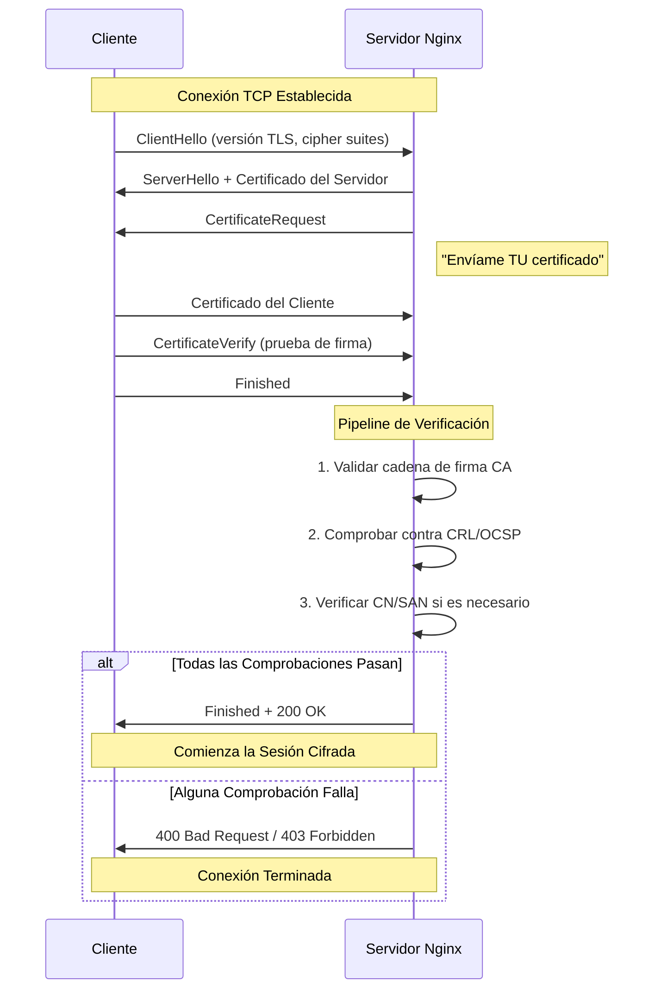
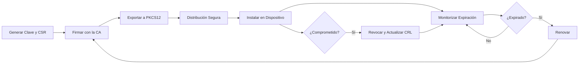

import Callout from "@components/ui/Callout.astro";
import { Tabs, TabPanel } from "@components/ui/tabs";
import TerminalCommand from "@components/ui/TerminalCommand.astro";
import FileContent from "@components/ui/FileContent.astro";
import TerminalOutput from "@components/ui/TerminalOutput.astro";
import Collapsible from "@components/ui/Collapsible.astro";
import Mermaid from "@components/ui/Mermaid.astro";
import Table from "@components/ui/Table.astro";
import TLDRSummary from "@components/ui/TLDRSummary.astro";

**[Mutual TLS (mTLS)](https://www.cloudflare.com/learning/access-management/what-is-mutual-tls/)** representa el estándar de referencia para asegurar servicios web privados. A diferencia de las contraseñas, las API keys o incluso el 2FA, mTLS requiere que el cliente (tu navegador/dispositivo) presente un certificado criptográfico firmado por tu propia Certificate Authority (CA) — un secreto que _no puede_ ser robado mediante phishing, adivinado o forzado por fuerza bruta.

Si el cliente no tiene el certificado, Nginx rechaza la conexión **antes** de que la aplicación siquiera se cargue. Esto es perfecto para asegurar paneles de administración privados, interfaces NAS o herramientas internas.

En esta guía completa, te guiaré a través de la implementación de mTLS en Nginx, cubriendo todo desde la creación de una certificate authority hasta temas avanzados como **revocación OCSP vs CRL**, **arquitectura Zero Trust** y **ajuste de rendimiento**. Esta guía incorpora las mejores prácticas de [Smallstep](https://smallstep.com/hello-mtls), [SSL.com](https://www.ssl.com/article/authenticating-users-and-iot-devices-with-mutual-tls/) y la [documentación oficial de Nginx](https://nginx.org/en/docs/http/ngx_http_ssl_module.html).

<TLDRSummary title="TL;DR — mTLS en Nginx de un vistazo">
- **mTLS no puede ser víctima de phishing** porque el cliente debe presentar un certificado firmado por tu propia CA; la clave privada nunca sale del dispositivo ni se transmite, así que Nginx rechaza las conexiones sin un certificado válido **antes** de que la aplicación se cargue.
- **Crea tu propia PKI**: genera una CA **RSA de 4096 bits** válida 10 años y firma certificados de cliente por dispositivo (mínimo 2048 bits, validez de 1 año), distribuyéndolos como paquetes **PKCS12 (.p12)** protegidos por contraseña.
- **Actívalo en Nginx** con `ssl_client_certificate` (tu CA), `ssl_verify_client on` y `ssl_verify_depth` — o `optional` más un `map` para exigirlo solo en rutas críticas (ver mi despliegue más abajo); nunca uses `optional_no_ca` en producción. Restringe a **TLS 1.2/1.3** con cipher suites ECDHE fuertes.
- **Añade control granular** con un `map` sobre `$ssl_client_s_dn` para listas de permitidos por CN, y usa `$ssl_client_verify` para que los clientes autenticados **eviten el rate limiting**.
- **Revoca certificados comprometidos** mediante **CRL** (`openssl ca -revoke` + `-gencrl`, luego `ssl_crl`) para despliegues pequeños u **OCSP** para los más grandes — regenera el CRL y recarga Nginx cada vez. Automatiza la creación y renovación con scripts.
</TLDRSummary>

---

## ¿Por qué mTLS? El enfoque Zero Trust

En el panorama de seguridad actual, el modelo basado en perímetro ("confía en todo lo que está dentro del firewall") está obsoleto. **[Zero Trust](https://www.cloudflare.com/learning/security/glossary/what-is-zero-trust/)** asume que los atacantes podrían estar ya dentro de tu red y requiere verificación para cada solicitud de acceso.

mTLS es una piedra angular de la arquitectura Zero Trust porque proporciona **autenticación mutua**: tanto el servidor como el cliente verifican la identidad del otro mediante certificados criptográficos.

<Table title="mTLS vs Otros Métodos de Autenticación">
  <thead>
    <tr>
      <th scope="col">Método</th>
      <th scope="col">¿Phishing posible?</th>
      <th scope="col">Almacenamiento de credenciales</th>
      <th scope="col">Automatización</th>
      <th scope="col">Zero Trust</th>
    </tr>
  </thead>
  <tbody>
    <tr>
      <td><strong>Usuario/Contraseña</strong></td>
      <td data-status="error">Sí</td>
      <td>Base de datos del servidor</td>
      <td>Fácil</td>
      <td data-status="error">No</td>
    </tr>
    <tr>
      <td><strong>API Keys</strong></td>
      <td data-status="error">Sí (si se exponen)</td>
      <td>Servidor + cliente</td>
      <td>Fácil</td>
      <td data-status="error">No</td>
    </tr>
    <tr>
      <td><strong>Contraseña + 2FA</strong></td>
      <td data-status="warning">Parcialmente</td>
      <td>Servidor + autenticador</td>
      <td>Difícil</td>
      <td data-status="warning">Parcial</td>
    </tr>
    <tr>
      <td><strong>mTLS</strong></td>
      <td data-status="success">No</td>
      <td>Hardware/keychain</td>
      <td>Medio</td>
      <td data-status="success">Sí</td>
    </tr>
  </tbody>
</Table>

### Por qué mTLS no puede ser víctima de phishing

A diferencia de las contraseñas, los certificados de cliente:

1. **Nunca se transmiten** — solo se envía una firma que demuestra la posesión
2. **Están vinculados al hardware** — almacenados en keychains/TPMs seguros
3. **Requieren acceso a la clave privada** — la clave privada nunca sale del dispositivo
4. **Se validan criptográficamente** — falsificarlos es computacionalmente inviable

<Callout type="keypoint" icon="mdi:shield-check">
  **Punto Clave:** Con mTLS, incluso si un atacante roba tu contraseña E intercepta tu código 2FA, seguiría sin poder acceder al recurso protegido sin el archivo de certificado instalado en un dispositivo autorizado.
</Callout>

---

## Cómo lo ejecuto en mi propia infraestructura

Nada de lo que sigue es teoría: este blog se sirve desde el mismo servidor donde mTLS protege mis servicios sensibles desde enero de 2025. Mi CA privada ("JMRP DNS CA", emitida con una validez de 10 años) firma los certificados de cliente que dan acceso a cuatro servicios: el panel de Grafana, la galería de fotos (Immich), el NAS y la propia interfaz de administración de Nginx.

Un detalle que ningún tutorial me contó y que solo aprendí desplegándolo: en producción **no** uso `ssl_verify_client on` a secas. Uso `optional` combinado con un `map` y enforcement selectivo por *location*:

```nginx
map $ssl_client_verify $client_verified {
    "SUCCESS" 1;
    default   0;
}

# En las rutas críticas (p. ej. la API de subida de Immich):
location = /api/assets {
    if ($client_verified = 0) {
        return 403 "Invalid certificate";
    }
    # ...
}
```

¿Por qué? Con `on` a nivel de servidor, cualquier cliente sin certificado recibe un error TLS críptico antes de llegar siquiera a Nginx — imposible de depurar para un usuario no técnico y sin posibilidad de degradar a otra capa de autenticación. Con `optional` + `map`, el handshake siempre se completa y soy yo quien decide, ruta a ruta, qué exige certificado (las APIs de escritura devuelven un 403 explícito) y qué puede caer a una segunda capa. Esa segunda capa existe: las peticiones desde mi LAN pasan por un allowlist de red independiente, de modo que el certificado nunca es el único control — defensa en profundidad, no una llave maestra única.

En cuanto a la emisión: mantengo un flujo con OpenSSL por dispositivo (un CSR, una config y una ficha de metadatos por cliente), con `ssl_verify_depth 2` en el servidor. Hoy hay tres certificados activos, cada uno ligado a un dispositivo y una persona concretos — cuando un dispositivo se retira, su certificado se retira con él.

Una confesión honesta: **no publico CRL ni OCSP**. Con tres certificados en dispositivos que controlo físicamente, revocar a esta escala significa reemitir desde la CA — un compromiso razonable aquí que sería inaceptable con decenas de clientes. Si tu flota crece, `ssl_crl` deja de ser opcional.

## TLS Unidireccional vs Mutual TLS

Entender la diferencia es fundamental:

<Table title="TLS Unidireccional vs Mutual TLS">
  <thead>
    <tr>
      <th scope="col">Aspecto</th>
      <th scope="col">TLS Unidireccional (HTTPS Estándar)</th>
      <th scope="col">Mutual TLS (mTLS)</th>
    </tr>
  </thead>
  <tbody>
    <tr>
      <td><strong>El servidor se autentica ante</strong></td>
      <td>Cliente (navegador)</td>
      <td>Cliente (navegador)</td>
    </tr>
    <tr>
      <td><strong>El cliente se autentica ante</strong></td>
      <td data-status="error">No se verifica</td>
      <td data-status="success">El servidor verifica el certificado del cliente</td>
    </tr>
    <tr>
      <td><strong>Requisito de certificado</strong></td>
      <td>Solo el servidor</td>
      <td>Tanto servidor como cliente</td>
    </tr>
    <tr>
      <td><strong>Caso de uso</strong></td>
      <td>Sitios web públicos</td>
      <td>APIs, paneles de administración, IoT, B2B</td>
    </tr>
  </tbody>
</Table>

### El modelo HTTPS estándar


En el HTTPS regular, solo el servidor presenta un certificado.

 El cliente (navegador) lo verifica, pero el servidor no tiene forma de verificar _quién_ es el cliente — solo sabe que la conexión está cifrada.

### La mejora de mTLS


mTLS añade un segundo paso: después de verificar el servidor, el **servidor solicita un certificado al cliente**.

 Solo los clientes que presentan un certificado válido firmado por una CA de confianza pueden continuar.

---

## El flujo del handshake mTLS


Entender el handshake ayuda con la depuración.

 Aquí está el flujo completo:

<Mermaid caption="Flujo del Handshake mTLS en Nginx" maxWidth="550px">

</Mermaid>

### Pasos clave explicados

1. **ClientHello**: El cliente inicia TLS, proponiendo cipher suites
2. **ServerHello**: El servidor responde con su certificado
3. **CertificateRequest**: El servidor solicita al cliente que demuestre su identidad
4. **Certificado del Cliente**: El cliente envía su certificado
5. **CertificateVerify**: El cliente demuestra que posee la clave privada (sin revelarla)
6. **Verificación**: El servidor valida toda la cadena

---

## Requisitos previos y configuración de directorios

Antes de comenzar, asegúrate de tener:

- Un servidor Linux (Debian/Ubuntu/CentOS/RHEL) con Nginx instalado
- [OpenSSL](https://docs.openssl.org/) (versión mínima 1.1.1, compruébalo con `openssl version`, recomendado 3.5.0+)
- Acceso root o sudo

### Crea tu directorio PKI

Una estructura de directorios bien organizada es esencial para gestionar certificados:

<TerminalCommand>
```bash
# Create the main directory structure
sudo mkdir -p /etc/nginx/pki/{ca,certs,crl,private,newcerts}
cd /etc/nginx/pki

# Secure the private directory
sudo chmod 700 private

# Initialize OpenSSL CA database files
sudo touch index.txt
echo 1000 | sudo tee serial > /dev/null
echo 1000 | sudo tee crlnumber > /dev/null
```
</TerminalCommand>

<Callout type="info" icon="mdi:folder-outline">
  **Estructura de Directorios Explicada:**
  
  - `ca/` — Certificados de la Certificate Authority
  - `certs/` — Certificados de cliente y servidor emitidos
  - `private/` — Claves privadas (¡chmod 700!)
  - `crl/` — Listas de Revocación de Certificados (CRL)
  - `newcerts/` — Archivo de certificados emitidos por OpenSSL
</Callout>

---

## Creando tu certificate authority


Una CA es la raíz de confianza en tu PKI. Los certificados que emite siguen el perfil [X.509 v3](https://www.rfc-editor.org/rfc/rfc5280) (RFC 5280), el mismo estándar sobre el que se asienta la PKI pública de la web.

 Todos los certificados de cliente deben estar firmados por esta CA para que Nginx los acepte.

### Decisiones de diseño de la CA

Antes de generar, decide sobre estos parámetros:

<Table title="Opciones de Configuración de la CA">
  <thead>
    <tr>
      <th scope="col">Parámetro</th>
      <th scope="col">Recomendación</th>
      <th scope="col">Justificación</th>
    </tr>
  </thead>
  <tbody>
    <tr>
      <td><strong>Tamaño de Clave</strong></td>
      <td>RSA de 4096 bits o ECDSA P-384</td>
      <td>Mayor margen de seguridad contra ataques clásicos</td>
    </tr>
    <tr>
      <td><strong>Validez</strong></td>
      <td>10 años para la CA</td>
      <td>Más largo que cualquier certificado de cliente</td>
    </tr>
    <tr>
      <td><strong>Algoritmo Hash</strong></td>
      <td>SHA-256 como mínimo</td>
      <td>SHA-1 está obsoleto</td>
    </tr>
    <tr>
      <td><strong>Extensiones</strong></td>
      <td><code>CA:TRUE</code>, <code>keyUsage:keyCertSign,cRLSign</code></td>
      <td>Necesario para firmar certificados y CRLs</td>
    </tr>
  </tbody>
</Table>

### Crea la configuración de OpenSSL

Crea un archivo de configuración completo de OpenSSL:

<FileContent filename="/etc/nginx/pki/openssl.cnf">
```ini
# =============================================================
# OpenSSL Configuration for mTLS Certificate Authority
# =============================================================

[ ca ]
default_ca = CA_default

[ CA_default ]
# Directory structure
dir               = /etc/nginx/pki
database          = $dir/index.txt
new_certs_dir     = $dir/newcerts
certificate       = $dir/ca/ca.crt
serial            = $dir/serial
private_key       = $dir/private/ca.key
crlnumber         = $dir/crlnumber
crl               = $dir/crl/ca.crl

# Certificate defaults
default_days      = 365          # Client certs valid 1 year
default_crl_days  = 30           # CRL valid 30 days
default_md        = sha256       # Use SHA-256
preserve          = no
policy            = policy_loose
copy_extensions   = copy         # Copy SANs from CSR
# SECURITY WARNING: copy_extensions=copy copies ALL extensions from the CSR.
# This is safe only when you trust the CSR generator. A malicious CSR could
# include basicConstraints: CA:TRUE to create a subordinate CA.
# Use copy_extensions=none or explicitly filter extensions for untrusted CSRs.

[ policy_loose ]
countryName             = optional
stateOrProvinceName     = optional
localityName            = optional
organizationName        = optional
organizationalUnitName  = optional
commonName              = supplied
emailAddress            = optional

# =============================================================
# CA Certificate Request Settings
# =============================================================
[ req ]
default_bits        = 4096
distinguished_name  = req_distinguished_name
string_mask         = utf8only
default_md          = sha256
x509_extensions     = v3_ca
prompt              = no

[ req_distinguished_name ]
C                   = ES
ST                  = Valencia
L                   = Valencia
O                   = JMRP-IO-LAB
OU                  = Infrastructure Security
CN                  = JMRP-IO-LAB Root CA

# =============================================================
# Certificate Extensions
# =============================================================

# For the CA certificate itself
[ v3_ca ]
subjectKeyIdentifier    = hash
authorityKeyIdentifier  = keyid:always,issuer
basicConstraints        = critical, CA:TRUE
keyUsage                = critical, digitalSignature, cRLSign, keyCertSign

# For client certificates
[ v3_client ]
subjectKeyIdentifier    = hash
authorityKeyIdentifier  = keyid,issuer
basicConstraints        = critical, CA:FALSE
keyUsage                = critical, nonRepudiation, digitalSignature, keyEncipherment
extendedKeyUsage        = clientAuth
```
</FileContent>

### Desglose de la configuración

Analicemos el archivo `openssl.cnf` para entender qué controla cada sección.

#### 1. Configuración global de la CA (`[ ca ]` y `[ CA_default ]`)

Esta sección indica a OpenSSL dónde encontrar los archivos y cómo firmar los certificados.

<Table title="Configuración por Defecto de la CA">
  <thead>
    <tr>
      <th scope="col">Directiva</th>
      <th scope="col">Valor/Tipo</th>
      <th scope="col">Descripción</th>
    </tr>
  </thead>
  <tbody>
    <tr>
      <td><code>dir</code></td>
      <td>Ruta (String)</td>
      <td>Directorio base de tu PKI (p. ej., <code>/etc/nginx/pki</code>).</td>
    </tr>
    <tr>
      <td><code>database</code></td>
      <td>Ruta de archivo</td>
      <td>Archivo de texto (<code>index.txt</code>) que registra todos los certificados emitidos y revocados.</td>
    </tr>
    <tr>
      <td><code>new_certs_dir</code></td>
      <td>Ruta de directorio</td>
      <td>Donde se archivan copias de cada certificado emitido por número de serie.</td>
    </tr>
    <tr>
      <td><code>certificate</code></td>
      <td>Ruta de archivo</td>
      <td>El certificado público de la CA utilizado para firmar otros.</td>
    </tr>
    <tr>
      <td><code>private_key</code></td>
      <td>Ruta de archivo</td>
      <td>La clave privada de la CA. <strong>Debe estar protegida.</strong></td>
    </tr>
    <tr>
      <td><code>default_days</code></td>
      <td>Entero (Días)</td>
      <td>Período de validez por defecto para los certificados emitidos (p. ej., 365).</td>
    </tr>
    <tr>
      <td><code>policy</code></td>
      <td>Nombre de sección</td>
      <td>Qué sección de política aplicar para la coincidencia de campos DN (p. ej., <code>policy_loose</code>).</td>
    </tr>
    <tr>
      <td><code>copy_extensions</code></td>
      <td><code>copy</code> | <code>none</code></td>
      <td><strong>Crucial:</strong> Copia los SANs (Subject Alternative Names) del CSR al certificado final.</td>
    </tr>
  </tbody>
</Table>

#### 2. Políticas de validación (`[ policy_loose ]`)

Controla qué campos en la Solicitud de Firma de Certificado (CSR) deben coincidir con los propios campos de la CA.

<Table title="Reglas de Política">
  <thead>
    <tr>
      <th scope="col">Campo</th>
      <th scope="col">Regla</th>
      <th scope="col">Significado</th>
    </tr>
  </thead>
  <tbody>
    <tr>
      <td><code>countryName</code></td>
      <td><code>optional</code></td>
      <td>El cliente no necesita especificar un país.</td>
    </tr>
    <tr>
      <td><code>commonName</code></td>
      <td><code>supplied</code></td>
      <td><strong>Obligatorio.</strong> El cliente debe proporcionar un Common Name (utilizado para identificación).</td>
    </tr>
    <tr>
      <td><code>organizationName</code></td>
      <td><code>optional</code></td>
      <td>Puede dejarse vacío.</td>
    </tr>
  </tbody>
</Table>

#### 3. Configuración de solicitudes (`[ req ]`)

Valores por defecto utilizados al ejecutar `openssl req` para generar claves o CSRs.

<Table title="Valores por Defecto de Solicitudes">
  <thead>
    <tr>
      <th scope="col">Directiva</th>
      <th scope="col">Valor</th>
      <th scope="col">Descripción</th>
    </tr>
  </thead>
  <tbody>
    <tr>
      <td><code>default_bits</code></td>
      <td>Entero (p. ej., 4096)</td>
      <td>Tamaño de clave por defecto si no se especifica.</td>
    </tr>
    <tr>
      <td><code>distinguished_name</code></td>
      <td>Nombre de sección</td>
      <td>Apunta a la sección que define los valores DN por defecto (<code>[ req_distinguished_name ]</code>).</td>
    </tr>
    <tr>
      <td><code>x509_extensions</code></td>
      <td>Nombre de sección</td>
      <td>Extensiones a añadir al crear un certificado raíz <strong>autofirmado</strong> (p. ej., <code>v3_ca</code>).</td>
    </tr>
  </tbody>
</Table>

#### 4. Extensiones de certificado (`[ v3_* ]`)

Estas secciones definen las "capacidades" de los certificados que emites. Este es el núcleo de seguridad.

<Table title="Perfiles de Extensiones">
  <thead>
    <tr>
      <th scope="col">Perfil/Directiva</th>
      <th scope="col">Valor</th>
      <th scope="col">Efecto</th>
    </tr>
  </thead>
  <tbody>
    <tr>
      <td colspan="3"><strong>[ v3_ca ] - Para la CA Raíz</strong></td>
    </tr>
    <tr>
      <td><code>basicConstraints</code></td>
      <td><code>critical, CA:TRUE</code></td>
      <td><strong>Identidad:</strong> Marca este certificado como una Certificate Authority que puede firmar otros.</td>
    </tr>
    <tr>
      <td><code>keyUsage</code></td>
      <td><code>keyCertSign, cRLSign</code></td>
      <td><strong>Permisos:</strong> Autorizado para firmar certificados y CRLs.</td>
    </tr>
    <tr>
      <td colspan="3"><strong>[ v3_client ] - Para Dispositivos de Usuario</strong></td>
    </tr>
    <tr>
      <td><code>basicConstraints</code></td>
      <td><code>critical, CA:FALSE</code></td>
      <td><strong>Restricción:</strong> Este certificado <strong>no puede</strong> utilizarse para firmar otros certificados.</td>
    </tr>
    <tr>
      <td><code>extendedKeyUsage</code></td>
      <td><code>clientAuth</code></td>
      <td><strong>Propósito:</strong> Válido <strong>únicamente</strong> para autenticar un cliente ante un servidor (mTLS).</td>
    </tr>
  </tbody>
</Table>

### Genera la clave y el certificado de la CA

<TerminalCommand>
```bash
cd /etc/nginx/pki

# Generate CA private key (4096-bit RSA)
sudo openssl genrsa -out private/ca.key 4096

# Secure the private key
sudo chmod 400 private/ca.key

# Generate the self-signed CA certificate (valid 10 years)
sudo openssl req -new -x509 -days 3650 \
    -key private/ca.key \
    -out ca/ca.crt \
    -config openssl.cnf \
    -extensions v3_ca
```
</TerminalCommand>

### Verifica tu certificado de CA

<TerminalCommand>
```bash
openssl x509 -in ca/ca.crt -text -noout | head -30
```
</TerminalCommand>

<TerminalOutput title="Detalles del Certificado de la CA">
Certificate:
    Data:
        Version: 3 (0x2)
        Serial Number:
            1f:23:94:bf:00:2d:11:f7:c5:14:ac:c6:24:a9:d1:ff:b3:4e:cc:3a
        Signature Algorithm: sha256WithRSAEncryption
        Issuer: C=ES, ST=Valencia, L=Valencia, O=JMRP-IO-LAB, OU=Infrastructure Security, CN=JMRP-IO-LAB Root CA
        Validity
            Not Before: Jan 13 18:21:21 2026 GMT
            Not After : Jan 11 18:21:21 2036 GMT
        Subject: C=ES, ST=Valencia, L=Valencia, O=JMRP-IO-LAB, OU=Infrastructure Security, CN=JMRP-IO-LAB Root CA
        Subject Public Key Info:
            Public Key Algorithm: rsaEncryption
                Public-Key: (4096 bit)
            X509v3 extensions:
                X509v3 Subject Key Identifier: 
                    ...
                X509v3 Basic Constraints: critical
                    CA:TRUE
                X509v3 Key Usage: critical
                    Digital Signature, Certificate Sign, CRL Sign
</TerminalOutput>

---

## Generando certificados de cliente

Cada cliente (dispositivo, usuario o servicio) necesita su propio certificado firmado por tu CA.

### SAN vs CN: ¿cuál usar?

<Table title="Subject Alternative Name (SAN) vs Common Name (CN)">
  <thead>
    <tr>
      <th scope="col">Aspecto</th>
      <th scope="col">Common Name (CN)</th>
      <th scope="col">Subject Alternative Name (SAN)</th>
    </tr>
  </thead>
  <tbody>
    <tr>
      <td><strong>Estándar</strong></td>
      <td>Legacy (obsoleto para certificados de servidor)</td>
      <td>Moderno, conforme con RFC 6125</td>
    </tr>
    <tr>
      <td><strong>Múltiples identidades</strong></td>
      <td data-status="error">No</td>
      <td data-status="success">Sí (DNS, email, URI)</td>
    </tr>
    <tr>
      <td><strong>Ideal para</strong></td>
      <td>Identificación simple de cliente</td>
      <td>Servicios, clientes multi-identidad</td>
    </tr>
  </tbody>
</Table>

Para la identificación simple de usuarios (como estamos haciendo), CN es suficiente. Para autenticación servicio-a-servicio, usa SANs.

### Genera un certificado de cliente

<TerminalCommand>
```bash
cd /etc/nginx/pki

# Set device/user name
CLIENT_NAME="iphone-jmrp"

# Generate client private key
sudo openssl genrsa -out private/${CLIENT_NAME}.key 2048

# Create Certificate Signing Request (CSR)
sudo openssl req -new \
    -key private/${CLIENT_NAME}.key \
    -out certs/${CLIENT_NAME}.csr \
    -subj "/CN=${CLIENT_NAME}"

# Sign with your CA
sudo openssl ca -config openssl.cnf \
    -extensions v3_client \
    -batch \
    -in certs/${CLIENT_NAME}.csr \
    -out certs/${CLIENT_NAME}.crt
```
</TerminalCommand>

<TerminalOutput title="Salida de la Firma del Certificado">
Using configuration from openssl.cnf
Check that the request matches the signature
Signature ok
The Subject's Distinguished Name is as follows
commonName            :ASN.1 12:'iphone-jmrp'
Certificate is to be certified until Jan 13 18:21:36 2027 GMT (365 days)

Write out database with 1 new entries
Database updated
</TerminalOutput>

### PKCS12 vs PEM: formatos de exportación

<Table title="Comparación de Formatos de Certificado">
  <thead>
    <tr>
      <th scope="col">Formato</th>
      <th scope="col">Contiene</th>
      <th scope="col">Ideal Para</th>
      <th scope="col">Protegido por contraseña</th>
    </tr>
  </thead>
  <tbody>
    <tr>
      <td><strong>PEM (.crt, .key)</strong></td>
      <td>Archivos de texto separados</td>
      <td>Servidores Linux, scripting</td>
      <td>Opcional</td>
    </tr>
    <tr>
      <td><strong>PKCS12 (.p12, .pfx)</strong></td>
      <td>Paquete binario todo-en-uno</td>
      <td>Navegadores, móvil, Windows</td>
      <td>Obligatorio</td>
    </tr>
  </tbody>
</Table>

### Crea el paquete PKCS12 para clientes

<TerminalCommand>
```bash
# Bundle certificate, key, and CA into .p12 file
sudo openssl pkcs12 -export \
    -out certs/${CLIENT_NAME}.p12 \
    -inkey private/${CLIENT_NAME}.key \
    -in certs/${CLIENT_NAME}.crt \
    -certfile ca/ca.crt \
    -name "${CLIENT_NAME}"

# You will be prompted for an export password
# This protects the .p12 file during transfer
```
</TerminalCommand>

<Callout type="warning" icon="mdi:alert">
  **Seguridad:** Elige una contraseña de exportación fuerte. Esta contraseña protege el certificado durante la transferencia a los dispositivos cliente. Transmítela por separado del archivo .p12 (p. ej., mediante un mensaje cifrado o en persona).
</Callout>

---

## Configurando Nginx para mTLS

Ahora configura Nginx para requerir y validar certificados de cliente.

### Entendiendo las opciones de ssl_verify_client

La directiva `ssl_verify_client` controla cómo Nginx gestiona los certificados de cliente:

<Table title="Opciones de ssl_verify_client">
  <thead>
    <tr>
      <th scope="col">Valor</th>
      <th scope="col">Comportamiento</th>
      <th scope="col">Caso de Uso</th>
    </tr>
  </thead>
  <tbody>
    <tr>
      <td><code>on</code></td>
      <td>Requiere certificado válido; rechaza sin él</td>
      <td>Control de acceso estricto (recomendado)</td>
    </tr>
    <tr>
      <td><code>optional</code></td>
      <td>Acepta si es válido; continúa sin él</td>
      <td>Autenticación híbrida, verificación opcional</td>
    </tr>
    <tr>
      <td><code>optional_no_ca</code></td>
      <td>Acepta cualquier certificado, sin validación de CA</td>
      <td>Solo desarrollo/pruebas</td>
    </tr>
    <tr>
      <td><code>off</code></td>
      <td>No se requiere certificado de cliente</td>
      <td>HTTPS estándar</td>
    </tr>
  </tbody>
</Table>

<Callout type="warning" icon="mdi:shield-alert">
  **¡Nunca uses `optional_no_ca` en producción!** Acepta _cualquier_ certificado sin validar la cadena de CA, anulando el propósito de mTLS.
</Callout>

### Configuración completa de Nginx

<FileContent filename="/etc/nginx/sites-available/secure.example.com.conf">
```nginx
server {
    listen 443 ssl;
    listen [::]:443 ssl;
    http2 on;
    server_name secure.example.com;
    
    # =================================================
    # Server TLS Configuration
    # =================================================
    ssl_certificate     /etc/ssl/certs/secure.example.com.crt;
    ssl_certificate_key /etc/ssl/private/secure.example.com.key;
    
    # =================================================
    # Client Certificate (mTLS) Configuration
    # =================================================
    
    # Path to your Certificate Authority
    ssl_client_certificate /etc/nginx/pki/ca/ca.crt;
    
    # Require valid client certificate
    ssl_verify_client on;
    
    # Verify up to 2 levels in the certificate chain
    ssl_verify_depth 2;
    
    # Optional: Certificate Revocation List
    # ssl_crl /etc/nginx/pki/crl/ca.crl;
    
    # =================================================
    # TLS Protocol Configuration
    # =================================================
    ssl_protocols TLSv1.2 TLSv1.3;
    ssl_ciphers ECDHE-ECDSA-AES128-GCM-SHA256:ECDHE-RSA-AES128-GCM-SHA256:ECDHE-ECDSA-AES256-GCM-SHA384:ECDHE-RSA-AES256-GCM-SHA384:ECDHE-ECDSA-CHACHA20-POLY1305:ECDHE-RSA-CHACHA20-POLY1305;
    ssl_prefer_server_ciphers on;
    
    # Performance: SSL Session Caching
    ssl_session_cache shared:SSL:10m;
    ssl_session_timeout 1d;
    ssl_session_tickets off;
    
    # =================================================
    # Logging (Include Client DN for Debugging)
    # =================================================
    access_log /var/log/nginx/secure.access.log combined;
    error_log /var/log/nginx/secure.error.log warn;
    
    # =================================================
    # Application
    # =================================================
    location / {
        # First, clear any client-provided values to prevent spoofing
        proxy_set_header X-Client-DN "";
        proxy_set_header X-Client-Verify "";
        proxy_set_header X-Client-Fingerprint "";
        
        # Then set authenticated values from Nginx's SSL module
        # Backend should only trust these when requests come directly from Nginx
        proxy_set_header X-Client-DN $ssl_client_s_dn;
        proxy_set_header X-Client-Verify $ssl_client_verify;
        proxy_set_header X-Client-Fingerprint $ssl_client_fingerprint;
        
        proxy_pass http://127.0.0.1:8080;
    }
}
```
</FileContent>

<Callout type="warning" icon="mdi:shield-alert">
  **Advertencia sobre Límites de Confianza:** Los headers `X-Client-DN`, `X-Client-Verify` y `X-Client-Fingerprint` pueden ser falsificados por clientes maliciosos si los proxies intermedios no los limpian. Asegúrate de que:
  - Cualquier load balancer o reverse proxy delante de Nginx elimine estos headers antes de reenviar
  - Las aplicaciones backend solo confíen en estos headers cuando las solicitudes provienen directamente de Nginx (valida la IP de origen o usa mTLS entre Nginx y el backend)
  - Considera usar una interfaz de red interna exclusiva para la conexión entre Nginx y el backend
</Callout>

### Prueba y recarga

<TerminalCommand>
```bash
# Test configuration syntax
sudo nginx -t

# If successful, reload
sudo systemctl reload nginx
```
</TerminalCommand>

Ahora, verifiquemos las conexiones usando `curl`.

**1. Acceso Denegado (Sin Certificado):**

<Collapsible summary="Mostrar salida de curl (400 Bad Request)">
<TerminalOutput title="curl -v https://secure.example.com">
```text
> GET / HTTP/1.1
> Host: secure.example.com
> User-Agent: curl/8.14.1
> Accept: */*
> 
< HTTP/1.1 400 Bad Request
< Server: nginx
< Content-Type: text/html
< Content-Length: 230
< Connection: close
< 
<html>
<head><title>400 No required SSL certificate was sent</title></head>
<body>
<center><h1>400 Bad Request</h1></center>
<center>No required SSL certificate was sent</center>
<hr><center>nginx</center>
</body>
</html>
```
</TerminalOutput>
</Collapsible>

**2. Acceso Concedido (Con Certificado Válido):**

<Collapsible summary="Mostrar salida de curl (200 OK)">
<TerminalOutput title="curl -v --cert client.crt --key client.key https://secure.example.com">
```text
* TLSv1.3 (IN), TLS handshake, Request CERT (13):
{ [210 bytes data]
* TLSv1.3 (OUT), TLS handshake, Certificate (11):
} [812 bytes data]
* TLSv1.3 (OUT), TLS handshake, CERT verify (15):
} [264 bytes data]
* TLSv1.3 (IN), TLS handshake, Finished (20):
{ [52 bytes data]
* SSL connection using TLSv1.3 / TLS_AES_256_GCM_SHA384
* Server certificate:
*  subject: CN=secure.example.com
*  issuer: CN=secure.example.com
> GET / HTTP/1.1
> Host: secure.example.com
> User-Agent: curl/8.14.1
> 
< HTTP/1.1 200 OK
< Server: nginx
< Content-Type: text/plain
mTLS Authentication Successful! Client DN: CN=iphone-jmrp
```
</TerminalOutput>
</Collapsible>

---

## Configuración de protocolo TLS y cipher suites


Una configuración TLS adecuada es fundamental para la seguridad.

 Esto es lo que hace cada ajuste:

### Selección de versión de protocolo

En una configuración moderna solo caben TLS 1.2 y TLS 1.3. [TLS 1.3](https://www.rfc-editor.org/rfc/rfc8446) (RFC 8446) es el estándar actual, con un handshake más rápido y conjuntos de cifrado exclusivamente AEAD:

<Table title="Versiones del Protocolo TLS">
  <thead>
    <tr>
      <th scope="col">Versión</th>
      <th scope="col">Estado</th>
      <th scope="col">Seguridad</th>
    </tr>
  </thead>
  <tbody>
    <tr>
      <td>TLS 1.0</td>
      <td data-status="error">Obsoleto</td>
      <td>Vulnerable (BEAST, POODLE)</td>
    </tr>
    <tr>
      <td>TLS 1.1</td>
      <td data-status="error">Obsoleto</td>
      <td>Cipher suites débiles, sin AEAD</td>
    </tr>
    <tr>
      <td>TLS 1.2</td>
      <td data-status="success">Soportado</td>
      <td>Seguro con cipher suites adecuados</td>
    </tr>
    <tr>
      <td>TLS 1.3</td>
      <td data-status="success">Recomendado</td>
      <td>Mejor seguridad, handshake más rápido</td>
    </tr>
  </tbody>
</Table>

### Configuración recomendada

<FileContent filename="Ajustes de Seguridad TLS">
```nginx
# Only allow TLS 1.2 and 1.3
ssl_protocols TLSv1.2 TLSv1.3;

# Strong cipher suites (ECDHE for forward secrecy, GCM for AEAD)
ssl_ciphers ECDHE-ECDSA-AES128-GCM-SHA256:ECDHE-RSA-AES128-GCM-SHA256:ECDHE-ECDSA-AES256-GCM-SHA384:ECDHE-RSA-AES256-GCM-SHA384:ECDHE-ECDSA-CHACHA20-POLY1305:ECDHE-RSA-CHACHA20-POLY1305;

# Server chooses the cipher (prevents downgrade attacks)
ssl_prefer_server_ciphers on;

# Session resumption for performance
ssl_session_cache shared:SSL:10m;
ssl_session_timeout 1d;

# Disable session tickets (more secure, less memory)
ssl_session_tickets off;

# Diffie-Hellman parameters for non-ECDHE (if needed)
# Generate with: openssl dhparam -out /etc/nginx/dhparam.pem 4096
ssl_dhparam /etc/nginx/dhparam.pem;
```
</FileContent>

<Callout type="tip" icon="mdi:speedometer">
  **Consejo de Rendimiento:** El almacenamiento en caché de sesiones SSL reduce significativamente la sobrecarga del handshake. Una caché de 10 MB puede almacenar ~40.000 sesiones. Esto es especialmente importante para mTLS donde los handshakes son más costosos.
</Callout>

---

## Control de acceso avanzado


Por defecto, _cualquier_ cliente con un certificado válido firmado por tu CA puede acceder al sitio.

 Puedes añadir controles granulares usando variables de Nginx.

### Variables mTLS útiles

Nginx expone estas variables para la información del certificado de cliente:

<Table title="Variables mTLS de Nginx">
  <thead>
    <tr>
      <th scope="col">Variable</th>
      <th scope="col">Contenido</th>
      <th scope="col">Ejemplo</th>
    </tr>
  </thead>
  <tbody>
    <tr>
      <td><code>$ssl_client_verify</code></td>
      <td>Resultado de la verificación</td>
      <td><code>SUCCESS</code>, <code>FAILED:reason</code></td>
    </tr>
    <tr>
      <td><code>$ssl_client_s_dn</code></td>
      <td>DN del sujeto</td>
      <td><code>CN=iphone-jmrp</code></td>
    </tr>
    <tr>
      <td><code>$ssl_client_i_dn</code></td>
      <td>DN del emisor</td>
      <td><code>CN=JMRP-IO-LAB Root CA</code></td>
    </tr>
    <tr>
      <td><code>$ssl_client_fingerprint</code></td>
      <td>Fingerprint SHA1</td>
      <td><code>AB:CD:EF:12:34:...</code></td>
    </tr>
    <tr>
      <td><code>$ssl_client_serial</code></td>
      <td>Número de serie del certificado</td>
      <td><code>1000</code></td>
    </tr>
  </tbody>
</Table>

### Autorización basada en CN con map

Usa la directiva `map` para crear una lista de permitidos:

<FileContent filename="/etc/nginx/conf.d/mtls-access.conf">
```nginx
# Place this OUTSIDE the server block (in nginx.conf or included file)

# Map client DN to access permission
map $ssl_client_s_dn $mtls_access_allowed {
    default 0;
    
    # Allowed certificates by CN
    "CN=iphone-jmrp"      1;
    "CN=macbook-jmrp"     1;
    "CN=ipad-home"        1;
    
    # Pattern matching with regex
    ~"CN=admin-.*"        1;    # All admin-* certificates
}
```
</FileContent>

Luego en tu bloque server:

<FileContent filename="Control de Acceso en el Bloque Server">
```nginx
server {
    # ... SSL configuration ...
    
    location / {
        # Verify certificate is valid (handled by ssl_verify_client on)
        # Then check our custom authorization
        if ($mtls_access_allowed = 0) {
            return 403 "Valid certificate, but not authorized for this resource.";
        }
        
        proxy_pass http://backend;
    }
}
```
</FileContent>

---

## Caso de uso avanzado: bypass de rate limit


Un beneficio de mTLS que a menudo se pasa por alto es la capacidad de confiar en clientes autenticados a nivel de red.

 Por ejemplo, podrías querer aplicar protección estricta contra **DDoS** y **Rate Limiting** al internet público, pero permitir que tus propios dispositivos (autenticados mediante mTLS) tengan acceso ilimitado.

Puedes lograr esto en Nginx usando una directiva `map` para incluir en la lista blanca a los clientes verificados.

### Ejemplo de configuración

<FileContent filename="/etc/nginx/nginx.conf">
```nginx
http {
    # ...
    
    # 1. Map the verification status to a rate-limit key
    map $ssl_client_verify $limit_req_whitelist {
        "SUCCESS" "";                  # If verified, key is empty (no limit)
        default   $binary_remote_addr; # Otherwise, limit by IP
    }

    # 2. Define the zone using the map variable
    # If $limit_req_whitelist is empty, the request is not counted!
    limit_req_zone $limit_req_whitelist zone=req_limit_per_ip:10m rate=5r/s;

    server {
        # IMPORTANT: To allow unauthenticated clients to reach this logic,
        # you must set 'ssl_verify_client optional' instead of 'on'.
        # If set to 'on', Nginx rejects the handshake before the rate limiter runs.
        ssl_verify_client optional;

        # 3. Apply the limit
        limit_req zone=req_limit_per_ip burst=10 nodelay;
        
        # ...
    }
}
```
</FileContent>

<Callout type="keypoint" icon="mdi:speedometer">
  **Cómo funciona:** La directiva `limit_req_zone` de Nginx ignora cualquier solicitud donde la variable clave está vacía. Al mapear `SUCCESS` a una cadena vacía, los clientes autenticados con mTLS evitan completamente el rate limiter, mientras que el resto se rastrea por su dirección IP.
</Callout>

---

## Revocación de certificados: CRL vs OCSP


¿Qué sucede cuando un dispositivo se pierde o se ve comprometido?

 Necesitas **revocar** su certificado. Hay dos métodos:

<Table title="Comparación CRL vs OCSP">
  <thead>
    <tr>
      <th scope="col">Aspecto</th>
      <th scope="col">CRL (Certificate Revocation List)</th>
      <th scope="col">OCSP (Online Certificate Status)</th>
    </tr>
  </thead>
  <tbody>
    <tr>
      <td><strong>Cómo funciona</strong></td>
      <td>El servidor descarga la lista completa de certificados revocados</td>
      <td>El servidor consulta al respondedor para un solo certificado</td>
    </tr>
    <tr>
      <td><strong>Inmediatez</strong></td>
      <td>Con retardo (depende del intervalo de actualización del CRL)</td>
      <td>Casi en tiempo real</td>
    </tr>
    <tr>
      <td><strong>Ancho de banda</strong></td>
      <td>Mayor (descarga la lista completa)</td>
      <td>Menor (consulta individual)</td>
    </tr>
    <tr>
      <td><strong>Directiva Nginx</strong></td>
      <td><code>ssl_crl</code></td>
      <td><code>ssl_stapling</code> (para el certificado del servidor)</td>
    </tr>
    <tr>
      <td><strong>Complejidad</strong></td>
      <td>Simple (archivo en disco)</td>
      <td>Requiere un servicio respondedor OCSP</td>
    </tr>
  </tbody>
</Table>

### Método 1: CRL (recomendado para despliegues pequeños)

#### Paso 1: revocar un certificado

<TerminalCommand>
```bash
cd /etc/nginx/pki

# Revoke the certificate
sudo openssl ca -config openssl.cnf \
    -revoke certs/lost-device.crt
```
</TerminalCommand>

<TerminalOutput title="Salida de la Revocación">
Using configuration from openssl.cnf
Revoking Certificate 1000.
Database updated
</TerminalOutput>

#### Paso 2: generar el archivo CRL

<TerminalCommand>
```bash
# Generate the CRL
sudo openssl ca -config openssl.cnf \
    -gencrl -out crl/ca.crl

# Verify the CRL
openssl crl -in crl/ca.crl -text -noout
```
</TerminalCommand>

#### Paso 3: configurar Nginx

<FileContent filename="Añadir al bloque server">
```nginx
# Enable CRL checking
ssl_crl /etc/nginx/pki/crl/ca.crl;
```
</FileContent>

<TerminalCommand>
```bash
sudo nginx -t && sudo systemctl reload nginx
```
</TerminalCommand>

<Callout type="warning" icon="mdi:refresh">
  **Importante:** Debes regenerar el CRL y recargar Nginx **cada vez** que revoques un certificado. Considera automatizar esto con un cron job.
</Callout>

### Verificar la revocación

Acceder al sitio con el certificado revocado debería fallar ahora:

<Collapsible summary="Mostrar salida de curl (Revocado - 400 Bad Request)">
<TerminalOutput title="curl -v --cert revoked.crt ...">
```text
< HTTP/1.1 400 Bad Request
< Server: nginx
< Content-Type: text/html
< Content-Length: 208
< Connection: close
< 
<html>
<head><title>400 The SSL certificate error</title></head>
<body>
<center><h1>400 Bad Request</h1></center>
<center>The SSL certificate error</center>
<hr><center>nginx</center>
</body>
</html>
```
</TerminalOutput>
</Collapsible>

### Método 2: OCSP (para despliegues más grandes)


Para empresas con muchos certificados, OCSP es más eficiente.

 Esto requiere ejecutar un respondedor OCSP (fuera del alcance de esta guía, pero herramientas como [step-ca](https://smallstep.com/docs/step-ca) lo proporcionan).

---

## Gestión del ciclo de vida de los certificados

Un ciclo de vida completo incluye creación, distribución, monitorización, renovación y revocación.

### El ciclo de vida del certificado

<Mermaid caption="Flujo del Ciclo de Vida del Certificado" maxWidth="100%">

</Mermaid>

## Scripts de automatización


Gestionar certificados manualmente es propenso a errores.

 Aquí tienes dos scripts esenciales para automatizar el ciclo de vida.

### 1. Generador de certificados de cliente


Este script automatiza todo el proceso de creación

: generando la clave, el CSR, firmándolo y exportando el paquete PKCS#12.

<FileContent filename="/usr/local/bin/mtls-add-client.sh" collapsible={true}>
```bash
#!/bin/bash
set -e

# Configuration
PKI_DIR="/etc/nginx/pki"
DAYS_VALID=365
CLIENT_NAME=$1
EXPORT_PASS=$2

if [ -z "$CLIENT_NAME" ]; then
    echo "Usage: $0 <client-name> [export-password]"
    exit 1
fi

# Validate CLIENT_NAME: only allow alphanumerics, dots, underscores, hyphens
# Reject path traversal sequences, leading dots, slashes, and other unsafe chars
if ! echo "$CLIENT_NAME" | grep -qE '^[A-Za-z0-9._-]+$'; then
    echo "❌ Error: CLIENT_NAME contains invalid characters."
    echo "   Only alphanumerics, dots, underscores, and hyphens are allowed."
    exit 1
fi

# Additional check to prevent path traversal patterns
if echo "$CLIENT_NAME" | grep -qE '(\.\.|^\.)|/'; then
    echo "❌ Error: CLIENT_NAME contains path traversal sequences or slashes."
    exit 1
fi

if [ -z "$EXPORT_PASS" ]; then
    echo "No password provided. Generating a random one..."
    EXPORT_PASS=$(openssl rand -base64 12)
    echo "Generated Password: $EXPORT_PASS"
fi

cd $PKI_DIR

echo "1. Generating private key for $CLIENT_NAME..."
openssl genrsa -out private/${CLIENT_NAME}.key 2048

echo "2. Creating CSR..."
openssl req -new -key private/${CLIENT_NAME}.key \
    -out certs/${CLIENT_NAME}.csr \
    -subj "/CN=${CLIENT_NAME}"

echo "3. Signing certificate..."
openssl ca -config openssl.cnf \
    -extensions v3_client \
    -days $DAYS_VALID \
    -batch \
    -in certs/${CLIENT_NAME}.csr \
    -out certs/${CLIENT_NAME}.crt

echo "4. Exporting to PKCS12 (.p12)..."
# Use stdin for password to avoid exposure in process list
echo "$EXPORT_PASS" | openssl pkcs12 -export \
    -out certs/${CLIENT_NAME}.p12 \
    -inkey private/${CLIENT_NAME}.key \
    -in certs/${CLIENT_NAME}.crt \
    -certfile ca/ca.crt \
    -name "${CLIENT_NAME}" \
    -passout stdin

echo "----------------------------------------"
echo "✅ Certificate created successfully!"
echo "Files:"
echo " - Key: $PKI_DIR/private/${CLIENT_NAME}.key"
echo " - Cert: $PKI_DIR/certs/${CLIENT_NAME}.crt"
echo " - Bundle: $PKI_DIR/certs/${CLIENT_NAME}.p12"
echo "----------------------------------------"
echo "⚠️  Export Password: $EXPORT_PASS"
echo "Transfer the .p12 file securely to the client device."
```
</FileContent>

<TerminalCommand>
```bash
# Usage example: Generate certificate for a new device
sudo /usr/local/bin/mtls-add-client.sh my-iphone securepassword
```
</TerminalCommand>

### 2. Script de auto-renovación


Este script comprueba los certificados próximos a expirar

, los revoca, refirma el CSR original y genera un nuevo paquete `.p12`.

<FileContent filename="/usr/local/bin/mtls-renew.sh" collapsible={true}>
```bash
#!/bin/bash
# mTLS Certificate Renewal Script
set -e

PKI_DIR="/etc/nginx/pki"
DAYS_BEFORE_EXPIRY=30
RENEW_DAYS=365
RENEWED=false

echo "Checking for expiring certificates in $PKI_DIR/certs..."

while read -r cert; do
    # Extract expiration date
    end_date=$(openssl x509 -enddate -noout -in "$cert" | cut -d= -f2)
    end_epoch=$(date -d "$end_date" +%s)
    now_epoch=$(date +%s)
    days_left=$(( (end_epoch - now_epoch) / 86400 ))
    
    # Extract Common Name robustly (handles "CN=Name", "CN = Name", and trailing DN fields)
    CN=$(openssl x509 -subject -noout -nameopt RFC2253 -in "$cert" | \
         sed -n 's/.*CN=\([^,/]*\).*/\1/p' | sed 's/^[[:space:]]*//;s/[[:space:]]*$//')
    
    if [ "$days_left" -lt "$DAYS_BEFORE_EXPIRY" ]; then
        echo "--------------------------------------------------"
        echo "⚠️  Certificate for \"$CN\" expires in $days_left days."
        echo "   (File: $cert)"
        echo "   Renewing now..."
        
        # 1. Archive old cert
        cp "$cert" "$cert.old.$(date +%F)"
        
        # 2. Re-sign the existing CSR
        # We assume CSR exists in certs/ directory as $CN.csr
        CSR="$PKI_DIR/certs/$CN.csr"
        if [ ! -f "$CSR" ]; then
            echo "   ❌ CSR not found at $CSR. Cannot renew automatically."
            continue
        fi
        
        # Revoke old cert (to clear DB index and maintain CRL)
        openssl ca -config $PKI_DIR/openssl.cnf \
            -revoke "$cert"
        
        # Regenerate CRL immediately after revocation
        openssl ca -config $PKI_DIR/openssl.cnf \
            -gencrl -out $PKI_DIR/crl/ca.crl
        
        # Re-sign
        openssl ca -config $PKI_DIR/openssl.cnf \
            -extensions v3_client \
            -days $RENEW_DAYS \
            -batch \
            -in "$CSR" \
            -out "$cert"
            
        echo "   ✅ Certificate re-signed. New validity: $RENEW_DAYS days."
        echo "   ✅ CRL regenerated."
        
        # 3. Generate new P12
        NEW_PASS=$(openssl rand -base64 12)
        P12="$PKI_DIR/certs/$CN.p12"
        KEY="$PKI_DIR/private/$CN.key"
        
        if [ -f "$KEY" ]; then
            # Use stdin for password to avoid exposure in process list
            echo "$NEW_PASS" | openssl pkcs12 -export \
                -out "$P12" \
                -inkey "$KEY" \
                -in "$cert" \
                -certfile $PKI_DIR/ca/ca.crt \
                -name "$CN" \
                -passout stdin
                
            echo "   📦 New PKCS#12 bundle created: $P12"
            echo "   🔑 New Export Password: $NEW_PASS"
        else
            echo "   ⚠️ Private key not found. Skipped P12 generation."
        fi
        
        # Mark that we renewed at least one certificate
        RENEWED=true
        echo "--------------------------------------------------"
    else
        echo "✅ $CN: $days_left days remaining."
    fi
done < <(find "$PKI_DIR/certs" -name "*.crt" -type f)

# Reload Nginx if any certificates were renewed
if [ "$RENEWED" = "true" ]; then
    echo ""
    echo "========================================"
    echo "🔄 Reloading Nginx to apply updated CRL..."
    echo "========================================"
    
    # Test configuration first
    if nginx -t 2>&1; then
        systemctl reload nginx
        echo "✅ Nginx reloaded successfully."
    else
        echo "❌ Nginx configuration test failed. Skipping reload."
        exit 1
    fi
fi
```
</FileContent>

<Callout type="warning" icon="mdi:linux">
  **Nota de Plataforma:** Este script usa `date -d` de GNU, que es específico de Linux. En macOS/BSD, necesitarás modificar el cálculo de `end_epoch` usando `date -j -f` o utilizar una herramienta multiplataforma como el módulo `datetime` de Python.
</Callout>

Programa esto en crontab para que se ejecute diariamente:

<FileContent filename="crontab -e">
```text
0 3 * * * /usr/local/bin/mtls-renew.sh >> /var/log/mtls-renew.log 2>&1
```
</FileContent>

---

## Instalando certificados en los clientes


Transfiere el archivo `.p12` de forma segura

 (AirDrop, USB, nube cifrada) e instálalo en cada dispositivo.

<Tabs>
  <TabPanel label="iOS (iPhone/iPad)">
    1. Transfiere el archivo `.p12` mediante **AirDrop** o guárdalo en la app **Archivos**
    2. Toca el archivo en Archivos
    3. Ve a **Ajustes** → **Perfil Descargado** (aparece en la parte superior)
    4. Toca **Instalar** e introduce el código de tu dispositivo
    5. Introduce la contraseña de exportación del certificado
    6. El certificado ya está instalado. Safari lo usará automáticamente al visitar el sitio con mTLS
    
    <Callout type="tip" icon="mdi:cellphone">
      **Consejo:** Si Safari no muestra el aviso del certificado, prueba primero con navegación privada, luego con el modo normal.
    </Callout>
  </TabPanel>
  
  <TabPanel label="macOS">
    1. Haz doble clic en el archivo `.p12`
    2. Se abre **Acceso a Llaveros**. Introduce la contraseña de exportación
    3. Elige el llavero **inicio de sesión** (no Sistema)
    4. Haz clic en **Añadir**
    5. Reinicia tu navegador
    6. Al visitar el sitio, macOS te pregunta "Selecciona un Certificado"
    
    <Callout type="info" icon="mdi:apple-finder">
      **Nota:** Puede que necesites configurar el certificado como "Confiar Siempre" en Acceso a Llaveros si se solicita.
    </Callout>
  </TabPanel>
  
  <TabPanel label="Windows">
    1. Haz doble clic en el archivo `.p12`
    2. Se abre el **Asistente de Importación de Certificados**
    3. Selecciona **Usuario Actual** (no Equipo Local)
    4. Introduce la contraseña
    5. Selecciona "Seleccionar automáticamente el almacén de certificados"
    6. Haz clic en **Finalizar**
    7. Reinicia tu navegador
    
    Edge y Chrome presentarán ahora el certificado cuando sea necesario.
  </TabPanel>
  
  <TabPanel label="Android">
    1. Guarda el `.p12` en el almacenamiento del dispositivo
    2. Ve a **Ajustes** → **Seguridad** → **Cifrado y credenciales**
    3. Toca **Instalar un certificado** → **Certificado de usuario de VPN y aplicación**
    4. Navega hasta el archivo `.p12`
    5. Introduce la contraseña y asigna un nombre
    6. El certificado queda instalado para Chrome y otras aplicaciones
  </TabPanel>
  
  <TabPanel label="Linux (curl)">
    Para acceso por línea de comandos/scripting usando archivos PEM:
    
    ```bash
    # Using curl with client certificate
    curl --cert /path/to/client.crt \
         --key /path/to/client.key \
         --cacert /path/to/ca.crt \
         https://secure.example.com
    
    # Or with PKCS12
    curl --cert-type P12 \
         --cert /path/to/client.p12:password \
         https://secure.example.com
    ```
  </TabPanel>
</Tabs>

---

## Guía de solución de problemas

### Errores comunes y soluciones

<Table title="Diagnóstico de Errores mTLS">
  <thead>
    <tr>
      <th scope="col">Error</th>
      <th scope="col">Causa</th>
      <th scope="col">Solución</th>
    </tr>
  </thead>
  <tbody>
    <tr>
      <td><code>400 No required SSL certificate was sent</code></td>
      <td>El navegador no envió un certificado</td>
      <td>Comprueba que el certificado está instalado; reinicia el navegador; prueba en modo incógnito</td>
    </tr>
    <tr>
      <td><code>400 The SSL certificate error</code></td>
      <td>La validación del certificado falló</td>
      <td>Verifica que <code>ssl_client_certificate</code> apunta a la CA correcta</td>
    </tr>
    <tr>
      <td><code>403 Forbidden</code></td>
      <td>Certificado válido pero no autorizado</td>
      <td>Comprueba el CRL o las reglas <code>map</code>; examina el <code>error_log</code></td>
    </tr>
    <tr>
      <td>Bucle de selección de certificado</td>
      <td>El SO sigue preguntando</td>
      <td>Confía en la CA en el keychain; reinicia el navegador</td>
    </tr>
    <tr>
      <td><code>ssl_client_verify: FAILED</code></td>
      <td>La validación de la cadena falló</td>
      <td>Asegúrate de que la cadena completa está en ssl_client_certificate</td>
    </tr>
  </tbody>
</Table>

### Comandos de depuración

#### Verificar el certificado contra la CA

<TerminalCommand>
```bash
# Verify a client certificate is valid against your CA
openssl verify -CAfile /etc/nginx/pki/ca/ca.crt \
    /etc/nginx/pki/certs/client.crt
```
</TerminalCommand>

#### Probar la conexión mTLS con curl

<TerminalCommand>
```bash
# Test mTLS connection
curl -v --cert client.crt --key client.key \
    --cacert ca.crt https://secure.example.com

# If using PKCS12
curl -v --cert-type P12 --cert client.p12:password \
    https://secure.example.com
```
</TerminalCommand>

#### Comprobar los logs de error de Nginx

<TerminalCommand>
```bash
# Watch error log in real-time
tail -f /var/log/nginx/error.log | grep ssl
```
</TerminalCommand>

<TerminalOutput title="Ejemplo de Entrada en el Log de Errores">
2026/01/12 12:00:00 [info] 1234#5678: *1 client certificate verification failed: certificate revoked, client: 192.168.1.100, server: secure.example.com
</TerminalOutput>

---

## Mejores prácticas de seguridad

### Gestión de claves

<Callout type="warning" icon="mdi:key-alert">
  **Crítico:** Tu clave privada de la CA (`ca.key`) es la joya de la corona. Si se ve comprometida, un atacante puede emitir certificados válidos. Protégela con:
  
  - Permisos de archivo: `chmod 400 ca.key`
  - Separada del servidor web (aislada en un equipo sin red para alta seguridad)
  - HSM para despliegues empresariales
</Callout>

### Lista de verificación

1. **Usa claves RSA de 4096 bits** para la CA (2048 como mínimo para clientes)
2. **Habilita CRL/OCSP** para revocar certificados comprometidos
3. **Validez corta de certificados de cliente** (1 año máximo, más corta para alta seguridad)
4. **Solo TLS 1.2+**, con cipher suites robustos
5. **Almacenamiento en caché de sesiones** para rendimiento
6. **Monitoriza la expiración** y automatiza la renovación
7. **CAs separadas** para diferentes niveles de confianza si es necesario
8. **Registra los DNs de los clientes** para trazabilidad de auditoría
9. **Rotación periódica** de certificados de cliente

---

## Profundización

### Documentación Oficial
- [Nginx ngx_http_ssl_module](https://nginx.org/en/docs/http/ngx_http_ssl_module.html) — Todas las directivas SSL/TLS
- [Documentación de CA de OpenSSL](https://docs.openssl.org/3.5/man1/openssl-ca/) — Comandos de la certificate authority

### Tutoriales y Guías
- [Smallstep Hello mTLS](https://smallstep.com/hello-mtls) — Tutorial interactivo de mTLS
- [Guía de mTLS de SSL.com](https://www.ssl.com/article/authenticating-users-and-iot-devices-with-mutual-tls/) — Autenticación de IoT y usuarios
- [Cloudflare: ¿Qué es mTLS?](https://www.cloudflare.com/learning/access-management/what-is-mutual-tls/) — Resumen conceptual

### Herramientas
- [step-ca](https://smallstep.com/docs/step-ca) — Certificate authority moderna
- [cfssl](https://github.com/cloudflare/cfssl) — Kit de herramientas PKI de Cloudflare
- [easy-rsa](https://github.com/OpenVPN/easy-rsa) — Scripts simples de gestión de CA
