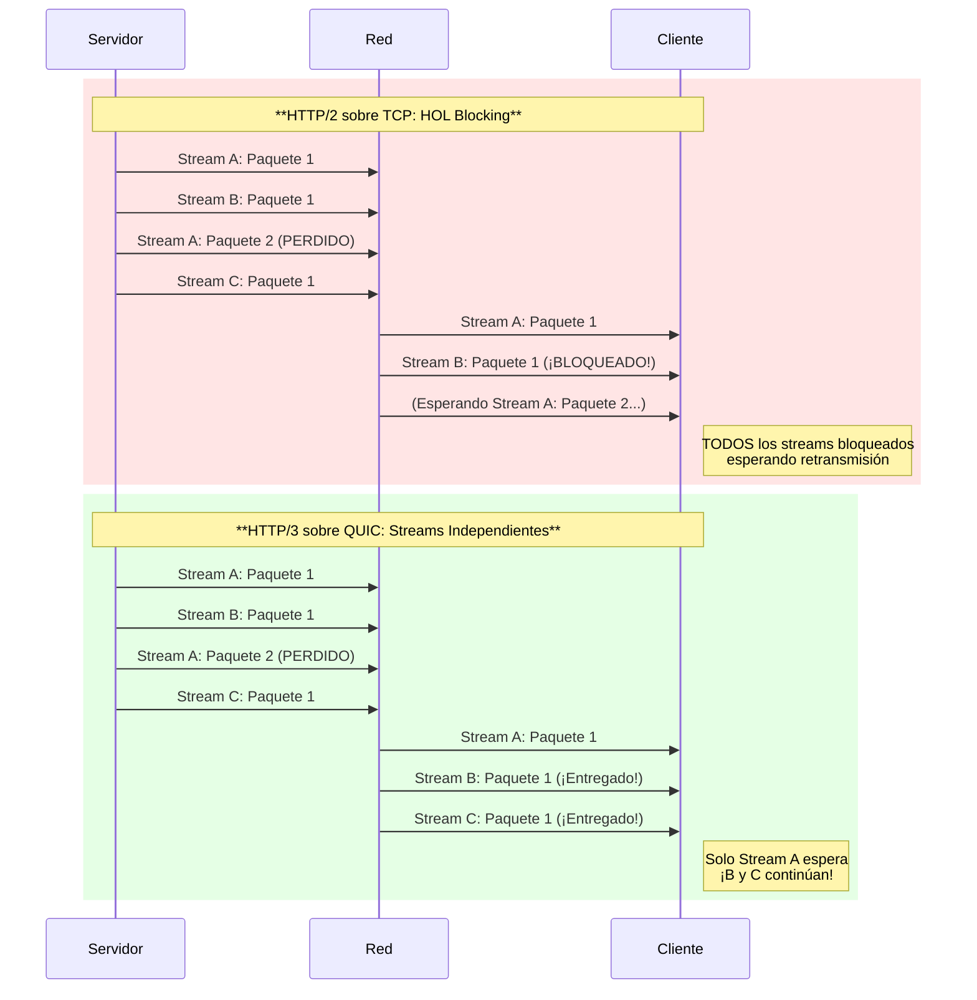
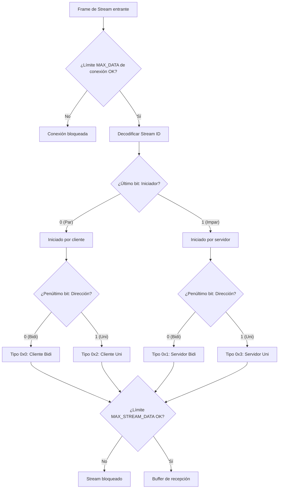
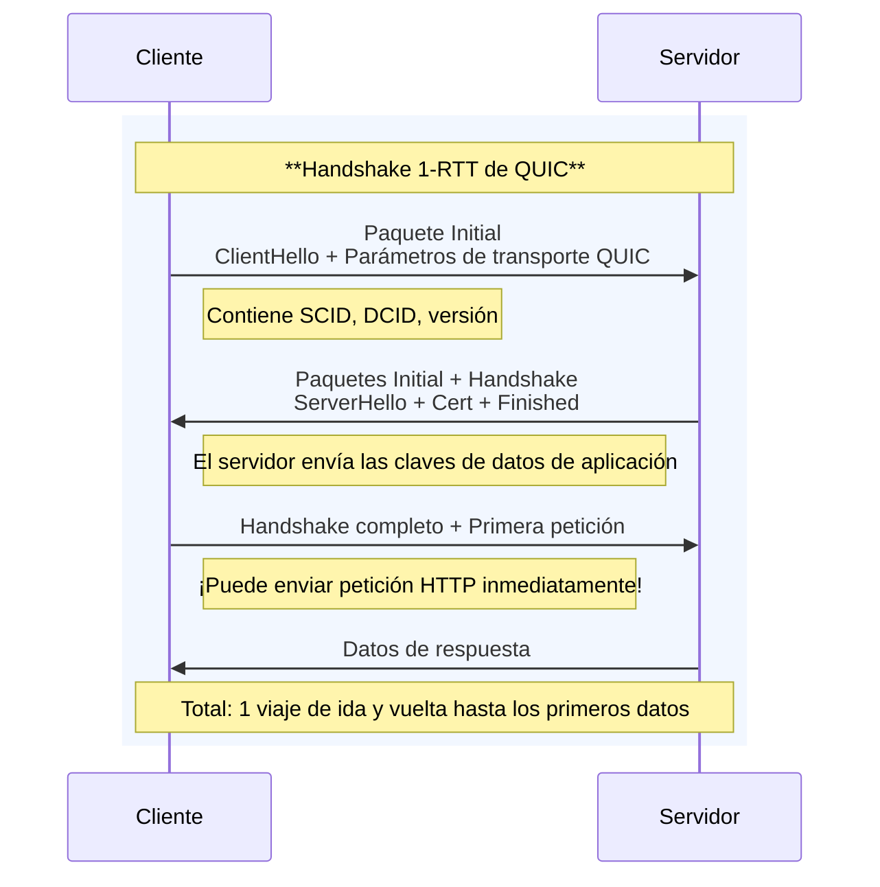
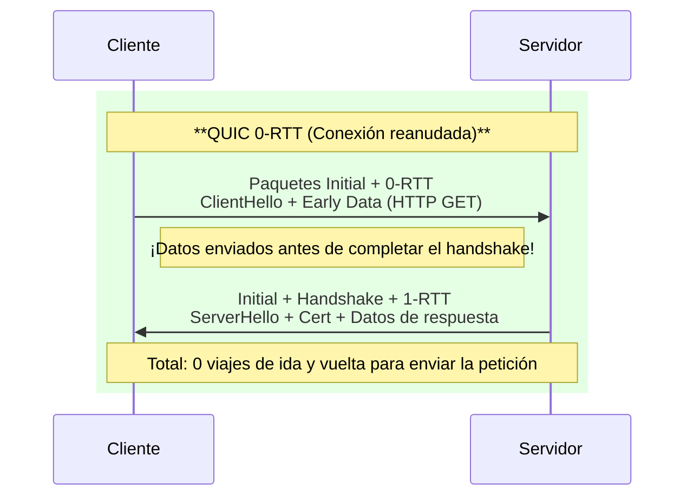

import Callout from "@components/ui/Callout.astro";
import { Tabs, TabPanel } from "@components/ui/tabs";
import TerminalCommand from "@components/ui/TerminalCommand.astro";
import FileContent from "@components/ui/FileContent.astro";
import TerminalOutput from "@components/ui/TerminalOutput.astro";
import Collapsible from "@components/ui/Collapsible.astro";
import Mermaid from "@components/ui/Mermaid.astro";
import Table from "@components/ui/Table.astro";
import Code from "@components/ui/Code.astro";
import TLDRSummary from "@components/ui/TLDRSummary.astro";


La web ha dependido de **TCP** durante más de cuatro décadas. Pero las aplicaciones modernas —con sus exigencias de interactividad en tiempo real, conectividad móvil y cargas de página instantáneas— han expuesto las limitaciones fundamentales de TCP. Llegan **QUIC** y **HTTP/3**: una reinvención completa del transporte web que abandona TCP en favor de UDP para ofrecer un internet más rápido, seguro y resiliente.

En esta guía completa, exploraremos la historia y la arquitectura de QUIC, entenderemos por qué resuelve problemas que TCP no puede, y recorreremos una configuración completa de Nginx lista para producción.

<TLDRSummary title="TL;DR — QUIC y HTTP/3 en Nginx">
  - **QUIC funciona sobre UDP, no TCP**: HTTP/3 mapea la semántica HTTP sobre QUIC, que se construye sobre UDP y exige TLS 1.3.
  - **Resuelve el HOL blocking**: los streams de QUIC son independientes en la capa de transporte, así que un paquete perdido solo bloquea su propio stream, no todos los streams multiplexados como en HTTP/2 sobre TCP.
  - **Handshakes más rápidos y migración de conexión**: handshake combinado de transporte+criptografía (1-RTT, o 0-RTT al reanudar) más Connection IDs que sobreviven a los cambios de red (Wi-Fi → datos móviles).
  - **Nginx necesita 1.25.0+ con `--with-http_v3_module`** y una biblioteca SSL con soporte QUIC (OpenSSL 3.5.1+, BoringSSL, QuicTLS o LibreSSL 3.6+).
  - **Configuración base**: añade `listen 443 quic reuseport;`, activa `http3 on`, TLS 1.3 y la cabecera `Alt-Svc`; `reuseport` debe aparecer en exactamente un listener por dirección:puerto.
  - **Abre UDP/443 en el firewall** (servidor y proveedor cloud) o QUIC fallará silenciosamente y los clientes retrocederán a HTTP/2; verifica con `curl --http3`, las DevTools o `quic="h3"` en el log de acceso.
</TLDRSummary>

---

## Cómo lo ejecuto en mi propia infraestructura

jmrp.io sirve HTTP/3 en sí mismo: los dos server blocks en producción llevan `listen 443 quic;` junto a los listeners TCP habituales, de modo que el sitio acepta conexiones QUIC y TLS-sobre-TCP en paralelo, según lo que soporte realmente el cliente — y lo que haya entre el cliente y el servidor.

No me fié de la palabra de la cabecera `Alt-Svc`. Ejecutar `curl --http3` directamente contra el sitio en vivo devuelve `HTTP/3 200`: un handshake QUIC completado, no una inferencia sacada de una cabecera de respuesta que un servidor mal configurado podría seguir enviando mientras cae en silencio a HTTP/2 por debajo. Esa distinción importa — muchas listas de comprobación de "HTTP/3 activado" se quedan en la cabecera y nunca confirman que el protocolo se negoció de verdad. Es un detalle pequeño de verificar, y también es la única forma de saber que un despliegue QUIC es real y no aspiracional: la cabecera no cuesta nada añadir, pero solo un handshake desde el lado del cliente demuestra que UDP/443 está realmente abierto y negociando de extremo a extremo.

Servir HTTP/3 y que se use son dos preguntas distintas, y solo la segunda necesita datos. jmrp.io está detrás de Cloudflare, que termina la conexión del cliente, así que el protocolo que negocia de verdad un visitante aparece en la analítica de zona de Cloudflare y no en mi propio log de acceso. En ocho días —del 19 al 27 de agosto de 2026, filtrando por el host `jmrp.io` para que el resto de la zona no lo tape— **HTTP/3 se llevó el 33,5 % de las peticiones que negociaron HTTP/2 o HTTP/3**: 11.208 de 33.411.

Ese denominador pide dos frases de defensa, porque la versión honesta de esta medición va sobre todo de lo que hay que tirar. Excluí HTTP/1.1 por completo, y la exclusión no es cosmética: los navegadores actuales acuerdan h2 por ALPN contra Cloudflare, así que una petición que dice ser un navegador y aun así llega por HTTP/1.1 es casi siempre un scraper con el user-agent falseado. Y había unos cuantos: un cubo de «Chrome de escritorio» salía con un 45,8 % de HTTP/1.1, que es algo que Chrome de escritorio no hace. Quitar HTTP/1.1 elimina las falsificaciones evidentes, pero no garantiza que el resto esté limpio: el plan Free no expone puntuación de bot, y la dimensión del navegador se deduce del propio user-agent, de modo que no queda ningún campo independiente por el que filtrar. Por eso tampoco hay aquí una tabla de adopción por navegador: no voy a publicar porcentajes por familia construidos sobre un denominador que no puedo auditar. La ventana son ocho consultas encadenadas de 24 horas, el rango más largo que devuelve ese plan, con lo que arrastra ocho costuras de dos minutos: unos 16 minutos ausentes en total.

Dos cosas sobre esa cifra. La primera es que es una instantánea de esa ventana, no una propiedad estable del sitio. La misma consulta sobre los siete días UTC completos del 26 de agosto al 1 de septiembre de 2026 da un **20,1 %** —10.508 de 52.341— y oscila de un día a otro:

<Table title="Cuota de HTTP/3 por día — host jmrp.io, del 26 de agosto al 1 de septiembre de 2026">
  <thead>
    <tr>
      <th scope="col">Día (UTC)</th>
      <th scope="col">HTTP/3</th>
      <th scope="col">HTTP/2 + HTTP/3</th>
      <th scope="col">Cuota de HTTP/3</th>
    </tr>
  </thead>
  <tbody>
    <tr>
      <td>2026-08-26</td>
      <td>2.013</td>
      <td>9.046</td>
      <td>22,3 %</td>
    </tr>
    <tr>
      <td>2026-08-27</td>
      <td>1.765</td>
      <td>10.457</td>
      <td>16,9 %</td>
    </tr>
    <tr>
      <td>2026-08-28</td>
      <td>1.630</td>
      <td>7.142</td>
      <td>22,8 %</td>
    </tr>
    <tr>
      <td>2026-08-29</td>
      <td>882</td>
      <td>6.902</td>
      <td>12,8 %</td>
    </tr>
    <tr>
      <td>2026-08-30</td>
      <td>1.544</td>
      <td>6.423</td>
      <td>24,0 %</td>
    </tr>
    <tr>
      <td>2026-08-31</td>
      <td>1.272</td>
      <td>6.778</td>
      <td>18,8 %</td>
    </tr>
    <tr>
      <td>2026-09-01</td>
      <td>1.402</td>
      <td>5.593</td>
      <td>25,1 %</td>
    </tr>
    <tr>
      <td><strong>Total</strong></td>
      <td><strong>10.508</strong></td>
      <td><strong>52.341</strong></td>
      <td><strong>20,1 %</strong></td>
    </tr>
  </tbody>
</Table>

La segunda es que ninguna de las dos lecturas se puede recalcular después. El plan Free retiene `httpRequestsAdaptiveGroups` ocho días en ventana deslizante y rechaza cualquier consulta más antigua con `cannot request data older than 1w1d`, así que ambas cifras son observaciones fechadas que la propia fuente no volverá a servir. La tabla está aquí por eso, y publica los dos recuentos y no solo el porcentaje diario, porque los porcentajes por sí solos no bastarían: el día con más tráfico casi duplica al más tranquilo, así que las siete cuotas redondeadas no permiten reconstruir el 20,1 % ponderado —su media sin ponderar es del 20,4 %—. Con cada numerador y cada denominador en la página, el total es aritmética que cualquiera puede comprobar.

Un detalle medido que no esperaba. Mi origen sí envía la cabecera que esta guía te dice que añadas —`add_header Alt-Svc 'h3=":443"; ma=86400' always;` está en los dos server blocks TLS, y una petición directa al origen vuelve con ella—. A través de Cloudflare, esa cabecera sencillamente no está:

<TerminalOutput title="Alt-Svc en el origen frente al edge">
# En la propia máquina de origen, saltándose el CDN por completo:
$ curl -sS -kD- -o /dev/null -H 'Host: jmrp.io' https://127.0.0.1/
alt-svc: h3=":443"; ma=86400
$ curl -sS -D- -o /dev/null --resolve jmrp.io:443:104.21.40.251 https://jmrp.io/
server: cloudflare
(sin cabecera alt-svc en la respuesta)
$ dig +short HTTPS jmrp.io @1.1.1.1
1 . alpn="h3,h2" ipv4hint=104.21.40.251,172.67.158.146 ech=...
</TerminalOutput>

QUIC funciona igualmente, como ya demostraba el handshake de antes, porque el anuncio vive en otro sitio: el registro DNS HTTPS del dominio lleva `alpn="h3,h2"`, y los navegadores que resuelven ese registro se enteran de HTTP/3 antes de abrir una sola conexión. Esto es comportamiento de Cloudflare en toda su plataforma, no una particularidad de mi configuración — el edge termina la conexión y decide por su cuenta qué anuncia, y nada de mi configuración de Nginx puede cambiarlo. La lección práctica es estrecha pero vale: si tienes un CDN delante del origen que configuraste para HTTP/3, la cabecera que estás comprobando puede no ser la que ven tus visitantes. Mira también el registro DNS.

---

## ¿Por qué QUIC sustituyó a TCP en HTTP/3?

El protocolo QUIC tiene una evolución interesante desde un experimento propietario de Google hasta un estándar IETF completo.

<Table title="Cronología de QUIC">
  <thead>
    <tr>
      <th scope="col">Año</th>
      <th scope="col">Hito</th>
      <th scope="col">Importancia</th>
    </tr>
  </thead>
  <tbody>
    <tr>
      <td><strong>2012</strong></td>
      <td>Google comienza el desarrollo de QUIC</td>
      <td>Proyecto interno para reducir la latencia web</td>
    </tr>
    <tr>
      <td><strong>2013</strong></td>
      <td>Primer tráfico QUIC en Chrome</td>
      <td>Primeros experimentos con servicios de Google</td>
    </tr>
    <tr>
      <td><strong>2014</strong></td>
      <td>Despliegue a gran escala de gQUIC</td>
      <td>Chrome de escritorio usa QUIC para las propiedades de Google</td>
    </tr>
    <tr>
      <td><strong>2016</strong></td>
      <td>Se forma el Grupo de Trabajo QUIC del IETF</td>
      <td>Comienza el proceso de estandarización formal</td>
    </tr>
    <tr>
      <td><strong>2017</strong></td>
      <td>IETF QUIC diverge de gQUIC</td>
      <td>Integración de TLS 1.3, transporte de propósito general</td>
    </tr>
    <tr>
      <td><strong>2021</strong></td>
      <td>Se publica el RFC 9000</td>
      <td>Protocolo de transporte QUIC estandarizado</td>
    </tr>
    <tr>
      <td><strong>2022</strong></td>
      <td>Se publica el RFC 9114</td>
      <td>HTTP/3 estandarizado</td>
    </tr>
  </tbody>
</Table>

<Callout type="info" title="Google QUIC vs IETF QUIC" icon="mdi:information">
  El "gQUIC" (Google QUIC) original usaba criptografía propietaria. La versión IETF exige la integración de **TLS 1.3**, convirtiéndolo en un protocolo de transporte de propósito general adecuado para cualquier aplicación, no solo HTTP.
</Callout>

### La familia de RFCs de QUIC

La especificación completa de QUIC abarca múltiples RFCs:

<Table title="Documentos estándar de QUIC">
  <thead>
    <tr>
      <th scope="col">RFC</th>
      <th scope="col">Título</th>
      <th scope="col">Descripción</th>
    </tr>
  </thead>
  <tbody>
    <tr>
      <td><strong><a href="https://datatracker.ietf.org/doc/html/rfc9000" target="_blank" rel="external noopener noreferrer" class="external-link" aria-label="RFC 9000 (se abre en nueva pestaña)">RFC 9000</a></strong></td>
      <td>QUIC Transport</td>
      <td>Protocolo base: paquetes, frames, streams, gestión de conexiones</td>
    </tr>
    <tr>
      <td><strong><a href="https://datatracker.ietf.org/doc/html/rfc9001" target="_blank" rel="external noopener noreferrer" class="external-link" aria-label="RFC 9001 (se abre en nueva pestaña)">RFC 9001</a></strong></td>
      <td>Using TLS to Secure QUIC</td>
      <td>Integración de TLS 1.3, derivación de claves, niveles de cifrado</td>
    </tr>
    <tr>
      <td><strong><a href="https://datatracker.ietf.org/doc/html/rfc9002" target="_blank" rel="external noopener noreferrer" class="external-link" aria-label="RFC 9002 (se abre en nueva pestaña)">RFC 9002</a></strong></td>
      <td>Loss Detection and Congestion Control</td>
      <td>Recuperación de paquetes perdidos, estimación de RTT, algoritmos de congestión</td>
    </tr>
    <tr>
      <td><strong><a href="https://datatracker.ietf.org/doc/html/rfc8999" target="_blank" rel="external noopener noreferrer" class="external-link" aria-label="RFC 8999 (se abre en nueva pestaña)">RFC 8999</a></strong></td>
      <td>Version-Independent Properties</td>
      <td>Comportamientos comunes a todas las versiones de QUIC</td>
    </tr>
    <tr>
      <td><strong><a href="https://datatracker.ietf.org/doc/html/rfc9114" target="_blank" rel="external noopener noreferrer" class="external-link" aria-label="RFC 9114 (se abre en nueva pestaña)">RFC 9114</a></strong></td>
      <td>HTTP/3</td>
      <td>Semántica HTTP sobre QUIC</td>
    </tr>
  </tbody>
</Table>

---

## ¿Por qué QUIC? Entendiendo las limitaciones de TCP

Para apreciar QUIC, debemos entender por qué TCP —la columna vertebral de internet desde 1974— tiene dificultades con las demandas modernas de la web.

### ¿Qué es el head-of-line (HOL) blocking?

Este es el problema fundamental que QUIC resuelve. Imagina una autopista con un solo carril (conexión TCP). Si un coche se avería (pérdida de paquete), **todos los que van detrás deben parar y esperar**, aunque vayan a destinos diferentes.

<Mermaid caption="Head-of-Line Blocking: TCP vs QUIC" maxWidth="750px">

</Mermaid>

<Callout type="keypoint" title="HOL Blocking en TCP" icon="mdi:lightbulb">
  **La idea clave**
  
  HTTP/2 multiplexa varios streams sobre una **única conexión TCP**. Pero TCP ve todo como un único flujo ordenado de bytes — no conoce los streams de HTTP. Cuando se pierde el paquete 2 del Stream A, TCP bloquea **todos** los datos hasta que ese paquete sea retransmitido.
  
  QUIC implementa streams **en la capa de transporte**, de modo que cada stream tiene entrega independiente. Los paquetes perdidos solo afectan a su propio stream.
</Callout>

### El problema de la latencia del handshake

Establecer una conexión TCP segura requiere **múltiples viajes de ida y vuelta**:

<Table title="Comparativa de establecimiento de conexión">
  <thead>
    <tr>
      <th scope="col">Protocolo</th>
      <th scope="col">Conexión nueva</th>
      <th scope="col">Conexión reanudada</th>
      <th scope="col">RTTs totales</th>
    </tr>
  </thead>
  <tbody>
    <tr>
      <td><strong>TCP + TLS 1.2</strong></td>
      <td>TCP handshake + TLS handshake</td>
      <td>TCP + TLS abreviado</td>
      <td>3 RTT → 2 RTT</td>
    </tr>
    <tr>
      <td><strong>TCP + TLS 1.3</strong></td>
      <td>TCP handshake + TLS 1.3</td>
      <td>TCP + TLS 0-RTT</td>
      <td>2 RTT → 1 RTT</td>
    </tr>
    <tr>
      <td><strong>QUIC</strong></td>
      <td>Handshake combinado</td>
      <td>0-RTT early data</td>
      <td>1 RTT → 0 RTT</td>
    </tr>
  </tbody>
</Table>

### El problema de la migración de conexión

Las conexiones TCP se identifican por una 4-tupla: `(IP origen, puerto origen, IP destino, puerto destino)`. Cuando cambias de Wi-Fi a datos móviles, tu IP cambia — y tu conexión TCP se rompe.

<Callout type="success" title="Connection IDs de QUIC" icon="mdi:cellphone-wireless">
  **La solución de QUIC: Connection IDs**
  
  QUIC utiliza **Connection IDs** criptográficamente seguros en lugar de direcciones IP. Cuando tu teléfono cambia de red, el Connection ID permanece igual. Tus descargas, videollamadas y sesiones de juego continúan sin interrupción.
</Callout>

---

## Arquitectura de QUIC en profundidad

### Transporte sobre UDP

QUIC se construye sobre **UDP** en lugar de crear un nuevo protocolo IP. Fue una elección pragmática:

- **No requiere cambios en el kernel**: UDP tiene soporte universal
- **Implementación en espacio de usuario**: Iteración y despliegue más rápidos
- **Traversal de middleboxes**: UDP atraviesa la mayoría de NATs y firewalls

<Callout type="warning" title="UDP vs TCP para QUIC" icon="mdi:alert">
  **QUIC NO es "UDP con funciones extra"**
  
  QUIC implementa su propia fiabilidad, ordenación y control de flujo. UDP es simplemente el mecanismo de entrega. Piensa en UDP como el "sobre" y en QUIC como el sistema postal completo dentro.
</Callout>

### Estructura de paquetes

QUIC utiliza dos tipos de paquetes:

<Table title="Tipos de paquetes QUIC">
  <thead>
    <tr>
      <th scope="col">Tipo</th>
      <th scope="col">Cabecera</th>
      <th scope="col">Uso</th>
      <th scope="col">Cifrado</th>
    </tr>
  </thead>
  <tbody>
    <tr>
      <td><strong>Long Header</strong></td>
      <td>Información completa de conexión</td>
      <td>Initial, Handshake, 0-RTT, Retry</td>
      <td>Claves específicas por nivel</td>
    </tr>
    <tr>
      <td><strong>Short Header</strong></td>
      <td>Mínima (post-handshake)</td>
      <td>Datos de aplicación (1-RTT)</td>
      <td>Claves de aplicación</td>
    </tr>
  </tbody>
</Table>

### Streams y control de flujo

Los streams QUIC son canales ligeros y multiplexados dentro de una conexión:

<Mermaid caption="Lógica de procesamiento de streams QUIC" maxWidth="700px">

</Mermaid>

**Decodificación del Stream ID:**
El Stream ID es un entero de 62 bits donde los **2 bits menos significativos** funcionan como cabecera de tipo:

- **Bit 0 (Iniciador)**: `0` = Cliente, `1` = Servidor
- **Bit 1 (Dirección)**: `0` = Bidireccional, `1` = Unidireccional

Esto crea 4 espacios de direcciones distintos:
- **...00**: Petición/Respuesta del cliente
- **...01**: Server Push (obsoleto)
- **...10**: Stream de control del cliente
- **...11**: Stream de control del servidor (QPACK)

**Control de flujo de doble capa:**
Para que un paquete sea procesado, debe pasar **dos** comprobaciones independientes:
1. **Nivel de conexión**: ¿Hay crédito `MAX_DATA` para toda la conexión?
2. **Nivel de stream**: ¿Hay crédito `MAX_STREAM_DATA` para este stream específico?
Si *cualquiera* se agota, la transmisión se bloquea hasta que llegue un frame `WINDOW_UPDATE`.

---

## El handshake de QUIC: velocidad y seguridad

QUIC combina los handshakes de transporte y criptográficos en un único intercambio, reduciendo drásticamente la latencia.

### Handshake 1-RTT (primera conexión)

<Mermaid caption="Handshake 1-RTT de QUIC" maxWidth="700px">

</Mermaid>

### Handshake 0-RTT (conexión reanudada)

Para clientes que se han conectado previamente, QUIC permite enviar datos cifrados **en el primer paquete**:

<Mermaid caption="Reanudación 0-RTT de QUIC" maxWidth="700px">

</Mermaid>

<Callout type="warning" title="Riesgos del Early Data" icon="mdi:shield-alert">
  **Consideraciones de seguridad del 0-RTT**
  
  El early data (0-RTT) es vulnerable a **ataques de repetición** (replay attacks). Un atacante podría capturar y reenviar el paquete inicial. Mitigaciones:
  
  - Usar 0-RTT solo para **peticiones idempotentes** (GET, HEAD)
  - Los servidores deben rechazar datos 0-RTT no idempotentes
  - Usar `ssl_early_data on;` en Nginx entendiendo los riesgos
  - La cabecera `Early-Data` avisa a los backends sobre peticiones repetidas
</Callout>

---

## Arquitectura de seguridad

La seguridad de QUIC no es opcional —está integrada en el protocolo desde su diseño.

### Cuatro niveles de cifrado

<Table title="Niveles de cifrado de QUIC">
  <thead>
    <tr>
      <th scope="col">Nivel</th>
      <th scope="col">Claves derivadas de</th>
      <th scope="col">Uso</th>
      <th scope="col">Forward Secrecy</th>
    </tr>
  </thead>
  <tbody>
    <tr>
      <td><strong>Initial</strong></td>
      <td>Destination Connection ID</td>
      <td>Primeros paquetes, negociación de versión</td>
      <td data-status="error">No</td>
    </tr>
    <tr>
      <td><strong>0-RTT</strong></td>
      <td>Clave precompartida (PSK)</td>
      <td>Datos de aplicación tempranos</td>
      <td data-status="error">No</td>
    </tr>
    <tr>
      <td><strong>Handshake</strong></td>
      <td>Secretos del handshake TLS</td>
      <td>Completar el handshake</td>
      <td data-status="warning">Parcial</td>
    </tr>
    <tr>
      <td><strong>Application (1-RTT)</strong></td>
      <td>Secretos de tráfico TLS</td>
      <td>Todos los datos post-handshake</td>
      <td data-status="success">Completo (ECDHE)</td>
    </tr>
  </tbody>
</Table>

### Protección de paquetes

Cada paquete QUIC (excepto Initial) está protegido con **cifrado AEAD**:

<Table title="Estructura y protección de paquetes QUIC">
  <thead>
    <tr>
      <th scope="col">Sección del paquete</th>
      <th scope="col">Componente</th>
      <th scope="col">Nivel de protección</th>
    </tr>
  </thead>
  <tbody>
    <tr>
      <td rowspan="3"><strong>Cabecera</strong></td>
      <td>Flags</td>
      <td data-status="warning">Protegido (Header Protection)</td>
    </tr>
    <tr>
      <td>Connection ID</td>
      <td data-status="error">Texto claro (para enrutamiento)</td>
    </tr>
    <tr>
      <td>Número de paquete</td>
      <td data-status="success">Cifrado (Header Protection)</td>
    </tr>
    <tr>
      <td><strong>Carga útil</strong></td>
      <td>Datos de aplicación</td>
      <td data-status="success">Totalmente cifrado (AEAD)</td>
    </tr>
    <tr>
      <td><strong>Pie</strong></td>
      <td>Etiqueta de autenticación</td>
      <td data-status="success">MAC de integridad de 16 bytes</td>
    </tr>
  </tbody>
</Table>

<Callout type="info" title="Mecanismos de cifrado" icon="mdi:shield-lock">
  **Detalles de la protección:**
  - **Derivación de claves**: HKDF a partir de los secretos de tráfico de TLS 1.3.
  - **Nonce**: IV con XOR del número de paquete para prevenir la reutilización de nonces en la conexión.
  - **Header Protection**: Cifrado independiente de flags y números de paquete para enmascarar patrones de tráfico de red.
</Callout>

### Connection ID y privacidad

<Callout type="keypoint" icon="mdi:incognito">
  **Diseño anti-rastreo**
  
  Los Connection IDs de QUIC pueden **rotarse** durante una conexión. El servidor proporciona nuevos Connection IDs mediante frames `NEW_CONNECTION_ID`. Esto impide que los observadores de red rastreen conexiones a través de cambios de ruta.
  
  Combinado con números de paquete y cabeceras cifradas, QUIC mejora significativamente la privacidad en comparación con TCP.
</Callout>

### Mecanismos de protección contra DoS

QUIC incluye varias medidas anti-amplificación y anti-suplantación:

1. **Validación de dirección**: Los servidores envían paquetes `RETRY` para validar las direcciones de los clientes
2. **Anti-amplificación**: Los servidores limitan los datos enviados antes de la validación de dirección (3x los datos del cliente)
3. **Stateless Reset**: Terminación limpia de conexión sin estado

---

## HTTP/3: HTTP sobre QUIC

HTTP/3 es el mapeo de la semántica HTTP sobre el transporte QUIC. Reemplaza el framing binario de HTTP/2 con streams QUIC.

<Table title="HTTP/2 vs HTTP/3">
  <thead>
    <tr>
      <th scope="col">Característica</th>
      <th scope="col">HTTP/2</th>
      <th scope="col">HTTP/3</th>
    </tr>
  </thead>
  <tbody>
    <tr>
      <td><strong>Transporte</strong></td>
      <td>TCP + TLS</td>
      <td>QUIC (UDP + TLS 1.3)</td>
    </tr>
    <tr>
      <td><strong>Multiplexing</strong></td>
      <td>Frames de stream en una única conexión</td>
      <td>Streams nativos de QUIC</td>
    </tr>
    <tr>
      <td><strong>HOL Blocking</strong></td>
      <td>Sí (en la capa TCP)</td>
      <td>No (streams independientes)</td>
    </tr>
    <tr>
      <td><strong>Compresión de cabeceras</strong></td>
      <td>HPACK</td>
      <td>QPACK (maneja el desorden)</td>
    </tr>
    <tr>
      <td><strong>Server Push</strong></td>
      <td>Soportado</td>
      <td>Obsoleto (poco usado)</td>
    </tr>
    <tr>
      <td><strong>Migración de conexión</strong></td>
      <td data-status="error">No</td>
      <td data-status="success">Sí</td>
    </tr>
  </tbody>
</Table>

### ¿Quién usa HTTP/3 hoy?

A fecha de 2026, la adopción de HTTP/3 es significativa y creciente:

<Table title="Estadísticas de adopción de HTTP/3">
  <thead>
    <tr>
      <th scope="col">Métrica</th>
      <th scope="col">Valor</th>
      <th scope="col">Fuente</th>
    </tr>
  </thead>
  <tbody>
    <tr>
      <td><strong>Sitios web usando HTTP/3</strong></td>
      <td>36,6%</td>
      <td><a href="https://w3techs.com/technologies/details/ce-http3" target="_blank" rel="external noopener noreferrer" class="external-link" aria-label="W3Techs (2026) (se abre en nueva pestaña)">W3Techs (2026)</a></td>
    </tr>
    <tr>
      <td><strong>Uso de QUIC en Chrome (subsiguiente)</strong></td>
      <td>40%</td>
      <td><a href="https://blog.apnic.net/2023/10/09/measuring-http-3-real-world-performance/" target="_blank" rel="external noopener noreferrer" class="external-link" aria-label="APNIC Labs (se abre en nueva pestaña)">APNIC Labs</a></td>
    </tr>
    <tr>
      <td><strong>Mejora en carga de página (global)</strong></td>
      <td>12,4%</td>
      <td><a href="https://blog.cloudflare.com/http-3-vs-http-2/" target="_blank" rel="external noopener noreferrer" class="external-link" aria-label="Cloudflare Benchmarks (se abre en nueva pestaña)">Cloudflare Benchmarks</a></td>
    </tr>
    <tr>
      <td><strong>Mejora en regiones de alta latencia</strong></td>
      <td>13,8%</td>
      <td><a href="https://www.debugbear.com/blog/http3-vs-http2-performance" target="_blank" rel="external noopener noreferrer" class="external-link" aria-label="DebugBear (se abre en nueva pestaña)">DebugBear</a></td>
    </tr>
  </tbody>
</Table>

---

## Configuración de Nginx: guía completa

Ahora vamos a implementar HTTP/3 en Nginx. Esta sección cubre todo, desde los prerrequisitos hasta el despliegue en producción.

### Prerrequisitos

<Callout type="warning" title="Requisitos de HTTP/3" icon="mdi:alert-circle">
  **Requisitos de versión**
  
  - **Nginx**: Versión 1.25.0+ (soporte HTTP/3 añadido a mediados de 2023)
  - **Biblioteca SSL**: Una de las siguientes con soporte QUIC:
    - OpenSSL 3.5.1+ (recomendado para 0-RTT)
    - BoringSSL
    - QuicTLS (fork de OpenSSL, archivado en 2025)
    - LibreSSL 3.6+
</Callout>

Verifica tu instalación de Nginx:

<TerminalCommand ariaLabel="Comando para verificar la versión y módulos de Nginx">
```bash
nginx -V 2>&1 | grep -E 'version|http_v3_module|OpenSSL|BoringSSL'
```
</TerminalCommand>

<TerminalOutput title="Salida de la versión de Nginx">
nginx version: nginx/1.28.0
built with OpenSSL 3.5.0 8 Apr 2025 (running with OpenSSL 3.5.4 30 Sep 2025)
configure arguments: ... --with-http_v3_module ...
</TerminalOutput>

<Collapsible summary="Cómo instalar Nginx con soporte HTTP/3">

<Callout type="warning" title="El repositorio Nginx de Ondřej Surý ya no existe" icon="mdi:alert-circle">
  Las guías escritas antes de 2026 —incluidas versiones anteriores de esta— te
  mandan a `https://packages.sury.org/nginx/README.txt` en Debian y a
  `ppa:ondrej/nginx-mainline` en Ubuntu. Los dos canales se han retirado: a 27 de
  agosto de 2026 la ruta `/nginx/` de ese host devuelve **404** mientras sus
  repositorios de PHP y Apache siguen respondiendo, y los dos PPA de Launchpad han
  desaparecido. Usa el repositorio oficial de Nginx.
</Callout>

<Tabs>
  <TabPanel label="Repositorio oficial de Nginx (Recomendado)">
    Los paquetes que nginx.org publica para Debian y Ubuntu vienen compilados
    `--with-http_v3_module` contra OpenSSL 3.5, así que HTTP/3 no exige compilar
    nada a mano. Los mismos comandos valen para las dos distribuciones:
    `/etc/os-release` aporta el fabricante y el nombre en clave.

    ```bash
    sudo apt install curl gnupg2 ca-certificates
    DISTRO=$(. /etc/os-release && echo "$ID")
    CODENAME=$(. /etc/os-release && echo "$VERSION_CODENAME")

    # Clave de firma de Nginx en su propio llavero
    sudo mkdir -p /etc/apt/keyrings
    curl -fsSL https://nginx.org/keys/nginx_signing.key -o /tmp/nginx.key

    # Contrasta las huellas con la lista que publica nginx en
    # https://nginx.org/en/pgp_keys.html ANTES de confiar en la clave. El
    # paquete lleva varias claves y rotan, así que compara la salida y no un
    # número copiado de un artículo.
    gpg --show-keys --with-fingerprint /tmp/nginx.key

    sudo gpg --dearmor -o /etc/apt/keyrings/nginx.gpg /tmp/nginx.key

    # Repositorio mainline, restringido a ese llavero
    echo "deb [signed-by=/etc/apt/keyrings/nginx.gpg] https://nginx.org/packages/mainline/$DISTRO $CODENAME nginx" \
        | sudo tee /etc/apt/sources.list.d/nginx.list

    sudo apt update && sudo apt install nginx

    # Comprobar la compilación que acabas de instalar
    nginx -V 2>&1 | tr ' ' '\n' | grep -E 'http_v3|OpenSSL'
    ```
  </TabPanel>
  <TabPanel label="Compilar desde fuente">
    Solo hace falta si quieres un módulo que los paquetes no traen. Nginx compila
    HTTP/3 contra cualquier biblioteca SSL que exponga una API QUIC: OpenSSL 3.5+,
    BoringSSL o LibreSSL 3.6+. En una distribución actual basta con el OpenSSL del
    sistema — el propio paquete oficial de Debian 13 está compilado contra OpenSSL
    3.5.6.

    ```bash
    openssl version   # 3.5.0 o superior

    wget https://nginx.org/download/nginx-1.31.4.tar.gz
    tar xzf nginx-1.31.4.tar.gz
    cd nginx-1.31.4

    ./configure \
        --with-http_v3_module \
        --with-http_ssl_module \
        --with-http_v2_module

    make -j"$(nproc)"
    sudo make install
    ```
  </TabPanel>
</Tabs>

</Collapsible>

### Configuración básica

Esta es la configuración mínima para habilitar HTTP/3:

<FileContent filename="/etc/nginx/sites-available/example.com.conf">
```nginx
server {
    server_name example.com;
    root /var/www/example.com;

    # ==========================================
    # LISTENERS: TCP (HTTP/1.1, HTTP/2) + UDP (HTTP/3)
    # ==========================================
    
    # Standard HTTPS over TCP
    listen 443 ssl;
    listen [::]:443 ssl;
    http2 on;
    
    # QUIC/HTTP/3 over UDP
    # 'reuseport' is critical for multi-worker performance
    listen 443 quic reuseport;
    listen [::]:443 quic reuseport;

    # ==========================================
    # SSL/TLS CONFIGURATION
    # ==========================================
    
    # TLS 1.3 is REQUIRED for QUIC
    ssl_protocols TLSv1.3 TLSv1.2;
    ssl_prefer_server_ciphers off;
    
    ssl_certificate /etc/letsencrypt/live/example.com/fullchain.pem;
    ssl_certificate_key /etc/letsencrypt/live/example.com/privkey.pem;

    # ==========================================
    # HTTP/3 CONFIGURATION
    # ==========================================
    
    http3 on;
    
    # Advertise HTTP/3 support to browsers
    # ma=86400 means "cache this info for 24 hours"
    add_header Alt-Svc 'h3=":443"; ma=86400' always;

    location / {
        try_files $uri $uri/ =404;
    }
}
```
</FileContent>

<Callout type="info" title="Por qué reuseport es crítico" icon="mdi:information">
  **¿Por qué `reuseport`?**
  
  UDP no tiene conexión — sin `reuseport`, todos los paquetes QUIC serían manejados por un único worker de Nginx, creando un cuello de botella. La función `reuseport` del kernel distribuye los paquetes entrantes entre todos los workers.
  
  **⚠️ Importante:** El flag `reuseport` debe aparecer en **exactamente una** directiva `listen` por dirección:puerto a nivel global. Si tienes múltiples server blocks escuchando en el puerto 443 QUIC, solo el primero debe tener `reuseport`. Usarlo varias veces hará que Nginx falle al iniciar con errores de "address already in use".
</Callout>

### Configuración completa de producción

Aquí tienes una configuración exhaustiva con todas las optimizaciones. La configuración se divide en dos archivos: el `nginx.conf` principal para ajustes globales y un archivo de configuración específico del sitio.

<FileContent filename="/etc/nginx/nginx.conf" collapsible ariaLabel="Configuración principal de Nginx">
```nginx
# Main context
worker_processes auto;
error_log /var/log/nginx/error.log warn;

events {
    worker_connections 4096;
    use epoll;
    multi_accept on;
}

http {
    # ==========================================
    # HTTP/3 GLOBAL SETTINGS
    # ==========================================
    # Explicit for clarity (http3 defaults to 'on' in nginx 1.25.0+)
    http3 on;
    
    # Custom log format to track HTTP/3 connections
    log_format quic '$remote_addr - $remote_user [$time_local] '
                    '"$request" $status $body_bytes_sent '
                    '"$http_referer" "$http_user_agent" '
                    'proto="$server_protocol" quic="$http3"';

    # MIME types
    include /etc/nginx/mime.types;
    default_type application/octet-stream;

    # Performance optimizations
    sendfile on;
    tcp_nopush on;
    tcp_nodelay on;
    
    # Gzip compression
    gzip on;
    gzip_vary on;
    gzip_min_length 1024;
    gzip_types text/plain text/css application/json application/javascript 
               text/xml application/xml application/xml+rss text/javascript;

    # Include site configurations
    include /etc/nginx/sites-enabled/*;
}
```
</FileContent>

La configuración específica del sitio incluye todas las directivas para QUIC, TLS, cabeceras y logging:

<FileContent filename="/etc/nginx/sites-available/example.com.conf" collapsible ariaLabel="Configuración específica del sitio Nginx">
```nginx
server {
    server_name example.com www.example.com;
    root /var/www/example.com;

    # ==========================================
    # DUAL-STACK LISTENERS
    # ==========================================
    
    # TCP: HTTP/1.1 and HTTP/2 fallback
    listen 443 ssl;
    listen [::]:443 ssl;
    http2 on;
    
    # UDP: QUIC/HTTP/3
    listen 443 quic reuseport;
    listen [::]:443 quic reuseport;

    # ==========================================
    # TLS CONFIGURATION (Required for QUIC)
    # ==========================================
    
    ssl_protocols TLSv1.3 TLSv1.2;
    # TLS 1.3 ciphersuites (handled separately for better OpenSSL compatibility)
    ssl_conf_command Ciphersuites TLS_AES_128_GCM_SHA256:TLS_AES_256_GCM_SHA384:TLS_CHACHA20_POLY1305_SHA256;
    # TLS 1.2 ciphers only (ECDHE for forward secrecy)
    ssl_ciphers ECDHE-ECDSA-AES128-GCM-SHA256:ECDHE-RSA-AES128-GCM-SHA256:ECDHE-ECDSA-AES256-GCM-SHA384:ECDHE-RSA-AES256-GCM-SHA384:ECDHE-ECDSA-CHACHA20-POLY1305:ECDHE-RSA-CHACHA20-POLY1305;
    ssl_prefer_server_ciphers off;
    ssl_ecdh_curve X25519:P-256:P-384;
    
    ssl_certificate /etc/letsencrypt/live/example.com/fullchain.pem;
    ssl_certificate_key /etc/letsencrypt/live/example.com/privkey.pem;
    
    # Session resumption for performance
    ssl_session_cache shared:SSL:10m;
    ssl_session_timeout 1d;
    ssl_session_tickets off;  # Better security
    
    # OCSP Stapling
    ssl_stapling on;
    ssl_stapling_verify on;

    # ==========================================
    # QUIC-SPECIFIC SETTINGS
    # ==========================================
    
    # Enable 0-RTT early data (with security considerations)
    ssl_early_data on;
    
    # DoS protection: require address validation
    quic_retry on;
    
    # Performance: Generic Segmentation Offload (Linux 4.18+)
    quic_gso on;

    # ==========================================
    # HEADERS
    # ==========================================
    
    # Advertise HTTP/3 availability
    add_header Alt-Svc 'h3=":443"; ma=86400' always;
    
    # Warn backends about 0-RTT replay risk
    add_header Early-Data $ssl_early_data always;
    
    # Security headers
    add_header Strict-Transport-Security "max-age=63072000; includeSubDomains; preload" always;
    add_header X-Content-Type-Options "nosniff" always;
    add_header X-Frame-Options "DENY" always;

    # ==========================================
    # LOGGING
    # ==========================================
    
    access_log /var/log/nginx/example.com.access.log quic;
    error_log /var/log/nginx/example.com.error.log;

    # ==========================================
    # LOCATIONS
    # ==========================================
    
    location / {
        try_files $uri $uri/ =404;
    }
    
    # Static assets with long cache
    location ~* \.(js|css|png|jpg|jpeg|gif|ico|svg|woff|woff2)$ {
        expires 1y;
        add_header Cache-Control "public, immutable" always;
        add_header Alt-Svc 'h3=":443"; ma=86400' always;
        
        # Security headers (inherited from server block may not apply with add_header in location)
        add_header Strict-Transport-Security "max-age=63072000; includeSubDomains; preload" always;
        add_header X-Content-Type-Options "nosniff" always;
        add_header X-Frame-Options "DENY" always;
    }
}

# HTTP to HTTPS redirect
server {
    listen 80;
    listen [::]:80;
    server_name example.com www.example.com;
    return 301 https://$host$request_uri;
}
```
</FileContent>

### Referencia de todas las directivas QUIC

<Table title="Directivas QUIC de Nginx">
  <thead>
    <tr>
      <th scope="col">Directiva</th>
      <th scope="col">Por defecto</th>
      <th scope="col">Contexto</th>
      <th scope="col">Descripción</th>
    </tr>
  </thead>
  <tbody>
    <tr>
      <td><a href="https://nginx.org/en/docs/http/ngx_http_v3_module.html#http3" target="_blank" rel="external noopener noreferrer" aria-label="http3 (se abre en nueva pestaña)"><code>http3</code></a></td>
      <td><code>on</code></td>
      <td>http, server</td>
      <td>Habilita la negociación del protocolo HTTP/3</td>
    </tr>
    <tr>
      <td><a href="https://nginx.org/en/docs/http/ngx_http_v3_module.html#http3_hq" target="_blank" rel="external noopener noreferrer" aria-label="http3_hq (se abre en nueva pestaña)"><code>http3_hq</code></a></td>
      <td><code>off</code></td>
      <td>http, server</td>
      <td>Habilita HTTP/0.9 sobre QUIC (solo para pruebas)</td>
    </tr>
    <tr>
      <td><a href="https://nginx.org/en/docs/http/ngx_http_v3_module.html#http3_max_concurrent_streams" target="_blank" rel="external noopener noreferrer" aria-label="http3_max_concurrent_streams (se abre en nueva pestaña)"><code>http3_max_concurrent_streams</code></a></td>
      <td><code>128</code></td>
      <td>http, server</td>
      <td>Máximo de streams concurrentes por conexión</td>
    </tr>
    <tr>
      <td><a href="https://nginx.org/en/docs/http/ngx_http_v3_module.html#http3_stream_buffer_size" target="_blank" rel="external noopener noreferrer" aria-label="http3_stream_buffer_size (se abre en nueva pestaña)"><code>http3_stream_buffer_size</code></a></td>
      <td><code>64k</code></td>
      <td>http, server</td>
      <td>Tamaño del buffer para lectura/escritura de streams</td>
    </tr>
    <tr>
      <td><a href="https://nginx.org/en/docs/http/ngx_http_v3_module.html#quic_active_connection_id_limit" target="_blank" rel="external noopener noreferrer" aria-label="quic_active_connection_id_limit (se abre en nueva pestaña)"><code>quic_active_connection_id_limit</code></a></td>
      <td><code>2</code></td>
      <td>http, server</td>
      <td>Máximo de Connection IDs almacenados por conexión</td>
    </tr>
    <tr>
      <td><a href="https://nginx.org/en/docs/http/ngx_http_v3_module.html#quic_bpf" target="_blank" rel="external noopener noreferrer" aria-label="quic_bpf (se abre en nueva pestaña)"><code>quic_bpf</code></a></td>
      <td><code>off</code></td>
      <td>main</td>
      <td>Enrutamiento eBPF para migración de conexión (Linux 5.7+)</td>
    </tr>
    <tr>
      <td><a href="https://nginx.org/en/docs/http/ngx_http_v3_module.html#quic_gso" target="_blank" rel="external noopener noreferrer" aria-label="quic_gso (se abre en nueva pestaña)"><code>quic_gso</code></a></td>
      <td><code>off</code></td>
      <td>http, server</td>
      <td>Generic Segmentation Offload (Linux 4.18+)</td>
    </tr>
    <tr>
      <td><a href="https://nginx.org/en/docs/http/ngx_http_v3_module.html#quic_host_key" target="_blank" rel="external noopener noreferrer" aria-label="quic_host_key (se abre en nueva pestaña)"><code>quic_host_key</code></a></td>
      <td>-</td>
      <td>http, server</td>
      <td>Archivo con clave secreta para tokens de validación de dirección</td>
    </tr>
    <tr>
      <td><a href="https://nginx.org/en/docs/http/ngx_http_v3_module.html#quic_retry" target="_blank" rel="external noopener noreferrer" aria-label="quic_retry (se abre en nueva pestaña)"><code>quic_retry</code></a></td>
      <td><code>off</code></td>
      <td>http, server</td>
      <td>Habilita la validación de dirección mediante paquetes Retry</td>
    </tr>
  </tbody>
</Table>

---

## Configuración del firewall

**Crítico**: HTTP/3 usa **UDP** en el puerto 443, no TCP. Si tu firewall solo permite TCP/443, QUIC fallará silenciosamente y los clientes retrocedarán a HTTP/2.

<Tabs>
  <TabPanel label="UFW (Ubuntu/Debian)">
    ```bash
    # Check current rules
    sudo ufw status
    
    # Allow UDP on port 443
    sudo ufw allow 443/udp comment 'QUIC/HTTP3'
    
    # Verify
    sudo ufw status verbose
    ```
  </TabPanel>
  <TabPanel label="iptables">
    ```bash
    # Allow incoming UDP 443
    sudo iptables -A INPUT -p udp --dport 443 -j ACCEPT
    
    # Save rules (Debian/Ubuntu)
    sudo iptables-save | sudo tee /etc/iptables/rules.v4
    
    # For IPv6
    sudo ip6tables -A INPUT -p udp --dport 443 -j ACCEPT
    sudo ip6tables-save | sudo tee /etc/iptables/rules.v6
    ```
  </TabPanel>
  <TabPanel label="firewalld (RHEL/CentOS)">
    ```bash
    # Add UDP 443 to default zone
    sudo firewall-cmd --permanent --add-port=443/udp
    
    # Reload
    sudo firewall-cmd --reload
    
    # Verify
    sudo firewall-cmd --list-ports
    ```
  </TabPanel>
  <TabPanel label="AWS Security Groups">
    Añade una regla de entrada:
    - **Tipo**: Custom UDP
    - **Rango de puertos**: 443
    - **Origen**: 0.0.0.0/0 (o tu CIDR)
    - **Descripción**: QUIC/HTTP3
  </TabPanel>
</Tabs>

### Ajuste del kernel para alto tráfico

Para servidores con alto tráfico, aumenta los tamaños de buffer UDP:

<FileContent filename="/etc/sysctl.d/99-quic.conf">
```bash
# Increase UDP buffer sizes for QUIC
net.core.rmem_max = 16777216
net.core.wmem_max = 16777216
net.core.rmem_default = 1048576
net.core.wmem_default = 1048576

# UDP memory limits
net.ipv4.udp_mem = 65536 131072 262144
net.ipv4.udp_rmem_min = 8192
net.ipv4.udp_wmem_min = 8192

# Allow more local ports for connections
net.ipv4.ip_local_port_range = 1024 65535
```
</FileContent>

Aplica los ajustes:

<TerminalCommand ariaLabel="Comando para aplicar los ajustes de kernel para UDP">
```bash
sudo sysctl --system
```
</TerminalCommand>

---

## Verificación y pruebas

Tras la configuración, verifica que HTTP/3 funciona correctamente.

### Método 1: curl

Las versiones modernas de curl (7.66+ con soporte HTTP/3) permiten probar directamente:

<TerminalCommand ariaLabel="Comandos curl para probar la conexión HTTP/3">
```bash
# Test HTTP/3 specifically
curl -I --http3-only https://jmrp.io

# Or allow fallback
curl -I --http3 https://jmrp.io
```
</TerminalCommand>

<TerminalOutput title="Salida de la respuesta HTTP/3 con curl">
HTTP/3 200 
server: jmrp.io
date: Wed, 14 Jan 2026 20:02:32 GMT
content-type: text/html; charset=utf-8
alt-svc: h3=":443"; ma=86400
strict-transport-security: max-age=63072000; includeSubDomains; preload
</TerminalOutput>

<Callout type="tip" title="Instalar curl con soporte HTTP/3" icon="mdi:lightbulb">
  **Instalar curl con soporte HTTP/3**
  
  En macOS: `brew install curl`
  En Ubuntu: Compilar desde fuente con `--with-ngtcp2` o usar el paquete snap
</Callout>

### Método 2: DevTools del navegador

1. Abre Chrome o Firefox
2. Navega a tu sitio
3. Abre DevTools (F12) → pestaña **Red** (Network)
4. Haz clic derecho en las cabeceras de columna → Activa la columna **Protocolo**
5. Recarga la página
6. Busca `h3` en la columna Protocolo

<Callout type="info" title="Comportamiento en la primera visita" icon="mdi:information">
  **Comportamiento en la primera visita**
  
  En la primera visita, los navegadores usan HTTP/2 para descubrir la cabecera `Alt-Svc`. En peticiones posteriores (o tras recargar), cambian a HTTP/3. Este es un comportamiento normal.
</Callout>

### Método 3: herramientas online

<Table title="Herramientas de prueba HTTP/3">
  <thead>
    <tr>
      <th scope="col">Herramienta</th>
      <th scope="col">URL</th>
      <th scope="col">Características</th>
    </tr>
  </thead>
  <tbody>
    <tr>
      <td><strong>HTTP/3 Check</strong></td>
      <td><a href="https://http3check.net/" target="_blank" rel="external noopener noreferrer" class="external-link" aria-label="http3check.net (se abre en nueva pestaña)">http3check.net</a></td>
      <td>Test rápido de aprobado/suspenso con detalles</td>
    </tr>
    <tr>
      <td><strong>Cloudflare HTTP/3 Test</strong></td>
      <td><a href="https://cloudflare-quic.com/" target="_blank" rel="external noopener noreferrer" class="external-link" aria-label="cloudflare-quic.com (se abre en nueva pestaña)">cloudflare-quic.com</a></td>
      <td>Prueba de conexión en vivo</td>
    </tr>
    <tr>
      <td><strong>Qualys SSL Labs</strong></td>
      <td><a href="https://www.ssllabs.com/ssltest/" target="_blank" rel="external noopener noreferrer" class="external-link" aria-label="ssllabs.com (se abre en nueva pestaña)">ssllabs.com</a></td>
      <td>Análisis exhaustivo de TLS</td>
    </tr>
  </tbody>
</Table>

### Método 4: comprobar los logs de Nginx

Usa el formato de log personalizado para verificar el tráfico HTTP/3:

<TerminalCommand ariaLabel="Comando grep para comprobar los logs de acceso de Nginx">
```bash
# Check for HTTP/3 connections
grep 'quic="h3"' /var/log/nginx/access.log | tail -5
```
</TerminalCommand>

<TerminalOutput title="Salida del log mostrando tráfico HTTP/3">
192.168.1.100 - - [14/Jan/2026:20:02:32 +0000] "GET / HTTP/3" 200 15234 "-" "Mozilla/5.0..." proto="HTTP/3" quic="h3"
</TerminalOutput>

---

## Guía de resolución de problemas

<Table title="Problemas comunes de HTTP/3 y soluciones">
  <thead>
    <tr>
      <th scope="col">Síntoma</th>
      <th scope="col">Causa probable</th>
      <th scope="col">Solución</th>
    </tr>
  </thead>
  <tbody>
    <tr>
      <td><strong>El protocolo se queda en HTTP/2</strong></td>
      <td>Firewall bloqueando UDP/443</td>
      <td>Abre el puerto UDP 443 en el servidor y en el proveedor cloud</td>
    </tr>
    <tr>
      <td><strong>El protocolo se queda en HTTP/2</strong></td>
      <td>Falta la cabecera Alt-Svc</td>
      <td>Añade <code>add_header Alt-Svc 'h3=":443"; ma=86400' always;</code></td>
    </tr>
    <tr>
      <td><strong>Errores de conexión</strong></td>
      <td>TLS 1.3 no habilitado</td>
      <td>Habilita TLSv1.3 para QUIC (obligatorio); TLSv1.2 puede seguir habilitado como fallback para HTTP/2</td>
    </tr>
    <tr>
      <td><strong>Los navegadores se niegan a usar QUIC</strong></td>
      <td>Certificado autofirmado</td>
      <td>Usa un certificado válido (Let's Encrypt)</td>
    </tr>
    <tr>
      <td><strong>Nginx no arranca</strong></td>
      <td>Falta <code>--with-http_v3_module</code></td>
      <td>Recompila Nginx con el módulo HTTP/3</td>
    </tr>
    <tr>
      <td><strong>Uso alto de CPU</strong></td>
      <td>GSO no soportado por el kernel</td>
      <td>Desactiva <code>quic_gso</code> o actualiza el kernel</td>
    </tr>
    <tr>
      <td><strong>0-RTT no funciona</strong></td>
      <td>Versión de OpenSSL demasiado antigua</td>
      <td>Usa OpenSSL 3.5.1+, QuicTLS o BoringSSL</td>
    </tr>
  </tbody>
</Table>

### Modo depuración

Activa el logging de depuración temporalmente:

<Code lang="nginx" aria-label="Activar el logging de depuración de Nginx">
```
error_log /var/log/nginx/error.log debug;
```
</Code>

Comprueba los mensajes específicos de QUIC:

<TerminalCommand>
```bash
grep -i quic /var/log/nginx/error.log | tail -20
```
</TerminalCommand>

<TerminalOutput title="Log de depuración de Nginx (fallo simulado)">
2026/01/14 10:42:15 [debug] 12345#0: *1 quic handle packet: fd:16, addr:192.0.2.1:54321
2026/01/14 10:42:15 [debug] 12345#0: *1 quic packet rx dcid len:8 87654321
2026/01/14 10:42:15 [debug] 12345#0: *1 quic packet rx scid len:8 12345678
2026/01/14 10:42:15 [info] 12345#0: *1 quic SSL_do_handshake() failed: SSL_ERROR_SSL: error:14094416:SSL routines:ssl3_read_bytes:sslv3 alert certificate unknown
2026/01/14 10:42:15 [debug] 12345#0: *1 quic close connection: 0:
</TerminalOutput>

---

## Lista de verificación para producción

Antes de desplegar HTTP/3 en producción, verifica:

<Table title="Lista de verificación para HTTP/3 en producción">
  <thead>
    <tr>
      <th scope="col">Categoría</th>
      <th scope="col">Elemento</th>
      <th scope="col">Verificación</th>
    </tr>
  </thead>
  <tbody>
    <tr>
      <td><strong>Build</strong></td>
      <td>Nginx compilado con <code>--with-http_v3_module</code></td>
      <td><code>nginx -V 2>&1 | grep http_v3</code></td>
    </tr>
    <tr>
      <td><strong>Build</strong></td>
      <td>Biblioteca SSL compatible (QuicTLS/BoringSSL/OpenSSL 3.5.1+)</td>
      <td><code>nginx -V 2>&1 | grep -i ssl</code></td>
    </tr>
    <tr>
      <td><strong>Red</strong></td>
      <td>UDP/443 abierto en el firewall del servidor</td>
      <td><code>sudo ss -ulnp | grep 443</code></td>
    </tr>
    <tr>
      <td><strong>Red</strong></td>
      <td>UDP/443 abierto en el proveedor cloud (AWS/GCP/Azure)</td>
      <td>Comprueba las reglas del security group/firewall</td>
    </tr>
    <tr>
      <td><strong>Config</strong></td>
      <td><code>listen 443 quic reuseport;</code> presente</td>
      <td><code>nginx -T | grep quic</code></td>
    </tr>
    <tr>
      <td><strong>Config</strong></td>
      <td>TLS 1.3 habilitado</td>
      <td><code>nginx -T | grep ssl_protocols</code></td>
    </tr>
    <tr>
      <td><strong>Config</strong></td>
      <td>Cabecera Alt-Svc configurada</td>
      <td><code>curl -I https://example.com | grep alt-svc</code></td>
    </tr>
    <tr>
      <td><strong>Certificado</strong></td>
      <td>Certificado válido (no autofirmado)</td>
      <td><code>openssl s_client -connect site:443</code></td>
    </tr>
    <tr>
      <td><strong>Prueba</strong></td>
      <td>HTTP/3 confirmado y funcionando</td>
      <td><code>curl --http3 https://example.com</code></td>
    </tr>
    <tr>
      <td><strong>Monitorización</strong></td>
      <td>Formato de log incluye <code>$http3</code></td>
      <td>Comprueba la configuración del formato de log</td>
    </tr>
  </tbody>
</Table>

---

## ¿Cuándo NO deberías usar QUIC?

Aunque QUIC ofrece beneficios significativos, hay escenarios donde TCP puede ser preferible:

<Callout type="warning" title="Consideraciones sobre el fallback de protocolo" icon="mdi:alert">
  **Considera mantener TCP/HTTP/2 cuando:**
  
  - **Los firewalls corporativos bloquean UDP**: Muchas redes empresariales bloquean o limitan el tráfico UDP
  - **La CPU del servidor es limitada**: QUIC tiene mayor consumo de CPU por el cifrado
  - **Tus usuarios están en redes estables**: Entornos con baja pérdida de paquetes ven menos beneficio
  - **Infraestructura de proxy heredada**: Los load balancers pueden no soportar QUIC passthrough
  - **La depuración es crítica**: TCP tiene herramientas de monitorización más maduras
</Callout>
