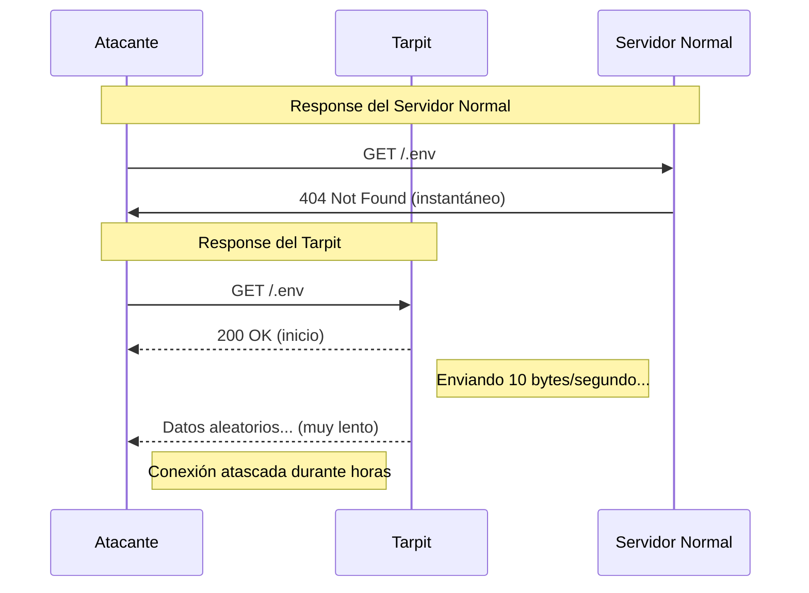

import Callout from "@components/ui/Callout.astro";
import FileContent from "@components/ui/FileContent.astro";
import Mermaid from "@components/ui/Mermaid.astro";
import TerminalCommand from "@components/ui/TerminalCommand.astro";
import TerminalOutput from "@components/ui/TerminalOutput.astro";
import Table from "@components/ui/Table.astro";
import Code from "@components/ui/Code.astro";
import Collapsible from "@components/ui/Collapsible.astro";

Si alguna vez has revisado los logs de tu servidor, seguramente habrás visto innumerables intentos de acceso a archivos como `/.env`, `/wp-login.php`, `/.git/config` o `/admin`. Se trata de escáneres automatizados que sondean tu servidor en busca de vulnerabilidades. Aunque bloquearlos con una response 403 o 404 funciona, hay un enfoque mucho más *satisfactorio*: **atraparlos en un tarpit**.

## ¿Qué es un tarpit?

Un **[tarpit](https://en.wikipedia.org/wiki/Tarpit_(networking))** (también conocido como "tar pit" o "sticky honeypot") es un mecanismo de seguridad de red diseñado para **ralentizar a los atacantes** respondiendo deliberadamente a sus request a una velocidad extremadamente lenta. El nombre proviene del fenómeno natural de los pozos de alquitrán — formaciones geológicas donde los animales quedan atrapados en alquitrán viscoso y no pueden escapar.

En ciberseguridad, un tarpit hace lo mismo digitalmente: acepta conexiones entrantes de actores maliciosos pero **gotea datos tan lentamente** que las herramientas del atacante se quedan atascadas, desperdiciando su tiempo y recursos mientras esperan una response que nunca llega a completarse. Para más contexto, consulta [la excelente visión general de Hedgehog Security](https://www.hedgehogsecurity.co.uk/blog/what-are-tarpits).

<Callout type="info" title="La Filosofía">
A diferencia del bloqueo tradicional (que rechaza las request inmediatamente), un tarpit *finge* cooperar. Esto desperdicia los recursos del atacante, le impide pasar rápidamente al siguiente objetivo e incluso puede provocar fallos en herramientas de escaneo mal programadas.
</Callout>

---

## Historia y orígenes

El concepto de tarpit en ciberseguridad surgió a finales de los años 90 y principios de los 2000, durante un período en el que los gusanos de red y las herramientas de escaneo automatizado comenzaron a proliferar. El tarpit más famoso fue **[LaBrea](https://labrea.sourceforge.net/)**, creado por [Tom Liston](https://www.giac.org/paper/gsec/1895/labrea-approach-securing-networks/103112) alrededor de 2001.

LaBrea funcionaba a nivel de red, respondiendo a paquetes TCP SYN dirigidos a direcciones IP sin usar y creando "máquinas virtuales pegajosas" que atrapaban a los escáneres de gusanos. Cuando los gusanos [Code Red](https://en.wikipedia.org/wiki/Code_Red_(computer_worm)) y [Nimda](https://en.wikipedia.org/wiki/Nimda) se estaban propagando rápidamente, LaBrea demostró ser notablemente eficaz para frenar su expansión.

### Evolución de los tarpits

El concepto de tarpit ha evolucionado más allá de las implementaciones a nivel de red:

<Collapsible summary="Implementaciones Destacadas de Tarpits">

**[OpenBSD spamd](https://man.openbsd.org/spamd)** (2003) - El tarpit de correo electrónico que introdujo el greylisting. Cuando un remitente en lista negra se conecta, spamd ralentiza deliberadamente la conversación SMTP, enviando un byte cada vez. Los servidores de correo legítimos reintentan; los spammers desisten. Este enfoque inspiró muchas implementaciones modernas de tarpit.

**[Endlessh](https://github.com/skeeto/endlessh)** (2019) - Creado por [Chris Wellons](https://nullprogram.com/blog/2019/03/22/), este tarpit SSH explota el RFC 4253: antes del intercambio de versión SSH, los servidores pueden enviar "otras líneas de datos". Endlessh envía datos aleatorios continuamente a intervalos de ~10 segundos, atrapando a los escáneres SSH indefinidamente. ¡Algunas conexiones han durado **semanas**!

**HTTP Tarpits (esta guía)** - Tarpits a nivel de aplicación que utilizan funcionalidades del servidor web como `limit_rate` para gotear datos lentamente a request HTTP maliciosas. Perfectos para atrapar escáneres de vulnerabilidades que buscan archivos sensibles.

</Collapsible>

<Mermaid caption="Servidor Normal vs Response del Tarpit" maxWidth="700px">

</Mermaid>

---

## ¿Por qué usar un tarpit en lugar de bloquear?

<Table title="Tarpit vs Otras Estrategias de Defensa">
  <thead>
    <tr>
      <th scope="col">Enfoque</th>
      <th scope="col">Ventajas</th>
      <th scope="col">Desventajas</th>
    </tr>
  </thead>
  <tbody>
    <tr>
      <td><strong>Bloqueo (403/404)</strong></td>
      <td>Inmediato, pocos recursos</td>
      <td>El atacante puede reintentar al instante</td>
    </tr>
    <tr>
      <td><strong>Rate Limiting</strong></td>
      <td>Controla el volumen</td>
      <td>Puede afectar a usuarios legítimos</td>
    </tr>
    <tr>
      <td><strong>Tarpit</strong></td>
      <td data-status="success">Desperdicia recursos del atacante, proporciona inteligencia</td>
      <td data-status="warning">Mantiene conexiones del servidor abiertas</td>
    </tr>
  </tbody>
</Table>

Los tarpits ofrecen varias ventajas frente al bloqueo simple:

1. **Agotamiento de recursos**: Los escáneres automatizados tienen conexiones limitadas. Mantenerlos atascados reduce su capacidad de escaneo.
2. **Recopilación de inteligencia**: Las conexiones registradas en el tarpit revelan patrones de IP de los atacantes y las rutas objetivo.
3. **Impacto psicológico**: Los atacantes que descubren que han caído en un tarpit pueden evitar tu servidor en el futuro.
4. **Fallo de herramientas mal escritas**: Algunas herramientas de escaneo no gestionan bien las respuestas lentas y pueden fallar.

<Callout type="warning" title="Compromisos">
Los tarpits consumen recursos del servidor (conexiones, memoria). En un servidor con mucho tráfico, conviene ser selectivo respecto a qué rutas activan el tarpit. No apliques tarpit a páginas de error legítimas.
</Callout>

---

## Implementación en Nginx

Vamos a implementar una solución tarpit completa y lista para producción en [Nginx](https://nginx.org/). La estrategia consta de tres componentes:

1. **Generar contenido lento**: Crear una carga útil aleatoria grande
2. **Limitar la entrega**: Usar `limit_rate` para controlar el bandwidth
3. **Registrar para análisis**: Usar un formato de log especializado que fuerza el status code a 418 (aunque devolvamos 200) para que parsers como CrowdSec puedan detectarlo fácilmente.

### Paso 1: preparar Nginx (bloque http)

Necesitamos definir nuestros formatos de log y variables map en el `nginx.conf` principal. Esta configuración permite **incluir IPs de confianza en una lista blanca** (como tu IP de casa o VPN) ¡para que no te atrapes a ti mismo!

<FileContent filename="/etc/nginx/nginx.conf" icon="devicon:nginx" ariaLabel="Configuración de Nginx para maps y logging">
```nginx
http {
    # ... existing config ...

    # 1. Map to identify trusted IPs (Localhost, VPN, etc.)
    map $remote_addr $is_trusted_ip {
        127.0.0.1 1;
        ::1       1;
        # Add your static IP here if you have one
        # 1.2.3.4 1;
        default   0;
    }

    # 2. Dynamic Tarpit Rate
    # Trusted IPs get 0 (unlimited), others get 10 bytes/s
    map $is_trusted_ip $tarpit_rate {
        1 0;
        0 10;
    }

    # 2b. Only log tarpitted requests (avoid trusted IPs)
    map $is_trusted_ip $tarpit_loggable {
        1 0;
        0 1;
    }

    # 3. Special Log Format for Tarpit
    # We force the status code to 418 in the log, even though we return 200 to the client.
    # This allows CrowdSec to easily identify tarpit hits without complex parsing.
    log_format tarpit_418_fixed escape=none '$remote_addr - $remote_user [$time_local] "$request" 418 $body_bytes_sent "$http_referer" "$http_user_agent" "$host"';

    # 4. Generate random content (requires nginx-mod-http-perl)
    perl_set $slow_content 'sub {
        my $chars = "abcdefghijklmnopqrstuvwxyzABCDEFGHIJKLMNOPQRSTUVWXYZ0123456789";
        my $result = "";
        for (1..100000) {
            $result .= substr($chars, int(rand(length($chars))), 1);
        }
        return $result;
    }';
}
```
</FileContent>

<Callout type="tip" title="¿Por qué forzar el status code 418 en el log?">
Para mantener al atacante conectado, debemos enviar un status `200 OK`. Sin embargo, para nuestro parser de logs (CrowdSec/Fail2Ban), queremos marcar explícitamente estas request como "tarpiteadas". Al codificar `418` directamente en el `log_format`, obtenemos lo mejor de los dos mundos: el atacante ve una conexión exitosa, pero nuestros logs reciben una señal clara de error/baneo.
</Callout>

### Paso 2: crear el snippet del tarpit

Crea un snippet reutilizable que gestione el throttle y el logging.

<FileContent filename="/etc/nginx/snippets/tarpit.conf" icon="devicon:nginx" ariaLabel="Configuración del snippet del tarpit en Nginx">
```nginx
# Log to dedicated tarpit log only for tarpitted requests
access_log /var/log/nginx/tarpit_access.log tarpit_418_fixed if=$tarpit_loggable;

# Bypass for Trusted IPs - Return standard 403 instead of Tarpit
# This saves you from waiting 2 hours if you accidentally hit a protected path!
if ($is_trusted_ip) {
    return 403;
}

# Dynamic bandwidth throttling (0 for trusted, 10 for others)
limit_rate $tarpit_rate;

# Start throttling after the first byte
limit_rate_after 1;

# Send the slow response
add_header Content-Type text/plain;
add_header Cache-Control "no-store, no-cache, must-revalidate, max-age=0";
add_header Pragma "no-cache";
return 200 $slow_content;
```
</FileContent>

### Paso 3: definir las rutas sensibles (las "trampas")

En lugar de añadir lógica de logging a cada location (lo cual es un lío), simplemente **devolvemos 418** para cualquier ruta sensible. Gestionaremos este código de error globalmente en el server block.

<FileContent filename="/etc/nginx/snippets/sensitive_files_tarpit.conf" icon="devicon:nginx" collapsible ariaLabel="Configuración del tarpit para archivos sensibles">
```nginx
# =============================================================================
# Sensitive Files Tarpit Protection
# =============================================================================

# Environment and configuration files
location ~ /\.env { return 418; }
location ~ /\.git { return 418; }
location ~ /\.svn { return 418; }
location ~ /\.hg { return 418; }

# Server configuration files
location ~ /\.(htaccess|htpasswd) { return 418; }

# Backup and sensitive file extensions
location ~* \.(bak|backup|old|orig|save|swp|tmp|sql|db|sqlite|sqlite3)$ { return 418; }

# PHP/CMS exploit paths
location ~* (phpinfo|adminer|phpmyadmin|wp-login|xmlrpc|wp-admin|wp-config)\.php$ { return 418; }

# Common scanner/exploit paths
location ~* ^/(config|admin|administrator|login|cgi-bin|scripts|shell|cmd|console) { return 418; }

# Catch-all for dotfiles (excluding .well-known)
location ~ /\.(?!well-known) {
    return 418;
}
```
</FileContent>

### Paso 4: configurar el server block

Ahora unimos todo usando `error_page 418`. Este es el "pegamento mágico" que hace que la arquitectura sea limpia.

<FileContent filename="/etc/nginx/sites-available/example.com.conf" icon="devicon:nginx" ariaLabel="Server block completo con configuración de tarpit">
```nginx
server {
    listen 443 ssl;
    server_name example.com;

    # ... SSL and other configuration ...

    # =========================================================
    # TARPIT HANDLER
    # =========================================================
    
    # 1. Catch 418 errors
    error_page 418 = @tarpit;
    
    # 2. Redirect them to the tarpit snippet
    location @tarpit {
        include /etc/nginx/snippets/tarpit.conf;
    }

    # =========================================================
    # SITE CONFIGURATION
    # =========================================================
    
    # Include the traps
    include /etc/nginx/snippets/sensitive_files_tarpit.conf;
    
    location / {
        try_files $uri $uri/ =404;
    }
}
```
</FileContent>

### Paso 5: probar la configuración

Valida y recarga Nginx:

<TerminalCommand>
```bash
nginx -t && systemctl reload nginx
```
</TerminalCommand>

<TerminalOutput title="Salida esperada">
nginx: the configuration file /etc/nginx/nginx.conf syntax is ok
nginx: configuration file /etc/nginx/nginx.conf test is successful
</TerminalOutput>

Prueba el tarpit con un timeout para no quedarte esperando eternamente:

<TerminalCommand>
```bash
curl -v --max-time 5 'https://example.com/.env'
```
</TerminalCommand>

<TerminalOutput title="Response del tarpit (truncada)">
*   Trying [::1]:443...
* Connected to example.com (::1) port 443
* TLS 1.3 connection using TLS_AES_256_GCM_SHA384
> GET /.env HTTP/2
< HTTP/2 200
< content-type: text/plain
< cache-control: no-store, no-cache, must-revalidate, max-age=0
* Operation timed out after 5000 milliseconds with 50 bytes received
curl: (28) Operation timed out
</TerminalOutput>

La conexión se estableció, se recibieron 50 bytes (5 segundos × 10 bytes/segundo), y luego nuestro timeout entró en acción. ¡En la realidad, el escáner de un atacante esperaría mucho más!

---

## Integración con CrowdSec

Mientras el tarpit malgasta el tiempo del atacante, podemos ir más allá **baneando automáticamente** a los reincidentes. [CrowdSec](https://www.crowdsec.net/) puede analizar el log del tarpit y crear reglas de firewall.

### Crear un parser de CrowdSec

CrowdSec puede leer el archivo `/var/log/nginx/access.tarpit` para identificar IPs maliciosas:

<FileContent filename="/etc/crowdsec/parsers/s02-enrich/nginx_tarpit.yaml" icon="mdi:file-cog" ariaLabel="Parser de CrowdSec para logs del tarpit">
```yaml
name: crowdsec/nginx-tarpit
description: "Parse Nginx tarpit access logs"
filter: "evt.Parsed.program == 'nginx-tarpit'"
onsuccess: next_stage
statics:
  - meta: service
    value: http
  - meta: log_type
    value: tarpit
  - meta: source_ip
    expression: "evt.Parsed.remote_addr"
  - meta: http_path
    expression: "evt.Parsed.request"
nodes:
  - grok:
      pattern: '%{IPORHOST:remote_addr} - %{DATA:user} \[%{HTTPDATE:time}\] "%{WORD:method} %{DATA:request} HTTP/%{NUMBER:http_version}" %{NUMBER:status} %{NUMBER:bytes}'
      apply_on: message
```
</FileContent>

<Callout type="tip" title="Configuración de Adquisición">
Asegúrate de que la configuración de adquisición de CrowdSec (`/etc/crowdsec/acquis.yaml`) establezca la etiqueta del programa:

```yaml
filenames:
  - /var/log/nginx/access.tarpit
labels:
  program: nginx-tarpit
```
</Callout>

### Crear un escenario

Define cuándo banear una IP (por ejemplo, tras 3 impactos en el tarpit en 5 minutos):

<FileContent filename="/etc/crowdsec/scenarios/nginx_tarpit_scan.yaml" icon="mdi:file-cog" ariaLabel="Escenario de CrowdSec para detección de tarpit">
```yaml
type: leaky
name: crowdsec/nginx-tarpit-scan
description: "Detect and ban IPs triggering the Nginx tarpit"
filter: "evt.Meta.service == 'http' && evt.Meta.log_type == 'tarpit'"
leakspeed: 5m
capacity: 3
groupby: "evt.Meta.source_ip"
blackhole: 1h
labels:
  service: http
  type: scan
  remediation: true
```
</FileContent>

<Callout type="tip" title="Alternativa más Sencilla">
Si no quieres crear parsers personalizados, puedes usar [Fail2Ban](https://www.fail2ban.org/) en su lugar. Crea un filtro que coincida con las líneas de `/var/log/nginx/access.tarpit` y configura un jail para banear tras N coincidencias.
</Callout>

---

## Reportar IPs maliciosas: contribuir a la defensa colectiva

Uno de los aspectos más potentes de ejecutar un tarpit es la **inteligencia que recopilas**. Cada conexión atrapada revela la IP del atacante, las rutas objetivo y los patrones de tiempo. Pero estos datos se vuelven exponencialmente más valiosos cuando se **comparten con la comunidad de seguridad**.

### ¿Por qué reportar IPs maliciosas?

<Callout type="info" title="El Poder de la Defensa Colectiva">
Cuando reportas una IP maliciosa, no solo te proteges a ti — estás protegiendo a **todos**. Las plataformas de inteligencia de amenazas agregan informes de miles de colaboradores, creando listas de bloqueo en tiempo real que pueden bloquear preventivamente a los atacantes antes de que lleguen a tu servidor.
</Callout>

Entre los beneficios de reportar se incluyen:

1. **Detección temprana**: Otras organizaciones pueden bloquear amenazas que has identificado antes de ser atacadas
2. **Reconocimiento de patrones**: Los datos agregados revelan ataques coordinados, botnets y campañas de malware
3. **Reducción de la superficie de ataque**: Las IPs reportadas son a menudo bloqueadas por ISPs y herramientas de seguridad a nivel global
4. **Reciprocidad de la comunidad**: Los colaboradores reciben acceso a listas de bloqueo más amplias y completas

### Integración con AbuseIPDB

[AbuseIPDB](https://www.abuseipdb.com/) es una plataforma de inteligencia de amenazas impulsada por la comunidad con más de 100.000 colaboradores. Puedes tanto consultar la reputación de una IP como reportar IPs maliciosas a través de su API.

#### Consultar la reputación de una IP

Antes de bloquear, verifica el nivel de amenaza:

<TerminalCommand>
```bash
curl -G "https://api.abuseipdb.com/api/v2/check" \
  --data-urlencode "ipAddress=185.234.xx.xx" \
  -d maxAgeInDays=90 \
  -H "Key: YOUR_API_KEY" \
  -H "Accept: application/json"
```
</TerminalCommand>

#### Reportar IPs maliciosas desde los logs del tarpit

Crea un script para reportar automáticamente las capturas del tarpit:

<FileContent filename="/usr/local/bin/report_tarpit_ips.sh" icon="mdi:file-code" ariaLabel="Script para reportar IPs del tarpit a AbuseIPDB">
```bash
#!/bin/bash
# Report IPs from tarpit log to AbuseIPDB
# Usage: Run via cron every hour

set -euo pipefail

ABUSEIPDB_KEY="${ABUSEIPDB_KEY:-}"
LOGFILE="/var/log/nginx/access.tarpit"
REPORTED="/var/log/nginx/reported_ips.txt"
REPORT_LOG="/var/log/nginx/abuseipdb_reports.log"

# Validate API key
if [[ -z "$ABUSEIPDB_KEY" ]]; then
  echo "[$(date -Iseconds)] ERROR: ABUSEIPDB_KEY not set" >> "$REPORT_LOG"
  exit 1
fi

# Ensure files exist
touch "$REPORTED" "$REPORT_LOG"

# Get unique IPs from last hour
awk -v d1="$(date --date='-1 hour' '+%d/%b/%Y:%H')" \
  '$4 ~ d1 {print $1}' "$LOGFILE" | sort -u | while read -r ip; do
  
  # Skip if already reported today
  grep -q "$ip" "$REPORTED" 2>/dev/null && continue
  
  # Report to AbuseIPDB with error handling
  response=$(curl -s -w "\n%{http_code}" "https://api.abuseipdb.com/api/v2/report" \
    -H "Key: $ABUSEIPDB_KEY" \
    -H "Accept: application/json" \
    --data-urlencode "ip=$ip" \
    --data-urlencode "categories=21,15" \
    --data-urlencode "comment=Vulnerability scanner trapped in HTTP tarpit." \
    2>&1) || true
  
  http_code=$(echo "$response" | tail -n1)
  body=$(echo "$response" | sed '$d')
  
  if [[ "$http_code" == "200" ]]; then
    echo "$ip $(date +%Y-%m-%d)" >> "$REPORTED"
    echo "[$(date -Iseconds)] OK: Reported $ip" >> "$REPORT_LOG"
  else
    echo "[$(date -Iseconds)] FAIL: $ip (HTTP $http_code) $body" >> "$REPORT_LOG"
  fi
done
```
</FileContent>

<Callout type="warning" title="Límites de la API">
Las cuentas gratuitas de AbuseIPDB tienen límites diarios. Para servidores con alto volumen, considera sus planes de pago o agrupa tus reportes. Elimina siempre la información de identificación personal (PII) de los comentarios de los reportes.
</Callout>

### Listas de bloqueo de la comunidad CrowdSec

A diferencia de AbuseIPDB (que es una consulta pasiva), [CrowdSec](https://www.crowdsec.net/) funciona como un **"firewall masivamente multijugador"**. Cuando tu Security Engine detecta una amenaza, comparte la señal con la red, y tú recibes actualizaciones de listas de bloqueo que contienen amenazas detectadas por otros usuarios.

<Table title="Niveles de Listas de Bloqueo de CrowdSec">
  <thead>
    <tr>
      <th scope="col">Nivel</th>
      <th scope="col">Tamaño</th>
      <th scope="col">Requisito</th>
    </tr>
  </thead>
  <tbody>
    <tr>
      <td><strong>Lite</strong></td>
      <td>3.000 IPs</td>
      <td>Cuenta gratuita, sin contribución</td>
    </tr>
    <tr>
      <td><strong>Community</strong></td>
      <td data-status="success">~15.000 IPs</td>
      <td>Contribución regular de señales</td>
    </tr>
    <tr>
      <td><strong>Premium</strong></td>
      <td data-status="success">Ilimitado</td>
      <td>Suscripción de pago</td>
    </tr>
  </tbody>
</Table>

La lista de bloqueo Community se actualiza en tiempo real y está adaptada a tu stack — si ejecutas WordPress, recibirás automáticamente IPs de amenazas específicas de WordPress.

---

## Técnicas avanzadas

### Combinar con rate limiting

Para mayor protección, combina el tarpit con rate limiting para evitar sobrecargar tu servidor:

<Code lang="nginx" aria-label="Combinación de tarpit con rate limiting">
```
# Define rate limit zone
limit_req_zone $binary_remote_addr zone=tarpit_zone:10m rate=1r/s;

location @tarpit {
    limit_req zone=tarpit_zone burst=5 nodelay;
    limit_rate 10;
    # ... rest of tarpit config
}
```
</Code>

### Tarpit para User-Agents específicos

Apunta a escáneres maliciosos conocidos por User-Agent. Los escáneres más comunes incluyen [sqlmap](https://sqlmap.org/) (inyección SQL), [Nikto](https://cirt.net/Nikto2) (escáner de vulnerabilidades web), [Nmap](https://nmap.org/) (escáner de red), [masscan](https://github.com/robertdavidgraham/masscan) (escáner de puertos) y [ZGrab](https://github.com/zmap/zgrab2) (banner grabber):

<Code lang="nginx" aria-label="Tarpit para bots de escaneo basado en User-Agent">
```
map $http_user_agent $is_scanner {
    default                     0;
    "~*sqlmap"                  1;
    "~*nikto"                   1;
    "~*nmap"                    1;
    "~*masscan"                 1;
    "~*zgrab"                   1;
}

server {
    if ($is_scanner) {
        return 418;
    }
    # ... rest of server
}
```
</Code>

---

## Monitorización de tu tarpit

### Analizar los logs del tarpit

Como forzamos el status code a **418** en nuestro formato de log `tarpit_418_fixed`, filtrar los ataques es increíblemente sencillo, incluso si están mezclados con otros logs:

<TerminalCommand>
```bash
grep " 418 " /var/log/nginx/tarpit_access.log | awk '{print $7}' | sort | uniq -c | sort -rn | head -10
```
</TerminalCommand>

<TerminalOutput title="Rutas más escaneadas">
```
  847 /.env
  312 /wp-login.php
  201 /.git/config
  156 /admin/
   98 /phpmyadmin/
   87 /.htaccess
   65 /config.php
   43 /backup.sql
   38 /shell.php
   29 /xmlrpc.php
```
</TerminalOutput>

### IPs más infractoras

Identifica los escáneres más persistentes:

<TerminalCommand>
```bash
awk '{print $1}' /var/log/nginx/tarpit_access.log | sort | uniq -c | sort -rn | head -5
```
</TerminalCommand>

<TerminalOutput title="IPs más infractoras">
```
  423 185.234.xx.xx
  287 45.148.xx.xx
  156 194.169.xx.xx
   98 23.94.xx.xx
   67 89.248.xx.xx
```
</TerminalOutput>

---

## Resultados en el mundo real

Implementar la **arquitectura lista para producción** con logging forzado a 418 ha mejorado significativamente la visibilidad:

- **Señal clara:** El status code 418 actúa como una señal de alta fidelidad para "intención maliciosa confirmada".
- **Cero falsos positivos:** Gracias al map de IPs de confianza, el tráfico de administración nunca se atrapa accidentalmente en el tarpit.
- **Protección de recursos:** El bypass de rate limit garantiza que el tráfico válido fluya sin problemas mientras los atacantes se quedan atascados en el carril lento.
- **Integración con CrowdSec:** La lógica del parser se volvió trivial — simplemente hacer coincidir `status == 418` es suficiente para banear una IP, independientemente de la ruta solicitada.

<Callout type="success" title="El Factor Satisfacción">
Hay cierta satisfacción en saber que mientras duermes, los atacantes están descargando caracteres aleatorios a 10 bytes por segundo. ¡Dulces sueños!
</Callout>

---

## Conclusión

Un tarpit es una adición creativa y eficaz a tu arsenal de seguridad. Aunque no debería sustituir un endurecimiento adecuado y controles de acceso, proporciona:

1. **Desperdicio de recursos** para escáneres automatizados
2. **Recopilación de inteligencia** sobre patrones de ataque
3. **Baneo automático** cuando se combina con CrowdSec o Fail2Ban
4. **Un elemento disuasorio psicológico** para los atacantes

La implementación en Nginx es directa usando solo unas pocas directivas (`limit_rate`, `error_page` y bloques location). Combinado con logging y una herramienta de seguridad como CrowdSec, se crea una defensa por capas que no solo bloquea a los atacantes, sino que les hace *pagar* por sus intentos de intrusión.
