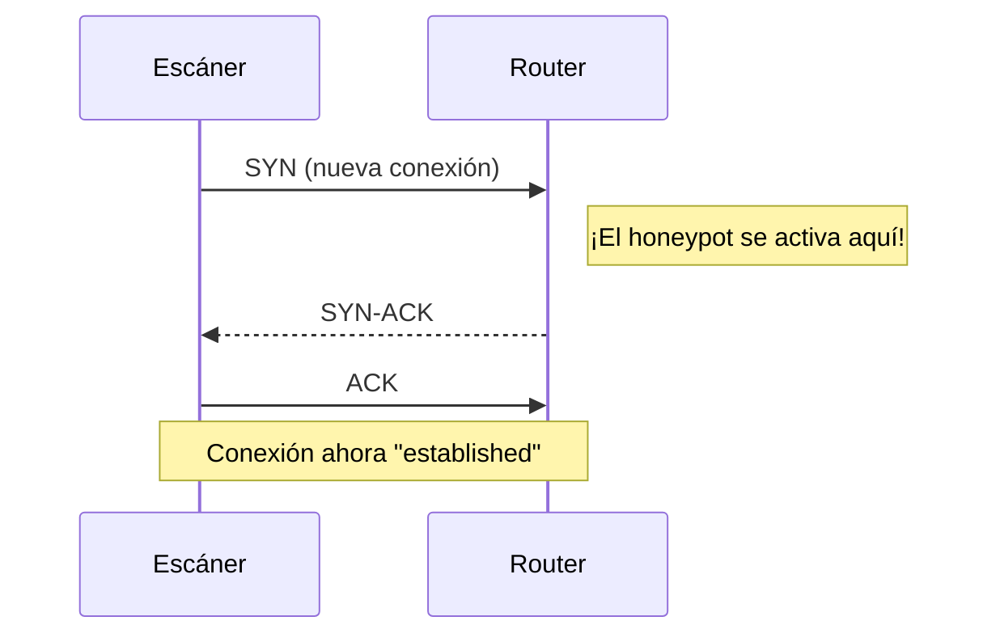
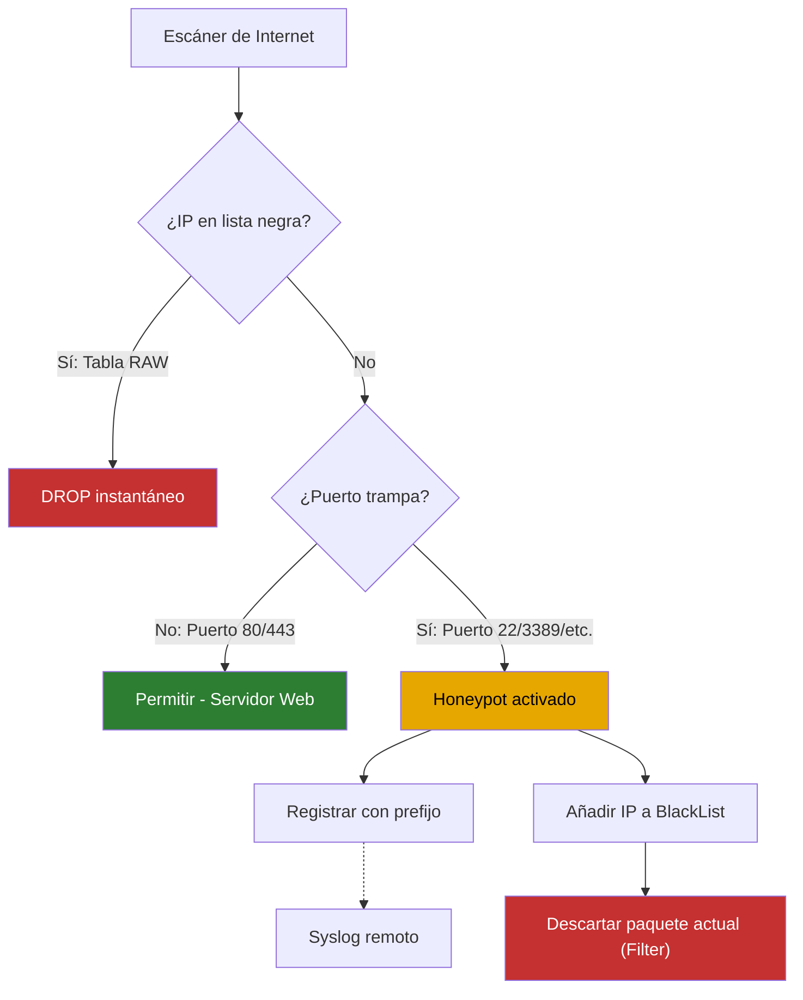

import Callout from "@components/ui/Callout.astro";
import FileContent from "@components/ui/FileContent.astro";
import Mermaid from "@components/ui/Mermaid.astro";
import TerminalCommand from "@components/ui/TerminalCommand.astro";
import TerminalOutput from "@components/ui/TerminalOutput.astro";
import Table from "@components/ui/Table.astro";
import Code from "@components/ui/Code.astro";
import BarChart from "@components/ui/BarChart.astro";
import TLDRSummary from "@components/ui/TLDRSummary.astro";

Cualquier router conectado a internet sufre un bombardeo constante de escaneos automatizados. Los bots sondean sistemáticamente todo el espacio de direcciones IPv4 —y cada vez más IPv6— en busca de servicios vulnerables: servidores SSH con contraseñas débiles, bases de datos expuestas, endpoints RDP desactualizados o dispositivos IoT mal configurados.

La mayoría de administradores responden [descartando silenciosamente estos paquetes](/es/blog/005-implementing-tarpit-nginx/). Pero, ¿y si pudieras convertir estos ataques en inteligencia accionable? Configurando tu router **MikroTik** como un **honeypot** ligero, puedes:

1. **Detectar** reconocimientos no autorizados antes de que se conviertan en una brecha.
2. **Registrar** las IPs de los atacantes para análisis y compartición de threat intelligence.
3. **Bloquear** a los actores maliciosos para que no accedan a *ningún* servicio de tu red.

Esta guía te lleva paso a paso por la implementación de un honeypot listo para producción en RouterOS, con soporte completo para IPv4 e IPv6.

<TLDRSummary title="TL;DR — el honeypot de MikroTik en pocas palabras">
- **Atrapa y bloquea automáticamente**: las reglas de detección en la tabla Filter coinciden con `connection-state=new` en puertos trampa y ejecutan `add-src-to-address-list` para incluir a los escáneres en la lista negra de forma automática.
- **Bloqueo de alto rendimiento**: una regla drop en prerouting de la tabla RAW descarta el tráfico de la lista negra antes del connection tracking, ahorrando CPU y memoria en routers que reciben miles de ataques.
- **No te bloquees a ti mismo**: crea primero una `WhiteList`; las reglas usan `src-address-list=!WhiteList` y los baneos usan `address-list-timeout=4h` para evitar bloqueos permanentes de IPs dinámicas.
- **Dual-stack**: un conjunto de reglas IPv6 idéntico usa una lista `BlackList_PortScanners_v6` separada para cobertura completa de IPv4 e IPv6.
- **Threat intelligence**: reenvía los logs del firewall con prefijo `[HONEYPOT]` a un servidor syslog remoto e intégralos con CrowdSec para recopilar las IPs de los atacantes.
</TLDRSummary>

---

## ¿Qué es un honeypot?

Un **honeypot** es un mecanismo de seguridad que crea un sistema señuelo diseñado para atraer y detectar atacantes. Según [Fortinet](https://www.fortinet.com/resources/cyberglossary/what-is-honeypot), los honeypots son sistemas intencionalmente vulnerables que alejan a los adversarios de los objetivos legítimos mientras recopilan inteligencia sobre sus métodos. [NIST SP 800-53](https://csf.tools/reference/nist-sp-800-53/r5/sc/sc-26/) incluye los honeypots como un control de seguridad formal (SC-26) para detectar y analizar este tipo de ataques.

Existen dos tipos principales de honeypots:

<Table title="Tipos de honeypots">
  <thead>
    <tr>
      <th scope="col">Tipo</th>
      <th scope="col">Complejidad</th>
      <th scope="col">Caso de uso</th>
    </tr>
  </thead>
  <tbody>
    <tr>
      <td>**Baja interacción**</td>
      <td>Simple, recursos mínimos</td>
      <td>Detecta escaneos automatizados y sondeos básicos. Simula servicios limitados.</td>
    </tr>
    <tr>
      <td>**Alta interacción**</td>
      <td>Complejo, SO/aplicaciones completos</td>
      <td>Involucra a atacantes sofisticados para estudiar [TTPs](https://attack.mitre.org/) avanzados (Tácticas, Técnicas y Procedimientos).</td>
    </tr>
  </tbody>
</Table>

<Callout type="info" title="Lo que vamos a construir">
En esta guía implementamos un **honeypot de baja interacción** directamente en el firewall de MikroTik. No ejecutamos servicios falsos; en su lugar, monitorizamos intentos de conexión a puertos que *nunca deberían recibir tráfico legítimo* desde internet. Cualquier conexión a estos "puertos trampa" identifica inmediatamente al origen como un escáner.
</Callout>

Este enfoque es ligero, no requiere hardware adicional y proporciona protección inmediata a la vez que genera logs valiosos.

---

## Entendiendo los estados de conexión TCP

Antes de configurar nuestro honeypot, es esencial comprender cómo los firewalls con estado como MikroTik clasifican el tráfico de red. A cada paquete se le asigna un **estado de conexión**:

<Table title="Estados de conexión en RouterOS">
  <thead>
    <tr>
      <th scope="col">Estado</th>
      <th scope="col">Significado</th>
      <th scope="col">Ejemplo</th>
    </tr>
  </thead>
  <tbody>
    <tr>
      <td>`new`</td>
      <td>Primer paquete de un intento de conexión (TCP SYN o primer paquete UDP)</td>
      <td>Escáner sondeando el puerto 22</td>
    </tr>
    <tr>
      <td>`established`</td>
      <td>Parte de una conexión ya aceptada (tráfico bidireccional detectado)</td>
      <td>Sesión SSH en curso</td>
    </tr>
    <tr>
      <td>`related`</td>
      <td>Nueva conexión relacionada con una existente</td>
      <td>Canal de datos FTP, mensajes de error ICMP</td>
    </tr>
    <tr>
      <td>`invalid`</td>
      <td>Paquete que no pertenece a ninguna conexión conocida</td>
      <td>Paquetes malformados, escaneos de puertos con flags inusuales</td>
    </tr>
  </tbody>
</Table>

### Por qué solo monitorizamos conexiones "new"

Nuestras reglas de honeypot apuntan específicamente a `connection-state=new`. A continuación se explica por qué esto es crítico:

<Mermaid caption="Handshake TCP de tres vías" maxWidth="500px" ariaLabel="Diagrama de secuencia mostrando un handshake TCP de tres vías: el escáner envía SYN (nueva conexión), el router responde SYN-ACK, el escáner envía ACK para establecer la conexión. El honeypot se activa en el paquete SYN inicial.">

</Mermaid>

1. **El reconocimiento ocurre en `new`**: Los atacantes envían paquetes SYN para sondear qué puertos están abiertos. Este es el primer paquete, el estado `new`.

2. **El tráfico established es legítimo**: Una vez que una conexión completa el handshake y pasa a `established`, ya fue aprobada por tus reglas de firewall. Atrapar paquetes established crearía falsos positivos.

3. **Eficiencia**: Al examinar solo el primer paquete de cada conexión, minimizamos la carga de CPU. El router no necesita inspeccionar cada paquete, solo el sondeo inicial.

<Callout type="warning" title="Nunca atrapes tráfico established">
Si tus reglas de honeypot coincidieran con conexiones `established`, bloquearías tráfico de retorno legítimo de servicios que realmente usas. Usa siempre `connection-state=new`.
</Callout>

---

## La estrategia: detectar, registrar y bloquear

Nuestra estrategia de honeypot tiene tres fases:

<Mermaid caption="Flujo de detección del honeypot" maxWidth="550px" ariaLabel="Diagrama de flujo mostrando el flujo de detección del honeypot: el tráfico del escáner entrante se comprueba primero contra la lista negra (DROP en tabla RAW), luego se verifica contra los puertos trampa. El tráfico legítimo en los puertos 80/443 se permite, mientras que los puertos trampa activan el registro, syslog y la adición a la lista negra.">

</Mermaid>

### ¿Por qué usar la tabla RAW para el bloqueo?

Realizamos la **detección** en la **tabla Filter** (cadena Input), pero aplicamos el **bloqueo** en la **tabla Raw** (cadena Prerouting).

<Callout type="tip" title="Ventaja de rendimiento">
La **[tabla Raw](https://help.mikrotik.com/docs/display/ROS/Firewall)** procesa los paquetes *antes* del [Connection Tracking](https://help.mikrotik.com/docs/display/ROS/Connection+tracking). Al bloquear a los atacantes aquí, el router no asigna memoria ni ciclos de CPU para rastrear sus conexiones. En routers que gestionan miles de ataques diarios, esto puede reducir significativamente el uso de recursos.
</Callout>

---

## Referencia de puertos trampa

Las siguientes tablas listan puertos comúnmente atacados, basándose en el [registro de nombres de servicio y números de puerto de IANA](https://www.iana.org/assignments/service-names-port-numbers/service-names-port-numbers.xhtml). Son candidatos ideales para trampas de honeypot porque los usuarios legítimos de internet *nunca* deberían necesitar acceder a ellos en tu router.

<Callout type="important" title="Personaliza según tu entorno">
Antes de implementar, revisa qué servicios expones realmente. Si ejecutas un servidor SSH público en el puerto 22, ¡no pongas trampa en ese puerto! Los ejemplos a continuación asumen que solo ejecutas servidores web en los puertos 80/443.
</Callout>

### Puertos trampa TCP

<Table title="Puertos TCP para detección del honeypot">
  <thead>
    <tr>
      <th scope="col">Puerto(s)</th>
      <th scope="col">Servicio</th>
      <th scope="col">Categoría</th>
      <th scope="col">Por qué los atacantes lo apuntan</th>
    </tr>
  </thead>
  <tbody>
    <tr><td>22</td><td>SSH</td><td>Acceso remoto</td><td>Brute force de credenciales, claves SSH filtradas</td></tr>
    <tr><td>23</td><td>Telnet</td><td>Acceso remoto</td><td>Sin cifrar, a menudo credenciales por defecto</td></tr>
    <tr><td>20, 21</td><td>FTP</td><td>Legado</td><td>Transferencia sin cifrar, abuso de login anónimo</td></tr>
    <tr><td>25</td><td>SMTP</td><td>Correo</td><td>Open relay para spam, campañas de phishing</td></tr>
    <tr><td>79</td><td>Finger</td><td>Legado</td><td>Enumeración de usuarios en sistemas Unix</td></tr>
    <tr><td>110</td><td>POP3</td><td>Correo</td><td>Robo de credenciales, acceso a correo sin cifrar</td></tr>
    <tr><td>135</td><td>MS-RPC</td><td>Windows</td><td>Exploits de ejecución remota de código</td></tr>
    <tr><td>137-139</td><td>NetBIOS</td><td>Windows</td><td>Ataques de relay SMB, enumeración de red</td></tr>
    <tr><td>143</td><td>IMAP</td><td>Correo</td><td>Robo de credenciales, acceso a correo sin cifrar</td></tr>
    <tr><td>389</td><td>LDAP</td><td>Windows</td><td>Enumeración de Active Directory</td></tr>
    <tr><td>445</td><td>SMB</td><td>Windows</td><td>[EternalBlue (CVE-2017-0144)](https://nvd.nist.gov/vuln/detail/CVE-2017-0144), ransomware WannaCry</td></tr>
    <tr><td>502</td><td>Modbus</td><td>Industrial</td><td>Ataques a sistemas ICS/SCADA</td></tr>
    <tr><td>512-514</td><td>R-services</td><td>Legado</td><td>Ejecución remota sin autenticación</td></tr>
    <tr><td>593</td><td>RPC/HTTP</td><td>Windows</td><td>Exploits de Exchange Server</td></tr>
    <tr><td>636</td><td>LDAPS</td><td>Windows</td><td>Enumeración de Active Directory</td></tr>
    <tr><td>1433</td><td>MSSQL</td><td>Base de datos</td><td>SQL injection, distribución de malware</td></tr>
    <tr><td>1521</td><td>Oracle DB</td><td>Base de datos</td><td>Escalada de privilegios en bases de datos</td></tr>
    <tr><td>1883, 8883</td><td>MQTT</td><td>IoT</td><td>Interceptación no autorizada de mensajes</td></tr>
    <tr><td>3128</td><td>Squid Proxy</td><td>Proxy</td><td>Abuso de proxy abierto para anonimización</td></tr>
    <tr><td>3306</td><td>MySQL</td><td>Base de datos</td><td>SQL injection, autenticación débil</td></tr>
    <tr><td>3389</td><td>RDP</td><td>Acceso remoto</td><td>[BlueKeep (CVE-2019-0708)](https://www.cisa.gov/news-events/cybersecurity-advisories/aa19-168a), entrega de ransomware</td></tr>
    <tr><td>5432</td><td>PostgreSQL</td><td>Base de datos</td><td>Exploits de base de datos, robo de datos</td></tr>
    <tr><td>5900-5903</td><td>VNC</td><td>Acceso remoto</td><td>Control de pantalla, a menudo sin contraseña o débil</td></tr>
    <tr><td>6000-6009</td><td>X11</td><td>Acceso remoto</td><td>Secuestro de pantalla en Unix</td></tr>
    <tr><td>6379</td><td>Redis</td><td>Base de datos</td><td>Acceso sin autenticación, RCE vía EVAL</td></tr>
    <tr><td>8080, 8443, 8888</td><td>HTTP Alt</td><td>Web/Admin</td><td>Paneles de administración, servidores de desarrollo</td></tr>
    <tr><td>8291</td><td>Winbox</td><td>MikroTik</td><td>Toma de control del router mediante [CVEs conocidos](https://mikrotik.com/supportsec)</td></tr>
    <tr><td>10000</td><td>Webmin</td><td>Admin</td><td>RCE en interfaz de gestión web</td></tr>
    <tr><td>27017-27018</td><td>MongoDB</td><td>Base de datos</td><td>Acceso sin autenticación, ransomware</td></tr>
    <tr><td>47808</td><td>BACnet</td><td>Industrial</td><td>Ataques a sistemas de automatización de edificios</td></tr>
  </tbody>
</Table>

### Puertos trampa UDP

Los puertos UDP son especialmente valiosos para honeypots porque muchos se explotan en **[ataques de amplificación](https://www.cloudflare.com/learning/ddos/drdos-ddos-attack/)**, donde los atacantes usan tu servidor para multiplicar el tráfico de ataque contra terceros.

<Table title="Puertos UDP para detección del honeypot">
  <thead>
    <tr>
      <th scope="col">Puerto</th>
      <th scope="col">Servicio</th>
      <th scope="col">Categoría</th>
      <th scope="col">Por qué los atacantes lo apuntan</th>
    </tr>
  </thead>
  <tbody>
    <tr><td>53</td><td>DNS</td><td>Amplificación</td><td>Amplificación 100x+ para ataques DDoS</td></tr>
    <tr><td>69</td><td>TFTP</td><td>Legado</td><td>Robo de archivos de configuración (sin autenticación)</td></tr>
    <tr><td>123</td><td>NTP</td><td>Amplificación</td><td>[Amplificación 500x+](https://www.cisa.gov/news-events/alerts/2014/01/13/ntp-amplification-attacks-using-cve-2013-5211) mediante el comando monlist</td></tr>
    <tr><td>137-139</td><td>NetBIOS</td><td>Windows</td><td>Enumeración de recursos compartidos de red</td></tr>
    <tr><td>161</td><td>SNMP</td><td>Amplificación</td><td>Amplificación 650x, fuga de información del dispositivo</td></tr>
    <tr><td>520</td><td>RIP</td><td>Enrutamiento</td><td>Ataques de inyección de rutas</td></tr>
    <tr><td>1900</td><td>SSDP</td><td>Amplificación</td><td>Amplificación 30x mediante descubrimiento UPnP</td></tr>
    <tr><td>5060</td><td>SIP</td><td>VoIP</td><td>Fraude telefónico, interceptación de llamadas</td></tr>
    <tr><td>5683</td><td>CoAP</td><td>IoT</td><td>Explotación de dispositivos IoT</td></tr>
    <tr><td>11211</td><td>Memcached</td><td>Amplificación</td><td>**¡Amplificación 52.000x!** [Vector de DDoS récord](https://github.blog/2018-03-01-ddos-incident-report/)</td></tr>
    <tr><td>47808</td><td>BACnet</td><td>Industrial</td><td>Sistemas de automatización de edificios</td></tr>
  </tbody>
</Table>

---

## Paso 1: crear la lista blanca

Antes de desplegar cualquier regla de bloqueo, **debes** crear una allowlist. Esto evita bloquearte accidentalmente a ti mismo, a tu VPN, sistemas de monitorización o servicios legítimos que necesitan acceder a puertos específicos.

### Cuándo usar una allowlist

Considera añadir IPs a tu allowlist para:

- **Tus propias IPs públicas** — Casa, oficina o hotspots móviles que usas para gestión
- **Endpoints VPN** — Si te conectas mediante una VPN con IP estática
- **Servicios de monitorización** — Monitores de uptime, escáneres de vulnerabilidades que controlas
- **Socios de confianza** — Auditores de seguridad, proveedores de servicios gestionados
- **Escáneres conocidos que hayas aprobado** — Investigadores de seguridad que hayas incluido en la allowlist

<Callout type="warning" title="Prueba antes de bloquear">
Añade tu IP actual a la allowlist *antes* de activar cualquier regla de honeypot. Si te bloqueas a ti mismo, necesitarás acceso físico al router para recuperarte.
</Callout>

### Allowlist IPv4

<Code lang="routeros" title="Creación de la allowlist IPv4">
```routeros
# Create the whitelist for IPv4
/ip firewall address-list

# Your local networks (never block these)
add list=WhiteList address=192.168.0.0/24 comment="LAN - Main Network"
add list=WhiteList address=192.168.99.0/24 comment="LAN - IoT Network"
add list=WhiteList address=192.168.100.0/24 comment="VPN - WireGuard Devices"

# Your static public IPs (management access)
add list=WhiteList address=203.0.113.50 comment="Office Static IP"
add list=WhiteList address=198.51.100.25 comment="Home Static IP"

# Monitoring and security services
add list=WhiteList address=192.0.2.10 comment="Uptime Monitor - Pingdom"
add list=WhiteList address=192.0.2.20 comment="Vulnerability Scanner"
```
</Code>

### Allowlist IPv6

<Code lang="routeros" title="Creación de la allowlist IPv6">
```routeros
# Create the whitelist for IPv6
/ipv6 firewall address-list

# Your local IPv6 networks
add list=WhiteList address=fd00::/8 comment="ULA - Private IPv6 Range"
add list=WhiteList address=2001:db8:1::/48 comment="Your Assigned IPv6 Prefix"

# Link-local addresses (never block)
add list=WhiteList address=fe80::/10 comment="Link-Local Addresses"

# Trusted external IPv6 addresses
add list=WhiteList address=2001:db8:2::100 comment="Office IPv6 Address"
```
</Code>

---

## Paso 2: configuración del honeypot IPv4

Esta configuración incluye todas las reglas de detección del honeypot para IPv4, organizadas por categoría de servicio. Al final de la sección Filter, añadimos una **regla DROP** para bloquear inmediatamente cualquier origen que haya sido añadido a la lista negra antes de que pueda intentar otros ataques en la misma sesión.

<Callout type="warning" title="Personaliza según tu configuración">
Las reglas a continuación usan `in-interface-list=WAN` para identificar tráfico externo. Si tu router usa un nombre de lista de interfaces diferente (p.ej., `internet`, `external`, o una interfaz específica como `ether1`), actualiza este valor. Comprueba tu configuración con `/interface list print`.
</Callout>

<FileContent 
  filename="honeypot-ipv4.rsc" 
  language="routeros" 
  collapsible={true}
  title="Configuración completa del honeypot IPv4"
>
```routeros
# ═══════════════════════════════════════════════════════════════════════════════
# IPv4 HONEYPOT CONFIGURATION
# ═══════════════════════════════════════════════════════════════════════════════
# This configuration detects port scanners and blocks them automatically.
# Customize the ports based on your environment - don't trap ports you use!
# ═══════════════════════════════════════════════════════════════════════════════

# ───────────────────────────────────────────────────────────────────────────────
# FILTER TABLE - Detection Rules (Input Chain)
# ───────────────────────────────────────────────────────────────────────────────

# --- TCP: Remote Access Services ---
/ip firewall filter add chain=input action=add-src-to-address-list \
    address-list=BlackList_PortScanners address-list-timeout=4h \
    connection-state=new protocol=tcp \
    dst-port=22,23,3389,5900-5903,8291,6000-6009 \
    in-interface-list=WAN src-address-list=!WhiteList \
    log=yes log-prefix="[HONEYPOT TCP] " \
    comment="HONEYPOT: Remote Access (SSH, Telnet, RDP, VNC, Winbox, X11)"

# --- TCP: Database Services ---
/ip firewall filter add chain=input action=add-src-to-address-list \
    address-list=BlackList_PortScanners address-list-timeout=4h \
    connection-state=new protocol=tcp \
    dst-port=1433,1521,3306,5432,6379,27017,27018 \
    in-interface-list=WAN src-address-list=!WhiteList \
    log=yes log-prefix="[HONEYPOT TCP] " \
    comment="HONEYPOT: Databases (MSSQL, Oracle, MySQL, PostgreSQL, Redis, MongoDB)"

# --- TCP: Windows/Enterprise Services ---
/ip firewall filter add chain=input action=add-src-to-address-list \
    address-list=BlackList_PortScanners address-list-timeout=4h \
    connection-state=new protocol=tcp \
    dst-port=135,137-139,445,389,636,593 \
    in-interface-list=WAN src-address-list=!WhiteList \
    log=yes log-prefix="[HONEYPOT TCP] " \
    comment="HONEYPOT: Windows Services (SMB, NetBIOS, LDAP, RPC)"

# --- TCP: Legacy Protocols ---
/ip firewall filter add chain=input action=add-src-to-address-list \
    address-list=BlackList_PortScanners address-list-timeout=4h \
    connection-state=new protocol=tcp \
    dst-port=20,21,69,512-514,79 \
    in-interface-list=WAN src-address-list=!WhiteList \
    log=yes log-prefix="[HONEYPOT TCP] " \
    comment="HONEYPOT: Legacy Services (FTP, TFTP, R-services, Finger)"

# --- TCP: Insecure Mail Protocols ---
/ip firewall filter add chain=input action=add-src-to-address-list \
    address-list=BlackList_PortScanners address-list-timeout=4h \
    connection-state=new protocol=tcp \
    dst-port=25,110,143 \
    in-interface-list=WAN src-address-list=!WhiteList \
    log=yes log-prefix="[HONEYPOT TCP] " \
    comment="HONEYPOT: Insecure Mail (SMTP, POP3, IMAP)"

# --- TCP: Web Admin Panels & Proxies ---
/ip firewall filter add chain=input action=add-src-to-address-list \
    address-list=BlackList_PortScanners address-list-timeout=4h \
    connection-state=new protocol=tcp \
    dst-port=8080,8443,8888,3128,10000 \
    in-interface-list=WAN src-address-list=!WhiteList \
    log=yes log-prefix="[HONEYPOT TCP] " \
    comment="HONEYPOT: Web Admin/Proxy (Alt-HTTP, Squid, Webmin)"

# --- TCP: IoT & Industrial Protocols ---
/ip firewall filter add chain=input action=add-src-to-address-list \
    address-list=BlackList_PortScanners address-list-timeout=4h \
    connection-state=new protocol=tcp \
    dst-port=1883,8883,502,47808 \
    in-interface-list=WAN src-address-list=!WhiteList \
    log=yes log-prefix="[HONEYPOT TCP] " \
    comment="HONEYPOT: IoT/Industrial (MQTT, Modbus, BACnet)"

# --- UDP: Amplification Attack Vectors ---
/ip firewall filter add chain=input action=add-src-to-address-list \
    address-list=BlackList_PortScanners address-list-timeout=4h \
    connection-state=new protocol=udp \
    dst-port=53,123,161,1900,11211 \
    in-interface-list=WAN src-address-list=!WhiteList \
    log=yes log-prefix="[HONEYPOT UDP] " \
    comment="HONEYPOT: UDP Amplification (DNS, NTP, SNMP, SSDP, Memcached)"

# --- UDP: Legacy Protocols ---
/ip firewall filter add chain=input action=add-src-to-address-list \
    address-list=BlackList_PortScanners address-list-timeout=4h \
    connection-state=new protocol=udp \
    dst-port=69,137-139,520 \
    in-interface-list=WAN src-address-list=!WhiteList \
    log=yes log-prefix="[HONEYPOT UDP] " \
    comment="HONEYPOT: UDP Legacy (TFTP, NetBIOS, RIP)"

# --- UDP: IoT & VoIP ---
/ip firewall filter add chain=input action=add-src-to-address-list \
    address-list=BlackList_PortScanners address-list-timeout=4h \
    connection-state=new protocol=udp \
    dst-port=5683,47808,5060 \
    in-interface-list=WAN src-address-list=!WhiteList \
    log=yes log-prefix="[HONEYPOT UDP] " \
    comment="HONEYPOT: UDP IoT/VoIP (CoAP, BACnet, SIP)"

# --- DROP already-blacklisted scanners (prevents further probing) ---
/ip firewall filter add chain=input action=drop \
    in-interface-list=WAN src-address-list=BlackList_PortScanners \
    comment="DROP: Blacklisted Port Scanners"


# ───────────────────────────────────────────────────────────────────────────────
# RAW TABLE - High-Performance Blocking (Prerouting Chain)
# ───────────────────────────────────────────────────────────────────────────────
# The RAW table processes packets BEFORE connection tracking.
# Blocking here is more efficient and reduces CPU/memory usage.

/ip firewall raw add chain=prerouting action=drop \
    in-interface-list=WAN src-address-list=BlackList_PortScanners \
    comment="DROP: Blacklisted Port Scanners (RAW - High Performance)"
```
</FileContent>

---

## Paso 3: configuración del honeypot IPv6

El escaneo IPv6 está aumentando rápidamente a medida que más redes adoptan configuraciones dual-stack. La estructura es idéntica a IPv4, usando una lista de direcciones separada para los escáneres IPv6.

<FileContent 
  filename="honeypot-ipv6.rsc" 
  language="routeros" 
  collapsible={true}
  title="Configuración completa del honeypot IPv6"
>
```routeros
# ═══════════════════════════════════════════════════════════════════════════════
# IPv6 HONEYPOT CONFIGURATION
# ═══════════════════════════════════════════════════════════════════════════════
# Mirrors the IPv4 configuration for comprehensive dual-stack protection.
# Uses a separate address list: BlackList_PortScanners_v6
# ═══════════════════════════════════════════════════════════════════════════════

# ───────────────────────────────────────────────────────────────────────────────
# FILTER TABLE - Detection Rules (Input Chain)
# ───────────────────────────────────────────────────────────────────────────────

# --- TCP: Remote Access Services ---
/ipv6 firewall filter add chain=input action=add-src-to-address-list \
    address-list=BlackList_PortScanners_v6 address-list-timeout=4h \
    connection-state=new protocol=tcp \
    dst-port=22,23,3389,5900-5903,8291,6000-6009 \
    in-interface-list=WAN src-address-list=!WhiteList \
    log=yes log-prefix="[HONEYPOT TCP] " \
    comment="HONEYPOT IPv6: Remote Access (SSH, Telnet, RDP, VNC, Winbox, X11)"

# --- TCP: Database Services ---
/ipv6 firewall filter add chain=input action=add-src-to-address-list \
    address-list=BlackList_PortScanners_v6 address-list-timeout=4h \
    connection-state=new protocol=tcp \
    dst-port=1433,1521,3306,5432,6379,27017,27018 \
    in-interface-list=WAN src-address-list=!WhiteList \
    log=yes log-prefix="[HONEYPOT TCP] " \
    comment="HONEYPOT IPv6: Databases (MSSQL, Oracle, MySQL, PostgreSQL, Redis, MongoDB)"

# --- TCP: Windows/Enterprise Services ---
/ipv6 firewall filter add chain=input action=add-src-to-address-list \
    address-list=BlackList_PortScanners_v6 address-list-timeout=4h \
    connection-state=new protocol=tcp \
    dst-port=135,137-139,445,389,636,593 \
    in-interface-list=WAN src-address-list=!WhiteList \
    log=yes log-prefix="[HONEYPOT TCP] " \
    comment="HONEYPOT IPv6: Windows Services (SMB, NetBIOS, LDAP, RPC)"

# --- TCP: Legacy Protocols ---
/ipv6 firewall filter add chain=input action=add-src-to-address-list \
    address-list=BlackList_PortScanners_v6 address-list-timeout=4h \
    connection-state=new protocol=tcp \
    dst-port=20,21,69,512-514,79 \
    in-interface-list=WAN src-address-list=!WhiteList \
    log=yes log-prefix="[HONEYPOT TCP] " \
    comment="HONEYPOT IPv6: Legacy Services (FTP, TFTP, R-services, Finger)"

# --- TCP: Insecure Mail Protocols ---
/ipv6 firewall filter add chain=input action=add-src-to-address-list \
    address-list=BlackList_PortScanners_v6 address-list-timeout=4h \
    connection-state=new protocol=tcp \
    dst-port=25,110,143 \
    in-interface-list=WAN src-address-list=!WhiteList \
    log=yes log-prefix="[HONEYPOT TCP] " \
    comment="HONEYPOT IPv6: Insecure Mail (SMTP, POP3, IMAP)"

# --- TCP: Web Admin Panels & Proxies ---
/ipv6 firewall filter add chain=input action=add-src-to-address-list \
    address-list=BlackList_PortScanners_v6 address-list-timeout=4h \
    connection-state=new protocol=tcp \
    dst-port=8080,8443,8888,3128,10000 \
    in-interface-list=WAN src-address-list=!WhiteList \
    log=yes log-prefix="[HONEYPOT TCP] " \
    comment="HONEYPOT IPv6: Web Admin/Proxy (Alt-HTTP, Squid, Webmin)"

# --- TCP: IoT & Industrial Protocols ---
/ipv6 firewall filter add chain=input action=add-src-to-address-list \
    address-list=BlackList_PortScanners_v6 address-list-timeout=4h \
    connection-state=new protocol=tcp \
    dst-port=1883,8883,502,47808 \
    in-interface-list=WAN src-address-list=!WhiteList \
    log=yes log-prefix="[HONEYPOT TCP] " \
    comment="HONEYPOT IPv6: IoT/Industrial (MQTT, Modbus, BACnet)"

# --- UDP: Amplification Attack Vectors ---
/ipv6 firewall filter add chain=input action=add-src-to-address-list \
    address-list=BlackList_PortScanners_v6 address-list-timeout=4h \
    connection-state=new protocol=udp \
    dst-port=53,123,161,1900,11211 \
    in-interface-list=WAN src-address-list=!WhiteList \
    log=yes log-prefix="[HONEYPOT UDP] " \
    comment="HONEYPOT IPv6: UDP Amplification (DNS, NTP, SNMP, SSDP, Memcached)"

# --- UDP: Legacy Protocols ---
/ipv6 firewall filter add chain=input action=add-src-to-address-list \
    address-list=BlackList_PortScanners_v6 address-list-timeout=4h \
    connection-state=new protocol=udp \
    dst-port=69,137-139,520 \
    in-interface-list=WAN src-address-list=!WhiteList \
    log=yes log-prefix="[HONEYPOT UDP] " \
    comment="HONEYPOT IPv6: UDP Legacy (TFTP, NetBIOS, RIP)"

# --- UDP: IoT & VoIP ---
/ipv6 firewall filter add chain=input action=add-src-to-address-list \
    address-list=BlackList_PortScanners_v6 address-list-timeout=4h \
    connection-state=new protocol=udp \
    dst-port=5683,47808,5060 \
    in-interface-list=WAN src-address-list=!WhiteList \
    log=yes log-prefix="[HONEYPOT UDP] " \
    comment="HONEYPOT IPv6: UDP IoT/VoIP (CoAP, BACnet, SIP)"

# --- DROP already-blacklisted scanners ---
/ipv6 firewall filter add chain=input action=drop \
    in-interface-list=WAN src-address-list=BlackList_PortScanners_v6 \
    comment="DROP: Blacklisted IPv6 Port Scanners"


# ───────────────────────────────────────────────────────────────────────────────
# RAW TABLE - High-Performance Blocking (Prerouting Chain)
# ───────────────────────────────────────────────────────────────────────────────

/ipv6 firewall raw add chain=prerouting action=drop \
    in-interface-list=WAN src-address-list=BlackList_PortScanners_v6 \
    comment="DROP: Blacklisted IPv6 Port Scanners (RAW - High Performance)"
```
</FileContent>

---

## Comprendiendo la configuración

Examinemos los parámetros clave que hacen efectivo este honeypot:

<Table title="Referencia de parámetros de las reglas">
  <thead>
    <tr>
      <th scope="col">Parámetro</th>
      <th scope="col">Valor</th>
      <th scope="col">Propósito</th>
    </tr>
  </thead>
  <tbody>
    <tr>
      <td>`chain=input`</td>
      <td>input</td>
      <td>Apunta al tráfico destinado al propio router, no al tráfico reenviado.</td>
    </tr>
    <tr>
      <td>`connection-state=new`</td>
      <td>new</td>
      <td>Solo se activa con el **primer paquete** de una conexión (SYN). Previene falsos positivos de sesiones establecidas.</td>
    </tr>
    <tr>
      <td>`address-list-timeout=4h`</td>
      <td>4 horas</td>
      <td>Bloqueo temporal. Las IPs dinámicas cambian, así que los bloqueos permanentes arriesgan bloquear a usuarios legítimos después.</td>
    </tr>
    <tr>
      <td>`src-address-list=!WhiteList`</td>
      <td>NOT WhiteList</td>
      <td>El operador `!` excluye las IPs de la allowlist. Crítico para evitar bloquearte a ti mismo.</td>
    </tr>
    <tr>
      <td>`log=yes`</td>
      <td>Activado</td>
      <td>Registra cada detección en el log del sistema. Esencial para análisis y threat intelligence.</td>
    </tr>
    <tr>
      <td>`log-prefix="[HONEYPOT TCP] "`</td>
      <td>Prefijo personalizado</td>
      <td>Etiqueta las entradas de log para filtrado fácil. Útil para reenviar a sistemas externos.</td>
    </tr>
    <tr>
      <td>`in-interface-list=WAN`</td>
      <td>Interfaces WAN</td>
      <td>Solo monitoriza tráfico de redes externas, no dispositivos LAN.</td>
    </tr>
  </tbody>
</Table>

---

## Aprovechando los logs para threat intelligence

El parámetro `log=yes` genera entradas que pueden reenviarse a sistemas de seguridad externos. Configurando MikroTik para enviar logs a un servidor syslog remoto, puedes:

1. **Alimentar [CrowdSec](https://www.crowdsec.net/)** — Contribuir con atacantes detectados a la blocklist comunitaria y recibir protección contra ataques vistos globalmente.
2. **Reportar a [AbuseIPDB](https://www.abuseipdb.com/)** — Compartir threat intelligence y ayudar a otros a bloquear IPs maliciosas conocidas.
3. **Crear dashboards** — Visualizar patrones de ataque, países de origen y puertos objetivo.

<Callout type="warning" title="Personaliza las direcciones IP">
Reemplaza `192.168.0.100` con la dirección IP de tu servidor syslog (la máquina que ejecuta CrowdSec) y `192.168.0.1` con la IP LAN de tu router.
</Callout>

<Code lang="routeros" title="Configuración de syslog remoto">
```routeros
# Configure remote syslog destination
/system logging action set [find name=remote] remote=192.168.0.100 src-address=192.168.0.1

# Send firewall logs (including honeypot) to remote server
/system logging add action=remote topics=firewall prefix="[FIREWALL]"
```
</Code>

### Integración con CrowdSec

A continuación se muestra una configuración funcional para parsear los logs del honeypot MikroTik con [CrowdSec](https://www.crowdsec.net/). Esta configuración captura los prefijos `[HONEYPOT TCP/UDP]` que configuramos anteriormente y extrae las IPs de los atacantes para bloqueo automático.

#### Paso 1: recibir logs mediante rsyslog

En tu servidor Linux que ejecuta CrowdSec, configura rsyslog para recibir syslog UDP desde MikroTik y escribirlo en un archivo dedicado:

<FileContent 
  filename="/etc/rsyslog.d/10-mikrotik.conf" 
  language="bash" 
  title="Configuración de rsyslog para MikroTik"
>
```bash
# Load UDP input module
module(load="imudp")
input(type="imudp" port="514")

# Write all UDP syslog to MikroTik log file
if ($inputname == "imudp") then {
    action(type="omfile" file="/var/log/mikrotik.log")
    stop
}
```
</FileContent>

Tras crear este archivo, reinicia rsyslog:

<TerminalCommand ariaLabel="Comando para reiniciar rsyslog">
```bash
sudo systemctl restart rsyslog
```
</TerminalCommand>

Puedes verificar que los logs están llegando comprobando el archivo:

<TerminalOutput title="tail -f /var/log/mikrotik.log">
```
2026-01-19T10:37:39.291+01:00 mikrotik firewall,info [FIREWALL]: [HONEYPOT TCP] input: in:PPPoE_DIGI out:(unknown 0), connection-state:new proto TCP (SYN), 167.94.138.144:33601->YOUR_WAN_IP:389, len 60
2026-01-19T10:38:50.781+01:00 mikrotik firewall,info [FIREWALL]: [HONEYPOT TCP] input: in:PPPoE_DIGI out:(unknown 0), connection-state:new proto TCP (SYN), 109.227.42.233:48036->YOUR_WAN_IP:23, len 60
2026-01-19T10:44:01.360+01:00 mikrotik firewall,info [FIREWALL]: [HONEYPOT TCP] input: in:PPPoE_DIGI out:(unknown 0), connection-state:new proto TCP (SYN), 102.156.174.56:61901->YOUR_WAN_IP:445, len 52
```
</TerminalOutput>

#### Paso 2: configurar la adquisición en CrowdSec

Indica a CrowdSec que lea el archivo de log de MikroTik. Crea un archivo de adquisición:

<FileContent 
  filename="/etc/crowdsec/acquis.d/mikrotik.yaml" 
  language="yaml" 
  title="Adquisición de MikroTik en CrowdSec"
>
```yaml
filenames:
  - /var/log/mikrotik.log
labels:
  type: mikrotik-logs
source: file
```
</FileContent>

#### Paso 3: instalar el parser de MikroTik

Instala el parser comunitario de MikroTik desde CrowdSec Hub:

<TerminalCommand ariaLabel="Comando para instalar el parser de MikroTik">
```bash
sudo cscli parsers install a1ad/mikrotik-logs
```
</TerminalCommand>

#### Paso 4: parser personalizado para logs del honeypot (opcional)

Para un parseo avanzado que capture específicamente nuestros prefijos `[HONEYPOT TCP/UDP]`, crea un parser personalizado:

<FileContent 
  filename="/etc/crowdsec/parsers/s01-parse/mikrotik-honeypot.yaml" 
  language="yaml" 
  title="Parser personalizado del honeypot"
  collapsible={true}
>
```yaml
onsuccess: next_stage
name: local/mikrotik-honeypot
description: "Parser for MikroTik honeypot firewall logs"
filter: "evt.Line.Raw contains '[HONEYPOT'"

pattern_syntax:
  # Pattern for honeypot detections with [HONEYPOT TCP] or [HONEYPOT UDP] prefix
  MIKROTIK_HONEYPOT: '^%{TIMESTAMP_ISO8601:timestamp} %{HOSTNAME} firewall,.*? \[HONEYPOT %{WORD:hp_proto}\]\s+%{WORD:chain}: in:%{DATA:if_in} out:%{DATA:if_out},.*?proto %{WORD:proto}.*?, %{IP:source_ip}:%{INT:src_port}->%{IP:dst_ip}:%{INT:dst_port}.*len %{INT:length}'

nodes:
  - grok:
      pattern: "%{MIKROTIK_HONEYPOT}"
      apply_on: Line.Raw
    statics:
      - meta: service
        value: mikrotik_honeypot
      - meta: log_type
        value: honeypot_detection
      - meta: dst_port
        expression: "evt.Parsed.dst_port"
      - meta: proto
        expression: "evt.Parsed.proto"

statics:
  - meta: source_ip
    expression: "evt.Parsed.source_ip"
  - target: evt.StrTime
    expression: "evt.Parsed.timestamp"
```
</FileContent>

#### Paso 5: recargar CrowdSec

Tras añadir el parser y la configuración de adquisición, recarga CrowdSec:

<TerminalCommand ariaLabel="Comando para recargar CrowdSec">
```bash
sudo systemctl reload crowdsec
```
</TerminalCommand>

Verifica que la adquisición está funcionando:

<TerminalCommand ariaLabel="Comando para verificar las métricas de CrowdSec">
```bash
sudo cscli metrics
```
</TerminalCommand>

Deberías ver `/var/log/mikrotik.log` en las fuentes de adquisición con líneas parseadas incrementándose a medida que ocurren eventos del honeypot.

#### Resultados reales

Para darte una idea de qué esperar, aquí tienes estadísticas reales de mi red doméstica en un **período de 24 horas** — un MikroTik RB5009 detrás de una conexión FTTH estándar en España:

<BarChart
  title="Distribución de ataques por puerto"
  data={[
    { label: "Telnet (23)", value: 535 },
    { label: "SSH (22)", value: 216 },
    { label: "SMB (445)", value: 172 },
    { label: "HTTP Alt (8080)", value: 106 },
    { label: "RDP (3389)", value: 80 },
    { label: "MSSQL (1433)", value: 63 },
    { label: "HTTPS Alt (8443)", value: 51 },
    { label: "MySQL (3306)", value: 49 },
  ]}
  showPercentage={true}
  showValue={true}
  caption="Datos recopilados durante 24 horas en mi conexión doméstica"
  ariaLabel="Gráfico de barras mostrando la distribución de intentos de escaneo de puertos"
/>

<BarChart
  title="Principales países atacantes"
  data={[
    { label: "United States (US)", value: 484 },
    { label: "Netherlands (NL)", value: 194 },
    { label: "China (CN)", value: 127 },
    { label: "Brazil (BR)", value: 81 },
    { label: "Russia (RU)", value: 59 },
    { label: "Bulgaria (BG)", value: 58 },
    { label: "Germany (DE)", value: 50 },
    { label: "India (IN)", value: 44 },
  ]}
  showPercentage={true}
  showValue={true}
  colorScheme="monochrome"
  caption="Países de origen de las IPs bloqueadas"
  ariaLabel="Gráfico de barras mostrando los principales países atacantes"
/>

<BarChart
  title="Principales organizaciones atacantes (ASNs)"
  data={[
    { label: "DigitalOcean", value: 180 },
    { label: "Google Cloud", value: 108 },
    { label: "Microsoft", value: 83 },
    { label: "Hurricane Electric", value: 80 },
    { label: "Chinanet", value: 57 },
  ]}
  showPercentage={true}
  showValue={true}
  colorScheme="colorbrewer"
  caption="Top 5 de redes que originan ataques"
  ariaLabel="Gráfico de barras mostrando las principales organizaciones atacantes"
/>

<Callout type="success" title="Cada escáner bloqueado en el primer intento">
Más de **1.000 IPs únicas** fueron detectadas y bloqueadas en las últimas 24 horas. Cada una fue inmediatamente añadida a la blocklist de MikroTik y registrada en CrowdSec. La regla de la tabla RAW garantiza que estos escáneres no puedan sondear ningún otro servicio — su primer paquete de reconocimiento es el último.
</Callout>

---

## Probando tu honeypot

Antes de considerar tu honeypot listo para producción, verifica que funciona correctamente:

### Procedimiento de prueba

1. **Añade tu IP de prueba para monitorizar** (opcional):

<Code lang="routeros" title="Monitorizar logs del honeypot">
```routeros
/log print follow where message~"HONEYPOT"
```
</Code>

2. **Desde una IP que NO esté en tu allowlist** (p.ej., datos móviles):
   - Intenta conectarte a un puerto trampa: `telnet TU_IP_WAN 23`
   - O intenta SSH: `ssh root@TU_IP_WAN`

3. **Comprueba la lista de direcciones**:

<Code lang="routeros" title="Comprobar IPs en la lista negra">
```routeros
/ip firewall address-list print where list~"BlackList"
```
</Code>

Tu IP de prueba debería aparecer con la cuenta atrás del timeout.

4. **Verifica que el bloqueo funciona**:
   - Intenta hacer ping al router desde la misma IP
   - Debería dar timeout (la regla RAW descarta todo el tráfico)

5. **Limpieza** (eliminar la IP de prueba):

<Code lang="routeros" title="Eliminar IP de prueba de la lista negra">
```routeros
/ip firewall address-list remove [find address=YOUR_TEST_IP]
```
</Code>

---

## Lo que este honeypot ha capturado de verdad

Esta guía describe el honeypot que corre en mi propio router de borde, y su
contador es público: la [página del homelab](/es/homelab/) publica los hits
junto a la lista de baneos de CrowdSec, inyectados por el servidor de borde al
responder y no por JavaScript — el rastreador y tú veis el mismo número.
Marcaba **3.341 hits** cuando se escribió esta nota (22-08-2026), y marcará otra
cosa cuando llegues aquí, que es justamente el motivo de dejar el contador vivo
en lugar de congelar una cifra en este párrafo.

Conviene saberlo antes de leer demasiado en un número suelto: un honeypot en una
IP residencial cuenta escaneo *indiscriminado*, no ataques dirigidos a ti. El
valor está en el patrón —qué puertos, desde dónde, cómo evoluciona el volumen—,
no en el total.

## Siguientes pasos

Ahora tienes un router que se defiende a sí mismo y que:
- Detecta intentos de reconocimiento en tiempo real
- Registra las IPs de los atacantes con prefijos estructurados
- Bloquea a los atacantes en el punto más temprano posible (tabla RAW)
- Protege tanto IPv4 como IPv6
- Se integra con CrowdSec para threat intelligence comunitaria

Considera ampliar esta configuración con:

1. **Reportar a [AbuseIPDB](https://www.abuseipdb.com/)** — Comparte threat intelligence con la comunidad de seguridad más amplia
2. **Crear dashboards en Grafana** — Visualiza patrones de ataque, países de origen y puertos objetivo
3. **Configurar alertas** — Recibe notificaciones cuando se ataquen puertos específicos o aumente el volumen de ataques
