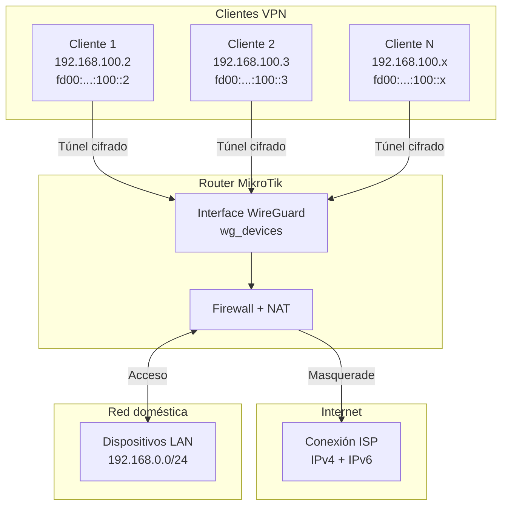
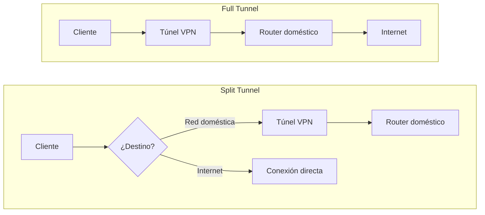

import Callout from "@components/ui/Callout.astro";
import FileContent from "@components/ui/FileContent.astro";
import Mermaid from "@components/ui/Mermaid.astro";
import TerminalCommand from "@components/ui/TerminalCommand.astro";
import {
  TerminalSession,
  TerminalSessionCommand,
  TerminalSessionOutput,
} from "@components/ui/terminal-session";
import Table from "@components/ui/Table.astro";
import Code from "@components/ui/Code.astro";
import CheckList from "@components/ui/CheckList.astro";
import TLDRSummary from "@components/ui/TLDRSummary.astro";
import Prerequisite from "@components/ui/Prerequisite.astro";
import { Tabs, TabPanel } from "@components/ui/tabs";
import Collapsible from "@components/ui/Collapsible.astro";

[WireGuard](https://www.wireguard.com/) ha revolucionado la tecnología VPN con su simplicidad, velocidad y criptografía moderna. A diferencia de protocolos VPN tradicionales como [OpenVPN](https://openvpn.net/) o [IPSec](https://datatracker.ietf.org/doc/html/rfc7296), WireGuard utiliza una base de código mínima (~4.000 líneas frente a más de 100.000) y primitivas criptográficas de última generación, tal como se describe en el [whitepaper de WireGuard](https://www.wireguard.com/papers/wireguard.pdf), lo que se traduce en conexiones más rápidas y menor latencia.

Esta guía muestra cómo configurar un **WireGuard VPN listo para producción** en MikroTik RouterOS con **soporte dual-stack IPv4/IPv6**. ¿El resultado? Puedes conectarte desde cualquier red —incluso sin IPv6— y disfrutar de conectividad IPv6 completa a través de tu router doméstico.

<TLDRSummary title="TL;DR — WireGuard dual-stack en RouterOS">
  - **WireGuard viene integrado en RouterOS 7**, así que un servidor VPN dual-stack no necesita contenedor ni paquete adicional: la interfaz escucha en un puerto UDP alto no estándar (**53537** aquí, no el 51820 por defecto, para esquivar los escaneos automáticos) y cada peer recibe una dirección IPv4 y una IPv6.
  - **El IPv6 va por ULA más NAT66, no por prefijo delegado.** Los clientes reciben direcciones `fd00::/8` que el router traduce al prefijo global de tu ISP, de modo que el túnel sobrevive a que ese prefijo cambie por debajo.
  - **Hay que fijar el MSS de TCP o las descargas grandes se atascan.** Con la interfaz a MTU 1500 los techos calculados son 1460 para IPv4 (1500 − 20 IP − 20 TCP) y 1440 para IPv6 (1500 − 40 − 20); `new-mss=1420` queda por debajo de ambos, y por eso un solo valor sirve para las dos pilas.
  - **Cada dispositivo tiene su propio par de claves y su par de direcciones.** Revocar un cliente es borrar un peer; no hay que reemitir nada más.
  - **El split tunnel se decide en el `AllowedIPs` del cliente**, no en el servidor: lista solo los prefijos de casa para encaminar el tráfico doméstico, o `0.0.0.0/0, ::/0` para encaminarlo todo.
  - **Probado en RouterOS 7.x sobre un RB5009**, y aplicable a cualquier router MikroTik cuya build de RouterOS incluya WireGuard.
</TLDRSummary>

<Callout type="important" title="Valores que debes personalizar">
A lo largo de esta guía, los valores que **debes sustituir** por los tuyos están claramente marcados. Busca:

- **`wg_devices`** — nombre de la interfaz WireGuard (personalízalo si prefieres otro nombre)
- **`53537`** — puerto de escucha de WireGuard (elige cualquier puerto UDP no utilizado)
- **`192.168.100.0/24`** — subred IPv4 de la VPN (cámbiala si entra en conflicto con tu red)
- **`fd00:1111:2222:100::/64`** — prefijo ULA IPv6 de la VPN (genera el tuyo en [unique-local-ipv6.com](https://www.unique-local-ipv6.com/))
- **`192.168.0.0/24`** — subred de tu LAN doméstica (ajústala a tu red)
- **Claves de cliente** — genera siempre pares de claves únicos por dispositivo
- **`your-domain.com`** — tu IP pública o nombre de host DDNS
</Callout>

---

## ¿WireGuard en RouterOS admite IPv6?

Sí. WireGuard viene integrado en RouterOS 7 como un tipo de interfaz más y
transporta IPv6 de forma nativa: asignas una dirección IPv6 a la interfaz WireGuard
y das a cada peer su propia `allowed-address` IPv6. La pega está en el
direccionamiento — esta guía usa un prefijo ULA con NAT66 en lugar de un prefijo
delegado, para que el túnel sobreviva a los cambios de prefijo de tu ISP.

---

## Cómo lo ejecuto en mi propia infraestructura

La configuración de arriba no es un ejercicio de laboratorio — es el WireGuard que corre hoy en mi propio RB5009UG+S+ con RouterOS 7.23.2, con la misma disposición de interfaces que esta guía, con el MTU estándar de 1500.

Sinceramente, no hay ningún incidente que contar. Me gustaría ofrecerte una historia de terror sobre MSS clamping que fallara o un handshake que se rompiera en silencio, pero no es lo que ha pasado aquí: este túnel lleva tiempo funcionando sin un solo problema de uso, con buen rendimiento y conectividad dual-stack completa — IPv4 e IPv6 funcionan de extremo a extremo, siempre. Si tu despliegue sigue los pasos de arriba, ese es exactamente el resultado aburrido y fiable que deberías esperar.

---

## ¿Por qué WireGuard en MikroTik?

<Table title="Comparativa de protocolos VPN">
  <thead>
    <tr>
      <th scope="col">Característica</th>
      <th scope="col">WireGuard</th>
      <th scope="col">OpenVPN</th>
      <th scope="col">IPSec/IKEv2</th>
    </tr>
  </thead>
  <tbody>
    <tr>
      <td>Complejidad de código</td>
      <td>~4.000 líneas</td>
      <td>~100.000 líneas</td>
      <td>~400.000 líneas</td>
    </tr>
    <tr>
      <td>Tiempo de conexión</td>
      <td>100ms</td>
      <td>3-10 segundos</td>
      <td>1-3 segundos</td>
    </tr>
    <tr>
      <td>Carga de CPU</td>
      <td>Muy baja</td>
      <td>Alta (espacio de usuario)</td>
      <td>Media</td>
    </tr>
    <tr>
      <td>Criptografía</td>
      <td>ChaCha20, Curve25519</td>
      <td>Configurable (varía)</td>
      <td>AES, RSA/ECDH</td>
    </tr>
    <tr>
      <td>Soporte de roaming</td>
      <td>Transparente</td>
      <td>Necesita reconexión</td>
      <td>Limitado (MOBIKE)</td>
    </tr>
  </tbody>
</Table>

<Callout type="tip" title="Diseñado para móviles">
WireGuard destaca en dispositivos móviles. Cuando cambias de Wi-Fi a datos móviles o de red, WireGuard reconecta instantáneamente sin perder la sesión. Esta capacidad de roaming lo hace ideal para smartphones y portátiles.
</Callout>

---

## ¿Cómo encajan las mitades IPv4 e IPv6?

Nuestra configuración crea una VPN dual-stack en la que los clientes conectados reciben tanto dirección IPv4 como IPv6. El tráfico de los clientes se traduce mediante NAT (masquerade) para acceder a internet a través de tu conexión doméstica. Para más información, consulta la [documentación oficial de WireGuard en MikroTik](https://help.mikrotik.com/docs/spaces/ROS/pages/69664792/WireGuard).

<Mermaid caption="Arquitectura WireGuard Dual-Stack" ariaLabel="Diagrama que muestra la topología VPN WireGuard con redes IPv4 e IPv6 pasando a través del router MikroTik hacia internet" maxWidth="600px">

</Mermaid>

### Esquema de direccionamiento

<Table title="Asignación de direcciones IP">
  <thead>
    <tr>
      <th scope="col">Componente</th>
      <th scope="col">Dirección IPv4</th>
      <th scope="col">Dirección IPv6</th>
    </tr>
  </thead>
  <tbody>
    <tr>
      <td>Interface WireGuard (Router)</td>
      <td>`192.168.100.1/24`</td>
      <td>`fd00:1111:2222:100::1/64`</td>
    </tr>
    <tr>
      <td>Rango de clientes VPN</td>
      <td>`192.168.100.2-254`</td>
      <td>`fd00:1111:2222:100::2-ffff`</td>
    </tr>
    <tr>
      <td>LAN doméstica</td>
      <td>`192.168.0.0/24`</td>
      <td>Prefix asignado por el ISP</td>
    </tr>
  </tbody>
</Table>

<Callout type="info" title="¿Por qué ULA para IPv6?">
Utilizamos [direcciones Unique Local (ULA)](https://datatracker.ietf.org/doc/html/rfc4193) del rango `fd00::/8` para la VPN. Estas direcciones son privadas (como RFC1918 para IPv4) y no entran en conflicto con direcciones IPv6 públicas. El router las traduce mediante NAT66 al prefijo IPv6 global asignado por tu ISP.
</Callout>

---

## Requisitos previos

<Prerequisite title="Antes de empezar">
  - **MikroTik RouterOS 7.x** o posterior (WireGuard viene integrado desde RouterOS 7)
  - **Dirección IP pública** (estática) o **Dynamic DNS** (DDNS) configurado en tu router
  - **Conectividad IPv6** desde tu ISP (opcional pero recomendada para dual-stack)
  - **Capacidad de reenvío de puertos UDP** si tu MikroTik está detrás de otro router/NAT
  - **Acceso administrativo** a tu router MikroTik (vía WinBox, WebFig o SSH)
  - **Listas de interfaces** ya creadas: `WAN` (para interfaces de cara a internet) y `LAN` (para interfaces de red local). Forman parte de la configuración por defecto de MikroTik
</Prerequisite>

---

## Paso 1: crear la interfaz WireGuard

Primero, creamos la interfaz WireGuard en el router MikroTik. El router generará un par de claves automáticamente.

<Code lang="routeros" title="Crear interfaz WireGuard">
```routeros
/interface wireguard add \
    name=wg_devices \
    mtu=1500 \
    listen-port=53537 \
    comment="VPN for Mobile Devices"
```
</Code>

<Callout type="tip" title="Selección de puerto">
Usar un puerto no estándar como `53537` en lugar del `51820` por defecto ayuda a evitar escaneos automatizados dirigidos a puertos VPN conocidos. Algunas redes también bloquean puertos VPN estándar, así que un puerto alto aleatorio puede ofrecer mejor conectividad.
</Callout>

### Obtener la public key del servidor

Tras crear la interfaz, obtén la public key para configurar los clientes:

<TerminalSession title="Obtener Public Key del servidor">
  <TerminalSessionCommand>
    /interface wireguard print
  </TerminalSessionCommand>
  <TerminalSessionOutput title="Salida">

```
Flags: X - disabled; R - running
 0  R name="wg_devices" mtu=1500 listen-port=53537
      private-key="[REDACTED]"
      public-key="YourServerPublicKeyHere123456789ABCDEFGHIJ="
```

  </TerminalSessionOutput>
</TerminalSession>

Guarda el valor de `public-key` — lo necesitarás al configurar los dispositivos cliente.

---

## Paso 2: asignar direcciones IP a la interfaz

La interfaz WireGuard necesita tanto dirección IPv4 como IPv6 para servir como gateway de los clientes VPN.

<Code lang="routeros" title="Asignar direcciones IP">
```routeros
# IPv4 address for WireGuard interface
/ip address add \
    address=192.168.100.1/24 \
    interface=wg_devices \
    network=192.168.100.0 \
    comment="VPN Devices Network"

# IPv6 ULA address for WireGuard interface
/ipv6 address add \
    address=fd00:1111:2222:100::1/64 \
    interface=wg_devices \
    advertise=no \
    comment="VPN Devices IPv6 ULA"
```
</Code>

<Callout type="warning" title="Ajuste de advertise en IPv6">
Establece `advertise=no` para la dirección IPv6 de WireGuard. No queremos Router Advertisements en el túnel VPN — los clientes reciben sus direcciones estáticas a través de la configuración de WireGuard, no por SLAAC.
</Callout>

---

## Paso 3: crear pool IPv6 (opcional)

Si quieres gestionar la asignación de direcciones IPv6 de forma centralizada, crea un pool:

<Code lang="routeros" title="Crear pool IPv6">
```routeros
/ipv6 pool add \
    name=wg_devices_pool_global \
    prefix=fd00:1111:2222:100::/64 \
    prefix-length=64 \
    comment="WireGuard Devices Global IPv6 Pool"
```
</Code>

---

## Paso 4: añadir la interfaz a las listas de interfaces

MikroTik utiliza listas de interfaces para las reglas de firewall. Añadir WireGuard a las listas adecuadas garantiza una gestión correcta del tráfico.

<Code lang="routeros" title="Añadir a listas de interfaces">
```routeros
# Add to VPN list for VPN-specific rules
/interface list member add \
    interface=wg_devices \
    list=VPN \
    comment="VPN Devices"

# Add to LAN list to allow access to local resources
/interface list member add \
    interface=wg_devices \
    list=LAN \
    comment="VPN Devices - LAN Access"
```
</Code>

---

## Paso 5: configurar reglas de firewall

La configuración del firewall es crítica para la seguridad y la conectividad. Necesitamos reglas para:

1. **Aceptar tráfico WireGuard** en el puerto de escucha
2. **Permitir a los clientes VPN** acceder a internet
3. **Permitir a los clientes VPN** acceder a las redes locales
4. **NAT/Masquerade** para el tráfico saliente

<Callout type="warning" title="Ubicación de las reglas de firewall">
MikroTik procesa las reglas de firewall **de arriba a abajo**. Las reglas siguientes deben colocarse **antes** de cualquier regla `drop` en sus respectivas cadenas. Usa el parámetro `place-before` o reordena las reglas en WinBox después de añadirlas.

Si usas el firewall por defecto de MikroTik, añade estas reglas cerca del inicio de cada cadena, después de las reglas `established,related` de aceptación.
</Callout>

### Cadena input: aceptar conexiones WireGuard

<Code lang="routeros" title="Reglas de firewall input">
```routeros
# Allow WireGuard UDP port (IPv4)
/ip firewall filter add \
    chain=input \
    action=accept \
    protocol=udp \
    dst-port=53537 \
    comment="WireGuard - Accept incoming connections"

# Allow WireGuard UDP port (IPv6)
/ipv6 firewall filter add \
    chain=input \
    action=accept \
    protocol=udp \
    port=53537 \
    comment="Allow WireGuard"
```
</Code>

### Cadena forward: permitir tráfico VPN

<Code lang="routeros" title="Reglas de firewall forward - IPv4">
```routeros
# FastTrack for established WireGuard connections (performance)
/ip firewall filter add \
    chain=forward \
    action=fasttrack-connection \
    connection-state=established,related \
    src-address-list=WireGuard \
    comment="FastTrack for WireGuard Networks"

# Allow VPN clients to internet
/ip firewall filter add \
    chain=forward \
    action=accept \
    src-address=192.168.100.0/24 \
    out-interface-list=WAN \
    comment="Allow WireGuard Devices to Internet"

# Allow return traffic from internet to VPN
/ip firewall filter add \
    chain=forward \
    action=accept \
    connection-state=established,related \
    dst-address=192.168.100.0/24 \
    in-interface-list=WAN \
    comment="Allow Internet to WireGuard Devices (replies)"

# Allow VPN clients to Home LAN
/ip firewall filter add \
    chain=forward \
    action=accept \
    src-address=192.168.100.0/24 \
    dst-address=192.168.0.0/24 \
    comment="Allow WireGuard Devices to Home LAN"
```
</Code>

<Code lang="routeros" title="Reglas de firewall forward - IPv6">
```routeros
# Allow VPN clients all outbound IPv6 traffic
/ipv6 firewall filter add \
    chain=forward \
    action=accept \
    in-interface=wg_devices \
    comment="WireGuard Devices: Allow all outbound"

# Allow return IPv6 traffic to VPN clients
/ipv6 firewall filter add \
    chain=forward \
    action=accept \
    connection-state=established,related \
    out-interface=wg_devices \
    comment="WireGuard Devices: Allow replies"
```
</Code>

### Crear address list para redes WireGuard

<Code lang="routeros" title="Listas de direcciones">
```routeros
/ip firewall address-list add \
    list=WireGuard \
    address=192.168.100.0/24 \
    comment="WireGuard Devices Network"
```
</Code>

---

## Paso 6: configurar NAT/Masquerade

Para que los clientes VPN accedan a internet, sus direcciones privadas deben traducirse (NAT) a tu IP pública.

<Code lang="routeros" title="Configuración NAT">
```routeros
# IPv4 Masquerade for WireGuard
/ip firewall nat add \
    chain=srcnat \
    action=masquerade \
    src-address=192.168.100.0/24 \
    out-interface-list=WAN \
    comment="WireGuard Devices - Internet Access"

# IPv6 NAT66 for WireGuard (ULA to Global)
/ipv6 firewall nat add \
    chain=srcnat \
    action=masquerade \
    src-address=fd00:1111:2222:100::/64 \
    out-interface-list=WAN \
    comment="WireGuard Devices - IPv6 Internet Access"
```
</Code>

<Callout type="info" title="NAT66 explicado">
La filosofía tradicional de IPv6 desaconseja el NAT, prefiriendo la conectividad extremo a extremo. Sin embargo, NAT66 (masquerade para IPv6) resulta práctico en VPNs que usan direcciones ULA. Tus clientes VPN utilizan direcciones ULA privadas, que se traducen al [prefijo IPv6 global asignado por tu ISP](/es/blog/008-mikrotik-pppoe-dualstack-digi/) cuando acceden a internet.
</Callout>

---

## Paso 7: configurar MSS clamping

El TCP Maximum Segment Size (MSS) clamping evita problemas de fragmentación en túneles VPN. La sobrecarga de WireGuard reduce el MTU efectivo, por lo que debemos ajustar el TCP MSS en consecuencia.

<Code lang="routeros" title="MSS Clamping">
```routeros
/ip firewall mangle add \
    chain=forward \
    action=change-mss \
    protocol=tcp \
    tcp-flags=syn \
    tcp-mss=1349-65535 \
    new-mss=1420 \
    in-interface=wg_devices \
    comment="WireGuard MSS clamping - Devices"
```
</Code>

<Callout type="tip" title="Cálculo de MTU y MSS">
WireGuard añade sobrecarga a cada paquete (40 bytes IPv6/20 bytes IPv4 + 8 bytes UDP + 32 bytes cabecera WG). Establecemos `mtu=1500` en la interfaz WireGuard para permitir paquetes internos de tamaño completo:

- **MTU de la interfaz WireGuard**: 1500 (paquetes internos; los paquetes externos con sobrecarga WG se fragmentan de forma transparente por la capa de transporte)
- **TCP MSS para IPv4**: 1500 - 20 (IP) - 20 (TCP) = **1460**
- **TCP MSS para IPv6**: 1500 - 40 (IPv6) - 20 (TCP) = **1440**

Usamos `new-mss=1420` como valor conservador por debajo de ambos límites. Si experimentas problemas de conexión (páginas que cargan parcialmente, descargas que se atascan), prueba a reducir a `1380` o establece el MTU de WireGuard a `1420` (el valor por defecto de RouterOS, que evita la fragmentación externa al tener en cuenta la sobrecarga de WireGuard).
</Callout>

---

## Paso 8: configurar la tabla RAW para rendimiento

Omitir la protección contra flood para el tráfico WireGuard garantiza una conectividad fluida:

<Code lang="routeros" title="Reglas de la tabla RAW">
```routeros
# IPv4: Skip flood protection for WireGuard
/ip firewall raw add \
    chain=prerouting \
    action=accept \
    protocol=udp \
    dst-port=53537 \
    comment="WireGuard - Skip flood protection"

# IPv6: Skip flood protection for WireGuard
/ipv6 firewall raw add \
    chain=prerouting \
    action=accept \
    protocol=udp \
    dst-port=53537 \
    comment="WireGuard - Skip flood protection"
```
</Code>

---

## Paso 9: añadir peers WireGuard (clientes)

Ahora añadimos los dispositivos cliente. Cada cliente necesita:

- **Direcciones IP únicas**: una dirección IPv4 y una IPv6 dedicadas dentro de la subred WireGuard
- **Par de claves**: private key y public key para autenticación
- **Preshared key**: opcional pero recomendada como capa adicional de cifrado

### Crear un peer

Elige cómo generar las claves criptográficas. El enfoque **recomendado** deja que RouterOS genere todo automáticamente, pero también puedes pre-generar las claves en el dispositivo cliente.

<Tabs>
  <TabPanel label="RouterOS (recomendado)">

Desde RouterOS 7.x, el router puede generar todas las claves criptográficas automáticamente. Es el **enfoque más sencillo** — el router crea la private key, calcula la public key y genera la preshared key en un solo comando.

#### Crear el peer con claves auto-generadas

<Code lang="routeros" title="Añadir peer con claves auto-generadas">
```routeros
/interface wireguard peers add \
    interface=wg_devices \
    name=wg_client1 \
    private-key=auto \
    preshared-key=auto \
    allowed-address=192.168.100.2/32,fd00:1111:2222:100::2/128 \
    persistent-keepalive=25s \
    comment="Client 1 - Mobile"
```
</Code>

<Callout type="tip" title="Qué hace auto">
`private-key=auto` genera una private key y calcula automáticamente la public key correspondiente. `preshared-key=auto` genera una preshared key aleatoria. Ambos valores se almacenan en el peer y pueden consultarse posteriormente.
</Callout>

#### Establecer propiedades de configuración del cliente (opcional)

Estas propiedades definen la configuración del lado del cliente y habilitan la función de **código QR** en WinBox/WebFig:

<Code lang="routeros" title="Establecer propiedades de configuración del cliente">
```routeros
/interface wireguard peers set wg_client1 \
    client-address=192.168.100.2/32,fd00:1111:2222:100::2/128 \
    client-dns=192.168.0.1,fd00:1111:2222:100::1 \
    client-endpoint=your-domain.com:53537 \
    client-allowed-address=0.0.0.0/0,::/0 \
    client-keepalive=25
```
</Code>

<Callout type="tip" title="Código QR en WinBox / WebFig">
Con estas propiedades de cliente configuradas, abre el peer en **WinBox** o **WebFig** y usa `show-client-config` para mostrar la configuración completa del cliente y un código QR. Es la **forma más fácil** de configurar clientes iOS/Android — simplemente escanea el código desde la app WireGuard.
</Callout>

#### Obtener claves para configuración manual del cliente

Si necesitas configurar el cliente manualmente en lugar de escanear el código QR, obtén las claves generadas desde el router:

<Code lang="routeros" title="Obtener claves generadas">
```routeros
# Client's private key → goes into client's [Interface] section
:put [/interface wireguard peers get [find name=wg_client1] private-key]

# Preshared key → goes into client's [Peer] section
:put [/interface wireguard peers get [find name=wg_client1] preshared-key]

# Server's public key → goes into client's [Peer] section
:put [/interface wireguard get [find name=wg_devices] public-key]
```
</Code>

Usa estos valores para completar el archivo de configuración del cliente en el [Paso 10](#paso-10-configuración-del-cliente).

  </TabPanel>
  <TabPanel label="Linux / macOS">

Genera las claves en el dispositivo cliente primero y luego añade el peer en el router usando la **public key** del cliente.

#### Generar claves en el cliente

<TerminalCommand title="Generar claves del cliente">
```bash
# Generate private key
wg genkey > privatekey

# Generate public key from private key
cat privatekey | wg pubkey > publickey

# Generate preshared key (optional but recommended)
wg genpsk > presharedkey

# Display keys
cat privatekey publickey presharedkey
```
</TerminalCommand>

#### Añadir peer en MikroTik (Linux / macOS)

Usa la **public key** del cliente (no la private key) y la preshared key:

<Code lang="routeros" title="Añadir peer WireGuard (Linux/macOS)">
```routeros
/interface wireguard peers add \
    interface=wg_devices \
    name=wg_client1 \
    public-key="<CLIENT_PUBLIC_KEY>" \
    preshared-key="<PRESHARED_KEY>" \
    allowed-address=192.168.100.2/32,fd00:1111:2222:100::2/128 \
    persistent-keepalive=25s \
    comment="Client 1 - Mobile"
```
</Code>

<Callout type="important" title="Mantén la private key segura">
La private key permanece en el dispositivo cliente y va en la sección `[Interface]` del cliente. Solo la **public key** se comparte con el router. **Nunca** transfieras la private key por un canal inseguro.
</Callout>

  </TabPanel>
  <TabPanel label="Windows">

La aplicación WireGuard para Windows genera las claves automáticamente al crear un nuevo tunnel.

1. Descarga e instala [WireGuard para Windows](https://www.wireguard.com/install/)
2. Abre la aplicación y haz clic en **Add Tunnel** → **Add empty tunnel**
3. La aplicación genera un par de claves — copia la **Public Key** que aparece en la parte superior
4. Genera una preshared key desde la línea de comandos:

<TerminalCommand title="Generar preshared key">
```powershell
# If WireGuard is installed, wg.exe is available in PATH
wg genpsk
```
</TerminalCommand>

#### Añadir peer en MikroTik (Windows)

<Code lang="routeros" title="Añadir peer WireGuard (Windows)">
```routeros
/interface wireguard peers add \
    interface=wg_devices \
    name=wg_client1 \
    public-key="<CLIENT_PUBLIC_KEY>" \
    preshared-key="<PRESHARED_KEY>" \
    allowed-address=192.168.100.2/32,fd00:1111:2222:100::2/128 \
    persistent-keepalive=25s \
    comment="Client 1 - Mobile"
```
</Code>

  </TabPanel>
</Tabs>

<Table title="Parámetros de configuración del peer">
  <thead>
    <tr>
      <th scope="col">Parámetro</th>
      <th scope="col">Valor</th>
      <th scope="col">Propósito</th>
    </tr>
  </thead>
  <tbody>
    <tr>
      <td>`private-key`</td>
      <td>`auto` / ninguno</td>
      <td>Auto-genera el par de claves en el router (método recomendado)</td>
    </tr>
    <tr>
      <td>`public-key`</td>
      <td>Public key del cliente</td>
      <td>Identifica y autentica al cliente</td>
    </tr>
    <tr>
      <td>`preshared-key`</td>
      <td>`auto` / secreto compartido</td>
      <td>Capa de cifrado simétrico adicional (seguridad post-cuántica)</td>
    </tr>
    <tr>
      <td>`allowed-address`</td>
      <td>IP(s) del cliente</td>
      <td>IPs que el cliente puede usar; también actúa como routing table</td>
    </tr>
    <tr>
      <td>`persistent-keepalive`</td>
      <td>25 segundos</td>
      <td>Mantiene los mapeos NAT, permite conexiones entrantes</td>
    </tr>
  </tbody>
</Table>

<Callout type="warning" title="Persistent Keepalive">
El ajuste `persistent-keepalive=25s` es crucial para dispositivos móviles detrás de NAT. Envía un paquete keepalive cada 25 segundos, manteniendo la traducción NAT y permitiendo al servidor enviar datos al cliente incluso si este no ha enviado nada recientemente.
</Callout>

### Ejemplo: múltiples peers

Cada peer debe tener un **par de claves único** y **direcciones IP únicas**. Nunca reutilices claves entre dispositivos.

<Code lang="routeros" title="Configuración de múltiples peers (claves auto en RouterOS)">
```routeros
# Client 1 - Mobile Device (e.g., iPhone)
/interface wireguard peers add \
    interface=wg_devices \
    name=wg_phone \
    private-key=auto \
    preshared-key=auto \
    allowed-address=192.168.100.2/32,fd00:1111:2222:100::2/128 \
    persistent-keepalive=25s \
    comment="Phone - Mobile VPN"

# Client 2 - Laptop (e.g., MacBook)
/interface wireguard peers add \
    interface=wg_devices \
    name=wg_laptop \
    private-key=auto \
    preshared-key=auto \
    allowed-address=192.168.100.3/32,fd00:1111:2222:100::3/128 \
    persistent-keepalive=25s \
    comment="Laptop - Mobile VPN"

# Client 3 - Remote Site (Site-to-Site VPN)
/interface wireguard peers add \
    interface=wg_devices \
    name=wg_remote_site \
    private-key=auto \
    preshared-key=auto \
    allowed-address=192.168.100.10/32,fd00:1111:2222:100::a/128 \
    persistent-keepalive=25s \
    comment="Remote Site - Site-to-Site"
```
</Code>

<Callout type="warning" title="Seguridad: nunca compartas las private keys">
Tanto si las claves se auto-generan en el router como si se pre-generan en el cliente, la private key solo debe existir en el dispositivo cliente. Cuando uses la auto-generación de RouterOS, obtén la private key una vez para la configuración del cliente y evita registrarla o almacenarla en otro lugar. **Nunca** incluyas claves reales en documentación o control de versiones.
</Callout>

---

## Paso 10: configuración del cliente

Ahora configura el dispositivo cliente. Si usaste el método de **claves auto de RouterOS** y estableciste las propiedades del cliente en el Paso 9, simplemente escanea el **código QR** desde WinBox/WebFig — no necesitas configuración manual.

Para la configuración manual, el formato del archivo de configuración es el mismo en todas las plataformas, pero el método de instalación varía.

<Callout type="important" title="Sustituye estos valores">
En cada configuración de cliente a continuación, **debes** sustituir:
- **`<CLIENT_PRIVATE_KEY>`** — la private key del cliente (auto-generada en el router o generada localmente en el Paso 9)
- **`<SERVER_PUBLIC_KEY>`** — la public key del servidor (del Paso 1, u obtenida con `:put` en el Paso 9)
- **`<PRESHARED_KEY>`** — la preshared key (debe coincidir con la configuración del peer en el servidor)
- **`your-domain.com:53537`** — la IP pública/dominio de tu router y el puerto de WireGuard
- **Direcciones IP** — deben coincidir con `allowed-address` configurado en el peer del servidor
</Callout>

<Tabs>
  <TabPanel label="iOS / Android">

Descarga la app **WireGuard** desde la [App Store](https://apps.apple.com/app/wireguard/id1441195209) o [Google Play](https://play.google.com/store/apps/details?id=com.wireguard.android). Puedes:
- **Importar un archivo .conf** o escanear un **código QR**
- **Crear manualmente** en la app

<FileContent
  filename="wg_home.conf (iOS/Android)"
  language="ini"
  collapsible={false}
  title="Configuración del cliente móvil"
>
```ini
[Interface]
PrivateKey = <CLIENT_PRIVATE_KEY>
Address = 192.168.100.2/32, fd00:1111:2222:100::2/128
DNS = 192.168.0.1, fd00:1111:2222:100::1

[Peer]
PublicKey = <SERVER_PUBLIC_KEY>
PresharedKey = <PRESHARED_KEY>
Endpoint = your-domain.com:53537
AllowedIPs = 0.0.0.0/0, ::/0
PersistentKeepalive = 25
```
</FileContent>

<Callout type="tip" title="Código QR desde RouterOS">
Si configuraste las propiedades del cliente en el Paso 9 (`client-address`, `client-dns`, `client-endpoint`, etc.), abre el peer en **WinBox** o **WebFig** y usa `show-client-config` para mostrar un código QR. Escanéalo con la app WireGuard — sin necesidad de configuración manual.
</Callout>

  </TabPanel>
  <TabPanel label="macOS / Linux">

Instala WireGuard:

<TerminalCommand title="Instalar WireGuard">
```bash
# macOS (Homebrew)
brew install wireguard-tools

# Ubuntu/Debian
sudo apt install wireguard

# Fedora
sudo dnf install wireguard-tools
```
</TerminalCommand>

Crea el archivo de configuración:

<FileContent
  filename="/etc/wireguard/wg_home.conf"
  language="ini"
  collapsible={false}
  title="Configuración del cliente Linux/macOS"
>
```ini
[Interface]
PrivateKey = <CLIENT_PRIVATE_KEY>
Address = 192.168.100.2/32, fd00:1111:2222:100::2/128
DNS = 192.168.0.1, fd00:1111:2222:100::1

[Peer]
PublicKey = <SERVER_PUBLIC_KEY>
PresharedKey = <PRESHARED_KEY>
Endpoint = your-domain.com:53537
AllowedIPs = 0.0.0.0/0, ::/0
PersistentKeepalive = 25
```
</FileContent>

Activa el túnel:

<TerminalCommand title="Activar WireGuard">
```bash
# Start the tunnel
sudo wg-quick up wg_home

# Check status
sudo wg show

# Stop the tunnel
sudo wg-quick down wg_home

# Enable on boot (Linux only)
sudo systemctl enable wg-quick@wg_home
```
</TerminalCommand>

  </TabPanel>
  <TabPanel label="Windows">

1. Descarga e instala [WireGuard para Windows](https://www.wireguard.com/install/)
2. Abre la aplicación y haz clic en **Add Tunnel** → **Import tunnel(s) from file** (si tienes un archivo `.conf`) o **Add empty tunnel** para pegar la configuración
3. Si lo creas desde cero, sustituye la configuración con:

<FileContent
  filename="wg_home.conf (Windows)"
  language="ini"
  collapsible={false}
  title="Configuración del cliente Windows"
>
```ini
[Interface]
PrivateKey = <CLIENT_PRIVATE_KEY>
Address = 192.168.100.2/32, fd00:1111:2222:100::2/128
DNS = 192.168.0.1, fd00:1111:2222:100::1

[Peer]
PublicKey = <SERVER_PUBLIC_KEY>
PresharedKey = <PRESHARED_KEY>
Endpoint = your-domain.com:53537
AllowedIPs = 0.0.0.0/0, ::/0
PersistentKeepalive = 25
```
</FileContent>

5. Haz clic en **Save** y luego en **Activate**

  </TabPanel>
</Tabs>

### Opciones de configuración explicadas

<Table title="Parámetros de configuración del cliente">
  <thead>
    <tr>
      <th scope="col">Parámetro</th>
      <th scope="col">Descripción</th>
    </tr>
  </thead>
  <tbody>
    <tr>
      <td>`Address`</td>
      <td>Las direcciones IP asignadas a este cliente (tanto IPv4 como IPv6)</td>
    </tr>
    <tr>
      <td>`DNS`</td>
      <td>Servidores DNS a utilizar. Puede ser tu router o cualquier servidor DNS accesible vía VPN</td>
    </tr>
    <tr>
      <td>`Endpoint`</td>
      <td>La IP pública o nombre de dominio de tu router con el puerto de WireGuard</td>
    </tr>
    <tr>
      <td>`AllowedIPs`</td>
      <td>`0.0.0.0/0, ::/0` encamina TODO el tráfico por la VPN. Usa subredes específicas para split tunnel</td>
    </tr>
  </tbody>
</Table>

### Split tunnel vs full tunnel

<Mermaid caption="Modos de encaminamiento de tráfico" ariaLabel="Diagrama comparativo que muestra split tunnel frente a full tunnel en el encaminamiento VPN" maxWidth="900px">

</Mermaid>

**Full tunnel** — todo el tráfico pasa por la VPN:
- Oculta tu ubicación a todos los sitios web
- Mayor latencia para la navegación general
- Acceso IPv6 completo a través de la conexión doméstica

<Code lang="ini" title="Ejemplo de full tunnel">
```ini
# Route ALL traffic through VPN
AllowedIPs = 0.0.0.0/0, ::/0
```
</Code>

**Split tunnel** — solo el tráfico a redes especificadas usa la VPN:
- Mejor rendimiento para el uso general de internet
- Acceso a la red doméstica sin encaminar todo el tráfico

<Code lang="ini" title="Ejemplo de split tunnel">
```ini
# Only route home network traffic through VPN
AllowedIPs = 192.168.0.0/24, 192.168.100.0/24, fd00:1111:2222::/48
```
</Code>

---

## Paso 11: verificar la conexión

Tras configurar ambos lados, prueba la conexión.

### En el cliente

<TerminalSession title="Comprobar estado de WireGuard (cliente)">
  <TerminalSessionCommand>

```bash
# macOS/Linux
sudo wg show

# Or use the WireGuard app on iOS/Android
```

  </TerminalSessionCommand>
  <TerminalSessionOutput title="Conexión exitosa">

```
interface: wg_home
  public key: ClientPublicKeyHere123456789ABCDEFGHIJKLMNO=
  private key: (hidden)
  listening port: 51820

peer: YourServerPublicKeyHere123456789ABCDEFGHIJ=
  preshared key: (hidden)
  endpoint: 203.0.113.50:53537
  allowed ips: 0.0.0.0/0, ::/0
  latest handshake: 5 seconds ago
  transfer: 1.24 MiB received, 456.78 KiB sent
```

  </TerminalSessionOutput>
</TerminalSession>

### En el router MikroTik

<TerminalSession title="Comprobar estado del peer (router)">
  <TerminalSessionCommand>
    /interface wireguard peers print
  </TerminalSessionCommand>
  <TerminalSessionOutput title="Peer conectado">

```
Flags: X - disabled
 0   name="wg_client1" interface=wg_devices
     public-key="<CLIENT_PUBLIC_KEY>"
     preshared-key="(present)" allowed-address=192.168.100.2/32,fd00:1111:2222:100::2/128
     current-endpoint-address=198.51.100.75 current-endpoint-port=51820
     last-handshake=5s rx=1302528 tx=467352
```

  </TerminalSessionOutput>
</TerminalSession>

<Callout type="tip" title="Modo Responder (RouterOS 7.15+)">
Si tu MikroTik actúa como servidor VPN (los clientes se conectan a él, no al revés), considera establecer `responder=yes` en cada peer. Esto evita que el router intente repetidamente iniciar conexiones a clientes que no tienen un endpoint fijo:

```routeros
/interface wireguard peers set [find name=wg_client1] responder=yes
```
</Callout>

### Probar conectividad IPv6

<TerminalCommand title="Probar IPv6 a través de la VPN">
```bash
# Check your IPv6 address
curl -6 ifconfig.co

# Test IPv6 connectivity
ping6 google.com

# Verify route
traceroute6 google.com
```
</TerminalCommand>

---

## Resumen completo de la configuración

Aquí está la configuración completa de RouterOS como referencia. Los valores marcados con `# ← CUSTOMIZE` deben sustituirse por los tuyos.

<FileContent 
  filename="wireguard-complete.rsc" 
  language="routeros" 
  collapsible={true}
  title="Configuración completa de WireGuard"
>
```routeros
# ═══════════════════════════════════════════════════════════════════════════════
# WIREGUARD VPN - COMPLETE DUAL-STACK CONFIGURATION
# ═══════════════════════════════════════════════════════════════════════════════
# MikroTik RouterOS 7.x
# IPv4 + IPv6 dual-stack with full internet access
# ═══════════════════════════════════════════════════════════════════════════════

# ───────────────────────────────────────────────────────────────────────────────
# INTERFACE CONFIGURATION
# ───────────────────────────────────────────────────────────────────────────────

/interface wireguard add \
    name=wg_devices \
    mtu=1500 \
    listen-port=53537 \
    comment="VPN for Mobile Devices"                              # ← CUSTOMIZE port

# ───────────────────────────────────────────────────────────────────────────────
# IP ADDRESS ASSIGNMENT
# ───────────────────────────────────────────────────────────────────────────────

/ip address add \
    address=192.168.100.1/24 \
    interface=wg_devices \
    network=192.168.100.0 \
    comment="VPN Devices Network"                                 # ← CUSTOMIZE subnet

/ipv6 address add \
    address=fd00:1111:2222:100::1/64 \
    interface=wg_devices \
    advertise=no \
    comment="VPN Devices IPv6 ULA"                                # ← CUSTOMIZE ULA prefix

# ───────────────────────────────────────────────────────────────────────────────
# IPv6 POOL (Optional)
# ───────────────────────────────────────────────────────────────────────────────

/ipv6 pool add \
    name=wg_devices_pool_global \
    prefix=fd00:1111:2222:100::/64 \
    prefix-length=64 \
    comment="WireGuard Devices Global IPv6 Pool"

# ───────────────────────────────────────────────────────────────────────────────
# INTERFACE LISTS (create 'VPN' list if it doesn't exist)
# ───────────────────────────────────────────────────────────────────────────────

/interface list add name=VPN comment="VPN Interfaces" # only if list doesn't exist yet
/interface list member add interface=wg_devices list=VPN comment="VPN Devices"
/interface list member add interface=wg_devices list=LAN comment="VPN Devices - LAN Access"

# ───────────────────────────────────────────────────────────────────────────────
# ADDRESS LISTS
# ───────────────────────────────────────────────────────────────────────────────

/ip firewall address-list add \
    list=WireGuard \
    address=192.168.100.0/24 \
    comment="WireGuard Devices Network"

# ───────────────────────────────────────────────────────────────────────────────
# FIREWALL - INPUT CHAIN
# ───────────────────────────────────────────────────────────────────────────────

/ip firewall filter add \
    chain=input \
    action=accept \
    protocol=udp \
    dst-port=53537 \
    comment="WireGuard - Accept incoming connections"              # ← CUSTOMIZE port

/ipv6 firewall filter add \
    chain=input \
    action=accept \
    protocol=udp \
    port=53537 \
    comment="Allow WireGuard"                                     # ← CUSTOMIZE port

# ───────────────────────────────────────────────────────────────────────────────
# FIREWALL - FORWARD CHAIN (IPv4)
# ───────────────────────────────────────────────────────────────────────────────

/ip firewall filter add \
    chain=forward \
    action=fasttrack-connection \
    connection-state=established,related \
    src-address-list=WireGuard \
    comment="FastTrack for WireGuard Networks"

/ip firewall filter add \
    chain=forward \
    action=accept \
    src-address=192.168.100.0/24 \
    out-interface-list=WAN \
    comment="Allow WireGuard Devices to Internet"                  # ← CUSTOMIZE subnet

/ip firewall filter add \
    chain=forward \
    action=accept \
    connection-state=established,related \
    dst-address=192.168.100.0/24 \
    in-interface-list=WAN \
    comment="Allow Internet to WireGuard Devices (replies)"        # ← CUSTOMIZE subnet

/ip firewall filter add \
    chain=forward \
    action=accept \
    src-address=192.168.100.0/24 \
    dst-address=192.168.0.0/24 \
    comment="Allow WireGuard Devices to Home LAN"                  # ← CUSTOMIZE subnets

# ───────────────────────────────────────────────────────────────────────────────
# FIREWALL - FORWARD CHAIN (IPv6)
# ───────────────────────────────────────────────────────────────────────────────

/ipv6 firewall filter add \
    chain=forward \
    action=accept \
    in-interface=wg_devices \
    comment="WireGuard Devices: Allow all outbound"

/ipv6 firewall filter add \
    chain=forward \
    action=accept \
    connection-state=established,related \
    out-interface=wg_devices \
    comment="WireGuard Devices: Allow replies"

# ───────────────────────────────────────────────────────────────────────────────
# NAT / MASQUERADE
# ───────────────────────────────────────────────────────────────────────────────

/ip firewall nat add \
    chain=srcnat \
    action=masquerade \
    src-address=192.168.100.0/24 \
    out-interface-list=WAN \
    comment="WireGuard Devices - Internet Access"                  # ← CUSTOMIZE subnet

/ipv6 firewall nat add \
    chain=srcnat \
    action=masquerade \
    src-address=fd00:1111:2222:100::/64 \
    out-interface-list=WAN \
    comment="WireGuard Devices - IPv6 Internet Access"             # ← CUSTOMIZE ULA prefix

# ───────────────────────────────────────────────────────────────────────────────
# MANGLE - MSS CLAMPING
# ───────────────────────────────────────────────────────────────────────────────

/ip firewall mangle add \
    chain=forward \
    action=change-mss \
    protocol=tcp \
    tcp-flags=syn \
    tcp-mss=1349-65535 \
    new-mss=1420 \
    in-interface=wg_devices \
    comment="WireGuard MSS clamping - Devices"

# ───────────────────────────────────────────────────────────────────────────────
# RAW TABLE - SKIP FLOOD PROTECTION
# ───────────────────────────────────────────────────────────────────────────────

/ip firewall raw add \
    chain=prerouting \
    action=accept \
    protocol=udp \
    dst-port=53537 \
    comment="WireGuard - Skip flood protection"

/ipv6 firewall raw add \
    chain=prerouting \
    action=accept \
    protocol=udp \
    dst-port=53537 \
    comment="WireGuard - Skip flood protection"

# ───────────────────────────────────────────────────────────────────────────────
# PEERS — Using auto-generated keys (recommended)
# Retrieve keys with: :put [/interface wireguard peers get [find name=X] private-key]
# ───────────────────────────────────────────────────────────────────────────────

/interface wireguard peers add \
    interface=wg_devices \
    name=wg_phone \
    private-key=auto \
    preshared-key=auto \
    allowed-address=192.168.100.2/32,fd00:1111:2222:100::2/128 \  # ← CUSTOMIZE IPs
    persistent-keepalive=25s \
    comment="Phone - Mobile VPN"                                   # ← CUSTOMIZE

/interface wireguard peers add \
    interface=wg_devices \
    name=wg_laptop \
    private-key=auto \
    preshared-key=auto \
    allowed-address=192.168.100.3/32,fd00:1111:2222:100::3/128 \  # ← CUSTOMIZE IPs
    persistent-keepalive=25s \
    comment="Laptop - Mobile VPN"                                  # ← CUSTOMIZE
```
</FileContent>

---

## Resolución de problemas

### La conexión no se establece

El problema más común. Si `last-handshake` nunca aparece en ninguno de los dos lados, el handshake inicial no se está completando.

**Comprueba que la interfaz WireGuard está en funcionamiento** — una interfaz desactivada o detenida no aceptará conexiones:

<Code lang="routeros" title="Verificar estado de la interfaz">
```routeros
/interface wireguard print
# Look for the "R" (running) flag. If you see "X" (disabled), enable it:
/interface wireguard enable wg_devices
```
</Code>

**Verifica que el puerto UDP es accesible** — el firewall debe aceptar paquetes WireGuard entrantes. Comprueba que la cadena input tiene una regla de aceptación para tu puerto:

<Code lang="routeros" title="Comprobar reglas de firewall input">
```routeros
# List input rules that match your WireGuard port
/ip firewall filter print where chain=input and dst-port~"53537"
# If empty, add the rule:
/ip firewall filter add chain=input action=accept protocol=udp dst-port=53537 \
    comment="WireGuard - Accept incoming connections" place-before=0
```
</Code>

**Verifica que la public key del peer coincide** — el error más sutil. El servidor debe tener la public key del cliente, y el cliente debe tener la public key del servidor. Cualquier discrepancia descarta silenciosamente todos los paquetes:

<Code lang="routeros" title="Verificar claves">
```routeros
# Show the server's public key (this goes into the client's [Peer] section)
:put [/interface wireguard get wg_devices public-key]

# Show the client's public key stored on this peer
:put [/interface wireguard peers get [find name=wg_client1] public-key]
```
</Code>

**Comprueba si el peer muestra un handshake** — si `last-handshake` muestra un tiempo, el túnel está establecido aunque el tráfico no fluya:

<Code lang="routeros" title="Comprobar handshake del peer">
```routeros
/interface wireguard peers print detail where interface=wg_devices
# Look for: last-handshake=Xs (seconds since last handshake)
# If empty or very old, the tunnel is not established
```
</Code>

<Callout type="tip" title="Port Forwarding">
Si tu MikroTik está detrás de otro router o gateway NAT, debes redirigir el puerto UDP de WireGuard (p. ej., `53537`) a la IP interna de tu MikroTik. WireGuard usa **solo UDP** — la redirección TCP no funcionará.
</Callout>

### Se conecta pero no hay acceso a internet

El túnel está activo (el handshake tiene éxito) pero el cliente no puede navegar ni alcanzar hosts externos.

**Comprueba las reglas NAT/masquerade** — sin masquerade, la IP privada del cliente VPN llega a internet pero los paquetes de retorno no tienen adónde ir:

<Code lang="routeros" title="Verificar reglas NAT">
```routeros
# Check IPv4 masquerade
/ip firewall nat print where chain=srcnat and src-address~"192.168.100"
# Should show: action=masquerade out-interface-list=WAN

# Check IPv6 masquerade
/ipv6 firewall nat print where chain=srcnat and src-address~"fd00"
```
</Code>

**Comprueba las reglas de la cadena forward** — incluso con NAT, la cadena forward del firewall debe permitir el tráfico VPN hacia la WAN:

<Code lang="routeros" title="Verificar reglas forward">
```routeros
/ip firewall filter print where chain=forward and src-address~"192.168.100"
# You need at least:
#   accept src=192.168.100.0/24 out-interface-list=WAN
#   accept connection-state=established,related dst=192.168.100.0/24 in-interface-list=WAN
```
</Code>

**Prueba la resolución DNS** — una causa habitual de "no hay internet" es que las consultas DNS fallan. Desde el cliente, intenta alcanzar una IP directamente para aislar el problema:

<TerminalCommand title="Aislar problema DNS vs encaminamiento">
```bash
# Test direct IP connectivity (bypasses DNS)
ping 1.1.1.1

# If ping works but browsing doesn't, DNS is the problem.
# Try a different DNS in the client config:
# DNS = 1.1.1.1, 2606:4700:4700::1111
```
</TerminalCommand>

<Callout type="tip" title="Router como servidor DNS">
Si usas tu MikroTik como servidor DNS para los clientes VPN (`DNS = 192.168.0.1`), asegúrate de que `allow-remote-requests=yes` está configurado en `/ip dns`. También verifica que la interfaz WireGuard o su dirección está en la lista de interfaces `LAN`, para que las reglas de input permitan consultas DNS desde los clientes VPN.
</Callout>

### IPv6 no funciona

IPv4 funciona a través del túnel pero el tráfico IPv6 no fluye.

**Verifica que la dirección IPv6 está asignada** a la interfaz WireGuard:

<Code lang="routeros" title="Comprobar dirección IPv6">
```routeros
/ipv6 address print where interface=wg_devices
# Should show your ULA address, e.g., fd00:1111:2222:100::1/64
```
</Code>

**Comprueba la regla NAT66 para IPv6** — a diferencia de IPv4, el masquerade para IPv6 suele olvidarse:

<Code lang="routeros" title="Verificar NAT66 para IPv6">
```routeros
/ipv6 firewall nat print where chain=srcnat
# Must include: action=masquerade src-address=fd00:1111:2222:100::/64 out-interface-list=WAN
```
</Code>

**Comprueba las reglas forward de IPv6** — el firewall IPv6 es independiente del de IPv4. Necesitas reglas forward explícitas:

<Code lang="routeros" title="Verificar reglas forward de IPv6">
```routeros
/ipv6 firewall filter print where chain=forward and interface~"wg_devices"
# Need at minimum:
#   accept in-interface=wg_devices (outbound)
#   accept connection-state=established,related out-interface=wg_devices (return)
```
</Code>

**Prueba desde el cliente** — ejecuta estos comandos mientras estás conectado a la VPN:

<TerminalCommand title="Diagnosticar IPv6">
```bash
# Verify your IPv6 address is from the ULA range
ip -6 addr show wg_home

# Test connectivity to a known IPv6 address (Google DNS)
ping6 2001:4860:4860::8888

# If the ping works, test DNS resolution over IPv6
curl -6 ifconfig.co
```
</TerminalCommand>

<Callout type="warning" title="Se requiere IPv6 del ISP">
NAT66 traduce la dirección ULA de tu cliente VPN al prefijo IPv6 global de tu ISP. Si tu ISP no proporciona IPv6, no hay prefijo global al que traducir, y el acceso a internet por IPv6 no funcionará — el túnel seguirá transportando IPv6 entre cliente y router, pero no más allá.
</Callout>

### Rendimiento lento

WireGuard es extremadamente eficiente, pero varios factores pueden limitar el rendimiento en dispositivos MikroTik.

**Habilita FastTrack** — esta es la mejora de rendimiento más significativa. FastTrack omite la mayor parte del procesamiento del firewall para conexiones establecidas:

<Code lang="routeros" title="Comprobar FastTrack">
```routeros
# Verify FastTrack rule exists and has packet counters increasing
/ip firewall filter print stats where action=fasttrack-connection and comment~"WireGuard"
# If missing:
/ip firewall filter add chain=forward action=fasttrack-connection \
    connection-state=established,related src-address-list=WireGuard \
    comment="FastTrack for WireGuard Networks"
```
</Code>

**Comprueba MSS clamping** — los síntomas de falta de MSS clamping incluyen: páginas que cargan parcialmente, sitios HTTPS que agotan el tiempo, descargas de archivos grandes que fallan mientras las peticiones pequeñas funcionan:

<Code lang="routeros" title="Verificar MSS clamping">
```routeros
/ip firewall mangle print where action=change-mss and in-interface=wg_devices
# Should show: new-mss=1420 tcp-flags=syn tcp-mss=1349-65535
```
</Code>

**Comprueba el MTU** — si experimentas pérdida de paquetes o bloqueos, prueba a reducir el MTU de la interfaz WireGuard:

<Code lang="routeros" title="Ajustar MTU">
```routeros
# Check current MTU
/interface wireguard print proplist=name,mtu

# If set to 1500 and experiencing issues, try the default 1420:
/interface wireguard set wg_devices mtu=1420
# Then update MSS clamping to match:
# new-mss = MTU - 40 (IPv6 header) - 20 (TCP header) = 1360
```
</Code>

**Monitoriza la carga de CPU** — el cifrado de WireGuard no tiene aceleración por hardware en MikroTik. Un uso alto de CPU limita el rendimiento:

<Code lang="routeros" title="Monitorizar CPU">
```routeros
/system resource print
# Look for the cpu-load percentage.
```
</Code>

En mi propio router el `cpu-load` se queda en cifras de un dígito con el túnel levantado, pero no voy a disfrazar eso de benchmark: mi enlace está parado la mayor parte del tiempo, y un número medido sobre un túnel en reposo no dice nada de uno bajo carga. WireGuard corre en el kernel y es genuinamente barato, pero si necesitas una cifra de rendimiento para tu propio hardware, la única forma de obtenerla es una prueba controlada a través del túnel: `iperf3` entre un cliente y un equipo del lado LAN, con los dos extremos bajo tu control.

### Comandos de diagnóstico útiles

Referencia rápida de comandos comunes de diagnóstico en RouterOS relacionados con WireGuard:

<Code lang="routeros" title="Comandos de diagnóstico WireGuard">
```routeros
# Show all peers with connection status and traffic stats
/interface wireguard peers print detail

# Show only connected peers (those with a recent handshake)
/interface wireguard peers print where last-handshake<1m

# Monitor WireGuard traffic in real-time
/interface monitor-traffic wg_devices once

# Check interface packet counters
/interface print stats where name=wg_devices

# View firewall rule hit counters (useful to find rules that never match)
/ip firewall filter print stats where comment~"WireGuard"

# Check if the port is listening
/tool netwatch print where host=127.0.0.1 and port=53537
```
</Code>

---

## Buenas prácticas de seguridad

<CheckList>
<li data-check="check">Usa siempre preshared keys para seguridad post-cuántica</li>
<li data-check="check">Utiliza pares de claves únicos para cada dispositivo (nunca compartas las private keys)</li>
<li data-check="check">Mantén RouterOS actualizado para recibir parches de seguridad</li>
<li data-check="check">Usa un puerto no estándar para reducir la exposición a escaneos</li>
<li data-check="check">Considera la inclusión automática en lista blanca de IPs para peers conectados</li>
<li data-check="check">Monitoriza los registros de conexión en busca de intentos de acceso no autorizados</li>
</CheckList>

---

## Conclusión

Ahora tienes un [WireGuard](https://www.wireguard.com/) VPN completamente funcional con soporte dual-stack IPv4/IPv6 en tu router [MikroTik](https://mikrotik.com/). Esta configuración proporciona:

- **Acceso remoto seguro** a tu red doméstica desde cualquier lugar
- **Conectividad IPv6 completa** incluso desde redes solo IPv4
- **Cifrado rápido y moderno** con sobrecarga mínima
- **Roaming transparente** entre redes Wi-Fi y datos móviles

La simplicidad de WireGuard facilita su mantenimiento, y la implementación de MikroTik es lo suficientemente robusta para uso en producción. Ya sea para acceder a tu NAS, domótica o simplemente navegar con seguridad en redes Wi-Fi públicas, esta configuración lo cubre todo.
