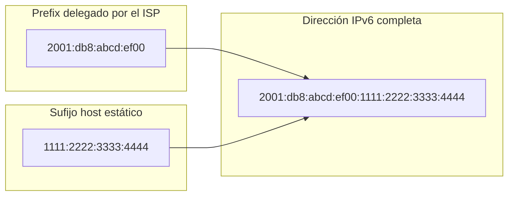

import Callout from "@components/ui/Callout.astro";
import FileContent from "@components/ui/FileContent.astro";
import Mermaid from "@components/ui/Mermaid.astro";
import TerminalCommand from "@components/ui/TerminalCommand.astro";
import {
  TerminalSession,
  TerminalSessionCommand,
  TerminalSessionOutput,
} from "@components/ui/terminal-session";
import Table from "@components/ui/Table.astro";
import Code from "@components/ui/Code.astro";
import CheckList from "@components/ui/CheckList.astro";
import TLDRSummary from "@components/ui/TLDRSummary.astro";
import Prerequisite from "@components/ui/Prerequisite.astro";
import { Tabs, TabPanel } from "@components/ui/tabs";
import Collapsible from "@components/ui/Collapsible.astro";

[DIGI España](https://www.digimobil.es/) es uno de los pocos ISP en España que ofrece conectividad IPv6 nativa a clientes residenciales. Su red de fibra utiliza autenticación [PPPoE](https://datatracker.ietf.org/doc/html/rfc2516) con VLAN tagging y proporciona tanto una dirección IPv4 dinámica como un prefix IPv6 dinámico /56 a través de [DHCPv6 Prefix Delegation (DHCPv6-PD)](https://datatracker.ietf.org/doc/html/rfc3633).

Esta guía cubre la configuración completa de un router [MikroTik](https://mikrotik.com/) para la red de DIGI, incluyendo la gestión automática de cambios de prefix, un reto habitual cuando tu ISP asigna prefixes dinámicos que pueden cambiar en cada reconexión.

<TLDRSummary title="Lo que vas a configurar">
  - **PPPoE sobre VLAN 20** para autenticación en la fibra de DIGI España
  - **IPv4 dinámico** con default route automática y DNS del ISP
  - **DHCPv6 Prefix Delegation** (prefix /56) para conectividad IPv6 nativa
  - **SLAAC** para asignación automática de direcciones IPv6 en dispositivos LAN
  - **Gestión automática de cambios de prefix** con script DHCPv6 que actualiza las direcciones en cada reconexión
  - **Firewall listo para producción** con cadenas input y forward para IPv4 e IPv6
  - **Probado en RouterOS 7.x** con RB5009, pero aplicable a cualquier router MikroTik
</TLDRSummary>

<Callout type="important" title="Valores específicos de DIGI vs genéricos">
Esta guía está escrita para **DIGI España**, pero la configuración PPPoE + DHCPv6-PD es aplicable a muchos ISPs. Los valores específicos de DIGI están claramente marcados:

- **VLAN 20** — Específico de DIGI. Otros ISPs pueden usar IDs de VLAN diferentes o no usar VLAN
- **`your_number@digi`** — Formato de usuario de DIGI (un identificador numérico asignado por DIGI). Sustitúyelo por las credenciales de tu ISP
- **`max-mtu=1500`** — Límite superior que el cliente aceptará. DIGI negocia el MTU real a **1480** vía LCP
- **`ether1`** — Puerto físico conectado al ONT. Usa el puerto que prefieras

- **`pool6`** — Nombre del pool DHCPv6. Puede ser cualquier nombre que elijas

Si tu ISP no usa VLAN tagging, sáltate el Paso 2 y configura la interfaz del cliente PPPoE directamente sobre el puerto físico.
</Callout>

---

## Arquitectura de red

La red de DIGI requiere una configuración específica: ONT en modo bridge → VLAN 20 → autenticación PPPoE → dual-stack IPv4 + IPv6 (DHCPv6-PD) → firewall/NAT → LAN con SLAAC.

### Lo que recibes de DIGI

<Table title="Parámetros de conexión de DIGI">
  <thead>
    <tr>
      <th scope="col">Parámetro</th>
      <th scope="col">Valor</th>
      <th scope="col">Notas</th>
    </tr>
  </thead>
  <tbody>
    <tr>
      <td>Tipo de conexión</td>
      <td>PPPoE sobre VLAN 20</td>
      <td>Requiere VLAN tagging</td>
    </tr>
    <tr>
      <td>Dirección IPv4</td>
      <td>Dinámica (CGNAT o pública)</td>
      <td>Asignada vía PPPoE</td>
    </tr>
    <tr>
      <td>Prefix IPv6</td>
      <td>Dinámico /56</td>
      <td>Vía DHCPv6-PD, puede cambiar en reconexiones</td>
    </tr>
    <tr>
      <td>MTU</td>
      <td>1480 (negociado)</td>
      <td>PPPoE estándar, negociado vía LCP</td>
    </tr>
    <tr>
      <td>MRU</td>
      <td>1492 (negociado)</td>
      <td>Maximum Receive Unit, negociado vía LCP</td>
    </tr>
    <tr>
      <td>Service Name</td>
      <td>ftth</td>
      <td>Identificador del servicio PPPoE reportado por DIGI</td>
    </tr>
    <tr>
      <td>DNS</td>
      <td>Proporcionado por el ISP o personalizado</td>
      <td>Se puede usar el DNS del ISP o configurar uno propio</td>
    </tr>
  </tbody>
</Table>

<Callout type="info" title="Sobre el prefix /56">
DIGI delega un prefix /56, lo que te da 256 subnets /64 para trabajar. Esto es generoso en comparación con algunos ISPs que solo proporcionan un único /64. Puedes usar diferentes subnets /64 para tu LAN principal, red IoT, red de invitados, etc.
</Callout>

---

## Requisitos previos

<Prerequisite title="Antes de empezar">
  - **Router MikroTik** con RouterOS 7.x o posterior
  - **Conexión de fibra DIGI** con ONT en modo bridge (o el equivalente de tu ISP)
  - **Credenciales PPPoE** de tu ISP (formato DIGI: `identificador@digi`)
  - **Cable ethernet físico** entre ONT y router
  - **Acceso administrativo** a tu router MikroTik (WinBox, WebFig o SSH)
  - **Listas de interfaces** `WAN` y `LAN` con tu bridge ya en la lista `LAN` (configuración por defecto en la mayoría de equipos MikroTik)
</Prerequisite>

<Callout type="tip" title="Otros ISPs que usan PPPoE">
Esta configuración funciona con cualquier ISP basado en PPPoE que proporcione IPv6 vía DHCPv6-PD. Las diferencias clave entre ISPs suelen ser: el ID de VLAN (o ausencia de VLAN), el MTU negociado (normalmente 1480–1492, determinado por el servidor vía LCP), el formato de usuario y el tamaño del prefix delegado (/48, /56 o /64). Ajusta los valores específicos de DIGI para tu ISP.
</Callout>

---

## Paso 1: configurar la interfaz física

Primero, configura el puerto ethernet conectado al ONT de DIGI:

<Code lang="routeros" title="Configuración de la interfaz física">
```routeros
/interface ethernet set [ find default-name=ether1 ] \
    comment="DIGI ONT" \
    rx-flow-control=auto \
    tx-flow-control=auto
```
</Code>

<Callout type="tip" title="Qué puerto usar">
Elige cualquier puerto ethernet disponible. En este ejemplo usamos `ether1`, pero puedes usar cualquier puerto que no esté asignado al bridge de tu LAN. Usar un puerto dedicado para WAN mejora la seguridad y simplifica las reglas de firewall.
</Callout>

---

## Paso 2: crear la interfaz VLAN

DIGI requiere VLAN 20 tagging para el tráfico PPPoE. Crea la interfaz VLAN:

<Code lang="routeros" title="Configuración de VLAN">
```routeros
/interface vlan add \
    name=VLAN_DIGI \
    vlan-id=20 \
    interface=ether1 \
    comment="VLAN for ISP connection"
```
</Code>

### ¿Por qué VLAN 20?

DIGI utiliza [VLAN tagging 802.1Q](https://datatracker.ietf.org/doc/html/rfc3069) para separar diferentes servicios en su red. VLAN 20 es específicamente para el servicio de internet. Si conectas directamente sin VLAN tagging, la autenticación PPPoE fallará.

<Collapsible summary="¿Y si mi ISP no usa VLANs?">

Si tu ISP no requiere VLAN tagging, sáltate este paso. En el Paso 3, configura la interfaz del cliente PPPoE directamente sobre el puerto físico:

```routeros
/interface pppoe-client add \
    interface=ether1 \
    ...
```

Configuraciones VLAN habituales en ISPs españoles:
- **DIGI España**: VLAN 20
- **Movistar España**: VLAN 6 (internet) + VLAN 2 (VoIP) + VLAN 3 (IPTV)
- **Orange España**: VLAN 832
- **Sin VLAN**: Muchos ISPs (especialmente operadores de cable/DOCSIS)

</Collapsible>

---

## Paso 3: configurar el cliente PPPoE

Ahora crea el cliente PPPoE que se autenticará con DIGI:

<Code lang="routeros" title="Configuración del cliente PPPoE">
```routeros
/interface pppoe-client add \
    name=PPPoE_DIGI \
    interface=VLAN_DIGI \
    user="your_number@digi" \
    password="your_password" \
    add-default-route=yes \
    use-peer-dns=yes \
    max-mtu=1500 \
    profile=default-encryption \
    disabled=no \
    comment="PPPoE client for ISP DIGI"
```
</Code>

<Callout type="warning" title="Sustituye las credenciales">
**Debes** reemplazar `your_number@digi` y `your_password` con las credenciales proporcionadas por tu ISP. En DIGI España, el usuario es un identificador numérico asignado por DIGI seguido de `@digi`.
</Callout>

<Table title="Parámetros de configuración PPPoE">
  <thead>
    <tr>
      <th scope="col">Parámetro</th>
      <th scope="col">Valor</th>
      <th scope="col">Propósito</th>
    </tr>
  </thead>
  <tbody>
    <tr>
      <td>`interface`</td>
      <td>VLAN_DIGI</td>
      <td>PPPoE se ejecuta sobre la interfaz VLAN, no sobre el puerto físico</td>
    </tr>
    <tr>
      <td>`add-default-route`</td>
      <td>yes</td>
      <td>Añade automáticamente la default route al conectarse</td>
    </tr>
    <tr>
      <td>`use-peer-dns`</td>
      <td>yes</td>
      <td>Usa los servidores DNS de DIGI (se puede desactivar para DNS personalizado)</td>
    </tr>
    <tr>
      <td>`max-mtu`</td>
      <td>1500</td>
      <td>MTU máximo que acepta el cliente. DIGI negocia hasta 1480 vía LCP</td>
    </tr>
    <tr>
      <td>`profile`</td>
      <td>default-encryption</td>
      <td>Perfil PPP estándar con soporte de cifrado MPPE</td>
    </tr>
  </tbody>
</Table>

<Collapsible summary="Sobre el perfil PPP">
El perfil `default-encryption` habilita la negociación **MPPE (Microsoft Point-to-Point Encryption)** durante la autenticación PPP. Es la opción estándar para la mayoría de ISPs.

MikroTik incluye dos perfiles predefinidos:
- **`default`** — Sin requisito de cifrado
- **`default-encryption`** — Requiere cifrado (recomendado)

La mayoría de ISPs, incluido DIGI, funcionan con ambos perfiles. Usa `default-encryption` salvo que tu ISP requiera lo contrario. Puedes consultar los perfiles disponibles con `/ppp profile print`.
</Collapsible>

<Callout type="info" title="Consideraciones sobre el MTU">
El parámetro `max-mtu` es el **límite superior** que el cliente está dispuesto a aceptar; no es el MTU real de la conexión. El MTU real lo determina el servidor PPPoE durante la [negociación LCP](https://datatracker.ietf.org/doc/html/rfc1661#section-6.1). El servidor de DIGI negocia el MTU a **1480** independientemente del valor de `max-mtu` configurado. Usar `max-mtu=1500` es seguro y deja margen al servidor para negociar un valor superior si algún día lo soporta.

**Importante**: Cambiar `max-mtu` en un cliente PPPoE activo hace que RouterOS **reinicie la sesión**, provocando una breve desconexión (~3–5 segundos) mientras renegocia con el servidor.
</Callout>

---

## Paso 4: añadir interfaces a la lista WAN

Para que las reglas de firewall funcionen correctamente, añade todas las interfaces WAN a una lista de interfaces. Esto es esencial: sin ello, las reglas de firewall que referencien la lista `WAN` no coincidirán correctamente con el tráfico.

<Code lang="routeros" title="Listas de interfaces">
```routeros
# Create WAN interface list (skip if it already exists in your config)
/interface list add name=WAN comment="ISP Interfaces Group"

# Add WAN interfaces — all three layers of the ISP connection
/interface list member add \
    interface=ether1 \
    list=WAN \
    comment="ISP Physical port"                                    # ← CUSTOMIZE port

/interface list member add \
    interface=VLAN_DIGI \
    list=WAN \
    comment="ISP VLAN"                                             # Skip if no VLAN

/interface list member add \
    interface=PPPoE_DIGI \
    list=WAN \
    comment="ISP PPPoE Client"
```
</Code>

<Callout type="info" title="¿Por qué tres interfaces WAN?">
La lista WAN incluye las tres capas porque las reglas de firewall pueden necesitar coincidir con tráfico en diferentes etapas:
- **Puerto físico** (`ether1`): Tramas ethernet sin procesar
- **VLAN** (`VLAN_DIGI`): Tráfico etiquetado antes de PPPoE
- **PPPoE** (`PPPoE_DIGI`): Túnel autenticado (la mayoría de reglas de firewall coinciden aquí)

Añadir las tres garantiza que tus reglas de firewall funcionen independientemente de por qué interfaz llegue el tráfico.
</Callout>

---

## Paso 5: configurar el cliente DHCPv6 para prefix delegation

Aquí es donde IPv6 se pone interesante. DIGI proporciona un prefix /56 vía [DHCPv6-PD (Prefix Delegation)](https://datatracker.ietf.org/doc/html/rfc3633). Necesitamos:

1. Solicitar el prefix a DIGI
2. Almacenarlo en un pool local
3. Asignar direcciones a nuestra LAN desde ese pool
4. Configurar Router Advertisements para [SLAAC](https://datatracker.ietf.org/doc/html/rfc4862)

<Code lang="routeros" title="Cliente DHCPv6 con script">
```routeros
/ipv6 dhcp-client add \
    interface=PPPoE_DIGI \
    pool-name=pool6 \
    request=prefix \
    add-default-route=yes \
    use-peer-dns=yes \
    allow-reconfigure=yes \
    rapid-commit=no \
    comment="DHCPv6 client for ISP DIGI" \
    script=":delay 5s;
/ipv6 address remove [find advertise=yes];
/ipv6 address add interface=bridge address=::1/64 from-pool=pool6 advertise=yes;"
```
</Code>

El script espera 5 segundos a que el pool se rellene, elimina cualquier dirección IPv6 anunciada anteriormente en el bridge y añade una nueva desde el pool actualizado. Como la dirección usa `advertise=yes`, RouterOS **crea automáticamente un ND prefix dinámico** para SLAAC; no es necesario gestionar manualmente los ND prefix.

<Callout type="info" title="¿Por qué eliminar y volver a añadir?">
Cuando el prefix del ISP cambia (reconexión PPPoE, renovación de lease), la dirección antigua se vuelve inválida. El script garantiza que el bridge siempre tenga una dirección válida del pool actual. El flag `advertise=yes` hace que RouterOS anuncie automáticamente el prefix `/64` correcto a los dispositivos LAN mediante Router Advertisements (SLAAC).
</Callout>

---

## Paso 6: asignar dirección IPv6 a la LAN

La interfaz LAN del router necesita una dirección IPv6 del pool delegado:

<Code lang="routeros" title="Dirección IPv6 en LAN">
```routeros
/ipv6 address add \
    interface=bridge \
    address=::1/64 \
    from-pool=pool6 \
    advertise=yes
```
</Code>

Esto crea una dirección como `2a0c:5a84:xxxx:xx00::1/64` donde el prefix proviene de la delegación de DIGI.

---

## Paso 7: configurar Neighbor Discovery (SLAAC)

Para que los dispositivos LAN configuren automáticamente sus direcciones IPv6 mediante [SLAAC (Stateless Address Autoconfiguration)](https://datatracker.ietf.org/doc/html/rfc4862), configura Neighbor Discovery:

<Code lang="routeros" title="IPv6 Neighbor Discovery">
```routeros
# Configure ND defaults
/ipv6 nd set [ find default=yes ] \
    hop-limit=64 \
    mtu=1500 \
    other-configuration=yes \
    reachable-time=30s \
    retransmit-interval=1s

# Configure ND for LAN bridge
/ipv6 nd add \
    interface=bridge \
    ra-preference=high \
    hop-limit=64 \
    mtu=1500 \
    dns=fe80::1 \
    reachable-time=30s \
    retransmit-interval=1s
```
</Code>

<Table title="Parámetros de Neighbor Discovery">
  <thead>
    <tr>
      <th scope="col">Parámetro</th>
      <th scope="col">Valor</th>
      <th scope="col">Propósito</th>
    </tr>
  </thead>
  <tbody>
    <tr>
      <td>`ra-preference`</td>
      <td>high</td>
      <td>Los clientes prefieren este router sobre otros</td>
    </tr>
    <tr>
      <td>`hop-limit`</td>
      <td>64</td>
      <td>TTL para paquetes salientes (valor estándar)</td>
    </tr>
    <tr>
      <td>`dns`</td>
      <td>fe80::1</td>
      <td>Dirección link-local del router como DNS (RDNSS)</td>
    </tr>
    <tr>
      <td>`other-configuration`</td>
      <td>yes</td>
      <td>Indica a los clientes que usen DHCPv6 para otras opciones</td>
    </tr>
  </tbody>
</Table>

---

## Paso 8: configurar NAT IPv4 (masquerade)

Para la conectividad IPv4 de salida:

<Code lang="routeros" title="Masquerade IPv4">
```routeros
/ip firewall nat add \
    chain=srcnat \
    action=masquerade \
    out-interface-list=WAN \
    ipsec-policy=out,none \
    comment="Masquerade for internet access"
```
</Code>

---

## Paso 9: verificar la conexión

### Comprobar el estado de PPPoE

<TerminalSession title="Estado del cliente PPPoE">
  <TerminalSessionCommand>
    /interface pppoe-client print detail
  </TerminalSessionCommand>
  <TerminalSessionOutput title="PPPoE conectado">

```
Flags: X - disabled; R - running
 0  R name="PPPoE_DIGI" max-mtu=1500 max-mru=auto mrru=disabled
      interface=VLAN_DIGI user="your_number@digi" password="****"
      profile=default-encryption keepalive-timeout=10
      service-name="" ac-name="" add-default-route=yes
      default-route-distance=1 dial-on-demand=no use-peer-dns=yes
      allow=pap,chap,mschap1,mschap2 status=connected
      uptime=3d14h22m45s encoding=""
      local-address=79.117.xxx.xxx remote-address=10.0.0.1
```

  </TerminalSessionOutput>
</TerminalSession>

<Callout type="tip" title="Qué buscar">
- **status=connected** — La sesión PPPoE está activa
- **local-address** — Tu dirección IPv4 pública asignada por el ISP
- **max-mtu** — Límite superior que acepta el cliente (1500). El MTU real se negocia por el servidor vía LCP (DIGI: 1480)
- Si `status=connecting` o `status=disconnected`, revisa las credenciales y la configuración de VLAN
</Callout>

### Comprobar los valores negociados de PPPoE

<TerminalSession title="Salida del monitor PPPoE">
  <TerminalSessionCommand>
    /interface pppoe-client monitor PPPoE_DIGI once
  </TerminalSessionCommand>
  <TerminalSessionOutput title="Valores negociados">

```
               status: connected
         service-name: ftth
              ac-name: ftth
                  mtu: 1480
                  mru: 1492
        local-address: 79.117.xxx.xxx
       remote-address: 10.0.x.x
   local-ipv6-address: fe80::xxxx:xxxx:x:xx
  remote-ipv6-address: fe80::1
```

  </TerminalSessionOutput>
</TerminalSession>

<Callout type="tip" title="Monitor vs Print">
El comando `monitor` muestra los **valores negociados en tiempo real**: el MTU real (1480), MRU (1492), service name (`ftth`) y el nombre del access concentrator. Úsalo para verificar lo que realmente proporciona el servidor, a diferencia de `print detail` que muestra los parámetros configurados.
</Callout>

### Comprobar la delegación de prefix IPv6

<TerminalSession title="Prefix Delegation IPv6">
  <TerminalSessionCommand>
    /ipv6 pool print
  </TerminalSessionCommand>
  <TerminalSessionOutput title="Prefix delegado">

```
Flags: D - dynamic
 0 D name="pool6" prefix=2001:db8:abcd:ef00::/56 prefix-length=64
```

  </TerminalSessionOutput>
</TerminalSession>

<Callout type="info" title="Prefix de ejemplo">
El prefix mostrado arriba (`2001:db8:...`) es un ejemplo de documentación. Tu ISP asignará un prefix real de su asignación.
DIGI España normalmente delega un prefix `/56`, lo que te da 256 posibles subnets `/64`.
</Callout>

### Comprobar las direcciones IPv6

<TerminalSession>
  <TerminalSessionCommand>
    /ipv6 address print where interface=bridge
  </TerminalSessionCommand>
  <TerminalSessionOutput title="Dirección IPv6 en LAN">

```
Flags: X - disabled, I - invalid, D - dynamic, G - global, L - link-local
 0  DG  address=2001:db8:abcd:ef00::1/64 from-pool=pool6
        interface=bridge advertise=yes
```

  </TerminalSessionOutput>
</TerminalSession>

### Probar la conectividad IPv6

<TerminalCommand title="Probar IPv6">
```bash
/ping 2001:4860:4860::8888 count=4
```
</TerminalCommand>

---

## Resumen completo de la configuración

<FileContent 
  filename="pppoe-digi-complete.rsc" 
  language="routeros" 
  collapsible={true}
  title="Configuración PPPoE completa para DIGI"
>
```routeros
# ═══════════════════════════════════════════════════════════════════════════════
# MIKROTIK PPPoE CONFIGURATION FOR DIGI SPAIN
# ═══════════════════════════════════════════════════════════════════════════════
# Dual-Stack IPv4 + IPv6 with DHCPv6 Prefix Delegation
# ═══════════════════════════════════════════════════════════════════════════════

# ───────────────────────────────────────────────────────────────────────────────
# PHYSICAL INTERFACE
# ───────────────────────────────────────────────────────────────────────────────

/interface ethernet set [ find default-name=ether1 ] \          # ← CUSTOMIZE port
    comment="DIGI ONT" \
    rx-flow-control=auto \
    tx-flow-control=auto

# ───────────────────────────────────────────────────────────────────────────────
# VLAN CONFIGURATION (skip if your ISP doesn't use VLANs)
# ───────────────────────────────────────────────────────────────────────────────

/interface vlan add \
    name=VLAN_DIGI \
    vlan-id=20 \                                                   # ← CUSTOMIZE VLAN ID
    interface=ether1 \                                              # ← CUSTOMIZE port
    comment="VLAN for ISP connection"

# ───────────────────────────────────────────────────────────────────────────────
# PPPoE CLIENT
# ───────────────────────────────────────────────────────────────────────────────

/interface pppoe-client add \
    name=PPPoE_DIGI \
    interface=VLAN_DIGI \                                           # ← Use ether port if no VLAN
    user="your_number@digi" \                                       # ← CUSTOMIZE credentials
    password="your_password" \                                      # ← CUSTOMIZE credentials
    add-default-route=yes \
    use-peer-dns=yes \
    max-mtu=1500 \                                                  # Upper limit; server negotiates actual MTU via LCP
    profile=default-encryption \
    disabled=no \
    comment="PPPoE client for ISP DIGI"

# ───────────────────────────────────────────────────────────────────────────────
# INTERFACE LISTS
# ───────────────────────────────────────────────────────────────────────────────

/interface list add name=WAN comment="ISP Interfaces Group"    # Skip if it already exists

/interface list member add interface=ether1 list=WAN comment="ISP Physical port"         # ← CUSTOMIZE port
/interface list member add interface=VLAN_DIGI list=WAN comment="ISP VLAN"                # Skip if no VLAN
/interface list member add interface=PPPoE_DIGI list=WAN comment="ISP PPPoE Client"

# ───────────────────────────────────────────────────────────────────────────────
# DHCPv6 CLIENT (PREFIX DELEGATION)
# ───────────────────────────────────────────────────────────────────────────────

/ipv6 dhcp-client add \
    interface=PPPoE_DIGI \
    pool-name=pool6 \
    request=prefix \
    add-default-route=yes \
    use-peer-dns=yes \
    allow-reconfigure=yes \
    rapid-commit=no \
    comment="DHCPv6 client for ISP DIGI" \
    script=":delay 5s;
/ipv6 address remove [find advertise=yes];
/ipv6 address add interface=bridge address=::1/64 from-pool=pool6 advertise=yes;"

# ───────────────────────────────────────────────────────────────────────────────
# IPv6 ADDRESS FOR LAN
# ───────────────────────────────────────────────────────────────────────────────

/ipv6 address add \
    interface=bridge \
    address=::1/64 \
    from-pool=pool6 \
    advertise=yes

# ───────────────────────────────────────────────────────────────────────────────
# NEIGHBOR DISCOVERY (SLAAC)
# ───────────────────────────────────────────────────────────────────────────────

/ipv6 nd set [ find default=yes ] \
    hop-limit=64 \
    mtu=1500 \
    other-configuration=yes \
    reachable-time=30s \
    retransmit-interval=1s

/ipv6 nd add \
    interface=bridge \
    ra-preference=high \
    hop-limit=64 \
    mtu=1500 \
    dns=fe80::1 \
    reachable-time=30s \
    retransmit-interval=1s

# ───────────────────────────────────────────────────────────────────────────────
# IPv4 NAT (MASQUERADE)
# ───────────────────────────────────────────────────────────────────────────────

/ip firewall nat add \
    chain=srcnat \
    action=masquerade \
    out-interface-list=WAN \
    ipsec-policy=out,none \
    comment="Masquerade for internet access"
```
</FileContent>

---

## Mejoras opcionales

La configuración principal de PPPoE + DHCPv6-PD está completa. Las siguientes secciones cubren funcionalidades adicionales que puedes añadir según tus necesidades.

### Port forwarding IPv6 con actualización automática de NAT

<Callout type="info" title="¿Cuándo necesitas esto?">
Solo es necesario si expones servicios a internet por IPv6 (por ejemplo, un servidor web). Si solo necesitas conectividad IPv6 de salida para los dispositivos LAN, sáltate esta sección.

Si usas este script, añade `/system script run update-ipv6-nat;` como última línea del script del cliente DHCPv6 del Paso 5 para que se ejecute automáticamente en cada cambio de prefix.
</Callout>

#### Crear una regla de port forwarding

Necesitas al menos una regla dstnat IPv6. Este ejemplo redirige tráfico HTTP y HTTPS desde la WAN a un servidor web interno:

<Code lang="routeros" title="Port forwarding IPv6 — Servidor web">
```routeros
/ipv6 firewall nat add \
    chain=dstnat \
    action=dst-nat \
    protocol=tcp \
    dst-port=80,443 \
    in-interface=PPPoE_DIGI \
    to-address=2001:db8:abcd:ef00:1111:2222:3333:4444 \
    comment="Web Server"
```
</Code>

<Callout type="tip" title="Identificación de reglas por comment">
El campo `comment` es lo que el script de actualización usa para identificar qué reglas modificar. Usa un **comment descriptivo y único** para cada servicio que expongas. Si tienes servicios adicionales, añade más reglas con comments diferentes (por ejemplo, `"Mail Server"`, `"Game Server"`).
</Callout>

#### Crear el script de actualización

Dado que el prefix delegado cambia en cada reconexión PPPoE, el `to-address` de tus reglas dstnat queda obsoleto. Este script reconstruye automáticamente la dirección IPv6 completa a partir del nuevo prefix y actualiza todas las reglas coincidentes:

<Code lang="routeros" title="Script de actualización de NAT IPv6">
```routeros
/system script add \
    name=update-ipv6-nat \
    comment="Auto-update IPv6 NAT when pool6 changes" \
    policy=read,write,policy,test \
    source={
:local serverHost "1111:2222:3333:4444";  # ← CUSTOMIZE: your server's host portion
:local poolprefix [/ipv6/pool get [find name=pool6] prefix];
:local slashPos [:find $poolprefix "/"];
:local prefix [:pick $poolprefix 0 $slashPos];
:local prefixLen [:len $prefix];
:if ([:pick $prefix ($prefixLen - 2) $prefixLen] = "::") do={
    :set prefix [:pick $prefix 0 ($prefixLen - 1)];
}
:local serverIPv6 ($prefix . $serverHost);
/ipv6/firewall/nat set [find comment="Web Server"] to-address=$serverIPv6;
:log info ("IPv6 NAT updated: " . $serverIPv6);
}
```
</Code>

<Callout type="important" title="Personalizar antes de usar">
Sustituye `1111:2222:3333:4444` con la parte host estática de tu servidor (ver consejo más abajo). Sustituye `"Web Server"` con el comment exacto de tu regla NAT. Si tienes varias reglas, añade una línea `set [find comment="..."]` para cada una.
</Callout>

#### Cómo funciona el script

<Mermaid caption="Construcción de la dirección IPv6" ariaLabel="Diagrama que muestra cómo se construye la dirección IPv6 completa combinando el prefix delegado por el ISP con el sufijo host estático" maxWidth="650px">

</Mermaid>

El script:
1. Obtiene el prefix actual de `pool6` (por ejemplo, `2001:db8:abcd:ef00::/56`)
2. Elimina la notación de longitud (`/56`) y los `::` finales para aislar el prefix de red
3. Añade la parte host estática para formar la dirección IPv6 completa
4. Actualiza todas las reglas dstnat coincidentes identificadas por su campo `comment`

<Callout type="tip" title="Parte host estática">
Usa la [dirección EUI-64](https://datatracker.ietf.org/doc/html/rfc4291#section-2.5.1) de tu servidor (derivada de su dirección MAC) o asigna un [sufijo estático](https://datatracker.ietf.org/doc/html/rfc8064). La parte host permanece constante entre cambios de prefix, lo que hace fiables las actualizaciones automáticas.
</Callout>

<Callout type="note" title="Alternativa: address list">
Si gestionas múltiples servicios apuntando al mismo servidor, considera mantener una **address list en el firewall** con la IPv6 actual del servidor. El script actualiza una única entrada en `/ipv6 firewall address-list`, y las reglas de **filter** del firewall pueden referenciarla mediante `dst-address-list`, simplificando la gestión de reglas. Ten en cuenta que las reglas dstnat requieren un `to-address` explícito, por lo que estas siguen necesitando actualizaciones individuales en el script.
</Callout>

### Reglas básicas de firewall

Protege tu conexión con reglas de firewall esenciales para IPv4 e IPv6:

<FileContent 
  filename="firewall-basic.rsc" 
  language="routeros" 
  collapsible={true}
  title="Configuración básica de firewall"
>
```routeros
# ═══════════════════════════════════════════════════════════════════════════════
# IPv4 FIREWALL - INPUT CHAIN
# ═══════════════════════════════════════════════════════════════════════════════

/ip firewall filter

# Accept established and related connections
add chain=input action=accept \
    connection-state=established,related \
    comment="Accept established/related"

# Drop invalid connections
add chain=input action=drop \
    connection-state=invalid \
    comment="Drop invalid"

# Accept ICMP (ping)
add chain=input action=accept \
    protocol=icmp \
    comment="Accept ICMP"

# Accept from LAN
add chain=input action=accept \
    in-interface-list=LAN \
    comment="Accept from LAN"

# Drop everything else from WAN
add chain=input action=drop \
    in-interface-list=WAN \
    comment="Drop all from WAN"

# ═══════════════════════════════════════════════════════════════════════════════
# IPv4 FIREWALL - FORWARD CHAIN
# ═══════════════════════════════════════════════════════════════════════════════

# FastTrack established connections
add chain=forward action=fasttrack-connection \
    connection-state=established,related \
    hw-offload=yes \
    comment="FastTrack"

add chain=forward action=accept \
    connection-state=established,related \
    comment="Accept established/related"

# Drop invalid
add chain=forward action=drop \
    connection-state=invalid \
    comment="Drop invalid"

# Accept from LAN to WAN
add chain=forward action=accept \
    in-interface-list=LAN \
    out-interface-list=WAN \
    comment="LAN to WAN"

# Drop everything else
add chain=forward action=drop \
    comment="Drop all other forward"


# ═══════════════════════════════════════════════════════════════════════════════
# IPv6 FIREWALL - INPUT CHAIN
# ═══════════════════════════════════════════════════════════════════════════════

/ipv6 firewall filter

# Accept established and related
add chain=input action=accept \
    connection-state=established,related \
    comment="Accept established/related"

# Drop invalid
add chain=input action=drop \
    connection-state=invalid \
    comment="Drop invalid"

# Accept ICMPv6
add chain=input action=accept \
    protocol=icmpv6 \
    comment="Accept ICMPv6"

# Accept DHCPv6 client replies
add chain=input action=accept \
    protocol=udp \
    dst-port=546 \
    src-address=fe80::/10 \
    comment="Accept DHCPv6-Client prefix delegation"

# Accept from LAN
add chain=input action=accept \
    in-interface-list=LAN \
    comment="Accept from LAN"

# Drop from WAN
add chain=input action=drop \
    in-interface-list=WAN \
    comment="Drop all from WAN"


# ═══════════════════════════════════════════════════════════════════════════════
# IPv6 FIREWALL - FORWARD CHAIN
# ═══════════════════════════════════════════════════════════════════════════════

# Accept established and related
add chain=forward action=accept \
    connection-state=established,related \
    comment="Accept established/related"

# Drop invalid
add chain=forward action=drop \
    connection-state=invalid \
    comment="Drop invalid"

# Accept ICMPv6 for path MTU discovery
add chain=forward action=accept \
    protocol=icmpv6 \
    comment="Accept ICMPv6"

# Accept outbound from LAN
add chain=forward action=accept \
    in-interface-list=LAN \
    out-interface-list=WAN \
    comment="LAN to WAN"

# Drop all other forward
add chain=forward action=drop \
    comment="Drop all other forward"
```
</FileContent>

### Logging de PPPoE

Opcionalmente, habilita el registro de eventos PPPoE para la resolución de problemas:

<Code lang="routeros" title="Logging de PPPoE">
```routeros
/system logging add \
    topics=pppoe \
    prefix="[PPPoE]" \
    action=memory
```
</Code>

---

## Resolución de problemas

### PPPoE no conecta

<CheckList>
<li data-check="check">Verifica que el VLAN ID sea 20</li>
<li data-check="check">Comprueba el formato del usuario: <code>identificador@digi</code></li>
<li data-check="check">Asegúrate de que el ONT esté en modo bridge</li>
<li data-check="check">Revisa la conexión del cable físico</li>
</CheckList>

### No se recibe prefix IPv6

<CheckList>
<li data-check="check">El cliente DHCPv6 debe estar en la interfaz PPPoE, no en la VLAN</li>
<li data-check="check">El tipo de solicitud debe ser <code>prefix</code>, no <code>address</code></li>
<li data-check="check">Comprueba que el firewall permite DHCPv6 (UDP 546)</li>
</CheckList>

### Los dispositivos LAN no obtienen IPv6

<CheckList>
<li data-check="check">Verifica que ND esté configurado para la interfaz bridge</li>
<li data-check="check">Comprueba que la dirección IPv6 del bridge tenga <code>advertise=yes</code></li>
<li data-check="check">Asegúrate de que pool6 tenga un prefix válido</li>
</CheckList>

---

## Conclusión

Ahora tienes una configuración dual-stack completa para [DIGI España](https://www.digimobil.es/) con:

- **Autenticación PPPoE** sobre VLAN 20
- **IPv4 dinámico** con default route automática
- **DHCPv6 Prefix Delegation** para IPv6 nativo
- **Gestión automática** de cambios de prefix
- **SLAAC** para configuración sencilla de dispositivos LAN

Esta configuración garantiza que tu red mantenga conectividad IPv4 e IPv6 completa incluso cuando el ISP cambie los prefixes asignados. El script DHCPv6 gestiona la complejidad de los cambios de prefix, haciendo que la configuración sea realmente «configura y olvídate».
