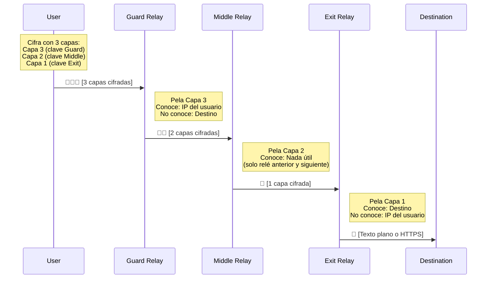
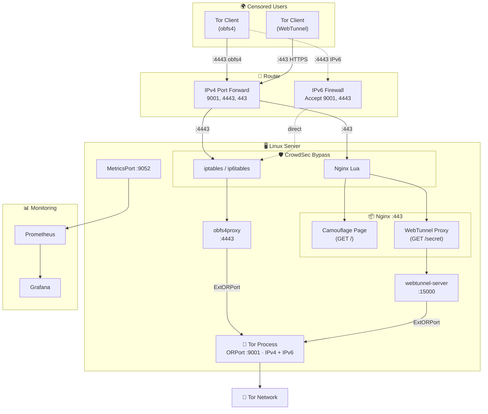

import Callout from "@components/ui/Callout.astro";
import TLDRSummary from "@components/ui/TLDRSummary.astro";
import CheckList from "@components/ui/CheckList.astro";
import StepByStep from "@components/ui/StepByStep.astro";
import KeyValue from "@components/ui/KeyValue.astro";
import Prerequisite from "@components/ui/Prerequisite.astro";
import FileContent from "@components/ui/FileContent.astro";
import Mermaid from "@components/ui/Mermaid.astro";
import TerminalCommand from "@components/ui/TerminalCommand.astro";
import TerminalOutput from "@components/ui/TerminalOutput.astro";
import Table from "@components/ui/Table.astro";
import Code from "@components/ui/Code.astro";
import Collapsible from "@components/ui/Collapsible.astro";
import Timeline from "@components/ui/Timeline.astro";
import DecisionTree from "@components/ui/DecisionTree.astro";
import BeforeAfter from "@components/ui/BeforeAfter.astro";
import SecurityRating from "@components/ui/SecurityRating.astro";


En 2026, más de **2.5 millones de personas** usan la [red Tor](https://www.torproject.org/) todos los días para acceder a Internet libre y abierto. Periodistas en regímenes autoritarios, activistas organizando protestas, denunciantes exponiendo corrupción y ciudadanos ordinarios protegiendo su privacidad — todos ellos dependen de una red que es completamente **operada por voluntarios**.

¿El problema? Solo hay aproximadamente **2,000 bridges** sirviendo a esos millones de usuarios. Los bridges son el recurso más crítico y escaso en el ecosistema Tor — son el primer punto de contacto para usuarios en países censurados, y cada nuevo bridge ayuda directamente a alguien a acceder a la información libremente.

Esta guía te enseñará todo lo que necesitas saber sobre la red Tor, el enrutamiento onion, y cómo configurar un **bridge obfs4 + WebTunnel listo para producción** en Linux — completo con camuflaje Nginx, endurecimiento de firewall, monitoreo con Prometheus e integración con CrowdSec.

<TLDRSummary title="TL;DR — Lo Que Construirás">
- Un bridge Tor ejecutando dos pluggable transports simultáneamente: **obfs4** (tráfico aleatorizado) y **WebTunnel** (camuflaje HTTPS)
- Un **proxy inverso Nginx** que hace que el tráfico WebTunnel sea indistinguible de la navegación HTTPS normal
- **Reenvío de puertos** y reglas de firewall para entornos NAT
- **Métricas de Prometheus** exportables a Grafana para monitoreo en tiempo real
- Reglas de **bypass de CrowdSec** para que tu IDS no bloquee clientes legítimos de Tor
- Un stack de servicios **gestionado por systemd** que sobrevive reinicios
</TLDRSummary>

---

## La Red Tor: Una Introducción

### ¿Qué es Tor?

**[Tor](https://en.wikipedia.org/wiki/Tor_(network))** (The Onion Router) es una red descentralizada operada por voluntarios, diseñada para proteger la privacidad de los usuarios y resistir la censura. Cuando usas Tor, tu tráfico de Internet se enruta a través de una serie de relés cifrados, lo que hace que sea extremadamente difícil para cualquiera — tu ISP, gobierno o un actor malicioso — rastrear tu actividad y asociarla contigo.

Pero Tor no es solo una herramienta de privacidad. Es una parte esencial de la **infraestructura de derechos humanos**. En países como China, Irán, Rusia y Myanmar, donde los gobiernos bloquean activamente el acceso a la información, Tor es a menudo la única forma para que los ciudadanos accedan a Internet sin censura.

<Callout type="info" title="Una Idea Equivocada Común">
Solo alrededor del **1.5%** del tráfico de Tor va a sitios `.onion` (el llamado "dark web"). La gran mayoría — más del **98%** — son personas ordinarias navegando Internet regularmente de forma privada. Tor es principalmente una herramienta de privacidad y anti-censura, no una puerta de entrada a contenido ilegal.
</Callout>

### Una Breve Historia

Los [orígenes de Tor](https://www.onion-router.net/History.html) se remontan a los años 90 en el **Laboratorio de Investigación Naval de EE.UU.** (NRL), donde investigadores [Paul Syverson](https://en.wikipedia.org/wiki/Paul_Syverson), David Goldschlag y Michael Reed desarrollaron el concepto de [enrutamiento onion](https://en.wikipedia.org/wiki/Onion_routing) — una técnica para comunicación anónima sobre una red de computadoras. Puedes leer más sobre [el historial completo de Tor](https://www.torproject.org/about/history/) en el sitio oficial.

<Timeline events={[
  { date: "1995", title: "Enrutamiento Onion Inventado", description: "Syverson, Goldschlag y Reed en el Laboratorio de Investigación Naval de EE.UU. desarrollan el concepto de cifrado en capas para comunicación anónima.", type: "milestone" },
  { date: "2002", title: "Proyecto Tor Lanzado", description: "Roger Dingledine y Nick Mathewson (graduados del MIT) se unen a Syverson para construir 'The Onion Router' — Tor. El código se lanza como software de código abierto con aproximadamente una docena de nodos voluntarios.", type: "success" },
  { date: "2004", title: "EFF Comienza a Financiar", description: "La Electronic Frontier Foundation reconoce la importancia de Tor para los derechos digitales y proporciona financiamiento crítico temprano. NRL libera el código al dominio público.", type: "success" },
  { date: "2006", title: "Tor Project, Inc. Fundada", description: "El Proyecto Tor se convierte en una organización sin fines de lucro 501(c)(3) con sede en Massachusetts, asegurando desarrollo y gobierno a largo plazo.", type: "milestone" },
  { date: "2007", title: "Bridges Presentados", description: "Se desarrollan direcciones de relé secretas (bridges) para ayudar a los usuarios a eludir firewalls en países censurados donde el directorio de Tor está bloqueado.", type: "success" },
  { date: "2008", title: "Desarrollo del Navegador Tor Comienza", description: "Un navegador dedicado que empaqueta Tor en una aplicación fácil de usar, reduciendo dramáticamente la barrera de entrada para usuarios no técnicos.", type: "success" },
  { date: "2011", title: "Primavera Árabe", description: "Tor juega un papel crítico cuando activistas en Túnez, Egipto, Libia y Siria lo utilizan para organizar protestas y comunicarse de forma segura a pesar de la censura gubernamental.", type: "milestone" },
  { date: "2013", title: "Revelaciones de Snowden", description: "Las revelaciones de Edward Snowden sobre programas de vigilancia masiva global impulsan un aumento masivo en la adopción de Tor en todo el mundo.", type: "warning" },
  { date: "2023", title: "WebTunnel Lanzado", description: "Un nuevo pluggable transport que disfraza el tráfico de Tor como HTTPS ordinario, haciéndolo casi imposible de bloquear sin daño colateral.", type: "success" },
  { date: "2026", title: "Hoy", description: "~8,000 relés, ~2,000 bridges, y 2.5+ millones de usuarios diarios en más de 200 países. La red es completamente operada por voluntarios.", type: "default" },
]} />

### Cómo Funciona el Enrutamiento Onion

[El enrutamiento onion](https://en.wikipedia.org/wiki/Onion_routing) debe su nombre a las capas de una cebolla — tus datos se envuelven en **múltiples capas de cifrado**, y cada relé en el circuito "pela" una capa para revelar el siguiente destino. Ningún relé único conoce jamás tanto el origen como el destino del tráfico.

<Mermaid caption="Enrutamiento onion: tres capas de cifrado a través de tres relés" maxWidth="800px" ariaLabel="Diagrama que muestra cómo viajan los datos a través de un circuito Tor: el cliente del usuario encripta los datos con tres capas (una para cada relé), luego los envía a través de los relés guard, middle y exit. Cada relé elimina una capa de encriptación. El guard conoce al usuario pero no el destino. El exit conoce el destino pero no al usuario.">

</Mermaid>

Así es lo que hace esto seguro:

<Table title="Lo Que Cada Relé Conoce">
  <thead>
    <tr>
      <th scope="col">Relé</th>
      <th scope="col">Conoce</th>
      <th scope="col">No Conoce</th>
    </tr>
  </thead>
  <tbody>
    <tr>
      <td>**Guard** (Entrada)</td>
      <td>Tu dirección IP real</td>
      <td>Qué sitios web estás visitando</td>
    </tr>
    <tr>
      <td>**Middle**</td>
      <td>Solo relé anterior y siguiente</td>
      <td>Ni tu IP ni tu destino</td>
    </tr>
    <tr>
      <td>**Exit**</td>
      <td>El sitio web de destino</td>
      <td>Tu dirección IP real</td>
    </tr>
  </tbody>
</Table>

Detalles técnicos clave de la [construcción de circuitos](https://spec.torproject.org/tor-spec/creating-circuits.html) de Tor (ver también la [descripción general del sistema](https://tpo.pages.torproject.net/core/torspec/tor-spec/system-overview.html) en la especificación de Tor):

- **Selección de ruta de circuito**: El cliente selecciona aleatoriamente relés, evitando dos relés en la misma subred `/16` o país para diversidad.
- **Intercambio de claves**: Cada salto utiliza un **apretón de manos ntor** (basado en Curve25519) para establecer un secreto compartido, proporcionando secreto futuro perfecto.
- **Celdas de tamaño fijo**: Todos los datos dentro de Tor se transmiten en **celdas de 512 bytes**, previniendo análisis de tráfico basado en tamaño de paquete.
- **Rotación de circuito**: Los circuitos se rotan aproximadamente cada **10 minutos** para limitar la ventana para ataques de correlación de tráfico.
- **Autoridades de directorio**: Nueve servidores de confianza mantienen consenso sobre el estado de la red, claves de relé e indicadores.

---

## El Ecosistema Tor: Tipos de Voluntarios

La red Tor está compuesta por diferentes tipos de nodos operados por voluntarios, cada uno sirviendo un propósito distinto:

<Table title="Roles de Voluntarios de Tor">
  <thead>
    <tr>
      <th scope="col">Rol</th>
      <th scope="col">Qué Hace</th>
      <th scope="col">Nivel de Riesgo</th>
      <th scope="col">Impacto</th>
    </tr>
  </thead>
  <tbody>
    <tr>
      <td>**Guard Relay**</td>
      <td>Primer salto del circuito. Ve la IP del usuario pero no el destino.</td>
      <td>Bajo</td>
      <td>Alto — proporciona ancho de banda</td>
    </tr>
    <tr>
      <td>**Middle Relay**</td>
      <td>Salto intermedio. No ve nada útil.</td>
      <td>Muy Bajo</td>
      <td>Medio — añade ancho de banda y diversidad de ruta</td>
    </tr>
    <tr>
      <td>**Exit Relay**</td>
      <td>Último salto. Se conecta al destino en nombre del usuario.</td>
      <td>Alto</td>
      <td>Muy Alto — el recurso más necesario y escaso</td>
    </tr>
    <tr>
      <td>**Bridge**</td>
      <td>Punto de entrada oculto para usuarios en países censurados. No está listado en el directorio público de Tor.</td>
      <td>Bajo</td>
      <td>**Crítico** — habilita directamente la evasión de censura</td>
    </tr>
    <tr>
      <td>**Snowflake Proxy**</td>
      <td>Proxy WebRTC efímero que ayuda a los usuarios censurados a llegar a la red Tor.</td>
      <td>Muy Bajo</td>
      <td>Medio — fácil de ejecutar, incluso en una pestaña del navegador</td>
    </tr>
    <tr>
      <td>**Directory Authority**</td>
      <td>Servidor de confianza que mantiene el consenso de la red.</td>
      <td>N/A</td>
      <td>Crítico — solo existen 9, ejecutados por el Proyecto Tor</td>
    </tr>
  </tbody>
</Table>

<Callout type="tip" title="Por Qué los Bridges Son Tan Importantes Ahora">
A partir de 2026, la [red Tor tiene aproximadamente **8,000 relés** pero solo alrededor de **2,000 bridges**](https://metrics.torproject.org/). Los bridges son particularmente valiosos porque sirven a usuarios que están **activamente bloqueados** de acceder a Tor — personas en países como China, Irán y Rusia donde el gobierno bloquea conexiones a relés Tor conocidos. Cada nuevo bridge es una **línea de vida** para alguien bajo censura.
</Callout>

### Entender los Pluggable Transports

Los censores no solo bloquean Tor por IP — usan **Inspección Profunda de Paquetes (DPI)** para identificar y bloquear el protocolo Tor en sí. Los [pluggable transports](https://arxiv.org/pdf/2309.14856) resuelven esto disfrazando el tráfico de Tor como algo completamente diferente.

<Table title="Comparación de Pluggable Transports">
  <thead>
    <tr>
      <th scope="col">Transporte</th>
      <th scope="col">Método de Disfraz</th>
      <th scope="col">Resistencia a Censura</th>
      <th scope="col">Velocidad</th>
      <th scope="col">Despliegue</th>
    </tr>
  </thead>
  <tbody>
    <tr>
      <td>**[obfs4](https://gitlab.torproject.org/tpo/anti-censorship/pluggable-transports/lyrebird)**</td>
      <td>Hace que el tráfico parezca bytes aleatorios</td>
      <td>Alto — resiste la huella dactilar DPI</td>
      <td>Rápido</td>
      <td>Ampliamente implementado, fácil de configurar</td>
    </tr>
    <tr>
      <td>**[WebTunnel](https://gitlab.torproject.org/tpo/anti-censorship/pluggable-transports/webtunnel)**</td>
      <td>Imita tráfico HTTPS/WebSocket</td>
      <td>Muy Alto — parece navegación web normal</td>
      <td>Rápido</td>
      <td>Más nuevo, requiere servidor web + dominio</td>
    </tr>
    <tr>
      <td>**Snowflake**</td>
      <td>Usa WebRTC a través de proxies efímeros</td>
      <td>Muy Alto — los proxies rotan constantemente</td>
      <td>Variable</td>
      <td>Solo cliente (los voluntarios ejecutan proxies de navegador)</td>
    </tr>
    <tr>
      <td>**meek**</td>
      <td>Disfraza el tráfico como solicitudes a servicios en la nube (Azure, CDN)</td>
      <td>Extremo — bloquearlo significa bloquear servicios en la nube</td>
      <td>Lento</td>
      <td>Costoso de mantener, último recurso</td>
    </tr>
  </tbody>
</Table>

<DecisionTree question="¿Cuál deberías ejecutar? Así es como decidir:">
<details>
<summary>Quiero máximo impacto con mínima complejidad</summary>

Ejecuta un **bridge obfs4**. Es el pluggable transport más ampliamente implementado, fácil de configurar y sirve al número más grande de usuarios. Este es donde el Proyecto Tor necesita la ayuda más. 
</details>
<details>
<summary>Ya tengo un servidor web y nombre de dominio</summary>

Ejecuta **ambos obfs4 y WebTunnel**. WebTunnel disfraza el tráfico de Tor como navegación HTTPS normal, haciéndolo casi imposible de bloquear. Cuando se combinan con obfs4, proporcionas dos métodos de evasión diferentes desde un único servidor.
</details>
<details>
<summary>No tengo un servidor, pero quiero ayudar ahora mismo</summary>

Instala la [extensión del navegador Snowflake](https://snowflake.torproject.org/) — toma 30 segundos y convierte tu navegador en un proxy temporal para usuarios censurados. Sin mantenimiento requerido.
</details>
<details>
<summary>Quiero contribuir el máximo ancho de banda a la red</summary>

Ejecuta un **relé middle** o (si estás cómodo con las implicaciones legales) un **relé exit**. Estos proporcionan capacidad de ancho de banda bruto para toda la red. Considera ejecutarlos en un VPS con un ISP que explícitamente permita tráfico Tor.
</details>
</DecisionTree>

En esta guía, configuraremos **tanto obfs4 como WebTunnel** en el mismo servidor — maximizando tu impacto con una máquina única.

---

## Requisitos Previos

<Prerequisite>
### Requisitos de Hardware
- **CPU**: Cualquier procesador x86_64 moderno (ARM también funciona)
- **RAM**: Mínimo 512 MB, 1 GB+ recomendado
- **Almacenamiento**: Mínimo 5 GB (para datos de Tor, registros y claves)
- **Red**: Al menos **10 Mbps** de ancho de banda de carga (más es mejor)
- **Tiempo de actividad**: El servidor debe ejecutarse 24/7 — Tor penaliza los relés inestables

### Requisitos de Software
- **Linux** distribution (esta guía usa Debian 12/13 o Ubuntu 22.04+)
- **Acceso root** (o privilegios sudo)
- **Nginx** (para disfraz de WebTunnel — no necesario solo para obfs4)
- **Un nombre de dominio** con DNS apuntando a tu servidor (solo para WebTunnel)
- **Certificado TLS** (Let's Encrypt es gratuito y perfecto para esto)

### Requisitos de Red
- Capacidad de **reenviar puertos** desde tu router (o usa un VPS con IP pública directa)
- Puertos **9001** (ORPort) y **4443** (obfs4) accesibles desde internet
- Puerto **443** (HTTPS) si ejecutas WebTunnel
</Prerequisite>

---

## Paso 1: Instalar Tor del Repositorio Oficial

<Callout type="warning" title="Siempre Usa el Repositorio Oficial de Tor">
Los paquetes de distribución (por ejemplo, `apt install tor`) a menudo están desactualizados por meses o incluso años. El Proyecto Tor mantiene su propio [repositorio Debian/Ubuntu](https://community.torproject.org/relay/setup/bridge/) con los lanzamientos estables más recientes, parches de seguridad y claves de firma. Siempre úsalo.
</Callout>

<StepByStep title="Instalar Tor y Dependencias">
<li>

**Instalar requisitos previos**

<TerminalCommand ariaLabel="Instalar paquetes necesarios">
```bash
sudo apt update
sudo apt install -y apt-transport-https gpg curl
```
</TerminalCommand>

</li>
<li>

**Añadir la clave GPG del Proyecto Tor**

<TerminalCommand ariaLabel="Descargar e instalar clave GPG de Tor Project">
```bash
curl -fsSL https://deb.torproject.org/torproject.org/A3C4F0F979CAA22CDBA8F512EE8CBC9E886DDD89.asc \
  | sudo gpg --dearmor -o /usr/share/keyrings/tor-archive-keyring.gpg
```
</TerminalCommand>

</li>
<li>

**Añadir el repositorio de Tor**

Reemplaza `CODENAME` con el nombre de código de tu distribución (por ejemplo, `bookworm`, `trixie`, `jammy`):

<TerminalCommand ariaLabel="Añadir repositorio APT de Tor">
```bash
CODENAME=$(lsb_release -cs)
echo "deb [signed-by=/usr/share/keyrings/tor-archive-keyring.gpg] \
  https://deb.torproject.org/torproject.org $CODENAME main" \
  | sudo tee /etc/apt/sources.list.d/tor.list
```
</TerminalCommand>

</li>
<li>

**Instalar Tor y obfs4proxy**

<TerminalCommand ariaLabel="Instalar Tor y obfs4proxy">
```bash
sudo apt update
sudo apt install -y tor deb.torproject.org-keyring obfs4proxy
```
</TerminalCommand>

Verifica la instalación:

<TerminalCommand ariaLabel="Verificar versiones de Tor y obfs4proxy">
```bash
tor --version
obfs4proxy -version
```
</TerminalCommand>

<TerminalOutput title="Salida esperada">
```
Tor version 0.4.9.6.
obfs4proxy-0.0.14
```
</TerminalOutput>

</li>
</StepByStep>

---

## Paso 2: Instalar WebTunnel (Opcional pero Recomendado)

WebTunnel es un pluggable transport más nuevo que disfraza conexiones de Tor como tráfico HTTPS regular. A diferencia de obfs4 (que se ve como datos aleatorios), WebTunnel realmente usa actualizaciones de WebSocket sobre HTTPS, haciéndolo **casi indistinguible de la navegación web legítima**. El Proyecto Tor proporciona [instrucciones de configuración oficiales](https://community.torproject.org/relay/setup/webtunnel/) y una guía para [construir desde la fuente](https://community.torproject.org/relay/setup/webtunnel/source/).

<Callout type="info" title="¿Por Qué Compilar desde la Fuente?">
En el momento de escribir, el binario `webtunnel-server` aún no está disponible como paquete Debian. El Proyecto Tor lo distribuye como un código fuente Go que necesita ser compilado, o como una imagen Docker. Compilaremos desde la fuente para una instalación nativa.
</Callout>

<StepByStep title="Compilar Servidor WebTunnel">
<li>

**Instalar Go** (si aún no está instalado)

<TerminalCommand ariaLabel="Instalar lenguaje de programación Go">
```bash
sudo apt install -y golang-go
```
</TerminalCommand>

Verifica que Go 1.21+ esté instalado:

<TerminalCommand ariaLabel="Verificar versión de Go">
```bash
go version
```
</TerminalCommand>

</li>
<li>

**Clonar y compilar WebTunnel**

<TerminalCommand ariaLabel="Clonar y compilar WebTunnel desde el código fuente">
```bash
cd /tmp
git clone https://gitlab.torproject.org/tpo/anti-censorship/pluggable-transports/webtunnel.git
cd webtunnel/main/server
go build -o webtunnel-server .
sudo cp webtunnel-server /usr/local/bin/
sudo chmod +x /usr/local/bin/webtunnel-server
```
</TerminalCommand>

</li>
<li>

**Verificar el binario**

<TerminalCommand ariaLabel="Verificar binario del servidor WebTunnel">
```bash
/usr/local/bin/webtunnel-server --help 2>&1 | head -5
```
</TerminalCommand>

</li>
</StepByStep>

---

## Paso 3: Configurar Tu Bridge de Tor

Ahora para la configuración principal. El archivo `torrc` controla todo el comportamiento de Tor.

<Callout type="warning" title="Antes de Editar">
Haz una copia de seguridad de la configuración original antes de hacer cambios:

<TerminalCommand ariaLabel="Hacer copia de seguridad del archivo torrc original">
```bash
sudo cp /etc/tor/torrc /etc/tor/torrc.backup
```
</TerminalCommand>
</Callout>

Reemplaza los contenidos de `/etc/tor/torrc` con:

<FileContent filename="/etc/tor/torrc" language="ini" collapsible={false}>
```ini
# =============================================================
# Tor Bridge Configuration — obfs4 + WebTunnel
# =============================================================

# --- General Settings ---
SocksPort 0                        # Not a client — disable SOCKS
RunAsDaemon 0                      # Managed by systemd
DataDirectory /var/lib/tor
Log notice file /var/log/tor/notices.log
Log notice syslog

# --- Security Hardening ---
DisableDebuggerAttachment 1        # Prevent ptrace/debugger attachment

# --- Bridge Mode ---
BridgeRelay 1                      # This is a bridge, not a relay
PublishServerDescriptor bridge     # Publish to BridgeDB (not public directory)

# --- ORPort — IPv4 (NAT from router) + IPv6 (direct, global) ---
# IMPORTANT: Use 0.0.0.0 for NAT environments, not 127.0.0.1
ORPort 0.0.0.0:9001
ORPort [YOUR_IPV6_ADDRESS]:9001
ExtORPort auto

# --- Contact & Identity ---
ContactInfo your-email<at>example<dot>com
Nickname YourBridgeName

# --- obfs4 Transport ---
# Port 4443 must be forwarded from your router
ServerTransportPlugin obfs4 exec /usr/bin/obfs4proxy
ServerTransportListenAddr obfs4 0.0.0.0:4443

# --- WebTunnel Transport ---
# Listens locally; Nginx reverse-proxies HTTPS to it
ServerTransportPlugin webtunnel exec /usr/local/bin/webtunnel-server
ServerTransportListenAddr webtunnel 127.0.0.1:15000
ServerTransportOptions webtunnel url=https://YOUR-DOMAIN/YOUR-SECRET-PATH

# --- Bandwidth Limits ---
# Adjust to what your connection can sustain (example: 250 Mbps)
RelayBandwidthRate 31 MBytes       # Sustained rate
RelayBandwidthBurst 35 MBytes     # Burst allowance

# --- Memory — cap internal queue memory (OOM protection) ---
MaxMemInQueues 4096 MB

# --- Statistics ---
ConnDirectionStatistics 1          # Enable connection direction stats

# --- DoS Protection ---
DoSRefuseSingleHopClientRendezvous 1

# --- Monitoring: Prometheus Metrics ---
MetricsPort 0.0.0.0:9052
MetricsPortPolicy accept 192.168.0.0/16
MetricsPortPolicy accept 127.0.0.0/8

# --- Control Port (for Nyx monitoring tool) ---
ControlPort 9051
CookieAuthentication 1
```
</FileContent>

Analicemos las secciones críticas:

<KeyValue
  title="Opciones de Configuración Clave Explicadas"
  items={[
    { key: "BridgeRelay 1", value: "Modo bridge", description: "Le dice a Tor que es un bridge, no un relay público. Los bridges no se enumeran en el directorio público de Tor." },
    { key: "ORPort 0.0.0.0:9001", value: "Onion Router Port (IPv4)", description: "El puerto que Tor usa para la comunicación entre relays. Usa 0.0.0.0 (no 127.0.0.1) si está detrás de NAT — Tor necesita vincularse en todas las interfaces para que el self-test pase." },
    { key: "ORPort [IPv6]:9001", value: "Onion Router Port (IPv6)", description: "Si tienes una dirección IPv6 global, añade una segunda línea ORPort con tu dirección IPv6 entre corchetes. IPv6 no requiere NAT — la dirección es directamente accesible." },
    { key: "ExtORPort auto", value: "Extended ORPort", description: "Canal de comunicación interno entre Tor y pluggable transports. 'auto' deja que Tor elija un puerto local aleatorio." },
    { key: "ServerTransportListenAddr obfs4", value: "Dirección de escucha de obfs4", description: "El puerto donde obfs4proxy escucha conexiones ofuscadas entrantes. Debe ser alcanzable desde Internet." },
    { key: "ServerTransportListenAddr webtunnel", value: "Dirección de escucha de WebTunnel", description: "Se vincula solo a 127.0.0.1 porque Nginx maneja el HTTPS público y realiza un proxy inverso a este puerto." },
    { key: "DisableDebuggerAttachment 1", value: "Endurecimiento de seguridad", description: "Impide que herramientas como ptrace o gdb se adjunten al proceso de Tor. Protege las claves criptográficas en memoria de volcados o depuración." },
    { key: "MaxMemInQueues 4096 MB", value: "Límite de memoria para colas", description: "Limita la memoria que Tor utiliza para colas de circuitos. Previene escenarios de OOM (sin memoria) en servidores con alta carga de tráfico." },
    { key: "ConnDirectionStatistics 1", value: "Estadísticas de dirección de conexiones", description: "Habilita la recopilación de estadísticas sobre la dirección de las conexiones (entrada vs. salida). Útil para análisis de tráfico del bridge." },
    { key: "DoSRefuseSingleHopClientRendezvous 1", value: "Protección DoS", description: "Rechaza clientes que intentan hacer rendiciones de un solo salto, lo cual es un patrón de ataque común contra bridges. Refuerza el modelo de seguridad de Tor." },
    { key: "MetricsPort", value: "Punto final de Prometheus", description: "Expone métricas internas de Tor en formato Prometheus. Restringe el acceso con MetricsPortPolicy." },
  ]}
/>

<Callout type="error" title="Crítico: ORPort Detrás de NAT">
Si tu servidor está detrás de un router (NAT), usar `ORPort 127.0.0.1:auto` **fallará** en la prueba de auto-accesibilidad. Tor necesita verificar que su ORPort sea accesible desde Internet, y vincular a localhost previene esto. Siempre usa `ORPort 0.0.0.0:9001` (o tu IP específica de LAN) y reenvía el puerto 9001 desde tu router.
</Callout>

<Callout type="info" title="Dual-Stack: IPv4 + IPv6">
Si tu ISP proporciona una dirección IPv6 global, puedes añadir una segunda línea `ORPort` con tu dirección IPv6. Esto permite que tu bridge acepte conexiones tanto IPv4 como IPv6, aumentando la accesibilidad para usuarios censurados. Para encontrar tu IPv6:
<TerminalCommand ariaLabel="Encontrar tu dirección IPv6 global">
```bash
ip -6 addr show scope global | grep inet6 | awk '{print $2}' | cut -d/ -f1 | head -1
```
</TerminalCommand>
</Callout>

### Generar una Ruta Secreta de WebTunnel

El transporte WebTunnel usa una ruta de URL secreta que actúa como un token de autenticación. Genera una cadena aleatoria de 24 caracteres:

<TerminalCommand ariaLabel="Generar una ruta secreta aleatoria para WebTunnel">
```bash
echo $(cat /dev/urandom | tr -cd 'a-zA-Z0-9' | head -c 24)
```
</TerminalCommand>

<TerminalOutput title="Salida de ejemplo">
```
7Zkw18j2NWGK9X7PiiPUQRJB
```
</TerminalOutput>

Usa este valor en dos lugares:
1. El `torrc`: `ServerTransportOptions webtunnel url=https://your-domain.com/YOUR_SECRET`
2. La configuración de Nginx: `location = /YOUR_SECRET`

---

## Paso 4: Configurar Nginx para Camuflaje WebTunnel

La belleza de WebTunnel es que tu servidor se ve como un **sitio web completamente normal**. Los visitantes ven una página HTML regular; solo aquellos que conocen la ruta secreta pueden conectarse al bridge de Tor. Esto se llama **camuflaje** o **domain fronting**.

<StepByStep title="Configurar Camuflaje de Nginx">
<li>

**Crear un sitio web de camuflaje**

Esto es lo que ven los visitantes (y censores) cuando visitan tu dominio:

<TerminalCommand ariaLabel="Crear directorio y página de sitio web de camuflaje">
```bash
sudo mkdir -p /var/www/tor-camouflage
cat << 'EOF' | sudo tee /var/www/tor-camouflage/index.html
<!DOCTYPE html>
<html lang="en">
<head>
    <meta charset="UTF-8">
    <meta name="viewport" content="width=device-width, initial-scale=1.0">
    <title>Welcome</title>
    <style>
        body { font-family: system-ui, sans-serif; max-width: 800px;
               margin: 50px auto; padding: 20px; color: #333; }
        h1 { color: #2c3e50; }
    </style>
</head>
<body>
    <h1>Welcome</h1>
    <p>This is a personal project page. Nothing to see here.</p>
</body>
</html>
EOF
```
</TerminalCommand>

</li>
<li>

**Obtener un certificado TLS** (si aún no tienes uno)

<TerminalCommand ariaLabel="Obtener certificado de Let's Encrypt">
```bash
sudo apt install -y certbot python3-certbot-nginx
sudo certbot --nginx -d your-domain.com
```
</TerminalCommand>

</li>
<li>

**Crear el bloque de servidor de Nginx**

<FileContent filename="/etc/nginx/sites-available/tor-bridge.conf" language="nginx">
```nginx
# Tor WebTunnel Bridge — Camouflage configuration
# This looks like a normal HTTPS website but proxies
# a secret path to the WebTunnel pluggable transport

server {
    listen 443 ssl;
    listen [::]:443 ssl;
    http2 on;

    server_name your-domain.com;

    # TLS certificates
    ssl_certificate     /etc/letsencrypt/live/your-domain.com/fullchain.pem;
    ssl_certificate_key /etc/letsencrypt/live/your-domain.com/privkey.pem;
    ssl_protocols       TLSv1.2 TLSv1.3;
    ssl_ciphers         HIGH:!aNULL:!MD5;

    # === Normal website (camouflage) ===
    root /var/www/tor-camouflage;
    index index.html;

    location / {
        try_files $uri $uri/ =404;
    }

    # === WebTunnel reverse proxy (secret path) ===
    # Replace YOUR_SECRET_PATH with your generated secret
    location = /YOUR_SECRET_PATH {
        proxy_pass http://127.0.0.1:15000;
        proxy_http_version 1.1;

        # WebSocket upgrade headers (required for WebTunnel)
        proxy_set_header Upgrade $http_upgrade;
        proxy_set_header Connection "upgrade";

        # Standard proxy headers
        proxy_set_header Host $host;
        proxy_set_header X-Real-IP $remote_addr;
        proxy_set_header X-Forwarded-For $proxy_add_x_forwarded_for;
        proxy_set_header X-Forwarded-Proto $scheme;
        proxy_set_header Accept-Encoding "";
        add_header Front-End-Https on;

        proxy_redirect off;
        proxy_buffering off;
        proxy_request_buffering off;

        # Long timeout for persistent Tor connections
        proxy_read_timeout 36000s;
        proxy_send_timeout 36000s;

        # Disable logging for the secret path (privacy)
        access_log off;
        error_log off;
    }
}

# HTTP to HTTPS redirect
server {
    listen 80;
    listen [::]:80;
    server_name your-domain.com;
    return 301 https://$host$request_uri;
}
```
</FileContent>

</li>
<li>

**Habilitar el sitio y probar**

<TerminalCommand ariaLabel="Habilitar sitio Nginx y probar configuración">
```bash
sudo ln -sf /etc/nginx/sites-available/tor-bridge.conf \
    /etc/nginx/sites-enabled/
sudo nginx -t && sudo systemctl reload nginx
```
</TerminalCommand>

</li>
</StepByStep>

<BeforeAfter beforeLabel="Lo que ven los censores" afterLabel="Lo que realmente sucede">
<div slot="before">

**Sitio web HTTPS normal**

Una solicitud `GET /` a tu dominio devuelve una página HTML simple. DPI ve tráfico TLS 1.3 estándar a un dominio registrado. Nada sospechoso.

```
HTTP/1.1 200 OK
Content-Type: text/html
<html>Welcome...</html>
```
</div>
<div slot="after">

**Conexión del bridge de WebTunnel**

Una solicitud `GET /SECRET_PATH` con un encabezado `Connection: Upgrade` llega al servidor WebTunnel, que establece un túnel persistente para tráfico de Tor — todo dentro de la misma sesión TLS.

```
HTTP/1.1 101 Switching Protocols
Upgrade: websocket
Connection: Upgrade
[El tráfico de Tor fluye a través del túnel]
```
</div>
</BeforeAfter>

---

## Paso 5: Configurar Reenvío de Puertos

Si tu servidor está detrás de un router (común en configuraciones domésticas), necesitas reenviar los siguientes puertos desde la IP pública de tu router a tu IP local de servidor:

<Table title="Reenvíos de Puertos Requeridos">
  <thead>
    <tr>
      <th scope="col">Puerto</th>
      <th scope="col">Protocolo</th>
      <th scope="col">Propósito</th>
      <th scope="col">¿Requerido?</th>
    </tr>
  </thead>
  <tbody>
    <tr>
      <td>**9001**</td>
      <td>TCP</td>
      <td>ORPort — comunicación entre relays</td>
      <td>Sí (siempre)</td>
    </tr>
    <tr>
      <td>**4443**</td>
      <td>TCP</td>
      <td>obfs4 — transporte ofuscado</td>
      <td>Sí (si ejecuta obfs4)</td>
    </tr>
    <tr>
      <td>**443**</td>
      <td>TCP</td>
      <td>HTTPS — WebTunnel vía Nginx</td>
      <td>Sí (si ejecuta WebTunnel)</td>
    </tr>
  </tbody>
</Table>

Los pasos exactos dependen de tu router. Aquí está el proceso general:

<StepByStep title="Reenvío de Puertos de Router Genérico">
<li>

**Accede al panel de administración de tu router** (usualmente en `192.168.0.1` o `192.168.1.1`)

</li>
<li>

**Encuentra la sección de reenvío de puertos** (a menudo bajo "NAT", "Firewall" o "Port Forwarding")

</li>
<li>

**Crea reglas para cada puerto:**
- **Puerto externo**: 9001 → **IP interna**: la IP de LAN de tu servidor → **Puerto interno**: 9001
- **Puerto externo**: 4443 → **IP interna**: la IP de LAN de tu servidor → **Puerto interno**: 4443
- **Puerto externo**: 443 → **IP interna**: la IP de LAN de tu servidor → **Puerto interno**: 443 (si no está ya reenviado)

</li>
<li>

**Guarda y aplica** los cambios

</li>
</StepByStep>

### Firewall del Servidor (UFW)

Si estás usando UFW (Firewall Sin Complicaciones) en tu servidor:

<TerminalCommand ariaLabel="Configurar UFW para puertos del puente Tor">
```bash
sudo ufw allow 9001/tcp comment "Tor ORPort"
sudo ufw allow 4443/tcp comment "Tor obfs4 Bridge"
# Port 443 is likely already open if you run Nginx
sudo ufw allow 443/tcp comment "HTTPS"
sudo ufw reload
```
</TerminalCommand>

Si usas `iptables` directamente:

<TerminalCommand ariaLabel="Configurar iptables para puertos del puente Tor">
```bash
sudo iptables -A INPUT -p tcp --dport 9001 -j ACCEPT
sudo iptables -A INPUT -p tcp --dport 4443 -j ACCEPT
sudo iptables -A INPUT -p tcp --dport 443 -j ACCEPT
```
</TerminalCommand>

### IPv6: Sin NAT Necesario

<Callout type="info" title="IPv6 es Directo — Sin Reenvío de Puertos">
A diferencia de IPv4, las direcciones IPv6 son globalmente enrutables. Tu servidor ya es directamente accesible en su dirección IPv6 — no se necesita NAT ni reenvío de puertos. Solo necesitas asegurarte de que las reglas de firewall de tu router **permitan** el tráfico entrante en el ORPort (TCP 9001) hacia tu servidor. Si usas MikroTik, añade una regla en el firewall IPv6 para aceptar tráfico TCP al puerto 9001 en la dirección de tu servidor.
</Callout>

Verifica que el puerto IPv6 esté abierto:

<TerminalCommand ariaLabel="Verificar que el puerto IPv6 esté escuchando y accesible">
```bash
# Verifica que Tor escuche en IPv6
ss -tlnp6 | grep 9001

# Prueba de accesibilidad IPv6 desde otra máquina
nc -6zv TU_DIRECCIÓN_IPV6 9001
```
</TerminalCommand>

---

## Paso 6: Configuración de AppArmor

En sistemas Debian/Ubuntu, AppArmor puede restringir lo que Tor y obfs4proxy pueden hacer. Necesitas asegurar que el perfil de obfs4proxy permita la ejecución:

<TerminalCommand ariaLabel="Configurar AppArmor para obfs4proxy">
```bash
# Check if the profile exists
sudo aa-status 2>/dev/null | grep obfs4proxy

# If restricted, set to complain mode
sudo aa-complain /usr/bin/obfs4proxy 2>/dev/null

# Or create an explicit allow rule
echo "/usr/bin/obfs4proxy mr," | sudo tee -a /etc/apparmor.d/local/system_tor
sudo apparmor_parser -r /etc/apparmor.d/system_tor
```
</TerminalCommand>

---

## Paso 7: Iniciar y Verificar

<StepByStep title="Iniciar el Puente">
<li>

**Inicia Tor**

<TerminalCommand ariaLabel="Reiniciar servicio de Tor">
```bash
sudo systemctl restart tor
```
</TerminalCommand>

</li>
<li>

**Verifica los logs para ver si el bootstrap fue exitoso**

<TerminalCommand ariaLabel="Observar el proceso de arranque de Tor">
```bash
sudo journalctl -u tor -f --no-pager | head -30
```
</TerminalCommand>

Busca estos mensajes clave:

<TerminalOutput title="Salida de bootstrap exitoso">
```
Bootstrapped 0% (starting): Starting
Bootstrapped 5% (conn): Connecting to a relay
Bootstrapped 10% (conn_done): Connected to a relay
Bootstrapped 14% (handshake): Handshaking with a relay
Bootstrapped 15% (handshake_done): Handshake with a relay done
Bootstrapped 75% (enough_dirinfo): Loaded enough directory info to build circuits
Bootstrapped 90% (ap_handshake_done): Handshake finished with a relay to build circuits
Bootstrapped 95% (circuit_create): Establishing a Tor circuit
Bootstrapped 100% (done): Done
Self-testing indicates your ORPort 86.x.x.x:9001 is reachable from the outside. Excellent.
Registered server transport 'obfs4' at '0.0.0.0:4443'
Registered server transport 'webtunnel' at '127.0.0.1:15000'
```
</TerminalOutput>

</li>
<li>

**Verifica que los tres procesos estén en ejecución**

<TerminalCommand ariaLabel="Verificar que Tor, obfs4proxy y webtunnel-server estén ejecutándose">
```bash
ps aux | grep -E "(tor|obfs4|webtunnel)" | grep -v grep
```
</TerminalCommand>

Deberías ver tres procesos: `tor`, `obfs4proxy`, y `webtunnel-server`.

</li>
<li>

**Verifica que todos los puertos estén en escucha**

<TerminalCommand ariaLabel="Verificar puertos en escucha para el puente Tor">
```bash
ss -tlnp | grep -E "(9001|4443|15000|9051|9052)"
```
</TerminalCommand>

<TerminalOutput title="Puertos esperados en escucha">
```
LISTEN  0  4096   0.0.0.0:9001   0.0.0.0:*  users:(("tor",pid=...,fd=...))
LISTEN  0  4096   0.0.0.0:4443   0.0.0.0:*  users:(("obfs4proxy",pid=...,fd=...))
LISTEN  0  4096 127.0.0.1:15000  0.0.0.0:*  users:(("webtunnel-ser",pid=...,fd=...))
LISTEN  0  4096 127.0.0.1:9051   0.0.0.0:*  users:(("tor",pid=...,fd=...))
LISTEN  0  4096   0.0.0.0:9052   0.0.0.0:*  users:(("tor",pid=...,fd=...))
```
</TerminalOutput>

</li>
<li>

**Recupera la huella digital de tu puente**

<TerminalCommand ariaLabel="Obtener huella digital del puente">
```bash
cat /var/lib/tor/fingerprint
```
</TerminalCommand>

</li>
</StepByStep>

### Verificar Accesibilidad Externa

Desde otra máquina (o usando un verificador de puertos en línea), verifica que tus puertos sean accesibles:

<TerminalCommand ariaLabel="Probar accesibilidad de ORPort desde otra máquina">
```bash
# From another machine:
nc -zv YOUR_PUBLIC_IP 9001
nc -zv YOUR_PUBLIC_IP 4443
curl -I https://your-domain.com/
```
</TerminalCommand>

<Callout type="tip" title="El ORPort Self-Test">
Tor realiza su propio self-test de accesibilidad durante el bootstrap. Si ves `Self-testing indicates your ORPort is reachable from the outside`, estás bien. Si el self-test falla, verifica nuevamente tus reglas de reenvío de puertos y la configuración del firewall.
</Callout>

---

## Paso 8: Monitoreo con Prometheus y Grafana

Tor expone un conjunto rico de métricas vía su `MetricsPort` en formato Prometheus. Estas métricas te permiten monitorear el uso de ancho de banda, conexiones, construcción de circuitos y la salud del relay en tiempo real.

### Configurar Scraping de Prometheus

Añade un target de scrape para tu puente Tor en tu configuración de Prometheus:

<FileContent filename="prometheus.yml (fragmento)" icon="mdi:file-settings-outline" language="yaml">
```yaml
scrape_configs:
  - job_name: 'tor-bridge'
    scrape_interval: 30s
    scrape_timeout: 10s
    metrics_path: '/metrics'
    static_configs:
      - targets: ['YOUR_SERVER_IP:9052']
        labels:
          instance: 'tor-bridge'
          nickname: 'YourBridgeName'
```
</FileContent>

<Callout type="info" title="Firewall para el Puerto de Métricas">
El MetricsPort (9052) solo debe ser accesible desde tu servidor de monitoreo, no desde Internet pública. Usa `MetricsPortPolicy accept YOUR_MONITORING_IP/32` en `torrc` y restringe el acceso a través del firewall:

<TerminalCommand ariaLabel="Restringir MetricsPort al servidor de monitoreo">
```bash
sudo ufw allow from YOUR_MONITORING_IP to any port 9052 proto tcp \
  comment "Prometheus: Tor Bridge Metrics"
```
</TerminalCommand>
</Callout>

### Métricas Clave para Monitorear

Tor expone docenas de métricas de Prometheus. Aquí están las más importantes para un operador de puente:

<Table title="Métricas Esenciales de Prometheus de Tor">
  <thead>
    <tr>
      <th scope="col">Métrica</th>
      <th scope="col">Tipo</th>
      <th scope="col">Lo que te dice</th>
    </tr>
  </thead>
  <tbody>
    <tr>
      <td>`tor_relay_connections_total`</td>
      <td>Counter</td>
      <td>Conexiones totales por tipo y dirección (inbound/outbound, OR/directory)</td>
    </tr>
    <tr>
      <td>`tor_relay_traffic_bytes`</td>
      <td>Counter</td>
      <td>Bytes totales leídos/escritos — tu contribución de ancho de banda a la red</td>
    </tr>
    <tr>
      <td>`tor_relay_flag`</td>
      <td>Gauge</td>
      <td>Banderas de directorio asignadas a tu relay (Stable, Running, Valid, etc.)</td>
    </tr>
    <tr>
      <td>`tor_relay_circuits_total`</td>
      <td>Gauge</td>
      <td>Número de circuitos activos por estado (abiertos, cerrados, etc.)</td>
    </tr>
    <tr>
      <td>`tor_relay_streams_total`</td>
      <td>Counter</td>
      <td>Streams procesados — un proxy para conexiones reales de usuarios</td>
    </tr>
    <tr>
      <td>`tor_relay_load_oom_bytes_total`</td>
      <td>Counter</td>
      <td>Eventos sin memoria — si aumenta, añade más RAM</td>
    </tr>
    <tr>
      <td>`tor_relay_load_tcp_exhaustion_total`</td>
      <td>Counter</td>
      <td>Agotamiento de puertos TCP — si aumenta, ajusta la configuración de red del kernel</td>
    </tr>
    <tr>
      <td>`process_resident_memory_bytes`</td>
      <td>Gauge</td>
      <td>Uso actual de RAM del proceso Tor</td>
    </tr>
    <tr>
      <td>`process_cpu_seconds_total`</td>
      <td>Counter</td>
      <td>Tiempo de CPU consumido por Tor</td>
    </tr>
  </tbody>
</Table>

### Dashboard de Grafana

Puedes construir un panel de control Grafana comprehensivo con paneles para:

1. **Ancho de banda** — `rate(tor_relay_traffic_bytes[5m])` — throughput en tiempo real entrada/salida
2. **Conexiones** — `tor_relay_connections_total` por tipo — quién está conectándose
3. **Banderas del Relay** — `tor_relay_flag` — ¿ha reconocido la red tu puente?
4. **Circuitos** — `tor_relay_circuits_total` — cuántos circuitos están activos
5. **Recursos del Sistema** — `process_resident_memory_bytes`, `process_cpu_seconds_total`
6. **Salud** — `tor_relay_load_oom_bytes_total`, `tor_relay_load_tcp_exhaustion_total`

<Callout type="tip" title="Línea de Tiempo de Banderas del Relay">
Después de iniciar tu puente, las banderas del relé aparecerán gradualmente:

- **Running**: ~1 hora después de iniciar
- **Valid**: ~1 hora
- **Stable**: ~7 días de tiempo de actividad continuo
- **Guard**: ~8 días (si es aplicable)

Sé paciente — las autoridades de directorio de Tor tardan en confiar en nuevos relays. Mantén tu puente ejecutándose constantemente y las banderas llegarán.
</Callout>

### Nyx: Monitoreo Basado en Terminal

[Nyx](https://nyx.torproject.org/) es una interfaz de usuario de terminal para monitorear Tor en tiempo real. Se conecta al ControlPort y muestra gráficos de ancho de banda, conexiones, circuitos y configuración.

<TerminalCommand ariaLabel="Instalar y ejecutar Nyx">
```bash
sudo apt install -y nyx
sudo -u debian-tor nyx
```
</TerminalCommand>

---

## Paso 9: Integración con CrowdSec (Si Aplica)

Si ejecutas [CrowdSec](https://www.crowdsec.net/) en el mismo servidor (común cuando ejecutas Nginx), enfrentarás un desafío: CrowdSec está diseñado para bloquear IPs maliciosas, pero **los clientes del puente Tor pueden desencadenar falsos positivos**. Los usuarios legítimos de Tor que se conectan a tu puente podrían ser bloqueados por tu propio IDS.

<Callout type="warning" title="El Problema">
El bouncer de firewall de CrowdSec añade una `CROWDSEC_CHAIN` en la parte superior de tu cadena INPUT de iptables, y el bouncer de Nginx comprueba cada solicitud contra una lista de bloqueos. Ambos pueden bloquear inadvertidamente a clientes legítimos del puente Tor.
</Callout>

La solución es un **bypass de tres capas** que asegura que el tráfico de Tor nunca sea bloqueado:

### Capa 1: iptables — Eludir el Firewall Bouncer

Inserta reglas ACCEPT para puertos específicos de Tor **antes** del CROWDSEC_CHAIN:

<TerminalCommand ariaLabel="Añadir reglas de bypass de iptables para puertos de Tor">
```bash
# IPv4
sudo iptables -I INPUT 1 -p tcp --dport 4443 -j ACCEPT  # obfs4
sudo iptables -I INPUT 1 -p tcp --dport 9001 -j ACCEPT  # ORPort

# IPv6
sudo ip6tables -I INPUT 1 -p tcp --dport 4443 -j ACCEPT
sudo ip6tables -I INPUT 1 -p tcp --dport 9001 -j ACCEPT
```
</TerminalCommand>

<Callout type="info" title="¿Por qué no el Puerto 443?">
El puerto 443 se comparte con todos tus servicios HTTPS, no solo Tor. Eludir CrowdSec para **todo** el tráfico HTTPS crearía un agujero de seguridad. En cambio, el bypass de WebTunnel para el puerto 443 se maneja a nivel de Nginx (Capa 2), donde podemos filtrar por nombre de dominio.
</Callout>

### Capa 2: Nginx — Eludir el Lua Bouncer

Si tu bouncer de Nginx de CrowdSec usa un `rewrite_by_lua_block` a nivel `http {}`, añade una excepción para tu dominio de Tor:

<FileContent filename="/etc/nginx/conf.d/crowdsec_nginx.conf (sección modificada)" language="lua">
```lua
rewrite_by_lua_block {
    local cs = require "plugins.crowdsec.lib.crowdsec"

    -- Bypass CrowdSec for Tor bridge domain
    if ngx.var.host == "your-tor-domain.com" then
        -- Skip CrowdSec check entirely for Tor bridge traffic
    else
        local ok, err = cs.Allow(ngx.var.remote_addr)
        if not ok then
            ngx.exit(ngx.HTTP_CLOSE)
        end
    end
}
```
</FileContent>

### Capa 3: Lista Blanca del Parser de CrowdSec

Incluso con lo anterior, CrowdSec seguirá **analizando** tus logs de Tor y puede crear decisiones locales. Crea una lista blanca del parser para que ignore todo el tráfico a tu dominio de Tor:

<FileContent filename="/etc/crowdsec/parsers/s02-enrich/tor-bridge-whitelist.yaml" language="yaml">
```yaml
name: custom/tor-bridge-whitelist
description: "Ignore all traffic to the Tor bridge domain"
whitelist:
  reason: "Tor bridge traffic — legitimate by definition"
  expression:
    - evt.Parsed.target_fqdn == 'your-tor-domain.com'
```
</FileContent>

Para que CrowdSec detecte el `target_fqdn`, tus logs de Nginx deben incluir la variable `$host`. Crea un formato de log personalizado:

<FileContent filename="/etc/nginx/conf.d/tor_log_format.conf" language="nginx">
```nginx
# Log format with vhost prefix for CrowdSec target_fqdn detection
log_format combined_vhost
    '$host $remote_addr - $remote_user [$time_local] '
    '"$request" $status $body_bytes_sent '
    '"$http_referer" "$http_user_agent"';
```
</FileContent>

Luego úsalo en tu bloque de servidor de Tor:

```nginx
access_log /var/log/nginx/tor.access.log combined_vhost;
```

Después de hacer cambios, recarga ambos servicios:

<TerminalCommand ariaLabel="Recargar CrowdSec y Nginx">
```bash
sudo systemctl reload crowdsec
sudo systemctl reload nginx
```
</TerminalCommand>

### Persistir Reglas de iptables Después de Reinicios

Las reglas de bypass de iptables se perderían en el reinicio. Crea un servicio systemd para reaplicarlas:

<FileContent filename="/etc/systemd/system/tor-bypass-crowdsec.service" language="ini">
```ini
[Unit]
Description=Tor Bridge — iptables bypass for CrowdSec
After=crowdsec-firewall-bouncer.service
Wants=crowdsec-firewall-bouncer.service

[Service]
Type=oneshot
RemainAfterExit=yes

# IPv4: Accept Tor traffic before CROWDSEC_CHAIN
ExecStart=/bin/sh -c '\
  iptables  -C INPUT -p tcp --dport 4443 -j ACCEPT 2>/dev/null || \
  iptables  -I INPUT 1 -p tcp --dport 4443 -j ACCEPT; \
  iptables  -C INPUT -p tcp --dport 9001 -j ACCEPT 2>/dev/null || \
  iptables  -I INPUT 1 -p tcp --dport 9001 -j ACCEPT'

# IPv6: Same rules
ExecStart=/bin/sh -c '\
  ip6tables -C INPUT -p tcp --dport 4443 -j ACCEPT 2>/dev/null || \
  ip6tables -I INPUT 1 -p tcp --dport 4443 -j ACCEPT; \
  ip6tables -C INPUT -p tcp --dport 9001 -j ACCEPT 2>/dev/null || \
  ip6tables -I INPUT 1 -p tcp --dport 9001 -j ACCEPT'

[Install]
WantedBy=multi-user.target
```
</FileContent>

<TerminalCommand ariaLabel="Habilitar el servicio de persistencia de iptables">
```bash
sudo systemctl daemon-reload
sudo systemctl enable --now tor-bypass-crowdsec.service
```
</TerminalCommand>

---

## Descripción General de la Arquitectura

Aquí está la arquitectura completa de lo que has construido:

<Mermaid caption="Arquitectura Completa del Puente Tor (Dual-Stack IPv4 + IPv6)" maxWidth="900px" ariaLabel="Diagrama de arquitectura del puente Tor dual-stack. Los usuarios censurados se conectan mediante obfs4 o WebTunnel a través del router. IPv4 usa reenvío de puertos NAT, IPv6 usa reglas de firewall directas. Las reglas de bypass de CrowdSec protegen los puertos de Tor. obfs4proxy y webtunnel-server alimentan al proceso Tor vía ExtORPort. Tor se conecta saliente a la red Tor. Prometheus obtiene MetricsPort para paneles de Grafana.">

</Mermaid>

---

## Lista de Verificación

Después de que todo esté configurado, repasa esta lista de verificación para confirmar que tu bridge funciona completamente:

<CheckList title="Verificación Posterior a la Instalación">
<li data-check="check">Servicio Tor activo: `systemctl is-active tor`</li>
<li data-check="check">Bootstrap al 100%: `journalctl -u tor | grep "Bootstrapped 100%"`</li>
<li data-check="check">Prueba automática de ORPort IPv4 pasada: `grep "is reachable from the outside" /var/log/tor/notices.log`</li>
<li data-check="check">Prueba automática de ORPort IPv6 pasada (si configurado): busca tu dirección IPv6 en el mensaje de accesibilidad</li>
<li data-check="check">Tres procesos en ejecución: `tor`, `obfs4proxy`, `webtunnel-server`</li>
<li data-check="check">Cinco puertos escuchando: 9001, 4443, 15000, 9051, 9052</li>
<li data-check="check">Puerto IPv6 escuchando (si configurado): `ss -tlnp6 | grep 9001`</li>
<li data-check="check">Configuración de Nginx válida: `nginx -t`</li>
<li data-check="check">Página de camuflaje devuelve HTTP 200: `curl -I https://your-domain.com/`</li>
<li data-check="check">Ruta de WebTunnel devuelve 502: `curl -I https://your-domain.com/SECRET` (esperado — requiere protocolo correcto)</li>
<li data-check="check">Prometheus raspando: `curl http://localhost:9052/metrics | head`</li>
<li data-check="check">Reglas de firewall permiten puertos de Tor: `ufw status | grep -E "9001|4443"`</li>
<li data-check="check">Huella digital del puente existe: `cat /var/lib/tor/fingerprint`</li>
<li data-check="warning">Banderas del relé aparecen (¡paciencia!): tarda 1–72 horas dependiendo de la bandera</li>
<li data-check="optional">Accesibilidad IPv6 desde el exterior: `nc -6zv TU_IPV6 9001`</li>
<li data-check="optional">Bypass de CrowdSec funcionando (si aplica): `cscli explain` con una línea de log de prueba</li>
</CheckList>

---

## Notas Operacionales

### Qué Sucede Después de Que Comiences

<Timeline events={[
  { date: "0–1 hora", title: "Bootstrap y Prueba Automática", description: "Tor se conecta a la red, descarga el consenso y prueba si tu ORPort es accesible. Si la prueba automática es exitosa, tu puente está operacional.", type: "success" },
  { date: "1–24 horas", title: "Publicación del Descriptor", description: "Tor publica tu descriptor del puente a la Autoridad de Puentes. Tu puente se conoce en BridgeDB pero aún no se distribuye a usuarios.", type: "default" },
  { date: "24–48 horas", title: "Distribución de BridgeDB", description: "BridgeDB comienza a distribuir tu línea del puente a usuarios que solicitan puentes. Puedes comenzar a ver tus primeras conexiones de clientes.", type: "success" },
  { date: "1–7 días", title: "Acumulación de Banderas", description: "Las autoridades de directorio asignan banderas basadas en el comportamiento de tu puente. 'Running' (En Ejecución) y 'Valid' (Válido) llegan primero; 'Stable' (Estable) requiere ~7 días de tiempo de actividad continuo.", type: "default" },
  { date: "Continuo", title: "Estado Estable", description: "Tu puente está totalmente integrado en la red Tor. Monitorea métricas, mantén el software actualizado y mantén el tiempo de actividad para máximo impacto.", type: "milestone" },
]} />

### Mejores Prácticas de Mantenimiento

<CheckList title="Mantenimiento Continuo">
<li data-check="check">**Mantén Tor actualizado**: Verifica actualizaciones semanalmente — `sudo apt update && sudo apt upgrade tor`</li>
<li data-check="check">**Monitorea logs**: Verifica `/var/log/tor/notices.log` para advertencias y errores</li>
<li data-check="check">**Observa métricas**: Configura alertas de Grafana para caídas inusuales de ancho de banda o fallos de conexión</li>
<li data-check="check">**Mantén el tiempo de actividad**: La red Tor penaliza a los relays que se desconectan frecuentemente</li>
<li data-check="warning">**Nunca elimines** `/var/lib/tor/pt_state/` — esto contiene tus claves obfs4. Perderlas significa obtener una nueva identidad de puente</li>
<li data-check="warning">**¿IP Dinámica?** Si tu IP pública cambia, la línea del puente obfs4 se vuelve inválida. WebTunnel no se ve afectado (usa nombre de dominio). Considera un servicio DDNS para obfs4.</li>
<li data-check="optional">**Renueva certificados TLS**: Si usas Let's Encrypt con renovación automática, esto se maneja automáticamente</li>
</CheckList>

### Hacer Backup de Archivos Críticos

Estos archivos contienen la identidad de tu bridge. Perderlos significa comenzar de nuevo con una nueva huella digital:

<TerminalCommand ariaLabel="Hacer copia de seguridad de archivos críticos del puente Tor">
```bash
sudo tar czf /root/tor-bridge-backup-$(date +%Y%m%d).tar.gz \
  /var/lib/tor/fingerprint \
  /var/lib/tor/keys/ \
  /var/lib/tor/pt_state/ \
  /etc/tor/torrc \
  /etc/nginx/sites-available/tor-bridge.conf
```
</TerminalCommand>

---

## Solución de Problemas

<DecisionTree question="¿Algo no funciona? Vamos a diagnosticar:">
<details>
<summary>Tor falla en el bootstrap (atascado por debajo del 100%)</summary>

Verifica si tu servidor puede alcanzar la red Tor:

<TerminalCommand ariaLabel="Probar conectividad de la red Tor">
```bash
curl -s https://check.torproject.org/ | grep -i congratulations
```
</TerminalCommand>

Si esto falla, tu ISP podría estar bloqueando Tor. Verifica la resolución de DNS e intenta usar servidores DNS públicos (8.8.8.8, 1.1.1.1).
</details>
<details>
<summary>La prueba automática de ORPort falla</summary>

Esto significa que Tor no puede alcanzar tu servidor desde afuera en el puerto 9001. Verifica:

1. El reenvío de puertos está correctamente configurado en tu router
2. `ORPort` está configurado a `0.0.0.0:9001` (no `127.0.0.1`)
3. El firewall de tu servidor permite el puerto 9001
4. Prueba desde una máquina externa: `nc -zv YOUR_PUBLIC_IP 9001`
</details>
<details>
<summary>obfs4proxy se bloquea o no se inicia</summary>

Verifica AppArmor:
```bash
sudo aa-status | grep obfs4
```
Si está restringido, establécelo en modo de queja: `sudo aa-complain /usr/bin/obfs4proxy`

También verifica los permisos en el directorio de datos de Tor:
```bash
ls -la /var/lib/tor/pt_state/
```
</details>
<details>
<summary>WebTunnel devuelve 502 en curl (¡esto en realidad es normal!)</summary>

Un `502 Bad Gateway` al hacer curl a la ruta secreta es **comportamiento esperado**. WebTunnel requiere un apretón de manos correcto del protocolo WebSocket/WebTunnel — un GET HTTP simple no funcionará. Si los clientes de Tor pueden conectarse, todo está bien.
</details>
<details>
<summary>No aparecen banderas del relay después de 24+ horas</summary>

Verifica que:
1. Tu puente está publicando descriptores: `grep "publishing" /var/log/tor/notices.log`
2. La prueba automática de ORPort fue exitosa
3. Tu puente ha estado ejecutándose sin interrupciones
4. Verifica [Tor Metrics Relay Search](https://metrics.torproject.org/rs.html) con tu huella digital (los puentes pueden tardar 24–48h en aparecer)
</details>
<details>
<summary>Sin conexiones de clientes después de varios días</summary>

Esto es normal para puentes nuevos. BridgeDB distribuye puentes gradualmente:
1. Confirma que tu puente aparece en Relay Search
2. Los puentes se distribuyen según la demanda — algunos transportes obtienen más usuarios que otros
3. Los puentes de WebTunnel tienden a obtener usuarios más rápido en regiones fuertemente censuradas
4. Dale hasta una semana antes de preocuparte
</details>
</DecisionTree>

---

## La Red Te Necesita

Ejecutar un bridge de Tor es una de las cosas más impactantes que puedes hacer por la libertad de Internet. Cada bridge que operas es una **línea de vida directa** para gente bajo censura — periodistas en Irán, activistas en China, estudiantes en Rusia, ciudadanos en Myanmar. La barrera técnica es modesta; el impacto humano es inmensurable.

<SecurityRating
  rating="A+"
  title="Tu Contribución a la Libertad de Internet"
  description="Al ejecutar un puente obfs4 + WebTunnel con monitoreo adecuado, endurecimiento de firewall y camuflaje, estás proporcionando uno de los recursos más valiosos en el ecosistema de Tor. La red tiene ~8,000 relays pero solo ~2,000 puentes — tu puente sirve directamente a los usuarios más vulnerables."
/>

Si encontraste esta guía útil, considera compartirla con otros que podrían querer contribuir. Cuantos más bridges tengamos, más difícil será para los censores bloquear el acceso a Internet libre.

Y si quieres ir más allá: configura un servidor dedicado para **exit relays** — son el recurso más escaso e impactante en toda la red Tor. Esa es una guía para otro día.

---


