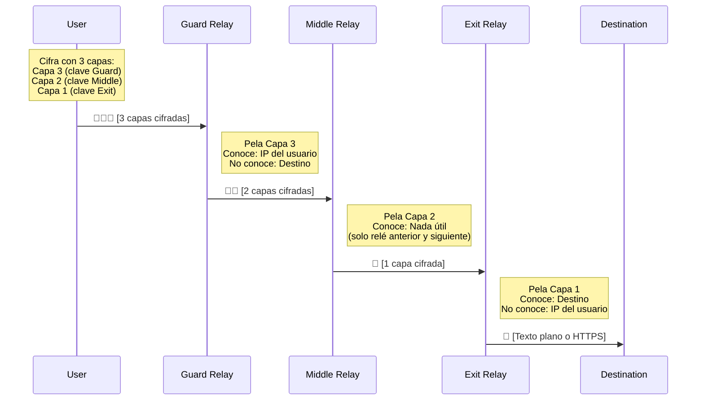
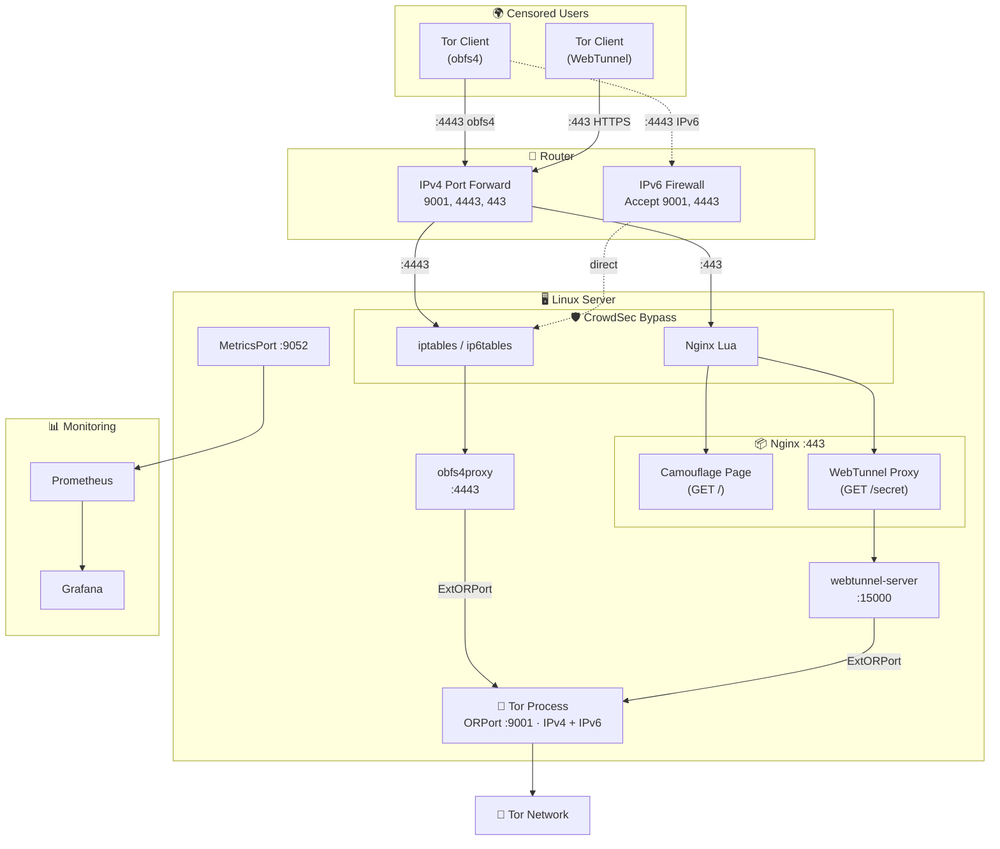

import Callout from "@components/ui/Callout.astro";
import TLDRSummary from "@components/ui/TLDRSummary.astro";
import CheckList from "@components/ui/CheckList.astro";
import StepByStep from "@components/ui/StepByStep.astro";
import KeyValue from "@components/ui/KeyValue.astro";
import Prerequisite from "@components/ui/Prerequisite.astro";
import FileContent from "@components/ui/FileContent.astro";
import Mermaid from "@components/ui/Mermaid.astro";
import TerminalCommand from "@components/ui/TerminalCommand.astro";
import TerminalOutput from "@components/ui/TerminalOutput.astro";
import Table from "@components/ui/Table.astro";
import Code from "@components/ui/Code.astro";
import Collapsible from "@components/ui/Collapsible.astro";
import Timeline from "@components/ui/Timeline.astro";
import DecisionTree from "@components/ui/DecisionTree.astro";
import BeforeAfter from "@components/ui/BeforeAfter.astro";
import SecurityRating from "@components/ui/SecurityRating.astro";


En 2026, más de **2,5 millones de personas** al día llegan a una Internet libre y abierta a través de la [red Tor](https://www.torproject.org/) conectando directamente a un relé — [Tor Metrics sitúa esa estimación diaria por encima de los tres millones durante la mayor parte del año](https://metrics.torproject.org/userstats-relay-country.html), y solo cuenta conexiones directas: quien entra por un bridge, que es de lo que trata esta guía, se contabiliza aparte y no está en esa cifra. Periodistas en regímenes autoritarios, activistas que organizan protestas, denunciantes que destapan casos de corrupción y ciudadanos corrientes que protegen su privacidad: todos ellos dependen de una red **operada íntegramente por voluntarios**.

¿El problema? Solo hay unos **2.600 bridges** dando servicio a esos millones de usuarios. Los bridges son el recurso más crítico y escaso en el ecosistema Tor — son el primer punto de contacto para usuarios en países censurados, y cada nuevo bridge ayuda directamente a alguien a acceder a la información libremente.

Esta guía te enseñará todo lo que necesitas saber sobre la red Tor, el enrutamiento onion, y cómo configurar un **bridge obfs4 + WebTunnel listo para producción** en Linux — completo con camuflaje Nginx, endurecimiento del firewall, monitorización con Prometheus e integración con CrowdSec.

<TLDRSummary title="TL;DR — un puente, dos pluggable transports">
- **Un mismo puente puede ejecutar obfs4 y WebTunnel a la vez**, y merece la pena porque fallan en sitios distintos: obfs4 aleatoriza el tráfico para que no se parezca a ningún protocolo, mientras que WebTunnel se esconde dentro de HTTPS normal en el puerto 443 y sobrevive a los censores que bloquean de plano todo el tráfico "inclasificable".
- **Nginx es lo que hace creíble a WebTunnel.** Se pone delante del puente en el 443 y sirve un sitio web real en todas las rutas salvo la secreta, así que un censor que sondee el host ve una web normal en vez de un endpoint que responde raro.
- **Los flags del consenso tardan días, no minutos.** Running y Valid llegan en menos de una hora; Stable y Guard tardaron alrededor de una semana en este despliegue. Se puntúan a partir de un tiempo medio entre fallos ponderado y, en el caso de Guard, también de ancho de banda y familiaridad —no de un contador de uptime—, así que un puente que se reinicia cada dos días no deja de reiniciar la evidencia con la que se puntúan, y puede que no llegue a obtenerlos.
- **Detrás de NAT hay que reenviar los TCP 9001, 4443 y 443** —ORPort, obfs4 y WebTunnel respectivamente— y abrirlos en el firewall del host; el autotest del ORPort falla en silencio si el router no lo hace.
- **Dile a tu IDS que deje en paz a los clientes de Tor.** CrowdSec ve muchas conexiones desde muchas direcciones y banea a usuarios legítimos si no se excluyen los puertos del puente.
- **Todo corre bajo systemd**, así que el stack vuelve solo tras un reinicio, que es justo lo que exigen los flags basados en uptime.
</TLDRSummary>

---

## La red Tor: una introducción

### ¿Qué es Tor?

**[Tor](https://en.wikipedia.org/wiki/Tor_%28network%29)** (The Onion Router) es una red descentralizada operada por voluntarios, diseñada para proteger la privacidad de los usuarios y resistir la censura. Cuando usas Tor, tu tráfico de Internet se enruta a través de una serie de relés cifrados, lo que hace que sea extremadamente difícil para cualquiera — tu ISP, gobierno o un actor malicioso — rastrear tu actividad y asociarla contigo.

Pero Tor no es solo una herramienta de privacidad. Es una parte esencial de la **infraestructura de derechos humanos**. En países como China, Irán, Rusia y Myanmar, donde los gobiernos bloquean activamente el acceso a la información, Tor es a menudo la única forma para que los ciudadanos accedan a Internet sin censura.

<Callout type="info" title="Un error común">
Solo alrededor del **1,5%** del tráfico de Tor va a sitios `.onion` (la llamada "dark web"). La inmensa mayoría — más del **98%** — son personas normales navegando por Internet de forma privada. Tor es principalmente una herramienta de privacidad y anti-censura, no una puerta de entrada a contenido ilegal.
</Callout>

### Una breve historia

Los [orígenes de Tor](https://www.onion-router.net/History.html) se remontan a los años 90 en el **Laboratorio de Investigación Naval de EE.UU.** (NRL), donde investigadores [Paul Syverson](https://en.wikipedia.org/wiki/Paul_Syverson), David Goldschlag y Michael Reed desarrollaron el concepto de [enrutamiento onion](https://en.wikipedia.org/wiki/Onion_routing) — una técnica de comunicación anónima sobre una red de ordenadores. Puedes leer más sobre [la historia completa de Tor](https://www.torproject.org/about/history/) en el sitio oficial.

<Timeline events={[
  { date: "1995", title: "Se inventa el enrutamiento onion", description: "Syverson, Goldschlag y Reed, en el Laboratorio de Investigación Naval de EE.UU., desarrollan el concepto de cifrado en capas para la comunicación anónima.", type: "milestone" },
  { date: "2002", title: "Nace el Proyecto Tor", description: "Roger Dingledine y Nick Mathewson, ambos del MIT, se unen a Syverson para construir 'The Onion Router' — Tor. El código se publica como software libre con alrededor de una docena de nodos voluntarios.", type: "success" },
  { date: "2004", title: "La EFF empieza a financiarlo", description: "La Electronic Frontier Foundation reconoce la importancia de Tor para los derechos digitales y aporta una financiación crítica en los primeros años. El NRL libera el código al dominio público.", type: "success" },
  { date: "2006", title: "Se funda Tor Project, Inc.", description: "El Proyecto Tor se convierte en una organización sin ánimo de lucro 501(c)(3) con sede en Massachusetts, lo que asegura desarrollo y gobernanza a largo plazo.", type: "milestone" },
  { date: "2007", title: "Llegan los bridges", description: "Se desarrollan direcciones de relé secretas (bridges) para ayudar a los usuarios a esquivar firewalls en países censurados donde el directorio de Tor está bloqueado.", type: "success" },
  { date: "2008", title: "Empieza el Navegador Tor", description: "Un navegador propio que empaqueta Tor en una aplicación fácil de usar y reduce drásticamente la barrera de entrada para usuarios no técnicos.", type: "success" },
  { date: "2011", title: "Primavera Árabe", description: "Tor desempeña un papel crítico cuando activistas de Túnez, Egipto, Libia y Siria lo usan para organizar protestas y comunicarse de forma segura pese a la censura gubernamental.", type: "milestone" },
  { date: "2013", title: "Revelaciones de Snowden", description: "Las revelaciones de Edward Snowden sobre los programas de vigilancia masiva global disparan la adopción de Tor en todo el mundo.", type: "warning" },
  { date: "2023", title: "Se publica WebTunnel", description: "Un pluggable transport nuevo que disfraza el tráfico de Tor como HTTPS corriente, lo que lo hace casi imposible de bloquear sin daño colateral.", type: "success" },
  { date: "2026", title: "Hoy", description: "~10.000 relés, ~2.600 bridges y más de 2,5 millones de usuarios diarios en más de 200 países. La red está operada íntegramente por voluntarios.", type: "default" },
]} />

### ¿Cómo funciona el enrutamiento onion?

[El enrutamiento onion](https://en.wikipedia.org/wiki/Onion_routing) debe su nombre a las capas de una cebolla — tus datos se envuelven en **múltiples capas de cifrado**, y cada relé en el circuito "pela" una capa para revelar el siguiente destino. Ningún relé único conoce jamás tanto el origen como el destino del tráfico.

<Mermaid caption="Enrutamiento onion: tres capas de cifrado a través de tres relés" maxWidth="800px" ariaLabel="Diagrama que muestra cómo viajan los datos por un circuito Tor: el cliente cifra los datos con tres capas (una por relé) y los envía a través de los relés guard, middle y exit. Cada relé quita una capa de cifrado. El guard conoce al usuario pero no el destino. El exit conoce el destino pero no al usuario.">

</Mermaid>

Esto es lo que lo hace seguro:

<Table title="Lo que sabe cada relé">
  <thead>
    <tr>
      <th scope="col">Relé</th>
      <th scope="col">Sabe</th>
      <th scope="col">No sabe</th>
    </tr>
  </thead>
  <tbody>
    <tr>
      <td>**Guard** (Entrada)</td>
      <td>Tu dirección IP real</td>
      <td>Qué sitios web visitas</td>
    </tr>
    <tr>
      <td>**Middle**</td>
      <td>Solo relé anterior y siguiente</td>
      <td>Ni tu IP ni tu destino</td>
    </tr>
    <tr>
      <td>**Exit**</td>
      <td>El sitio web de destino</td>
      <td>Tu dirección IP real</td>
    </tr>
  </tbody>
</Table>

Detalles técnicos clave de la [construcción de circuitos](https://spec.torproject.org/tor-spec/creating-circuits.html) de Tor (ver también la [descripción general del sistema](https://tpo.pages.torproject.net/core/torspec/tor-spec/system-overview.html) en la especificación de Tor):

- **Selección de la ruta del circuito**: el cliente elige los relés al azar y evita dos relés en la misma subred `/16` o en el mismo país, para ganar diversidad.
- **Intercambio de claves**: cada salto usa un **handshake ntor** (basado en Curve25519) para establecer un secreto compartido, con lo que se obtiene forward secrecy.
- **Celdas de tamaño fijo**: dentro de Tor todo se transmite en **celdas de 512 bytes**, lo que impide el análisis de tráfico por tamaño de paquete.
- **Rotación de circuitos**: los circuitos se rotan cada **10 minutos** aproximadamente, para acotar la ventana de los ataques de correlación de tráfico.
- **Autoridades de directorio**: nueve servidores de confianza mantienen el consenso sobre el estado de la red, las claves de relé y los flags.

---

## El ecosistema Tor: tipos de voluntarios

La red Tor está compuesta por diferentes tipos de nodos operados por voluntarios, cada uno sirviendo un propósito distinto:

<Table title="Roles de voluntario en Tor">
  <thead>
    <tr>
      <th scope="col">Rol</th>
      <th scope="col">Qué hace</th>
      <th scope="col">Nivel de riesgo</th>
      <th scope="col">Impacto</th>
    </tr>
  </thead>
  <tbody>
    <tr>
      <td>**Guard Relay**</td>
      <td>Primer salto del circuito. Ve la IP del usuario, pero no el destino.</td>
      <td>Bajo</td>
      <td>Alto — aporta ancho de banda</td>
    </tr>
    <tr>
      <td>**Middle Relay**</td>
      <td>Salto intermedio. No ve nada útil.</td>
      <td>Muy bajo</td>
      <td>Medio — añade ancho de banda y diversidad de ruta</td>
    </tr>
    <tr>
      <td>**Exit Relay**</td>
      <td>Último salto. Se conecta al destino en nombre del usuario.</td>
      <td>Alto</td>
      <td>Muy alto — el recurso más necesario y escaso</td>
    </tr>
    <tr>
      <td>**Bridge**</td>
      <td>Punto de entrada oculto para usuarios de países censurados. No figura en el directorio público de Tor.</td>
      <td>Bajo</td>
      <td>**Crítico** — es lo que permite eludir la censura directamente</td>
    </tr>
    <tr>
      <td>**Snowflake Proxy**</td>
      <td>Proxy WebRTC efímero que ayuda a los usuarios censurados a llegar a la red Tor.</td>
      <td>Muy bajo</td>
      <td>Medio — fácil de ejecutar, incluso en una pestaña del navegador</td>
    </tr>
    <tr>
      <td>**Directory Authority**</td>
      <td>Servidor de confianza que mantiene el consenso de la red.</td>
      <td>N/A</td>
      <td>Crítico — solo existen 9, operadas por el Proyecto Tor</td>
    </tr>
  </tbody>
</Table>

<Callout type="tip" title="Por qué los bridges importan tanto ahora">
En 2026, la [red Tor tiene unos **10.000 relés** pero solo alrededor de **2.600 bridges**](https://metrics.torproject.org/networksize.html). Los bridges son especialmente valiosos porque dan servicio a usuarios a los que se les **bloquea activamente** el acceso a Tor — gente de países como China, Irán o Rusia, donde el gobierno bloquea las conexiones a los relés Tor conocidos. Cada bridge nuevo es un **salvavidas** para alguien bajo censura.
</Callout>

### ¿Qué son los pluggable transports?

Los censores no solo bloquean Tor por IP: usan **inspección profunda de paquetes (DPI)** para identificar y bloquear el propio protocolo Tor. Los [pluggable transports](https://arxiv.org/pdf/2309.14856) resuelven esto disfrazando el tráfico de Tor como algo completamente diferente.

<Table title="Comparación de pluggable transports">
  <thead>
    <tr>
      <th scope="col">Transporte</th>
      <th scope="col">Método de disfraz</th>
      <th scope="col">Resistencia a la censura</th>
      <th scope="col">Velocidad</th>
      <th scope="col">Despliegue</th>
    </tr>
  </thead>
  <tbody>
    <tr>
      <td>**[obfs4](https://gitlab.torproject.org/tpo/anti-censorship/pluggable-transports/lyrebird)**</td>
      <td>Hace que el tráfico parezca bytes aleatorios</td>
      <td>Alta — resiste el fingerprinting por DPI</td>
      <td>Rápida</td>
      <td>Muy desplegado, fácil de configurar</td>
    </tr>
    <tr>
      <td>**[WebTunnel](https://gitlab.torproject.org/tpo/anti-censorship/pluggable-transports/webtunnel)**</td>
      <td>Imita tráfico HTTPS/WebSocket</td>
      <td>Muy alta — parece navegación web normal</td>
      <td>Rápida</td>
      <td>Más reciente, requiere servidor web + dominio</td>
    </tr>
    <tr>
      <td>**Snowflake**</td>
      <td>Usa WebRTC a través de proxies efímeros</td>
      <td>Muy alta — los proxies rotan constantemente</td>
      <td>Variable</td>
      <td>Solo en cliente (los voluntarios ejecutan proxies de navegador)</td>
    </tr>
    <tr>
      <td>**meek**</td>
      <td>Disfraza el tráfico como peticiones a servicios en la nube (Azure, CDN)</td>
      <td>Extrema — bloquearlo implica bloquear servicios en la nube</td>
      <td>Lenta</td>
      <td>Costoso de mantener, último recurso</td>
    </tr>
  </tbody>
</Table>

<DecisionTree question="¿Cuál deberías ejecutar? Así se decide:">
<details>
<summary>Quiero máximo impacto con mínima complejidad</summary>

Ejecuta un **bridge obfs4**. Es el pluggable transport más desplegado, es fácil de configurar y sirve al mayor número de usuarios. Aquí es donde el Proyecto Tor más necesita ayuda.
</details>
<details>
<summary>Ya tengo un servidor web y nombre de dominio</summary>

Ejecuta **obfs4 y WebTunnel a la vez**. WebTunnel disfraza el tráfico de Tor como navegación HTTPS normal, lo que lo hace casi imposible de bloquear. Combinado con obfs4, ofreces dos métodos de evasión distintos desde un único servidor.
</details>
<details>
<summary>No tengo un servidor, pero quiero ayudar ahora mismo</summary>

Instala la [extensión de navegador Snowflake](https://snowflake.torproject.org/) — se tarda 30 segundos y convierte tu navegador en un proxy temporal para usuarios censurados. No requiere mantenimiento.
</details>
<details>
<summary>Quiero contribuir el máximo ancho de banda a la red</summary>

Ejecuta un **relé middle** o, si te sientes cómodo con las implicaciones legales, un **relé exit**. Aportan ancho de banda bruto a toda la red. Plantéate levantarlos en un VPS con un ISP que permita explícitamente el tráfico Tor.
</details>
</DecisionTree>

En esta guía configuraremos **obfs4 y WebTunnel** en el mismo servidor, para maximizar el impacto con una sola máquina.

---

## Requisitos previos

<Prerequisite>
### Requisitos de hardware
- **CPU**: cualquier procesador x86_64 moderno (ARM también vale)
- **RAM**: mínimo 1 GB (lo que exige WebTunnel), 4 GB recomendados si vas a servir mucho tráfico
- **Almacenamiento**: mínimo 5 GB (para datos de Tor, logs y claves)
- **Red**: al menos **10 Mbps** de ancho de banda de subida (cuanto más, mejor)
- **Uptime**: el servidor debe estar en marcha 24/7 — Tor penaliza los relés inestables

### Requisitos de software
- **Distribución Linux** (esta guía usa Debian 12/13 o Ubuntu 22.04+)
- **Acceso root** (o privilegios sudo)
- **Nginx** (para el camuflaje de WebTunnel — innecesario si solo montas obfs4)
- **Un nombre de dominio** con DNS apuntando a tu servidor (solo para WebTunnel)
- **Certificado TLS** (Let's Encrypt es gratuito y perfecto para esto)

### Requisitos de red
- Poder **reenviar puertos** desde tu router (o usar un VPS con IP pública directa)
- Puertos **9001** (ORPort), **4443** (obfs4) y **443** (HTTPS de Nginx, si sirves WebTunnel) accesibles desde internet
- Puerto **443** (HTTPS) si ejecutas WebTunnel
</Prerequisite>

---

## Paso 1: instalar Tor del repositorio oficial

<Callout type="warning" title="Usa siempre el repositorio oficial de Tor">
Los paquetes de distribución (por ejemplo, `apt install tor`) suelen ir meses o incluso años por detrás. El Proyecto Tor mantiene su propio [repositorio Debian/Ubuntu](https://community.torproject.org/relay/setup/bridge/) con las versiones estables más recientes, los parches de seguridad y las claves de firma. Usa siempre ese.
</Callout>

<StepByStep title="Instalar Tor y dependencias">
<li>

**Instalar requisitos previos**

<TerminalCommand ariaLabel="Instalar paquetes necesarios">
```bash
sudo apt update
sudo apt install -y apt-transport-https gpg curl
```
</TerminalCommand>

</li>
<li>

**Añadir la clave GPG del Proyecto Tor**

<TerminalCommand ariaLabel="Descargar e instalar clave GPG de Tor Project">
```bash
curl -fsSL https://deb.torproject.org/torproject.org/A3C4F0F979CAA22CDBA8F512EE8CBC9E886DDD89.asc \
  | sudo gpg --dearmor -o /usr/share/keyrings/tor-archive-keyring.gpg
```
</TerminalCommand>

</li>
<li>

**Añadir el repositorio de Tor**

Sustituye `CODENAME` por el nombre en clave de tu distribución (por ejemplo, `bookworm`, `trixie` o `jammy`):

<TerminalCommand ariaLabel="Añadir repositorio APT de Tor">
```bash
CODENAME=$(lsb_release -cs)
echo "deb [signed-by=/usr/share/keyrings/tor-archive-keyring.gpg] \
  https://deb.torproject.org/torproject.org $CODENAME main" \
  | sudo tee /etc/apt/sources.list.d/tor.list
```
</TerminalCommand>

</li>
<li>

**Instalar Tor y obfs4proxy**

<TerminalCommand ariaLabel="Instalar Tor y obfs4proxy">
```bash
sudo apt update
sudo apt install -y tor deb.torproject.org-keyring obfs4proxy
```
</TerminalCommand>

Comprueba la instalación:

<TerminalCommand ariaLabel="Comprobar las versiones de Tor y obfs4proxy">
```bash
tor --version
obfs4proxy -version
```
</TerminalCommand>

<TerminalOutput title="Salida esperada">
```
Tor version 0.4.9.6.
obfs4proxy-0.0.14
```
</TerminalOutput>

</li>
</StepByStep>

---

## Paso 2: instalar WebTunnel (opcional pero recomendado)

WebTunnel es un pluggable transport más reciente que disfraza las conexiones de Tor como tráfico HTTPS normal. A diferencia de obfs4 (que parece datos aleatorios), WebTunnel usa de verdad upgrades de WebSocket sobre HTTPS, lo que lo hace **casi indistinguible de la navegación web legítima**. El Proyecto Tor publica [instrucciones de configuración oficiales](https://community.torproject.org/relay/setup/webtunnel/) y una guía para [compilarlo desde el código fuente](https://community.torproject.org/relay/setup/webtunnel/source/).

<Callout type="info" title="¿Por qué compilar desde el código fuente?">
A día de hoy, el binario `webtunnel-server` todavía no está disponible como paquete Debian. El Proyecto Tor lo distribuye como código fuente en Go, que hay que compilar, o como imagen Docker. Aquí lo compilamos para tener una instalación nativa.
</Callout>

<StepByStep title="Compilar el servidor WebTunnel">
<li>

**Instalar Go** (si aún no está instalado)

<TerminalCommand ariaLabel="Instalar lenguaje de programación Go">
```bash
sudo apt install -y golang-go
```
</TerminalCommand>

Comprueba que tienes Go 1.21 o superior, que es lo que pide WebTunnel. Ojo si sigues en
Debian 12: su paquete `golang-go` es Go 1.19 y no llega, así que ahí hay que tirar de
`bookworm-backports` o del tarball oficial. Debian 13 trae 1.24 y sirve tal cual:

<TerminalCommand ariaLabel="Comprobar la versión de Go">
```bash
go version
```
</TerminalCommand>

</li>
<li>

**Clonar y compilar WebTunnel**

<TerminalCommand ariaLabel="Clonar y compilar WebTunnel desde su código fuente">
```bash
cd /tmp
git clone https://gitlab.torproject.org/tpo/anti-censorship/pluggable-transports/webtunnel.git
cd webtunnel/main/server
go build -o webtunnel-server .
sudo cp webtunnel-server /usr/local/bin/
sudo chmod +x /usr/local/bin/webtunnel-server
```
</TerminalCommand>

</li>
<li>

**Comprobar el binario**

<TerminalCommand ariaLabel="Comprobar el binario del servidor WebTunnel">
```bash
/usr/local/bin/webtunnel-server --help 2>&1 | head -5
```
</TerminalCommand>

</li>
</StepByStep>

---

## Paso 3: configurar tu bridge de Tor

Vamos con la configuración principal. El fichero `torrc` controla todo el comportamiento de Tor.

<Callout type="warning" title="Antes de editar">
Haz una copia de seguridad de la configuración original antes de tocar nada:

<TerminalCommand ariaLabel="Copia de seguridad del fichero torrc original">
```bash
sudo cp /etc/tor/torrc /etc/tor/torrc.backup
```
</TerminalCommand>
</Callout>

Sustituye el contenido de `/etc/tor/torrc` por:

<FileContent filename="/etc/tor/torrc" language="ini" collapsible={false}>
```ini
# =============================================================
# Tor Bridge Configuration — obfs4 + WebTunnel
# =============================================================

# --- General Settings ---
SocksPort 0                        # Not a client — disable SOCKS
RunAsDaemon 0                      # Managed by systemd
DataDirectory /var/lib/tor
Log notice file /var/log/tor/notices.log
Log notice syslog

# --- Security Hardening ---
DisableDebuggerAttachment 1        # Prevent ptrace/debugger attachment

# --- Bridge Mode ---
BridgeRelay 1                      # This is a bridge, not a relay
PublishServerDescriptor bridge     # Publish to BridgeDB (not public directory)

# --- ORPort — IPv4 (NAT from router) + IPv6 (direct, global) ---
# IMPORTANT: Use 0.0.0.0 for NAT environments, not 127.0.0.1
ORPort 0.0.0.0:9001
ORPort [YOUR_IPV6_ADDRESS]:9001
ExtORPort auto

# --- Contact & Identity ---
ContactInfo your-email<at>example<dot>com
Nickname YourBridgeName

# --- obfs4 Transport ---
# Port 4443 must be forwarded from your router
ServerTransportPlugin obfs4 exec /usr/bin/obfs4proxy
ServerTransportListenAddr obfs4 0.0.0.0:4443

# --- WebTunnel Transport ---
# Listens locally; Nginx reverse-proxies HTTPS to it
ServerTransportPlugin webtunnel exec /usr/local/bin/webtunnel-server
ServerTransportListenAddr webtunnel 127.0.0.1:15000
ServerTransportOptions webtunnel url=https://YOUR-DOMAIN/YOUR-SECRET-PATH

# --- Bandwidth Limits ---
# Adjust to what your connection can sustain (example: 250 Mbps)
RelayBandwidthRate 31 MBytes       # Sustained rate
RelayBandwidthBurst 35 MBytes     # Burst allowance

# --- Memory — cap internal queue memory (OOM protection) ---
MaxMemInQueues 4096 MB

# --- Statistics ---
ConnDirectionStatistics 1          # Enable connection direction stats

# --- DoS Protection ---
DoSRefuseSingleHopClientRendezvous 1

# --- Monitoring: Prometheus Metrics ---
MetricsPort 0.0.0.0:9052
MetricsPortPolicy accept 192.168.0.0/16
MetricsPortPolicy accept 127.0.0.0/8

# --- Control Port (for Nyx monitoring tool) ---
ControlPort 9051
CookieAuthentication 1
```
</FileContent>

Repasemos las secciones críticas:

<KeyValue
  title="Opciones de configuración clave, explicadas"
  items={[
    { key: "BridgeRelay 1", value: "Modo bridge", description: "Le dice a Tor que es un bridge, no un relé público. Los bridges no figuran en el directorio público de Tor." },
    { key: "ORPort 0.0.0.0:9001", value: "Onion Router Port (IPv4)", description: "El puerto que Tor usa para comunicarse con otros relés. Usa 0.0.0.0 (no 127.0.0.1) si estás detrás de NAT — Tor necesita escuchar en todas las interfaces para que el autotest pase." },
    { key: "ORPort [IPv6]:9001", value: "Onion Router Port (IPv6)", description: "Si tienes una dirección IPv6 global, añade una segunda línea ORPort con esa dirección entre corchetes. IPv6 no necesita NAT: la dirección es accesible directamente." },
    { key: "ExtORPort auto", value: "Extended ORPort", description: "Canal de comunicación interno entre Tor y los pluggable transports. Con 'auto', Tor elige un puerto local al azar." },
    { key: "ServerTransportListenAddr obfs4", value: "Dirección de escucha de obfs4", description: "El puerto donde obfs4proxy espera las conexiones ofuscadas entrantes. Tiene que ser alcanzable desde Internet." },
    { key: "ServerTransportListenAddr webtunnel", value: "Dirección de escucha de WebTunnel", description: "Escucha solo en 127.0.0.1 porque Nginx gestiona el HTTPS público y hace de proxy inverso hacia este puerto." },
    { key: "DisableDebuggerAttachment 1", value: "Endurecimiento de seguridad", description: "Impide que herramientas como ptrace o gdb se enganchen al proceso de Tor. Protege las claves criptográficas en memoria frente a volcados y depuración." },
    { key: "MaxMemInQueues 4096 MB", value: "Límite de memoria para colas", description: "Limita la memoria que Tor dedica a las colas de circuitos. Evita escenarios de OOM (falta de memoria) en servidores con mucha carga de tráfico." },
    { key: "ConnDirectionStatistics 1", value: "Estadísticas de dirección de conexiones", description: "Habilita la recogida de estadísticas sobre el sentido de las conexiones (entrantes frente a salientes). Útil para analizar el tráfico del bridge." },
    { key: "DoSRefuseSingleHopClientRendezvous 1", value: "Protección DoS", description: "Rechaza los circuitos de encuentro (rendezvous) que llegan de clientes de un solo salto. Se usan habitualmente en abusos y ataques de denegación de servicio contra servicios ocultos." },
    { key: "MetricsPort", value: "Endpoint de Prometheus", description: "Expone las métricas internas de Tor en formato Prometheus. Restringe el acceso con MetricsPortPolicy." },
  ]}
/>

<Callout type="error" title="Crítico: ORPort detrás de NAT">
Si tu servidor está detrás de un router (NAT), usar `ORPort 127.0.0.1:auto` **hará fallar** el autotest de accesibilidad. Tor necesita comprobar que su ORPort es accesible desde Internet, y escuchar solo en localhost se lo impide. Usa siempre `ORPort 0.0.0.0:9001` (o la IP concreta de tu LAN) y reenvía el puerto 9001 desde el router.
</Callout>

<Callout type="tip" title="Dual-Stack: IPv4 + IPv6">
Si tu ISP proporciona un prefijo IPv6, **plantéate seriamente añadir un ORPort IPv6**. Un bridge dual-stack puede servir a más usuarios, porque algunas redes solo tienen conectividad IPv6. Para encontrar la dirección IPv6 global de tu servidor:

<TerminalCommand ariaLabel="Encontrar la dirección IPv6 global de tu servidor">
```bash
ip -6 addr show scope global | grep inet6
```
</TerminalCommand>

Usa la dirección (sin el prefijo `/64`) en tu `torrc`:

```ini
ORPort [2001:db8::1]:9001
```

A diferencia de IPv4, las direcciones IPv6 son **enrutables globalmente** — no hace falta NAT ni redirección de puertos. Solo necesitas que tu firewall permita TCP entrante al puerto 9001 en esa dirección.
</Callout>

### Generar la ruta secreta de WebTunnel

El transporte WebTunnel usa una ruta de URL secreta que hace las veces de token de autenticación. Genera una cadena aleatoria de 24 caracteres:

<TerminalCommand ariaLabel="Generar una ruta secreta aleatoria para WebTunnel">
```bash
echo $(cat /dev/urandom | tr -cd 'a-zA-Z0-9' | head -c 24)
```
</TerminalCommand>

<TerminalOutput title="Salida de ejemplo">
```
7Zkw18j2NWGK9X7PiiPUQRJB
```
</TerminalOutput>

Usa ese valor en dos sitios:
1. El `torrc`: `ServerTransportOptions webtunnel url=https://your-domain.com/YOUR_SECRET`
2. La configuración de Nginx: `location = /YOUR_SECRET`

---

## Paso 4: configurar Nginx para camuflaje WebTunnel

Lo bonito de WebTunnel es que tu servidor parece un **sitio web completamente normal**. Los visitantes ven una página HTML corriente; solo quien conoce la ruta secreta puede conectarse al bridge de Tor. Esto es **camuflaje por ruta secreta**. No es *domain fronting*: aquello usa un dominio en el SNI de TLS y otro distinto en la cabecera `Host`, mientras que aquí hay un solo dominio y lo que oculta el bridge es la ruta.

<StepByStep title="Configurar el camuflaje con Nginx">
<li>

**Crear un sitio web de camuflaje**

Esto es lo que ven los visitantes (y los censores) cuando entran en tu dominio:

<TerminalCommand ariaLabel="Crear el directorio y la página del sitio de camuflaje">
```bash
sudo mkdir -p /var/www/tor-camouflage
cat << 'EOF' | sudo tee /var/www/tor-camouflage/index.html
<!DOCTYPE html>
<html lang="en">
<head>
    <meta charset="UTF-8">
    <meta name="viewport" content="width=device-width, initial-scale=1.0">
    <title>Welcome</title>
    <style>
        body { font-family: system-ui, sans-serif; max-width: 800px;
               margin: 50px auto; padding: 20px; color: #333; }
        h1 { color: #2c3e50; }
    </style>
</head>
<body>
    <h1>Welcome</h1>
    <p>This is a personal project page. Nothing to see here.</p>
</body>
</html>
EOF
```
</TerminalCommand>

</li>
<li>

**Obtener un certificado TLS** (si todavía no tienes uno)

<TerminalCommand ariaLabel="Obtener certificado de Let's Encrypt">
```bash
sudo apt install -y certbot python3-certbot-nginx
sudo certbot --nginx -d your-domain.com
```
</TerminalCommand>

</li>
<li>

**Crear el bloque de servidor de Nginx**

<FileContent filename="/etc/nginx/sites-available/tor-bridge.conf" language="nginx">
```nginx
# Tor WebTunnel Bridge — Camouflage configuration
# This looks like a normal HTTPS website but proxies
# a secret path to the WebTunnel pluggable transport

server {
    listen 443 ssl;
    listen [::]:443 ssl;
    http2 on;

    server_name your-domain.com;

    # TLS certificates
    ssl_certificate     /etc/letsencrypt/live/your-domain.com/fullchain.pem;
    ssl_certificate_key /etc/letsencrypt/live/your-domain.com/privkey.pem;
    ssl_protocols       TLSv1.2 TLSv1.3;
    ssl_ciphers         HIGH:!aNULL:!MD5;

    # === Normal website (camouflage) ===
    root /var/www/tor-camouflage;
    index index.html;

    location / {
        try_files $uri $uri/ =404;
    }

    # === WebTunnel reverse proxy (secret path) ===
    # Replace YOUR_SECRET_PATH with your generated secret
    location = /YOUR_SECRET_PATH {
        proxy_pass http://127.0.0.1:15000;
        proxy_http_version 1.1;

        # WebSocket upgrade headers (required for WebTunnel)
        proxy_set_header Upgrade $http_upgrade;
        proxy_set_header Connection "upgrade";

        # Standard proxy headers
        proxy_set_header Host $host;
        proxy_set_header X-Real-IP $remote_addr;
        proxy_set_header X-Forwarded-For $proxy_add_x_forwarded_for;
        proxy_set_header X-Forwarded-Proto $scheme;
        proxy_set_header Accept-Encoding "";
        add_header Front-End-Https on;

        proxy_redirect off;
        proxy_buffering off;
        proxy_request_buffering off;

        # Long timeout for persistent Tor connections
        proxy_read_timeout 36000s;
        proxy_send_timeout 36000s;

        # Disable logging for the secret path (privacy)
        access_log off;
        error_log off;
    }
}

# HTTP to HTTPS redirect
server {
    listen 80;
    listen [::]:80;
    server_name your-domain.com;
    return 301 https://$host$request_uri;
}
```
</FileContent>

</li>
<li>

**Habilitar el sitio y probarlo**

<TerminalCommand ariaLabel="Habilitar el sitio en Nginx y probar la configuración">
```bash
sudo ln -sf /etc/nginx/sites-available/tor-bridge.conf \
    /etc/nginx/sites-enabled/
sudo nginx -t && sudo systemctl reload nginx
```
</TerminalCommand>

</li>
</StepByStep>

<BeforeAfter beforeLabel="Lo que ven los censores" afterLabel="Lo que realmente sucede">
<div slot="before">

**Sitio web HTTPS normal**

Una petición `GET /` a tu dominio devuelve una página HTML sencilla. El DPI ve tráfico TLS 1.3 estándar hacia un dominio registrado. Nada sospechoso.

```
HTTP/1.1 200 OK
Content-Type: text/html
<html>Welcome...</html>
```
</div>
<div slot="after">

**Conexión del bridge de WebTunnel**

Una petición `GET /SECRET_PATH` con una cabecera `Connection: Upgrade` llega al servidor WebTunnel, que abre un túnel persistente para el tráfico de Tor — todo dentro de la misma sesión TLS.

```
HTTP/1.1 101 Switching Protocols
Upgrade: websocket
Connection: Upgrade
[El tráfico de Tor circula por el túnel]
```
</div>
</BeforeAfter>

---

## Paso 5: configurar el reenvío de puertos

Si tu servidor está detrás de un router (lo habitual en instalaciones domésticas), tienes que reenviar estos puertos desde la IP pública del router hasta la IP local de tu servidor:

<Table title="Reenvíos de puertos necesarios">
  <thead>
    <tr>
      <th scope="col">Puerto</th>
      <th scope="col">Protocolo</th>
      <th scope="col">Propósito</th>
      <th scope="col">¿Necesario?</th>
    </tr>
  </thead>
  <tbody>
    <tr>
      <td>**9001**</td>
      <td>TCP</td>
      <td>ORPort — comunicación entre relés</td>
      <td>Sí (siempre)</td>
    </tr>
    <tr>
      <td>**4443**</td>
      <td>TCP</td>
      <td>obfs4 — transporte ofuscado</td>
      <td>Sí (si ejecutas obfs4)</td>
    </tr>
    <tr>
      <td>**443**</td>
      <td>TCP</td>
      <td>HTTPS — WebTunnel vía Nginx</td>
      <td>Sí (si ejecutas WebTunnel)</td>
    </tr>
  </tbody>
</Table>

Los pasos exactos dependen de tu router. El proceso general es este:

<StepByStep title="Reenvío de puertos en un router genérico">
<li>

**Entra en el panel de administración de tu router** (normalmente en `192.168.0.1` o `192.168.1.1`)

</li>
<li>

**Busca la sección de reenvío de puertos** (suele estar bajo "NAT", "Firewall" o "Port Forwarding")

</li>
<li>

**Crea reglas para cada puerto:**
- **Puerto externo**: 9001 → **IP interna**: la IP de LAN de tu servidor → **Puerto interno**: 9001
- **Puerto externo**: 4443 → **IP interna**: la IP de LAN de tu servidor → **Puerto interno**: 4443
- **Puerto externo**: 443 → **IP interna**: la IP de LAN de tu servidor → **Puerto interno**: 443 (si no está ya reenviado)

</li>
<li>

**Guarda y aplica** los cambios.

</li>
</StepByStep>

### Firewall del servidor (UFW)

Si usas UFW (Uncomplicated Firewall) en tu servidor:

<TerminalCommand ariaLabel="Configurar UFW para los puertos del puente Tor">
```bash
sudo ufw allow 9001/tcp comment "Tor ORPort"
sudo ufw allow 4443/tcp comment "Tor obfs4 Bridge"
# Port 443 is likely already open if you run Nginx
sudo ufw allow 443/tcp comment "HTTPS"
sudo ufw reload
```
</TerminalCommand>

Si usas `iptables` directamente:

<TerminalCommand ariaLabel="Configurar iptables para los puertos del puente Tor">
```bash
sudo iptables -A INPUT -p tcp --dport 9001 -j ACCEPT
sudo iptables -A INPUT -p tcp --dport 4443 -j ACCEPT
sudo iptables -A INPUT -p tcp --dport 443 -j ACCEPT
```
</TerminalCommand>

### IPv6: sin NAT

<Callout type="info" title="IPv6 es directo: sin reenvío de puertos">
A diferencia de IPv4, las direcciones IPv6 son enrutables globalmente. Tu servidor ya es accesible directamente en su dirección IPv6: no hace falta NAT ni reenvío de puertos. Solo tienes que asegurarte de que las reglas del firewall de tu router **permitan** el tráfico entrante al ORPort (TCP 9001) hacia tu servidor. Si usas MikroTik, añade una regla en el firewall IPv6 que acepte tráfico TCP al puerto 9001 en la dirección de tu servidor.
</Callout>

Comprueba que el puerto IPv6 está abierto:

<TerminalCommand ariaLabel="Comprobar que el puerto IPv6 escucha y es accesible">
```bash
# Verifica que Tor escuche en IPv6
ss -tlnp6 | grep 9001

# Prueba de accesibilidad IPv6 desde otra máquina
nc -6zv TU_DIRECCIÓN_IPV6 9001
```
</TerminalCommand>

---

## Paso 6: configuración de AppArmor

En sistemas Debian/Ubuntu, AppArmor puede restringir lo que Tor y obfs4proxy tienen permitido hacer. Hay que asegurarse de que el perfil de obfs4proxy permite la ejecución:

<TerminalCommand ariaLabel="Configurar AppArmor para obfs4proxy">
```bash
# Check if the profile exists
sudo aa-status 2>/dev/null | grep obfs4proxy

# If restricted, set to complain mode
sudo aa-complain /usr/bin/obfs4proxy 2>/dev/null

# Or create an explicit allow rule
echo "/usr/bin/obfs4proxy mr," | sudo tee -a /etc/apparmor.d/local/system_tor
sudo apparmor_parser -r /etc/apparmor.d/system_tor
```
</TerminalCommand>

---

## Paso 7: iniciar y verificar

<StepByStep title="Arrancar el puente">
<li>

**Inicia Tor**

<TerminalCommand ariaLabel="Reiniciar el servicio de Tor">
```bash
sudo systemctl restart tor
```
</TerminalCommand>

</li>
<li>

**Mira los logs para confirmar que el bootstrap ha ido bien**

<TerminalCommand ariaLabel="Seguir el proceso de arranque de Tor">
```bash
sudo journalctl -u tor -f --no-pager | head -30
```
</TerminalCommand>

Busca estas líneas clave:

<TerminalOutput title="Salida de un bootstrap correcto">
```
Bootstrapped 0% (starting): Starting
Bootstrapped 5% (conn): Connecting to a relay
Bootstrapped 10% (conn_done): Connected to a relay
Bootstrapped 14% (handshake): Handshaking with a relay
Bootstrapped 15% (handshake_done): Handshake with a relay done
Bootstrapped 75% (enough_dirinfo): Loaded enough directory info to build circuits
Bootstrapped 90% (ap_handshake_done): Handshake finished with a relay to build circuits
Bootstrapped 95% (circuit_create): Establishing a Tor circuit
Bootstrapped 100% (done): Done
Self-testing indicates your ORPort 86.x.x.x:9001 is reachable from the outside. Excellent.
Registered server transport 'obfs4' at '0.0.0.0:4443'
Registered server transport 'webtunnel' at '127.0.0.1:15000'
```
</TerminalOutput>

</li>
<li>

**Comprueba que los tres procesos están en ejecución**

<TerminalCommand ariaLabel="Comprobar que Tor, obfs4proxy y webtunnel-server están en ejecución">
```bash
ps aux | grep -E "(tor|obfs4|webtunnel)" | grep -v grep
```
</TerminalCommand>

Deberías ver tres procesos: `tor`, `obfs4proxy`, y `webtunnel-server`.

</li>
<li>

**Comprueba que todos los puertos están en escucha**

<TerminalCommand ariaLabel="Comprobar los puertos en escucha del puente Tor">
```bash
ss -tlnp | grep -E "(9001|4443|15000|9051|9052)"
```
</TerminalCommand>

<TerminalOutput title="Puertos que deberían estar en escucha">
```
LISTEN  0  4096   0.0.0.0:9001   0.0.0.0:*  users:(("tor",pid=...,fd=...))
LISTEN  0  4096   0.0.0.0:4443   0.0.0.0:*  users:(("obfs4proxy",pid=...,fd=...))
LISTEN  0  4096 127.0.0.1:15000  0.0.0.0:*  users:(("webtunnel-ser",pid=...,fd=...))
LISTEN  0  4096 127.0.0.1:9051   0.0.0.0:*  users:(("tor",pid=...,fd=...))
LISTEN  0  4096   0.0.0.0:9052   0.0.0.0:*  users:(("tor",pid=...,fd=...))
```
</TerminalOutput>

</li>
<li>

**Recupera la huella digital de tu puente**

<TerminalCommand ariaLabel="Obtener la huella digital del puente">
```bash
cat /var/lib/tor/fingerprint
```
</TerminalCommand>

</li>
</StepByStep>

### Comprobar la accesibilidad externa

Desde otra máquina (o con un comprobador de puertos online), comprueba que tus puertos son accesibles:

<TerminalCommand ariaLabel="Probar la accesibilidad del ORPort desde otra máquina">
```bash
# From another machine:
nc -zv YOUR_PUBLIC_IP 9001
nc -zv YOUR_PUBLIC_IP 4443
curl -I https://your-domain.com/
```
</TerminalCommand>

<Callout type="tip" title="El autotest del ORPort">
Tor hace su propio autotest de accesibilidad durante el bootstrap. Si ves `Self-testing indicates your ORPort is reachable from the outside`, todo va bien. Si el autotest falla, revisa otra vez las reglas de reenvío de puertos y la configuración del firewall.
</Callout>

---

## Paso 8: monitorización con Prometheus y Grafana

Tor expone un conjunto muy completo de métricas por su `MetricsPort` en formato Prometheus. Con ellas puedes vigilar en tiempo real el uso de ancho de banda, las conexiones, la construcción de circuitos y la salud del relé.

### Configurar el scraping de Prometheus

Añade un target de scrape para tu puente Tor en la configuración de Prometheus:

<FileContent filename="prometheus.yml (fragmento)" language="yaml">
```yaml
scrape_configs:
  - job_name: 'tor-bridge'
    scrape_interval: 30s
    scrape_timeout: 10s
    metrics_path: '/metrics'
    static_configs:
      - targets: ['YOUR_SERVER_IP:9052']
        labels:
          instance: 'tor-bridge'
          nickname: 'YourBridgeName'
```
</FileContent>

<Callout type="info" title="Firewall para el puerto de métricas">
El MetricsPort (9052) solo debe ser accesible desde tu servidor de monitorización, nunca desde la Internet pública. Usa `MetricsPortPolicy accept YOUR_MONITORING_IP/32` en el `torrc` y restringe el acceso también en el firewall:

<TerminalCommand ariaLabel="Restringir el MetricsPort al servidor de monitorización">
```bash
sudo ufw allow from YOUR_MONITORING_IP to any port 9052 proto tcp \
  comment "Prometheus: Tor Bridge Metrics"
```
</TerminalCommand>
</Callout>

### Métricas clave que vigilar

Tor expone decenas de métricas de Prometheus. Estas son las más importantes para quien opera un puente:

<Table title="Métricas esenciales de Prometheus en Tor">
  <thead>
    <tr>
      <th scope="col">Métrica</th>
      <th scope="col">Tipo</th>
      <th scope="col">Lo que te dice</th>
    </tr>
  </thead>
  <tbody>
    <tr>
      <td>`tor_relay_connections_total`</td>
      <td>Counter</td>
      <td>Conexiones totales por tipo y sentido (entrantes/salientes, OR/directorio)</td>
    </tr>
    <tr>
      <td>`tor_relay_traffic_bytes`</td>
      <td>Counter</td>
      <td>Bytes leídos y escritos en total — tu aportación de ancho de banda a la red</td>
    </tr>
    <tr>
      <td>`tor_relay_flag`</td>
      <td>Gauge</td>
      <td>Flags de directorio asignados a tu relé (Stable, Running, Valid, etc.)</td>
    </tr>
    <tr>
      <td>`tor_relay_circuits_total`</td>
      <td>Gauge</td>
      <td>Número de circuitos activos por estado (abiertos, cerrados, etc.)</td>
    </tr>
    <tr>
      <td>`tor_relay_streams_total`</td>
      <td>Counter</td>
      <td>Streams procesados — una aproximación a las conexiones reales de usuarios</td>
    </tr>
    <tr>
      <td>`tor_relay_load_oom_bytes_total`</td>
      <td>Counter</td>
      <td>Eventos de falta de memoria — si sube, añade más RAM</td>
    </tr>
    <tr>
      <td>`tor_relay_load_tcp_exhaustion_total`</td>
      <td>Counter</td>
      <td>Agotamiento de puertos TCP — si sube, ajusta los parámetros de red del kernel</td>
    </tr>
    <tr>
      <td>`process_resident_memory_bytes`</td>
      <td>Gauge</td>
      <td>RAM que usa ahora mismo el proceso Tor</td>
    </tr>
    <tr>
      <td>`process_cpu_seconds_total`</td>
      <td>Counter</td>
      <td>Tiempo de CPU consumido por Tor</td>
    </tr>
  </tbody>
</Table>

### Panel de Grafana

Puedes montar un panel de Grafana bastante completo con gráficas para:

1. **Ancho de banda** — `rate(tor_relay_traffic_bytes[5m])` — throughput de entrada y salida en tiempo real
2. **Conexiones** — `tor_relay_connections_total` por tipo — quién se está conectando
3. **Flags del relé** — `tor_relay_flag` — ¿ha reconocido la red tu puente?
4. **Circuitos** — `tor_relay_circuits_total` — cuántos circuitos hay activos
5. **Recursos del sistema** — `process_resident_memory_bytes`, `process_cpu_seconds_total`
6. **Salud** — `tor_relay_load_oom_bytes_total`, `tor_relay_load_tcp_exhaustion_total`

<Callout type="tip" title="Cronología de los flags del relé">
Después de arrancar el puente, los flags van apareciendo poco a poco:

- **Running**: ~1 hora después de iniciar
- **Valid**: ~1 hora
- **Stable**: ~7 días de funcionamiento ininterrumpido
- **Guard**: ~8 días (si procede)

Ten paciencia: las autoridades de directorio de Tor tardan en confiar en un relé nuevo. Mantén el puente en marcha sin interrupciones y los flags acabarán llegando.
</Callout>

### Nyx: monitorización desde el terminal

[Nyx](https://nyx.torproject.org/) es una interfaz de terminal para vigilar Tor en tiempo real. Se conecta al ControlPort y muestra gráficas de ancho de banda, conexiones, circuitos y configuración.

<TerminalCommand ariaLabel="Instalar y ejecutar Nyx">
```bash
sudo apt install -y nyx
sudo -u debian-tor nyx
```
</TerminalCommand>

---

## Paso 9: integración con CrowdSec (si aplica)

Si ejecutas [CrowdSec](https://www.crowdsec.net/) en el mismo servidor (algo habitual si ya tienes Nginx), te vas a encontrar con un problema: CrowdSec está diseñado para bloquear IPs maliciosas, pero **los clientes del puente Tor disparan falsos positivos**. Tu propio IDS puede acabar bloqueando a usuarios legítimos de Tor que se conectan a tu puente.

<Callout type="warning" title="El problema">
El bouncer de firewall de CrowdSec añade una `CROWDSEC_CHAIN` al principio de tu cadena INPUT de iptables, y el bouncer de Nginx contrasta cada petición con una lista de bloqueos. Cualquiera de los dos puede bloquear sin querer a clientes legítimos del puente Tor.
</Callout>

La solución es un **bypass de tres capas** que garantiza que el tráfico de Tor no se bloquee nunca:

### Capa 1: iptables — esquivar el bouncer de firewall

Inserta reglas ACCEPT para los puertos concretos de Tor **antes** de la CROWDSEC_CHAIN:

<TerminalCommand ariaLabel="Añadir reglas de bypass en iptables para los puertos de Tor">
```bash
# IPv4
sudo iptables -I INPUT 1 -p tcp --dport 4443 -j ACCEPT  # obfs4
sudo iptables -I INPUT 1 -p tcp --dport 9001 -j ACCEPT  # ORPort

# IPv6
sudo ip6tables -I INPUT 1 -p tcp --dport 4443 -j ACCEPT
sudo ip6tables -I INPUT 1 -p tcp --dport 9001 -j ACCEPT
```
</TerminalCommand>

<Callout type="info" title="¿Por qué no el puerto 443?">
El puerto 443 lo comparten todos tus servicios HTTPS, no solo Tor. Saltarse CrowdSec para **todo** el tráfico HTTPS abriría un agujero de seguridad. El bypass de WebTunnel en el puerto 443 se resuelve en Nginx (capa 2), donde sí podemos filtrar por nombre de dominio.
</Callout>

### Capa 2: Nginx — esquivar el bouncer Lua

Si el bouncer de Nginx de CrowdSec usa un `rewrite_by_lua_block` a nivel de `http {}`, añade una excepción para tu dominio de Tor:

<FileContent filename="/etc/nginx/conf.d/crowdsec_nginx.conf (sección modificada)" language="lua">
```lua
rewrite_by_lua_block {
    local cs = require "plugins.crowdsec.lib.crowdsec"

    -- Bypass CrowdSec for Tor bridge domain
    if ngx.var.host == "your-tor-domain.com" then
        -- Skip CrowdSec check entirely for Tor bridge traffic
    else
        local ok, err = cs.Allow(ngx.var.remote_addr)
        if not ok then
            ngx.exit(ngx.HTTP_CLOSE)
        end
    end
}
```
</FileContent>

### Capa 3: lista blanca en el parser de CrowdSec

Aun con lo anterior, CrowdSec seguirá **analizando** tus logs de Tor y puede generar decisiones locales. Crea una lista blanca en el parser para que ignore todo el tráfico hacia tu dominio de Tor:

<FileContent filename="/etc/crowdsec/parsers/s02-enrich/tor-bridge-whitelist.yaml" language="yaml">
```yaml
name: custom/tor-bridge-whitelist
description: "Ignore all traffic to the Tor bridge domain"
whitelist:
  reason: "Tor bridge traffic — legitimate by definition"
  expression:
    - evt.Parsed.target_fqdn == 'your-tor-domain.com'
```
</FileContent>

Para que CrowdSec detecte el `target_fqdn`, tus logs de Nginx tienen que incluir la variable `$host`. Crea un formato de log propio:

<FileContent filename="/etc/nginx/conf.d/tor_log_format.conf" language="nginx">
```nginx
# Log format with vhost prefix for CrowdSec target_fqdn detection
log_format combined_vhost
    '$host $remote_addr - $remote_user [$time_local] '
    '"$request" $status $body_bytes_sent '
    '"$http_referer" "$http_user_agent"';
```
</FileContent>

Después úsalo en el bloque de servidor de Tor:

```nginx
access_log /var/log/nginx/tor.access.log combined_vhost;
```

Tras cualquier cambio, recarga los dos servicios:

<TerminalCommand ariaLabel="Recargar CrowdSec y Nginx">
```bash
sudo systemctl reload crowdsec
sudo systemctl reload nginx
```
</TerminalCommand>

### Persistir las reglas de iptables tras un reinicio

Las reglas de bypass de iptables se pierden al reiniciar. Crea un servicio systemd que las vuelva a aplicar:

<FileContent filename="/etc/systemd/system/tor-bypass-crowdsec.service" language="ini">
```ini
[Unit]
Description=Tor Bridge — iptables bypass for CrowdSec
After=crowdsec-firewall-bouncer.service
Wants=crowdsec-firewall-bouncer.service

[Service]
Type=oneshot
RemainAfterExit=yes

# IPv4: Accept Tor traffic before CROWDSEC_CHAIN
ExecStart=/bin/sh -c '\
  iptables  -C INPUT -p tcp --dport 4443 -j ACCEPT 2>/dev/null || \
  iptables  -I INPUT 1 -p tcp --dport 4443 -j ACCEPT; \
  iptables  -C INPUT -p tcp --dport 9001 -j ACCEPT 2>/dev/null || \
  iptables  -I INPUT 1 -p tcp --dport 9001 -j ACCEPT'

# IPv6: Same rules
ExecStart=/bin/sh -c '\
  ip6tables -C INPUT -p tcp --dport 4443 -j ACCEPT 2>/dev/null || \
  ip6tables -I INPUT 1 -p tcp --dport 4443 -j ACCEPT; \
  ip6tables -C INPUT -p tcp --dport 9001 -j ACCEPT 2>/dev/null || \
  ip6tables -I INPUT 1 -p tcp --dport 9001 -j ACCEPT'

[Install]
WantedBy=multi-user.target
```
</FileContent>

<TerminalCommand ariaLabel="Habilitar el servicio que persiste las reglas de iptables">
```bash
sudo systemctl daemon-reload
sudo systemctl enable --now tor-bypass-crowdsec.service
```
</TerminalCommand>

---

## Descripción general de la arquitectura

Esta es la arquitectura completa de lo que has montado:

<Mermaid caption="Arquitectura completa del puente Tor (dual-stack IPv4 + IPv6)" maxWidth="900px" ariaLabel="Diagrama de arquitectura del puente Tor dual-stack. Los usuarios censurados se conectan mediante obfs4 o WebTunnel a través del router. IPv4 usa reenvío de puertos NAT, IPv6 usa reglas de firewall directas. Las reglas de bypass de CrowdSec protegen los puertos de Tor. obfs4proxy y webtunnel-server entregan el tráfico al proceso Tor por el ExtORPort. Tor sale hacia la red Tor. Prometheus consulta el MetricsPort para los paneles de Grafana.">

</Mermaid>

---

## Lista de verificación

Con todo configurado, repasa esta lista para confirmar que tu bridge funciona por completo:

<CheckList title="Verificación posterior a la instalación">
<li data-check="check">Servicio Tor activo: `systemctl is-active tor`</li>
<li data-check="check">Bootstrap al 100%: `journalctl -u tor | grep "Bootstrapped 100%"`</li>
<li data-check="check">Autotest del ORPort IPv4 superado: `grep "is reachable from the outside" /var/log/tor/notices.log`</li>
<li data-check="check">Autotest del ORPort IPv6 superado (si lo configuraste): busca tu dirección IPv6 en el mensaje de accesibilidad</li>
<li data-check="check">Tres procesos en ejecución: `tor`, `obfs4proxy`, `webtunnel-server`</li>
<li data-check="check">Cinco puertos en escucha: 9001, 4443, 15000, 9051, 9052</li>
<li data-check="check">Puerto IPv6 en escucha (si lo configuraste): `ss -tlnp6 | grep 9001`</li>
<li data-check="check">La configuración de Nginx es válida: `nginx -t`</li>
<li data-check="check">La página de camuflaje devuelve HTTP 200: `curl -I https://your-domain.com/`</li>
<li data-check="check">La ruta de WebTunnel devuelve 502: `curl -I https://your-domain.com/SECRET` (es lo esperado: requiere el protocolo correcto)</li>
<li data-check="check">Prometheus haciendo scraping: `curl http://localhost:9052/metrics | head`</li>
<li data-check="check">El firewall permite los puertos de Tor: `ufw status | grep -E "9001|4443"`</li>
<li data-check="check">Existe la huella digital del puente: `cat /var/lib/tor/fingerprint`</li>
<li data-check="warning">Van apareciendo los flags del relé (¡paciencia!): Running y Valid en torno a 1 hora, Stable unos 7 días y Guard unos 8, según el flag</li>
<li data-check="optional">Accesible por IPv6 desde fuera: `nc -6zv TU_IPV6 9001`</li>
<li data-check="optional">El bypass de CrowdSec funciona (si procede): `cscli explain` con una línea de log de prueba</li>
</CheckList>

---

## Notas operativas

### ¿Qué sucede después de arrancar el bridge?

<Timeline events={[
  { date: "0–1 hora", title: "Bootstrap y autotest", description: "Tor se conecta a la red, descarga el consenso y comprueba si tu ORPort es accesible. Si el autotest pasa, tu puente ya está operativo.", type: "success" },
  { date: "1–24 horas", title: "Publicación del descriptor", description: "Tor publica el descriptor de tu puente en la Autoridad de Puentes. BridgeDB ya lo conoce, pero todavía no lo reparte entre los usuarios.", type: "default" },
  { date: "24–48 horas", title: "Distribución por BridgeDB", description: "BridgeDB empieza a repartir tu línea de puente entre quienes piden puentes. Aquí pueden aparecer tus primeras conexiones de clientes.", type: "success" },
  { date: "1–7 días", title: "Llegada de los flags", description: "Las autoridades de directorio asignan los flags según el comportamiento de tu puente. Running y Valid llegan primero; Stable exige unos 7 días de funcionamiento ininterrumpido.", type: "default" },
  { date: "Continuo", title: "Régimen estable", description: "Tu puente está plenamente integrado en la red Tor. Vigila las métricas, mantén el software actualizado y cuida el uptime para maximizar el impacto.", type: "milestone" },
]} />

### Buenas prácticas de mantenimiento

<CheckList title="Mantenimiento continuo">
<li data-check="check">**Mantén Tor actualizado**: revisa las actualizaciones cada semana — `sudo apt update && sudo apt upgrade tor`</li>
<li data-check="check">**Vigila los logs**: revisa `/var/log/tor/notices.log` en busca de avisos y errores</li>
<li data-check="check">**Observa las métricas**: configura alertas de Grafana para caídas anómalas de ancho de banda o fallos de conexión</li>
<li data-check="check">**Cuida el uptime**: la red Tor penaliza a los relés que se caen a menudo</li>
<li data-check="warning">**Nunca borres** `/var/lib/tor/pt_state/` — ahí están tus claves obfs4. Perderlas implica estrenar identidad de puente</li>
<li data-check="warning">**¿IP dinámica?** Si tu IP pública cambia, la línea de puente obfs4 deja de valer. A WebTunnel no le afecta (va por nombre de dominio). Plantéate un servicio DDNS para obfs4.</li>
<li data-check="optional">**Renueva los certificados TLS**: si usas Let's Encrypt con renovación automática, esto se resuelve solo</li>
</CheckList>

### Copia de seguridad de los ficheros críticos

Estos ficheros contienen la identidad de tu bridge. Perderlos significa empezar de cero con otra huella digital:

<TerminalCommand ariaLabel="Copia de seguridad de los ficheros críticos del puente Tor">
```bash
sudo tar czf /root/tor-bridge-backup-$(date +%Y%m%d).tar.gz \
  /var/lib/tor/fingerprint \
  /var/lib/tor/keys/ \
  /var/lib/tor/pt_state/ \
  /etc/tor/torrc \
  /etc/nginx/sites-available/tor-bridge.conf
```
</TerminalCommand>

---

## Solución de problemas

<DecisionTree question="¿Algo no funciona? Vamos a diagnosticarlo:">
<details>
<summary>Tor no termina el bootstrap (se queda por debajo del 100%)</summary>

Comprueba si tu servidor llega a la red Tor:

<TerminalCommand ariaLabel="Probar la conectividad con la red Tor">
```bash
curl -s https://check.torproject.org/ | grep -i congratulations
```
</TerminalCommand>

Si esto falla, puede que tu ISP esté bloqueando Tor. Revisa la resolución DNS y prueba con servidores DNS públicos (8.8.8.8, 1.1.1.1).
</details>
<details>
<summary>El autotest del ORPort falla</summary>

Significa que Tor no llega a tu servidor desde fuera por el puerto 9001. Comprueba que:

1. El reenvío de puertos está bien configurado en el router
2. `ORPort` apunta a `0.0.0.0:9001` (no a `127.0.0.1`)
3. El firewall del servidor permite el puerto 9001
4. Y prueba desde una máquina externa: `nc -zv YOUR_PUBLIC_IP 9001`
</details>
<details>
<summary>obfs4proxy se cae o no arranca</summary>

Revisa AppArmor:
```bash
sudo aa-status | grep obfs4
```
Si está restringido, ponlo en modo complain: `sudo aa-complain /usr/bin/obfs4proxy`

Comprueba también los permisos del directorio de datos de Tor:
```bash
ls -la /var/lib/tor/pt_state/
```
</details>
<details>
<summary>WebTunnel devuelve 502 al hacer curl (¡es normal!)</summary>

Un `502 Bad Gateway` al hacer curl a la ruta secreta es el **comportamiento esperado**. WebTunnel necesita un handshake completo del protocolo WebSocket/WebTunnel; un GET HTTP simple no sirve. Si los clientes de Tor consiguen conectarse, todo está bien.
</details>
<details>
<summary>No aparecen flags del relé pasadas 24 horas</summary>

Comprueba que:
1. Tu puente está publicando descriptores: `grep "publishing" /var/log/tor/notices.log`
2. El autotest del ORPort ha pasado
3. El puente lleva funcionando sin interrupciones
4. Y consulta [Tor Metrics Relay Search](https://metrics.torproject.org/rs.html) con tu huella digital (los puentes pueden tardar 24–48 h en aparecer)
</details>
<details>
<summary>Ninguna conexión de clientes tras varios días</summary>

Es lo normal en un puente nuevo. BridgeDB los reparte poco a poco:
1. Confirma que tu puente aparece en Relay Search
2. Los puentes se reparten según la demanda — algunos transportes captan más usuarios que otros
3. Los puentes WebTunnel suelen captar usuarios antes en regiones muy censuradas
4. Dale hasta una semana antes de preocuparte
</details>
</DecisionTree>

---

## Cómo lo tengo montado

Cuatro nodos Tor, que es justo el motivo de que esta guía exista en lugar de ser
un resumen del manual.

Dos puentes: uno en Valencia, en el mismo servidor que sirve esta página, y otro
en Alicante en un mini PC en casa — ese segundo cuelga de una línea de fibra
doméstica por detrás del router MikroTik, de ahí que la sección de NAT y reenvío
de puertos de más arriba esté escrita como está. Los dos relays intermedios son
instancias VPS de IONOS, una en Londres y otra en Madrid, porque un relay quiere
ancho de banda estable y una línea residencial no lo da de forma fiable.

Sinceramente, no hay ningún incidente que contar. No ha pasado nada dramático:
ni una notificación de retirada, ni una queja por abuso, ni la visita de nadie.
El puente y los relays simplemente han funcionado. Merece la pena decirlo así de
claro, porque la pregunta que la gente se hace antes de montar uno es "qué me va
a pasar si hago esto", y la respuesta aquí, desde una línea doméstica en España,
ha sido: nada.

Dos cosas sí me sorprendieron, y ambas están en esta guía por eso.

La primera es lo que tardan los flags del consenso. Yo esperaba que el puente
estuviera "funcionando" en una hora, y en sentido estricto lo estaba: Running y
Valid llegan enseguida. Stable tardó aquí alrededor de una semana, y Guard algo
más. Son observaciones de este despliegue, no un calendario: las autoridades de
directorio asignan Stable a partir de un tiempo medio entre fallos ponderado, no
de un contador de uptime a secas, y Guard exige además Stable, Fast,
familiaridad y ancho de banda suficiente, así que tus fechas serán otras. La
lección práctica se sostiene igual: un reinicio para cambiar una línea de
configuración retrasa la medición, así que trastea en la primera hora y luego
déjalo en paz.

La segunda es que CrowdSec baneó a mis propios clientes de Tor antes de que se
me ocurriera excluir los puertos del puente. Desde el punto de vista del IDS, un
puente es exactamente lo que parece un ataque: muchas conexiones, muchas
direcciones, ningún patrón. Estaba haciendo su trabajo correctamente y el
resultado seguía siendo el equivocado, que es el modo de fallo que conviene
recordar: la regla que se dispara aquí es la misma que describo en los artículos
del [honeypot de MikroTik](/es/blog/006-implementing-mikrotik-honeypot/) y del
[tarpit de nginx](/es/blog/005-implementing-tarpit-nginx/), apuntando a tráfico
que sí quería.

---

## La red te necesita

Ejecutar un bridge de Tor es una de las cosas con más impacto que puedes hacer por la libertad en Internet. Cada bridge que operas es un **salvavidas directo** para gente bajo censura: periodistas en Irán, activistas en China, estudiantes en Rusia, ciudadanos en Myanmar. La barrera técnica es modesta; el impacto humano, incalculable.

<SecurityRating
  rating="A+"
  title="Tu contribución a la libertad en Internet"
  description="Al ejecutar un puente obfs4 + WebTunnel con monitorización adecuada, endurecimiento del firewall y camuflaje, aportas uno de los recursos más valiosos del ecosistema Tor. La red tiene ~10.000 relés pero solo ~2.600 puentes: tu puente sirve directamente a los usuarios más vulnerables."
/>

Si esta guía te ha resultado útil, compártela con quien pueda querer contribuir. Cuantos más bridges haya, más difícil se lo pondremos a los censores.

Y si quieres ir más allá: monta un servidor dedicado a **relés de salida**, el recurso más escaso y con más impacto de toda la red Tor. Esa es una guía para otro día.

---


