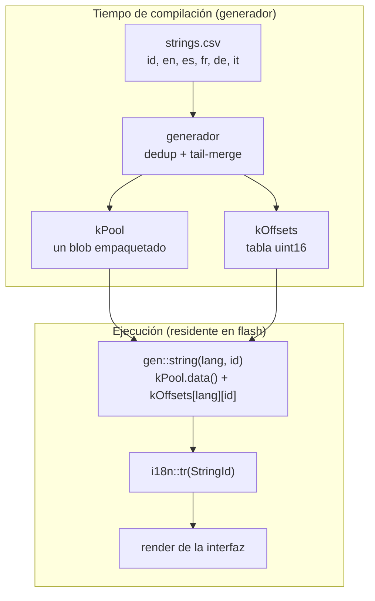
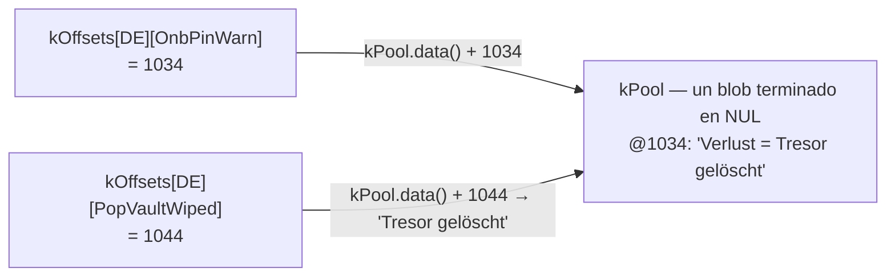

import TLDRSummary from "@components/ui/TLDRSummary.astro";
import Callout from "@components/ui/Callout.astro";
import KeyValue from "@components/ui/KeyValue.astro";
import FileContent from "@components/ui/FileContent.astro";
import Mermaid from "@components/ui/Mermaid.astro";
import Table from "@components/ui/Table.astro";
import BarChart from "@components/ui/BarChart.astro";
import CheckList from "@components/ui/CheckList.astro";
import StepByStep from "@components/ui/StepByStep.astro";
import Collapsible from "@components/ui/Collapsible.astro";
import FileDownload from "@components/ui/FileDownload.astro";
import MemoryMap from "@components/ui/MemoryMap.astro";
import ByteFrame from "@components/ui/ByteFrame.astro";

Envío texto de interfaz en cinco idiomas en un microcontrolador con dos botones y una pantalla diminuta. Cinco idiomas, 265 identificadores de cadena y un chip de 32 bits donde cada byte de flash está contabilizado. La forma clásica de almacenar eso es una tabla bidimensional de punteros `const char*` — y la primera vez que miré el archivo de mapa, me molestó que buena parte de esos bytes se gastara en **direccionamiento**, no en un solo carácter de texto real.

Así que escribí un generador para empaquetar mejor que el linker. Después descubrí que el linker ya hacía casi todo lo que yo había reinventado — y di con la única cosa que de verdad _no_ puede hacer, que resultó ser la ganancia que merecía la pena conservar. Esta es esa historia: un pool de cadenas empaquetado y con _tail-merge_ (fusión por sufijos) y offsets `uint16_t`, lo que ahorró de verdad y una contabilidad honesta de dónde vienen realmente los ahorros.

<TLDRSummary title="Resumen">
- La forma más básica de guardar la i18n es una `const char* table[langs][ids]` — en un MCU de 32 bits son **5.300 bytes de índice de punteros** para 5×265 cadenas, independiente del texto.
- Un generador en tiempo de compilación emite un **pool de cadenas empaquetado, deduplicado y con tail-merge** más una **tabla de offsets `uint16_t`** — el índice baja a **2.650 bytes (−50%)**.
- El tamaño neto del firmware bajó **~2,1 KB** sin cambios en la API ni en las llamadas.
- **Giro inesperado:** los linkers modernos _ya_ hacen tail-merge de los literales de cadena (GNU `ld` por defecto, `ld.lld` con `-O2`). La ganancia imbatible es reducir el índice a la mitad — convertir punteros de 4 bytes en offsets de 2 bytes — algo que ningún linker puede hacer.
- Coste honesto: agrupar todo en un pool renuncia a la dedup cross-module del linker, así que la ganancia neta la da reducir la _tabla_ a la mitad, no el blob.
</TLDRSummary>

---

## La tabla clásica — y lo que cuesta el índice

La forma generada obvia es una rejilla: una fila por idioma, una columna por identificador de cadena, cada celda un puntero a un literal.

<FileContent filename="strings_gen.cpp (versión básica)" language="cpp">
```cpp
// 5 languages × 265 ids
const char* const kStrings[kLangCount][kStringCount] = {
    /* EN */ { "Kleidos", "OK", "Cancel", /* ... */ },
    /* ES */ { "Kleidos", "OK", "Cancelar", /* ... */ },
    /* ... */
};

const char* tr(uint8_t lang, uint16_t id) { return kStrings[lang][id]; }
```
</FileContent>

Es correcto, es legible y es exactamente lo que publican la mayoría de proyectos. Pero fíjate en lo que la tabla _es_: un gran array de direcciones. En 32 bits, un `const char*` ocupa cuatro bytes, y hay uno por celda tanto si la cadena detrás es `"OK"` como una frase entera.

<KeyValue
  title="El coste solo del índice"
  items={[
    { key: "Idiomas × IDs", value: "5 × 265 = 1.325 celdas", description: "Un puntero por idioma y por identificador de cadena." },
    { key: "Tamaño de puntero", value: "4 bytes (32 bits)", description: "Cada celda es un const char* — una dirección reubicable, no texto." },
    { key: "Total de la tabla índice", value: "5.300 bytes", description: "5 × 265 × 4. Puro sobrecoste de direccionamiento, antes de un solo carácter de texto." },
  ]}
/>

Esos 5,3 KB no compran ni un carácter de texto — son el coste de _encontrar_ el texto. Los literales de cadena en sí viven en flash (`.rodata`) y son un coste aparte e inevitable; en MCU con memoria limitada, mantener los literales fuera de la RAM es una preocupación clásica, desde el idiom `PROGMEM`/`F()` de Arduino ([referencia de PROGMEM de Arduino](https://docs.arduino.cc/language-reference/en/variables/utilities/PROGMEM)) hasta cómo [C++ embebido almacena cadenas](https://blog.feabhas.com/2022/02/working-with-strings-in-embedded-c/) en memoria de solo lectura. El texto, por fuerza, había que pagarlo. El índice era la parte que parecía un desperdicio.

---

## ¿Pero el linker no hace esto ya?

Antes de optimizar, conviene preguntarse qué hace la toolchain gratis — y aquí es donde se desmoronó mi primera suposición.

El compilador hace un poco. El `-fmerge-constants` de GCC (activo por defecto a partir de `-O1`), según la [referencia de optimize-options de GCC](https://gcc.gnu.org/onlinedocs/gcc/Optimize-Options.html), «intenta fusionar constantes idénticas» — pero solo las _idénticas y completas_. El trabajo más profundo ocurre en el linker. Los literales de cadena caen en secciones marcadas `SHF_MERGE | SHF_STRINGS`, y el linker tanto deduplica cadenas idénticas **como elimina las que son cola de otra**: dadas `"bigdog"` y `"dog"`, la más corta se descarta y se representa con la cola de la más larga (ver la [guía de linker y bibliotecas de Oracle](https://docs.oracle.com/cd/E23824_01/html/819-0690/ggdlu.html)). Eso es el tail-merge — justo el truco que yo creía estar inventando.

Cómo de agresivo depende del linker y del nivel de optimización:

<Table title="Qué fusiona qué, y cuándo">
  <thead>
    <tr>
      <th scope="col">Etapa</th>
      <th scope="col">¿Fusiona cadenas idénticas?</th>
      <th scope="col">¿Hace tail-merge?</th>
    </tr>
  </thead>
  <tbody>
    <tr>
      <td>**GCC `-fmerge-constants`** (compilador)</td>
      <td data-status="success">Sí (por TU)</td>
      <td data-status="error">No</td>
    </tr>
    <tr>
      <td>**GNU `ld`** (linker)</td>
      <td data-status="success">Sí</td>
      <td data-status="success">Sí — por defecto</td>
    </tr>
    <tr>
      <td>**`ld.lld`** (linker)</td>
      <td data-status="success">Sí (`-O1`, por defecto)</td>
      <td data-status="warning">Solo con `-O2`</td>
    </tr>
  </tbody>
</Table>

Así que GNU `ld` hace tail-merge de las secciones `SHF_MERGE | SHF_STRINGS` por defecto, mientras que `ld.lld` solo lo hace con `-O2` (`-O1`, el valor por defecto, fusiona solo cadenas idénticas; `-O0` desactiva toda fusión) — ver las [notas de ld vs lld de MaskRay](https://maskray.me/blog/2020-12-19-lld-and-gnu-linker-incompatibilities) y [el manual de ld.lld](https://man.archlinux.org/man/extra/lld/ld.lld.1.en). Además es «permitido, no obligatorio» — el algoritmo genérico de fusión de secciones opera sobre elementos completos ([O'Dwyer sobre la fusión de cadenas ELF](https://quuxplusone.github.io/blog/2026/05/05/potentially-nonunique-strategies/)), y el tail-merge es un camino aparte, específico de cadenas, que no está garantizado que todos los enlazados lo ejecuten.

Eso replantea todo el ejercicio. _No_ estoy haciendo algo que el linker no pueda. Entonces, ¿para qué generarlo?

<Callout type="keypoint" title="Dos razones por las que el generador sigue mereciendo su sitio">
1. **Puede que no quieras depender de `-O2`.** Quizá mantengas un nivel de optimización más bajo por depurabilidad o builds reproducibles, o simplemente prefieras no jugarte el presupuesto de flash a un flag del linker. Hacer la dedup y el tail-merge en el generador te da el resultado **independientemente del nivel de optimización**, de forma determinista, _antes_ de que empiece la compilación.
2. **Reducir el índice a la mitad es la ganancia que ningún linker puede dar.** Ningún linker reescribe una tabla de punteros `const char*` de 4 bytes como una tabla de offsets `uint16_t` de 2 bytes. Esa transformación es estructural — va sobre la _forma de tu índice_, que es tuya, no de la toolchain.
</Callout>

La primera razón es un buen extra; la segunda es la que de verdad importa.

---

## El pool empaquetado y la tabla de offsets

El diseño son dos piezas de datos generados. Primero, cada traducción se concatena en un único blob en flash, cada cadena terminada en NUL — así un «offset» es simplemente el inicio de una cadena C corriente. Segundo, una tabla de offsets `uint16_t` por idioma dentro de ese blob, que sustituye a la rejilla de punteros.

<ByteFrame
  title="Dentro de kPool — cadenas almacenadas una tras otra"
  ariaLabel="Disposición en bytes del pool: una cadena, un terminador NUL, la siguiente cadena, otro terminador NUL, y así. El offset de cada cadena es la posición en bytes donde empieza."
  fields={[
    { label: "cadena A", bytes: 6, color: "var(--bf-1)" },
    { label: "\\0", bytes: 1, color: "var(--bf-2)", note: "terminador NUL" },
    { label: "cadena B", bytes: 9, color: "var(--bf-1)" },
    { label: "\\0", bytes: 1, color: "var(--bf-2)", note: "terminador NUL" },
    { label: "más entradas", bytes: 7, variable: true, color: "var(--bf-3)" },
  ]}
  caption="kPool es un único blob: las entradas van una tras otra, cada una terminada en NUL. Un offset es solo el byte donde empieza una cadena C — por eso tr() puede devolver un const char* normal."
/>

El pool de arriba guarda el texto — y se mantiene más o menos del mismo tamaño lo empaquetes o no. El cambio que de verdad compensa está un nivel por encima, en el **índice**: cada entrada que antes era un puntero de 4 bytes pasa a ser un offset de 2 bytes.

<MemoryMap
  title="Una entrada del índice — la parte que se reduce a la mitad"
  scale="shared"
  ariaLabel="Una entrada del índice comparada. Un puntero const char ocupa 4 bytes; un offset uint16 ocupa 2 bytes, la mitad de ancho."
  bars={[
    {
      label: "puntero",
      segments: [
        { label: "const char* (una dirección)", bytes: 4, sizeLabel: "4 B" },
      ],
    },
    {
      label: "offset",
      segments: [{ label: "uint16_t", bytes: 2, sizeLabel: "2 B" }],
    },
  ]}
  caption="El mismo texto en el pool en cualquier caso — lo que cambia es el índice: cada entrada baja de un puntero de 4 bytes a un offset de 2 bytes, reduciendo a la mitad toda la tabla."
/>

<Mermaid caption="Generación en compilación, lookup en ejecución" maxWidth="820px" ariaLabel="Diagrama de flujo de datos. En tiempo de compilación, strings.csv con columnas id, en, es, fr, de, it lo lee el generador, un hook pre-build de PlatformIO, que emite dos estructuras: kPool, un blob empaquetado y con tail-merge de todas las cadenas, y kOffsets, una tabla uint16 de offsets en bytes. En ejecución, el accessor gen string toma un idioma y un id, indexa kOffsets para obtener un offset, lo suma al puntero base de kPool y devuelve una cadena C normal a i18n tr, que la interfaz renderiza.">

</Mermaid>

Lo que se genera son dos `constexpr std::array`: el blob y un array anidado de offsets `uint16_t` dentro de él. Aquí va un extracto real — fíjate en cómo, en la tabla de offsets, **`BRAND` (`"Kleidos"`) y `CommonOk` (`"OK"`) tienen el mismo offset en todos los idiomas** (se deduplican a una sola copia almacenada), mientras que `CommonCancel` diverge por idioma:

<FileContent filename="strings_gen.cpp (empaquetado)" language="cpp">
```cpp
// All translations concatenated into one flash blob — deduplicated and
// tail-merged, emitted longest-first.
constexpr std::array<char, 13374> kPool = {
    "A:avanti  B:modifica  tieni B:indietro\0"  // @0
    "A:weiter  B:öffnen  halten B:zurück\0"      // @39
    "A:weiter  B:bearb.  halten B:zurück\0"      // @77
    "j/k:nav  Espace:ouvrir  S:réglages\0"       // @114
    // ... ~1,000 more entries (longest-first) ...
    // "OK" lands at @1164 (shared by all five languages); "Kleidos" at @9379.
};

// 2-byte offsets into kPool instead of 4-byte pointers. Identical strings
// collapse to one offset; a suffix points partway into a longer entry.
constexpr std::array<std::array<uint16_t, kStringCount>, kLangCount> kOffsets = {{
    //          BRAND  CommonOk  CommonCancel       (… 266 more)
    /* EN */ {{  9379,    1164,        12542, /* … */ }},  // Kleidos · OK · "Cancel"
    /* ES */ {{  9379,    1164,        11279, /* … */ }},  // Kleidos · OK · "Cancelar"
    /* FR */ {{  9379,    1164,        11901, /* … */ }},  //          OK · "Annuler"
    /* DE */ {{  9379,    1164,        10295, /* … */ }},  //          OK · "Abbrechen"
    /* IT */ {{  9379,    1164,        11909, /* … */ }},  //          OK · "Annulla"
}};

static_assert(kPool.size() <= UINT16_MAX, "pool exceeds uint16_t offset range");
```
</FileContent>

Un par de cosas hacen que esto sea seguro y barato de adoptar:

- Un offset apunta al inicio de una cadena terminada en NUL, así que el `tr()` público sigue devolviendo un `const char*` normal. Cada llamada queda **igual** — el cambio es invisible para el resto del firmware.
- **El lookup apenas cuesta más que la tabla de punteros:** una carga `uint16_t` más una suma (`kPool.data() + offset`), frente a una carga de puntero. Es una sola suma entera extra, **sin una segunda indirección** — no pagas en ciclos lo que ahorras en flash.
- **Coste de RAM cero.** Tanto el pool como la tabla de offsets son `constexpr` `.rodata` — viven enteros en flash. El único estado en ejecución es un índice de «idioma actual» de un byte. (Por eso también el `const char*` devuelto es seguro para siempre: apunta a una zona de flash que nunca se libera.)
- Un `static_assert` ([static_assert en cppreference](https://en.cppreference.com/w/cpp/language/static_assert)) garantiza, en tiempo de compilación, que el pool se mantenga por debajo de 64 KiB para que los offsets `uint16_t` puedan direccionarlo todo. Si la tabla crece más allá, el build falla con un error claro en vez de truncar en silencio.
- `std::array` ([std::array en cppreference](https://en.cppreference.com/w/cpp/container/array)) es un agregado con la misma disposición que un `T[N]` crudo — cero sobrecoste frente al array C que sustituye, y `data()` devuelve un puntero al almacenamiento contiguo, así que `kPool.data() + offset` está bien definido.
- Como los offsets se emiten como literales enteros de C++ y se compilan para el target, **no hay problema de endianness ni de serialización** — a diferencia de un formato de blob binario como el `.mo` de gettext.

<MemoryMap
  title="Dónde vive"
  scale="shared"
  ariaLabel="Huella de memoria. En flash, el blob de cadenas empaquetado kPool (unos 13,4 KB) está junto a la tabla kOffsets, mucho más pequeña (unos 2,6 KB). En RAM solo hay un byte, que guarda el índice del idioma activo."
  bars={[
    {
      label: "FLASH",
      segments: [
        {
          label: "kPool — blob de cadenas empaquetado",
          bytes: 13374,
          sizeLabel: "≈ 13,4 KB",
        },
        { label: "kOffsets (tabla uint16)", bytes: 2690, sizeLabel: "≈ 2,6 KB" },
      ],
    },
    {
      label: "RAM",
      segments: [
        { label: "índice de idioma activo", bytes: 1, sizeLabel: "1 byte" },
      ],
    },
  ]}
  caption="Todo es constexpr .rodata, así que vive en flash — el único coste de RAM es un byte para el idioma actual."
/>

### Recuperar una cadena

Detrás de cada lookup hay dos funciones pequeñas. La de bajo nivel `gen::string()` hace el trabajo real — una carga `uint16_t` más una suma — y confía en quien la llama. El `tr()` público añade la comprobación de rango y un fallback a inglés cuando la traducción está vacía, para que quien llama pueda renderizar el resultado sin condiciones:

<FileContent filename="strings_gen.cpp + i18n.cpp" language="cpp">
```cpp
namespace i18n::gen {
// Low-level accessor: one uint16 load + one add. No bounds check — caller-guaranteed.
const char* string(uint8_t lang, uint16_t index) {
    return kPool.data() + kOffsets[lang][index];
}
}  // namespace i18n::gen

namespace i18n {
// Public API: range-check, then fall back to English for an empty translation.
const char* tr(StringId id) {
    const uint16_t index = static_cast<uint16_t>(id);
    if (index >= kStringCount) return "";          // out of range → empty
    const char* text = gen::string(currentLang(), index);
    return text[0] != '\0' ? text : gen::string(/*EN*/ 0, index);
}
}  // namespace i18n
```
</FileContent>

Las llamadas traen los nombres al ámbito una vez, así se leen limpias — sin ruido de `i18n::`, `StringId::` ni `Lang::`. Resuelve un `StringId` en una variable y úsalo, igual que antes:

<FileContent filename="src/ui/… (llamadas reales)" language="cpp">
```cpp
using i18n::tr;
using enum i18n::StringId;   // PinEnter, PopBattLow, CommonCancel, …

const char* prompt = tr(PinEnter);            // resolve once…
display::drawString(prompt, cx, titleY);      // …then draw the label

popup::toast(tr(PopBattLow), nullptr, CAUTION, 3000);   // or inline, for a toast

// What tr() does under the hood — Spanish "Cancel" (lang ES = 1, CommonCancel = 2):
const char* cancel = i18n::gen::string(1, 2);  // kPool.data() + 11279 → "Cancelar"
```
</FileContent>

### Dedup y tail-merge: el núcleo del generador

El empaquetado en sí son una docena de líneas de Python. El truco es colocar las cadenas **de mayor a menor longitud** y, para cada una, comprobar si sus bytes (más el NUL) ya aparecen en algún punto del blob construido hasta ahora. Si aparecen, es un duplicado o un sufijo de algo ya colocado — reutiliza esa posición. Si no, añádela.

<FileContent filename="scripts/gen_i18n.py (el empaquetador)" language="python">
```python
# Unique strings, sorted longest-first so suffixes collapse onto longer strings.
uniq = sorted(
    {entry[lang] for _, entry in rows for lang in LANGS},
    key=lambda s: (-len(s.encode("utf-8")), s),
)

blob = bytearray()
offsets = {}
for s in uniq:
    needle = s.encode("utf-8") + b"\0"
    pos = bytes(blob).find(needle)   # already present (identical OR a tail)?
    if pos >= 0:
        offsets[s] = pos             # reuse — dedup or tail-merge
    else:
        offsets[s] = len(blob)       # new string — append
        blob += needle
```
</FileContent>

Ordenar de mayor a menor longitud es lo que hace que el tail-merge salga gratis: cuando se considera una cadena corta, cualquier cadena más larga que _termine_ con ella ya se ha colocado, así que `find()` localiza la cola compartida. Es la misma forma que un formato con décadas — los `.mo` compilados de GNU gettext guardan las traducciones exactamente como este tipo de tabla de offsets dentro de un bloque de cadenas contiguo ([el formato .mo de gettext](https://www.gnu.org/software/gettext/manual/html_node/MO-Files.html)).

En la tabla actual — que ha crecido a 269 cadenas y subiendo — el efecto es concreto:

<Table title="La tabla de hoy: 5 × 269 = 1.345 celdas">
  <thead>
    <tr>
      <th scope="col">Etapa</th>
      <th scope="col">Cadenas distintas almacenadas</th>
      <th scope="col">Ejemplo</th>
    </tr>
  </thead>
  <tbody>
    <tr>
      <td>Todas las celdas</td>
      <td>1.345</td>
      <td>Cada par (idioma, ID)</td>
    </tr>
    <tr>
      <td>Tras dedup</td>
      <td>1.058</td>
      <td>`"Kleidos"` ×15, `"OK"` ×14 → una sola vez cada una</td>
    </tr>
    <tr>
      <td>Tras tail-merge</td>
      <td>**1.027**</td>
      <td>`"Tresor gelöscht"` reutiliza la cola de `"Verlust = Tresor gelöscht"`</td>
    </tr>
  </tbody>
</Table>

Fíjate en las proporciones: la dedup quita **287** cadenas, el tail-merge solo **31** más. En texto real de interfaz, las cadenas totalmente idénticas (marcas, `"OK"`, etiquetas compartidas) son mucho más comunes que los sufijos compartidos — así que **la dedup hace el trabajo pesado y el tail-merge es un pequeño extra encima**. Eso encaja con la tesis honesta: el titular es reducir el índice a la mitad, no el blob.

Ese extra plantea una pregunta justa, eso sí: si `"Tresor gelöscht"` nunca se almacena por su cuenta, ¿cómo se recupera? Su offset simplemente apunta **a mitad** de la entrada más larga con la que comparte bytes. Como el blob está terminado en NUL, leer desde ese offset da exactamente la cadena más corta — sin ningún caso especial, el mismo `kPool.data() + offset` que todo lo demás:

<Mermaid caption="Una cadena con tail-merge es solo un offset que apunta dentro de otra más larga" maxWidth="760px" ariaLabel="Dos entradas de la tabla de offsets indexan la misma cadena almacenada. OnbPinWarn (alemán) tiene el offset 1034, el inicio de la entrada del blob 'Verlust = Tresor gelöscht'. PopVaultWiped (alemán) tiene el offset 1044, que apunta diez bytes más adentro de esa misma entrada, cayendo en 'Tresor gelöscht'. La traducción más corta nunca se almacena por separado; reutiliza los bytes de cola de la más larga y, como el blob está terminado en NUL, leer desde el offset 1044 devuelve exactamente 'Tresor gelöscht'.">

</Mermaid>

¿Quieres probarlo con tus datos? El [empaquetador de string pool](/es/tools/string-pool-packer/) toma una lista de cadenas (o un CSV de IDs × idiomas), muestra el coste de la tabla de punteros frente al pool empaquetado y revela el offset de cada cadena — incluido cómo se resuelve una con tail-merge dentro de su vecina más larga.

---

## Lo que ahorró de verdad

Estos son los números de cuando hice el cambio, en el build `sticks3` (5 idiomas, 265 IDs en ese momento):

<Table title="Antes y después">
  <thead>
    <tr>
      <th scope="col">Métrica</th>
      <th scope="col">Tabla de punteros</th>
      <th scope="col">Pool empaquetado</th>
      <th scope="col">Cambio</th>
    </tr>
  </thead>
  <tbody>
    <tr>
      <td>Tabla índice</td>
      <td>5.300 B</td>
      <td>2.650 B</td>
      <td data-status="success">**−50%**</td>
    </tr>
    <tr>
      <td>Ancho de entrada del índice</td>
      <td>4 B (puntero)</td>
      <td>2 B (`uint16_t`)</td>
      <td data-status="success">La mitad</td>
    </tr>
    <tr>
      <td>Imagen de firmware</td>
      <td>1.341.067 B</td>
      <td>1.338.903 B</td>
      <td data-status="success">**−2.164 B**</td>
    </tr>
  </tbody>
</Table>

<BarChart
  title="Tabla índice: bytes gastados en direccionamiento"
  data={[
    { label: "Tabla de punteros (4 B)", value: 5300 },
    { label: "Tabla de offsets (2 B)", value: 2650 },
  ]}
  valueUnit=" B"
  ariaLabel="Gráfico de barras que compara el tamaño de la tabla índice: la tabla de punteros de 4 bytes son 5.300 bytes; la tabla de offsets de 2 bytes son 2.650 bytes, una reducción del 50%."
/>

Reducir el índice a la mitad es la ganancia limpia y estructural. Hay un detalle más honesto detrás del número de firmware, eso sí:

<Callout type="warning" title="El blob no es de donde viene la ganancia">
Meter cada cadena en un pool privado **renuncia a la deduplicación cross-module del linker**. Un literal como `"OK"` que también aparezca en otra parte del firmware ya no se fusiona con la copia del pool. En este dataset eso cuesta unos 0,5 KB de vuelta. Así que el ahorro neto de firmware lo impulsa **reducir la tabla a la mitad**, no que el texto empaquetado sea drásticamente más pequeño que lo que `-fmerge-constants` más el linker habrían producido por su cuenta. Vuelve a medir si tu conjunto de cadenas crece mucho — el equilibrio puede cambiar.
</Callout>

Y los offsets son más baratos de una segunda manera, más sutil. Una tabla de punteros son datos _de dirección constante_ — cada entrada es una dirección que la toolchain tiene que fijar; una tabla de offsets `uint16_t` es `.rodata` entera y simple, la mitad de ancho y sin direcciones. (La ganancia es el ancho, no evitar relocations: una imagen MCU enlazada estáticamente y no-PIE no tiene ninguna.) Y como la `.rodata` de la flash del ESP32 está mapeada en memoria (ejecución in-place), el firmware lee el pool con cargas normales — `kPool.data() + offset` es un desreferenciado de puntero normal, sin nada del baile `pgm_read_*` que necesita el clásico `PROGMEM` de AVR.

<Callout type="info" title="¿Merecen la pena 2 KB?">
En términos absolutos, no — un módulo ESP32-S3 típico viene con 8 o 16 MB de flash ([los part numbers de Espressif](https://developer.espressif.com/blog/2025/03/espressif-part-numbers-explained/)), y la partición de app donde vive el firmware se mide en megabytes ([tablas de particiones de ESP-IDF](https://docs.espressif.com/projects/esp-idf/en/release-v5.5/esp32s3/api-guides/partition-tables.html)). Ahorrar 2 KB no salva un dispositivo que va justo de memoria. Lo interesante es lo que _son_ esos 2 KB: puro sobrecoste de índice que no compra texto, y que **se acumula** según crece la tabla — cada cadena nueva añade cinco deltas más de puntero-frente-a-offset. Reducirlo a la mitad una vez evita que ese coste crezca sin freno.
</Callout>

---

## Por qué generarlo en tiempo de compilación

Nada de esto valdría la pena mantener a mano — y mantenerlo a mano sería el bug. Las traducciones viven en un `strings.csv` plano (una fila por ID, una columna por idioma: fácil de revisar en diffs, editable por alguien no programador, y añadir un idioma es añadir una columna). Un generador lo convierte en C++, conectado como un [hook pre-build de PlatformIO](https://docs.platformio.org/en/latest/scripting/launch_types.html):

<FileContent filename="platformio.ini" language="ini">
```ini
[env]
extra_scripts = pre:scripts/gen_i18n.py
```
</FileContent>

El prefijo `pre:` ([la opción extra_scripts de PlatformIO](https://docs.platformio.org/en/latest/projectconf/sections/env/options/advanced/extra_scripts.html)) ejecuta el script antes del build de la plataforma, así los `.cpp`/`.h` generados están siempre sincronizados con el CSV antes de compilar. El script solo escribe su salida cuando el contenido cambia de verdad, así que no dispara recompilaciones innecesarias, y es una parte documentada del [scripting avanzado de PlatformIO](https://docs.platformio.org/en/latest/scripting/index.html), no un apaño. El CSV es la única fuente de verdad; los archivos generados nunca se editan a mano.

Aquí también es donde compensa lo de «antes de compilar, sin depender de `-O2`»: el empaquetado es determinista y vive en el código que guardas en el repositorio. (La clave de orden es `(-byte_length, string)` — ese segundo término rompe empates lexicográficamente, dando un orden _total_, así que el mismo CSV siempre produce una salida idéntica byte a byte, sin importar el orden de iteración del conjunto hash.) Los ahorros no dependen de qué nivel de optimización acabe ejecutando el enlazado final.

### Añadir un idioma o una cadena

Todo el flujo sigue siendo una edición del CSV — sin tocar C++ a mano:

<StepByStep title="Añadir una traducción">
  <li>Añade una **columna** para un idioma nuevo (o una **fila** para un nuevo ID de cadena) a `strings.csv`.</li>
  <li>Compila. El hook `pre:` regenera `strings_gen.{h,cpp}`, así que el nuevo valor del enum `StringId` y sus offsets por idioma aparecen automáticamente.</li>
  <li>Úsalo: `tr(StringId::MyNewLabel)`. Una traducción ausente no es un crash ni un hueco — `tr()` cae al inglés, así que un idioma a medio traducir sigue renderizando.</li>
</StepByStep>

---

## El generador completo

El bucle de empaquetado de arriba es el corazón, pero el generador completo vale la pena leerlo de principio a fin: parseo del CSV con fallback a inglés, el enum `StringId` y la emisión del header, la salida estable para `clang-format` y el guard `write_if_changed` que evita recompilaciones innecesarias. Cógelo, o despliégalo abajo.

<FileDownload
  href="/downloads/gen_i18n.py"
  filename="gen_i18n.py"
  description="Codegen i18n pre-build de PlatformIO"
/>

<Collapsible title="El gen_i18n.py completo">

<FileContent filename="scripts/gen_i18n.py" language="python">
```python
#!/usr/bin/env python3
# Kleidos — i18n codegen.
#
# Reads i18n/strings.csv and emits:
#   src/i18n/Strings_gen.h   (StringId enum + gen::string accessor decl)
#   src/i18n/Strings_gen.cpp (packed, tail-merged string pool + offset table)
#
# Hooked from platformio.ini as `extra_scripts = pre:scripts/gen_i18n.py`.
# Stays a no-op when the generated files are already up-to-date.

import csv
import os
import sys
from pathlib import Path

# `__file__` may not be defined under SCons exec(); fall back to PROJECT_DIR.
try:
    SCRIPT_DIR = Path(__file__).resolve().parent
except NameError:
    SCRIPT_DIR = Path(os.environ.get("PROJECT_DIR", os.getcwd())) / "scripts"
ROOT = SCRIPT_DIR.parent
CSV_PATH = ROOT / "i18n" / "strings.csv"
HDR_PATH = ROOT / "src" / "i18n" / "Strings_gen.h"
CPP_PATH = ROOT / "src" / "i18n" / "Strings_gen.cpp"

LANGS = ["en", "es", "fr", "de", "it"]


def cpp_escape(s: str) -> str:
    out = []
    for ch in s:
        if ch == "\\":
            out.append("\\\\")
        elif ch == '"':
            out.append('\\"')
        elif ch == "\n":
            out.append("\\n")
        elif ch == "\r":
            out.append("\\r")
        elif ch == "\t":
            out.append("\\t")
        else:
            out.append(ch)
    return "".join(out)


def parse_csv(path: Path):
    """Return list of (id, {lang: text}). Skips comment rows starting with '#'."""
    rows = []
    with path.open("r", encoding="utf-8", newline="") as f:
        reader = csv.reader(f)
        header = next(reader)
        if header[0].lower() != "id":
            raise SystemExit(f"i18n: unexpected header {header}")
        col = {h.lower(): i for i, h in enumerate(header)}
        for r in reader:
            if not r or not r[0].strip() or r[0].strip().startswith("#"):
                continue
            sid = r[0].strip()
            entry = {}
            for lang in LANGS:
                idx = col.get(lang)
                val = r[idx] if (idx is not None and idx < len(r)) else ""
                # Fall back to English when a translation is missing.
                entry[lang] = val if val.strip() else (entry.get("en") or r[col["en"]])
            rows.append((sid, entry))
    return rows


def render_header(rows):
    lines = []
    lines.append("// AUTO-GENERATED by scripts/gen_i18n.py — DO NOT EDIT MANUALLY.")
    lines.append("// Regenerated from i18n/strings.csv on every build.")
    lines.append("#pragma once")
    lines.append("#include <cstdint>")
    lines.append("")
    lines.append("namespace i18n {")
    lines.append("")
    lines.append("enum class StringId : uint16_t {")
    for sid, _ in rows:
        lines.append(f"    {sid},")
    lines.append("    COUNT")
    lines.append("};")
    lines.append("")
    lines.append("constexpr uint16_t kStringCount = static_cast<uint16_t>( StringId::COUNT );")
    lines.append("constexpr uint8_t  kLangCount   = 5;  // EN, ES, FR, DE, IT")
    lines.append("")
    lines.append("namespace gen {")
    lines.append("")
    lines.append("/**")
    lines.append(" * @brief Return translation (@p lang, @p index) as a NUL-terminated string.")
    lines.append(" *")
    lines.append(" * Points into the packed flash pool; the returned pointer stays valid for")
    lines.append(" * the program lifetime. No bounds checking — callers must ensure")
    lines.append(" * @p lang < @c kLangCount and @p index < @c kStringCount.")
    lines.append(" */")
    lines.append("const char* string( uint8_t lang, uint16_t index );")
    lines.append("")
    lines.append("}  // namespace gen")
    lines.append("")
    lines.append("}  // namespace i18n")
    lines.append("")
    return "\n".join(lines)


def build_pool(rows):
    """Build a tail-merged string pool.

    Returns (emit, offsets) where `emit` is the list of strings appended to the
    pool in order (each contributes its UTF-8 bytes + a NUL) and `offsets` maps
    every unique string to its byte offset into the concatenated blob.

    Strings are placed longest-first so that any string which is the suffix of
    another collapses onto the longer one's bytes (e.g. "ancel" reuses the tail
    of "Cancel"); identical strings are deduplicated outright.
    """
    uniq = sorted(
        {entry[lang] for _, entry in rows for lang in LANGS},
        key=lambda s: (-len(s.encode("utf-8")), s),
    )
    blob = bytearray()
    offsets = {}
    emit = []
    for s in uniq:
        needle = s.encode("utf-8") + b"\0"
        pos = bytes(blob).find(needle)
        if pos >= 0:
            offsets[s] = pos
        else:
            offsets[s] = len(blob)
            blob += needle
            emit.append(s)
    return emit, offsets, len(blob)


def render_cpp(rows):
    emit, offsets, blob_len = build_pool(rows)
    # +1 keeps the string literal's implicit terminator so the array size is not
    # one short of the initializer (which -Werror rejects).
    pool_size = blob_len + 1

    lines = []
    lines.append("// AUTO-GENERATED by scripts/gen_i18n.py — DO NOT EDIT MANUALLY.")
    lines.append('#include "strings_gen.h"')
    lines.append("")
    lines.append("#include <array>")
    lines.append("#include <cstdint>")
    lines.append("")
    lines.append("namespace i18n {")
    lines.append("namespace gen {")
    lines.append("")
    lines.append("// Packed translation pool: all strings concatenated into one flash blob,")
    lines.append("// deduplicated and tail-merged (a string that is the suffix of another")
    lines.append("// shares its bytes). Adjacent string literals concatenate; the offsets")
    lines.append("// below index into the resulting bytes.")
    lines.append("// clang-format off")
    lines.append(f"constexpr std::array<char, {pool_size}> kPool = {{")
    running = 0
    for s in emit:
        lines.append(f'    "{cpp_escape(s)}\\0"  // @{running}')
        running += len(s.encode("utf-8")) + 1
    lines.append("};")
    lines.append("// clang-format on")
    lines.append("")
    lines.append("// Per-language byte offsets into kPool. uint16_t keeps this table half the")
    lines.append("// size of a 32-bit pointer table and free of load-time relocations.")
    lines.append("// clang-format off")
    lines.append(
        "constexpr std::array<std::array<uint16_t, kStringCount>, kLangCount> kOffsets = { {"
    )
    for lang in LANGS:
        offs = [offsets[entry[lang]] for _, entry in rows]
        lines.append(f"    /* {lang.upper()} */ {{ {{")
        for i in range(0, len(offs), 12):
            chunk = ", ".join(str(o) for o in offs[i : i + 12])
            lines.append(f"        {chunk},")
        lines.append("    } },")
    lines.append("} };")
    lines.append("// clang-format on")
    lines.append("")
    lines.append(
        'static_assert( kPool.size() <= UINT16_MAX, "pool exceeds uint16_t offset range" );'
    )
    lines.append("")
    lines.append("const char* string( uint8_t lang, uint16_t index ) {")
    lines.append("    return kPool.data() + kOffsets[lang][index];")
    lines.append("}")
    lines.append("")
    lines.append("}  // namespace gen")
    lines.append("}  // namespace i18n")
    lines.append("")
    return "\n".join(lines)


def write_if_changed(path: Path, content: str) -> bool:
    """Write only if content differs (avoids triggering recompilation)."""
    path.parent.mkdir(parents=True, exist_ok=True)
    if path.exists():
        old = path.read_text(encoding="utf-8")
        if old == content:
            return False
    path.write_text(content, encoding="utf-8")
    return True


def generate():
    if not CSV_PATH.exists():
        print(f"i18n: missing {CSV_PATH}", file=sys.stderr)
        return False
    rows = parse_csv(CSV_PATH)
    if not rows:
        print("i18n: CSV produced no rows", file=sys.stderr)
        return False
    h_changed = write_if_changed(HDR_PATH, render_header(rows))
    c_changed = write_if_changed(CPP_PATH, render_cpp(rows))
    if h_changed or c_changed:
        print(f"i18n: regenerated {len(rows)} ids x {len(LANGS)} langs")
    return True


# PlatformIO entry point.
try:
    Import("env")  # type: ignore[name-defined]  # noqa: F821
    generate()
except NameError:
    # Standalone CLI invocation.
    if __name__ == "__main__":
        generate()
```
</FileContent>

</Collapsible>

---

## Los caminos no tomados

Algunas alternativas resultaban tentadoras y se descartaron por razones concretas:

<Table title="Alternativas consideradas">
  <thead>
    <tr>
      <th scope="col">Enfoque</th>
      <th scope="col">Por qué no</th>
    </tr>
  </thead>
  <tbody>
    <tr>
      <td>**Mantener la tabla de punteros**</td>
      <td>Lo más simple, pero gasta los 2,6 KB de sobrecoste de índice que la tabla de offsets recupera.</td>
    </tr>
    <tr>
      <td>**Tabla de `std::string_view`**</td>
      <td>«Más moderno», pero cada view es `{ptr, size}` = 8 bytes en 32 bits — _doblaría_ el índice a ~10,6 KB por una longitud que `tr()` nunca necesita.</td>
    </tr>
    <tr>
      <td>**X-macros**</td>
      <td>Codegen elegante todo en C, pero se apoya por completo en macros tipo función, lo que viola la [Regla AUTOSAR C++14 A16-0-1](https://www.mathworks.com/help/bugfinder/ref/autosarc14rulea1601.html) (ahora parte de MISRA C++:2023): el preprocesador es solo para includes y compilación condicional.</td>
    </tr>
    <tr>
      <td>**Compresión en tiempo de ejecución**</td>
      <td>Huffman por cadena ahorra más flash pero necesita un buffer de decodificación en RAM y rompe el contrato de «`tr()` devuelve un puntero estable» del que dependen las llamadas. No vale la pena para ~13 KB de texto.</td>
    </tr>
  </tbody>
</Table>

La disposición empaquetada también es más limpia frente a los objetivos de análisis estático del proyecto que el array C que sustituyó: `std::array` en todo (en vez de arrays estilo C, según [AUTOSAR A18-1-1](https://www.mathworks.com/help/bugfinder/ref/autosarc14rulea1811.html)), una comprobación de límites en compilación vía `static_assert` y sin trucos de preprocesador.

---

## Pruébalo, y la lección

<Callout type="tip" title="Juega con los números">
El [empaquetador de string pool](/es/tools/string-pool-packer/) corre entero en tu navegador: pega un puñado de cadenas (o unas columnas de idiomas) y observa el coste de la tabla de punteros, el coste del pool empaquetado, los aciertos de dedup y los tail-merges, lado a lado.
</Callout>

<CheckList title="Lo que me llevo de esto">
  <li data-check="check">**Mide antes de optimizar.** El linker ya hacía casi todo lo que me propuse «inventar».</li>
  <li data-check="check">**La forma de tu índice es tuya.** Punteros frente a offsets es una elección estructural que ninguna toolchain hará por ti.</li>
  <li data-check="check">**Toma el control de la optimización por adelantado** cuando no quieras que dependa de un flag del linker — el codegen la hace determinista e independiente de `-O`.</li>
  <li data-check="check">**Mantén la fuente amigable para humanos.** Un CSV más un generador gana a una tabla escrita a mano que acabarás desincronizando.</li>
  <li data-check="warning">**Contabiliza con honestidad.** El titular (−50% de índice) es real; el delta de firmware es menor de lo que parece una vez restas la dedup cross-module que cediste.</li>
</CheckList>

Esto salió de Kleidos, un gestor de contraseñas por hardware que estoy construyendo — todavía sin publicar. La capa i18n es un rincón pequeño, pero es un buen recordatorio de que en un objetivo limitado los ahorros interesantes no suelen estar en los datos que guardas, sino en cómo los _indexas_.
