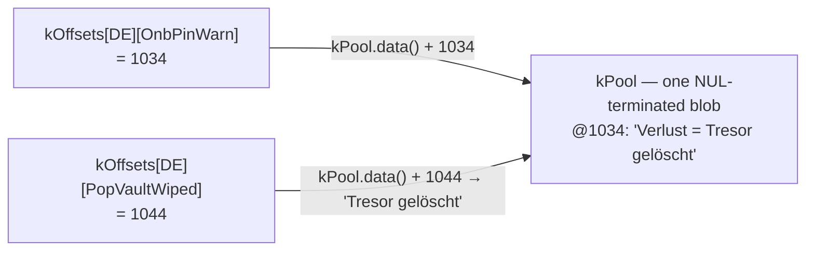

import TLDRSummary from "@components/ui/TLDRSummary.astro";
import Callout from "@components/ui/Callout.astro";
import KeyValue from "@components/ui/KeyValue.astro";
import FileContent from "@components/ui/FileContent.astro";
import Mermaid from "@components/ui/Mermaid.astro";
import Table from "@components/ui/Table.astro";
import CheckList from "@components/ui/CheckList.astro";
import StepByStep from "@components/ui/StepByStep.astro";
import Collapsible from "@components/ui/Collapsible.astro";
import FileDownload from "@components/ui/FileDownload.astro";
import MemoryMap from "@components/ui/MemoryMap.astro";
import ByteFrame from "@components/ui/ByteFrame.astro";
import DeltaCompare from "@components/ui/DeltaCompare.astro";
import StructPacking from "@components/ui/StructPacking.astro";
import LayerStack from "@components/ui/LayerStack.astro";
import ForkJoin from "@components/ui/ForkJoin.astro";

Mi firmware habla cinco idiomas en un microcontrolador con dos botones y una pantalla diminuta. Cinco idiomas, 273 IDs de cadena y un chip de 32 bits donde cada byte de flash está contado. La forma canónica de almacenar eso es una tabla bidimensional de punteros `const char*` — y la primera vez que miré el _map file_, me molestó que una buena parte de esos bytes se gastara en **direccionar**, no en un solo carácter de texto real.

Así que escribí un generador para _empaquetar mejor_ que el linker. Luego descubrí que el linker ya hacía casi todo lo que yo había reinventado — y di con la única cosa que de verdad _no puede_ hacer, que resultó ser la mejora que valía la pena conservar. Esta es esa historia: un pool de cadenas empaquetado y con _tail-merge_ (fusión por sufijos), indexado con offsets `uint16_t`, lo que ahorró de verdad, y una contabilidad honesta de dónde vienen realmente los ahorros.

<TLDRSummary title="TL;DR">
- El esquema i18n básico es un `const char* table[langs][ids]` — en un MCU de 32 bits eso son **5.460 bytes de índice de punteros** para 5×273 cadenas, con independencia del texto.
- Un generador en tiempo de compilación emite un **pool de cadenas empaquetado, deduplicado y con tail-merge** más una **tabla de offsets `uint16_t`** — el índice baja a **2.730 bytes (−50%)**, y las **1.365 relocations** de la tabla básica (una dirección que fijar por celda) pasan a **cero**.
- El firmware encogió **2.224 B** netos en el `-Os` de producción, sin cambios de API ni en los puntos de llamada — y el empaquetado se mantiene más pequeño en **todos** los niveles de optimización, de `-O0` a `-O3`.
- **Giro inesperado:** los linkers modernos _ya_ hacen tail-merge de los literales de cadena (GNU `ld` por defecto, `ld.lld` con `-O2`), así que el _blob_ empaquetado es solo **282 B** más pequeño que lo que produce el linker. La mejora real, a prueba de optimizador, es **estructural** — reducir la tabla a la mitad y borrar las relocations — algo que ningún linker, ni siquiera LTO, puede hacer.
- Coste honesto: agrupar en un pool renuncia a **500 B** de deduplicación cruzada del linker; la mejora de tabla + relocations es la que produce la ganancia neta, no el blob.
</TLDRSummary>

---

## La tabla canónica — y lo que cuesta el índice

La forma generada obvia es una rejilla: una fila por idioma, una columna por ID de cadena, cada celda un puntero a un literal.

<FileContent filename="strings_gen.cpp (versión básica)" language="cpp">
```cpp
// 5 languages × 273 ids
const char* const kStrings[kLangCount][kStringCount] = {
    /* EN */ { "Kleidos", "OK", "Cancel", /* ... */ },
    /* ES */ { "Kleidos", "OK", "Cancelar", /* ... */ },
    /* ... */
};

const char* tr(uint8_t lang, uint16_t id) { return kStrings[lang][id]; }
```
</FileContent>

Es correcto, es legible y es exactamente lo que usa la mayoría de proyectos. Pero fíjate en lo que la tabla _es_: un gran array de direcciones. En un objetivo de 32 bits, un `const char*` ocupa cuatro bytes, y hay uno por celda tanto si la cadena detrás es `"OK"` como una frase entera.

<KeyValue
  title="El coste solo del índice"
  items={[
    { key: "Idiomas × IDs", value: "5 × 273 = 1.365 celdas", description: "Un puntero por idioma, por ID de cadena." },
    { key: "Tamaño del puntero", value: "4 bytes (32 bits)", description: "Cada celda es un const char* — una dirección reubicable, no texto." },
    { key: "Total tabla índice", value: "5.460 bytes", description: "5 × 273 × 4. Puro overhead de direccionamiento, antes de un solo carácter de texto — y una relocation por celda." },
  ]}
/>

Esos 5,5 KB no aportan ni un carácter de texto — son el coste de _encontrar_ el texto. Los literales de cadena en sí viven en flash (`.rodata`) y son un coste aparte e inevitable; en MCUs con memoria ajustada, mantener los literales fuera de la RAM es una preocupación de siempre, desde el patrón `PROGMEM`/`F()` de Arduino ([referencia de PROGMEM de Arduino](https://docs.arduino.cc/language-reference/en/variables/utilities/PROGMEM)) hasta cómo [C++ embebido almacena cadenas](https://blog.feabhas.com/2022/02/working-with-strings-in-embedded-c/) en memoria de solo lectura. El texto tenía que pagarlo. El índice era la parte que parecía un desperdicio.

---

## ¿Pero no hace esto ya el linker?

Antes de optimizar, conviene preguntarse qué hace el toolchain gratis — y aquí es donde se desmoronó mi primera suposición.

El compilador hace un poco. El `-fmerge-constants` de GCC (activado por defecto en `-O1` y superior), según la [referencia de optimize-options de GCC](https://gcc.gnu.org/onlinedocs/gcc/Optimize-Options.html), "intentará fusionar constantes idénticas" — pero solo las _idénticas y completas_. El trabajo más profundo ocurre en el linker. Los literales de cadena acaban en secciones marcadas `SHF_MERGE | SHF_STRINGS`, y el enlazador tanto deduplica cadenas idénticas **como elimina las que son sufijo de otra**: dados `"bigdog"` y `"dog"`, la más corta se descarta y se representa con la cola de la más larga (ver la [guía del linker y librerías de Oracle](https://docs.oracle.com/cd/E23824_01/html/819-0690/ggdlu.html)). Eso es tail-merge — justo el truco que creía estar inventando.

Lo agresivo que sea depende del linker y del nivel de optimización:

<Table title="Qué fusiona qué, y cuándo">
  <thead>
    <tr>
      <th scope="col">Etapa</th>
      <th scope="col">¿Fusiona cadenas idénticas?</th>
      <th scope="col">¿Hace tail-merge de sufijos?</th>
    </tr>
  </thead>
  <tbody>
    <tr>
      <td>**GCC `-fmerge-constants`** (compilador)</td>
      <td data-status="success">Sí (por unidad de traducción)</td>
      <td data-status="error">No</td>
    </tr>
    <tr>
      <td>**GNU `ld`** (linker)</td>
      <td data-status="success">Sí</td>
      <td data-status="success">Sí — por defecto</td>
    </tr>
    <tr>
      <td>**`ld.lld`** (linker)</td>
      <td data-status="success">Sí (`-O1`, por defecto)</td>
      <td data-status="warning">Solo en `-O2`</td>
    </tr>
  </tbody>
</Table>

Así que GNU `ld` hace tail-merge de las secciones `SHF_MERGE | SHF_STRINGS` por defecto, mientras que `ld.lld` solo lo hace con `-O2` (`-O1`, el valor por defecto, solo fusiona cadenas idénticas; `-O0` desactiva la fusión por completo) — ver las [notas de ld vs lld de MaskRay](https://maskray.me/blog/2020-12-19-lld-and-gnu-linker-incompatibilities) y [el manual de ld.lld](https://man.archlinux.org/man/extra/lld/ld.lld.1.en). Además está "permitido, no obligado" — el algoritmo genérico de fusión de secciones opera sobre elementos completos ([O'Dwyer sobre la fusión de cadenas en ELF](https://quuxplusone.github.io/blog/2026/05/05/potentially-nonunique-strategies/)), siendo el tail-merge de cadenas un camino aparte y específico que no todo enlazado ejecuta necesariamente.

Eso replantea todo el ejercicio. _No_ estoy haciendo algo que el linker no pueda. Entonces, ¿para qué generarlo?

<Callout type="keypoint" title="Dos razones por las que el generador sigue mereciendo su sitio">
1. **Puede que no quieras depender de `-O2`.** Quizá mantengas un nivel de optimización más bajo por depurabilidad o builds reproducibles, o simplemente prefieras que tu presupuesto de flash no dependa de un flag del linker. Hacer el dedup y el tail-merge en el generador te da el resultado **sea cual sea el nivel de optimización**, de forma determinista, _antes_ de que la compilación siquiera empiece.
2. **Reducir el índice a la mitad es la mejora que ningún linker puede hacer.** Ningún linker reescribe una tabla de punteros `const char*` de 4 bytes como una tabla de offsets `uint16_t` de 2 bytes. Esa transformación es estructural — va de la _forma de tu índice_, que es tuya, no del toolchain.
</Callout>

La primera razón es un buen extra; la segunda es la que de verdad importa.

---

## El pool empaquetado y la tabla de offsets

El diseño son dos piezas de datos generados. Primero, cada traducción se concatena en un único blob de flash, cada cadena terminada en NUL — así que un "offset" es simplemente el inicio de una cadena C corriente. Segundo, una tabla por idioma de offsets `uint16_t` dentro de ese blob, que sustituye a la rejilla de punteros.

<ByteFrame
  title="Dentro de kPool — cadenas almacenadas una tras otra"
  ariaLabel="Disposición en bytes del pool: una cadena, un terminador NUL, la siguiente cadena, otro terminador NUL, y así. El offset de cada cadena es la posición de byte donde empieza."
  fields={[
    { label: "cadena A", bytes: 6, color: "var(--bf-1)" },
    { label: "\\0", bytes: 1, color: "var(--bf-2)", note: "terminador NUL" },
    { label: "cadena B", bytes: 9, color: "var(--bf-1)" },
    { label: "\\0", bytes: 1, color: "var(--bf-2)", note: "terminador NUL" },
    { label: "más entradas", bytes: 7, variable: true, color: "var(--bf-3)" },
  ]}
  caption="kPool es un solo blob: las entradas van pegadas, cada una terminada en NUL. Un offset es solo el byte donde empieza una cadena C — por eso tr() puede devolver un const char* corriente."
/>

El pool de arriba contiene el texto — y se mantiene más o menos igual de grande tanto si lo empaquetas como si no. El cambio que de verdad compensa está un nivel por encima, en el **índice**: cada entrada que antes era un puntero de 4 bytes pasa a ser un offset de 2 bytes.

<MemoryMap
  title="Una entrada del índice — la parte que se reduce a la mitad"
  scale="shared"
  ariaLabel="Una entrada del índice comparada. Un puntero const char ocupa 4 bytes; un offset uint16 ocupa 2 bytes, la mitad de ancho."
  bars={[
    {
      label: "puntero",
      segments: [
        { label: "const char* (una dirección)", bytes: 4, sizeLabel: "4 B" },
      ],
    },
    {
      label: "offset",
      segments: [{ label: "uint16_t", bytes: 2, sizeLabel: "2 B" }],
    },
  ]}
  caption="El mismo texto en el pool de cualquier forma — lo que cambia es el índice: cada entrada baja de un puntero de 4 bytes a un offset de 2 bytes, reduciendo a la mitad toda la tabla."
/>

<ForkJoin
  ariaLabel="Diagrama de flujo de datos. En tiempo de build, el generador (un hook pre-build de PlatformIO) lee strings.csv con columnas id, en, es, fr, de, it y emite dos estructuras: kPool, un blob empaquetado y con tail-merge de todas las cadenas, y kOffsets, una tabla uint16 de offsets de byte. En runtime, el accessor gen string toma un idioma y un id, indexa kOffsets para obtener un offset, lo suma al puntero base de kPool y devuelve una cadena C normal a i18n tr, que la UI renderiza."
  beforeLabel="Build"
  afterLabel="Runtime"
  before={[
    { name: "strings.csv", note: "id, en, es, fr, de, it" },
    { name: "generator", note: "dedup + tail-merge" },
  ]}
  branches={[
    { name: "kPool", note: "un blob empaquetado" },
    { name: "kOffsets", note: "tabla uint16" },
  ]}
  after={[
    { name: "gen::string(lang, id)", note: "kPool.data() + kOffsets[lang][id]" },
    { name: "i18n::tr(StringId)" },
    { name: "render de UI" },
  ]}
  caption="Generación en build, lookup en runtime"
/>

La salida generada son dos `constexpr std::array`: el blob, y un array anidado de offsets `uint16_t` dentro de él. Aquí va un extracto real — fíjate en cómo, en la tabla de offsets, **`BRAND` (`"Kleidos"`) y `CommonOk` (`"OK"`) tienen el mismo offset en todos los idiomas** (se deduplican a una sola copia almacenada), mientras que `CommonCancel` diverge por idioma:

<FileContent filename="strings_gen.cpp (empaquetado)" language="cpp">
```cpp
// All translations concatenated into one flash blob — deduplicated and
// tail-merged, emitted longest-first.
constexpr std::array<char, 13531> kPool = {
    "A:avanti  B:modifica  tieni B:indietro\0"  // @0
    "A:weiter  B:öffnen  halten B:zurück\0"      // @39
    "A:weiter  B:bearb.  halten B:zurück\0"      // @77
    "j/k:nav  Espace:ouvrir  S:réglages\0"       // @114
    // ... ~1,000 more entries (longest-first) ...
    // "OK" lands at @1164 (shared by all five languages); "Kleidos" at @9379.
};

// 2-byte offsets into kPool instead of 4-byte pointers. Identical strings
// collapse to one offset; a suffix points partway into a longer entry.
constexpr std::array<std::array<uint16_t, kStringCount>, kLangCount> kOffsets = {{
    //          BRAND  CommonOk  CommonCancel       (… 266 more)
    /* EN */ {{  9379,    1164,        12542, /* … */ }},  // Kleidos · OK · "Cancel"
    /* ES */ {{  9379,    1164,        11279, /* … */ }},  // Kleidos · OK · "Cancelar"
    /* FR */ {{  9379,    1164,        11901, /* … */ }},  // Kleidos · OK · "Annuler"
    /* DE */ {{  9379,    1164,        10295, /* … */ }},  // Kleidos · OK · "Abbrechen"
    /* IT */ {{  9379,    1164,        11909, /* … */ }},  // Kleidos · OK · "Annulla"
}};

static_assert(kPool.size() <= UINT16_MAX, "pool exceeds uint16_t offset range");
```
</FileContent>

Varias cosas hacen que esto sea seguro y barato de adoptar:

- Un offset apunta al inicio de una cadena terminada en NUL, así que el `tr()` público sigue devolviendo un `const char*` corriente. Cada punto de llamada queda **sin cambios** — la sustitución es invisible para el resto del firmware.
- **El lookup es apenas más caro que la tabla de punteros:** una carga `uint16_t` más una suma (`kPool.data() + offset`), frente a una carga de puntero. Eso es una sola suma entera extra, **sin una segunda indirección** — no cambias flash por ciclos.
- **Cero coste de RAM.** Tanto el pool como la tabla de offsets son `constexpr` `.rodata` — viven enteramente en flash. El único estado en runtime es un índice de "idioma actual" de un byte. (También por eso el `const char*` devuelto es seguro para siempre: apunta a flash inmortal, nunca se libera.)
- Un `static_assert` ([static_assert en cppreference](https://en.cppreference.com/w/cpp/language/static_assert)) garantiza, en tiempo de compilación, que el pool se mantiene por debajo de 64 KiB para que los offsets `uint16_t` puedan direccionarlo entero. Haz crecer la tabla más allá y el build falla de forma ruidosa en vez de truncar en silencio.
- `std::array` ([std::array en cppreference](https://en.cppreference.com/w/cpp/container/array)) es un agregado con la misma disposición que un `T[N]` crudo — cero overhead frente al array C al que reemplaza, y `data()` devuelve un puntero a almacenamiento contiguo, así que `kPool.data() + offset` está bien definido.
- Como los offsets se emiten como literales enteros de C++ y se compilan para el objetivo, **no hay problema de endianness ni de serialización** — a diferencia de un formato de blob binario como el `.mo` de gettext.

<MemoryMap
  title="Dónde vive — básico vs empaquetado (flash)"
  scale="shared"
  ariaLabel="Huella en flash, ambos diseños a la misma escala. El esquema básico es un blob de literales de unos 13,8 KB más una tabla de punteros de 5,5 KB, 19.273 bytes en total. El esquema empaquetado es un pool de 13,5 KB más una tabla de offsets de 2,7 KB, 16.261 bytes en total. Los dos blobs son casi igual de largos; la diferencia visible es la tabla índice, que se reduce a la mitad al pasar de la versión de punteros a la de offsets."
  bars={[
    {
      label: "Básico (tabla de punteros)",
      segments: [
        { label: "blob de literales", bytes: 13813, sizeLabel: "≈ 13,8 KB", color: "var(--mm-6)" },
        { label: "tabla de punteros (4 B)", bytes: 5460, sizeLabel: "≈ 5,5 KB", color: "var(--mm-5)" },
      ],
    },
    {
      label: "Empaquetado (tabla de offsets)",
      segments: [
        { label: "kPool", bytes: 13531, sizeLabel: "≈ 13,5 KB", color: "var(--mm-6)" },
        { label: "kOffsets (2 B)", bytes: 2730, sizeLabel: "≈ 2,7 KB", color: "var(--mm-5)" },
      ],
    },
  ]}
  caption="El mismo texto de cualquier forma — los dos blobs quedan a 282 B uno del otro. La diferencia visible es el índice: una tabla de punteros de 5.460 B frente a una tabla de offsets de 2.730 B. Ambas viven enteramente en flash (.rodata) y gastan 0 RAM extra más allá de un índice de idioma de 1 byte."
/>

### Recuperar una cadena

Detrás de cada lookup hay dos funciones pequeñas. La de bajo nivel, `gen::string()`, hace el trabajo real — una carga `uint16_t` más una suma — y confía en quien la llama. La pública, `tr()`, añade la comprobación de rango y un fallback a inglés cuando la traducción está vacía, para que quien llama pueda renderizar el resultado sin condiciones:

<FileContent filename="strings_gen.cpp + i18n.cpp" language="cpp">
```cpp
namespace i18n::gen {
// Low-level accessor: one uint16 load + one add. No bounds check — caller-guaranteed.
const char* string(uint8_t lang, uint16_t index) {
    return kPool.data() + kOffsets[lang][index];
}
}  // namespace i18n::gen

namespace i18n {
// Public API: range-check, then fall back to English for an empty translation.
const char* tr(StringId id) {
    const uint16_t index = static_cast<uint16_t>(id);
    if (index >= kStringCount) return "";          // out of range → empty
    const char* text = gen::string(currentLang(), index);
    return text[0] != '\0' ? text : gen::string(/*EN*/ 0, index);
}
}  // namespace i18n
```
</FileContent>

Cada llamada a `tr()` recorre el mismo camino corto — desde un punto de llamada de la UI hasta una única lectura de flash mapeada en memoria, sin heap y sin copia a RAM:

<LayerStack
  title="Dónde aterriza una llamada a tr()"
  ariaLabel="Las capas que atraviesa una llamada a tr(), de arriba abajo: el punto de llamada de la UI que llama a tr de un StringId; i18n tr, que hace la comprobación de rango y el fallback a inglés; i18n gen string, que calcula kPool data más kOffsets indexado por idioma e id; los kOffsets y kPool constexpr rodata; y por último la flash, execute-in-place y mapeada en memoria, con coste cero de RAM."
  layers={[
    { name: "punto de llamada UI", note: "tr(StringId)" },
    { name: "i18n::tr()", note: "rango + fallback a EN" },
    { name: "i18n::gen::string()", note: "kPool.data() + kOffsets[lang][idx]" },
    { name: "kOffsets · kPool", note: "constexpr .rodata" },
    { name: "Flash (XIP)", note: "mapeada en memoria · 0 RAM" },
  ]}
  caption="Una carga uint16 y una suma a la base del pool — luego quien llama renderiza el const char* devuelto. Sin segunda indirección, sin buffer de decodificación."
/>

Los puntos de llamada traen los nombres al scope una vez, así que se leen limpios — sin ruido de `i18n::`, `StringId::` ni `Lang::`. Resuelve un `StringId` en una variable y úsalo, exactamente como antes:

<FileContent filename="src/ui/… (puntos de llamada reales)" language="cpp">
```cpp
using i18n::tr;
using enum i18n::StringId;   // PinEnter, PopBattLow, CommonCancel, …

const char* prompt = tr(PinEnter);            // resolve once…
display::drawString(prompt, cx, titleY);      // …then draw the label

popup::toast(tr(PopBattLow), nullptr, CAUTION, 3000);   // or inline, for a toast

// What tr() does under the hood — Spanish "Cancel" (lang ES = 1, CommonCancel = 2):
const char* cancel = i18n::gen::string(1, 2);  // kPool.data() + 11279 → "Cancelar"
```
</FileContent>

Ese `gen::string(1, 2)` es exactamente lo que hace el desensamblado: la tabla básica haría un `l32i` de un puntero de 32 bits; el accessor empaquetado hace un `l16ui` de un offset de 16 bits y lo suma a la base del pool. **Ambos son una sola carga de tabla** — no hay indirección extra — y la tabla de offsets, al ser la mitad de grande, toca menos líneas de D-cache en un redibujado de menú frecuente. El contrato (`tr()` devuelve un `const char*` prestado, válido durante toda la vida del programa) es lo que permite que el cambio de formato sea invisible para los **210 puntos de llamada de `tr()`** repartidos por la UI, popups, onboarding y el portal de administración: ni uno cambió.

### Dedup y tail-merge: el núcleo del generador

El empaquetado en sí son una docena de líneas de Python. El truco es colocar las cadenas **de la más larga a la más corta** y, para cada una, comprobar si sus bytes (más el NUL) ya aparecen en alguna parte del blob construido hasta ese momento. Si aparecen, es un duplicado o un sufijo de algo ya colocado — reutiliza esa posición. Si no, la añade al final.

<FileContent filename="scripts/gen_i18n.py (el empaquetador)" language="python">
```python
# Unique strings, sorted longest-first so suffixes collapse onto longer strings.
uniq = sorted(
    {entry[lang] for _, entry in rows for lang in LANGS},
    key=lambda s: (-len(s.encode("utf-8")), s),
)

blob = bytearray()
offsets = {}
for s in uniq:
    needle = s.encode("utf-8") + b"\0"
    pos = bytes(blob).find(needle)   # already present (identical OR a tail)?
    if pos >= 0:
        offsets[s] = pos             # reuse — dedup or tail-merge
    else:
        offsets[s] = len(blob)       # new string — append
        blob += needle
```
</FileContent>

Ordenar de la más larga a la más corta es lo que hace que el tail-merge salga gratis: cuando le toca el turno a una cadena corta, cualquier cadena más larga que _termine_ con ella ya está colocada, así que `find()` localiza la cola compartida. Es la misma forma que un formato de hace décadas — los `.mo` compilados de GNU gettext almacenan las traducciones exactamente como este tipo de tabla de offsets sobre un bloque de cadenas contiguo ([el formato .mo de gettext](https://www.gnu.org/software/gettext/manual/html_node/MO-Files.html)).

En la tabla actual — que ha crecido hasta 273 IDs de cadena y subiendo — el efecto es concreto:

<Table title="La tabla de hoy: 5 × 273 = 1.365 celdas">
  <thead>
    <tr>
      <th scope="col">Etapa</th>
      <th scope="col">Cadenas distintas</th>
      <th scope="col">Tamaño del pool</th>
    </tr>
  </thead>
  <tbody>
    <tr>
      <td>Todas las celdas</td>
      <td>1.365</td>
      <td>Cada par (idioma, ID)</td>
    </tr>
    <tr>
      <td>Tras dedup</td>
      <td>1.071</td>
      <td>13.813 B — `"Kleidos"` ×15, `"OK"` ×14 → almacenadas una vez cada una</td>
    </tr>
    <tr>
      <td>Tras tail-merge</td>
      <td>1.071*</td>
      <td>**13.531 B** — `"Tresor gelöscht"` reutiliza la cola de `"Verlust = Tresor gelöscht"`</td>
    </tr>
  </tbody>
</Table>

<small>\*El tail-merge no elimina cadenas — siguen siendo todas distintas — solapa su _almacenamiento_, así que el recuento se queda en 1.071 mientras el de bytes baja.</small>

Fíjate en las proporciones: el dedup colapsa 1.365 celdas a **1.071** cadenas distintas (**−294**); el tail-merge solapa luego sufijos, recortando otros **282 bytes** (13.813 → 13.531 B). En texto de UI real, las cadenas totalmente idénticas (nombres de marca, `"OK"`, etiquetas compartidas) son mucho más comunes que los sufijos compartidos — así que **el dedup hace el trabajo pesado y el tail-merge es una pequeña propina encima**. Encaja con la tesis de honestidad: la mejora titular es reducir el índice a la mitad, no el blob — al que, como mediremos, el linker se acerca por su cuenta hasta quedar a solo 282 bytes.

Esa propina sí plantea una pregunta justa: si `"Tresor gelöscht"` nunca se almacena por su cuenta, ¿cómo se recupera? Su offset simplemente apunta **a un punto interior** de la entrada más larga con la que comparte bytes. Como el blob termina en NUL, leer desde ese offset da exactamente la cadena más corta — sin caso especial, el mismo `kPool.data() + offset` que todo lo demás:

<Mermaid caption="Una cadena con tail-merge es solo un offset que apunta dentro de otra más larga" maxWidth="760px" ariaLabel="Dos entradas de la tabla de offsets indexan la misma cadena almacenada. OnbPinWarn (alemán) tiene offset 1034, el inicio de la entrada del blob 'Verlust = Tresor gelöscht'. PopVaultWiped (alemán) tiene offset 1044, que apunta diez bytes más adentro de esa misma entrada, cayendo en 'Tresor gelöscht'. La traducción más corta nunca se almacena por separado; reutiliza los bytes de la cola de la más larga, y como el blob termina en NUL, leer desde el offset 1044 devuelve exactamente 'Tresor gelöscht'.">

</Mermaid>

¿Quieres probarlo con tus propios datos? El [string-pool packer](/tools/string-pool-packer/) toma una lista de cadenas (o un CSV de IDs × idiomas), muestra el coste de la tabla de punteros vs el pool empaquetado, y revela el offset de cada cadena — incluido cómo una con tail-merge se resuelve dentro de su vecina más larga.

---

## Lo que ahorró de verdad

Estos son los números del build real `sticks3` (5 idiomas, 273 IDs), empaquetado frente a la tabla de punteros básica, ambos en el `-Os` de producción:

<DeltaCompare
  title="Empaquetado vs la tabla de punteros básica (-Os)"
  unit=" B"
  ariaLabel="Comparación de bytes antes/después, tabla de punteros básica frente a pool empaquetado. Tabla índice de 5.460 a 2.730 bytes, un 50 por ciento menos. Datos i18n totales de 19.273 a 16.261 bytes. Imagen de firmware de 1.564.784 a 1.562.560 bytes, 2.224 bytes menos."
  rows={[
    { label: "Tabla índice", before: 5460, after: 2730 },
    { label: "datos i18n (pool + tabla)", before: 19273, after: 16261 },
    { label: "Imagen de firmware", before: 1564784, after: 1562560 },
  ]}
  caption="Básico (antes) vs empaquetado (después) en -Os. El índice se reduce a la mitad con un −2.730 B (−50%) constante; los datos i18n bajan −3.012 B; todo el firmware encoge −2.224 B — todas las métricas a favor del diseño empaquetado."
/>

Reducir el índice a la mitad es la mejora limpia y estructural — un **−2.730 B (−50%)** constante que, como veremos, no se mueve con el nivel de optimización. Pero fíjate en que el delta del firmware (−2.224 B) es _más pequeño_ que el delta de datos (−3.012 B), y hay una razón honesta:

<Callout type="warning" title="El blob no es de donde viene la mejora">
Meter cada cadena en un pool privado **renuncia a la deduplicación cruzada del linker**: 70 de las cadenas del pool (`"OK"`, `"FAIL"`, `"Done"`…) también viven sueltas en otros sitios del firmware — etiquetas de LVGL, tokens de log — y ya no se fusionan con la copia del pool. Eso cuesta **500 B**. Y en `-Os` el propio dedup de literales del linker deja el blob _básico_ a solo **282 B** del nuestro — así que el blob **no** es de donde viene la mejora. El ahorro neto del firmware se apoya en **reducir la tabla a la mitad y borrar las relocations**, no en que el texto empaquetado sea drásticamente más pequeño que lo que producen `-fmerge-constants` y el linker por su cuenta.
</Callout>

Como la `.rodata` en flash del ESP32 está mapeada en memoria (execute-in-place), el firmware lee el pool con cargas normales — `kPool.data() + offset` es un simple desreferenciado de puntero, sin nada del baile de `pgm_read_*` que necesita el `PROGMEM` clásico de AVR.

### Una dirección por celda — o ninguna

Hay una segunda diferencia estructural que los recuentos de bytes no muestran. Una tabla de punteros son **datos con direcciones constantes**: cada celda contiene la dirección absoluta de una cadena, y cada dirección es una **relocation** que el linker debe resolver. La tabla de offsets contiene enteros `uint16_t` sin más — independientes de la posición, nada que fijar.

<DeltaCompare
  title="Relocations en el índice i18n (por objeto)"
  ariaLabel="Conteo de relocations antes/después en el objeto del índice i18n. La tabla de punteros básica emite 1.365 relocations, una por celda; la tabla de offsets empaquetada emite cero."
  rows={[{ label: "relocations", before: 1365, after: 0 }]}
  caption="Básico (antes): un registro R_XTENSA_32 por celda — 1.365 en total, 16.380 B de .rela en el objeto. Empaquetado (después): la tabla de offsets son enteros, así que su sección de datos no lleva ninguna relocation (las únicas dos en el lado empaquetado son las cargas de dirección base del accessor — una constante que no escala)."
/>

En este firmware es una señal estructural limpia, no un coste en runtime. La imagen está **enlazada estáticamente y es execute-in-place**, así que el linker resuelve los 1.365 registros básicos a direcciones absolutas _en tiempo de enlace_ — ninguno de los dos formatos arrastra relocations al `.bin` final, y lo que sobrevive son exactamente los **+2.730 B** de la tabla de punteros. Pero el conteo es el indicador honesto de "cuántas direcciones hay que materializar": el empaquetado es **O(1)** (dos cargas de base en el accessor), el básico es **O(celdas)** — una por cadena, creciendo con cada ID y cada idioma que añades. También deja la tabla _independiente de la posición_, que es el único sitio donde se gana el sueldo en un dispositivo que se actualiza en campo: con **delta OTA** (enviar un diff binario) una tabla de punteros absolutos cambia cada vez que algo aguas arriba en flash desplaza sus direcciones, inflando el parche, mientras que los offsets enteros se quedan quietos — una ventaja estructural, aunque no he medido los tamaños de parche.

<Callout type="info" title="¿Merecen la pena 2 KB siquiera?">
En términos absolutos, no — un módulo ESP32-S3 típico viene con 8 o 16 MB de flash ([referencias de Espressif](https://developer.espressif.com/blog/2025/03/espressif-part-numbers-explained/)), y la partición de app donde vive el firmware se mide en megabytes ([tablas de particiones de ESP-IDF](https://docs.espressif.com/projects/esp-idf/en/release-v5.5/esp32s3/api-guides/partition-tables.html)). Ahorrar 2 KB no salva un dispositivo asfixiado. La cuestión es lo que esos 2 KB _son_: puro overhead de índice que no aporta texto, y que **se acumula** según crece la tabla. La regla práctica: empaquetar ahorra **2 × (ids × idiomas)** bytes de tabla más una relocation por celda — hoy 2.730 B; un sexto idioma añade +546 B. Reducirlo a la mitad una vez evita que esa línea siga subiendo para siempre.
</Callout>

### ¿Escala?

Sí — y la parte que importa es **aritmética exacta**, no una conjetura. Cada ahorro es una fórmula cerrada en el número de celdas `N`, que no es más que la forma de tu CSV:

```text
N (celdas)     = ids × langs        ← filas del CSV × columnas de idioma
tabla punteros = 4 × N bytes        ← un puntero de 32 bits por celda
tabla offsets  = w × N bytes        ← w = 2  (uint16, pool ≤ 64 KiB)
                                          4  (uint32, pools mayores)
tabla ahorrada = (4 − w) × N bytes  ← (un uint24 a mano haría w = 3)
relocations    = N eliminadas       ← una por celda de puntero
```

Por tanto, los números de tabla ahorrada y de relocations están **calculados, no asumidos** — los lees directamente de `ids × langs`. El _único_ dato estimado es qué ancho de offset `w` aplica, porque eso depende del tamaño del pool; pasado el punto medido de hoy (273 IDs → 13.531 B, ≈ 50 B/ID) el tamaño del pool se extrapola linealmente. Proyectando (con `w` indicado por fila):

<Table title="Ahorro proyectado según crece la tabla (× 5 idiomas)">
  <thead>
    <tr>
      <th scope="col">IDs de cadena</th>
      <th scope="col">Celdas</th>
      <th scope="col">Tabla punteros</th>
      <th scope="col">Tabla offsets</th>
      <th scope="col">Tabla ahorrada</th>
      <th scope="col">Relocations borradas</th>
    </tr>
  </thead>
  <tbody>
    <tr><td>273 (hoy)</td><td>1.365</td><td>5.460 B</td><td>2.730 B (`uint16`)</td><td data-status="success">2.730 B</td><td>1.365</td></tr>
    <tr><td>500</td><td>2.500</td><td>10.000 B</td><td>5.000 B (`uint16`)</td><td data-status="success">5.000 B</td><td>2.500</td></tr>
    <tr><td>1.000</td><td>5.000</td><td>20.000 B</td><td>10.000 B (`uint16`)</td><td data-status="success">10.000 B</td><td>5.000</td></tr>
    <tr><td>2.000</td><td>10.000</td><td>40.000 B</td><td>40.000 B (`uint32`)†</td><td>0 B</td><td>10.000</td></tr>
    <tr><td>10.000</td><td>50.000</td><td>200.000 B</td><td>200.000 B (`uint32`)†</td><td>0 B</td><td>50.000</td></tr>
  </tbody>
</Table>

<small>† Pasados unos **1.300 IDs** el pool supera los 64 KiB, así que un offset `uint16` ya no llega al extremo lejano y salta el `static_assert(kPool.size() <= UINT16_MAX)`. El arreglo mínimo del generador es un offset `uint32` — que **iguala en ancho al puntero de 32 bits, así que la ventaja de tabla desaparece** y solo siguen rindiendo las relocations eliminadas y el blob con tail-merge. (Empaquetar offsets `uint24` de 3 bytes recuperaría una ventaja de 1 byte por celda — direccionan 16 MB — pero el generador no los emite hoy.)</small>

Así que la respuesta honesta sobre el escalado tiene dos mitades. **La eliminación de relocations escala sin límite** — una por celda, siempre — 50.000 fuera con 10.000 IDs. El **−50% de tabla tiene techo**: solo se mantiene mientras el pool cabe en un offset de 16 bits (≲ 1.300 IDs con este perfil de texto), y pasado eso un offset `uint32` iguala el ancho del puntero, así que el ahorro de índice se aplana a cero y el valor pasa por completo a la independencia de posición (relocations, buen encaje con delta-OTA) y al blob con tail-merge. Ese pool de 64 KiB es justo la frontera que el `static_assert` te obliga a reconsiderar — no un punto donde la técnica deja de ayudar, sino donde su _forma_ tiene que cambiar.

### Otros MCUs: a menudo una mejora mayor que aquí

Nada de esto es específico del ESP32 — el índice es una tabla de punteros frente a una tabla de enteros, así que la mejora depende de dos cosas: lo ancho que sea un puntero en tu objetivo, y lo ajustado que esté tu presupuesto de flash. Un offset `uint16` son los mismos 2 bytes en todas partes, así que ahorra más cuanto mayor sea el puntero al que sustituye:

<Table title="La mejora del offset según el ancho de puntero del objetivo">
  <thead>
    <tr>
      <th scope="col">Objetivo</th>
      <th scope="col">Puntero en flash</th>
      <th scope="col">Ahorro del offset `uint16` / celda</th>
    </tr>
  </thead>
  <tbody>
    <tr><td>AVR 8 bits ≤ 64 KB (ATmega328)</td><td>2 B</td><td>0 B — ya son 2 B; solo ayudan dedup + tail-merge</td></tr>
    <tr><td>AVR 8 bits, far pointers (ATmega2560)</td><td>3 B</td><td>−1 B (o un offset `uint24`)</td></tr>
    <tr><td>Cortex-M 32 bits — STM32, RP2040, nRF</td><td>4 B</td><td data-status="success">**−2 B (−50%)** — idéntico a aquí</td></tr>
    <tr><td>RISC-V 32 bits (ESP32-C3, GD32V)</td><td>4 B</td><td data-status="success">−2 B (−50%)</td></tr>
    <tr><td>64 bits (procesador de aplicación Cortex-A / SBC)</td><td>8 B</td><td data-status="success">**−6 B (−75%)**</td></tr>
  </tbody>
</Table>

Así que en cualquier Cortex-M de 32 bits — un STM32 pequeño, el RP2040 de una Raspberry Pi Pico, un nRF de Nordic — obtienes exactamente el −50% medido aquí sin portar nada; en un objetivo de 64 bits la tabla de offsets es una _cuarta parte_ del tamaño de la tabla de punteros.

La palanca mayor, sin embargo, es **qué fracción de flash recuperas.** Esos mismos 2,7 KB son un error de redondeo en un ESP32-S3 de 8–16 MB, pero son ~1% de un STM32G0 de 256 KB y **~4%** de un STM32L0 de 64 KB — ahí, la tabla es la diferencia entre que quepan tus traducciones o no. Así que la respuesta honesta a "¿merecen la pena 2 KB?" depende por completo del chip: apenas, aquí; decisivamente en una pieza con poca flash y varios idiomas. Si vas a poner texto de UI en cinco idiomas en un microcontrolador con decenas de KB de flash, es justo aquí donde se gana su sitio — y la libertad de relocations importa más allí también, en cualquier objetivo que distribuya imágenes reubicables o actualizaciones delta-OTA.

---

## Lo que ningún optimizador hará por ti

El título no es retórico. Antes de fiarme de la mejora, comprobé si un toolchain más listo podía cerrar la brecha — en cada nivel de optimización, y con los dos pases que en teoría podrían: link-time optimization y fusión agresiva de constantes.

### Los datos empaquetados son byte a byte idénticos en todos los niveles -O

Extrae `kPool` y `kOffsets` del objeto en `-O0`, `-O1`, `-Os`, `-O2` y `-O3` y haz su hash: **un único hash distinto cada uno**. El compilador emite los arrays tal cual — nunca los reempaqueta, realinea ni fusiona — así que los datos i18n empaquetados son **byte a byte idénticos** en todos los niveles: 13.531 B de pool + 2.730 B de tabla = **16.261 B, siempre**. Elegir `-O` es indiferente para los datos i18n; solo mueve _código_ y el alineamiento de literales del lado _básico_. (Subir toda la imagen a `-O2` por sí mismo añadiría unos 160 KB de flash para **cero** beneficio i18n — `-Os` es el valor correcto por defecto.)

### El empaquetado gana en todos los niveles — y -Os es el margen _más pequeño_

Enlacé todo el firmware de las dos formas en los cinco niveles. El empaquetado es más pequeño siempre:

<Table title="Firmware completo: empaquetado vs básico en cada nivel -O">
  <thead>
    <tr>
      <th scope="col">`-O`</th>
      <th scope="col">`firmware.bin` empaquetado</th>
      <th scope="col">`firmware.bin` básico</th>
      <th scope="col">ahorro empaquetado</th>
    </tr>
  </thead>
  <tbody>
    <tr><td>`-O0`</td><td>1.812.736 B</td><td>1.817.312 B</td><td data-status="success">+4.576 B</td></tr>
    <tr><td>`-O1`</td><td>1.622.688 B</td><td>1.626.656 B</td><td data-status="success">+3.968 B</td></tr>
    <tr><td>**`-Os`** (enviado)</td><td>1.562.560 B</td><td>1.564.784 B</td><td data-status="success">**+2.224 B**</td></tr>
    <tr><td>`-O2`</td><td>1.723.040 B</td><td>1.726.864 B</td><td data-status="success">+3.824 B</td></tr>
    <tr><td>`-O3`</td><td>1.716.576 B</td><td>1.720.544 B</td><td data-status="success">+3.968 B</td></tr>
  </tbody>
</Table>

Ningún nivel empata, ninguno favorece al básico. El margen **más pequeño** está en el `-Os` de producción (+2.224 B) — el único nivel donde el dedup de literales `.str1.1` del linker deja el blob básico casi tan apretado como nuestro pool, así que la brecha se estrecha hasta más o menos la diferencia de tabla por sí sola. Todos los demás niveles la _ensanchan_: los literales básicos se inflan (padding de alineamiento a 4 en `-O1`/`-O2`/`-O3`, sin fusión en `-O0`) mientras nuestras tablas nunca se mueven.

<Callout type="note" title="Matiz honesto sobre el barrido">
GCC tiene todos los niveles `-O`, pero ESP-IDF solo conecta `-O0`/`-Og`/`-Os`/`-O2` a sus presets de Kconfig — `-O1` y `-O3` no son presets en absoluto. Así que aquí solo `-Os` y `-O2` son niveles reales de todo el firmware; para medir `-O0`, `-O1` y `-O3` los **forcé** sobre las fuentes propias de Kleidos (la unidad de traducción de i18n incluida) con un hook de CMake `target_compile_options`, dejando las librerías del framework en `-Os`. Esas tres filas son, por tanto, "proyecto en `-Ox`, framework en `-Os`". No sesga la comparación empaquetado-vs-básico — ambos builds recibieron el mismo trato en cada nivel, y los datos i18n son inmunes a `-O` de todos modos — pero también es por lo que un `-O0` de toda la imagen ni siquiera está en la tabla: un enlace `-O0` puro falla aquí, porque una función de la pila Bluetooth solo se vuelve inline en `-Os` y superior.
</Callout>

### Ni siquiera LTO cierra la brecha

La link-time optimization es el único pase que podría, en principio, hacer la fusión cruzada que el linker normal no puede. Apliqué `-flto` al componente del proyecto — donde viven la tabla i18n y todo lo que la llama — y, por si acaso, el no estándar `-fmerge-all-constants`:

<Table title="¿Puede un optimizador más listo rescatar la tabla básica? (-Os)">
  <thead>
    <tr>
      <th scope="col">Build</th>
      <th scope="col">`firmware.bin`</th>
      <th scope="col">tabla i18n</th>
      <th scope="col">Δ vs su baseline</th>
    </tr>
  </thead>
  <tbody>
    <tr><td>empaquetado (baseline)</td><td>1.562.560 B</td><td>2.730 B</td><td>—</td></tr>
    <tr><td>empaquetado + `-flto`</td><td>1.562.560 B</td><td>2.730 B</td><td data-status="success">0 B</td></tr>
    <tr><td>básico (baseline)</td><td>1.564.784 B</td><td>5.460 B</td><td>—</td></tr>
    <tr><td>básico + `-flto`</td><td>1.564.720 B</td><td>5.460 B</td><td data-status="warning">−64 B</td></tr>
    <tr><td>básico + `-fmerge-all-constants`</td><td>1.564.160 B</td><td>5.460 B</td><td data-status="warning">−624 B</td></tr>
  </tbody>
</Table>

LTO recorta unos insignificantes **64 B** de la imagen básica, **0 B** de la empaquetada y — esta es la clave — deja la **tabla de punteros de 5.460 B intacta**. Puede fusionar código y plegar constantes, pero no puede convertir una tabla de punteros de 32 bits en una tabla de offsets de 16 bits, ni puede hacer tail-merge de sufijos de cadena. Incluso `-fmerge-all-constants` — que es _no conforme_, ya que puede fusionar objetos distintos que casualmente comparten valor y romper la identidad de puntero — solo recorta el blob en 624 B y aun así pierde por **+1.600 B**. La mejora estructural sobrevive a todos los optimizadores que le eché, que es justo la idea: **la forma de tu índice es lo único que el toolchain no elegirá por ti.**

---

## Por qué generarlo en tiempo de compilación

Nada de esto valdría la pena mantenerlo a mano — y mantenerlo a mano sería el bug. Las traducciones viven en un simple `strings.csv` (una fila por ID, una columna por idioma: fácil de comparar en diffs, editable por alguien que no programa, y añadir un idioma es añadir una columna). Un generador lo convierte en C++, conectado como un [hook pre-build de PlatformIO](https://docs.platformio.org/en/latest/scripting/launch_types.html):

<FileContent filename="platformio.ini" language="ini">
```ini
[env]
extra_scripts = pre:scripts/gen_i18n.py
```
</FileContent>

El prefijo `pre:` ([la opción extra_scripts de PlatformIO](https://docs.platformio.org/en/latest/projectconf/sections/env/options/advanced/extra_scripts.html)) ejecuta el script antes del build de la plataforma, así que el `.cpp`/`.h` generado siempre está sincronizado con el CSV antes de compilar. El script escribe su salida solo cuando el contenido cambia de verdad, así que no dispara recompilaciones innecesarias, y es una parte documentada del [scripting avanzado de PlatformIO](https://docs.platformio.org/en/latest/scripting/index.html), no un añadido. El CSV es la única fuente de verdad; los archivos generados nunca se editan a mano.

Aquí también es donde rinde la propiedad de "antes de compilar, sin importar `-O2`": el empaquetado es determinista y vive en el código fuente que subes al repositorio. (La clave de ordenación es `(-byte_length, string)` — ese segundo término rompe empates lexicográficamente, dando un orden _total_, así que el mismo CSV produce siempre una salida byte a byte idéntica con independencia del orden de iteración del hash-set.) Los ahorros no dependen del nivel de optimización con que se ejecute el enlace final.

### Añadir un idioma o una cadena

Todo el flujo sigue siendo editar un CSV — sin tocar C++ a mano:

<StepByStep title="Añadir una traducción">
  <li>Añade una **columna** para un idioma nuevo (o una **fila** para un ID de cadena nuevo) a `strings.csv`.</li>
  <li>Compila. El hook `pre:` regenera `strings_gen.{h,cpp}`, así que el nuevo valor del enum `StringId` y sus offsets por idioma aparecen automáticamente.</li>
  <li>Úsalo: `tr(StringId::MyNewLabel)`. Una traducción que falta no es un crash ni un hueco — `tr()` recae en la columna inglesa, así que un idioma a medio traducir sigue renderizando.</li>
</StepByStep>

---

## El generador completo

El bucle de empaquetado de arriba es el corazón, pero el generador completo vale la pena leerlo de cabo a rabo: el parseo del CSV con fallback a inglés, el enum `StringId` y la emisión de la cabecera, la salida estable con `clang-format`, y el guard `write_if_changed` que evita recompilaciones innecesarias. Descárgalo, o despliégalo abajo.

<FileDownload
  href="/downloads/gen_i18n.py"
  filename="gen_i18n.py"
  description="Codegen i18n pre-build de PlatformIO"
/>

<Collapsible title="El gen_i18n.py completo">

<FileContent filename="scripts/gen_i18n.py" language="python">
```python
#!/usr/bin/env python3
# Kleidos — i18n codegen.
#
# Reads i18n/strings.csv and emits:
#   src/i18n/Strings_gen.h   (StringId enum + gen::string accessor decl)
#   src/i18n/Strings_gen.cpp (packed, tail-merged string pool + offset table)
#
# Hooked from platformio.ini as `extra_scripts = pre:scripts/gen_i18n.py`.
# Stays a no-op when the generated files are already up-to-date.

import csv
import os
import sys
from pathlib import Path

# `__file__` may not be defined under SCons exec(); fall back to PROJECT_DIR.
try:
    SCRIPT_DIR = Path(__file__).resolve().parent
except NameError:
    SCRIPT_DIR = Path(os.environ.get("PROJECT_DIR", os.getcwd())) / "scripts"
ROOT = SCRIPT_DIR.parent
CSV_PATH = ROOT / "i18n" / "strings.csv"
HDR_PATH = ROOT / "src" / "i18n" / "Strings_gen.h"
CPP_PATH = ROOT / "src" / "i18n" / "Strings_gen.cpp"

LANGS = ["en", "es", "fr", "de", "it"]


def cpp_escape(s: str) -> str:
    out = []
    for ch in s:
        if ch == "\\":
            out.append("\\\\")
        elif ch == '"':
            out.append('\\"')
        elif ch == "\n":
            out.append("\\n")
        elif ch == "\r":
            out.append("\\r")
        elif ch == "\t":
            out.append("\\t")
        else:
            out.append(ch)
    return "".join(out)


def parse_csv(path: Path):
    """Return list of (id, {lang: text}). Skips comment rows starting with '#'."""
    rows = []
    with path.open("r", encoding="utf-8", newline="") as f:
        reader = csv.reader(f)
        header = next(reader, None)
        if not header or header[0].lower() != "id":
            raise SystemExit(f"i18n: missing or unexpected header {header}")
        col = {h.lower(): i for i, h in enumerate(header)}
        # English is the fallback column, so it must exist before parsing rows.
        if "en" not in col:
            raise SystemExit("i18n: CSV must contain an 'en' column")
        for r in reader:
            if not r or not r[0].strip() or r[0].strip().startswith("#"):
                continue
            sid = r[0].strip()
            entry = {}
            for lang in LANGS:
                idx = col.get(lang)
                val = r[idx] if (idx is not None and idx < len(r)) else ""
                # Fall back to English when a translation is missing.
                entry[lang] = val if val.strip() else (entry.get("en") or r[col["en"]])
            rows.append((sid, entry))
    return rows


def render_header(rows):
    lines = []
    lines.append("// AUTO-GENERATED by scripts/gen_i18n.py — DO NOT EDIT MANUALLY.")
    lines.append("// Regenerated from i18n/strings.csv on every build.")
    lines.append("#pragma once")
    lines.append("#include <cstdint>")
    lines.append("")
    lines.append("namespace i18n {")
    lines.append("")
    lines.append("enum class StringId : uint16_t {")
    for sid, _ in rows:
        lines.append(f"    {sid},")
    lines.append("    COUNT")
    lines.append("};")
    lines.append("")
    lines.append("constexpr uint16_t kStringCount = static_cast<uint16_t>( StringId::COUNT );")
    lines.append("constexpr uint8_t  kLangCount   = 5;  // EN, ES, FR, DE, IT")
    lines.append("")
    lines.append("namespace gen {")
    lines.append("")
    lines.append("/**")
    lines.append(" * @brief Return translation (@p lang, @p index) as a NUL-terminated string.")
    lines.append(" *")
    lines.append(" * Points into the packed flash pool; the returned pointer stays valid for")
    lines.append(" * the program lifetime. No bounds checking — callers must ensure")
    lines.append(" * @p lang < @c kLangCount and @p index < @c kStringCount.")
    lines.append(" */")
    lines.append("const char* string( uint8_t lang, uint16_t index );")
    lines.append("")
    lines.append("}  // namespace gen")
    lines.append("")
    lines.append("}  // namespace i18n")
    lines.append("")
    return "\n".join(lines)


def build_pool(rows):
    """Build a tail-merged string pool.

    Returns (emit, offsets) where `emit` is the list of strings appended to the
    pool in order (each contributes its UTF-8 bytes + a NUL) and `offsets` maps
    every unique string to its byte offset into the concatenated blob.

    Strings are placed longest-first so that any string which is the suffix of
    another collapses onto the longer one's bytes (e.g. "ancel" reuses the tail
    of "Cancel"); identical strings are deduplicated outright.
    """
    uniq = sorted(
        {entry[lang] for _, entry in rows for lang in LANGS},
        key=lambda s: (-len(s.encode("utf-8")), s),
    )
    blob = bytearray()
    offsets = {}
    emit = []
    for s in uniq:
        needle = s.encode("utf-8") + b"\0"
        pos = bytes(blob).find(needle)
        if pos >= 0:
            offsets[s] = pos
        else:
            offsets[s] = len(blob)
            blob += needle
            emit.append(s)
    return emit, offsets, len(blob)


def render_cpp(rows):
    emit, offsets, blob_len = build_pool(rows)
    # +1 keeps the string literal's implicit terminator so the array size is not
    # one short of the initializer (which -Werror rejects).
    pool_size = blob_len + 1

    lines = []
    lines.append("// AUTO-GENERATED by scripts/gen_i18n.py — DO NOT EDIT MANUALLY.")
    lines.append('#include "Strings_gen.h"')
    lines.append("")
    lines.append("#include <array>")
    lines.append("#include <cstdint>")
    lines.append("")
    lines.append("namespace i18n {")
    lines.append("namespace gen {")
    lines.append("")
    lines.append("// Packed translation pool: all strings concatenated into one flash blob,")
    lines.append("// deduplicated and tail-merged (a string that is the suffix of another")
    lines.append("// shares its bytes). Adjacent string literals concatenate; the offsets")
    lines.append("// below index into the resulting bytes.")
    lines.append("// clang-format off")
    lines.append(f"constexpr std::array<char, {pool_size}> kPool = {{")
    running = 0
    for s in emit:
        lines.append(f'    "{cpp_escape(s)}\\0"  // @{running}')
        running += len(s.encode("utf-8")) + 1
    lines.append("};")
    lines.append("// clang-format on")
    lines.append("")
    lines.append("// Per-language byte offsets into kPool. uint16_t keeps this table half the")
    lines.append("// size of a 32-bit pointer table and free of load-time relocations.")
    lines.append("// clang-format off")
    lines.append(
        "constexpr std::array<std::array<uint16_t, kStringCount>, kLangCount> kOffsets = { {"
    )
    for lang in LANGS:
        offs = [offsets[entry[lang]] for _, entry in rows]
        lines.append(f"    /* {lang.upper()} */ {{ {{")
        for i in range(0, len(offs), 12):
            chunk = ", ".join(str(o) for o in offs[i : i + 12])
            lines.append(f"        {chunk},")
        lines.append("    } },")
    lines.append("} };")
    lines.append("// clang-format on")
    lines.append("")
    lines.append(
        'static_assert( kPool.size() <= UINT16_MAX, "pool exceeds uint16_t offset range" );'
    )
    lines.append("")
    lines.append("const char* string( uint8_t lang, uint16_t index ) {")
    lines.append("    return kPool.data() + kOffsets[lang][index];")
    lines.append("}")
    lines.append("")
    lines.append("}  // namespace gen")
    lines.append("}  // namespace i18n")
    lines.append("")
    return "\n".join(lines)


def write_if_changed(path: Path, content: str) -> bool:
    """Write only if content differs (avoids triggering recompilation)."""
    path.parent.mkdir(parents=True, exist_ok=True)
    if path.exists():
        old = path.read_text(encoding="utf-8")
        if old == content:
            return False
    path.write_text(content, encoding="utf-8")
    return True


def generate():
    if not CSV_PATH.exists():
        print(f"i18n: missing {CSV_PATH}", file=sys.stderr)
        return False
    rows = parse_csv(CSV_PATH)
    if not rows:
        print("i18n: CSV produced no rows", file=sys.stderr)
        return False
    h_changed = write_if_changed(HDR_PATH, render_header(rows))
    c_changed = write_if_changed(CPP_PATH, render_cpp(rows))
    if h_changed or c_changed:
        print(f"i18n: regenerated {len(rows)} ids x {len(LANGS)} langs")
    return True


# PlatformIO entry point.
try:
    Import("env")  # type: ignore[name-defined]  # noqa: F821
    generate()
except NameError:
    # Standalone CLI invocation.
    if __name__ == "__main__":
        generate()
```
</FileContent>

</Collapsible>

---

## Los caminos no tomados

Algunas alternativas parecían tentadoras y se descartaron por razones concretas:

<Table title="Alternativas consideradas">
  <thead>
    <tr>
      <th scope="col">Enfoque</th>
      <th scope="col">Por qué no</th>
    </tr>
  </thead>
  <tbody>
    <tr>
      <td>**Mantener la tabla de punteros**</td>
      <td>Lo más simple, pero gasta los 2,7 KB de overhead de índice que la tabla de offsets recupera — y mantiene las 1.365 relocations que los offsets borran.</td>
    </tr>
    <tr>
      <td>**Tabla de `std::string_view`**</td>
      <td>"Más moderno", pero cada view es `{ptr, size}` = 8 bytes en un objetivo de 32 bits — _duplicaría_ la tabla de punteros a ~10,9 KB (4× la tabla de offsets) por una longitud que `tr()` nunca necesita.</td>
    </tr>
    <tr>
      <td>**X-macros**</td>
      <td>Codegen elegante todo-en-C, pero se apoya enteramente en macros tipo función, lo que viola la [regla AUTOSAR C++14 A16-0-1](https://www.mathworks.com/help/bugfinder/ref/autosarc14rulea1601.html) (ahora parte de MISRA C++:2023): el preprocesador es solo para includes y compilación condicional.</td>
    </tr>
    <tr>
      <td>**Compresión en runtime**</td>
      <td>Huffman por cadena ahorra más flash pero necesita un buffer de decodificación en RAM y rompe el contrato "`tr()` devuelve un puntero estable" del que dependen los puntos de llamada. No vale la pena para ~13 KB de texto.</td>
    </tr>
  </tbody>
</Table>

La opción de `std::string_view` es la tentadora — es el tipo de vocabulario moderno — así que vale la pena ver exactamente lo que cuesta por entrada:

<StructPacking
  title="Una entrada std::string_view (32 bits)"
  arch="32-bit"
  ariaLabel="Disposición de struct de un std::string_view en un objetivo de 32 bits: un puntero const char de 4 bytes seguido de un size_t de 4 bytes, 8 bytes en total, sin padding."
  members={[
    { type: "const char*", name: "ptr", size: 4 },
    { type: "size_t", name: "size", size: 4 },
  ]}
  caption="Un std::string_view es {puntero, longitud} = 8 bytes por celda — cuatro veces el offset de 2 bytes — para llevar una longitud que tr() nunca lee."
/>

La disposición empaquetada, además, cumple mejor los objetivos de análisis estático del proyecto que el array C al que reemplazó: `std::array` en todo (en vez de arrays estilo C, según [AUTOSAR A18-1-1](https://www.mathworks.com/help/bugfinder/ref/autosarc14rulea1811.html)), una comprobación de límites en tiempo de compilación vía `static_assert`, y sin trucos de preprocesador.

---

## No inventé esto

En el espíritu de la contabilidad honesta: la forma que "descubrí" — un blob de cadenas contiguo más una tabla de offsets dentro de él — es una de las disposiciones más reutilizadas del software. Es como se han enviado las cadenas localizadas y de metadatos durante décadas:

<Table title="Dónde ya se usa esta forma">
  <thead>
    <tr>
      <th scope="col">Sistema</th>
      <th scope="col">Almacenado como blob + tabla de offset/índice</th>
    </tr>
  </thead>
  <tbody>
    <tr>
      <td>[GNU gettext `.mo`](https://www.gnu.org/software/gettext/manual/html_node/MO-Files.html)</td>
      <td>Cada traducción es una longitud + un **offset** de 32 bits dentro de un bloque de cadenas — el precedente canónico de i18n.</td>
    </tr>
    <tr>
      <td>Android `resources.arsc` ([`ResStringPool`](https://cs.android.com/android/platform/superproject/main/+/main:frameworks/base/libs/androidfw/include/androidfw/ResourceTypes.h))</td>
      <td>Las cadenas de UI de tu app como un bloque más una tabla de offsets de 32 bits.</td>
    </tr>
    <tr>
      <td>Ensamblados .NET ([heap `#Strings` de ECMA-335](https://learn.microsoft.com/en-us/dotnet/api/system.reflection.metadata.ecma335.metadatabuilder.getoraddstring))</td>
      <td>Un blob de cadenas UTF-8 deduplicado, direccionado por offset.</td>
    </tr>
    <tr>
      <td>Archivos `.class` de Java ([constant pool](https://docs.oracle.com/javase/specs/jvms/se7/html/jvms-4.html))</td>
      <td>Cada `Utf8` almacenado una vez, referenciado por un **índice** de 2 bytes.</td>
    </tr>
    <tr>
      <td>[Resource bundles de ICU](https://icu.unicode.org/design/data/res2)</td>
      <td>Cadenas indexadas por offset, con un `pool.res` compartido que deduplica entre bundles.</td>
    </tr>
    <tr>
      <td>El compilador de Rust ([`Symbol` de `rustc`](https://doc.rust-lang.org/stable/nightly-rustc/rustc_span/symbol/struct.Symbol.html))</td>
      <td>Una cadena internada (interned) es un **índice** de 32 bits dentro de una arena — no un puntero.</td>
    </tr>
  </tbody>
</Table>

Lo que sí puedo reivindicar es la _composición_ y un recorte específico de firmware. La mayoría de esos formatos usan offsets o índices de **32 bits**, dimensionados para datos a escala de escritorio; en un pool de MCU por debajo de 64 KiB el offset cabe en un **`uint16`**, que es toda la mejora de tabla del −50%. La libertad de relocations tampoco es mía — sale de indexar con un entero en vez de un puntero, el patrón general de [string interning](https://en.wikipedia.org/wiki/String_interning), y la misma razón por la que existe [RELR](https://maskray.me/blog/2021-10-31-relative-relocations-and-relr) para comprimir las relocations de punteros que todos los demás siguen pagando. El tail-merge, como admitió la introducción, ya lo hace el linker. La única contribución real es darme cuenta de que las tres se aplican a la vez a un MCU de dos botones — y conectarlas de modo que el CSV siga siendo la única fuente de verdad.

---

## Pruébalo, y la lección

<Callout type="tip" title="Juega con los números">
El [string-pool packer](/tools/string-pool-packer/) se ejecuta enteramente en tu navegador: pega un puñado de cadenas (o unas columnas de idiomas) y mira el coste de la tabla de punteros, el del pool empaquetado, los aciertos de dedup y los tail-merges, lado a lado.
</Callout>

<CheckList title="Lo que me llevaría de esto">
  <li data-check="check">**Mide antes de optimizar.** El linker ya hacía casi todo lo que me propuse "inventar".</li>
  <li data-check="check">**La forma de tu índice es tuya.** Punteros frente a offsets es una elección estructural que ningún toolchain — ni siquiera LTO — hará por ti, y arrastra las relocations consigo (1.365 → 0).</li>
  <li data-check="check">**Hazte cargo de la optimización por adelantado** cuando no quieres que dependa de un flag del linker — el codegen la hace determinista, y los datos empaquetados son byte a byte idénticos de `-O0` a `-O3`.</li>
  <li data-check="check">**Mantén la fuente cómoda para las personas.** Un CSV más un generador supera a una tabla escrita a mano que acabarás desincronizando.</li>
  <li data-check="warning">**Haz las cuentas con honestidad.** El titular (−50% de índice) es real; el delta de firmware (−2.224 B en `-Os`) es menor porque devuelves 500 B de dedup cruzado — y en `-Os` el linker ya deja el blob a 282 B, así que la tabla + relocations es la mejora que sostiene el peso, no el texto.</li>
</CheckList>

Esto salió de Kleidos, un [gestor de contraseñas hardware](/es/blog/011-encrypt-then-mac-vault/) que estoy construyendo — todavía no publicado. La capa i18n es un rincón pequeño de él, pero es un buen recordatorio de que en un objetivo limitado los ahorros interesantes a menudo no están en los datos que almacenas, sino en cómo los _indexas_.
