---
title: "Securing Nginx with Client Certificates (mTLS)"
publishedDate: 2025-12-16
description: "A comprehensive guide on implementing Mutual TLS (mTLS) with Nginx. Learn how to create your own Certificate Authority, generate client certificates, and configure your Linux server to restrict access to only authorized devices."
tags: ["nginx", "security", "linux", "certificates", "tutorial"]
references:
  - text: "Nginx Module ngx_http_ssl_module Documentation"
    url: "https://nginx.org/en/docs/http/ngx_http_ssl_module.html"
  - text: "OpenSSL Command Line Documentation"
    url: "https://www.openssl.org/docs/manmaster/man1/openssl.html"
  - text: "Cloudflare: What is Mutual TLS (mTLS)?"
    url: "https://www.cloudflare.com/learning/access-management/what-is-mutual-tls/"
  - text: "Smallstep: Everything you should know about mTLS"
    url: "https://smallstep.com/blog/everything-pki-mtls/"
  - text: "F5: Authentication vs. Authorization"
    url: "https://www.f5.com/labs/articles/education/authentication-vs-authorization"
---
import Callout from '../../components/Callout.astro';
import References from '../../components/References.astro';

import Tabs from '../../components/Tabs.astro';
import TabItem from '../../components/TabItem.astro';


Implementing **Mutual TLS (mTLS)** is one of the most robust ways to secure private web services. Unlike standard password authentication, mTLS requires the client (your browser/device) to present a valid certificate signed by your own Certificate Authority (CA).

If the client doesn't have the certificate, the Nginx server rejects the connection entirely—often before even serving the login page. This is perfect for securing private administration panels, NAS interfaces, or internal tools like the one running on `secure.example.com`.

In this guide, I'll walk you through creating a bespoke Certificate Authority, generating client keys, and configuring Nginx on Linux. We'll also cover installing these certificates on Windows, macOS, iOS, and Android.

## How it Works

Before diving into the commands, let's look at the handshake process.


### Successful Connection
When a user has the correct certificate installed:

```mermaid
sequenceDiagram
    participant User as 📱 Client (iPhone/PC)
    participant Nginx as 🖥️ Nginx Server
    
    User->>Nginx: Hello (I want to connect)
    Nginx->>User: Server Cert + "Show me your ID!" (Certificate Request)
    User->>Nginx: Here is my Client Certificate 🎫
    Nginx->>Nginx: Verifies CA Signature & Date ✅
    Nginx->>User: 200 OK (Access Granted)
```



### Rejected Connection
When a stranger (or bot) tries to access the site:

```mermaid
sequenceDiagram
    participant Attacker as 🕵️ Attacker
    participant Nginx as 🖥️ Nginx Server
    
    Attacker->>Nginx: Hello (I want to connect)
    Nginx->>Attacker: Server Cert + "Show me your ID!"
    Attacker->>Nginx: (No Certificate) 🤷
    Nginx->>Attacker: 400 Bad Request (No required SSL certificate was sent) ⛔
    Note right of Nginx: Connection closed immediately.
```



## Strategies and Use Cases

Why go through the trouble of managing certificates?

1.  **Zero Trust Access**: Even if an attacker steals your password, they can't access the site without the physical file (the private key/certificate) installed on their device.
2.  **Reduction of Attack Surface**: "Script kiddies" and bots scanning for vulnerabilities (like open WordPress login pages) will simply receive a 400 Bad Request or connection reset. They won't even see the application.
3.  **Seamless Experience**: Once installed, the browser handles the handshake automatically. No need to type 2FA codes every time.

## Prerequisites

- A Linux server (Debian/Ubuntu/CentOS) with Nginx installed.
- Access to the terminal.
- `openssl` installed (standard on almost all Linux distros).

---

## Step 1: Create Your Certificate Authority (CA)

First, we need to become our own Authority. We will create a root CA key and a self-signed root certificate. This certificate will be used to sign all the client certificates you issue.

Create a directory to store your keys safely:

```bash
mkdir -p /etc/nginx/client-certs
cd /etc/nginx/client-certs
```

### Generate the CA Key and Certificate

```bash
# Generate CA private key (keep this safe!)
openssl genrsa -des3 -out ca.key 4096

# Generate the CA Root Certificate (valid for 10 years)
openssl req -new -x509 -days 3650 -key ca.key -out ca.crt
```

<Callout type="warning">
  **Important:** You will be asked for a passphrase for the `ca.key`. Remember it; you'll need it every time you sign a new user certificate.
</Callout>

You can verify your new CA certificate content:

```bash
openssl x509 -in ca.crt -text -noout
```

---

## Step 2: Generate Client Certificates

Now let's create a certificate for a specific user (e.g., "iphone-user" or "admin-laptop").

### 1. Generate User Private Key and CSR

Create a Certificate Signing Request (CSR) for the client:

```bash
# Generate client private key
openssl genrsa -out user.key 2048

# Create the CSR (answering the prompts, Common Name is important - e.g. user ID)
openssl req -new -key user.key -out user.csr
```

### 2. Sign the CSR with your CA

This is where you authorize the user. We will create a certificate (`user.crt`) valid for 1 year (365 days):

```bash
openssl x509 -req -days 365 -in user.csr -CA ca.crt -CAkey ca.key -set_serial 01 -out user.crt
```

*Note: Increment `-set_serial` for each new user you create (01, 02, etc.).*

### 3. Convert to PKCS#12 (.p12)

Browsers and mobile devices prefer the `.p12` (or `.pfx`) format, which bundles the public certificate and the private key together.

```bash
openssl pkcs12 -export -out user.p12 -inkey user.key -in user.crt -certfile ca.crt
```

You will be asked to create an **export password**. This password is used to encrypt the file itself. You will need to type this password when importing the certificate onto your phone or laptop.

---

## Step 3: Configure Nginx

With the certificates generated, we need to tell Server Block to trust any client signed by our CA.

Edit your site configuration (e.g., `/etc/nginx/sites-available/secure.example.com.conf`):

```nginx title="/etc/nginx/sites-available/secure.example.com.conf"
server {
    server_name secure.example.com;
    listen 443 ssl;

    # ... other SSL settings ...

    # ---------------------------------------------
    # Client Certificate Verification
    # ---------------------------------------------
    
    # Path to the CA certificate we created in Step 1
    ssl_client_certificate /etc/nginx/client-certs/ca.crt;
    
    # Enable verification
    ssl_verify_client on;
    
    # Optional: Verify chain depth
    ssl_verify_depth 2;

    location / {
        # ... proxy settings ...
    }
}
```

### Test and Reload

Before applying, always check the configuration syntax:

```bash
sudo nginx -t
sudo systemctl reload nginx
```

Now, if you try to visit `https://secure.example.com` from a device *without* the certificate, Nginx will return a **400 Bad Request (No required SSL certificate was sent)**. The gate is closed!

---

## Step 4: Installing Certificates on Clients

Now you need to install the `.p12` file (generated in Step 2.3) onto your devices.

<Callout type="info">
  **Tip:** Transfer the `.p12` file securely. Use AirDrop, a private USB, or a secure cloud folder. Avoid sending it via plain email if possible.
</Callout>

<Tabs>
  <TabItem label="iOS (iPhone/iPad)">
    1.  Send the `.p12` file to yourself via **AirDrop** or save it to **iCloud Drive** (Files app).
    2.  Tap on the file in the **Files** app.
    3.  Go to **Settings** > **Profile Downloaded** (appears at the top).
    4.  Install the profile and enter your device passcode.
    5.  Enter the certificate password.
    6.  The certificate is now installed! Safari will automatically use it when accessing the site.
  </TabItem>
  <TabItem label="macOS">
    1.  Double-click the `user.p12` file.
    2.  **Keychain Access** will open. You will be prompted for the *export password* you created earlier.
    3.  Ensure the certificate is added to your "login" keychain.
    4.  Restart your browser (Chrome/Safari). When you visit the site, macOS will prompt you to "Select a Certificate" to authenticate.
  </TabItem>
  <TabItem label="Windows">
    1.  Double-click the `user.p12` file.
    2.  The **Certificate Import Wizard** will launch.
    3.  Select **Current User**.
    4.  Enter the password.
    5.  Allow it to automatically select the certificate store (usually "Personal").
    6.  Restart your browser.
  </TabItem>
  <TabItem label="Android">
    1.  Save the `.p12` file to your device storage.
    2.  Go to **Settings** > **Security** > **Encryption & credentials** > **Install a certificate**.
    3.  Select **VPN & app user certificate**.
    4.  Navigate to the `.p12` file and select it.
    5.  Enter the password and give the certificate a name.
  </TabItem>
</Tabs>

---

## Conclusion

You have now implemented military-grade authentication for your home server services. By combining Nginx's `ssl_verify_client` with your own Certificate Authority, you've ensured that only trusted devices can even *see* your login screen.

This setup is ideal for exposing sensitive services like TrueNAS, Home Assistant, or private Wikis to the internet without relying solely on their built-in login forms.

<References references={frontmatter.references} />
